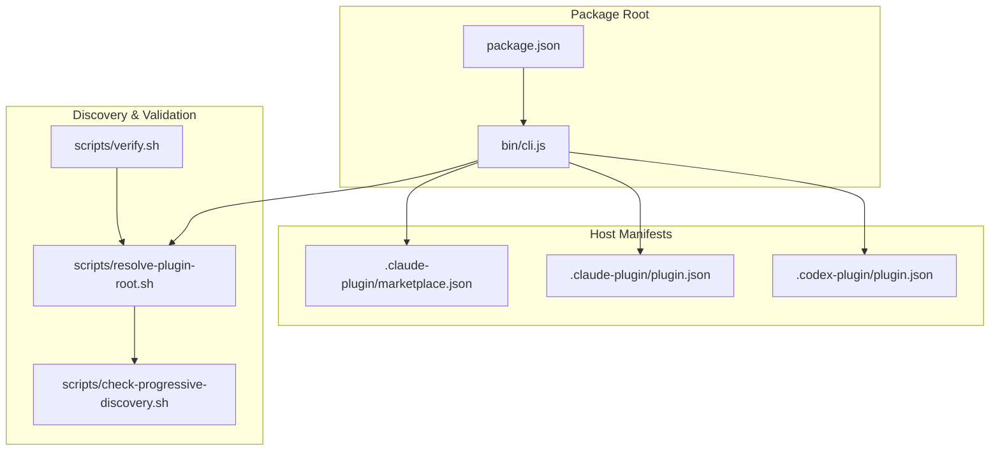
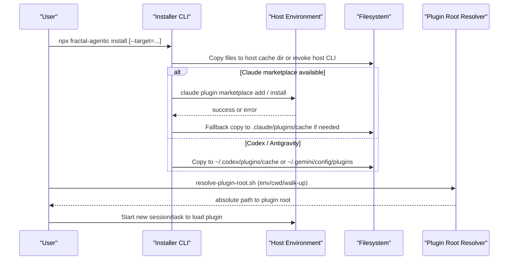
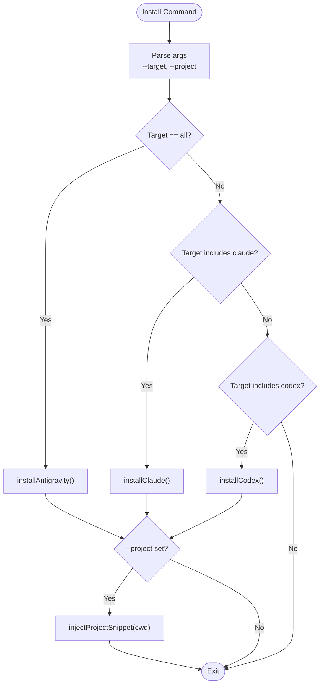
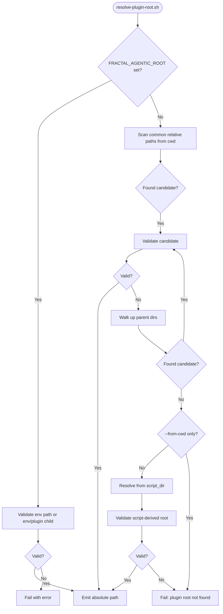
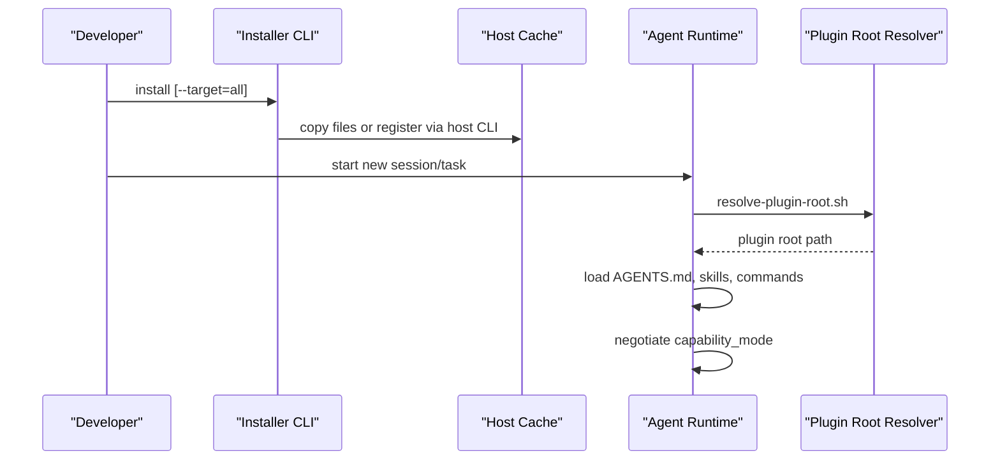
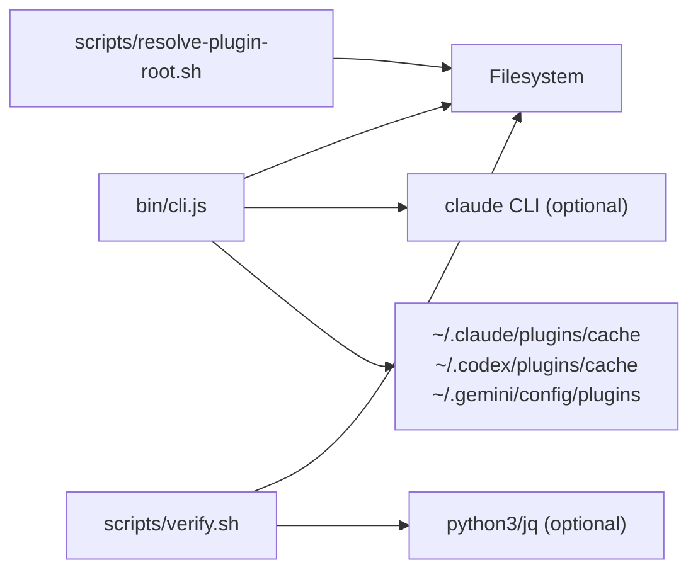

# Host Discovery & Loading

<cite>
**Referenced Files in This Document**
- [package.json](file://packages/fractal-agentic/package.json)
- [cli.js](file://packages/fractal-agentic/bin/cli.js)
- [marketplace.json (Claude)](file://packages/fractal-agentic/.claude-plugin/marketplace.json)
- [plugin.json (Claude shim)](file://packages/fractal-agentic/.claude-plugin/plugin.json)
- [PLUGIN_SCHEMA_NOTES.md (Claude)](file://packages/fractal-agentic/.claude-plugin/PLUGIN_SCHEMA_NOTES.md)
- [plugin.json (Codex shim)](file://packages/fractal-agentic/.codex-plugin/plugin.json)
- [resolve-plugin-root.sh](file://packages/fractal-agentic/scripts/resolve-plugin-root.sh)
- [check-progressive-discovery.sh](file://packages/fractal-agentic/scripts/check-progressive-discovery.sh)
- [verify.sh](file://packages/fractal-agentic/scripts/verify.sh)
- [02-install.md](file://packages/fractal-agentic/docs/02-install.md)
- [troubleshooting.md](file://packages/fractal-agentic/docs/troubleshooting.md)
- [capability-mode.md](file://packages/fractal-agentic/skills/boss-orchestration/references/capability-mode.md)
- [AGENTS-SNIPPET.md](file://packages/fractal-agentic/project-integration/AGENTS-SNIPPET.md)
</cite>

## Table of Contents
1. Introduction
2. Project Structure
3. Core Components
4. Architecture Overview
5. Detailed Component Analysis
6. Dependency Analysis
7. Performance Considerations
8. Troubleshooting Guide
9. Conclusion

## Introduction
This document explains how the system discovers available hosts (Claude Code, Codex, Google Antigravity/Gemini, and others) and loads their respective plugins. It covers:
- How host manifests are structured and used for discovery
- The plugin initialization sequence across hosts
- Capability negotiation and version compatibility checks
- Error handling, fallback mechanisms, and debugging techniques
- Guidance for creating custom host integrations and registering new platforms

The implementation is multi-host by design: a single package ships host-specific manifests and a unified installer that detects and installs into each supported environment.

## Project Structure
At a high level, the repository exposes:
- A Node CLI entry point for installation and verification
- Host-specific plugin manifests under hidden directories
- Shell scripts to resolve the plugin root from various locations
- Documentation describing installation methods and troubleshooting

**Diagram sources**
- [package.json](file://packages/fractal-agentic/package.json)
- [cli.js](file://packages/fractal-agentic/bin/cli.js)
- [marketplace.json (Claude)](file://packages/fractal-agentic/.claude-plugin/marketplace.json)
- [plugin.json (Claude shim)](file://packages/fractal-agentic/.claude-plugin/plugin.json)
- [plugin.json (Codex shim)](file://packages/fractal-agentic/.codex-plugin/plugin.json)
- [resolve-plugin-root.sh](file://packages/fractal-agentic/scripts/resolve-plugin-root.sh)
- [check-progressive-discovery.sh](file://packages/fractal-agentic/scripts/check-progressive-discovery.sh)
- [verify.sh](file://packages/fractal-agentic/scripts/verify.sh)

**Section sources**
- [package.json](file://packages/fractal-agentic/package.json)
- [02-install.md](file://packages/fractal-agentic/docs/02-install.md)

## Core Components
- Installer CLI: Detects target hosts and performs installation with fallback strategies.
- Host manifests: Define identity, UI hints, and marketplace entries per host.
- Plugin root resolver: Locates the plugin directory at runtime using environment variables, cwd heuristics, and filesystem walking.
- Verification suite: Validates manifests, skills, commands, and non-blocking policies.

Key responsibilities:
- Host detection and installation paths
- Marketplace registration attempts with safe fallbacks
- Runtime resolution of plugin root for agents and tools
- Structural and semantic validation of plugin assets

**Section sources**
- [cli.js](file://packages/fractal-agentic/bin/cli.js)
- [resolve-plugin-root.sh](file://packages/fractal-agentic/scripts/resolve-plugin-root.sh)
- [verify.sh](file://packages/fractal-agentic/scripts/verify.sh)

## Architecture Overview
The system uses a layered approach:
- Layer A: Package metadata and CLI entry points
- Layer B: Host-specific manifests and catalogs
- Layer C: Runtime discovery and capability negotiation
- Layer D: Optional hooks and session lifecycle integration

**Diagram sources**
- [cli.js](file://packages/fractal-agentic/bin/cli.js)
- [resolve-plugin-root.sh](file://packages/fractal-agentic/scripts/resolve-plugin-root.sh)

## Detailed Component Analysis

### Installer CLI (Host Detection and Installation)
Responsibilities:
- Parse arguments to select target host(s)
- Attempt official marketplace integration when possible
- Fall back to direct file copying into host-specific cache directories
- Optionally inject project-level AGENTS snippet

Behavior highlights:
- Claude: tries marketplace add/install; falls back to copying into .claude/plugins/cache
- Codex: copies into ~/.codex/plugins/cache
- Antigravity (Gemini): copies into ~/.gemini/config/plugins
- Project injection: prepends an AGENTS snippet to the current project’s AGENTS.md if requested

**Diagram sources**
- [cli.js](file://packages/fractal-agentic/bin/cli.js)

**Section sources**
- [cli.js](file://packages/fractal-agentic/bin/cli.js)

### Host Manifests and Schemas

#### Claude Code
- marketplace.json: Catalog entry pointing to the plugin source.
- plugin.json (under .claude-plugin): Lean identity manifest with name, version, description, author. Keep fields minimal to avoid unknown-field rejections.

Required fields observed:
- name
- version
- description
- author.name

Optional fields observed:
- homepage, repository, license, keywords

Notes:
- Prefer keeping the manifest lean; undocumented validators may reject extra fields.

**Section sources**
- [marketplace.json (Claude)](file://packages/fractal-agentic/.claude-plugin/marketplace.json)
- [plugin.json (Claude shim)](file://packages/fractal-agentic/.claude-plugin/plugin.json)
- [PLUGIN_SCHEMA_NOTES.md (Claude)](file://packages/fractal-agentic/.claude-plugin/PLUGIN_SCHEMA_NOTES.md)

#### Codex
- plugin.json (under .codex-plugin): Identity manifest including display interface and skills path.

Required fields observed:
- name
- version
- description
- author.name

Optional fields observed:
- interface.displayName, interface.shortDescription, interface.longDescription, interface.defaultPrompt
- skills (path to skills directory)
- keywords

**Section sources**
- [plugin.json (Codex shim)](file://packages/fractal-agentic/.codex-plugin/plugin.json)

#### Antigravity (Google Gemini)
- No dedicated manifest required beyond the core plugin.json at the plugin root.
- Installation targets ~/.gemini/config/plugins/<name>.

Core plugin.json fields observed:
- name
- version
- description
- author.name
- homepage, repository, license, keywords

**Section sources**
- [package.json](file://packages/fractal-agentic/package.json)

### Plugin Root Resolution (Runtime Discovery)
The resolver determines the plugin root using:
- Explicit environment variable FRACTAL_AGENTIC_ROOT
- Common monorepo-relative candidates from cwd
- Upward walk until a valid plugin root is found
- Fallback to script location if not restricted to cwd-only mode

Validation criteria for a valid plugin root include presence of:
- plugin.json with expected name
- AGENTS.md
- docs/bosses/INDEX.md and nested boss INDEX files
- skills/boss-orchestration/SKILL.md
- commands/orchestrate.md

**Diagram sources**
- [resolve-plugin-root.sh](file://packages/fractal-agentic/scripts/resolve-plugin-root.sh)

**Section sources**
- [resolve-plugin-root.sh](file://packages/fractal-agentic/scripts/resolve-plugin-root.sh)

### Capability Negotiation and Version Compatibility
Capability negotiation occurs at runtime based on what the host exposes:
- pinned: full pins available and used
- pinned_partial: partial pins used where exposed
- degraded: no pins; continue with documented degraded behavior
- plugin_missing: plugin not installed; work continues without plugin features

Version compatibility:
- Hosts read plugin.json version; keep versions consistent across manifests
- Installer ensures idempotent installs and refuses conflicts without mutation

Reporting:
- Orchestration outputs capability_mode and pin status for transparency

**Section sources**
- [capability-mode.md](file://packages/fractal-agentic/skills/boss-orchestration/references/capability-mode.md)
- [verify.sh](file://packages/fractal-agentic/scripts/verify.sh)

### Initialization Sequence Across Hosts
Typical flow:
1. Installer runs and copies files or invokes host CLI
2. Host caches plugin content in its plugin directory
3. Agent/runtime resolves plugin root via environment or discovery
4. New session/task loads plugin assets (AGENTS.md, skills, commands)
5. Capability negotiation sets mode based on available pins

**Diagram sources**
- [cli.js](file://packages/fractal-agentic/bin/cli.js)
- [resolve-plugin-root.sh](file://packages/fractal-agentic/scripts/resolve-plugin-root.sh)

## Dependency Analysis
The installer depends on:
- Filesystem operations for copying and directory creation
- Optional external CLIs (e.g., claude) for marketplace integration
- Shell scripts for validation and discovery

Manifest dependencies:
- Claude marketplace.json references plugin source
- Codex plugin.json defines UI and skills path
- Core plugin.json provides identity and metadata

**Diagram sources**
- [cli.js](file://packages/fractal-agentic/bin/cli.js)
- [resolve-plugin-root.sh](file://packages/fractal-agentic/scripts/resolve-plugin-root.sh)
- [verify.sh](file://packages/fractal-agentic/scripts/verify.sh)

**Section sources**
- [cli.js](file://packages/fractal-agentic/bin/cli.js)
- [verify.sh](file://packages/fractal-agentic/scripts/verify.sh)

## Performance Considerations
- Installer avoids heavy operations; prefers lightweight file copies and optional CLI calls.
- Plugin root resolution uses efficient heuristics and stops early upon finding a valid root.
- Verification suite validates JSON/TOML and structural integrity quickly; skip optional tools gracefully.

[No sources needed since this section provides general guidance]

## Troubleshooting Guide
Common issues and resolutions:
- Missing marketplace manifest for Codex: ensure sparse checkout includes both .agents/plugins and plugin directories.
- Plugin missing after upgrade: refresh host cache and start a new task/session.
- Claude-compatible host sees no commands: ensure loading the plugin directory containing .claude-plugin/plugin.json.
- Cursor ignores process: paste the AGENTS snippet and set FRACTAL_AGENTIC_ROOT.
- Hooks do nothing: ensure host registers hooks and FRACTAL_AGENTIC_ROOT is set.

Debugging techniques:
- Use resolve-plugin-root.sh to confirm plugin root accessibility.
- Run verify.sh to validate manifests, skills, and commands.
- Inspect host cache directories for correct file placement.

**Section sources**
- [troubleshooting.md](file://packages/fractal-agentic/docs/troubleshooting.md)
- [02-install.md](file://packages/fractal-agentic/docs/02-install.md)
- [AGENTS-SNIPPET.md](file://packages/fractal-agentic/project-integration/AGENTS-SNIPPET.md)

## Conclusion
The system provides a robust, multi-host plugin discovery and loading mechanism:
- Clear separation of concerns between installer, manifests, and runtime discovery
- Graceful fallbacks and explicit error handling
- Strong validation and verification tooling
- Flexible capability negotiation ensuring work proceeds even in degraded modes

For custom host integrations:
- Add a host-specific plugin manifest with required fields
- Extend the installer to detect and install into the host’s plugin directory
- Ensure runtime resolution supports your host’s conventions
- Update documentation and verification scripts accordingly

[No sources needed since this section summarizes without analyzing specific files]