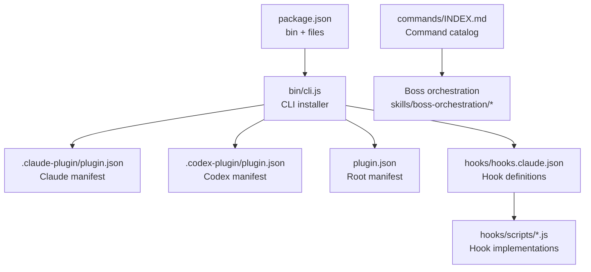
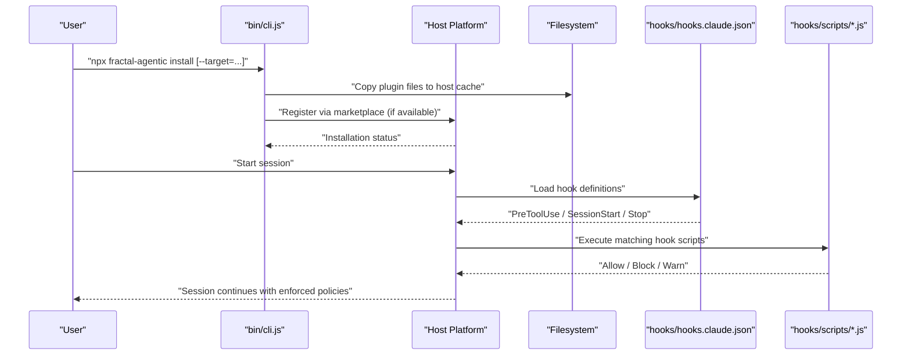
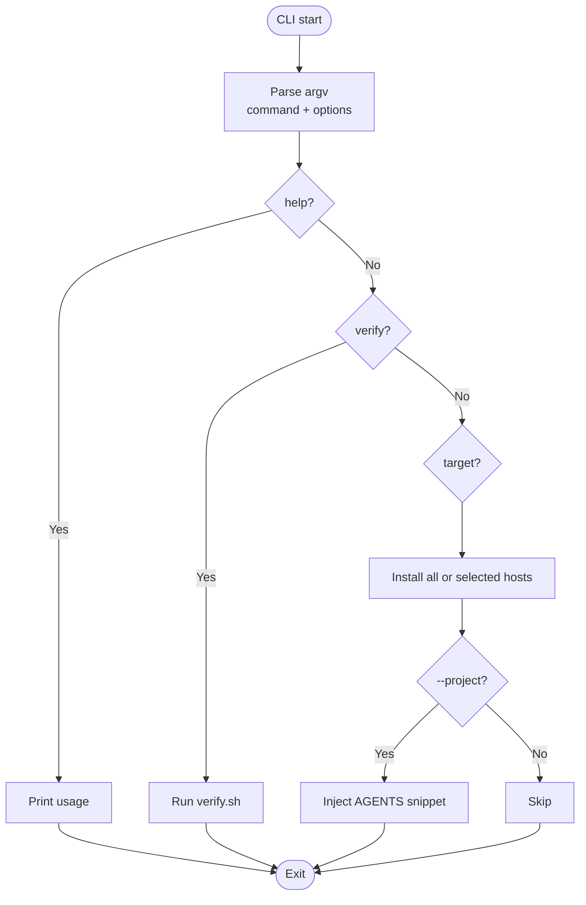
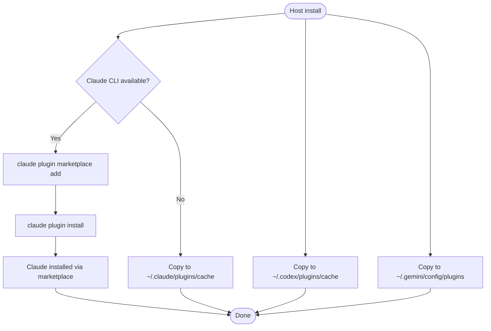
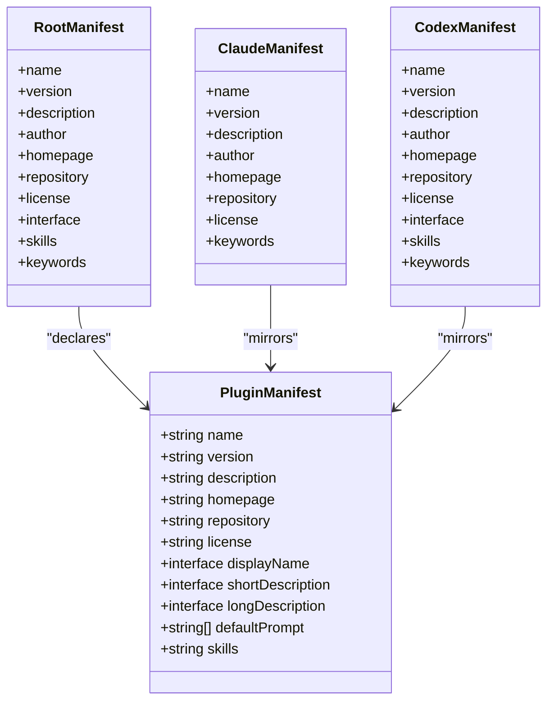
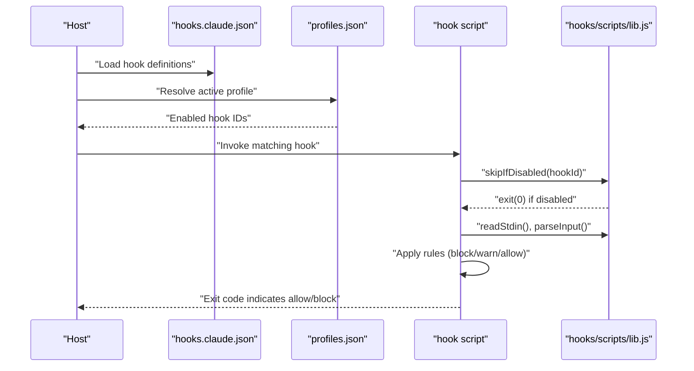
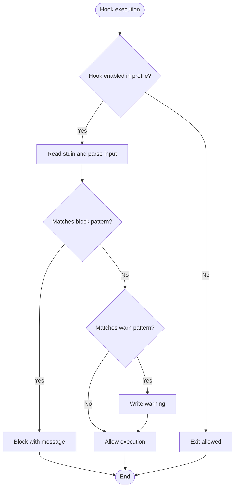
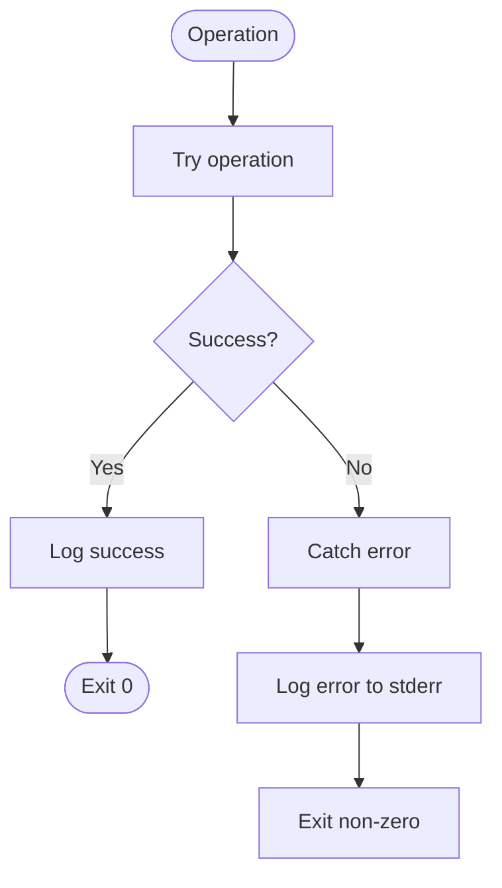
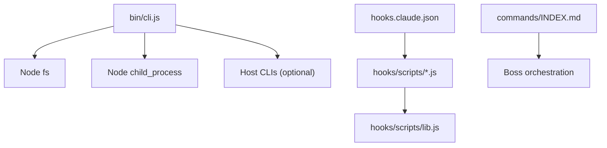

# Host Integration

<cite>
**Referenced Files in This Document**
- [cli.js](file://fractal-agentic/bin/cli.js)
- [package.json](file://fractal-agentic/package.json)
- [plugin.json](file://fractal-agentic/plugin.json)
- [.claude-plugin/plugin.json](file://fractal-agentic/.claude-plugin/plugin.json)
- [.codex-plugin/plugin.json](file://fractal-agentic/.codex-plugin/plugin.json)
- [hooks.claude.json](file://fractal-agentic/hooks/hooks.claude.json)
- [profiles.json](file://fractal-agentic/hooks/profiles.json)
- [lib.js](file://fractal-agentic/hooks/scripts/lib.js)
- [pre-bash-safety.js](file://fractal-agentic/hooks/scripts/pre-bash-safety.js)
- [pre-config-protection.js](file://fractal-agentic/hooks/scripts/pre-config-protection.js)
- [INDEX.md](file://fractal-agentic/commands/INDEX.md)
- [verify.sh](file://fractal-agentic/scripts/verify.sh)
- [CUSTOMIZE.md](file://fractal-agentic/CUSTOMIZE.md)
</cite>

## Table of Contents
1. [Introduction](#introduction)
2. [Project Structure](#project-structure)
3. [Core Components](#core-components)
4. [Architecture Overview](#architecture-overview)
5. [Detailed Component Analysis](#detailed-component-analysis)
6. [Dependency Analysis](#dependency-analysis)
7. [Performance Considerations](#performance-considerations)
8. [Troubleshooting Guide](#troubleshooting-guide)
9. [Conclusion](#conclusion)

## Introduction
This document explains how Fractal Agentic integrates with host platforms (Claude Code, Codex, and Antigravity/Gemini), including discovery, plugin loading, capability negotiation, CLI entry points, command routing, lifecycle hooks, authentication and permissions, error handling, logging, debugging, and performance considerations. It is designed for both technical and non-technical readers to understand the end-to-end integration flow and how plugins register capabilities and handle lifecycle events across hosts.

## Project Structure
Fractal Agentic exposes a Node CLI that installs and configures the plugin for multiple hosts. The package declares its main manifest and bin entry, while host-specific manifests live under .claude-plugin and .codex-plugin directories. Hooks are defined declaratively for Claude-compatible sessions and executed via small Node scripts. Commands are documented as Markdown files with frontmatter, forming a living index used by the startup router and boss playbooks.

**Diagram sources**
- [package.json:1-59](file://fractal-agentic/package.json#L1-L59)
- [cli.js:1-148](file://fractal-agentic/bin/cli.js#L1-L148)
- [.claude-plugin/plugin.json:1-20](file://fractal-agentic/.claude-plugin/plugin.json#L1-L20)
- [.codex-plugin/plugin.json:1-28](file://fractal-agentic/.codex-plugin/plugin.json#L1-L28)
- [plugin.json:1-31](file://fractal-agentic/plugin.json#L1-L31)
- [hooks.claude.json:1-87](file://fractal-agentic/hooks/hooks.claude.json#L1-L87)
- [INDEX.md:1-68](file://fractal-agentic/commands/INDEX.md#L1-L68)

**Section sources**
- [package.json:1-59](file://fractal-agentic/package.json#L1-L59)
- [cli.js:1-148](file://fractal-agentic/bin/cli.js#L1-L148)
- [plugin.json:1-31](file://fractal-agentic/plugin.json#L1-L31)
- [.claude-plugin/plugin.json:1-20](file://fractal-agentic/.claude-plugin/plugin.json#L1-L20)
- [.codex-plugin/plugin.json:1-28](file://fractal-agentic/.codex-plugin/plugin.json#L1-L28)
- [hooks.claude.json:1-87](file://fractal-agentic/hooks/hooks.claude.json#L1-L87)
- [INDEX.md:1-68](file://fractal-agentic/commands/INDEX.md#L1-L68)

## Core Components
- CLI Installer: Discovers target hosts and installs plugin artifacts or registers via host CLI where available.
- Plugin Manifests: Declare display names, descriptions, default prompts, and skills paths per host.
- Hook System: Declarative hook definitions for session lifecycle and tool usage, implemented by Node scripts.
- Command Catalog: Markdown-based commands with frontmatter describing triggers and behavior.
- Verification Suite: Shell script validating manifests, templates, contracts, and installer behavior.

Key responsibilities:
- Host discovery and installation strategy selection
- Capability declaration through manifests and skills
- Lifecycle event injection via hooks
- Command routing via documentation-driven indexes
- Security gating via pre-execution hooks

**Section sources**
- [cli.js:1-148](file://fractal-agentic/bin/cli.js#L1-L148)
- [plugin.json:1-31](file://fractal-agentic/plugin.json#L1-L31)
- [.claude-plugin/plugin.json:1-20](file://fractal-agentic/.claude-plugin/plugin.json#L1-L20)
- [.codex-plugin/plugin.json:1-28](file://fractal-agentic/.codex-plugin/plugin.json#L1-L28)
- [hooks.claude.json:1-87](file://fractal-agentic/hooks/hooks.claude.json#L1-L87)
- [INDEX.md:1-68](file://fractal-agentic/commands/INDEX.md#L1-L68)

## Architecture Overview
The integration architecture centers on a Node CLI that performs host-specific installation and optional project snippet injection. Hosts discover the plugin via their own mechanisms (marketplace or cache directories). During runtime, Claude-compatible sessions execute hooks at specific lifecycle points. Commands are surfaced through Markdown catalogs and consumed by the orchestrator.

**Diagram sources**
- [cli.js:1-148](file://fractal-agentic/bin/cli.js#L1-L148)
- [hooks.claude.json:1-87](file://fractal-agentic/hooks/hooks.claude.json#L1-L87)

**Section sources**
- [cli.js:1-148](file://fractal-agentic/bin/cli.js#L1-L148)
- [hooks.claude.json:1-87](file://fractal-agentic/hooks/hooks.claude.json#L1-L87)

## Detailed Component Analysis

### CLI Entry Points and Command Routing
- Entry point: Node binary declared in package.json maps to bin/cli.js.
- Commands exposed:
  - install: Installs plugin for detected hosts; supports --target and --project flags.
  - verify: Runs verification suite.
  - help: Prints usage.
- Routing logic:
  - Parses argv for command and options.
  - Dispatches to host-specific installers or project snippet injector.
  - Invokes external shell scripts for verification.

**Diagram sources**
- [cli.js:1-148](file://fractal-agentic/bin/cli.js#L1-L148)
- [package.json:1-59](file://fractal-agentic/package.json#L1-L59)

**Section sources**
- [package.json:1-59](file://fractal-agentic/package.json#L1-L59)
- [cli.js:1-148](file://fractal-agentic/bin/cli.js#L1-L148)

### Host Discovery and Plugin Loading
- Claude:
  - Attempts official marketplace add and install if claude CLI is present.
  - Falls back to copying plugin into ~/.claude/plugins/cache/fractal-agentic.
- Codex:
  - Copies plugin into ~/.codex/plugins/cache/fractal-agentic.
- Antigravity (Gemini):
  - Copies plugin into ~/.gemini/config/plugins/fractal-agentic.
- Exclusions:
  - Certain repo/packaging files are excluded from copied content.

**Diagram sources**
- [cli.js:1-148](file://fractal-agentic/bin/cli.js#L1-L148)

**Section sources**
- [cli.js:1-148](file://fractal-agentic/bin/cli.js#L1-L148)

### Capability Negotiation and Registration
- Root manifest (plugin.json) defines display name, description, default prompts, and skills path.
- Host-specific manifests (.claude-plugin/plugin.json, .codex-plugin/plugin.json) mirror metadata and may include interface fields tailored to each host.
- Skills directory is referenced by manifests to expose reusable capabilities.

**Diagram sources**
- [plugin.json:1-31](file://fractal-agentic/plugin.json#L1-L31)
- [.claude-plugin/plugin.json:1-20](file://fractal-agentic/.claude-plugin/plugin.json#L1-L20)
- [.codex-plugin/plugin.json:1-28](file://fractal-agentic/.codex-plugin/plugin.json#L1-L28)

**Section sources**
- [plugin.json:1-31](file://fractal-agentic/plugin.json#L1-L31)
- [.claude-plugin/plugin.json:1-20](file://fractal-agentic/.claude-plugin/plugin.json#L1-L20)
- [.codex-plugin/plugin.json:1-28](file://fractal-agentic/.codex-plugin/plugin.json#L1-L28)

### Lifecycle Events and Hook Execution
- Hook definitions are provided in hooks.claude.json with matchers for PreToolUse, SessionStart, and Stop.
- Profiles control which hooks are active (minimal, standard, strict).
- Hook scripts implement safety checks and policy enforcement using lib utilities.

**Diagram sources**
- [hooks.claude.json:1-87](file://fractal-agentic/hooks/hooks.claude.json#L1-L87)
- [profiles.json:1-38](file://fractal-agentic/hooks/profiles.json#L1-L38)
- [lib.js:110-136](file://fractal-agentic/hooks/scripts/lib.js#L110-L136)
- [pre-bash-safety.js:1-42](file://fractal-agentic/hooks/scripts/pre-bash-safety.js#L1-L42)
- [pre-config-protection.js:1-66](file://fractal-agentic/hooks/scripts/pre-config-protection.js#L1-L66)

**Section sources**
- [hooks.claude.json:1-87](file://fractal-agentic/hooks/hooks.claude.json#L1-L87)
- [profiles.json:1-38](file://fractal-agentic/hooks/profiles.json#L1-L38)
- [lib.js:110-136](file://fractal-agentic/hooks/scripts/lib.js#L110-L136)
- [pre-bash-safety.js:1-42](file://fractal-agentic/hooks/scripts/pre-bash-safety.js#L1-L42)
- [pre-config-protection.js:1-66](file://fractal-agentic/hooks/scripts/pre-config-protection.js#L1-L66)

### Authentication Methods and Permission Models
- Authentication is delegated to host systems (e.g., Claude CLI marketplace registration).
- Permissions are enforced via hooks:
  - Bash safety hook blocks dangerous commands and warns risky patterns.
  - Config protection hook prevents unauthorized edits to critical configuration files.
- Profiles allow toggling strictness and enabling/disabling specific hooks.

**Diagram sources**
- [pre-bash-safety.js:1-42](file://fractal-agentic/hooks/scripts/pre-bash-safety.js#L1-L42)
- [pre-config-protection.js:1-66](file://fractal-agentic/hooks/scripts/pre-config-protection.js#L1-L66)
- [profiles.json:1-38](file://fractal-agentic/hooks/profiles.json#L1-L38)

**Section sources**
- [pre-bash-safety.js:1-42](file://fractal-agentic/hooks/scripts/pre-bash-safety.js#L1-L42)
- [pre-config-protection.js:1-66](file://fractal-agentic/hooks/scripts/pre-config-protection.js#L1-L66)
- [profiles.json:1-38](file://fractal-agentic/hooks/profiles.json#L1-L38)

### Error Handling Patterns and Logging Requirements
- CLI uses try/catch around host installations and prints errors to stderr.
- Hook scripts write warnings to stderr and exit codes indicate allow/block decisions.
- Verification suite enforces structure and correctness, failing fast on mismatches.

**Diagram sources**
- [cli.js:1-148](file://fractal-agentic/bin/cli.js#L1-L148)
- [lib.js:110-136](file://fractal-agentic/hooks/scripts/lib.js#L110-L136)
- [verify.sh:1-274](file://fractal-agentic/scripts/verify.sh#L1-L274)

**Section sources**
- [cli.js:1-148](file://fractal-agentic/bin/cli.js#L1-L148)
- [lib.js:110-136](file://fractal-agentic/hooks/scripts/lib.js#L110-L136)
- [verify.sh:1-274](file://fractal-agentic/scripts/verify.sh#L1-L274)

### Debugging Techniques
- Use the verify command to run comprehensive checks on manifests, templates, and installer behavior.
- Inspect hook profiles and enable/disable hooks via environment variables when needed.
- Review stderr logs from CLI and hook scripts to diagnose failures.

**Section sources**
- [cli.js:1-148](file://fractal-agentic/bin/cli.js#L1-L148)
- [verify.sh:1-274](file://fractal-agentic/scripts/verify.sh#L1-L274)

## Dependency Analysis
The CLI depends on Node filesystem and child_process modules, and optionally invokes host CLIs. Hook scripts depend on shared utilities for reading inputs, parsing, and enforcing profiles. Command documentation serves as an index for the orchestrator.

**Diagram sources**
- [cli.js:1-148](file://fractal-agentic/bin/cli.js#L1-L148)
- [hooks.claude.json:1-87](file://fractal-agentic/hooks/hooks.claude.json#L1-L87)
- [lib.js:110-136](file://fractal-agentic/hooks/scripts/lib.js#L110-L136)
- [INDEX.md:1-68](file://fractal-agentic/commands/INDEX.md#L1-L68)

**Section sources**
- [cli.js:1-148](file://fractal-agentic/bin/cli.js#L1-L148)
- [hooks.claude.json:1-87](file://fractal-agentic/hooks/hooks.claude.json#L1-L87)
- [lib.js:110-136](file://fractal-agentic/hooks/scripts/lib.js#L110-L136)
- [INDEX.md:1-68](file://fractal-agentic/commands/INDEX.md#L1-L68)

## Performance Considerations
- Installation overhead: Copying plugin files is lightweight; marketplace registration adds network latency but provides centralized management.
- Hook execution: Short timeouts ensure hooks do not block sessions excessively.
- Memory management: Hook scripts read minimal input and exit promptly; avoid large data processing in hooks.
- Resource optimization: Exclude unnecessary files during copy to reduce disk footprint.

[No sources needed since this section provides general guidance]

## Troubleshooting Guide
- If installation fails:
  - Check stderr output from CLI for error messages.
  - Ensure host CLIs are available in PATH for marketplace operations.
  - Verify file permissions and home directory paths.
- If hooks are not running:
  - Confirm the active profile includes the desired hook IDs.
  - Validate hook scripts are executable and Node is available.
- If commands are missing:
  - Ensure commands/INDEX.md is up to date and frontmatter is valid.
  - Run verify to detect structural issues.

**Section sources**
- [cli.js:1-148](file://fractal-agentic/bin/cli.js#L1-L148)
- [hooks.claude.json:1-87](file://fractal-agentic/hooks/hooks.claude.json#L1-L87)
- [verify.sh:1-274](file://fractal-agentic/scripts/verify.sh#L1-L274)

## Conclusion
Fractal Agentic provides a robust, host-agnostic integration layer with explicit CLI-driven installation, declarative hook-based security policies, and a documentation-centric command system. By leveraging host-specific manifests and a standardized hook framework, it ensures secure, configurable, and maintainable integrations across Claude Code, Codex, and Antigravity/Gemini. The verification suite and structured logging facilitate reliable deployment and troubleshooting.

[No sources needed since this section summarizes without analyzing specific files]