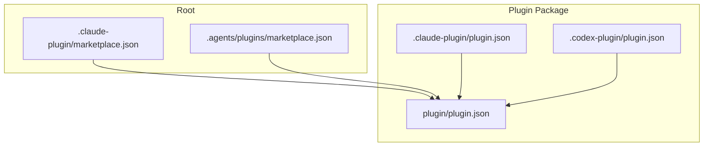
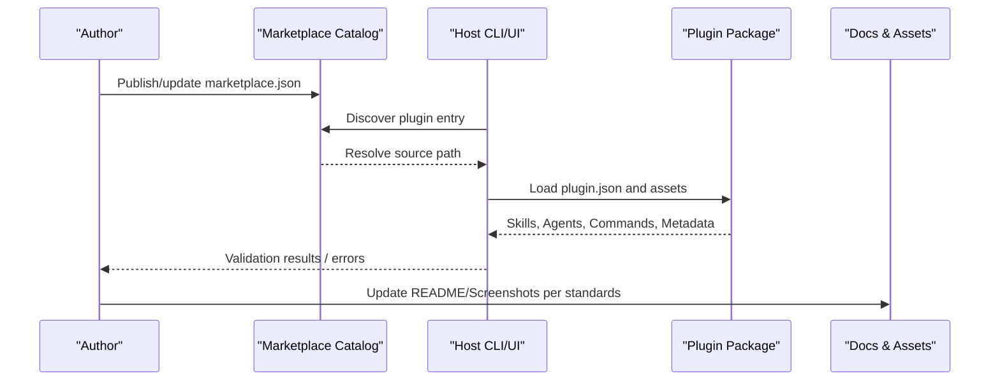
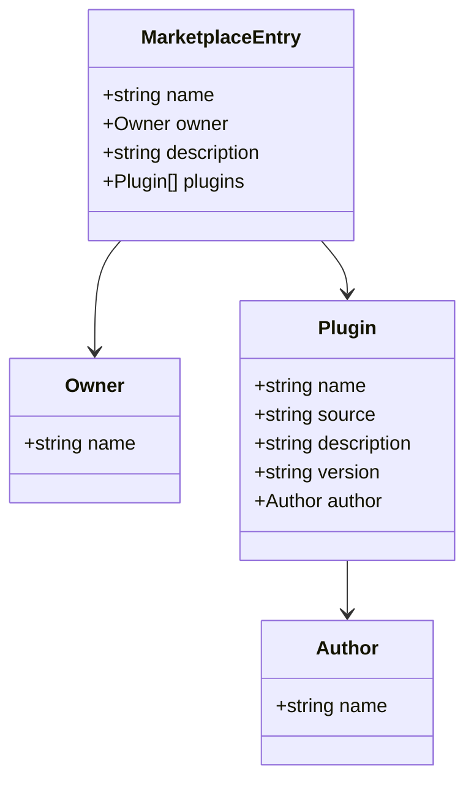
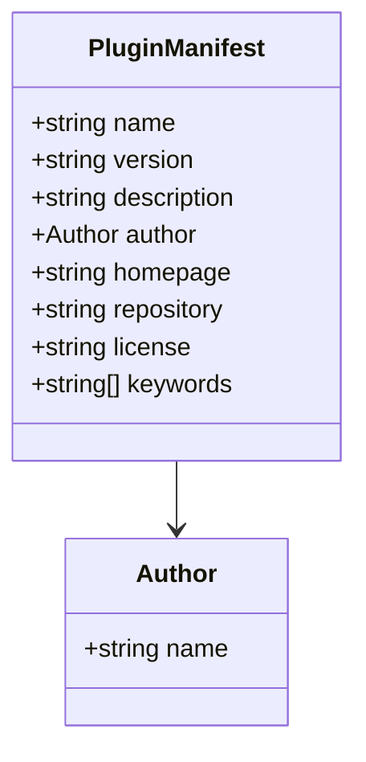
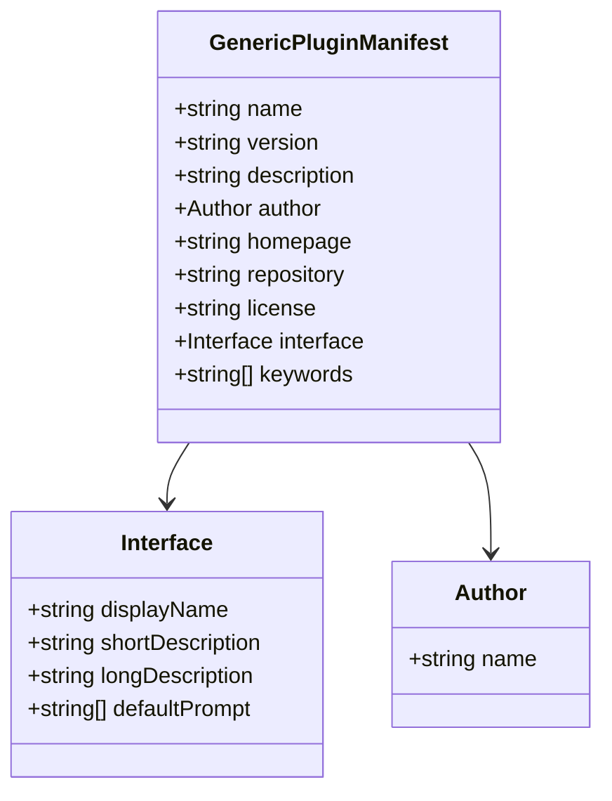
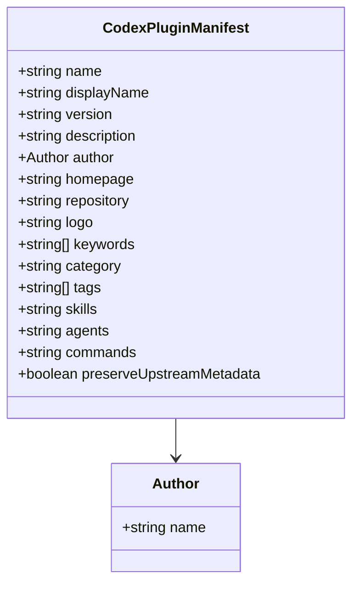
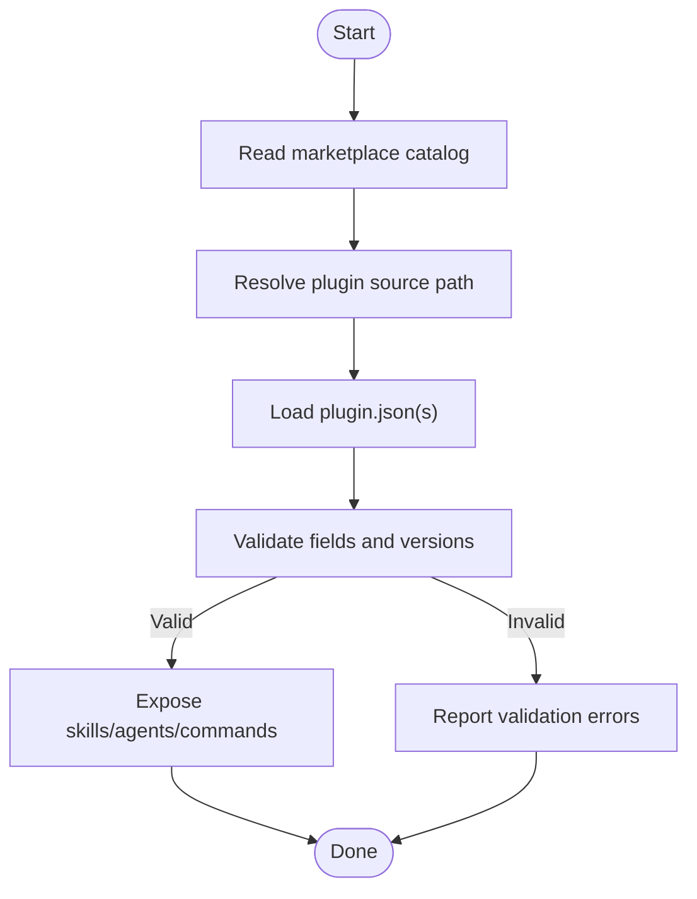
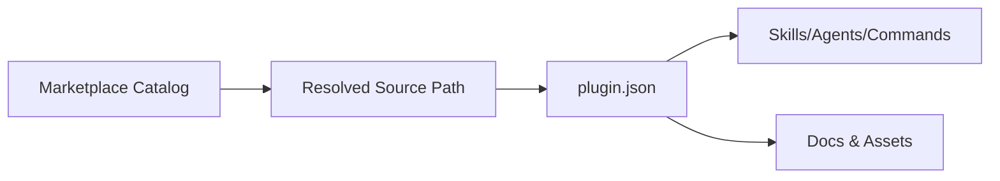

# Listing Requirements & Review

<cite>
**Referenced Files in This Document**
- [marketplace.json](file://fractal-agentic/.claude-plugin/marketplace.json)
- [plugin.json](file://fractal-agentic/.claude-plugin/plugin.json)
- [PLUGIN_SCHEMA_NOTES.md](file://fractal-agentic/.claude-plugin/PLUGIN_SCHEMA_NOTES.md)
- [plugin.json](file://fractal-agentic/plugin.json)
- [plugin.json](file://fractal-agentic-qoder-plugin/.qoder-plugin/plugin.json)
- [02-install.md](file://fractal-agentic/docs/02-install.md)
- [README.md](file://fractal-agentic/README.md)
- [check-nonblocking-policy.sh](file://fractal-agentic/scripts/check-nonblocking-policy.sh)
</cite>

## Table of Contents
1. [Introduction](#introduction)
2. [Project Structure](#project-structure)
3. [Core Components](#core-components)
4. [Architecture Overview](#architecture-overview)
5. [Detailed Component Analysis](#detailed-component-analysis)
6. [Dependency Analysis](#dependency-analysis)
7. [Performance Considerations](#performance-considerations)
8. [Troubleshooting Guide](#troubleshooting-guide)
9. [Conclusion](#conclusion)

## Introduction
This document defines the marketplace listing requirements and review procedures for plugins distributed via this repository’s multi-host setup. It focuses on:
- The marketplace.json configuration structure and required metadata fields
- Plugin specifications across hosts (Claude Code, Codex, Antigravity/Gemini)
- Review process, approval criteria, and common rejection reasons
- Screenshot and documentation standards
- Compliance requirements, security reviews, and policy adherence
- Troubleshooting guidance for common listing issues and revision processes

The goal is to help authors produce listings that pass automated checks and human review consistently.

## Project Structure
The plugin distribution supports multiple marketplaces through dedicated manifests:
- Claude Code uses a root catalog under .claude-plugin/marketplace.json pointing to the plugin source
- Codex uses a root catalog under .agents/plugins/marketplace.json
- Antigravity/Gemini use plugin/plugin.json as the core manifest

**Diagram sources**
- [02-install.md:31-69](file://fractal-agentic/docs/02-install.md#L31-L69)

**Section sources**
- [02-install.md:31-69](file://fractal-agentic/docs/02-install.md#L31-L69)

## Core Components
- Marketplace catalogs define how hosts discover the plugin package and where to find its source.
- Plugin manifests define identity, versioning, description, author, keywords, and host-specific UI or capability bindings.
- Schema notes emphasize keeping manifests lean to avoid validator rejections.

Key files:
- Claude Code marketplace catalog: [marketplace.json](file://fractal-agentic/.claude-plugin/marketplace.json)
- Claude Code plugin identity: [plugin.json](file://fractal-agentic/.claude-plugin/plugin.json)
- Generic/Antigravity plugin manifest: [plugin.json](file://fractal-agentic/plugin.json)
- Codex plugin identity: [plugin.json](file://fractal-agentic-qoder-plugin/.qoder-plugin/plugin.json)
- Schema guidance: [PLUGIN_SCHEMA_NOTES.md](file://fractal-agentic/.claude-plugin/PLUGIN_SCHEMA_NOTES.md)

**Section sources**
- [marketplace.json:1-19](file://fractal-agentic/.claude-plugin/marketplace.json#L1-L19)
- [plugin.json:1-20](file://fractal-agentic/.claude-plugin/plugin.json#L1-L20)
- [plugin.json:1-31](file://fractal-agentic/plugin.json#L1-L31)
- [plugin.json:1-28](file://fractal-agentic-qoder-plugin/.qoder-plugin/plugin.json#L1-L28)
- [PLUGIN_SCHEMA_NOTES.md:1-22](file://fractal-agentic/.claude-plugin/PLUGIN_SCHEMA_NOTES.md#L1-L22)

## Architecture Overview
The listing pipeline connects host catalogs to the plugin package, which exposes skills, agents, commands, and documentation. Hosts validate manifests and load capabilities accordingly.

[No sources needed since this diagram shows conceptual workflow, not actual code structure]

## Detailed Component Analysis

### Marketplace Catalog (Claude Code)
- Purpose: Root catalog that points to the plugin source directory.
- Required fields observed: name, owner.name, description, plugins[].name, plugins[].source, plugins[].description, plugins[].version, plugins[].author.name.
- Best practices: Keep entries minimal; ensure version presence; keep descriptions concise and accurate.

**Diagram sources**
- [marketplace.json:1-19](file://fractal-agentic/.claude-plugin/marketplace.json#L1-L19)

**Section sources**
- [marketplace.json:1-19](file://fractal-agentic/.claude-plugin/marketplace.json#L1-L19)

### Plugin Manifest (Claude Code Identity)
- Fields include name, version, description, author, homepage, repository, license, keywords.
- Schema notes recommend keeping it lean and always including version.

**Diagram sources**
- [plugin.json:1-20](file://fractal-agentic/.claude-plugin/plugin.json#L1-L20)
- [PLUGIN_SCHEMA_NOTES.md:1-22](file://fractal-agentic/.claude-plugin/PLUGIN_SCHEMA_NOTES.md#L1-L22)

**Section sources**
- [plugin.json:1-20](file://fractal-agentic/.claude-plugin/plugin.json#L1-L20)
- [PLUGIN_SCHEMA_NOTES.md:1-22](file://fractal-agentic/.claude-plugin/PLUGIN_SCHEMA_NOTES.md#L1-L22)

### Plugin Manifest (Generic/Antigravity)
- Includes interface display fields (displayName, shortDescription, longDescription), default prompts, skills binding, and keywords.
- Ensures consistent metadata across hosts.

**Diagram sources**
- [plugin.json:1-31](file://fractal-agentic/plugin.json#L1-L31)

**Section sources**
- [plugin.json:1-31](file://fractal-agentic/plugin.json#L1-L31)

### Plugin Manifest (Codex)
- Adds UI/display fields like logo, category, tags, and explicit paths for skills, agents, commands.
- Supports preserving upstream metadata.

**Diagram sources**
- [plugin.json:1-28](file://fractal-agentic-qoder-plugin/.qoder-plugin/plugin.json#L1-L28)

**Section sources**
- [plugin.json:1-28](file://fractal-agentic-qoder-plugin/.qoder-plugin/plugin.json#L1-L28)

### Installation and Discovery Flow
- Hosts read their respective marketplace catalogs to locate the plugin source.
- After discovery, hosts load plugin manifests and expose capabilities.

**Diagram sources**
- [02-install.md:31-69](file://fractal-agentic/docs/02-install.md#L31-L69)

**Section sources**
- [02-install.md:31-69](file://fractal-agentic/docs/02-install.md#L31-L69)

## Dependency Analysis
- Marketplace catalogs depend on correct relative paths to the plugin source.
- Plugin manifests must be consistent across hosts to avoid mismatched behavior.
- Documentation and assets referenced by manifests must exist and be accessible.

[No sources needed since this diagram shows conceptual relationships]

**Section sources**
- [02-install.md:31-69](file://fractal-agentic/docs/02-install.md#L31-L69)

## Performance Considerations
- Keep manifests lean to reduce parsing overhead and validator rejections.
- Avoid unnecessary fields; rely on documented fields only.
- Ensure assets are appropriately sized and hosted locally within the plugin package when possible.

[No sources needed since this section provides general guidance]

## Troubleshooting Guide

Common listing issues and resolutions:
- Missing or incorrect source path in marketplace catalog: Verify the path resolves to the plugin root containing plugin.json.
- Unknown fields in plugin manifests: Remove undocumented fields per schema notes to prevent validator rejections.
- Version missing: Always include version in all manifests.
- Inconsistent metadata across hosts: Align name, version, description, and author across all plugin.json files.
- Non-blocking policy violations: Ensure documentation does not contain hard-gate phrases that could block product work.

Validation and verification steps:
- Run the verification suite to confirm progressive discovery, skills, commands, and non-blocking policies pass.
- Use health checks to confirm core files and critical skill paths are present.

Relevant scripts and docs:
- Verification suite and post-install checks: [02-install.md](file://fractal-agentic/docs/02-install.md)
- Non-blocking policy enforcement patterns: [check-nonblocking-policy.sh](file://fractal-agentic/scripts/check-nonblocking-policy.sh)
- General usage and integration: [README.md](file://fractal-agentic/README.md)

**Section sources**
- [02-install.md:187-198](file://fractal-agentic/docs/02-install.md#L187-L198)
- [check-nonblocking-policy.sh:32-74](file://fractal-agentic/scripts/check-nonblocking-policy.sh#L32-L74)
- [README.md:1-440](file://fractal-agentic/README.md#L1-L440)

## Conclusion
To achieve successful marketplace listings:
- Maintain lean, validated manifests with consistent metadata across hosts
- Ensure marketplace catalogs correctly resolve to the plugin source
- Follow documentation standards and provide clear screenshots and descriptions
- Adhere to compliance and non-blocking policies
- Use provided verification scripts to catch issues early

By aligning with these requirements and procedures, authors can streamline approvals and deliver reliable, high-quality plugin experiences across all supported hosts.