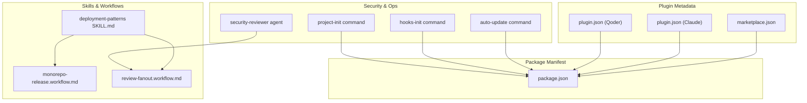
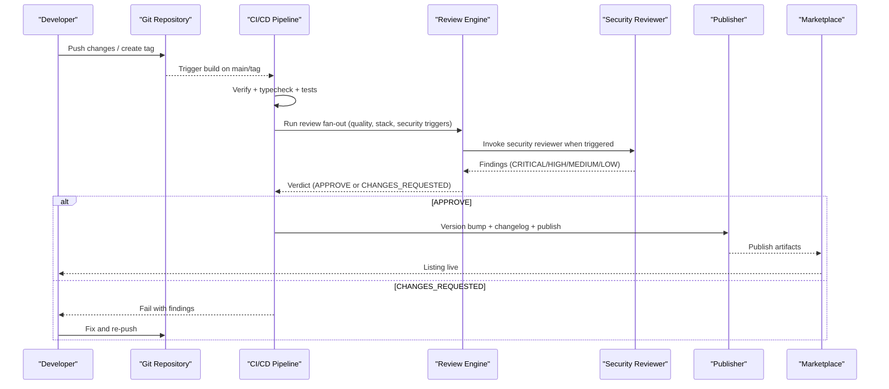
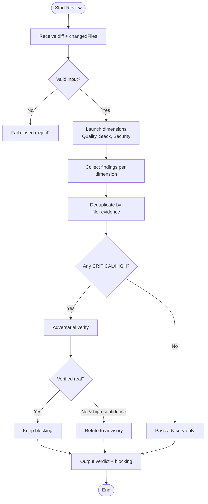
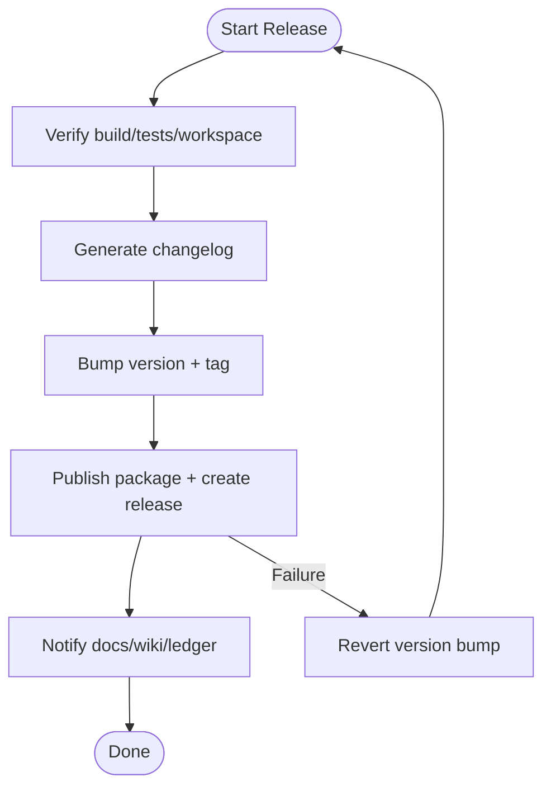
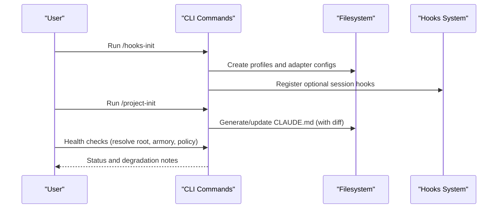
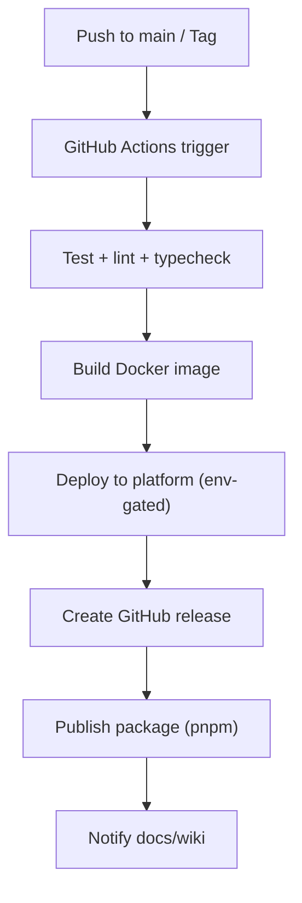
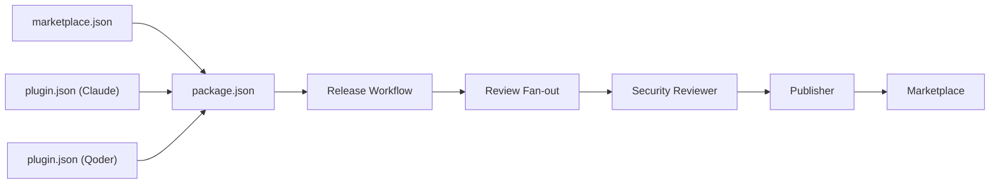

# Marketplace Deployment

<cite>
**Referenced Files in This Document**
- [marketplace.json (fractal-agentic)](file://fractal-agentic/.claude-plugin/marketplace.json)
- [plugin.json (fractal-agentic)](file://fractal-agentic/.claude-plugin/plugin.json)
- [package.json (fractal-agentic)](file://fractal-agentic/package.json)
- [TROUBLESHOOTING.md](file://fractal-agentic/TROUBLESHOOTING.md)
- [deployment-patterns SKILL.md](file://fractal-agentic/skills/deployment-patterns/SKILL.md)
- [monorepo-release.workflow.md](file://fractal-agentic/workflows/monorepo-release.workflow.md)
- [review-fanout.workflow.md](file://fractal-agentic/workflows/review-fanout.workflow.md)
- [security-reviewer agent](file://fractal-agentic/agents/security-reviewer.md)
- [auto-update command](file://fractal-agentic/commands/auto-update.md)
- [hooks-init command](file://fractal-agentic/commands/hooks-init.md)
- [project-init command](file://fractal-agentic/commands/project-init.md)
- [build-feature-end-to-end SKILL.md](file://fractal-agentic/skills/build-feature-end-to-end/SKILL.md)
- [plugin.json (qoder plugin)](file://fractal-agentic-qoder-plugin/.qoder-plugin/plugin.json)
</cite>

## Table of Contents
1. Introduction
2. Project Structure
3. Core Components
4. Architecture Overview
5. Detailed Component Analysis
6. Dependency Analysis
7. Performance Considerations
8. Troubleshooting Guide
9. Conclusion
10. Appendices

## Introduction
This document provides a comprehensive guide to marketplace deployment processes and distribution strategies for the Fractal Agentic plugins and related packages. It covers listing requirements, review procedures, approval workflows, update mechanisms, version management, rollback strategies, installation across environments, metadata standards, CI/CD automation, security reviews, compliance, and best practices for successful listings. The guidance is grounded in the repository’s configuration files, skills, workflows, and commands that define how releases are prepared, reviewed, published, and maintained.

## Project Structure
The marketplace-facing assets are primarily located under each plugin directory:
- .claude-plugin/marketplace.json defines marketplace metadata and plugin entries.
- .claude-plugin/plugin.json or .qoder-plugin/plugin.json defines package metadata, keywords, categories, and asset references.
- package.json declares publishable files, bin entry points, scripts, and repository information.
- skills/deployment-patterns/SKILL.md documents deployment strategies and CI/CD patterns.
- workflows/ monorepo-release.workflow.md and review-fanout.workflow.md specify release and multi-dimension review flows.
- agents/security-reviewer.md outlines security review expectations and checks.
- commands/auto-update.md, hooks-init.md, project-init.md provide operational utilities for updates and setup.

**Diagram sources**
- [marketplace.json (fractal-agentic):1-19](file://fractal-agentic/.claude-plugin/marketplace.json#L1-L19)
- [plugin.json (fractal-agentic):1-20](file://fractal-agentic/.claude-plugin/plugin.json#L1-L20)
- [plugin.json (qoder plugin):1-28](file://fractal-agentic-qoder-plugin/.qoder-plugin/plugin.json#L1-L28)
- [package.json (fractal-agentic):1-59](file://fractal-agentic/package.json#L1-L59)
- [deployment-patterns SKILL.md:1-80](file://fractal-agentic/skills/deployment-patterns/SKILL.md#L1-L80)
- [monorepo-release.workflow.md:1-59](file://fractal-agentic/workflows/monorepo-release.workflow.md#L1-L59)
- [review-fanout.workflow.md:1-111](file://fractal-agentic/workflows/review-fanout.workflow.md#L1-L111)
- [security-reviewer agent:37-122](file://fractal-agentic/agents/security-reviewer.md#L37-L122)
- [auto-update command:1-29](file://fractal-agentic/commands/auto-update.md#L1-L29)
- [hooks-init command:1-12](file://fractal-agentic/commands/hooks-init.md#L1-L12)
- [project-init command:69-87](file://fractal-agentic/commands/project-init.md#L69-L87)

**Section sources**
- [marketplace.json (fractal-agentic):1-19](file://fractal-agentic/.claude-plugin/marketplace.json#L1-L19)
- [plugin.json (fractal-agentic):1-20](file://fractal-agentic/.claude-plugin/plugin.json#L1-L20)
- [plugin.json (qoder plugin):1-28](file://fractal-agentic-qoder-plugin/.qoder-plugin/plugin.json#L1-L28)
- [package.json (fractal-agentic):1-59](file://fractal-agentic/package.json#L1-L59)

## Core Components
- Marketplace metadata: marketplace.json specifies name, owner, description, and plugin entries with source paths and versions.
- Package manifest: package.json lists publishable files, CLI binaries, scripts, repository links, and license.
- Plugin manifests: plugin.json files include display name, version, description, author, homepage, repository, logo, category, tags, and resource directories (skills, agents, commands).
- Release workflow: monorepo-release.workflow.md defines phases for verify, changelog, version bump, publish, and notify.
- Review workflow: review-fanout.workflow.md defines parallel multi-dimension review, deduplication, adversarial verification, and output schema.
- Security review: security-reviewer.md prescribes OWASP Top 10 checks, dependency audits, and emergency response steps.
- Update and setup: auto-update.md supports pulling upstream changes and reinstalling managed targets; hooks-init.md sets optional session hooks; project-init.md guides CLAUDE.md generation and install plans.

**Section sources**
- [marketplace.json (fractal-agentic):1-19](file://fractal-agentic/.claude-plugin/marketplace.json#L1-L19)
- [package.json (fractal-agentic):1-59](file://fractal-agentic/package.json#L1-L59)
- [plugin.json (fractal-agentic):1-20](file://fractal-agentic/.claude-plugin/plugin.json#L1-L20)
- [plugin.json (qoder plugin):1-28](file://fractal-agentic-qoder-plugin/.qoder-plugin/plugin.json#L1-L28)
- [monorepo-release.workflow.md:1-59](file://fractal-agentic/workflows/monorepo-release.workflow.md#L1-L59)
- [review-fanout.workflow.md:1-111](file://fractal-agentic/workflows/review-fanout.workflow.md#L1-L111)
- [security-reviewer agent:37-122](file://fractal-agentic/agents/security-reviewer.md#L37-L122)
- [auto-update command:1-29](file://fractal-agentic/commands/auto-update.md#L1-L29)
- [hooks-init command:1-12](file://fractal-agentic/commands/hooks-init.md#L1-L12)
- [project-init command:69-87](file://fractal-agentic/commands/project-init.md#L69-L87)

## Architecture Overview
The marketplace deployment architecture integrates metadata definitions, packaging, automated release, multi-dimensional review, and security validation into a cohesive pipeline.

**Diagram sources**
- [monorepo-release.workflow.md:1-59](file://fractal-agentic/workflows/monorepo-release.workflow.md#L1-L59)
- [review-fanout.workflow.md:1-111](file://fractal-agentic/workflows/review-fanout.workflow.md#L1-L111)
- [security-reviewer agent:37-122](file://fractal-agentic/agents/security-reviewer.md#L37-L122)
- [deployment-patterns SKILL.md:189-253](file://fractal-agentic/skills/deployment-patterns/SKILL.md#L189-L253)

## Detailed Component Analysis

### Marketplace Metadata and Listing Requirements
- marketplace.json fields:
  - name, owner.name, description, plugins[].name, plugins[].source, plugins[].description, plugins[].version, plugins[].author.name.
- plugin.json fields (Claude/Qoder):
  - name, displayName, version, description, author, homepage, repository, license, keywords, category, tags, logo, skills, agents, commands, preserveUpstreamMetadata.
- package.json fields:
  - name, version, description, main, bin, files, scripts, keywords, author, license, repository, bugs, homepage.

These files collectively define what the marketplace sees: identity, versioning, resources, and discoverability via keywords/tags/category. Ensure consistent version numbers across marketplace.json and plugin.json/package.json to avoid mismatches.

**Section sources**
- [marketplace.json (fractal-agentic):1-19](file://fractal-agentic/.claude-plugin/marketplace.json#L1-L19)
- [plugin.json (fractal-agentic):1-20](file://fractal-agentic/.claude-plugin/plugin.json#L1-L20)
- [plugin.json (qoder plugin):1-28](file://fractal-agentic-qoder-plugin/.qoder-plugin/plugin.json#L1-L28)
- [package.json (fractal-agentic):1-59](file://fractal-agentic/package.json#L1-L59)

### Review Procedures and Approval Workflows
- Review fan-out:
  - Dimensions: quality, stack-specific reviewers, security (triggered by diff content and file paths).
  - Deduplication by evidence snippet; keep strictest severity.
  - Adversarial verification for CRITICAL/HIGH findings; fail closed if unverified.
  - Output schema includes verdict, blocking/advisory lists, and stats.
- Approval mapping:
  - APPROVE maps to ship candidate; CHANGES_REQUESTED maps to fix-first.
  - Outer gates remain in primary session (plan approval, final commit, boss constraints).

**Diagram sources**
- [review-fanout.workflow.md:1-111](file://fractal-agentic/workflows/review-fanout.workflow.md#L1-L111)

**Section sources**
- [review-fanout.workflow.md:1-111](file://fractal-agentic/workflows/review-fanout.workflow.md#L1-L111)

### Update Mechanisms, Version Management, and Rollback Strategies
- Monorepo release workflow:
  - Phase 1 Verify: build, typecheck, tests, workspace deps check, changelog sanity.
  - Phase 2 Changelog: generate from conventional commits since last tag.
  - Phase 3 Version bump: determine major/minor/patch; confirm; update package.json; git tag v{version}.
  - Phase 4 Publish: pnpm publish with 2FA guard; gh release create with generated notes.
  - Phase 5 Notify: update docs site, wiki, log release.
- Safety rules:
  - Never publish without confirmation; verify 2FA; do not push tags on failure; revert version bump on publish failure.
- Rollback strategies:
  - Prefer hotfixes for minor issues; use full rollback for major issues and re-enter the feature workflow at implementation step.
- Auto-update:
  - Pull latest upstream changes and reinstall managed targets using recorded install-state; dry-run supported.

**Diagram sources**
- [monorepo-release.workflow.md:1-59](file://fractal-agentic/workflows/monorepo-release.workflow.md#L1-L59)
- [auto-update command:1-29](file://fractal-agentic/commands/auto-update.md#L1-L29)
- [build-feature-end-to-end SKILL.md:100-110](file://fractal-agentic/skills/build-feature-end-to-end/SKILL.md#L100-L110)

**Section sources**
- [monorepo-release.workflow.md:1-59](file://fractal-agentic/workflows/monorepo-release.workflow.md#L1-L59)
- [auto-update command:1-29](file://fractal-agentic/commands/auto-update.md#L1-L29)
- [build-feature-end-to-end SKILL.md:100-110](file://fractal-agentic/skills/build-feature-end-to-end/SKILL.md#L100-L110)

### Installation Procedures Across Environments and User Scenarios
- Hooks initialization:
  - Optional interactive setup for session hooks (profiles, host adapters); non-blocking and user-driven post-install.
- Project initialization:
  - Generate minimal CLAUDE.md based on detected build/test/lint/dev commands; never overwrite existing without diff and approval.
- Health checks:
  - Resolve plugin root, run armory checks, and non-blocking policy checks; missing pins/hooks/wiki degrade gracefully.

**Diagram sources**
- [hooks-init command:1-12](file://fractal-agentic/commands/hooks-init.md#L1-L12)
- [project-init command:69-87](file://fractal-agentic/commands/project-init.md#L69-L87)
- [TROUBLESHOOTING.md:1-27](file://fractal-agentic/TROUBLESHOOTING.md#L1-L27)

**Section sources**
- [hooks-init command:1-12](file://fractal-agentic/commands/hooks-init.md#L1-L12)
- [project-init command:69-87](file://fractal-agentic/commands/project-init.md#L69-L87)
- [TROUBLESHOOTING.md:1-27](file://fractal-agentic/TROUBLESHOOTING.md#L1-L27)

### Marketplace Metadata Standards: Screenshots, Documentation, and Ratings
- Metadata fields:
  - Use clear name, displayName, version, description, author, homepage, repository, license, keywords, category, tags.
  - Provide logo path and resource directories (skills, agents, commands).
- Documentation:
  - Maintain README, TROUBLESHOOTING, and docs/INDEX.md; ensure install instructions and usage examples are present.
- Screenshots and media:
  - Reference logo in plugin.json; ensure assets exist and are accessible.
- Ratings and reviews:
  - No explicit rating system defined in repository metadata; focus on accurate descriptions, keywords, and documentation to improve discoverability and trust.

**Section sources**
- [plugin.json (qoder plugin):1-28](file://fractal-agentic-qoder-plugin/.qoder-plugin/plugin.json#L1-L28)
- [plugin.json (fractal-agentic):1-20](file://fractal-agentic/.claude-plugin/plugin.json#L1-L20)
- [TROUBLESHOOTING.md:1-27](file://fractal-agentic/TROUBLESHOOTING.md#L1-L27)

### Automated Deployment Pipelines, CI/CD Integration, and Release Automation
- CI/CD patterns:
  - GitHub Actions example demonstrates test, build (Docker), and deploy stages; environment gating for production.
- Release automation:
  - Follow monorepo-release.workflow.md phases; integrate with GitHub Releases and npm publishing; enforce 2FA and safety checks.
- Deployment strategies:
  - Rolling, blue-green, canary; choose based on risk tolerance and infrastructure capabilities.

**Diagram sources**
- [deployment-patterns SKILL.md:189-253](file://fractal-agentic/skills/deployment-patterns/SKILL.md#L189-L253)
- [monorepo-release.workflow.md:1-59](file://fractal-agentic/workflows/monorepo-release.workflow.md#L1-L59)

**Section sources**
- [deployment-patterns SKILL.md:189-253](file://fractal-agentic/skills/deployment-patterns/SKILL.md#L189-L253)
- [monorepo-release.workflow.md:1-59](file://fractal-agentic/workflows/monorepo-release.workflow.md#L1-L59)

### Security Reviews, Compliance Requirements, and Policy Adherence
- Security reviewer responsibilities:
  - Run npm audit, eslint-plugin-security, search for hardcoded secrets; review auth, API endpoints, DB queries, uploads, payments, webhooks.
  - Check OWASP Top 10 areas; ensure dependencies are up to date; sanitize logs and sensitive data.
- Emergency response:
  - Document vulnerabilities, alert owners, provide secure examples, verify remediation, rotate secrets if exposed.
- Compliance:
  - License declared in package.json and plugin.json; maintain repository and bug tracker links; adhere to non-blocking policies where applicable.

**Section sources**
- [security-reviewer agent:37-122](file://fractal-agentic/agents/security-reviewer.md#L37-L122)
- [package.json (fractal-agentic):1-59](file://fractal-agentic/package.json#L1-L59)
- [plugin.json (fractal-agentic):1-20](file://fractal-agentic/.claude-plugin/plugin.json#L1-L20)

### Best Practices for Successful Listings
- Consistency:
  - Keep version numbers aligned across marketplace.json, plugin.json, and package.json.
- Discoverability:
  - Use precise keywords, category, and tags; provide clear description and homepage/repository links.
- Documentation:
  - Include installation steps, troubleshooting, and usage examples; maintain TROUBLESHOOTING.md and docs/INDEX.md.
- Quality gates:
  - Enforce review fan-out; address all CRITICAL/HIGH findings before shipping; prefer small, incremental changes.
- Safety:
  - Confirm 2FA availability; never push tags on publish failure; revert version bumps if needed.

**Section sources**
- [monorepo-release.workflow.md:1-59](file://fractal-agentic/workflows/monorepo-release.workflow.md#L1-L59)
- [review-fanout.workflow.md:1-111](file://fractal-agentic/workflows/review-fanout.workflow.md#L1-L111)
- [TROUBLESHOOTING.md:1-27](file://fractal-agentic/TROUBLESHOOTING.md#L1-L27)

## Dependency Analysis
The marketplace deployment depends on coordinated metadata, packaging, and workflow components. Misalignment between marketplace.json, plugin.json, and package.json can cause listing failures or inconsistent behavior.

**Diagram sources**
- [marketplace.json (fractal-agentic):1-19](file://fractal-agentic/.claude-plugin/marketplace.json#L1-L19)
- [plugin.json (fractal-agentic):1-20](file://fractal-agentic/.claude-plugin/plugin.json#L1-L20)
- [plugin.json (qoder plugin):1-28](file://fractal-agentic-qoder-plugin/.qoder-plugin/plugin.json#L1-L28)
- [package.json (fractal-agentic):1-59](file://fractal-agentic/package.json#L1-L59)
- [monorepo-release.workflow.md:1-59](file://fractal-agentic/workflows/monorepo-release.workflow.md#L1-L59)
- [review-fanout.workflow.md:1-111](file://fractal-agentic/workflows/review-fanout.workflow.md#L1-L111)
- [security-reviewer agent:37-122](file://fractal-agentic/agents/security-reviewer.md#L37-L122)

**Section sources**
- [marketplace.json (fractal-agentic):1-19](file://fractal-agentic/.claude-plugin/marketplace.json#L1-L19)
- [plugin.json (fractal-agentic):1-20](file://fractal-agentic/.claude-plugin/plugin.json#L1-L20)
- [plugin.json (qoder plugin):1-28](file://fractal-agentic-qoder-plugin/.qoder-plugin/plugin.json#L1-L28)
- [package.json (fractal-agentic):1-59](file://fractal-agentic/package.json#L1-L59)
- [monorepo-release.workflow.md:1-59](file://fractal-agentic/workflows/monorepo-release.workflow.md#L1-L59)
- [review-fanout.workflow.md:1-111](file://fractal-agentic/workflows/review-fanout.workflow.md#L1-L111)
- [security-reviewer agent:37-122](file://fractal-agentic/agents/security-reviewer.md#L37-L122)

## Performance Considerations
- CI efficiency:
  - Cache dependencies and Docker layers; split jobs for test, build, deploy; run lint/typecheck early to fail fast.
- Review throughput:
  - Parallelize dimensions; deduplicate findings to reduce noise; prioritize CRITICAL/HIGH verification.
- Deployment strategy selection:
  - Rolling deployments suit backward-compatible changes; blue-green offers instant rollback; canary reduces risk with traffic splitting.

[No sources needed since this section provides general guidance]

## Troubleshooting Guide
Common issues and resolutions:
- Missing pins/hooks/wiki:
  - Non-blocking; degrade and continue; run health checks to identify gaps.
- Publish failures:
  - Ensure 2FA configured; revert version bump on failure; do not push tags until publish succeeds.
- Review rejections:
  - Address CRITICAL/HIGH findings; perform adversarial verification; refine diffs and change scope.
- Auto-update problems:
  - Use dry-run to preview changes; override repo-root if needed; reinstall managed targets after pull.

**Section sources**
- [TROUBLESHOOTING.md:1-27](file://fractal-agentic/TROUBLESHOOTING.md#L1-L27)
- [monorepo-release.workflow.md:1-59](file://fractal-agentic/workflows/monorepo-release.workflow.md#L1-L59)
- [review-fanout.workflow.md:1-111](file://fractal-agentic/workflows/review-fanout.workflow.md#L1-L111)
- [auto-update command:1-29](file://fractal-agentic/commands/auto-update.md#L1-L29)

## Conclusion
Successful marketplace deployment hinges on consistent metadata, robust review and security processes, automated release pipelines, and clear documentation. By aligning marketplace.json, plugin.json, and package.json, enforcing multi-dimensional reviews, and following the monorepo release workflow, teams can achieve reliable, safe, and repeatable listings. Adopting appropriate deployment strategies and maintaining strong security hygiene ensures compliance and user trust.

[No sources needed since this section summarizes without analyzing specific files]

## Appendices
- Quick health checks:
  - Resolve plugin root, run armory checks, and non-blocking policy checks to validate environment readiness.
- Example CI/CD:
  - Use GitHub Actions for test, build, deploy stages; gate production deployments with environment variables.

**Section sources**
- [TROUBLESHOOTING.md:1-27](file://fractal-agentic/TROUBLESHOOTING.md#L1-L27)
- [deployment-patterns SKILL.md:189-253](file://fractal-agentic/skills/deployment-patterns/SKILL.md#L189-L253)