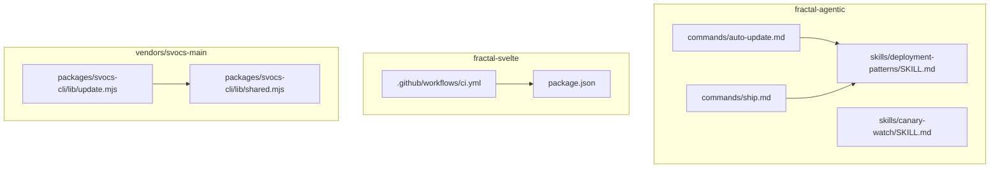
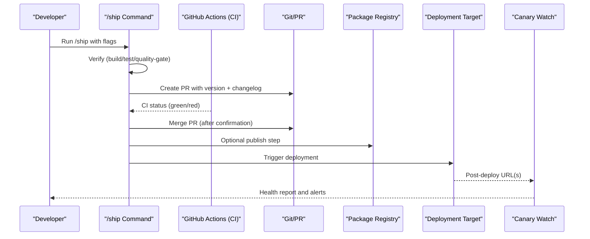
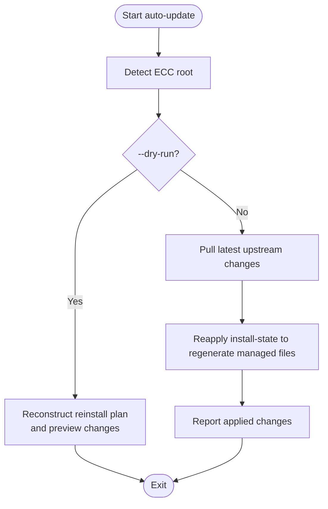
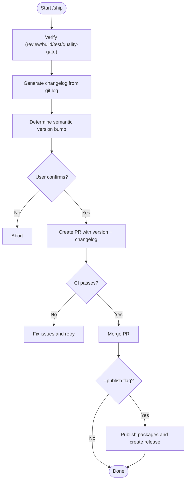
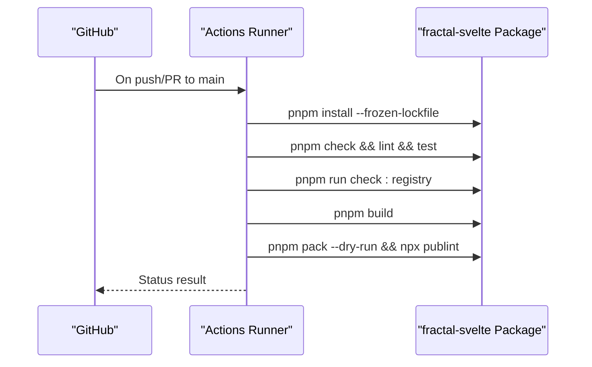
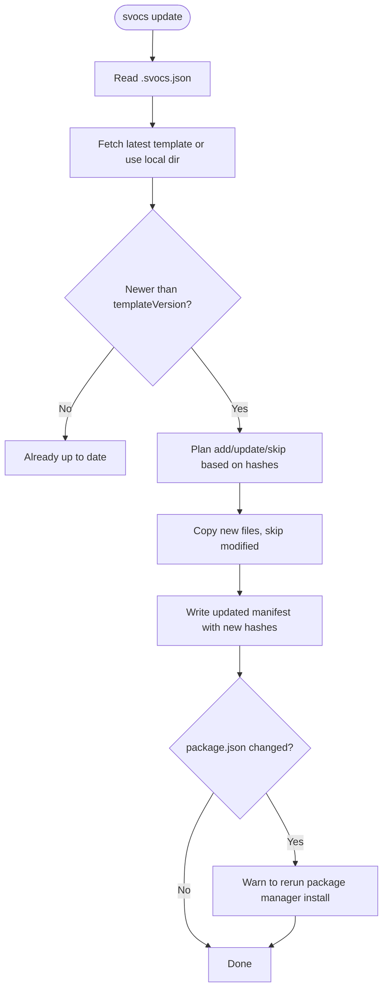
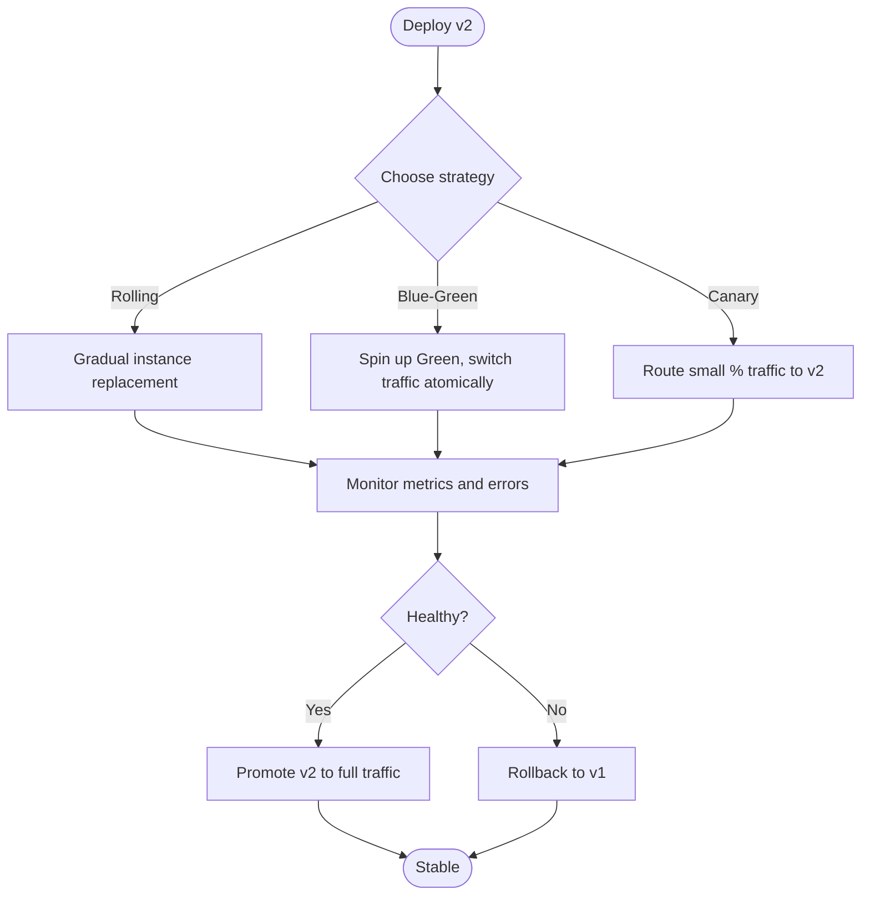
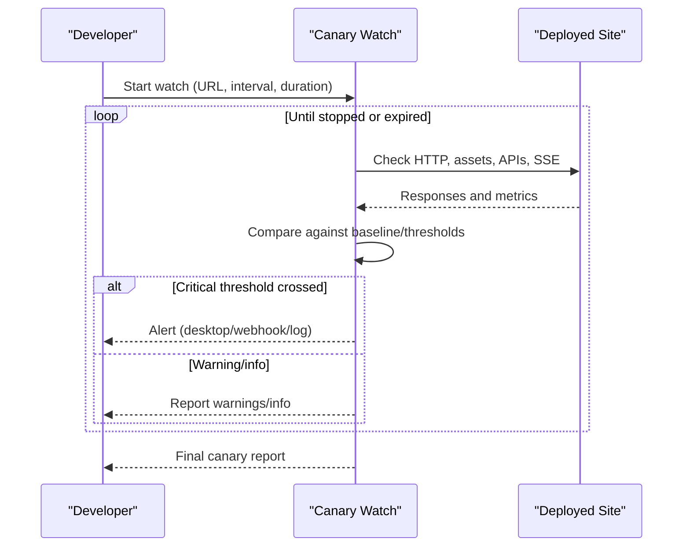
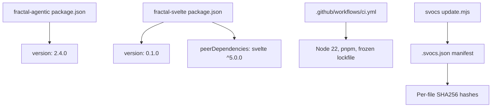

# Update & Version Management

<cite>
**Referenced Files in This Document**
- [auto-update.md](file://fractal-agentic/commands/auto-update.md)
- [ship.md](file://fractal-agentic/commands/ship.md)
- [ci.yml](file://fractal-svelte/.github/workflows/ci.yml)
- [package.json (fractal-agentic)](file://fractal-agentic/package.json)
- [package.json (fractal-svelte)](file://fractal-svelte/package.json)
- [update.mjs](file://vendors/svocs-main/packages/svocs-cli/lib/update.mjs)
- [shared.mjs](file://vendors/svocs-main/packages/svocs-cli/lib/shared.mjs)
- [deployment-patterns/SKILL.md](file://fractal-agentic/skills/deployment-patterns/SKILL.md)
- [canary-watch/SKILL.md](file://fractal-agentic/skills/canary-watch/SKILL.md)
</cite>

## Table of Contents
1. Introduction
2. Project Structure
3. Core Components
4. Architecture Overview
5. Detailed Component Analysis
6. Dependency Analysis
7. Performance Considerations
8. Troubleshooting Guide
9. Conclusion

## Introduction
This document explains update mechanisms and version management strategies across the repository’s packages and tooling. It covers semantic versioning practices, changelog maintenance, backward compatibility considerations, automated update pipelines, CI/CD integration, release automation workflows, rollback strategies, hotfix procedures, emergency updates, version validation, dependency management, conflict resolution, testing requirements for updates, staging environments, gradual rollout strategies, example scripts, deployment automation, and monitoring for successful deployments.

## Project Structure
The repository contains multiple packages with distinct responsibilities:
- fractal-agentic: CLI commands and skills that orchestrate updates, releases, and deployment patterns.
- fractal-svelte: A Svelte component library with a CI workflow ensuring checks, builds, and packaging.
- vendors/svocs-main: A CLI for updating scaffolded documentation sites with manifest-based tracking and safe diffs.

**Diagram sources**
- [auto-update.md:1-29](file://fractal-agentic/commands/auto-update.md#L1-L29)
- [ship.md:1-60](file://fractal-agentic/commands/ship.md#L1-L60)
- [deployment-patterns/SKILL.md:1-434](file://fractal-agentic/skills/deployment-patterns/SKILL.md#L1-L434)
- [canary-watch/SKILL.md:1-114](file://fractal-agentic/skills/canary-watch/SKILL.md#L1-L114)
- [ci.yml:1-37](file://fractal-svelte/.github/workflows/ci.yml#L1-L37)
- [package.json (fractal-svelte):1-245](file://fractal-svelte/package.json#L1-L245)
- [update.mjs:1-195](file://vendors/svocs-main/packages/svocs-cli/lib/update.mjs#L1-L195)
- [shared.mjs:1-39](file://vendors/svocs-main/packages/svocs-cli/lib/shared.mjs#L1-L39)

**Section sources**
- [auto-update.md:1-29](file://fractal-agentic/commands/auto-update.md#L1-L29)
- [ship.md:1-60](file://fractal-agentic/commands/ship.md#L1-L60)
- [ci.yml:1-37](file://fractal-svelte/.github/workflows/ci.yml#L1-L37)
- [package.json (fractal-agentic):1-59](file://fractal-agentic/package.json#L1-L59)
- [package.json (fractal-svelte):1-245](file://fractal-svelte/package.json#L1-L245)
- [update.mjs:1-195](file://vendors/svocs-main/packages/svocs-cli/lib/update.mjs#L1-L195)
- [shared.mjs:1-39](file://vendors/svocs-main/packages/svocs-cli/lib/shared.mjs#L1-L39)
- [deployment-patterns/SKILL.md:1-434](file://fractal-agentic/skills/deployment-patterns/SKILL.md#L1-L434)
- [canary-watch/SKILL.md:1-114](file://fractal-agentic/skills/canary-watch/SKILL.md#L1-L114)

## Core Components
- Automated local updates: The auto-update command pulls upstream changes and reinstalls managed targets using recorded state, supporting dry-run previews and targeted updates.
- Release pipeline: The ship command orchestrates verification, changelog generation, semantic version bumping, PR creation, CI gating, merging, and optional publishing.
- CI/CD: The Svelte package’s GitHub Actions workflow enforces checks, linting, tests, registry validations, and build/pack steps.
- Scaffold updates: The svocs CLI manages template updates via a manifest, hashing files to preserve user modifications while applying upstream changes safely.
- Deployment patterns and canary monitoring: Skills define rolling/blue-green/canary strategies, health checks, rollback procedures, and post-deploy verification.

**Section sources**
- [auto-update.md:1-29](file://fractal-agentic/commands/auto-update.md#L1-L29)
- [ship.md:1-60](file://fractal-agentic/commands/ship.md#L1-L60)
- [ci.yml:1-37](file://fractal-svelte/.github/workflows/ci.yml#L1-L37)
- [update.mjs:1-195](file://vendors/svocs-main/packages/svocs-cli/lib/update.mjs#L1-L195)
- [shared.mjs:1-39](file://vendors/svocs-main/packages/svocs-cli/lib/shared.mjs#L1-L39)
- [deployment-patterns/SKILL.md:1-434](file://fractal-agentic/skills/deployment-patterns/SKILL.md#L1-L434)
- [canary-watch/SKILL.md:1-114](file://fractal-agentic/skills/canary-watch/SKILL.md#L1-L114)

## Architecture Overview
The update and release architecture integrates local commands, CI/CD, and post-deploy monitoring:

**Diagram sources**
- [ship.md:1-60](file://fractal-agentic/commands/ship.md#L1-L60)
- [ci.yml:1-37](file://fractal-svelte/.github/workflows/ci.yml#L1-L37)
- [canary-watch/SKILL.md:1-114](file://fractal-agentic/skills/canary-watch/SKILL.md#L1-L114)

## Detailed Component Analysis

### Auto Update Mechanism
- Purpose: Pull latest upstream changes and reinstall managed targets based on recorded install-state.
- Safety: Dry-run mode previews changes; targeted updates restrict scope; explicit repo root override supported.
- Reinstall strategy: Intentionally rebuilds managed state to handle renames/deletions robustly.

**Diagram sources**
- [auto-update.md:1-29](file://fractal-agentic/commands/auto-update.md#L1-L29)

**Section sources**
- [auto-update.md:1-29](file://fractal-agentic/commands/auto-update.md#L1-L29)

### Release Pipeline (/ship)
- Phases:
  - Verify: Runs review, build, test, quality-gate.
  - Changelog: Scans git log since last tag, groups by conventional commit types, writes entries.
  - Version bump: Supports --patch/--minor/--major or auto-detection from commits; shows old→new before proceeding.
  - Commit and PR: Commits version and changelog, creates PR, waits for CI green, merges after confirmation.
  - Publish (optional): Publishes public packages and creates a GitHub release with generated notes.
- Safety: Requires explicit flags and confirmations; never publishes without consent; ensures CI green before merge.

**Diagram sources**
- [ship.md:1-60](file://fractal-agentic/commands/ship.md#L1-L60)

**Section sources**
- [ship.md:1-60](file://fractal-agentic/commands/ship.md#L1-L60)

### CI/CD Integration
- Workflow triggers: Push and pull requests to main branch.
- Jobs:
  - check: Install dependencies, run checks, lint, tests, registry validation.
  - build: Build artifacts, pack dry-run, publint validation.
- Environment: Node 22, pnpm, frozen lockfiles for reproducibility.

**Diagram sources**
- [ci.yml:1-37](file://fractal-svelte/.github/workflows/ci.yml#L1-L37)
- [package.json (fractal-svelte):1-245](file://fractal-svelte/package.json#L1-L245)

**Section sources**
- [ci.yml:1-37](file://fractal-svelte/.github/workflows/ci.yml#L1-L37)
- [package.json (fractal-svelte):1-245](file://fractal-svelte/package.json#L1-L245)

### Scaffold Updates (svocs CLI)
- Manifest-driven: Reads .svocs.json to track templateVersion and file hashes.
- Update flow:
  - Fetch latest template package or use local directory.
  - Compare versions; skip if up-to-date unless forced.
  - Compute expected hashes; apply adds/updates; skip modified files.
  - Write updated manifest preserving user modifications.
- Safety: Preserves user-owned files; warns about dependency changes when package.json is involved.

**Diagram sources**
- [update.mjs:1-195](file://vendors/svocs-main/packages/svocs-cli/lib/update.mjs#L1-L195)
- [shared.mjs:1-39](file://vendors/svocs-main/packages/svocs-cli/lib/shared.mjs#L1-L39)

**Section sources**
- [update.mjs:1-195](file://vendors/svocs-main/packages/svocs-cli/lib/update.mjs#L1-L195)
- [shared.mjs:1-39](file://vendors/svocs-main/packages/svocs-cli/lib/shared.mjs#L1-L39)

### Deployment Patterns and Rollback Strategies
- Strategies: Rolling (default), Blue-Green, Canary.
- Health checks: HTTP endpoints, Kubernetes probes, startup/readiness/liveness.
- Rollback: Instant rollback via image pointer change, platform-specific rollbacks, reversible migrations.
- Production readiness: Tests pass, no secrets in code, structured logging, resource limits, scaling, SSL, security headers.

**Diagram sources**
- [deployment-patterns/SKILL.md:1-434](file://fractal-agentic/skills/deployment-patterns/SKILL.md#L1-L434)

**Section sources**
- [deployment-patterns/SKILL.md:1-434](file://fractal-agentic/skills/deployment-patterns/SKILL.md#L1-L434)

### Post-Deploy Monitoring (Canary Watch)
- Monitors HTTP status, console errors, network failures, performance regressions, content presence, API health, static assets, SSE streams.
- Modes: Quick check, sustained watch, diff mode comparing staging vs production.
- Alerts: Critical/warning/info thresholds with notifications and logs.

**Diagram sources**
- [canary-watch/SKILL.md:1-114](file://fractal-agentic/skills/canary-watch/SKILL.md#L1-L114)

**Section sources**
- [canary-watch/SKILL.md:1-114](file://fractal-agentic/skills/canary-watch/SKILL.md#L1-L114)

## Dependency Analysis
- Package versions:
  - fractal-agentic: version 2.4.0 defined in package.json.
  - fractal-svelte: version 0.1.0 defined in package.json with peerDependencies for svelte and motion libraries.
- CI environment: Node 22, pnpm, frozen lockfiles ensure deterministic installs.
- Template updates: Manifest tracks templateVersion and per-file hashes to avoid conflicts with user modifications.

**Diagram sources**
- [package.json (fractal-agentic):1-59](file://fractal-agentic/package.json#L1-L59)
- [package.json (fractal-svelte):1-245](file://fractal-svelte/package.json#L1-L245)
- [ci.yml:1-37](file://fractal-svelte/.github/workflows/ci.yml#L1-L37)
- [update.mjs:1-195](file://vendors/svocs-main/packages/svocs-cli/lib/update.mjs#L1-L195)
- [shared.mjs:1-39](file://vendors/svocs-main/packages/svocs-cli/lib/shared.mjs#L1-L39)

**Section sources**
- [package.json (fractal-agentic):1-59](file://fractal-agentic/package.json#L1-L59)
- [package.json (fractal-svelte):1-245](file://fractal-svelte/package.json#L1-L245)
- [ci.yml:1-37](file://fractal-svelte/.github/workflows/ci.yml#L1-L37)
- [update.mjs:1-195](file://vendors/svocs-main/packages/svocs-cli/lib/update.mjs#L1-L195)
- [shared.mjs:1-39](file://vendors/svocs-main/packages/svocs-cli/lib/shared.mjs#L1-L39)

## Performance Considerations
- Use frozen lockfiles and pinned Node versions to reduce build variance and cache misses.
- Prefer multi-stage Docker images and prune dependencies to minimize runtime overhead.
- Implement health checks and readiness probes to avoid routing traffic to unhealthy instances during rollouts.
- Canary deployments reduce risk by validating with real traffic before full rollout.

[No sources needed since this section provides general guidance]

## Troubleshooting Guide
- Auto-update failures:
  - Ensure ECC root detection works; use --repo-root to override.
  - Run --dry-run to inspect planned changes before applying.
- CI failures:
  - Validate Node version and pnpm setup; ensure lockfile consistency.
  - Review test and lint outputs; fix environment parity issues.
- Scaffold updates:
  - If .svocs.json missing, manual application required.
  - When package.json is skipped due to modifications, compare dependencies against new template.
- Rollbacks:
  - Use platform-specific rollback commands; ensure previous images/artifacts are available.
  - For databases, ensure migrations are backward-compatible or reversible.

**Section sources**
- [auto-update.md:1-29](file://fractal-agentic/commands/auto-update.md#L1-L29)
- [ci.yml:1-37](file://fractal-svelte/.github/workflows/ci.yml#L1-L37)
- [update.mjs:1-195](file://vendors/svocs-main/packages/svocs-cli/lib/update.mjs#L1-L195)
- [shared.mjs:1-39](file://vendors/svocs-main/packages/svocs-cli/lib/shared.mjs#L1-L39)
- [deployment-patterns/SKILL.md:1-434](file://fractal-agentic/skills/deployment-patterns/SKILL.md#L1-L434)

## Conclusion
The repository implements a robust update and version management system combining local commands, CI/CD, and post-deploy monitoring. Semantic versioning is enforced through the ship command with changelog generation and safety checks. CI ensures reproducible builds and tests. Scaffold updates leverage manifests to safely apply upstream changes while preserving user modifications. Deployment patterns and canary monitoring provide safe rollouts and rapid feedback. Together, these mechanisms support reliable releases, quick rollbacks, and continuous improvement.