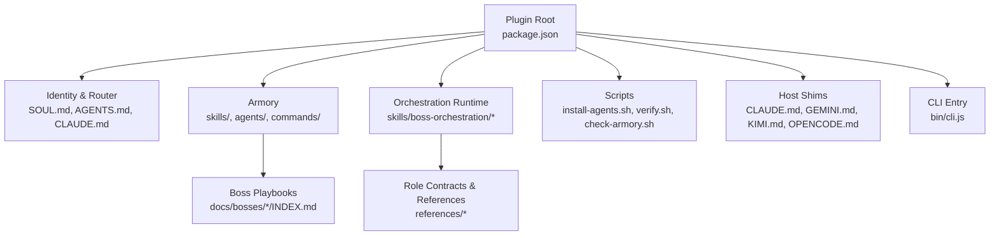
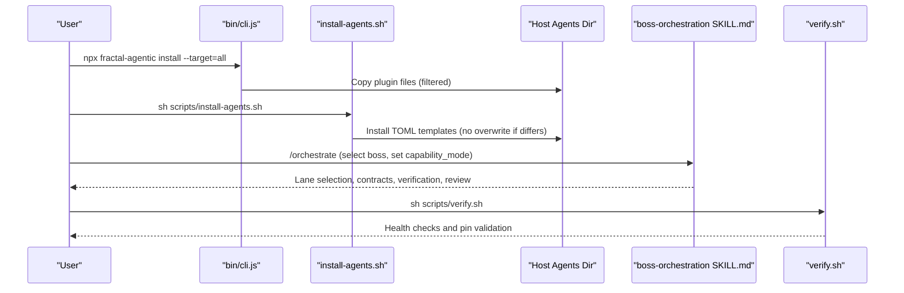
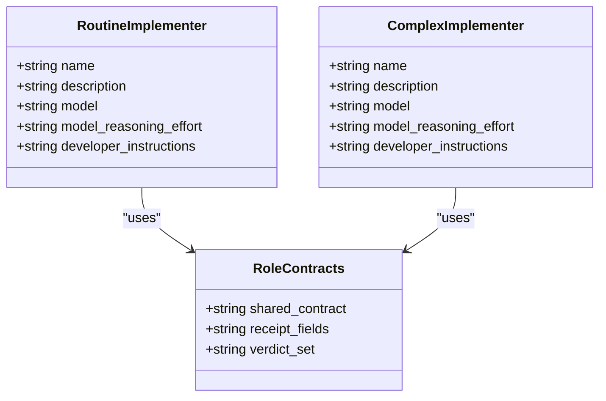
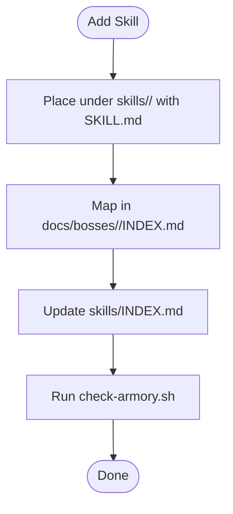
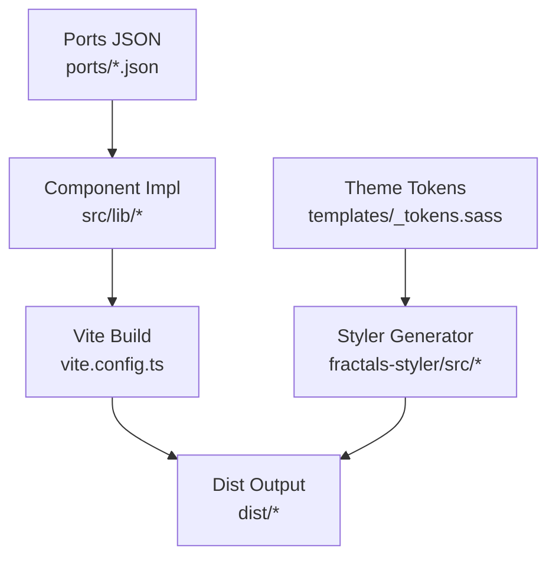
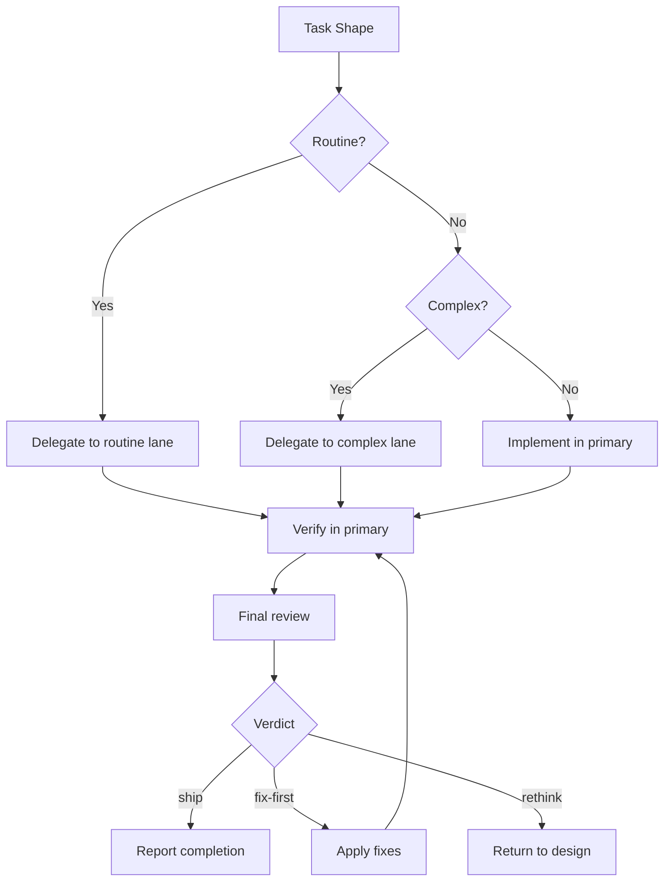
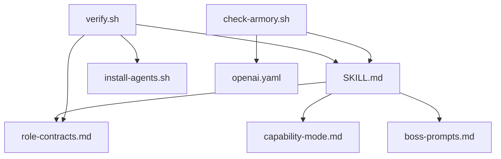

# Advanced Topics

<cite>
**Referenced Files in This Document**
- [README.md](file://fractal-agentic/README.md)
- [CUSTOMIZE.md](file://fractal-agentic/CUSTOMIZE.md)
- [package.json](file://fractal-agentic/package.json)
- [CLAUDE.md](file://fractal-agentic/CLAUDE.md)
- [AGENTS.md](file://fractal-agentic/AGENTS.md)
- [SKILL.md](file://fractal-agentic/skills/boss-orchestration/SKILL.md)
- [runtime.md](file://fractal-agentic/docs/orchestration/runtime.md)
- [capability-lanes.md](file://fractal-agentic/docs/orchestration/capability-lanes.md)
- [install-agents.sh](file://fractal-agentic/scripts/install-agents.sh)
- [verify.sh](file://fractal-agentic/scripts/verify.sh)
- [cli.js](file://fractal-agentic/bin/cli.js)
- [role-contracts.md](file://fractal-agentic/skills/boss-orchestration/references/role-contracts.md)
- [fractal-agentic-routine-implementer.toml](file://fractal-agentic/agents/fractal-agentic-routine-implementer.toml)
- [fractal-agentic-complex-implementer.toml](file://fractal-agentic/agents/fractal-agentic-complex-implementer.toml)
- [check-armory.sh](file://fractal-agentic/scripts/check-armory.sh)
</cite>

## Table of Contents
1. Introduction
2. Project Structure
3. Core Components
4. Architecture Overview
5. Detailed Component Analysis
6. Dependency Analysis
7. Performance Considerations
8. Troubleshooting Guide
9. Conclusion
10. Appendices

## Introduction
This document provides advanced, expert-level guidance for customizing and extending the Fractal Agentic plugin ecosystem. It focuses on:
- Custom agent development with architecture patterns and implementation guidelines
- Component extension patterns for skills, commands, and domain bosses
- Custom animation systems and theme customization via Svelte-based assets
- Performance optimization, memory management, and bundle size reduction
- Advanced configuration scenarios, security considerations, and enterprise deployment patterns
- Debugging complex issues, monitoring agent performance, and scaling considerations
- Migration guides for version upgrades and backwards compatibility notes

The content synthesizes orchestration runtime behavior, capability lanes, installer and verification tooling, and host integration points to enable robust, scalable, and secure deployments.

## Project Structure
Fractal Agentic is a plugin package that agents load directly from its root. The structure separates identity, discovery, armory (skills, agents, commands), orchestration runtime, and scripts for installation and verification. Host shims provide compatibility across Claude, Codex, Gemini, and others.

**Diagram sources**
- [package.json:1-59](file://fractal-agentic/package.json#L1-L59)
- [CLAUDE.md:1-8](file://fractal-agentic/CLAUDE.md#L1-L8)
- [AGENTS.md:1-106](file://fractal-agentic/AGENTS.md#L1-L106)
- [SKILL.md:1-312](file://fractal-agentic/skills/boss-orchestration/SKILL.md#L1-L312)
- [install-agents.sh:1-180](file://fractal-agentic/scripts/install-agents.sh#L1-L180)
- [verify.sh:1-274](file://fractal-agentic/scripts/verify.sh#L1-L274)
- [cli.js:1-148](file://fractal-agentic/bin/cli.js#L1-L148)

**Section sources**
- [README.md:1-440](file://fractal-agentic/README.md#L1-L440)
- [package.json:1-59](file://fractal-agentic/package.json#L1-L59)
- [CLAUDE.md:1-8](file://fractal-agentic/CLAUDE.md#L1-L8)
- [AGENTS.md:1-106](file://fractal-agentic/AGENTS.md#L1-L106)

## Core Components
- Startup router and boss selection: AGENTS.md defines precedence, trivial exemption, and one-boss selection rules.
- Orchestration runtime: skills/boss-orchestration/SKILL.md implements non-blocking capability lanes, five-part contracts, verification, and final review.
- Capability lanes: TOML templates define routine, complex, and reviewer roles; install-agents.sh installs them without mutating host config.
- Verification and health: verify.sh validates manifests, TOML pins, role contracts, and installer behavior; check-armory.sh ensures critical assets exist.
- CLI installer: bin/cli.js supports multi-host installation and project snippet injection.

Key responsibilities:
- Non-blocking policy: missing pins or incomplete installs never block product work.
- Five-part contract: objective, ownership, interfaces, constraints, verification.
- Final review: ship | fix-first | rethink verdicts with evidence.

**Section sources**
- [AGENTS.md:1-106](file://fractal-agentic/AGENTS.md#L1-L106)
- [SKILL.md:1-312](file://fractal-agentic/skills/boss-orchestration/SKILL.md#L1-L312)
- [capability-lanes.md:1-64](file://fractal-agentic/docs/orchestration/capability-lanes.md#L1-L64)
- [install-agents.sh:1-180](file://fractal-agentic/scripts/install-agents.sh#L1-L180)
- [verify.sh:1-274](file://fractal-agentic/scripts/verify.sh#L1-L274)
- [check-armory.sh:1-143](file://fractal-agentic/scripts/check-armory.sh#L1-L143)
- [cli.js:1-148](file://fractal-agentic/bin/cli.js#L1-L148)

## Architecture Overview
The system follows a layered architecture:
- Layer A (Content): Readable plugin content and playbooks
- Layer B (Install): TOML templates installed under host agents directory
- Layer C (Session): Spawn catalog exposing capability types in the current task

**Diagram sources**
- [cli.js:1-148](file://fractal-agentic/bin/cli.js#L1-L148)
- [install-agents.sh:1-180](file://fractal-agentic/scripts/install-agents.sh#L1-L180)
- [SKILL.md:1-312](file://fractal-agentic/skills/boss-orchestration/SKILL.md#L1-L312)
- [verify.sh:1-274](file://fractal-agentic/scripts/verify.sh#L1-L274)

**Section sources**
- [runtime.md:1-53](file://fractal-agentic/docs/orchestration/runtime.md#L1-L53)
- [capability-lanes.md:1-64](file://fractal-agentic/docs/orchestration/capability-lanes.md#L1-L64)

## Detailed Component Analysis

### Custom Agent Development Patterns
- Define capability lanes via TOML templates with name, model, reasoning effort, and optional sandbox mode.
- Use role-contracts to standardize prompts and receipts for implementers and reviewers.
- Enforce non-blocking degradation when pins are absent; prefer exposed pins but continue degraded.

**Diagram sources**
- [fractal-agentic-routine-implementer.toml:1-19](file://fractal-agentic/agents/fractal-agentic-routine-implementer.toml#L1-L19)
- [fractal-agentic-complex-implementer.toml:1-19](file://fractal-agentic/agents/fractal-agentic-complex-implementer.toml#L1-L19)
- [role-contracts.md:1-245](file://fractal-agentic/skills/boss-orchestration/references/role-contracts.md#L1-L245)

**Section sources**
- [role-contracts.md:1-245](file://fractal-agentic/skills/boss-orchestration/references/role-contracts.md#L1-L245)
- [SKILL.md:1-312](file://fractal-agentic/skills/boss-orchestration/SKILL.md#L1-L312)

### Component Extension Patterns (Skills, Commands, Bosses)
- Add skills by placing directories under skills/<id>/ with SKILL.md frontmatter and mapping into owning boss INDEX.md.
- Add commands by creating commands/<command-id>.md with frontmatter and linking from indexes and boss playbooks.
- Retarget bosses for different stacks by editing router defaults, nested boss playbooks, and boss-prompts.

**Diagram sources**
- [CUSTOMIZE.md:1-579](file://fractal-agentic/CUSTOMIZE.md#L1-L579)
- [check-armory.sh:1-143](file://fractal-agentic/scripts/check-armory.sh#L1-L143)

**Section sources**
- [CUSTOMIZE.md:1-579](file://fractal-agentic/CUSTOMIZE.md#L1-L579)

### Custom Animation Systems and Theme Customization
- Animation assets and component ports live under sibling packages like fractal-svelte and svelte-animated-icon. Ports define JSON schemas for UI components; examples include marquee, text-animation, and streaming-response.
- Theme generation and tokens are supported via scripts and templates in fractals-styler and fractalsvelte.
- To customize animations:
  - Extend port definitions under ports/*.json
  - Update component implementations in src/lib or example routes
  - Regenerate catalogs using provided scripts

[No sources needed since this diagram shows conceptual workflow, not actual code structure]

**Section sources**
- [package.json](file://fractal-svelte/package.json)
- [vite.config.ts](file://fractal-svelte/vite.config.ts)
- [generate.ts](file://fractals-styler/src/generate.ts)
- [registry.ts](file://fractals-styler/src/registry.ts)

### Performance Optimization Techniques
- Prefer routine lane for bounded tasks; escalate to complex only when judgment is required.
- Use parallel execution for independent, non-overlapping work; serialize shared dependencies.
- Avoid silent fallbacks; degrade gracefully and report capability_mode and pins status.
- Minimize context switching by keeping primary session responsible for diff inspection and re-verification.

**Diagram sources**
- [SKILL.md:1-312](file://fractal-agentic/skills/boss-orchestration/SKILL.md#L1-L312)
- [capability-lanes.md:1-64](file://fractal-agentic/docs/orchestration/capability-lanes.md#L1-L64)

**Section sources**
- [SKILL.md:1-312](file://fractal-agentic/skills/boss-orchestration/SKILL.md#L1-L312)
- [capability-lanes.md:1-64](file://fractal-agentic/docs/orchestration/capability-lanes.md#L1-L64)

### Memory Management and Bundle Size Reduction
- Vendor skills locally to avoid external symlinks and reduce runtime overhead.
- Exclude unnecessary files during installation (node_modules, .git, etc.) via cli.js filter.
- Use incremental builds and selective imports in SvelteKit/Vite to minimize bundle size.
- Generate minimal themes and strip unused tokens via styler scripts.

**Section sources**
- [cli.js:1-148](file://fractal-agentic/bin/cli.js#L1-L148)
- [CUSTOMIZE.md:1-579](file://fractal-agentic/CUSTOMIZE.md#L1-L579)

### Advanced Configuration Scenarios
- Set capability_mode once per task based on session spawn catalog exposure.
- Use CODEX_HOME or explicit --target-dir for installer to control destination.
- Maintain non-blocking policy: never require fresh task before coding; degrade and continue.

**Section sources**
- [capability-lanes.md:1-64](file://fractal-agentic/docs/orchestration/capability-lanes.md#L1-L64)
- [install-agents.sh:1-180](file://fractal-agentic/scripts/install-agents.sh#L1-L180)
- [SKILL.md:1-312](file://fractal-agentic/skills/boss-orchestration/SKILL.md#L1-L312)

### Security Considerations
- Reviewer sandbox policies may be broader than requested; capture and note residual risk.
- Runtime inspector extracts safe allowlisted fields; ensure no secrets leak in logs.
- Enforce read-only reviewer where possible; do not claim OS-enforced isolation unless observed.

**Section sources**
- [role-contracts.md:1-245](file://fractal-agentic/skills/boss-orchestration/references/role-contracts.md#L1-L245)
- [verify.sh:234-274](file://fractal-agentic/scripts/verify.sh#L234-L274)

### Enterprise Deployment Patterns
- Use marketplace installations for controlled distribution; update plugin.json versions for fork differentiation.
- Centralize skill and command mappings under owning boss playbooks; maintain live indexes.
- Automate verification in CI with verify.sh and check-armory.sh; enforce non-blocking policy checks.

**Section sources**
- [CUSTOMIZE.md:1-579](file://fractal-agentic/CUSTOMIZE.md#L1-L579)
- [verify.sh:1-274](file://fractal-agentic/scripts/verify.sh#L1-L274)
- [check-armory.sh:1-143](file://fractal-agentic/scripts/check-armory.sh#L1-L143)

### Debugging Complex Issues
- Use inspect-agent-runtime.sh to observe routing metadata for subagent threads.
- Validate TOML pins and installer behavior with verify.sh; check for byte-exact copies.
- Inspect openai.yaml shape and references to ensure marketplace skill UI strings are valid.

**Section sources**
- [install-agents.sh:1-180](file://fractal-agentic/scripts/install-agents.sh#L1-L180)
- [verify.sh:1-274](file://fractal-agentic/scripts/verify.sh#L1-L274)
- [check-armory.sh:1-143](file://fractal-agentic/scripts/check-armory.sh#L1-L143)

### Monitoring Agent Performance
- Track capability_mode and pins status in reports; log degraded vs pinned states.
- Measure verification command results and diff inspection outcomes for evidence-based acceptance.
- Use evaluation_scripts for latency checks and load testing simulations.

**Section sources**
- [capability-lanes.md:1-64](file://fractal-agentic/docs/orchestration/capability-lanes.md#L1-L64)
- [SKILL.md:1-312](file://fractal-agentic/skills/boss-orchestration/SKILL.md#L1-L312)

### Scaling Considerations
- Parallelize independent tasks; serialize shared file dependencies.
- Keep worker scope bounded to owned paths; preserve concurrent edits.
- Prefer domain specialists for consults when pins are absent; scale review capacity accordingly.

**Section sources**
- [role-contracts.md:1-245](file://fractal-agentic/skills/boss-orchestration/references/role-contracts.md#L1-L245)
- [SKILL.md:1-312](file://fractal-agentic/skills/boss-orchestration/SKILL.md#L1-L312)

### Migration Guides and Backwards Compatibility
- When renaming lanes or adding new ones, update all references: SKILL.md, role-contracts.md, routing-matrix.md, commands, install-agents.sh, verify.sh, and README tables.
- Re-install for every developer machine; handle conflicts deliberately without overwriting differing files.
- Update plugin manifests and version numbers for marketplace differentiation.

**Section sources**
- [CUSTOMIZE.md:1-579](file://fractal-agentic/CUSTOMIZE.md#L1-L579)
- [install-agents.sh:1-180](file://fractal-agentic/scripts/install-agents.sh#L1-L180)
- [verify.sh:1-274](file://fractal-agentic/scripts/verify.sh#L1-L274)

## Dependency Analysis
The orchestration runtime depends on role contracts, capability-mode, and boss-prompts. Scripts validate consistency between TOML pins, contracts, and installer behavior.

**Diagram sources**
- [SKILL.md:1-312](file://fractal-agentic/skills/boss-orchestration/SKILL.md#L1-L312)
- [role-contracts.md:1-245](file://fractal-agentic/skills/boss-orchestration/references/role-contracts.md#L1-L245)
- [verify.sh:1-274](file://fractal-agentic/scripts/verify.sh#L1-L274)
- [check-armory.sh:1-143](file://fractal-agentic/scripts/check-armory.sh#L1-L143)

**Section sources**
- [verify.sh:1-274](file://fractal-agentic/scripts/verify.sh#L1-L274)
- [check-armory.sh:1-143](file://fractal-agentic/scripts/check-armory.sh#L1-L143)

## Performance Considerations
- Route tasks to appropriate lanes to minimize reasoning overhead.
- Avoid unnecessary context loading; read boss playbooks only after selection.
- Use incremental verification and targeted diffs to reduce computation.

[No sources needed since this section provides general guidance]

## Troubleshooting Guide
Common issues and resolutions:
- Missing spawn types: run install-agents.sh and start a new task.
- Installer conflicts: resolve differences deliberately; installer will not overwrite.
- Model/effort unknown: use inspect-agent-runtime.sh if rollout exists.
- Reviewer mutated files: stop and capture residual risk.
- Missing skill: confirm vendored local path exists.

**Section sources**
- [install-agents.sh:1-180](file://fractal-agentic/scripts/install-agents.sh#L1-L180)
- [verify.sh:1-274](file://fractal-agentic/scripts/verify.sh#L1-L274)
- [check-armory.sh:1-143](file://fractal-agentic/scripts/check-armory.sh#L1-L143)

## Conclusion
Fractal Agentic provides a robust, extensible orchestration framework for AI coding agents. By following the non-blocking policy, leveraging capability lanes, and maintaining strict contracts and verification, teams can build scalable, secure, and high-performance agent workflows. Customization through skills, commands, and bosses enables adaptation to diverse stacks and enterprise requirements.

[No sources needed since this section summarizes without analyzing specific files]

## Appendices
- Versioning: Update plugin.json and host-specific manifests for marketplace differentiation.
- Health checks: Run verify.sh and check-armory.sh after structural edits.
- Project integration: Ensure AGENTS snippets point to correct plugin root and entry files.

**Section sources**
- [CUSTOMIZE.md:1-579](file://fractal-agentic/CUSTOMIZE.md#L1-L579)
- [verify.sh:1-274](file://fractal-agentic/scripts/verify.sh#L1-L274)
- [check-armory.sh:1-143](file://fractal-agentic/scripts/check-armory.sh#L1-L143)