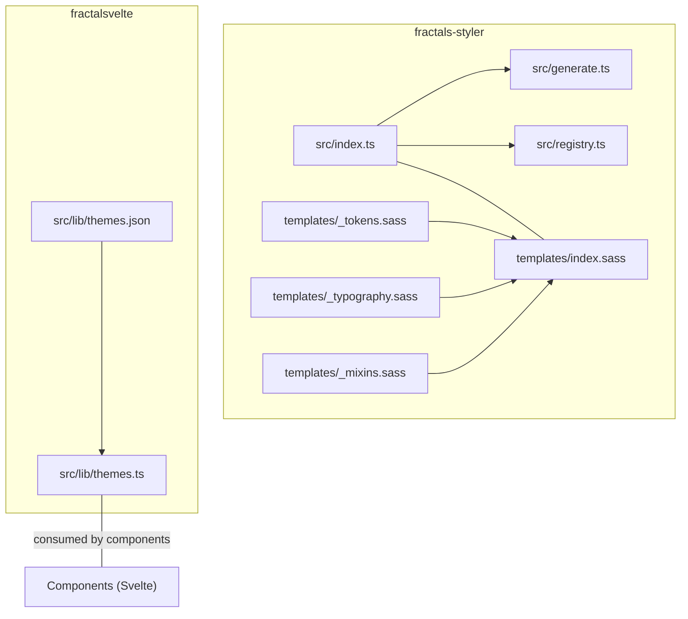
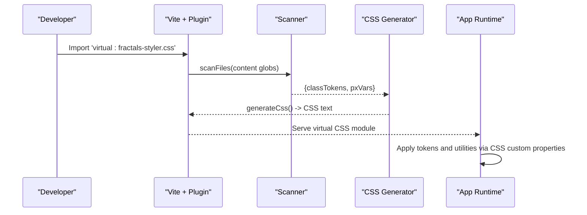
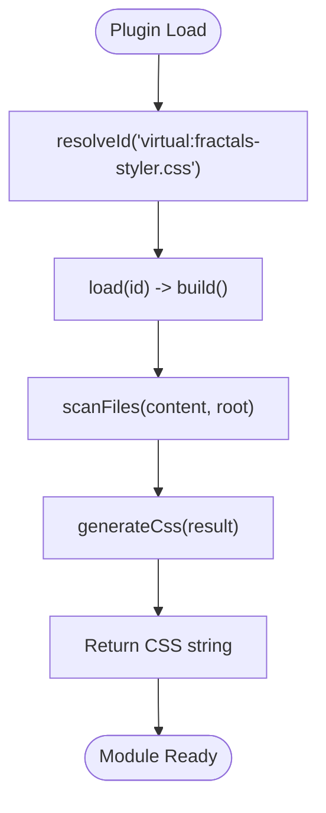
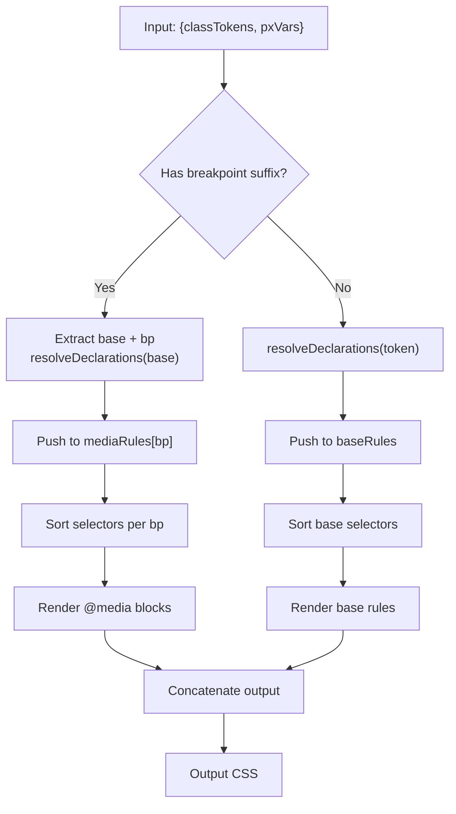
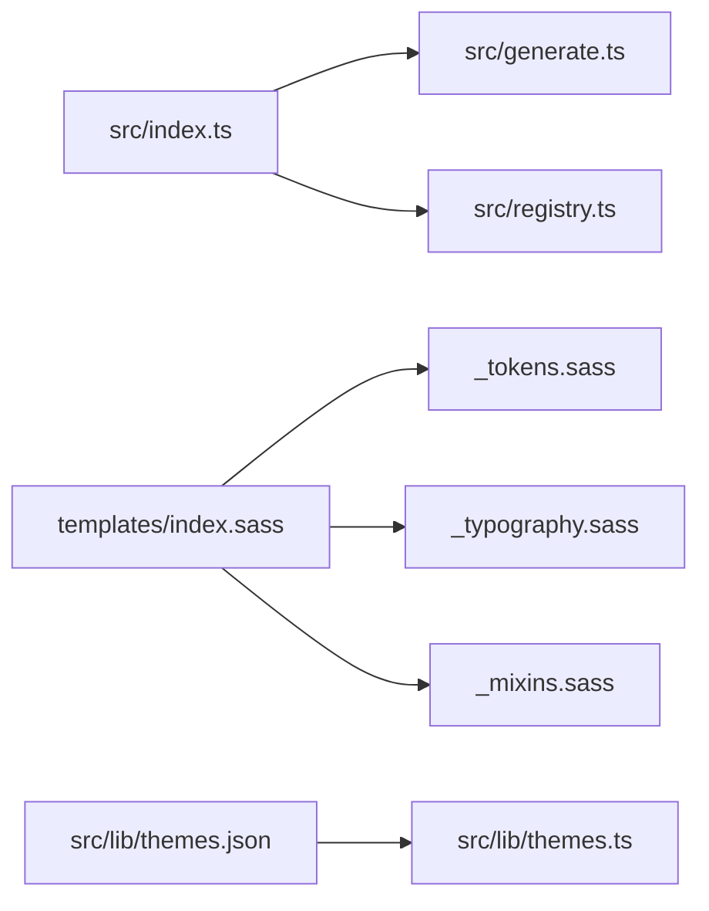

# Theme Integration

<cite>
**Referenced Files in This Document**
- [README.md](file://packages/fractals-styler/README.md)
- [GUIDE.md](file://packages/fractals-styler/GUIDE.md)
- [index.ts](file://packages/fractals-styler/src/index.ts)
- [generate.ts](file://packages/fractals-styler/src/generate.ts)
- [registry.ts](file://packages/fractals-styler/src/registry.ts)
- [_tokens.sass](file://packages/fractals-styler/templates/_tokens.sass)
- [_mixins.sass](file://packages/fractals-styler/templates/_mixins.sass)
- [_typography.sass](file://packages/fractals-styler/templates/_typography.sass)
- [index.sass](file://packages/fractals-styler/templates/index.sass)
- [themes.ts](file://packages/fractalsvelte/src/lib/themes.ts)
- [themes.json](file://packages/fractalsvelte/src/lib/themes.json)
</cite>

## Table of Contents
1. Introduction
2. Project Structure
3. Core Components
4. Architecture Overview
5. Detailed Component Analysis
6. Dependency Analysis
7. Performance Considerations
8. Troubleshooting Guide
9. Conclusion

## Introduction
This document explains how to integrate custom themes with extended Fractal components using the fractals-styler tooling and the fractalsvelte component library. It covers design tokens, CSS custom properties, JIT utility generation, breakpoint suffixes, responsive patterns, extending component themes, creating brand-specific variants, implementing dark mode, style scoping, specificity management, and accessibility considerations across theme variations.

## Project Structure
The relevant parts of the repository are organized into two main areas:
- fractals-styler: A Vite plugin that scans source files for utility classes and dynamic variables, then generates a minimal CSS module at build/dev time. It also scaffolds SASS partials for tokens, typography, globals, primitives, and mixins.
- fractalsvelte: A Svelte component library that ships typed theme data and helpers to convert theme values into CSS custom properties used by components.



**Diagram sources**
- [index.ts:1-76](file://packages/fractals-styler/src/index.ts#L1-L76)
- [generate.ts:1-62](file://packages/fractals-styler/src/generate.ts#L1-L62)
- [registry.ts:1-94](file://packages/fractals-styler/src/registry.ts#L1-L94)
- [_tokens.sass:1-24](file://packages/fractals-styler/templates/_tokens.sass#L1-L24)
- [_typography.sass:1-59](file://packages/fractals-styler/templates/_typography.sass#L1-L59)
- [_mixins.sass:1-25](file://packages/fractals-styler/templates/_mixins.sass#L1-L25)
- [index.sass:1-7](file://packages/fractals-styler/templates/index.sass#L1-L7)
- [themes.ts:1-59](file://packages/fractalsvelte/src/lib/themes.ts#L1-L59)
- [themes.json:1-348](file://packages/fractalsvelte/src/lib/themes.json#L1-L348)

**Section sources**
- [README.md:1-124](file://packages/fractals-styler/README.md#L1-L124)
- [GUIDE.md:1-243](file://packages/fractals-styler/GUIDE.md#L1-L243)

## Core Components
- Vite Plugin (fractals-styler): Scans content globs, resolves class names against static utilities and dynamic prefixes, and emits only used CSS via a virtual module. Supports breakpoint-suffixed variants for known classes and exposes dynamic --pxN variables.
- Token System (SASS partials): Provides default CSS custom properties for colors, text scales, borders, and typography utilities. These can be overridden globally or scoped under theme classes.
- Breakpoint Mixins: Provide an escape hatch to scope custom classes to breakpoints when the JIT engine cannot introspect them.
- Theme Data (fractalsvelte): Typed theme definitions and a helper to convert camelCase keys to kebab-case CSS custom property names.

Key responsibilities:
- JIT scanning and CSS generation: [index.ts:1-76](file://packages/fractals-styler/src/index.ts#L1-L76), [generate.ts:1-62](file://packages/fractals-styler/src/generate.ts#L1-L62)
- Static registry and breakpoint mapping: [registry.ts:1-94](file://packages/fractals-styler/src/registry.ts#L1-L94)
- Token defaults and typography: [_tokens.sass:1-24](file://packages/fractals-styler/templates/_tokens.sass#L1-L24), [_typography.sass:1-59](file://packages/fractals-styler/templates/_typography.sass#L1-L59)
- Responsive mixins: [_mixins.sass:1-25](file://packages/fractals-styler/templates/_mixins.sass#L1-L25)
- Theme types and conversion helper: [themes.ts:1-59](file://packages/fractalsvelte/src/lib/themes.ts#L1-L59), [themes.json:1-348](file://packages/fractalsvelte/src/lib/themes.json#L1-L348)

**Section sources**
- [index.ts:1-76](file://packages/fractals-styler/src/index.ts#L1-L76)
- [generate.ts:1-62](file://packages/fractals-styler/src/generate.ts#L1-L62)
- [registry.ts:1-94](file://packages/fractals-styler/src/registry.ts#L1-L94)
- [_tokens.sass:1-24](file://packages/fractals-styler/templates/_tokens.sass#L1-L24)
- [_typography.sass:1-59](file://packages/fractals-styler/templates/_typography.sass#L1-L59)
- [_mixins.sass:1-25](file://packages/fractals-styler/templates/_mixins.sass#L1-L25)
- [themes.ts:1-59](file://packages/fractalsvelte/src/lib/themes.ts#L1-L59)
- [themes.json:1-348](file://packages/fractalsvelte/src/lib/themes.json#L1-L348)

## Architecture Overview
The integration follows a clear pipeline:
- Design tokens and typography are defined in SASS partials and imported globally.
- The Vite plugin scans source files for utility classes and dynamic variable usage, generating a minimal CSS module.
- Components consume CSS custom properties from theme data, enabling consistent styling and easy overrides.



**Diagram sources**
- [index.ts:1-76](file://packages/fractals-styler/src/index.ts#L1-L76)
- [generate.ts:1-62](file://packages/fractals-styler/src/generate.ts#L1-L62)

**Section sources**
- [GUIDE.md:105-160](file://packages/fractals-styler/GUIDE.md#L105-L160)

## Detailed Component Analysis

### fractals-styler Vite Plugin
Responsibilities:
- Resolve and serve the virtual CSS module.
- Scan source files for utility classes and dynamic variables.
- Generate CSS with base rules and breakpoint-suffixed media queries.
- Watch for file changes and trigger full reloads.



**Diagram sources**
- [index.ts:1-76](file://packages/fractals-styler/src/index.ts#L1-L76)
- [generate.ts:1-62](file://packages/fractals-styler/src/generate.ts#L1-L62)

**Section sources**
- [index.ts:1-76](file://packages/fractals-styler/src/index.ts#L1-L76)

### CSS Generation and Breakpoints
Responsibilities:
- Parse class tokens and detect breakpoint suffixes.
- Map base classes to declarations via static registry or dynamic prefix matching.
- Emit sorted base rules and breakpoint media blocks.



**Diagram sources**
- [generate.ts:1-62](file://packages/fractals-styler/src/generate.ts#L1-L62)
- [registry.ts:1-94](file://packages/fractals-styler/src/registry.ts#L1-L94)

**Section sources**
- [generate.ts:1-62](file://packages/fractals-styler/src/generate.ts#L1-L62)
- [registry.ts:1-94](file://packages/fractals-styler/src/registry.ts#L1-L94)

### Token System and Typography
Responsibilities:
- Define default CSS custom properties for colors, text scale, and borders.
- Provide typography utility classes bound to token variables.
- Allow global or scoped overrides via :root or theme classes.

```mermaid
classDiagram
class Tokens {
"+--color00..--color100"
"+--accent10..--accent30"
"+--text-primary..--text-tertiary"
"+--border-primary..--border-tertiary"
}
class Typography {
"--text-xs..--text-5xl"
".text-* classes"
".tt-u/.tt-c"
".fw* / .bold"
".lh*"
}
Tokens <.. Typography : "variables referenced"
```

**Diagram sources**
- [_tokens.sass:1-24](file://packages/fractals-styler/templates/_tokens.sass#L1-L24)
- [_typography.sass:1-59](file://packages/fractals-styler/templates/_typography.sass#L1-L59)

**Section sources**
- [_tokens.sass:1-24](file://packages/fractals-styler/templates/_tokens.sass#L1-L24)
- [_typography.sass:1-59](file://packages/fractals-styler/templates/_typography.sass#L1-L59)
- [README.md:111-124](file://packages/fractals-styler/README.md#L111-L124)

### Responsive Mixins for Custom Classes
Responsibilities:
- Provide SASS mixins to wrap custom classes in breakpoint media queries.
- Enable responsive behavior for non-JIT-known classes.

Usage pattern:
- Wrap custom rule sets with +bp-sm or other breakpoint mixins to scope styles.

**Section sources**
- [_mixins.sass:1-25](file://packages/fractals-styler/templates/_mixins.sass#L1-L25)
- [GUIDE.md:215-226](file://packages/fractals-styler/GUIDE.md#L215-L226)

### Theme Data and Conversion Helper (fractalsvelte)
Responsibilities:
- Maintain typed theme definitions for multiple palettes and modes.
- Convert camelCase keys to CSS custom property strings for runtime application.

```mermaid
classDiagram
class ThemeVariables {
"+background : string"
"+foreground : string"
"+primary : string"
"+secondary : string"
"+muted : string"
"+accent : string"
"+destructive : string"
"+border : string"
"+input : string"
"+ring : string"
"+chart1..chart5 : string"
"+sidebar* : string"
}
class ThemesMap {
"<<Record<Palette, Record<Mode, ThemeVariables>>>"
}
class Helpers {
"+toCssVariables(themeVars) : Record<string,string>"
}
ThemesMap --> ThemeVariables : "contains"
Helpers --> ThemeVariables : "converts keys"
```

**Diagram sources**
- [themes.ts:1-59](file://packages/fractalsvelte/src/lib/themes.ts#L1-L59)
- [themes.json:1-348](file://packages/fractalsvelte/src/lib/themes.json#L1-L348)

**Section sources**
- [themes.ts:1-59](file://packages/fractalsvelte/src/lib/themes.ts#L1-L59)
- [themes.json:1-348](file://packages/fractalsvelte/src/lib/themes.json#L1-L348)

## Dependency Analysis
- The Vite plugin depends on scanner and generator modules; generator depends on registry for breakpoint mappings and declaration resolution.
- SASS partials are composed via index.sass and consumed globally.
- Theme data is consumed by components through typed interfaces and conversion helpers.



**Diagram sources**
- [index.ts:1-76](file://packages/fractals-styler/src/index.ts#L1-L76)
- [generate.ts:1-62](file://packages/fractals-styler/src/generate.ts#L1-L62)
- [registry.ts:1-94](file://packages/fractals-styler/src/registry.ts#L1-L94)
- [index.sass:1-7](file://packages/fractals-styler/templates/index.sass#L1-L7)
- [themes.ts:1-59](file://packages/fractalsvelte/src/lib/themes.ts#L1-L59)
- [themes.json:1-348](file://packages/fractalsvelte/src/lib/themes.json#L1-L348)

**Section sources**
- [index.ts:1-76](file://packages/fractals-styler/src/index.ts#L1-L76)
- [generate.ts:1-62](file://packages/fractals-styler/src/generate.ts#L1-L62)
- [registry.ts:1-94](file://packages/fractals-styler/src/registry.ts#L1-L94)
- [index.sass:1-7](file://packages/fractals-styler/templates/index.sass#L1-L7)
- [themes.ts:1-59](file://packages/fractalsvelte/src/lib/themes.ts#L1-L59)
- [themes.json:1-348](file://packages/fractalsvelte/src/lib/themes.json#L1-L348)

## Performance Considerations
- JIT CSS generation ensures only used utilities are emitted, minimizing bundle size.
- Breakpoint suffixes are resolved statically; avoid overusing complex modifiers that require nested selectors.
- Use dynamic --pxN variables sparingly to limit generated root variables.
- Keep content globs precise to reduce scanning overhead.

[No sources needed since this section provides general guidance]

## Troubleshooting Guide
Common issues and resolutions:
- Virtual module not found: Ensure the plugin is registered in Vite config and import the virtual module once globally.
- New classes not appearing: Confirm edited files match content globs; dev server triggers full reload on watched extensions.
- Breakpoint suffix not working on custom classes: Use _mixins.sass +bp-* mixins for custom classes not recognized by the JIT.
- Sass build errors after init: Verify sass is installed and imports point to the correct scaffolded path.

**Section sources**
- [GUIDE.md:230-243](file://packages/fractals-styler/GUIDE.md#L230-L243)
- [README.md:1-124](file://packages/fractals-styler/README.md#L1-L124)

## Conclusion
By combining fractals-styler’s JIT utility generation and token-driven SASS system with fractalsvelte’s typed theme data, you can create scalable, accessible, and maintainable themes. Override tokens globally or scoped under theme classes, leverage breakpoint suffixes for known utilities, and use mixins for custom responsive behavior. This approach ensures consistency across components while supporting brand-specific variants and dark mode.

[No sources needed since this section summarizes without analyzing specific files]