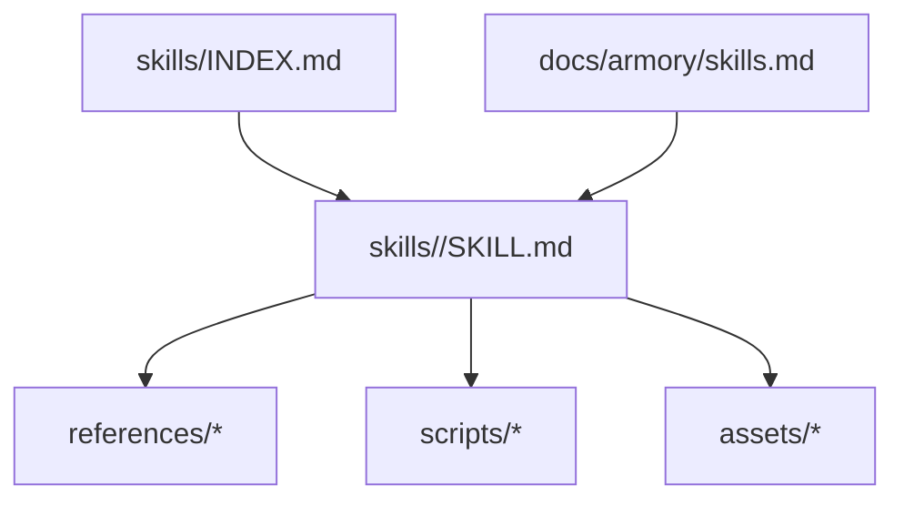
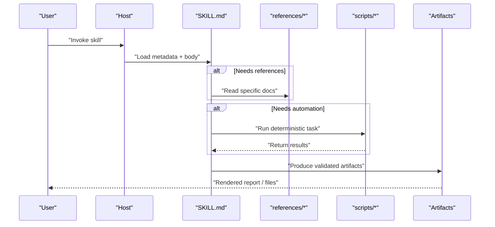
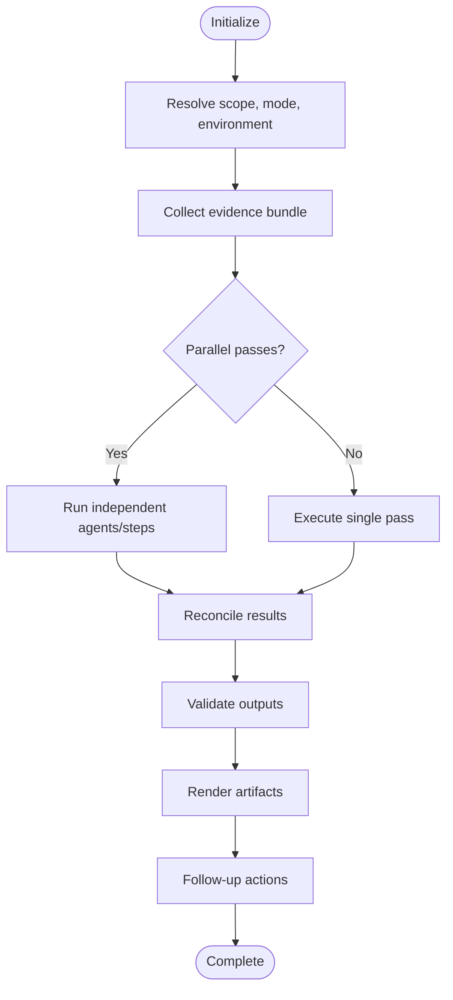
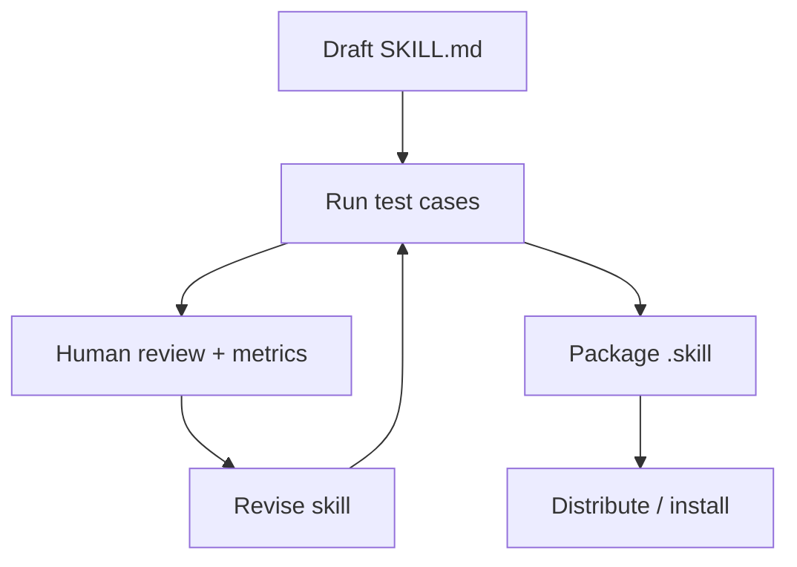
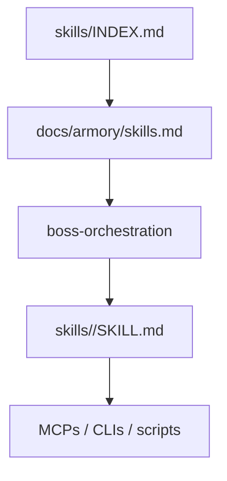

# Skill Creation

<cite>
**Referenced Files in This Document**
- [skills/INDEX.md](file://fractal-agentic/skills/INDEX.md)
- [docs/armory/skills.md](file://fractal-agentic/docs/armory/skills.md)
- [CUSTOMIZE.md](file://fractal-agentic/CUSTOMIZE.md)
- [skills/better-harness/SKILL.md](file://fractal-agentic/skills/better-harness/SKILL.md)
- [skills/skill-creator/SKILL.md](file://fractal-agentic/skills/skill-creator/SKILL.md)
- [skills/academic-research/SKILL.md](file://fractal-agentic/skills/academic-research/SKILL.md)
- [skills/better-interface/SKILL.md](file://fractal-agentic/skills/better-interface/SKILL.md)
</cite>

## Table of Contents
1. Introduction
2. Project Structure
3. Core Components
4. Architecture Overview
5. Detailed Component Analysis
6. Dependency Analysis
7. Performance Considerations
8. Troubleshooting Guide
9. Conclusion
10. Appendices

## Introduction
This document explains how to develop custom skills for the Fractal Agentic system. It covers the standardized skill interface (metadata, execution context, verification), reusable skill patterns (error handling, logging, reporting), lifecycle from initialization through execution and completion with context passing, and practical examples drawn from existing skills such as better-harness and skill-creator. It also includes testing strategies, debugging techniques, performance optimization, and guidance on packaging, distribution, and versioning.

## Project Structure
Skills are vendored under a single directory and discovered by name and description frontmatter. Each skill is a folder containing a SKILL.md file and optional resources:
- SKILL.md: required; YAML frontmatter (name, description) plus Markdown instructions
- references/: optional docs loaded into context as needed
- scripts/: optional executable code for deterministic tasks
- assets/: optional static files used in outputs

The index and armory documentation provide discovery and mapping rules that connect skills to bosses and commands.

**Diagram sources**
- [skills/INDEX.md:1-177](file://fractal-agentic/skills/INDEX.md#L1-L177)
- [docs/armory/skills.md:1-58](file://fractal-agentic/docs/armory/skills.md#L1-L58)

**Section sources**
- [skills/INDEX.md:1-177](file://fractal-agentic/skills/INDEX.md#L1-L177)
- [docs/armory/skills.md:1-58](file://fractal-agentic/docs/armory/skills.md#L1-L58)
- [CUSTOMIZE.md:78-150](file://fractal-agentic/CUSTOMIZE.md#L78-L150)

## Core Components
A skill’s standardized interface consists of:
- Metadata: name and description in YAML frontmatter; these drive discovery and triggering
- Execution context: the skill body defines when to use it, available tooling, workflow steps, output formats, and quality rules
- Verification mechanisms: explicit checks, evidence requirements, and output validation within the skill instructions

Key patterns:
- Progressive disclosure: metadata always in context; full body when triggered; bundled resources loaded on demand
- Domain organization: separate reference files per variant or domain to keep the main body concise
- Principle of lack of surprise: no hidden behavior or unsafe operations; clear intent and scope

**Section sources**
- [CUSTOMIZE.md:78-150](file://fractal-agentic/CUSTOMIZE.md#L78-L150)
- [skills/skill-creator/SKILL.md:62-114](file://fractal-agentic/skills/skill-creator/SKILL.md#L62-L114)
- [docs/armory/skills.md:1-58](file://fractal-agentic/docs/armory/skills.md#L1-L58)

## Architecture Overview
Skill creation and execution follow a consistent flow:
- Discovery: hosts scan skills/*/SKILL.md and present candidates based on name/description
- Activation: user or orchestrator selects a skill; the agent loads its body and any referenced resources
- Execution: the skill runs its defined workflow, using tools/scripts and producing artifacts
- Reporting: outputs are validated and rendered according to the skill’s contract

[No sources needed since this diagram shows conceptual workflow, not actual code structure]

## Detailed Component Analysis

### Standardized Skill Interface
- Metadata fields:
  - name: unique identifier
  - description: triggers and purpose; should be descriptive and “pushy” to improve activation accuracy
- Body sections:
  - When to use / When not to use
  - Available tooling (MCPs, CLIs, web search fallbacks)
  - Workflow steps (ordered, deterministic where possible)
  - Output formats (templates, schemas)
  - Quality rules (evidence, constraints, verification)

Examples:
- academic-research demonstrates tool selection, workflow, output templates, and quality rules
- better-interface shows orchestration across multiple domain skills, shared severity, and consolidated reporting

**Section sources**
- [skills/academic-research/SKILL.md:1-103](file://fractal-agentic/skills/academic-research/SKILL.md#L1-L103)
- [skills/better-interface/SKILL.md:1-139](file://fractal-agentic/skills/better-interface/SKILL.md#L1-L139)
- [skills/skill-creator/SKILL.md:62-114](file://fractal-agentic/skills/skill-creator/SKILL.md#L62-L114)

### Skill Lifecycle: Initialization to Completion
Initialization:
- Resolve scope, mode, and environment (workspace, locale, provider)
- Collect evidence bundle or prerequisites deterministically

Execution:
- Run independent passes or sub-steps in parallel where supported
- Use only authorized data and scopes; avoid delegating beyond allowed boundaries

Completion:
- Reconcile findings/results, assign severity and scores
- Render final artifacts via provided renderers or templates
- Follow-up actions (repair prompts, usage summaries, loop discovery)

Example: better-harness outlines a five-step lifecycle with evidence collection, parallel analysis, lead reconciliation, rendering, and follow-up.

**Diagram sources**
- [skills/better-harness/SKILL.md:1-113](file://fractal-agentic/skills/better-harness/SKILL.md#L1-L113)

**Section sources**
- [skills/better-harness/SKILL.md:1-113](file://fractal-agentic/skills/better-harness/SKILL.md#L1-L113)

### Multi-Step Workflows and Context Passing
- Define explicit step boundaries and inputs/outputs
- Keep context scoped per step; avoid leaking unauthorized data
- Use deterministic commands and capture outputs for downstream steps
- Provide clear error paths and recovery instructions

Example patterns:
- better-harness uses three independent evidence passes and consolidates them
- skill-creator coordinates test runs, grading, aggregation, and viewer launch with precise directories and metadata

**Section sources**
- [skills/better-harness/SKILL.md:39-89](file://fractal-agentic/skills/better-harness/SKILL.md#L39-L89)
- [skills/skill-creator/SKILL.md:175-269](file://fractal-agentic/skills/skill-creator/SKILL.md#L175-L269)

### External Dependencies and Tooling
- Prefer installed MCP servers or CLIs; define fallbacks
- Probe session tool list and adapt accordingly
- Document capabilities and limitations explicitly

Example: academic-research lists paper-search MCPs, arXiv, Semantic Scholar, and web search fallbacks with strict citation rules.

**Section sources**
- [skills/academic-research/SKILL.md:24-41](file://fractal-agentic/skills/academic-research/SKILL.md#L24-L41)

### Error Handling, Logging, and Reporting
- Fail fast with clear conditions and resume points
- Log evidence states and stage statuses
- Produce structured reports (JSON/HTML/Markdown) via provided renderers
- Include verifier information and confidence levels

Example: better-harness enforces status checks, partial vs failed bundles, and renderer validation.

**Section sources**
- [skills/better-harness/SKILL.md:59-103](file://fractal-agentic/skills/better-harness/SKILL.md#L59-L103)

### Practical Examples

#### Better Harness
- Purpose: review coding-agent harness for lifecycle controls, feedback, assets, outcomes, and repair planning
- Key steps: resolve scope, collect evidence bundle, run three independent passes, reconcile findings, render durable report, follow up
- Outputs: findings.json, report.md, report.html via renderer

**Section sources**
- [skills/better-harness/SKILL.md:1-113](file://fractal-agentic/skills/better-harness/SKILL.md#L1-L113)

#### Skill Creator
- Purpose: create, modify, and evaluate skills iteratively
- Key steps: capture intent, interview/research, write SKILL.md, run test cases, grade and aggregate, launch viewer, iterate improvements, optimize description, package
- Outputs: workspace iterations, benchmark.json, feedback.json, .skill package

**Section sources**
- [skills/skill-creator/SKILL.md:45-114](file://fractal-agentic/skills/skill-creator/SKILL.md#L45-L114)
- [skills/skill-creator/SKILL.md:175-269](file://fractal-agentic/skills/skill-creator/SKILL.md#L175-L269)
- [skills/skill-creator/SKILL.md:356-428](file://fractal-agentic/skills/skill-creator/SKILL.md#L356-L428)
- [skills/skill-creator/SKILL.md:431-440](file://fractal-agentic/skills/skill-creator/SKILL.md#L431-L440)

### Conceptual Overview
Conceptual skill development loop:
- Draft → Test → Review → Improve → Package
- Use progressive disclosure to manage context size
- Maintain separation between metadata, body, and resources

[No sources needed since this diagram shows conceptual workflow, not actual code structure]

## Dependency Analysis
Skills depend on:
- Discovery layer: skills/INDEX.md and armory docs
- Orchestration layer: boss-orchestration and routing contracts
- Optional tooling: MCPs, CLIs, scripts

**Diagram sources**
- [skills/INDEX.md:1-177](file://fractal-agentic/skills/INDEX.md#L1-L177)
- [docs/armory/skills.md:1-58](file://fractal-agentic/docs/armory/skills.md#L1-L58)

**Section sources**
- [skills/INDEX.md:1-177](file://fractal-agentic/skills/INDEX.md#L1-L177)
- [docs/armory/skills.md:1-58](file://fractal-agentic/docs/armory/skills.md#L1-L58)

## Performance Considerations
- Keep SKILL.md concise (<500 lines ideal); offload details to references
- Use parallel execution where supported; avoid unnecessary delegation
- Cache deterministic outputs and reuse scripts
- Prefer MCPs/CLIs over heavy web searches when available
- Profile timing and token usage during evaluations; adjust assertions and workflows accordingly

[No sources needed since this section provides general guidance]

## Troubleshooting Guide
Common issues and resolutions:
- Missing skill: ensure skills/<id>/SKILL.md exists and is vendored locally
- Spawn types missing: run install-agents.sh and start a fresh task
- Wrong stack defaults: re-check router and active boss stack gate
- Renderer failures: validate JSON and use provided renderers; do not hand-write artifacts
- Evaluation discrepancies: verify eval_metadata.json, grading.json fields, and benchmark schema

**Section sources**
- [CUSTOMIZE.md:561-579](file://fractal-agentic/CUSTOMIZE.md#L561-L579)
- [skills/skill-creator/SKILL.md:234-269](file://fractal-agentic/skills/skill-creator/SKILL.md#L234-L269)

## Conclusion
Fractal Agentic skills follow a standardized interface centered on metadata-driven discovery, structured execution, and verifiable outputs. By leveraging progressive disclosure, robust error handling, and evaluation-driven iteration, you can build reliable, reusable skills. The examples from better-harness and skill-creator illustrate multi-step workflows, external dependency management, and user feedback loops. Packaging and versioning are handled through plugin manifests and skill archives, enabling distribution and installation across environments.

## Appendices

### Skill Packaging, Distribution, and Versioning
- Package skills using the provided script to produce a .skill file
- Update plugin manifests (plugin.json and host-specific manifests) for versioning
- Vendor skills locally for offline installs; avoid broken symlinks
- Ensure scripts and capability TOMLs are included in published artifacts

**Section sources**
- [skills/skill-creator/SKILL.md:431-440](file://fractal-agentic/skills/skill-creator/SKILL.md#L431-L440)
- [CUSTOMIZE.md:469-490](file://fractal-agentic/CUSTOMIZE.md#L469-L490)

### Testing Strategies and Debugging Techniques
- Create realistic test prompts and save to evals/evals.json
- Run with-skill and baseline subagents in parallel; capture timing and tokens
- Grade outputs against assertions; aggregate into benchmark.json
- Launch the eval viewer for qualitative and quantitative review
- Iterate based on feedback; refine descriptions for trigger accuracy

**Section sources**
- [skills/skill-creator/SKILL.md:175-269](file://fractal-agentic/skills/skill-creator/SKILL.md#L175-L269)
- [skills/skill-creator/SKILL.md:356-428](file://fractal-agentic/skills/skill-creator/SKILL.md#L356-L428)