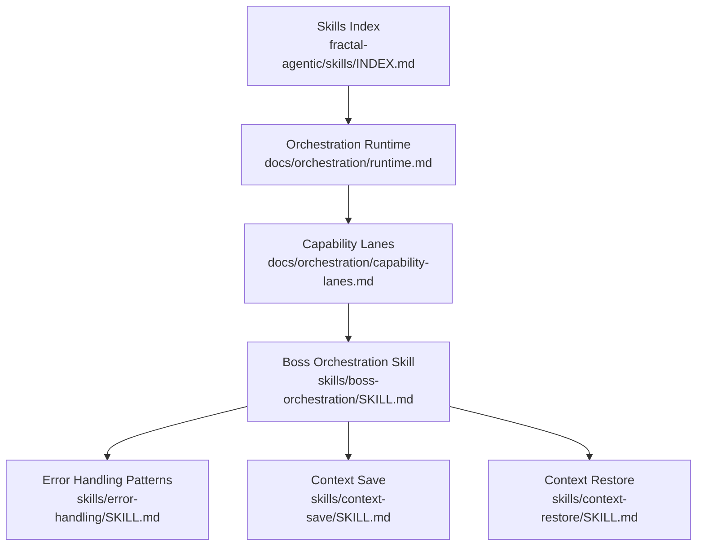
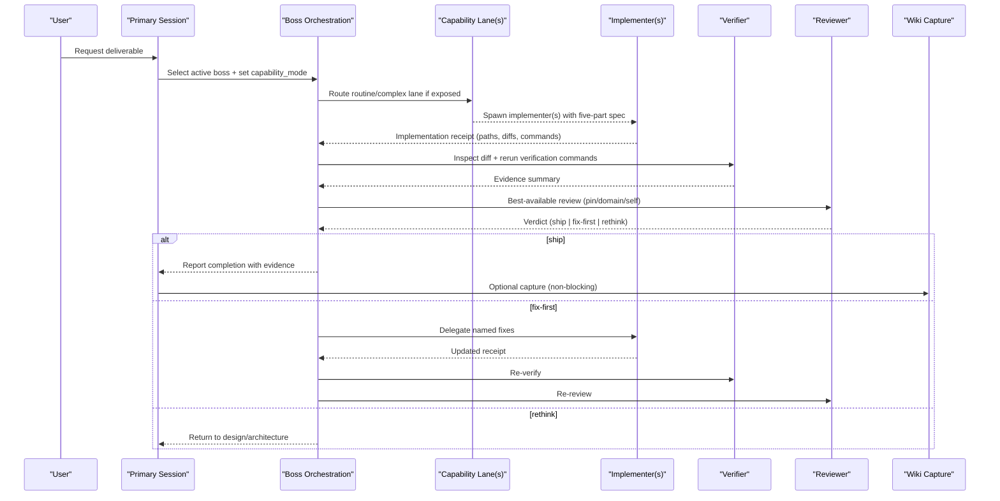
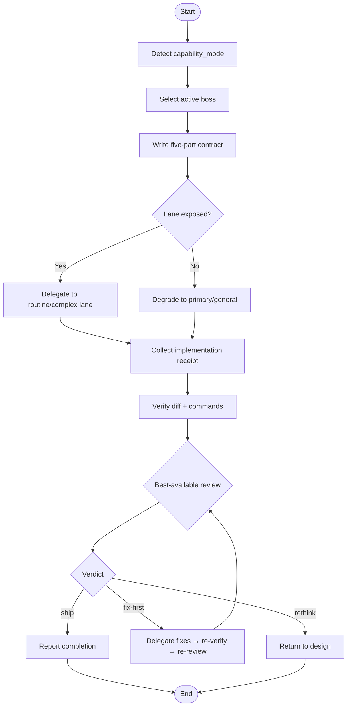
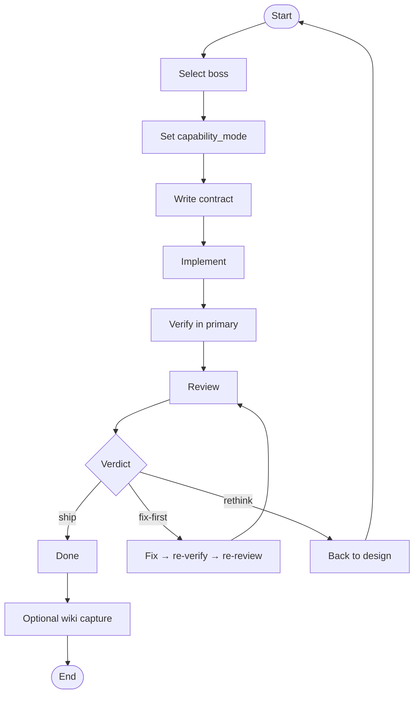
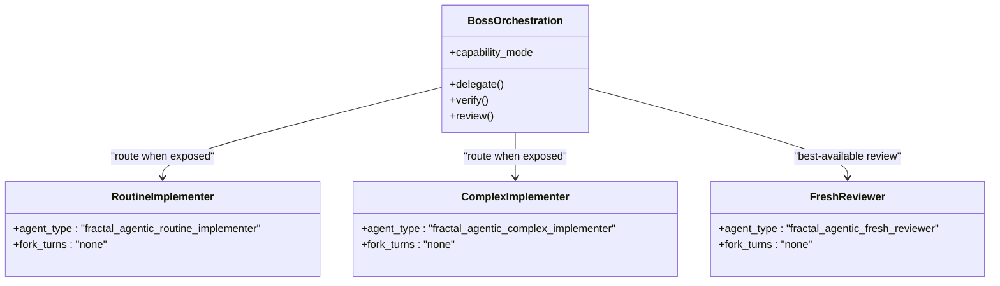
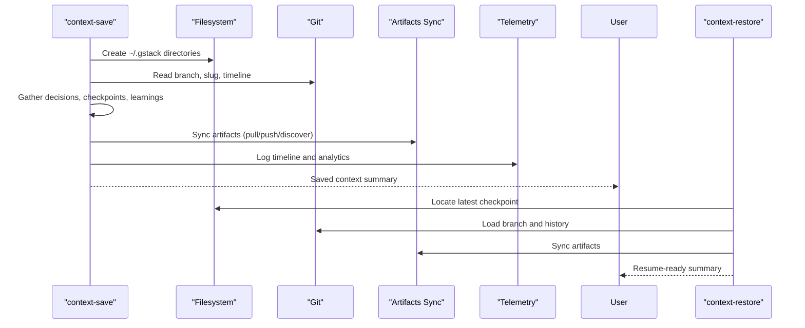
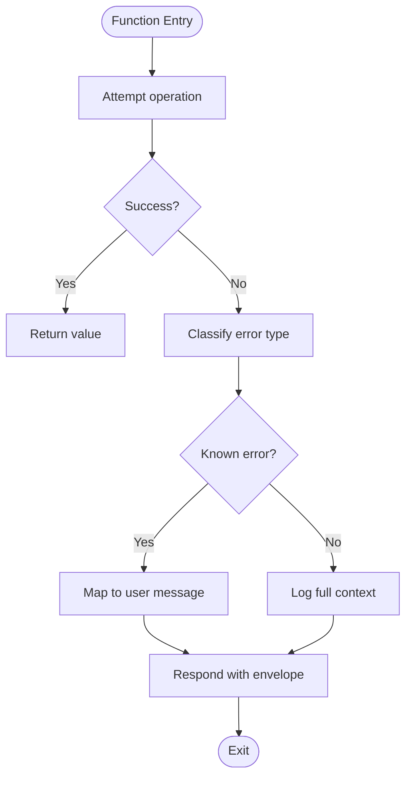
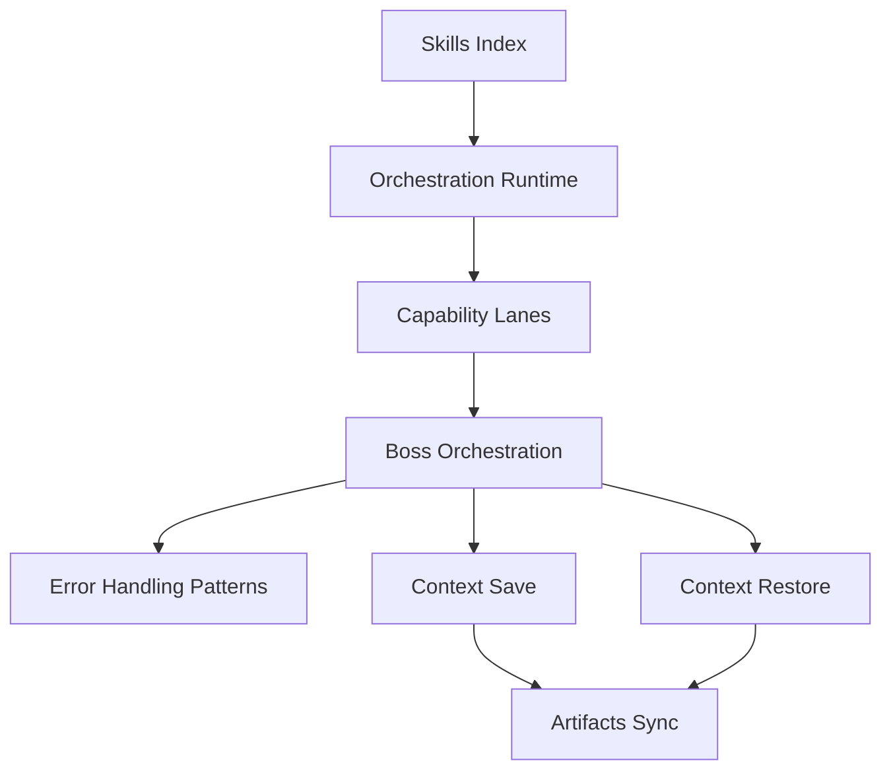

# Skill Execution & Lifecycle

<cite>
**Referenced Files in This Document**
- [skills/INDEX.md](file://fractal-agentic/skills/INDEX.md)
- [docs/orchestration/runtime.md](file://fractal-agentic/docs/orchestration/runtime.md)
- [docs/orchestration/capability-lanes.md](file://fractal-agentic/docs/orchestration/capability-lanes.md)
- [skills/boss-orchestration/SKILL.md](file://fractal-agentic/skills/boss-orchestration/SKILL.md)
- [skills/error-handling/SKILL.md](file://fractal-agentic/skills/error-handling/SKILL.md)
- [skills/context-save/SKILL.md](file://fractal-agentic/skills/context-save/SKILL.md)
- [skills/context-restore/SKILL.md](file://fractal-agentic/skills/context-restore/SKILL.md)
</cite>

## Table of Contents
1. [Introduction](#introduction)
2. [Project Structure](#project-structure)
3. [Core Components](#core-components)
4. [Architecture Overview](#architecture-overview)
5. [Detailed Component Analysis](#detailed-component-analysis)
6. [Dependency Analysis](#dependency-analysis)
7. [Performance Considerations](#performance-considerations)
8. [Troubleshooting Guide](#troubleshooting-guide)
9. [Conclusion](#conclusion)
10. [Appendices](#appendices)

## Introduction
This document explains the skill execution model and lifecycle management in Fractal Agentic. It covers how skills are discovered, selected, executed, verified, and reviewed; how context is passed between steps; how external dependencies (APIs, files) are handled safely; and how errors, retries, and graceful degradation are managed. It also provides practical examples for multi-step workflows, asynchronous operations, progress reporting, performance considerations, resource cleanup, memory management, debugging, logging, and monitoring.

## Project Structure
Fractal Agentic organizes skills as Markdown-based playbooks under a central index, with orchestration guidance and runtime behavior documented separately. The key elements:
- Skills Index: A curated inventory of all vendored skills with IDs and descriptions.
- Orchestration Runtime: A step-by-step loop for deliverables that change the repository or claim completion.
- Capability Lanes: Optional host-recognized roles to improve delegation and review quality.
- Boss Orchestration Skill: The runtime kernel that selects domain bosses, delegates work, verifies outcomes, and obtains best-available reviews.
- Error Handling Patterns: Typed error hierarchies, retry/backoff, circuit breakers, and user-facing messages across languages.
- Context Save/Restore: Cross-session state capture and resumption, including artifacts sync and telemetry.

**Diagram sources**
- [skills/INDEX.md](file://fractal-agentic/skills/INDEX.md)
- [docs/orchestration/runtime.md](file://fractal-agentic/docs/orchestration/runtime.md)
- [docs/orchestration/capability-lanes.md](file://fractal-agentic/docs/orchestration/capability-lanes.md)
- [skills/boss-orchestration/SKILL.md](file://fractal-agentic/skills/boss-orchestration/SKILL.md)
- [skills/error-handling/SKILL.md](file://fractal-agentic/skills/error-handling/SKILL.md)
- [skills/context-save/SKILL.md](file://fractal-agentic/skills/context-save/SKILL.md)
- [skills/context-restore/SKILL.md](file://fractal-agentic/skills/context-restore/SKILL.md)

**Section sources**
- [skills/INDEX.md](file://fractal-agentic/skills/INDEX.md)
- [docs/orchestration/runtime.md](file://fractal-agentic/docs/orchestration/runtime.md)
- [docs/orchestration/capability-lanes.md](file://fractal-agentic/docs/orchestration/capability-lanes.md)
- [skills/boss-orchestration/SKILL.md](file://fractal-agentic/skills/boss-orchestration/SKILL.md)

## Core Components
- Skills Index: Provides a live inventory of vendored skills with IDs and short descriptions. Use this to discover available capabilities and their purposes.
- Orchestration Runtime: Defines the canonical sequence for non-trivial deliverables: select boss, set capability mode, write contract, implement, verify, review, and optionally capture wiki episodes.
- Capability Lanes: Optional lanes (routine implementer, complex implementer, fresh reviewer) improve delegation and review when exposed by the host session; otherwise degrade gracefully.
- Boss Orchestration Skill: Acts as executive architect—selects domain boss, decomposes tasks, sets capability mode, delegates implementation, verifies evidence, and obtains final review with ship|fix-first|rethink verdicts.
- Error Handling Patterns: Typed errors, result patterns, API/global handlers, retry with exponential backoff, and user-facing message mapping.
- Context Save/Restore: Captures git state, decisions, and remaining work; restores across sessions and branches; integrates artifacts sync and telemetry.

**Section sources**
- [skills/INDEX.md](file://fractal-agentic/skills/INDEX.md)
- [docs/orchestration/runtime.md](file://fractal-agentic/docs/orchestration/runtime.md)
- [docs/orchestration/capability-lanes.md](file://fractal-agentic/docs/orchestration/capability-lanes.md)
- [skills/boss-orchestration/SKILL.md](file://fractal-agentic/skills/boss-orchestration/SKILL.md)
- [skills/error-handling/SKILL.md](file://fractal-agentic/skills/error-handling/SKILL.md)
- [skills/context-save/SKILL.md](file://fractal-agentic/skills/context-save/SKILL.md)
- [skills/context-restore/SKILL.md](file://fractal-agentic/skills/context-restore/SKILL.md)

## Architecture Overview
The execution architecture centers on a primary session orchestrating skills and optional capability lanes. The flow emphasizes non-blocking progression, strong verification, and best-available review.

**Diagram sources**
- [docs/orchestration/runtime.md](file://fractal-agentic/docs/orchestration/runtime.md)
- [docs/orchestration/capability-lanes.md](file://fractal-agentic/docs/orchestration/capability-lanes.md)
- [skills/boss-orchestration/SKILL.md](file://fractal-agentic/skills/boss-orchestration/SKILL.md)

## Detailed Component Analysis

### Boss Orchestration Skill
The boss orchestration skill is the runtime kernel. It:
- Sets capability_mode once per task based on session exposure.
- Selects domain boss using decision rules.
- Delegates implementation via routine or complex lanes when available; otherwise degrades to primary/general agents.
- Requires an implementation receipt with owned paths, changed paths, command results, gaps, residual risk, and proposed verdict.
- Verifies in the primary session by inspecting diffs and rerunning verification commands.
- Obtains a final review from a pinned reviewer, domain specialist, general read-only, or structured self-review.
- Produces one of ship|fix-first|rethink.

**Diagram sources**
- [skills/boss-orchestration/SKILL.md](file://fractal-agentic/skills/boss-orchestration/SKILL.md)

**Section sources**
- [skills/boss-orchestration/SKILL.md](file://fractal-agentic/skills/boss-orchestration/SKILL.md)

### Orchestration Runtime Loop
The runtime loop defines the canonical sequence for deliverables that change the repository or claim completion:
- Select active boss (or let /orchestrate choose).
- Set capability_mode once.
- Write contract with objective, ownership, interfaces, constraints, and verification.
- Implement via lanes or primary session.
- Verify in primary session using real diff and commands.
- Review with exactly one verdict: ship, fix-first, or rethink.
- For release-critical work, run additional checks (e.g., santa-loop).
- Optionally capture wiki episode.

**Diagram sources**
- [docs/orchestration/runtime.md](file://fractal-agentic/docs/orchestration/runtime.md)

**Section sources**
- [docs/orchestration/runtime.md](file://fractal-agentic/docs/orchestration/runtime.md)

### Capability Lanes
Capability lanes are optional host-recognized roles:
- Routine implementer: for boilerplate, wiring, CRUD, bounded fixes.
- Complex implementer: for judgment-heavy tasks, concurrency, security-sensitive paths.
- Fresh reviewer: independent review thread.

If pins are not exposed, degrade to primary/general agents without blocking delivery. Always keep the five-part contract and verify in primary.

**Diagram sources**
- [docs/orchestration/capability-lanes.md](file://fractal-agentic/docs/orchestration/capability-lanes.md)
- [skills/boss-orchestration/SKILL.md](file://fractal-agentic/skills/boss-orchestration/SKILL.md)

**Section sources**
- [docs/orchestration/capability-lanes.md](file://fractal-agentic/docs/orchestration/capability-lanes.md)
- [skills/boss-orchestration/SKILL.md](file://fractal-agentic/skills/boss-orchestration/SKILL.md)

### Context Save and Restore
Context save captures git state, decisions, and remaining work so future sessions can resume seamlessly. It includes:
- Preamble environment detection (branch, session kind, plan mode, telemetry).
- Artifacts sync (local or remote MCP modes).
- Continuous checkpoint mode (WIP commits with structured metadata).
- Completion status protocol and operational self-improvement logs.
- Telemetry recording at skill end.

Context restore loads the most recent saved context across branches, presents summaries, and suggests next actions. It follows the same preamble and artifact sync logic.

**Diagram sources**
- [skills/context-save/SKILL.md](file://fractal-agentic/skills/context-save/SKILL.md)
- [skills/context-restore/SKILL.md](file://fractal-agentic/skills/context-restore/SKILL.md)

**Section sources**
- [skills/context-save/SKILL.md](file://fractal-agentic/skills/context-save/SKILL.md)
- [skills/context-restore/SKILL.md](file://fractal-agentic/skills/context-restore/SKILL.md)

### Error Handling Patterns
Robust error handling across TypeScript, Python, and Go:
- Typed error classes/hierarchies with codes and status codes.
- Result pattern for no-throw style operations.
- Global API exception handlers mapping errors to standardized envelopes.
- Retry with exponential backoff and jitter; only retry transient errors.
- User-facing messages separated from developer logs.

**Diagram sources**
- [skills/error-handling/SKILL.md](file://fractal-agentic/skills/error-handling/SKILL.md)

**Section sources**
- [skills/error-handling/SKILL.md](file://fractal-agentic/skills/error-handling/SKILL.md)

## Dependency Analysis
Skills depend on orchestration runtime and capability lanes to route work, verify outcomes, and obtain reviews. Context save/restore depends on filesystem, git, and optional artifacts sync. Error handling patterns are cross-cutting utilities used by skills and workers.

**Diagram sources**
- [skills/INDEX.md](file://fractal-agentic/skills/INDEX.md)
- [docs/orchestration/runtime.md](file://fractal-agentic/docs/orchestration/runtime.md)
- [docs/orchestration/capability-lanes.md](file://fractal-agentic/docs/orchestration/capability-lanes.md)
- [skills/boss-orchestration/SKILL.md](file://fractal-agentic/skills/boss-orchestration/SKILL.md)
- [skills/error-handling/SKILL.md](file://fractal-agentic/skills/error-handling/SKILL.md)
- [skills/context-save/SKILL.md](file://fractal-agentic/skills/context-save/SKILL.md)
- [skills/context-restore/SKILL.md](file://fractal-agentic/skills/context-restore/SKILL.md)

**Section sources**
- [skills/INDEX.md](file://fractal-agentic/skills/INDEX.md)
- [docs/orchestration/runtime.md](file://fractal-agentic/docs/orchestration/runtime.md)
- [docs/orchestration/capability-lanes.md](file://fractal-agentic/docs/orchestration/capability-lanes.md)
- [skills/boss-orchestration/SKILL.md](file://fractal-agentic/skills/boss-orchestration/SKILL.md)
- [skills/error-handling/SKILL.md](file://fractal-agentic/skills/error-handling/SKILL.md)
- [skills/context-save/SKILL.md](file://fractal-agentic/skills/context-save/SKILL.md)
- [skills/context-restore/SKILL.md](file://fractal-agentic/skills/context-restore/SKILL.md)

## Performance Considerations
- Prefer dedicated tools over generic Bash where possible (Read, Edit, Write, Glob, Grep) to reduce overhead and improve clarity.
- Use parallel execution for independent tasks; serialize shared-file edits and dependency chains.
- Apply retry with exponential backoff and jitter for transient network failures; avoid retrying client errors.
- Keep context small and focused; use continuous checkpoint mode judiciously to avoid excessive commits.
- Monitor telemetry and timeline logs to identify bottlenecks and long-running operations.
- Avoid silent failures; surface errors early and loudly with typed error hierarchies.

[No sources needed since this section provides general guidance]

## Troubleshooting Guide
Common issues and resolutions:
- Missing capability pins: Degrade to primary/general agents; report capability_mode and pins status.
- AskUserQuestion unavailable: Follow prose fallback with ELI10, completeness scores, recommendation, and explicit confirmation for destructive actions.
- Failed verification: Collect implementation receipt, inspect diff, rerun verification commands, and re-delegate corrections.
- External dependency failures: Use typed errors, result patterns, and retry/backoff; log full context server-side; map to user-friendly messages.
- Context loss: Use /context-save before long runs; /context-restore to resume across sessions and branches.

**Section sources**
- [skills/boss-orchestration/SKILL.md](file://fractal-agentic/skills/boss-orchestration/SKILL.md)
- [skills/context-save/SKILL.md](file://fractal-agentic/skills/context-save/SKILL.md)
- [skills/context-restore/SKILL.md](file://fractal-agentic/skills/context-restore/SKILL.md)
- [skills/error-handling/SKILL.md](file://fractal-agentic/skills/error-handling/SKILL.md)

## Conclusion
Fractal Agentic’s skill execution model emphasizes robust orchestration, verifiable outcomes, and graceful degradation. The boss orchestration skill coordinates selection, delegation, verification, and review while maintaining non-blocking progression. Context save/restore ensures continuity across sessions, and error handling patterns provide resilience for external dependencies. Following these practices yields reliable, observable, and maintainable multi-step workflows.

[No sources needed since this section summarizes without analyzing specific files]

## Appendices

### Practical Examples

#### Multi-step Workflow Example
- Select boss and set capability_mode.
- Write five-part contract with objective, ownership, interfaces, constraints, and verification.
- Delegate to routine/complex lane if exposed; otherwise implement in primary.
- Collect implementation receipt and verify in primary.
- Obtain best-available review; act on verdict (ship|fix-first|rethink).

**Section sources**
- [docs/orchestration/runtime.md](file://fractal-agentic/docs/orchestration/runtime.md)
- [skills/boss-orchestration/SKILL.md](file://fractal-agentic/skills/boss-orchestration/SKILL.md)

#### Asynchronous Operations Example
- Use async functions with typed errors and result patterns.
- Wrap unreliable calls with retry/backoff and jitter.
- Log full context on failure; return user-friendly messages.

**Section sources**
- [skills/error-handling/SKILL.md](file://fractal-agentic/skills/error-handling/SKILL.md)

#### Progress Reporting Example
- Emit periodic [PROGRESS] summaries during long-running skills.
- Use completion status protocol (DONE, DONE_WITH_CONCERNS, BLOCKED, NEEDS_CONTEXT).
- Record timeline events and analytics at skill start/end.

**Section sources**
- [skills/context-save/SKILL.md](file://fractal-agentic/skills/context-save/SKILL.md)
- [skills/context-restore/SKILL.md](file://fractal-agentic/skills/context-restore/SKILL.md)