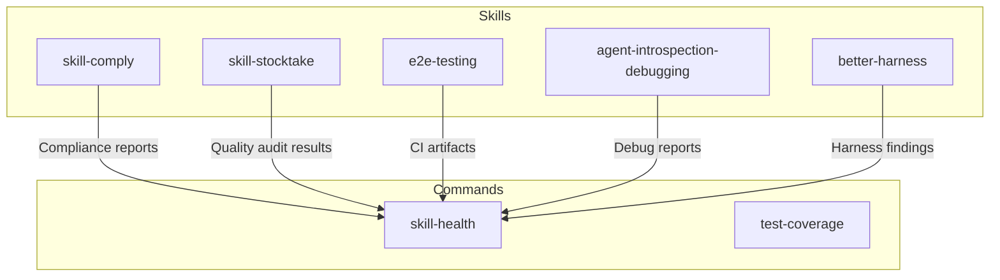
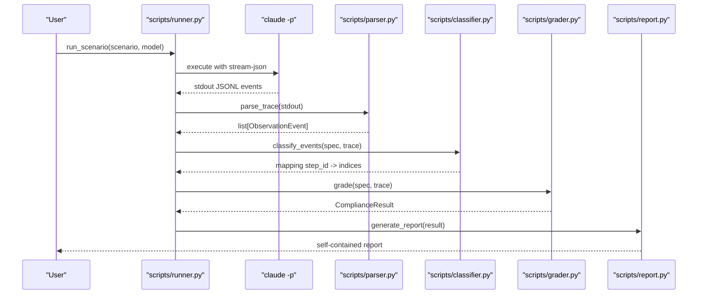
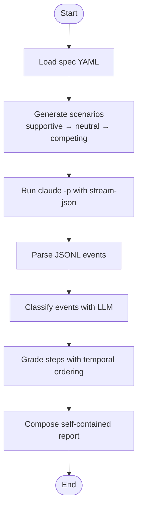
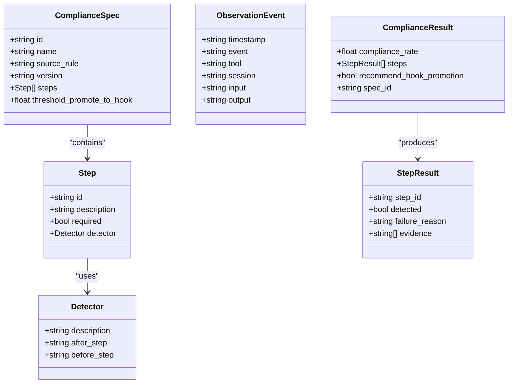
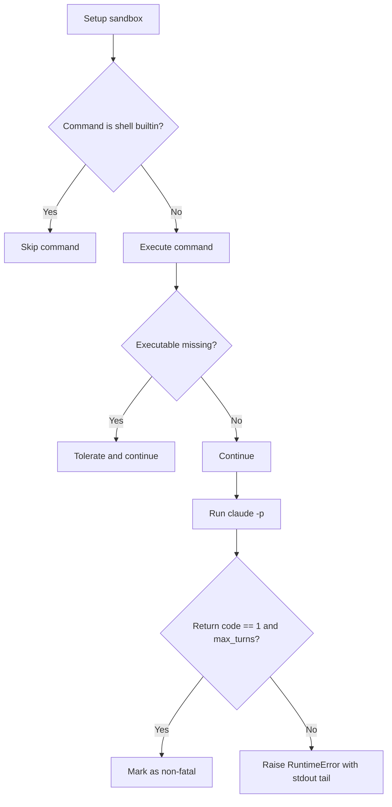
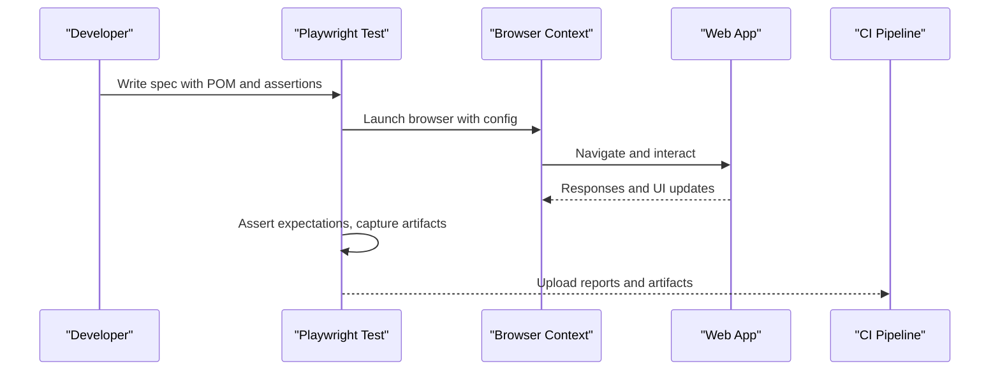
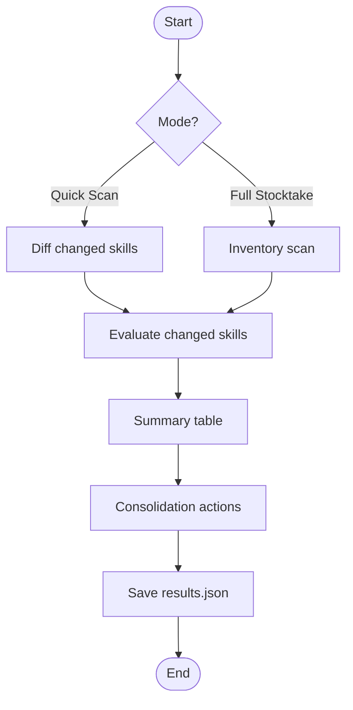
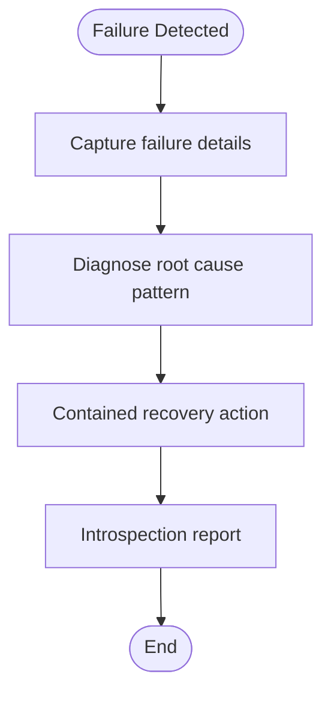
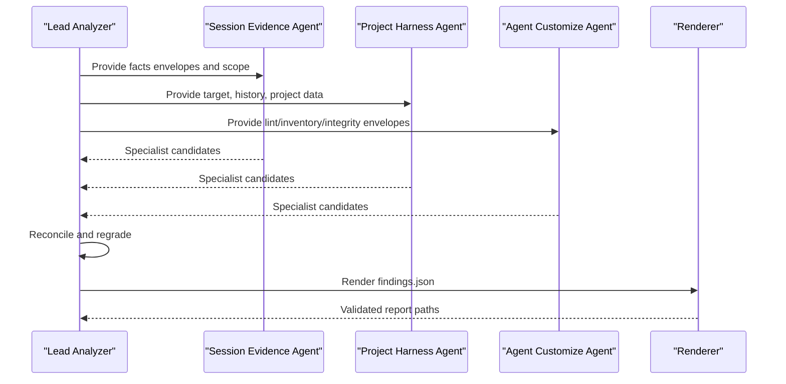
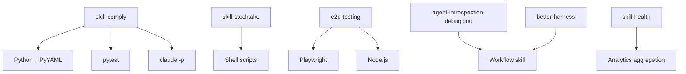

# Testing & Debugging Skills

<cite>
**Referenced Files in This Document**
- [SKILL.md](file://fractal-agentic/skills/skill-comply/SKILL.md)
- [pyproject.toml](file://fractal-agentic/skills/skill-comply/pyproject.toml)
- [tdd_spec.yaml](file://fractal-agentic/skills/skill-comply/fixtures/tdd_spec.yaml)
- [test_grader.py](file://fractal-agentic/skills/skill-comply/tests/test_grader.py)
- [test_runner.py](file://fractal-agentic/skills/skill-comply/tests/test_runner.py)
- [SKILL.md](file://fractal-agentic/skills/skill-stocktake/SKILL.md)
- [SKILL.md](file://fractal-agentic/skills/e2e-testing/SKILL.md)
- [SKILL.md](file://fractal-agentic/skills/agent-introspection-debugging/SKILL.md)
- [SKILL.md](file://fractal-agentic/skills/better-harness/SKILL.md)
- [skill-health.md](file://fractal-agentic/commands/skill-health.md)
- [test-coverage.md](file://fractal-agentic/commands/test-coverage.md)
</cite>

## Table of Contents
1. Introduction
2. Project Structure
3. Core Components
4. Architecture Overview
5. Detailed Component Analysis
6. Dependency Analysis
7. Performance Considerations
8. Troubleshooting Guide
9. Conclusion
10. Appendices

## Introduction
This document provides a comprehensive guide to testing and debugging custom skills in the Fractal Agentic system. It covers unit testing strategies for skill logic, integration testing for external dependencies, and end-to-end testing for complete workflows. It also explains how to use the skill-comply framework for automated compliance measurement and the stocktake tool for skill auditing. Finally, it documents debugging techniques including log analysis, context inspection, performance profiling, and continuous integration setup for automated skill testing and quality gates.

## Project Structure
The repository includes multiple skills that define testing and debugging practices:
- skill-comply: Automated compliance measurement with Python scripts, fixtures, prompts, and tests.
- skill-stocktake: Auditing agent skills and commands using a checklist and AI holistic judgment.
- e2e-testing: Playwright-based end-to-end testing patterns and CI integration.
- agent-introspection-debugging: Structured self-debugging workflow for agent failures.
- better-harness: Reviewing the coding-agent harness lifecycle, feedback, and reporting.
- Commands: skill-health dashboard and test-coverage guidance.

**Diagram sources**
- [SKILL.md](file://fractal-agentic/skills/skill-comply/SKILL.md)
- [SKILL.md](file://fractal-agentic/skills/skill-stocktake/SKILL.md)
- [SKILL.md](file://fractal-agentic/skills/e2e-testing/SKILL.md)
- [SKILL.md](file://fractal-agentic/skills/agent-introspection-debugging/SKILL.md)
- [SKILL.md](file://fractal-agentic/skills/better-harness/SKILL.md)
- [skill-health.md](file://fractal-agentic/commands/skill-health.md)

**Section sources**
- [SKILL.md](file://fractal-agentic/skills/skill-comply/SKILL.md)
- [SKILL.md](file://fractal-agentic/skills/skill-stocktake/SKILL.md)
- [SKILL.md](file://fractal-agentic/skills/e2e-testing/SKILL.md)
- [SKILL.md](file://fractal-agentic/skills/agent-introspection-debugging/SKILL.md)
- [SKILL.md](file://fractal-agentic/skills/better-harness/SKILL.md)
- [skill-health.md](file://fractal-agentic/commands/skill-health.md)

## Core Components
- skill-comply: Generates behavioral specs from .md files, creates scenarios at different prompt strictness levels, runs agents via CLI, captures tool call traces, classifies events using LLM, checks temporal ordering, and produces self-contained reports.
- skill-stocktake: Audits skills and commands with Quick Scan and Full Stocktake modes, evaluates against a checklist, and consolidates results into a JSON report.
- e2e-testing: Provides Playwright patterns, Page Object Model, configuration, artifact management, flaky test strategies, and CI/CD integration.
- agent-introspection-debugging: Four-phase loop for failure capture, root-cause diagnosis, contained recovery, and introspection reporting.
- better-harness: Orchestrates evidence collection, three independent evidence passes, lead reconciliation, and durable report rendering.
- skill-health: Dashboard for portfolio health with success rates, failure clustering, amendments, and version history.
- test-coverage: Detects frameworks, analyzes coverage, generates missing tests, verifies improvements, and reports before/after metrics.

**Section sources**
- [SKILL.md](file://fractal-agentic/skills/skill-comply/SKILL.md)
- [SKILL.md](file://fractal-agentic/skills/skill-stocktake/SKILL.md)
- [SKILL.md](file://fractal-agentic/skills/e2e-testing/SKILL.md)
- [SKILL.md](file://fractal-agentic/skills/agent-introspection-debugging/SKILL.md)
- [SKILL.md](file://fractal-agentic/skills/better-harness/SKILL.md)
- [skill-health.md](file://fractal-agentic/commands/skill-health.md)
- [test-coverage.md](file://fractal-agentic/commands/test-coverage.md)

## Architecture Overview
The skill-comply pipeline integrates spec generation, scenario creation, execution, classification, grading, and reporting. The following sequence diagram maps the flow across scripts and tests.

**Diagram sources**
- [SKILL.md](file://fractal-agentic/skills/skill-comply/SKILL.md)
- [test_runner.py](file://fractal-agentic/skills/skill-comply/tests/test_runner.py)
- [test_grader.py](file://fractal-agentic/skills/skill-comply/tests/test_grader.py)

## Detailed Component Analysis

### skill-comply: Automated Compliance Measurement
- Purpose: Measure whether agents follow skills/rules/definitions by generating specs, scenarios, running agents, capturing traces, classifying events, checking ordering, and producing reports.
- Key elements:
  - Spec definition (YAML) describing steps, detectors, required flags, and thresholds.
  - Fixtures for compliant/noncompliant traces and a TDD spec.
  - Scripts for parsing, classification, grading, and reporting.
  - Tests validating grader behavior and runner robustness.

**Diagram sources**
- [SKILL.md](file://fractal-agentic/skills/skill-comply/SKILL.md)
- [tdd_spec.yaml](file://fractal-agentic/skills/skill-comply/fixtures/tdd_spec.yaml)

**Section sources**
- [SKILL.md](file://fractal-agentic/skills/skill-comply/SKILL.md)
- [tdd_spec.yaml](file://fractal-agentic/skills/skill-comply/fixtures/tdd_spec.yaml)
- [pyproject.toml](file://fractal-agentic/skills/skill-comply/pyproject.toml)

#### Unit Testing Strategies for skill-comply
- Fixture-driven tests: Use tdd_spec.yaml and fixture traces to assert expected compliance outcomes.
- Mocking LLM classification: Patch classifier to simulate compliant/noncompliant mappings.
- Edge case validation: Empty traces, out-of-order after_step references, threshold promotions.
- Assertions: Verify compliance_rate, detected steps, hook promotion recommendations, and evidence presence.

**Diagram sources**
- [tdd_spec.yaml](file://fractal-agentic/skills/skill-comply/fixtures/tdd_spec.yaml)
- [test_grader.py](file://fractal-agentic/skills/skill-comply/tests/test_grader.py)

**Section sources**
- [test_grader.py](file://fractal-agentic/skills/skill-comply/tests/test_grader.py)

#### Integration Testing for External Dependencies
- Subprocess execution: Validate runner behavior when invoking claude -p and handling stdout/stderr.
- Robust setup: Skip shell builtins (cd/pushd/popd), tolerate missing executables, ensure real commands still run.
- Graceful termination: Treat rc=1 with max_turns marker as non-fatal; otherwise raise RuntimeError.
- Error diagnostics: Include stdout tail in error messages for improved debuggability.

**Diagram sources**
- [test_runner.py](file://fractal-agentic/skills/skill-comply/tests/test_runner.py)

**Section sources**
- [test_runner.py](file://fractal-agentic/skills/skill-comply/tests/test_runner.py)

#### End-to-End Testing for Complete Workflows
- Playwright patterns: Organize tests under tests/e2e with Page Object Model, stable locators, and explicit waits.
- Configuration: Parallel execution, retries, workers, reporters (HTML, JUnit, JSON), tracing, screenshots, videos.
- CI/CD: GitHub Actions workflow installing dependencies, browsers, running tests, uploading artifacts.
- Flaky test strategies: Quarantine, conditional skip, identify causes, fix race conditions and timing issues.

**Diagram sources**
- [SKILL.md](file://fractal-agentic/skills/e2e-testing/SKILL.md)

**Section sources**
- [SKILL.md](file://fractal-agentic/skills/e2e-testing/SKILL.md)

### skill-stocktake: Skill Auditing
- Modes: Quick Scan (changed skills only) and Full Stocktake (complete review).
- Phases: Inventory, Quality Evaluation (AI holistic judgment), Summary Table, Consolidation.
- Results: JSON schema with evaluated_at, mode, batch_progress, and per-skill verdicts/reasons.

**Diagram sources**
- [SKILL.md](file://fractal-agentic/skills/skill-stocktake/SKILL.md)

**Section sources**
- [SKILL.md](file://fractal-agentic/skills/skill-stocktake/SKILL.md)

### Agent Introspection Debugging
- Four-phase loop: Failure Capture, Root-Cause Diagnosis, Contained Recovery, Introspection Report.
- Patterns: Identify loops, context overflow, timeouts, quota exhaustion, file state mismatches.
- Output: Standardized markdown sections for clarity and follow-up.

**Diagram sources**
- [SKILL.md](file://fractal-agentic/skills/agent-introspection-debugging/SKILL.md)

**Section sources**
- [SKILL.md](file://fractal-agentic/skills/agent-introspection-debugging/SKILL.md)

### Better Harness: Harness Review and Reporting
- Evidence bundle collection: Session, project harness, agent customize lanes.
- Three independent evidence passes: Session evidence, project harness evidence, agent customize evidence.
- Lead reconciliation: Merge candidates, assign severity, derive dimension scores, select support track.
- Durable report rendering: Render findings.json to HTML/Markdown with validation.

**Diagram sources**
- [SKILL.md](file://fractal-agentic/skills/better-harness/SKILL.md)

**Section sources**
- [SKILL.md](file://fractal-agentic/skills/better-harness/SKILL.md)

## Dependency Analysis
- skill-comply depends on Python environment, PyYAML, pytest for tests, and external claude CLI for execution.
- skill-stocktake relies on shell scripts for scanning, diffing, and saving results.
- e2e-testing uses Playwright, Node.js, and CI runners for browser automation.
- agent-introspection-debugging and better-harness are workflow skills guiding structured processes.
- skill-health aggregates analytics from various sources to produce dashboards.

**Diagram sources**
- [pyproject.toml](file://fractal-agentic/skills/skill-comply/pyproject.toml)
- [SKILL.md](file://fractal-agentic/skills/skill-stocktake/SKILL.md)
- [SKILL.md](file://fractal-agentic/skills/e2e-testing/SKILL.md)

**Section sources**
- [pyproject.toml](file://fractal-agentic/skills/skill-comply/pyproject.toml)
- [SKILL.md](file://fractal-agentic/skills/skill-stocktake/SKILL.md)
- [SKILL.md](file://fractal-agentic/skills/e2e-testing/SKILL.md)

## Performance Considerations
- Parallelization: Use fullyParallel and workers in Playwright for faster E2E runs.
- Retries and timeouts: Configure retries and action/navigation timeouts to balance stability and speed.
- Artifact management: Limit screenshots/videos to failures to reduce storage and I/O overhead.
- Trace sampling: Enable tracing on first retry to minimize overhead while aiding diagnosis.
- Batch processing: Chunk evaluations in skill-stocktake to manage context size and runtime.

[No sources needed since this section provides general guidance]

## Troubleshooting Guide
- Log analysis: Inspect stdout tails and stderr for claude -p failures; include diagnostic markers in error messages.
- Context inspection: Use agent-introspection-debugging phases to capture failure state, diagnose patterns, and apply contained recovery.
- Performance profiling: Leverage Playwright traces and screenshots/videos to identify bottlenecks and flakiness.
- Common scenarios:
  - Maximum tool calls or repeated commands: Check for loops or missing exit conditions.
  - Context overflow: Trim low-signal content and focus on active goal and blockers.
  - Service unavailability: Verify URLs, ports, and service health.
  - Quota exhaustion: Implement backoff and reduce retry storms.
  - File state mismatch: Re-check cwd, branch, and actual file existence.

**Section sources**
- [test_runner.py](file://fractal-agentic/skills/skill-comply/tests/test_runner.py)
- [SKILL.md](file://fractal-agentic/skills/agent-introspection-debugging/SKILL.md)
- [SKILL.md](file://fractal-agentic/skills/e2e-testing/SKILL.md)

## Conclusion
The Fractal Agentic system provides robust tools and workflows for testing and debugging custom skills. skill-comply enables automated compliance measurement with detailed reporting, while skill-stocktake offers comprehensive auditing capabilities. Playwright-based E2E testing ensures stable and maintainable end-to-end validations. Agent introspection debugging and better harness workflows provide structured approaches to diagnosing and resolving failures. Integrating these practices into continuous integration pipelines establishes strong quality gates and reliable delivery.

[No sources needed since this section summarizes without analyzing specific files]

## Appendices

### Continuous Integration Setup for Automated Skill Testing and Quality Gates
- E2E tests: Use GitHub Actions to install dependencies, browsers, run tests, and upload artifacts.
- Coverage: Detect framework, analyze reports, generate missing tests, verify improvements, and enforce thresholds.
- Compliance: Run skill-comply with dry-run and full runs to validate adherence to rules and skills.
- Auditing: Schedule periodic skill-stocktake to maintain quality and retire outdated skills.

**Section sources**
- [SKILL.md](file://fractal-agentic/skills/e2e-testing/SKILL.md)
- [test-coverage.md](file://fractal-agentic/commands/test-coverage.md)
- [SKILL.md](file://fractal-agentic/skills/skill-comply/SKILL.md)
- [SKILL.md](file://fractal-agentic/skills/skill-stocktake/SKILL.md)