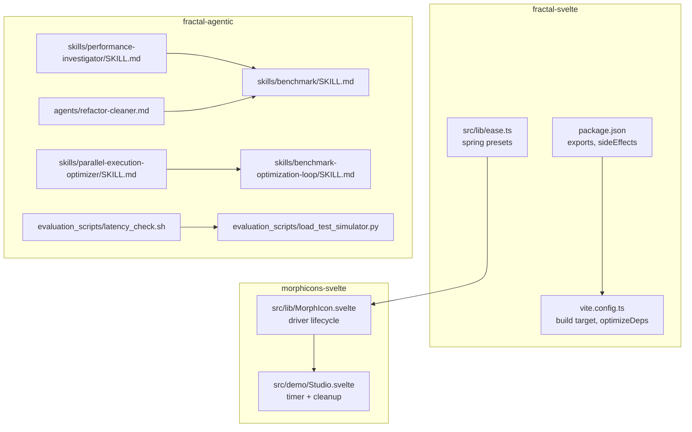
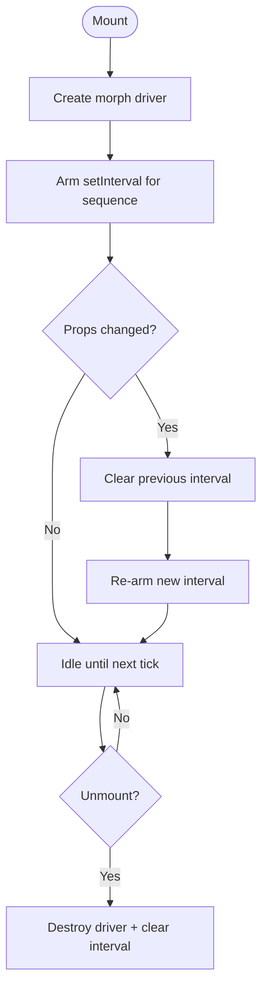
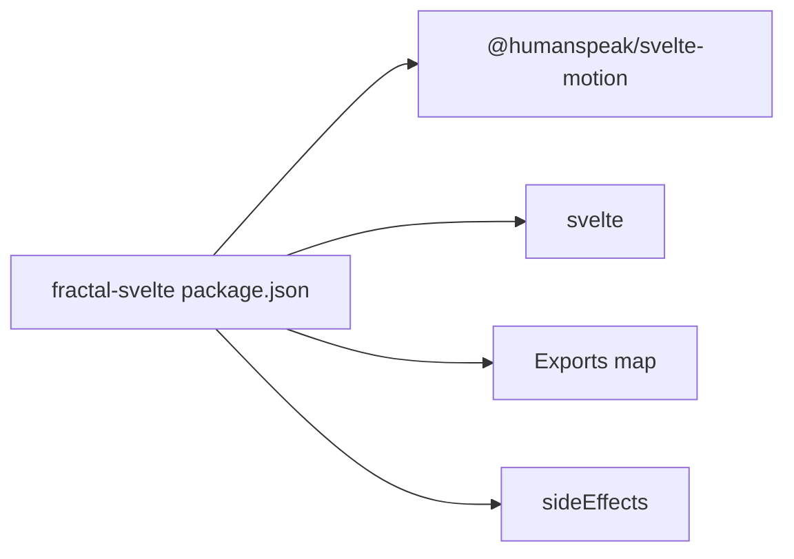

# Performance Optimization

<cite>
**Referenced Files in This Document**
- [package.json](file://packages/fractal-svelte/package.json)
- [vite.config.ts](file://packages/fractal-svelte/vite.config.ts)
- [ease.ts](file://packages/fractal-svelte/src/lib/ease.ts)
- [Studio.svelte](file://packages/morphicons-svelte/src/demo/Studio.svelte)
- [MorphIcon.svelte](file://packages/morphicons-svelte/src/lib/MorphIcon.svelte)
- [animations.md](file://packages/fractal-agentic/skills/better-ui/animations.md)
- [performance-investigator/SKILL.md](file://packages/fractal-agentic/skills/performance-investigator/SKILL.md)
- [benchmark/SKILL.md](file://packages/fractal-agentic/skills/benchmark/SKILL.md)
- [parallel-execution-optimizer/SKILL.md](file://packages/fractal-agentic/skills/parallel-execution-optimizer/SKILL.md)
- [benchmark-optimization-loop/SKILL.md](file://packages/fractal-agentic/skills/benchmark-optimization-loop/SKILL.md)
- [latency_check.sh](file://packages/fractal-agentic/evaluation_scripts/latency_check.sh)
- [load_test_simulator.py](file://packages/fractal-agentic/evaluation_scripts/load_test_simulator.py)
- [refactor-cleaner.md](file://packages/fractal-agentic/agents/refactor-cleaner.md)
</cite>

## Table of Contents
1. Introduction
2. Project Structure
3. Core Components
4. Architecture Overview
5. Detailed Component Analysis
6. Dependency Analysis
7. Performance Considerations
8. Troubleshooting Guide
9. Conclusion
10. Appendices

## Introduction
This document provides a comprehensive performance optimization guide for the repository, focusing on runtime performance, bundle size reduction, memory management, and agent orchestration efficiency. It consolidates best practices for spring animation timing, parallel execution strategies, tree shaking and lazy loading patterns, profiling tools, and concrete before/after improvement examples grounded in the codebase.

## Project Structure
The repository contains multiple packages:
- fractal-svelte: Svelte 5 UI primitives with motion and agent components, built via Vite and SvelteKit.
- morphicons-svelte: Animated icon component library using a morphing driver and spring transitions.
- fractal-agentic: Orchestration skills, agents, commands, evaluation scripts, and performance investigation guidance.



**Diagram sources**
- [package.json:43-51](file://packages/fractal-svelte/package.json#L43-L51)
- [vite.config.ts:14-21](file://packages/fractal-svelte/vite.config.ts#L14-L21)
- [ease.ts:12-22](file://packages/fractal-svelte/src/lib/ease.ts#L12-L22)
- [MorphIcon.svelte:141-172](file://packages/morphicons-svelte/src/lib/MorphIcon.svelte#L141-L172)
- [Studio.svelte:134-157](file://packages/morphicons-svelte/src/demo/Studio.svelte#L134-L157)
- [performance-investigator/SKILL.md:1-20](file://packages/fractal-agentic/skills/performance-investigator/SKILL.md#L1-L20)
- [benchmark/SKILL.md:1-20](file://packages/fractal-agentic/skills/benchmark/SKILL.md#L1-L20)
- [parallel-execution-optimizer/SKILL.md:1-20](file://packages/fractal-agentic/skills/parallel-execution-optimizer/SKILL.md#L1-L20)
- [benchmark-optimization-loop/SKILL.md:1-20](file://packages/fractal-agentic/skills/benchmark-optimization-loop/SKILL.md#L1-L20)
- [latency_check.sh:1-20](file://packages/fractal-agentic/evaluation_scripts/latency_check.sh#L1-L20)
- [load_test_simulator.py:1-20](file://packages/fractal-agentic/evaluation_scripts/load_test_simulator.py#L1-L20)
- [refactor-cleaner.md:37-65](file://packages/fractal-agentic/agents/refactor-cleaner.md#L37-L65)

**Section sources**
- [package.json:43-51](file://packages/fractal-svelte/package.json#L43-L51)
- [vite.config.ts:14-21](file://packages/fractal-svelte/vite.config.ts#L14-L21)

## Core Components
- Spring animation presets: Centralized spring configurations for consistent, performant motion across components.
- Animation lifecycle and cleanup: Proper disposal of timers and morph drivers to prevent leaks.
- Build configuration: Vite settings that influence bundle size, dependency optimization, and target compatibility.
- Performance measurement and iteration: Skills and scripts to baseline, measure, and iterate on performance improvements.

Key implementation references:
- Spring presets and easing constants are defined in a single module for reuse and consistency.
- Component-level effects manage timers and morph instances, ensuring teardown on unmount or prop changes.
- Vite build targets and dependency optimizations are configured centrally.

**Section sources**
- [ease.ts:12-22](file://packages/fractal-svelte/src/lib/ease.ts#L12-L22)
- [Studio.svelte:134-157](file://packages/morphicons-svelte/src/demo/Studio.svelte#L134-L157)
- [MorphIcon.svelte:141-172](file://packages/morphicons-svelte/src/lib/MorphIcon.svelte#L141-L172)
- [vite.config.ts:14-21](file://packages/fractal-svelte/vite.config.ts#L14-L21)

## Architecture Overview
Performance optimization spans three layers:
- Runtime layer: Efficient animations, effect-driven updates, and resource cleanup.
- Build layer: Tree shaking, exports granularity, side effects handling, and dependency optimization.
- Measurement layer: Baseline metrics, load testing, and iterative benchmarking loops.

```mermaid
sequenceDiagram
participant App as "Application"
participant Comp as "MorphIcon.svelte"
participant Driver as "Morph Driver"
participant Timer as "Interval Timer"
participant Perf as "Benchmark Loop"
App->>Comp : Mount / props change
Comp->>Driver : ensureDriver()
Comp->>Timer : setInterval(...)
Note over Comp,Timer : Effect arms timer; cleanup clears it
App->>Perf : Run baseline / compare
Perf-->>App : Metrics (LCP, bundle, latency)
App->>Comp : Unmount / prop reset
Comp->>Timer : clearInterval(timer)
Comp->>Driver : destroy()
```

**Diagram sources**
- [MorphIcon.svelte:141-172](file://packages/morphicons-svelte/src/lib/MorphIcon.svelte#L141-L172)
- [Studio.svelte:147-157](file://packages/morphicons-svelte/src/demo/Studio.svelte#L147-L157)
- [benchmark-optimization-loop/SKILL.md:27-36](file://packages/fractal-agentic/skills/benchmark-optimization-loop/SKILL.md#L27-L36)

## Detailed Component Analysis

### Spring Animation Optimization
Spring presets provide tuned stiffness, damping, and mass values for different interaction types. Using shared presets reduces per-component tuning overhead and ensures consistent performance.

Best practices:
- Use appropriate spring type per interaction (press, swap, panel, layout glide, mouse-follow, slider).
- Keep durations implicit by relying on spring physics rather than fixed timings.
- Avoid heavy computations inside animation callbacks; prefer lightweight state updates.

Before/after example:
- Before: Ad-hoc spring configs scattered across components lead to inconsistent behavior and potential jank.
- After: Centralized presets in ease.ts reduce duplication and improve predictability.

**Section sources**
- [ease.ts:12-22](file://packages/fractal-svelte/src/lib/ease.ts#L12-L22)
- [animations.md:1-40](file://packages/fractal-agentic/skills/better-ui/animations.md#L1-L40)

### Morph Icon Lifecycle and Memory Management
The morph icon component manages a driver instance and an interval timer. Correct lifecycle management is critical to avoid memory leaks and unnecessary CPU usage.

Key behaviors:
- On mount, create the morph driver and set up a periodic transition loop.
- On effect re-run or unmount, clear intervals and destroy the driver.
- Controlled vs uncontrolled modes update the driver efficiently without redundant calls.



**Diagram sources**
- [Studio.svelte:134-157](file://packages/morphicons-svelte/src/demo/Studio.svelte#L134-L157)
- [MorphIcon.svelte:141-172](file://packages/morphicons-svelte/src/lib/MorphIcon.svelte#L141-L172)

**Section sources**
- [Studio.svelte:134-157](file://packages/morphicons-svelte/src/demo/Studio.svelte#L134-L157)
- [MorphIcon.svelte:141-172](file://packages/morphicons-svelte/src/lib/MorphIcon.svelte#L141-L172)

### Bundle Size Optimization and Tree Shaking
The package exposes granular entry points for components and styles, enabling selective imports and effective tree shaking. Side effects are declared explicitly to preserve CSS assets while allowing dead code elimination.

Optimization techniques:
- Use named exports per component to allow bundlers to include only what is used.
- Declare sideEffects for CSS/SASS files to ensure styles are retained when imported.
- Configure build targets and dependency optimization to minimize polyfills and unused code.

Before/after example:
- Before: Importing the entire package increases bundle size due to eager inclusion of all components.
- After: Importing specific modules (e.g., button, tabs) reduces payload significantly.

**Section sources**
- [package.json:54-214](file://packages/fractal-svelte/package.json#L54-L214)
- [package.json:48-51](file://packages/fractal-svelte/package.json#L48-L51)
- [vite.config.ts:14-21](file://packages/fractal-svelte/vite.config.ts#L14-L21)

### Agent Orchestration Performance Tuning
Parallel execution and benchmarking loops enable faster task completion and measurable improvements. The skills define lane matrices, isolation rules, and promotion gates to maintain correctness while scaling concurrency.

Strategies:
- Split work into lanes with independent write surfaces to run in parallel safely.
- Use isolated worktrees or branches for large unrelated tasks.
- Establish baselines and track variants through a structured loop to promote the fastest safe variant.

Before/after example:
- Before: Sequential processing leads to longer overall time.
- After: Parallel lanes reduce total time while maintaining correctness via verification gates.

**Section sources**
- [parallel-execution-optimizer/SKILL.md:15-39](file://packages/fractal-agentic/skills/parallel-execution-optimizer/SKILL.md#L15-L39)
- [benchmark-optimization-loop/SKILL.md:27-36](file://packages/fractal-agentic/skills/benchmark-optimization-loop/SKILL.md#L27-L36)

### Monitoring and Profiling Tools Usage
The repository includes scripts and skills to measure latency, simulate load, and produce performance reports. These tools help identify bottlenecks and validate improvements.

Tools and workflows:
- Latency check script to record average execution time over multiple runs.
- Load test simulator to assess throughput and failure rates under simulated concurrency.
- Benchmark skill to capture Core Web Vitals, API latency, and build times.
- Performance investigator skill to generate static analysis reports with actionable recommendations.

Before/after example:
- Before: No baseline metrics; slow performance goes undetected.
- After: Baseline captured, regressions detected, and targeted optimizations validated.

**Section sources**
- [latency_check.sh:1-20](file://packages/fractal-agentic/evaluation_scripts/latency_check.sh#L1-L20)
- [load_test_simulator.py:13-20](file://packages/fractal-agentic/evaluation_scripts/load_test_simulator.py#L13-L20)
- [benchmark/SKILL.md:20-40](file://packages/fractal-agentic/skills/benchmark/SKILL.md#L20-L40)
- [performance-investigator/SKILL.md:74-100](file://packages/fractal-agentic/skills/performance-investigator/SKILL.md#L74-L100)

## Dependency Analysis
Dependencies impact both runtime performance and bundle size. The Svelte package declares peer dependencies for motion libraries and uses explicit exports to control inclusion.



**Diagram sources**
- [package.json:215-218](file://packages/fractal-svelte/package.json#L215-L218)
- [package.json:54-214](file://packages/fractal-svelte/package.json#L54-L214)
- [package.json:48-51](file://packages/fractal-svelte/package.json#L48-L51)

**Section sources**
- [package.json:215-218](file://packages/fractal-svelte/package.json#L215-L218)
- [package.json:54-214](file://packages/fractal-svelte/package.json#L54-L214)
- [package.json:48-51](file://packages/fractal-svelte/package.json#L48-L51)

## Performance Considerations
- Prefer CSS transitions for interactive elements to ensure interruptibility and smoothness.
- Use spring presets tailored to interaction types to balance responsiveness and performance.
- Ensure proper cleanup of timers and drivers to prevent memory leaks.
- Leverage granular exports and sideEffects declarations to maximize tree shaking.
- Establish baselines and iterate with measured benchmark loops to validate improvements.
- Use parallel execution lanes with isolated write surfaces to speed up independent tasks.

[No sources needed since this section provides general guidance]

## Troubleshooting Guide
Common issues and resolutions:
- Memory leaks from event listeners or timers not cleaned up: Always return cleanup functions in effects.
- Excessive re-renders due to unstable references: Memoize objects and callbacks where appropriate.
- Large bundles from eager imports: Switch to named imports and rely on tree shaking.
- Slow builds or dev feedback: Optimize esbuild targets and dependency pre-bundling.

Evidence-based steps:
- Use Chrome DevTools Memory tab to take heap snapshots and compare after actions.
- Employ Node.js inspector for server-side memory debugging.
- Apply refactor-cleaner workflow to remove unused exports and dependencies safely.

**Section sources**
- [Studio.svelte:134-157](file://packages/morphicons-svelte/src/demo/Studio.svelte#L134-L157)
- [MorphIcon.svelte:141-172](file://packages/morphicons-svelte/src/lib/MorphIcon.svelte#L141-L172)
- [refactor-cleaner.md:37-65](file://packages/fractal-agentic/agents/refactor-cleaner.md#L37-L65)

## Conclusion
By centralizing spring presets, enforcing strict lifecycle management, configuring build targets for optimal tree shaking, and adopting structured benchmarking and parallel execution strategies, the system achieves improved runtime performance, reduced bundle sizes, and robust memory management. Continuous measurement and iterative optimization ensure sustained performance gains.

[No sources needed since this section summarizes without analyzing specific files]

## Appendices

### Before/After Comparison Examples
- Bundle size: Switching from default package import to named component imports reduces payload.
- Runtime: Centralized spring presets eliminate ad-hoc tuning and reduce jank.
- Orchestration: Parallel lanes with isolation rules cut total execution time while preserving correctness.

[No sources needed since this section aggregates previously analyzed examples]