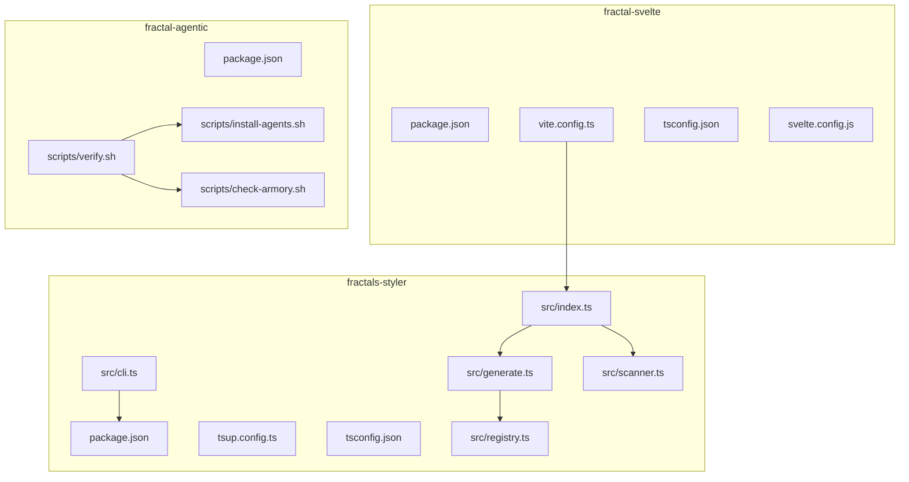
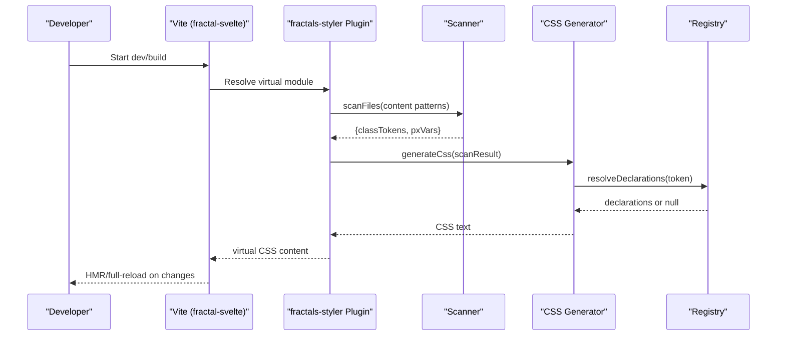
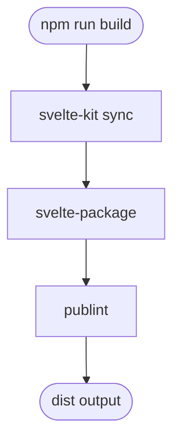
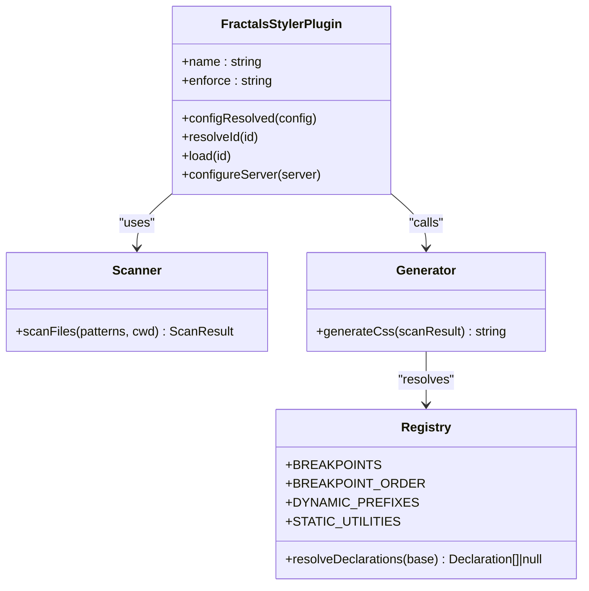
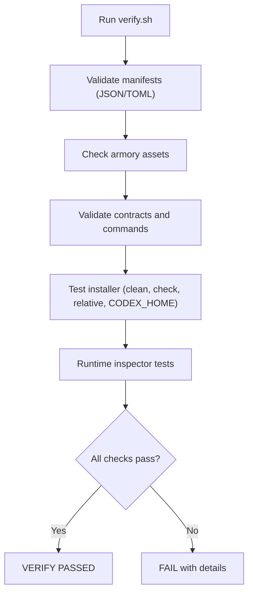
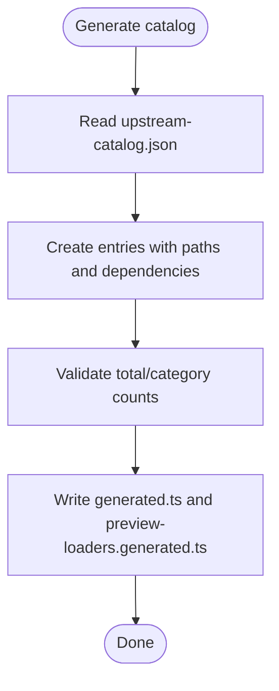
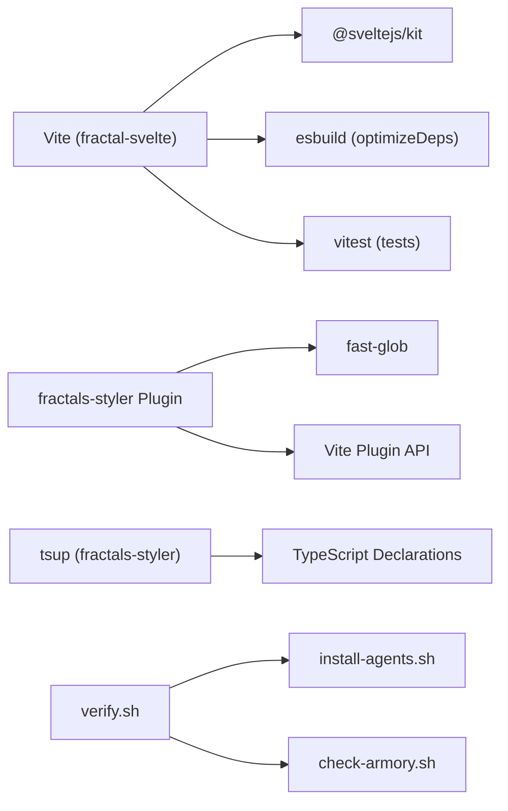

# Build Configuration & Tooling

<cite>
**Referenced Files in This Document**
- [package.json](file://packages/fractal-svelte/package.json)
- [vite.config.ts](file://packages/fractal-svelte/vite.config.ts)
- [tsconfig.json](file://packages/fractal-svelte/tsconfig.json)
- [svelte.config.js](file://packages/fractal-svelte/svelte.config.js)
- [package.json](file://packages/fractals-styler/package.json)
- [tsup.config.ts](file://packages/fractals-styler/tsup.config.ts)
- [tsconfig.json](file://packages/fractals-styler/tsconfig.json)
- [index.ts](file://packages/fractals-styler/src/index.ts)
- [cli.ts](file://packages/fractals-styler/src/cli.ts)
- [generate.ts](file://packages/fractals-styler/src/generate.ts)
- [scanner.ts](file://packages/fractals-styler/src/scanner.ts)
- [registry.ts](file://packages/fractals-styler/src/registry.ts)
- [verify.sh](file://packages/fractal-agentic/scripts/verify.sh)
- [install-agents.sh](file://packages/fractal-agentic/scripts/install-agents.sh)
- [check-armory.sh](file://packages/fractal-agentic/scripts/check-armory.sh)
- [package.json](file://packages/fractal-agentic/package.json)
- [generate-catalog.ts](file://packages/fractal-svelte/scripts/generate-catalog.ts)
- [check-catalog.ts](file://packages/fractal-svelte/scripts/check-catalog.ts)
</cite>

## Table of Contents
1. [Introduction](#introduction)
2. [Project Structure](#project-structure)
3. [Core Components](#core-components)
4. [Architecture Overview](#architecture-overview)
5. [Detailed Component Analysis](#detailed-component-analysis)
6. [Dependency Analysis](#dependency-analysis)
7. [Performance Considerations](#performance-considerations)
8. [Troubleshooting Guide](#troubleshooting-guide)
9. [Conclusion](#conclusion)
10. [Appendices](#appendices)

## Introduction
This document explains the build configuration and tooling across the packages in this monorepo with a focus on:
- Vite configuration for SvelteKit applications
- TypeScript compilation settings
- Package publishing workflows
- The fractals-styler build process that generates utility classes and themes
- The verification script ensuring plugin integrity, agent template validation, and installation consistency
- Guidance for customization, bundle optimization, CI/CD integration, environment-specific builds, development vs production configurations, and debugging build issues

## Project Structure
The repository contains multiple packages:
- fractal-svelte: A SvelteKit-based component library with Vite, svelte-kit, and Vitest
- fractals-styler: A Vite plugin and CLI that JIT-generates CSS utilities and theme tokens
- fractal-agentic: An agentic orchestration package with shell-based verification and installer scripts

**Diagram sources**
- [package.json](file://packages/fractal-svelte/package.json)
- [vite.config.ts](file://packages/fractal-svelte/vite.config.ts)
- [tsconfig.json](file://packages/fractal-svelte/tsconfig.json)
- [svelte.config.js](file://packages/fractal-svelte/svelte.config.js)
- [package.json](file://packages/fractals-styler/package.json)
- [tsup.config.ts](file://packages/fractals-styler/tsup.config.ts)
- [tsconfig.json](file://packages/fractals-styler/tsconfig.json)
- [index.ts](file://packages/fractals-styler/src/index.ts)
- [cli.ts](file://packages/fractals-styler/src/cli.ts)
- [generate.ts](file://packages/fractals-styler/src/generate.ts)
- [scanner.ts](file://packages/fractals-styler/src/scanner.ts)
- [registry.ts](file://packages/fractals-styler/src/registry.ts)
- [package.json](file://packages/fractal-agentic/package.json)
- [verify.sh](file://packages/fractal-agentic/scripts/verify.sh)
- [install-agents.sh](file://packages/fractal-agentic/scripts/install-agents.sh)
- [check-armory.sh](file://packages/fractal-agentic/scripts/check-armory.sh)

**Section sources**
- [package.json](file://packages/fractal-svelte/package.json)
- [vite.config.ts](file://packages/fractal-svelte/vite.config.ts)
- [tsconfig.json](file://packages/fractal-svelte/tsconfig.json)
- [svelte.config.js](file://packages/fractal-svelte/svelte.config.js)
- [package.json](file://packages/fractals-styler/package.json)
- [tsup.config.ts](file://packages/fractals-styler/tsup.config.ts)
- [tsconfig.json](file://packages/fractals-styler/tsconfig.json)
- [index.ts](file://packages/fractals-styler/src/index.ts)
- [cli.ts](file://packages/fractals-styler/src/cli.ts)
- [generate.ts](file://packages/fractals-styler/src/generate.ts)
- [scanner.ts](file://packages/fractals-styler/src/scanner.ts)
- [registry.ts](file://packages/fractals-styler/src/registry.ts)
- [package.json](file://packages/fractal-agentic/package.json)
- [verify.sh](file://packages/fractal-agentic/scripts/verify.sh)
- [install-agents.sh](file://packages/fractal-agentic/scripts/install-agents.sh)
- [check-armory.sh](file://packages/fractal-agentic/scripts/check-armory.sh)

## Core Components
- SvelteKit + Vite build pipeline (fractal-svelte): Uses @sveltejs/kit, vite, vitest, and svelte-package to develop, test, and publish components.
- fractals-styler Vite plugin and CLI: Scans source files for class tokens and --pxN variables, then generates CSS at dev/build time via a virtual module.
- Agentic verification and installers (fractal-agentic): Shell scripts validate plugin structure, TOML templates, contracts, and ensure idempotent, conflict-safe installations.

Key responsibilities:
- Development server and preview with Vite
- Type checking and linting
- Catalog generation and checks for component metadata
- CSS utility generation and theme scaffolding
- Integrity and installation verification

**Section sources**
- [package.json](file://packages/fractal-svelte/package.json)
- [vite.config.ts](file://packages/fractal-svelte/vite.config.ts)
- [tsconfig.json](file://packages/fractal-svelte/tsconfig.json)
- [svelte.config.js](file://packages/fractal-svelte/svelte.config.js)
- [package.json](file://packages/fractals-styler/package.json)
- [tsup.config.ts](file://packages/fractals-styler/tsup.config.ts)
- [tsconfig.json](file://packages/fractals-styler/tsconfig.json)
- [index.ts](file://packages/fractals-styler/src/index.ts)
- [cli.ts](file://packages/fractals-styler/src/cli.ts)
- [generate.ts](file://packages/fractals-styler/src/generate.ts)
- [scanner.ts](file://packages/fractals-styler/src/scanner.ts)
- [registry.ts](file://packages/fractals-styler/src/registry.ts)
- [package.json](file://packages/fractal-agentic/package.json)
- [verify.sh](file://packages/fractal-agentic/scripts/verify.sh)
- [install-agents.sh](file://packages/fractal-agentic/scripts/install-agents.sh)
- [check-armory.sh](file://packages/fractal-agentic/scripts/check-armory.sh)

## Architecture Overview
The build architecture integrates three layers:
- Application layer (fractal-svelte): Vite + SvelteKit for dev/build/test; svelte-package for distribution.
- Styling layer (fractals-styler): Vite plugin scans code and emits CSS via a virtual module; CLI scaffolds theme partials.
- Verification layer (fractal-agentic): Scripts validate assets and ensure consistent installs.

**Diagram sources**
- [vite.config.ts](file://packages/fractal-svelte/vite.config.ts)
- [index.ts](file://packages/fractals-styler/src/index.ts)
- [scanner.ts](file://packages/fractals-styler/src/scanner.ts)
- [generate.ts](file://packages/fractals-styler/src/generate.ts)
- [registry.ts](file://packages/fractals-styler/src/registry.ts)

## Detailed Component Analysis

### SvelteKit + Vite Build Pipeline (fractal-svelte)
- Development and preview:
  - Scripts define dev, build, preview, and prepack steps.
  - svelte-kit sync prepares types and aliases.
  - svelte-package produces distributables with publint validation.
- Vite configuration:
  - Uses @sveltejs/kit plugin.
  - Sets esbuild target to esnext for optimizeDeps and build.
  - Test config uses jsdom environment and aliasing for testing mocks.
- TypeScript:
  - Extends .svelte-kit/tsconfig.json with strict mode, NodeNext modules, and source maps.
- Svelte configuration:
  - Preprocess with vitePreprocess.
  - Aliases for lib, site, examples, and local package reference.

**Diagram sources**
- [package.json](file://packages/fractal-svelte/package.json)
- [vite.config.ts](file://packages/fractal-svelte/vite.config.ts)
- [tsconfig.json](file://packages/fractal-svelte/tsconfig.json)
- [svelte.config.js](file://packages/fractal-svelte/svelte.config.js)

**Section sources**
- [package.json](file://packages/fractal-svelte/package.json)
- [vite.config.ts](file://packages/fractal-svelte/vite.config.ts)
- [tsconfig.json](file://packages/fractal-svelte/tsconfig.json)
- [svelte.config.js](file://packages/fractal-svelte/svelte.config.js)

### fractals-styler: Vite Plugin and CLI
- Plugin behavior:
  - Exposes a virtual CSS module that is generated on demand.
  - Enforces early execution order to avoid conflicts with built-in CSS plugins.
  - Watches source files and triggers full reload when relevant files change.
- Scanning and generation:
  - Scans files using glob patterns and extracts class tokens and --pxN variable usages.
  - Generates CSS rules for static utilities and dynamic prefix-based utilities.
  - Applies breakpoint suffixes via media queries based on registry definitions.
- CLI:
  - Copies SASS partials into a project directory for customization.
  - Provides next-step guidance for integrating the plugin and styles.

**Diagram sources**
- [index.ts](file://packages/fractals-styler/src/index.ts)
- [scanner.ts](file://packages/fractals-styler/src/scanner.ts)
- [generate.ts](file://packages/fractals-styler/src/generate.ts)
- [registry.ts](file://packages/fractals-styler/src/registry.ts)

**Section sources**
- [index.ts](file://packages/fractals-styler/src/index.ts)
- [scanner.ts](file://packages/fractals-styler/src/scanner.ts)
- [generate.ts](file://packages/fractals-styler/src/generate.ts)
- [registry.ts](file://packages/fractals-styler/src/registry.ts)
- [cli.ts](file://packages/fractals-styler/src/cli.ts)
- [package.json](file://packages/fractals-styler/package.json)
- [tsup.config.ts](file://packages/fractals-styler/tsup.config.ts)
- [tsconfig.json](file://packages/fractals-styler/tsconfig.json)

### Agentic Verification and Installers (fractal-agentic)
- verify.sh:
  - Validates JSON manifests, TOML templates, role contracts, command frontmatter, and installer behavior.
  - Ensures idempotency, conflict refusal, and safe runtime inspection outputs.
- install-agents.sh:
  - Installs agent templates without modifying host configuration.
  - Supports explicit targets, check-only mode, and robust error handling.
- check-armory.sh:
  - Non-mutating health checks for required files, symlinks, and schema-like validations.

**Diagram sources**
- [verify.sh](file://packages/fractal-agentic/scripts/verify.sh)
- [install-agents.sh](file://packages/fractal-agentic/scripts/install-agents.sh)
- [check-armory.sh](file://packages/fractal-agentic/scripts/check-armory.sh)

**Section sources**
- [verify.sh](file://packages/fractal-agentic/scripts/verify.sh)
- [install-agents.sh](file://packages/fractal-agentic/scripts/install-agents.sh)
- [check-armory.sh](file://packages/fractal-agentic/scripts/check-armory.sh)
- [package.json](file://packages/fractal-agentic/package.json)

### Catalog Generation and Checks (fractal-svelte)
- generate-catalog.ts:
  - Reads upstream snapshot and generates typed catalog and preview loaders.
  - Enforces counts and statuses for categories and components.
- check-catalog.ts:
  - Verifies slugs uniqueness, ordering against snapshot, category counts, and canonical relocations.

**Diagram sources**
- [generate-catalog.ts](file://packages/fractal-svelte/scripts/generate-catalog.ts)
- [check-catalog.ts](file://packages/fractal-svelte/scripts/check-catalog.ts)

**Section sources**
- [generate-catalog.ts](file://packages/fractal-svelte/scripts/generate-catalog.ts)
- [check-catalog.ts](file://packages/fractal-svelte/scripts/check-catalog.ts)

## Dependency Analysis
- Vite and SvelteKit:
  - Vite orchestrates dev/build with esnext targets and jsdom for tests.
  - SvelteKit adapter-auto and aliases streamline development and packaging.
- fractals-styler:
  - Depends on fast-glob for scanning and exposes a Vite plugin interface.
  - tsup builds ESM outputs with type declarations and shims.
- Agentic scripts:
  - Rely on POSIX tools and optional jq; use Python for TOML parsing where available.

**Diagram sources**
- [vite.config.ts](file://packages/fractal-svelte/vite.config.ts)
- [package.json](file://packages/fractal-svelte/package.json)
- [package.json](file://packages/fractals-styler/package.json)
- [tsup.config.ts](file://packages/fractals-styler/tsup.config.ts)
- [index.ts](file://packages/fractals-styler/src/index.ts)
- [scanner.ts](file://packages/fractals-styler/src/scanner.ts)
- [verify.sh](file://packages/fractal-agentic/scripts/verify.sh)
- [install-agents.sh](file://packages/fractal-agentic/scripts/install-agents.sh)
- [check-armory.sh](file://packages/fractal-agentic/scripts/check-armory.sh)

**Section sources**
- [vite.config.ts](file://packages/fractal-svelte/vite.config.ts)
- [package.json](file://packages/fractal-svelte/package.json)
- [package.json](file://packages/fractals-styler/package.json)
- [tsup.config.ts](file://packages/fractals-styler/tsup.config.ts)
- [index.ts](file://packages/fractals-styler/src/index.ts)
- [scanner.ts](file://packages/fractals-styler/src/scanner.ts)
- [verify.sh](file://packages/fractal-agentic/scripts/verify.sh)
- [install-agents.sh](file://packages/fractal-agentic/scripts/install-agents.sh)
- [check-armory.sh](file://packages/fractal-agentic/scripts/check-armory.sh)

## Performance Considerations
- Vite optimizations:
  - Use esnext targets for faster dependency optimization and modern bundling.
  - Inline critical dependencies in tests to reduce overhead.
- CSS generation:
  - Limit scanned patterns to necessary directories to reduce IO and regex work.
  - Avoid excessive false positives by refining content globs.
- Publishing:
  - Ensure sideEffects are declared for CSS/SASS to enable tree-shaking.
  - Use svelte-package and publint to validate exports and reduce bundle size.

[No sources needed since this section provides general guidance]

## Troubleshooting Guide
- Vite dev/build issues:
  - Confirm svelte-kit sync runs before build and package steps.
  - Check alias mappings and ensure mock replacements in tests.
- fractals-styler plugin:
  - If SSR fails, ensure enforce: 'pre' is set so the plugin resolves before default CSS pipeline.
  - Verify virtual module import path and watch patterns include all relevant file extensions.
- Agentic verification failures:
  - Missing files or invalid JSON/TOML will cause immediate failure; inspect logs for exact paths.
  - Installer conflicts indicate differing destination files; resolve manually and rerun --check.
  - Runtime inspector requires jq; skip gracefully if not installed.

**Section sources**
- [package.json](file://packages/fractal-svelte/package.json)
- [vite.config.ts](file://packages/fractal-svelte/vite.config.ts)
- [index.ts](file://packages/fractals-styler/src/index.ts)
- [scanner.ts](file://packages/fractals-styler/src/scanner.ts)
- [verify.sh](file://packages/fractal-agentic/scripts/verify.sh)
- [install-agents.sh](file://packages/fractal-agentic/scripts/install-agents.sh)
- [check-armory.sh](file://packages/fractal-agentic/scripts/check-armory.sh)

## Conclusion
This monorepo integrates a robust SvelteKit build pipeline, a flexible CSS utility generator via a Vite plugin, and comprehensive verification scripts for agentic orchestration assets. By following the documented configurations and scripts, teams can customize builds, optimize bundles, integrate with CI/CD, and maintain consistency across environments.

[No sources needed since this section summarizes without analyzing specific files]

## Appendices

### Customizing Build Configurations
- SvelteKit/Vite:
  - Adjust esbuild target and optimizeDeps options for performance.
  - Extend aliases for local libraries and example sites.
- fractals-styler:
  - Customize content patterns to include/exclude files.
  - Modify registry definitions for new breakpoints or utility prefixes.
- Agentic scripts:
  - Update expected TOML fields and contract references as roles evolve.

[No sources needed since this section provides general guidance]

### Optimizing Bundle Sizes
- Declare sideEffects for CSS/SASS to allow dead code elimination.
- Generate only necessary catalogs and previews to keep imports minimal.
- Use svelte-package to produce clean dist outputs and validate with publint.

[No sources needed since this section provides general guidance]

### Integrating with CI/CD Pipelines
- Run svelte-kit sync, svelte-package, and publint during build steps.
- Execute fractals-styler checks and catalog generation/validation.
- Invoke verify.sh and check-armory.sh to assert asset integrity and installer correctness.

[No sources needed since this section provides general guidance]

### Environment-Specific Builds
- Development:
  - Use vite dev with jsdom tests and inline dependencies for speed.
- Production:
  - Use vite build with optimized targets and svelte-package for distribution.
- Testing:
  - Configure vitest environment and setup files for consistent results.

[No sources needed since this section provides general guidance]

### Debugging Build Issues
- Enable source maps in TypeScript for clearer stack traces.
- Inspect virtual module resolution and watcher events for CSS generation.
- Use installer --check to detect mismatches without mutating disk state.

[No sources needed since this section provides general guidance]