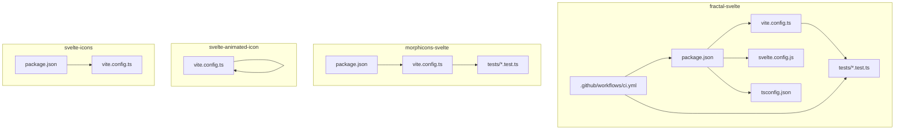
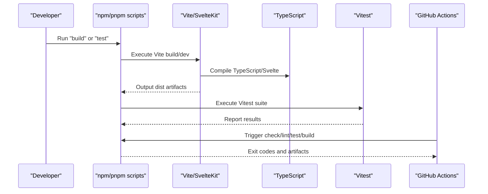
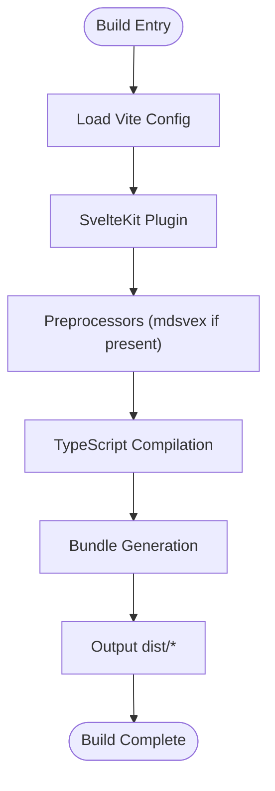
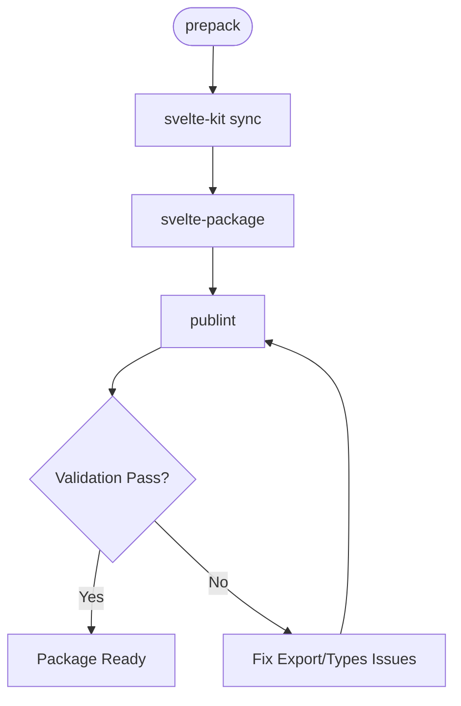
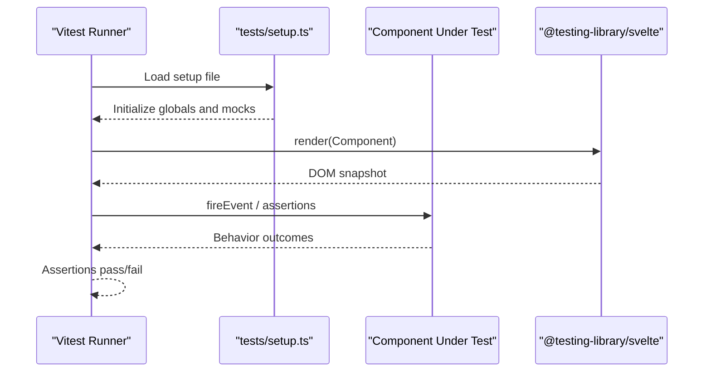
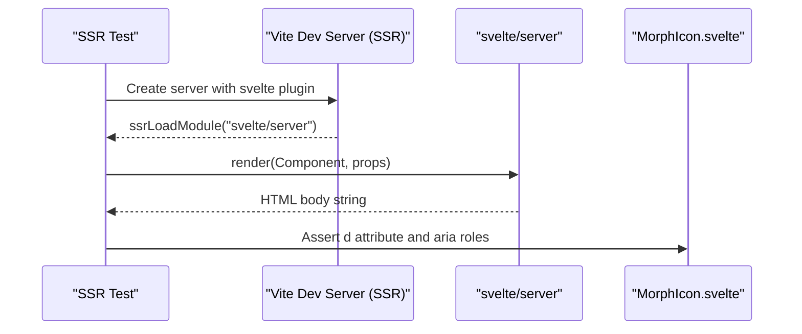
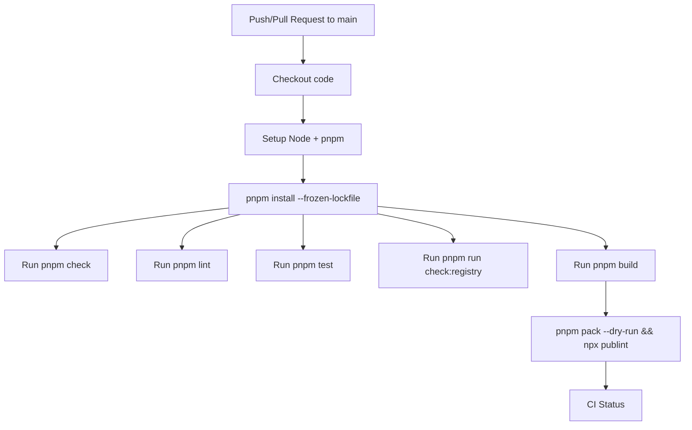
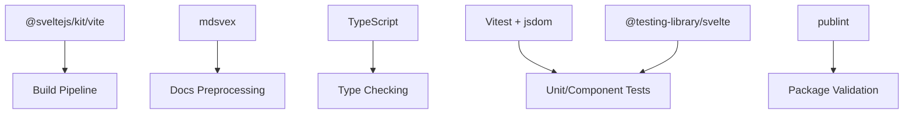

# Build Process & Testing Procedures

<cite>
**Referenced Files in This Document**
- [package.json](file://packages/fractal-svelte/package.json)
- [vite.config.ts](file://packages/fractal-svelte/vite.config.ts)
- [svelte.config.js](file://packages/fractal-svelte/svelte.config.js)
- [tsconfig.json](file://packages/fractal-svelte/tsconfig.json)
- [ci.yml](file://packages/fractal-svelte/.github/workflows/ci.yml)
- [setup.ts](file://packages/fractal-svelte/tests/setup.ts)
- [button.test.ts](file://packages/fractal-svelte/tests/button.test.ts)
- [package.json](file://packages/morphicons-svelte/package.json)
- [vite.config.ts](file://packages/morphicons-svelte/vite.config.ts)
- [MorphIcon.ssr.test.ts](file://packages/morphicons-svelte/tests/MorphIcon.ssr.test.ts)
- [MorphIcon.browser.test.ts](file://packages/morphicons-svelte/tests/MorphIcon.browser.test.ts)
- [vite.config.ts](file://packages/svelte-animated-icon/vite.config.ts)
- [package.json](file://packages/svelte-icons/package.json)
- [vite.config.ts](file://packages/svelte-icons/vite.config.ts)
</cite>

## Table of Contents
1. Introduction
2. Project Structure
3. Core Components
4. Architecture Overview
5. Detailed Component Analysis
6. Dependency Analysis
7. Performance Considerations
8. Troubleshooting Guide
9. Conclusion

## Introduction
This document explains the build process and testing procedures across the packages in this repository. It covers Vite build configuration, TypeScript compilation, package publishing workflows, unit testing with Vitest, component testing with Svelte testing utilities, SSR and browser tests, and CI/CD integration. It also provides guidance on test coverage reporting, performance profiling, bundle size analysis, debugging techniques, test environment setup, and common testing patterns for UI components and agent logic.

## Project Structure
The repository contains multiple Svelte-based packages:
- fractal-svelte: A Svelte 5 component library with extensive unit/component tests and a comprehensive CI pipeline.
- morphicons-svelte: A Svelte 5 binding for morphicons with both SSR and browser tests.
- svelte-animated-icon and svelte-icons: Svelte icon libraries using Vite + SvelteKit and mdsvex for documentation.

Key build and test configuration files are located at the root of each package (package.json, vite.config.ts, svelte.config.js, tsconfig.json), with tests under tests/ directories.

**Diagram sources**
- [package.json:24-42](file://packages/fractal-svelte/package.json#L24-L42)
- [vite.config.ts:1-32](file://packages/fractal-svelte/vite.config.ts#L1-L32)
- [svelte.config.js:1-18](file://packages/fractal-svelte/svelte.config.js#L1-L18)
- [tsconfig.json:1-16](file://packages/fractal-svelte/tsconfig.json#L1-L16)
- [ci.yml:1-37](file://packages/fractal-svelte/.github/workflows/ci.yml#L1-L37)
- [package.json:27-33](file://packages/morphicons-svelte/package.json#L27-L33)
- [vite.config.ts:1-12](file://packages/morphicons-svelte/vite.config.ts#L1-L12)
- [vite.config.ts:1-22](file://packages/svelte-animated-icon/vite.config.ts#L1-L22)
- [package.json:5-16](file://packages/svelte-icons/package.json#L5-L16)
- [vite.config.ts:1-20](file://packages/svelte-icons/vite.config.ts#L1-L20)

**Section sources**
- [package.json:24-42](file://packages/fractal-svelte/package.json#L24-L42)
- [vite.config.ts:1-32](file://packages/fractal-svelte/vite.config.ts#L1-L32)
- [svelte.config.js:1-18](file://packages/fractal-svelte/svelte.config.js#L1-L18)
- [tsconfig.json:1-16](file://packages/fractal-svelte/tsconfig.json#L1-L16)
- [ci.yml:1-37](file://packages/fractal-svelte/.github/workflows/ci.yml#L1-L37)
- [package.json:27-33](file://packages/morphicons-svelte/package.json#L27-L33)
- [vite.config.ts:1-12](file://packages/morphicons-svelte/vite.config.ts#L1-L12)
- [vite.config.ts:1-22](file://packages/svelte-animated-icon/vite.config.ts#L1-L22)
- [package.json:5-16](file://packages/svelte-icons/package.json#L5-L16)
- [vite.config.ts:1-20](file://packages/svelte-icons/vite.config.ts#L1-L20)

## Core Components
- Vite build configuration:
  - fractal-svelte uses Vite with SvelteKit plugin, jsdom test environment, and aliasing for mocking dependencies during tests.
  - morphicons-svelte configures Vite with jsdom environment and conditional browser conditions for tests.
  - svelte-animated-icon and svelte-icons use SvelteKit with mdsvex preprocessing for docs.
- TypeScript compilation:
  - All packages extend SvelteKit-generated tsconfig and enable strict mode, NodeNext modules, and source maps.
- Package publishing:
  - Scripts invoke svelte-package and publint to validate exports and types before publishing.
  - Exports map svelte, types, and default entries for clean consumption.

**Section sources**
- [vite.config.ts:1-32](file://packages/fractal-svelte/vite.config.ts#L1-L32)
- [vite.config.ts:1-12](file://packages/morphicons-svelte/vite.config.ts#L1-L12)
- [vite.config.ts:1-22](file://packages/svelte-animated-icon/vite.config.ts#L1-L22)
- [vite.config.ts:1-20](file://packages/svelte-icons/vite.config.ts#L1-L20)
- [tsconfig.json:1-16](file://packages/fractal-svelte/tsconfig.json#L1-L16)
- [package.json:24-42](file://packages/fractal-svelte/package.json#L24-L42)
- [package.json:27-33](file://packages/morphicons-svelte/package.json#L27-L33)
- [package.json:5-16](file://packages/svelte-icons/package.json#L5-L16)

## Architecture Overview
The build and test architecture integrates Vite, SvelteKit, TypeScript, Vitest, and GitHub Actions. Each package defines its own build and test scripts, while CI orchestrates checks, linting, tests, and packaging validation.

**Diagram sources**
- [package.json:24-42](file://packages/fractal-svelte/package.json#L24-L42)
- [vite.config.ts:1-32](file://packages/fractal-svelte/vite.config.ts#L1-L32)
- [ci.yml:1-37](file://packages/fractal-svelte/.github/workflows/ci.yml#L1-L37)

**Section sources**
- [package.json:24-42](file://packages/fractal-svelte/package.json#L24-L42)
- [vite.config.ts:1-32](file://packages/fractal-svelte/vite.config.ts#L1-L32)
- [ci.yml:1-37](file://packages/fractal-svelte/.github/workflows/ci.yml#L1-L37)

## Detailed Component Analysis

### Vite Configuration and Build Pipeline
- frаctаl-svelte:
  - Uses @sveltejs/kit/vite plugin, sets browser conditions, esbuild target to esnext, and Vitest configuration including jsdom environment, setup file, and aliasing for mocking.
- morphicons-svelte:
  - Configures Vitest with jsdom and includes test files; resolves browser conditions conditionally when running tests.
- svelte-animated-icon and svelte-icons:
  - Use SvelteKit with mdsvex preprocessing for markdown/svx content and adapter configuration.

**Diagram sources**
- [vite.config.ts:1-32](file://packages/fractal-svelte/vite.config.ts#L1-L32)
- [vite.config.ts:1-12](file://packages/morphicons-svelte/vite.config.ts#L1-L12)
- [vite.config.ts:1-22](file://packages/svelte-animated-icon/vite.config.ts#L1-L22)
- [vite.config.ts:1-20](file://packages/svelte-icons/vite.config.ts#L1-L20)

**Section sources**
- [vite.config.ts:1-32](file://packages/fractal-svelte/vite.config.ts#L1-L32)
- [vite.config.ts:1-12](file://packages/morphicons-svelte/vite.config.ts#L1-L12)
- [vite.config.ts:1-22](file://packages/svelte-animated-icon/vite.config.ts#L1-L22)
- [vite.config.ts:1-20](file://packages/svelte-icons/vite.config.ts#L1-L20)

### TypeScript Compilation Settings
- Extends SvelteKit-generated tsconfig.
- Enables strict mode, NodeNext module resolution, source maps, and JSON module support.
- Ensures consistent casing and allows JS with type checking where applicable.

**Section sources**
- [tsconfig.json:1-16](file://packages/fractal-svelte/tsconfig.json#L1-L16)

### Package Publishing Workflow
- Scripts:
  - prepack runs svelte-kit sync, svelte-package, and publint to validate package structure and exports.
  - build triggers Vite build then prepack.
- Exports:
  - Explicit mappings for svelte, types, and default entry points per module.
  - sideEffects declarations for CSS/SASS assets.

**Diagram sources**
- [package.json:24-42](file://packages/fractal-svelte/package.json#L24-L42)
- [package.json:27-33](file://packages/morphicons-svelte/package.json#L27-L33)
- [package.json:5-16](file://packages/svelte-icons/package.json#L5-L16)

**Section sources**
- [package.json:24-42](file://packages/fractal-svelte/package.json#L24-L42)
- [package.json:27-33](file://packages/morphicons-svelte/package.json#L27-L33)
- [package.json:5-16](file://packages/svelte-icons/package.json#L5-L16)

### Unit and Component Testing with Vitest and Svelte Testing Utilities
- Environment:
  - jsdom configured for Vitest to simulate browser APIs.
  - Setup file initializes testing-library integrations and mocks global APIs like matchMedia.
- Patterns:
  - Render components, assert DOM attributes and data slots.
  - Fire events and verify behavior (e.g., pointer interactions).
  - Mock dependencies via aliases in Vite config.

**Diagram sources**
- [setup.ts:1-17](file://packages/fractal-svelte/tests/setup.ts#L1-L17)
- [button.test.ts:1-32](file://packages/fractal-svelte/tests/button.test.ts#L1-L32)
- [vite.config.ts:22-31](file://packages/fractal-svelte/vite.config.ts#L22-L31)

**Section sources**
- [setup.ts:1-17](file://packages/fractal-svelte/tests/setup.ts#L1-L17)
- [button.test.ts:1-32](file://packages/fractal-svelte/tests/button.test.ts#L1-L32)
- [vite.config.ts:22-31](file://packages/fractal-svelte/vite.config.ts#L22-L31)

### SSR and Browser Tests for Morphicons
- SSR tests:
  - Use a Vite dev server in middleware mode to load Svelte SSR rendering.
  - Verify canonical SVG paths, accessibility attributes, and controlled morph states.
- Browser tests:
  - Mount components in jsdom, flush synchronous updates, and assert imperative APIs and state transitions.

**Diagram sources**
- [MorphIcon.ssr.test.ts:1-98](file://packages/morphicons-svelte/tests/MorphIcon.ssr.test.ts#L1-L98)
- [vite.config.ts:1-12](file://packages/morphicons-svelte/vite.config.ts#L1-L12)

**Section sources**
- [MorphIcon.ssr.test.ts:1-98](file://packages/morphicons-svelte/tests/MorphIcon.ssr.test.ts#L1-L98)
- [MorphIcon.browser.test.ts:1-114](file://packages/morphicons-svelte/tests/MorphIcon.browser.test.ts#L1-L114)
- [vite.config.ts:1-12](file://packages/morphicons-svelte/vite.config.ts#L1-L12)

### CI/CD Pipeline Integration
- Triggers:
  - On push and pull requests to main branch.
- Jobs:
  - check: installs dependencies, runs type checks, linting, tests, and registry checks.
  - build: builds the package and validates packaging with dry-run pack and publint.

**Diagram sources**
- [ci.yml:1-37](file://packages/fractal-svelte/.github/workflows/ci.yml#L1-L37)

**Section sources**
- [ci.yml:1-37](file://packages/fractal-svelte/.github/workflows/ci.yml#L1-L37)

## Dependency Analysis
- Internal dependencies:
  - Vite plugins (@sveltejs/kit/vite) and preprocessors (mdsvex) drive build steps.
  - TypeScript configuration extends SvelteKit-generated settings.
- External dependencies:
  - Vitest and jsdom provide unit/component testing environments.
  - Svelte testing utilities facilitate rendering and event simulation.
  - publint ensures package export correctness.

**Diagram sources**
- [vite.config.ts:1-32](file://packages/fractal-svelte/vite.config.ts#L1-L32)
- [vite.config.ts:1-20](file://packages/svelte-icons/vite.config.ts#L1-L20)
- [tsconfig.json:1-16](file://packages/fractal-svelte/tsconfig.json#L1-L16)
- [package.json:219-243](file://packages/fractal-svelte/package.json#L219-L243)

**Section sources**
- [vite.config.ts:1-32](file://packages/fractal-svelte/vite.config.ts#L1-L32)
- [vite.config.ts:1-20](file://packages/svelte-icons/vite.config.ts#L1-L20)
- [tsconfig.json:1-16](file://packages/fractal-svelte/tsconfig.json#L1-L16)
- [package.json:219-243](file://packages/fractal-svelte/package.json#L219-L243)

## Performance Considerations
- Bundle analysis:
  - Use tools like webpack-bundle-analyzer or source-map-explorer to inspect bundle composition and identify large dependencies.
- Web Vitals:
  - Measure LCP, CLS, INP, FCP, TTFB to ensure performance targets.
- Build performance:
  - Track cold build time, hot reload speed, and test suite duration to optimize developer experience.
- Optimization strategies:
  - Code splitting, lazy loading, tree shaking, and removing unused dependencies.
  - Memoization and stable references to avoid unnecessary re-renders.

[No sources needed since this section provides general guidance]

## Troubleshooting Guide
- Common issues:
  - Missing browser APIs in jsdom: Ensure setup files mock window.matchMedia and other globals.
  - Type errors: Confirm tsconfig extends SvelteKit-generated config and strict mode is enabled.
  - Export mismatches: Use publint to detect incorrect or missing exports.
- Debugging techniques:
  - Enable source maps for better stack traces.
  - Use Vitest’s watch mode to iterate quickly on tests.
  - Inspect Vite dev server logs for SSR and module loading issues.

**Section sources**
- [setup.ts:1-17](file://packages/fractal-svelte/tests/setup.ts#L1-L17)
- [tsconfig.json:1-16](file://packages/fractal-svelte/tsconfig.json#L1-L16)
- [package.json:24-42](file://packages/fractal-svelte/package.json#L24-L42)

## Conclusion
This repository employs a robust build and testing strategy across multiple Svelte packages. Vite and SvelteKit streamline development and production builds, while Vitest and Svelte testing utilities provide comprehensive unit and component testing. CI pipelines enforce quality gates through checks, linting, tests, and packaging validation. Following the outlined practices ensures reliable releases, maintainable code, and high-quality user experiences.

[No sources needed since this section summarizes without analyzing specific files]