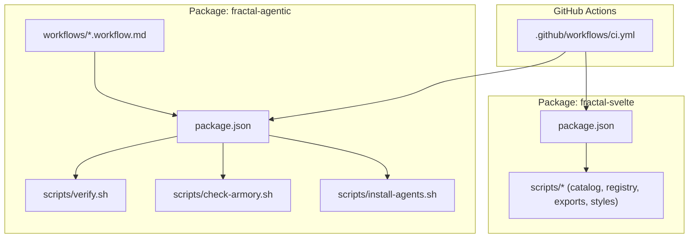
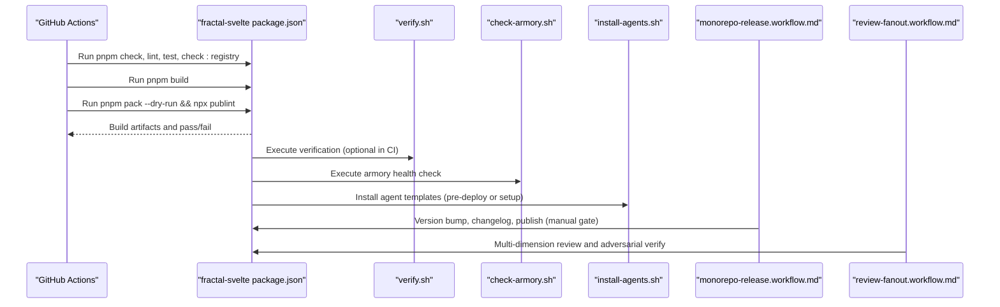
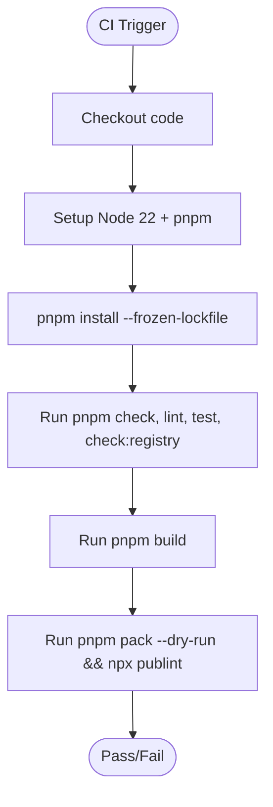
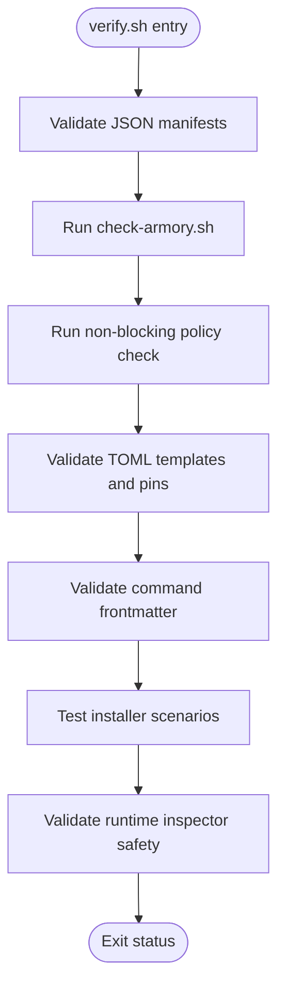
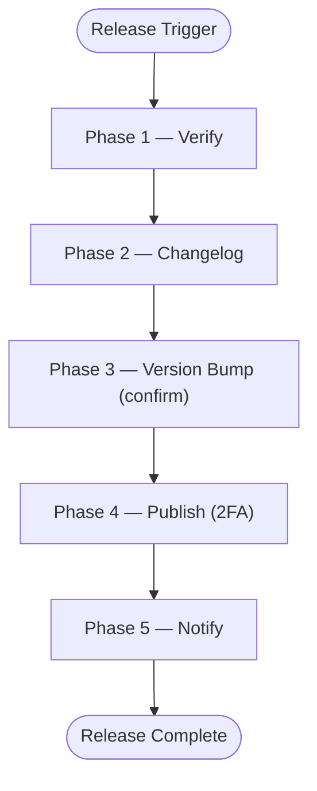
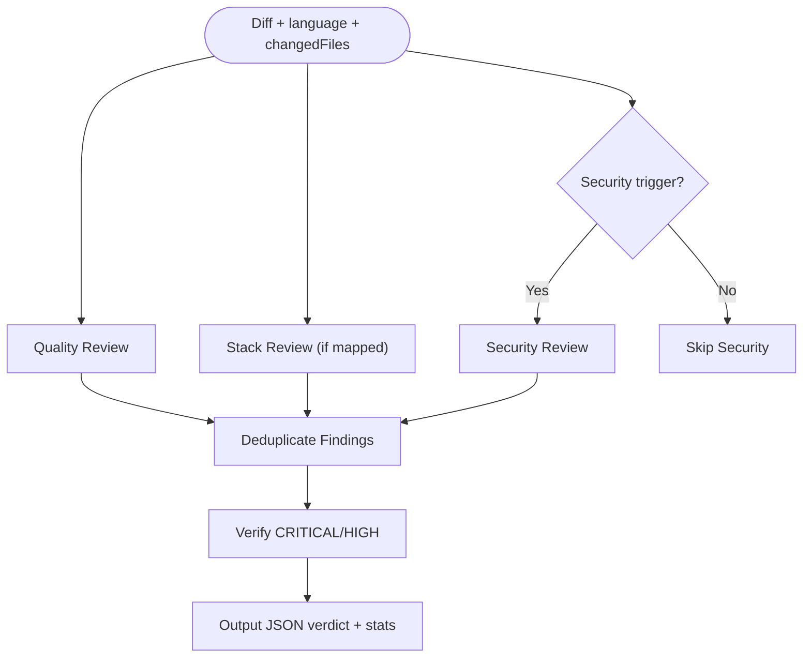
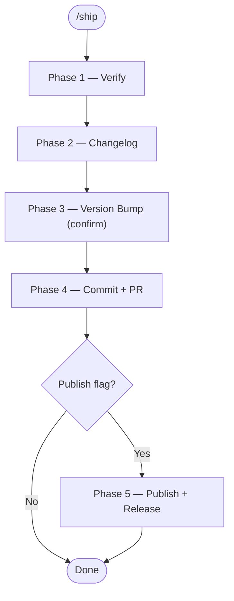
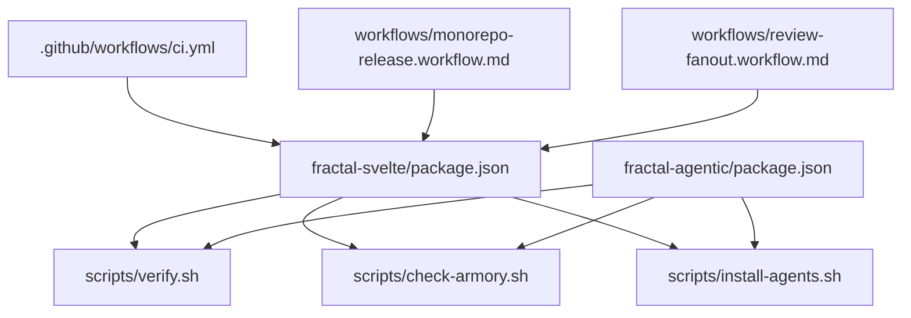

# CI/CD Pipeline & Automation

<cite>
**Referenced Files in This Document**
- [ci.yml](file://fractal-svelte/.github/workflows/ci.yml)
- [package.json (fractal-svelte)](file://fractal-svelte/package.json)
- [monorepo-release.workflow.md](file://fractal-agentic/workflows/monorepo-release.workflow.md)
- [review-fanout.workflow.md](file://fractal-agentic/workflows/review-fanout.workflow.md)
- [verify.sh](file://fractal-agentic/scripts/verify.sh)
- [check-armory.sh](file://fractal-agentic/scripts/check-armory.sh)
- [install-agents.sh](file://fractal-agentic/scripts/install-agents.sh)
- [package.json (fractal-agentic)](file://fractal-agentic/package.json)
- [ship.md](file://fractal-agentic/commands/ship.md)
</cite>

## Table of Contents
1. [Introduction](#introduction)
2. [Project Structure](#project-structure)
3. [Core Components](#core-components)
4. [Architecture Overview](#architecture-overview)
5. [Detailed Component Analysis](#detailed-component-analysis)
6. [Dependency Analysis](#dependency-analysis)
7. [Performance Considerations](#performance-considerations)
8. [Troubleshooting Guide](#troubleshooting-guide)
9. [Conclusion](#conclusion)
10. [Appendices](#appendices)

## Introduction
This document explains the CI/CD pipeline configuration and automation workflows across the monorepo packages. It covers GitHub Actions for automated testing, building, and publishing; verification scripts that enforce code quality, security checks, and plugin integrity; automated release processes; and deployment strategies for different environments. It also provides guidance for local CI/CD simulation, debugging pipeline failures, optimizing build times, and maintaining consistent quality gates across the monorepo.

## Project Structure
The repository includes:
- A GitHub Actions workflow for the Svelte package that runs checks, linting, tests, registry validation, and a publishability check.
- Scripts and documentation for monorepo releases and multi-dimension review fan-out.
- Verification and armory health-check scripts to ensure plugin integrity and orchestration assets are correct.
- Package manifests defining scripts used by CI and local development.

**Diagram sources**
- [ci.yml:1-37](file://fractal-svelte/.github/workflows/ci.yml#L1-L37)
- [package.json (fractal-svelte):24-42](file://fractal-svelte/package.json#L24-L42)
- [monorepo-release.workflow.md:1-59](file://fractal-agentic/workflows/monorepo-release.workflow.md#L1-L59)
- [review-fanout.workflow.md:1-111](file://fractal-agentic/workflows/review-fanout.workflow.md#L1-L111)
- [verify.sh:1-274](file://fractal-agentic/scripts/verify.sh#L1-L274)
- [check-armory.sh:1-143](file://fractal-agentic/scripts/check-armory.sh#L1-L143)
- [install-agents.sh:1-180](file://fractal-agentic/scripts/install-agents.sh#L1-L180)
- [package.json (fractal-agentic):35-38](file://fractal-agentic/package.json#L35-L38)

**Section sources**
- [ci.yml:1-37](file://fractal-svelte/.github/workflows/ci.yml#L1-L37)
- [package.json (fractal-svelte):24-42](file://fractal-svelte/package.json#L24-L42)
- [package.json (fractal-agentic):35-38](file://fractal-agentic/package.json#L35-L38)

## Core Components
- GitHub Actions CI for fractal-svelte:
  - Triggers on push and pull requests to main.
  - Jobs:
    - check: installs dependencies, runs type checking, linting, tests, and registry checks.
    - build: builds the package and validates publishability with dry-run pack and publint.
- Fractal Agentic verification and armory checks:
  - verify.sh performs comprehensive validation of templates, contracts, installer behavior, and runtime inspector safety.
  - check-armory.sh ensures required files and schemas exist and are valid.
  - install-agents.sh installs agent templates safely without mutating host config.
- Monorepo release workflow specification:
  - Defines phases for verification, changelog generation, version bumping, publishing, and notifications with safety constraints.
- Review fan-out workflow specification:
  - Defines parallel multi-dimension review and adversarial verification with strict verdicts and deduplication.

**Section sources**
- [ci.yml:1-37](file://fractal-svelte/.github/workflows/ci.yml#L1-L37)
- [verify.sh:1-274](file://fractal-agentic/scripts/verify.sh#L1-L274)
- [check-armory.sh:1-143](file://fractal-agentic/scripts/check-armory.sh#L1-L143)
- [install-agents.sh:1-180](file://fractal-agentic/scripts/install-agents.sh#L1-L180)
- [monorepo-release.workflow.md:1-59](file://fractal-agentic/workflows/monorepo-release.workflow.md#L1-L59)
- [review-fanout.workflow.md:1-111](file://fractal-agentic/workflows/review-fanout.workflow.md#L1-L111)

## Architecture Overview
The CI/CD architecture integrates GitHub Actions with package scripts and verification utilities to enforce quality gates and automate releases.

**Diagram sources**
- [ci.yml:1-37](file://fractal-svelte/.github/workflows/ci.yml#L1-L37)
- [package.json (fractal-svelte):24-42](file://fractal-svelte/package.json#L24-L42)
- [verify.sh:1-274](file://fractal-agentic/scripts/verify.sh#L1-L274)
- [check-armory.sh:1-143](file://fractal-agentic/scripts/check-armory.sh#L1-L143)
- [install-agents.sh:1-180](file://fractal-agentic/scripts/install-agents.sh#L1-L180)
- [monorepo-release.workflow.md:1-59](file://fractal-agentic/workflows/monorepo-release.workflow.md#L1-L59)
- [review-fanout.workflow.md:1-111](file://fractal-agentic/workflows/review-fanout.workflow.md#L1-L111)

## Detailed Component Analysis

### GitHub Actions CI for fractal-svelte
- Triggers: push and pull_request on main.
- Jobs:
  - check: installs dependencies with frozen lockfile, runs type checking, linting, tests, and registry checks.
  - build: builds the package and validates publishability via dry-run pack and publint.
- Environment: Node 22, pnpm caching enabled.

**Diagram sources**
- [ci.yml:1-37](file://fractal-svelte/.github/workflows/ci.yml#L1-L37)

**Section sources**
- [ci.yml:1-37](file://fractal-svelte/.github/workflows/ci.yml#L1-L37)
- [package.json (fractal-svelte):24-42](file://fractal-svelte/package.json#L24-L42)

### Fractal Agentic Verification Script (verify.sh)
- Validates presence and JSON validity of plugin manifests.
- Runs armory and non-blocking policy checks.
- Validates TOML templates and exact role pins.
- Ensures command frontmatter structure is correct.
- Tests installer behavior: clean install, idempotency, conflict refusal, CODEX_HOME handling, relative targets.
- Verifies runtime inspector safe extraction and error handling.

**Diagram sources**
- [verify.sh:1-274](file://fractal-agentic/scripts/verify.sh#L1-L274)
- [check-armory.sh:1-143](file://fractal-agentic/scripts/check-armory.sh#L1-L143)
- [install-agents.sh:1-180](file://fractal-agentic/scripts/install-agents.sh#L1-L180)

**Section sources**
- [verify.sh:1-274](file://fractal-agentic/scripts/verify.sh#L1-L274)
- [check-armory.sh:1-143](file://fractal-agentic/scripts/check-armory.sh#L1-L143)
- [install-agents.sh:1-180](file://fractal-agentic/scripts/install-agents.sh#L1-L180)

### Monorepo Release Workflow Specification
- Phases:
  - Verify: build, typecheck, tests, workspace dependency checks, changelog completeness.
  - Changelog: generate from conventional commits since last tag.
  - Version bump: determine bump type, confirm with user, update version, create git tag.
  - Publish: publish package with 2FA if configured, create GitHub release.
  - Notify: update docs sites, optional wiki logging, session ledger.
- Safety: requires user confirmation, verifies 2FA availability, avoids pushing tags on failure, reverts version bump on publish failure.

**Diagram sources**
- [monorepo-release.workflow.md:1-59](file://fractal-agentic/workflows/monorepo-release.workflow.md#L1-L59)

**Section sources**
- [monorepo-release.workflow.md:1-59](file://fractal-agentic/workflows/monorepo-release.workflow.md#L1-L59)

### Review Fan-Out Workflow Specification
- Purpose: background multi-reviewer and adversarial verification.
- Dimensions: Quality, Stack-specific reviewer, Security (triggered by keywords).
- Finding schema: standardized JSON with verdict, severity, evidence, proof, fix.
- Deduplication: key by file + normalized evidence; merge dimensions keeping strictest severity.
- Verify stage: independent skeptic validates CRITICAL/HIGH findings; unverified stays blocking.
- Output: structured JSON summarizing verdicts, stats, and blocking/advisory items.

**Diagram sources**
- [review-fanout.workflow.md:1-111](file://fractal-agentic/workflows/review-fanout.workflow.md#L1-L111)

**Section sources**
- [review-fanout.workflow.md:1-111](file://fractal-agentic/workflows/review-fanout.workflow.md#L1-L111)

### Ship Command (Delivery Pipeline)
- End-to-end delivery from current state to merged PR.
- Stops at each phase for user confirmation; never publishes without explicit flag and confirmation.
- Pipeline:
  - Verify: run review, build, test, quality-gate.
  - Changelog: scan git log, group by conventional commit types.
  - Version bump: auto-detect or specified; show old→new; confirm.
  - Commit and PR: create PR, wait for CI green, merge on confirmation.
  - Publish (optional): publish public packages and create GitHub release.

**Diagram sources**
- [ship.md:1-60](file://fractal-agentic/commands/ship.md#L1-L60)

**Section sources**
- [ship.md:1-60](file://fractal-agentic/commands/ship.md#L1-L60)

## Dependency Analysis
- CI depends on package scripts defined in package.json for fractal-svelte.
- Fractal Agentic scripts depend on shell utilities (jq, python3), TOML parsing, and filesystem operations.
- Release workflow depends on git tags, npm/pnpm publish, and GitHub CLI for releases.
- Review fan-out depends on diff analysis and keyword-based triggers.

**Diagram sources**
- [ci.yml:1-37](file://fractal-svelte/.github/workflows/ci.yml#L1-L37)
- [package.json (fractal-svelte):24-42](file://fractal-svelte/package.json#L24-L42)
- [package.json (fractal-agentic):35-38](file://fractal-agentic/package.json#L35-L38)
- [verify.sh:1-274](file://fractal-agentic/scripts/verify.sh#L1-L274)
- [check-armory.sh:1-143](file://fractal-agentic/scripts/check-armory.sh#L1-L143)
- [install-agents.sh:1-180](file://fractal-agentic/scripts/install-agents.sh#L1-L180)
- [monorepo-release.workflow.md:1-59](file://fractal-agentic/workflows/monorepo-release.workflow.md#L1-L59)
- [review-fanout.workflow.md:1-111](file://fractal-agentic/workflows/review-fanout.workflow.md#L1-L111)

**Section sources**
- [ci.yml:1-37](file://fractal-svelte/.github/workflows/ci.yml#L1-L37)
- [package.json (fractal-svelte):24-42](file://fractal-svelte/package.json#L24-L42)
- [package.json (fractal-agentic):35-38](file://fractal-agentic/package.json#L35-L38)

## Performance Considerations
- Cache pnpm dependencies in GitHub Actions to reduce install time.
- Use frozen lockfiles to avoid unnecessary resolution overhead.
- Parallelize jobs where possible (e.g., separate check and build jobs).
- Limit test scope in CI to critical suites; run full suites locally or nightly.
- Avoid heavy tooling in prepack steps; keep prepack minimal and fast.
- Use incremental builds and artifact caching for large packages.

[No sources needed since this section provides general guidance]

## Troubleshooting Guide
- CI failures:
  - Inspect job logs for failed steps (check, lint, test, build, publishability).
  - Ensure Node version matches CI configuration.
  - Validate lockfile consistency with frozen mode.
- Verification script failures:
  - Check jq and python3 availability for JSON/TOML validation.
  - Confirm installer target directory permissions and existence.
  - Review conflict errors when destination files differ from shipped templates.
- Release issues:
  - Verify 2FA configuration before publishing.
  - Ensure git tags exist and match expected versions.
  - Revert version bumps on publish failures per safety rules.
- Review fan-out:
  - Validate diff input and security trigger keywords.
  - Investigate unverified CRITICAL/HIGH findings and refutation confidence thresholds.

**Section sources**
- [verify.sh:1-274](file://fractal-agentic/scripts/verify.sh#L1-L274)
- [check-armory.sh:1-143](file://fractal-agentic/scripts/check-armory.sh#L1-L143)
- [install-agents.sh:1-180](file://fractal-agentic/scripts/install-agents.sh#L1-L180)
- [monorepo-release.workflow.md:1-59](file://fractal-agentic/workflows/monorepo-release.workflow.md#L1-L59)
- [review-fanout.workflow.md:1-111](file://fractal-agentic/workflows/review-fanout.workflow.md#L1-L111)

## Conclusion
The monorepo’s CI/CD pipeline integrates GitHub Actions with robust verification and release specifications to ensure quality, security, and reliability. The fractal-svelte package enforces checks and publishability validation, while fractal-agentic scripts provide deep integrity verification and safe installation practices. The release and review workflows define clear phases, safety constraints, and adversarial verification to maintain consistent quality gates across the monorepo.

[No sources needed since this section summarizes without analyzing specific files]

## Appendices
- Local CI/CD simulation:
  - Run pnpm install --frozen-lockfile, then execute pnpm check, lint, test, and check:registry locally.
  - Execute verify.sh and check-armory.sh to validate plugin integrity and orchestration assets.
  - Use install-agents.sh --check to verify installed agent templates without mutation.
- Debugging pipeline failures:
  - Enable verbose logging in CI steps.
  - Reproduce failures locally using identical Node and pnpm versions.
  - Inspect generated artifacts and logs for clues.
- Optimizing build times:
  - Leverage pnpm cache and artifact caching.
  - Split large tasks into smaller, parallel jobs.
  - Minimize prepack steps and avoid heavy transformations in CI.

**Section sources**
- [ci.yml:1-37](file://fractal-svelte/.github/workflows/ci.yml#L1-L37)
- [package.json (fractal-svelte):24-42](file://fractal-svelte/package.json#L24-L42)
- [verify.sh:1-274](file://fractal-agentic/scripts/verify.sh#L1-L274)
- [check-armory.sh:1-143](file://fractal-agentic/scripts/check-armory.sh#L1-L143)
- [install-agents.sh:1-180](file://fractal-agentic/scripts/install-agents.sh#L1-L180)