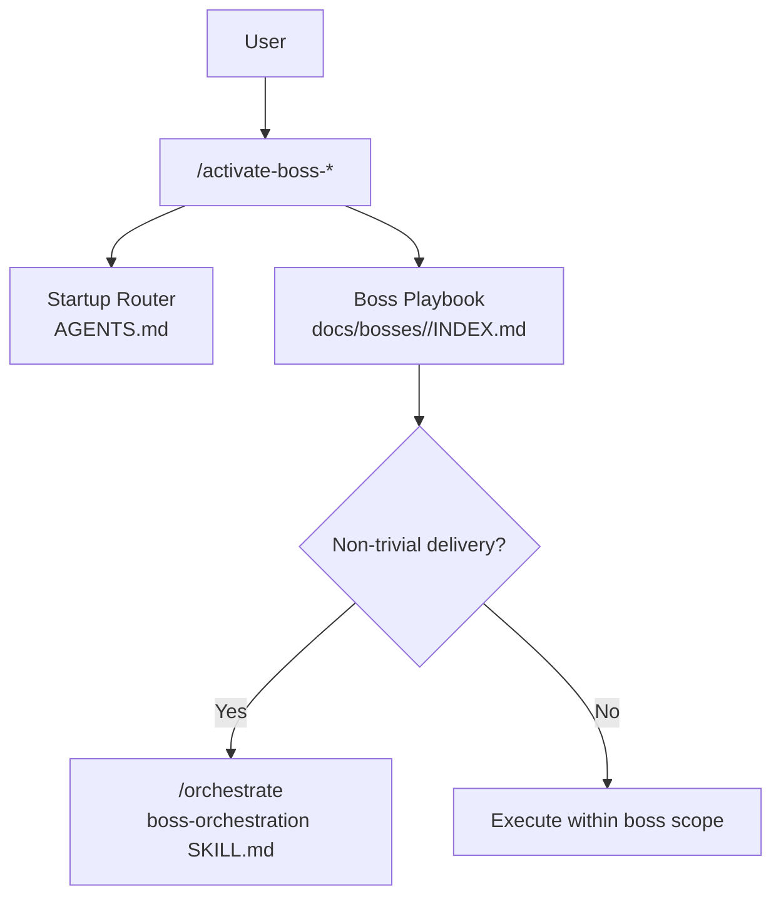
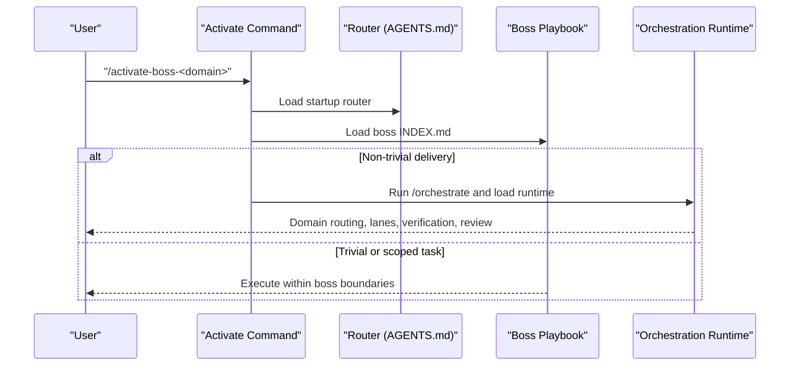
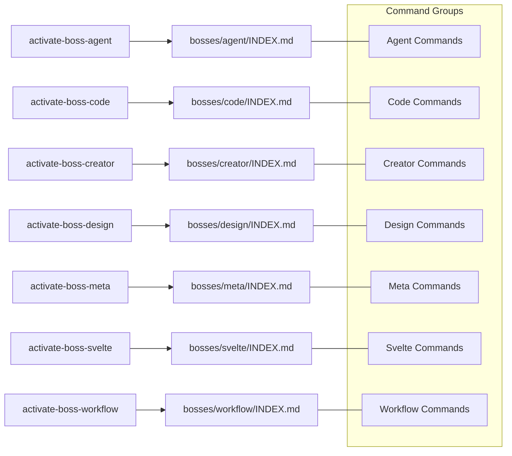

# Boss Activation Commands

<cite>
**Referenced Files in This Document**
- [activate-boss-agent.md](file://commands/activate-boss-agent.md)
- [activate-boss-code.md](file://commands/activate-boss-code.md)
- [activate-boss-creator.md](file://commands/activate-boss-creator.md)
- [activate-boss-design.md](file://commands/activate-boss-design.md)
- [activate-boss-meta.md](file://commands/activate-boss-meta.md)
- [activate-boss-svelte.md](file://commands/activate-boss-svelte.md)
- [activate-boss-workflow.md](file://commands/activate-boss-workflow.md)
- [bosses/agent/INDEX.md](file://bosses/agent/INDEX.md)
- [bosses/code/INDEX.md](file://bosses/code/INDEX.md)
- [bosses/creator/INDEX.md](file://bosses/creator/INDEX.md)
- [bosses/design/INDEX.md](file://bosses/design/INDEX.md)
- [bosses/meta/INDEX.md](file://bosses/meta/INDEX.md)
- [bosses/svelte/INDEX.md](file://bosses/svelte/INDEX.md)
- [bosses/workflow/INDEX.md](file://bosses/workflow/INDEX.md)
- [skills/boss-orchestration/SKILL.md](file://skills/boss-orchestration/SKILL.md)
- [docs/bosses/INDEX.md](file://docs/bosses/INDEX.md)
- [commands/INDEX.md](file://commands/INDEX.md)
</cite>

## Table of Contents
1. [Introduction](#introduction)
2. [Project Structure](#project-structure)
3. [Core Components](#core-components)
4. [Architecture Overview](#architecture-overview)
5. [Detailed Component Analysis](#detailed-component-analysis)
6. [Dependency Analysis](#dependency-analysis)
7. [Performance Considerations](#performance-considerations)
8. [Troubleshooting Guide](#troubleshooting-guide)
9. [Conclusion](#conclusion)

## Introduction
This document provides comprehensive documentation for all boss activation commands in Fractal Agentic. It covers the seven specialized bosses: Agent Boss (product agent OS), Code Boss (audits, santa-loop release, docs phase), Creator Boss (brainstorm→spec→scaffold), Design Boss (mission, phases, primary armory), Meta Boss (ECC install, skill portfolio health), Svelte Boss (monorepo frontend contract), and Workflow Boss (personal OS, context-save/restore). For each boss, it explains playbooks, capabilities, parameters, usage patterns, examples of when to use them, and how they coordinate with other system components.

## Project Structure
Boss activation is a two-step process:
- Activate a boss via its command file, which loads the startup router and the boss’s authoritative nested playbook.
- Optionally enter the orchestration runtime for non-trivial delivery work.

**Diagram sources**
- [activate-boss-agent.md](file://commands/activate-boss-agent.md)
- [activate-boss-code.md](file://commands/activate-boss-code.md)
- [activate-boss-creator.md](file://commands/activate-boss-creator.md)
- [activate-boss-design.md](file://commands/activate-boss-design.md)
- [activate-boss-meta.md](file://commands/activate-boss-meta.md)
- [activate-boss-svelte.md](file://commands/activate-boss-svelte.md)
- [activate-boss-workflow.md](file://commands/activate-boss-workflow.md)
- [skills/boss-orchestration/SKILL.md](file://skills/boss-orchestration/SKILL.md)

**Section sources**
- [docs/bosses/INDEX.md](file://docs/bosses/INDEX.md)
- [commands/INDEX.md](file://commands/INDEX.md)

## Core Components
Each boss activation command follows the same pattern:
- Read the startup router for authority, stop-reading rules, stack/surface detection, handoffs, and non-blocking policy.
- Read the boss’s authoritative nested playbook in full.
- Make that boss active and do not load another boss playbook until a documented handoff requires it.
- For non-trivial delivery work, run /orchestrate and load the orchestration runtime.

Activation commands are thin routers; they do not duplicate inventories. The actual boss knowledge lives under bosses/<boss>/INDEX.md.

**Section sources**
- [activate-boss-agent.md](file://commands/activate-boss-agent.md)
- [activate-boss-code.md](file://commands/activate-boss-code.md)
- [activate-boss-creator.md](file://commands/activate-boss-creator.md)
- [activate-boss-design.md](file://commands/activate-boss-design.md)
- [activate-boss-meta.md](file://commands/activate-boss-meta.md)
- [activate-boss-svelte.md](file://commands/activate-boss-svelte.md)
- [activate-boss-workflow.md](file://commands/activate-boss-workflow.md)

## Architecture Overview
The activation flow connects user intent to domain-specific execution, with optional orchestration for complex tasks.

**Diagram sources**
- [skills/boss-orchestration/SKILL.md](file://skills/boss-orchestration/SKILL.md)
- [docs/bosses/INDEX.md](file://docs/bosses/INDEX.md)

## Detailed Component Analysis

### Agent Boss (Product Agent OS)
Mission and boundaries:
- Owns product agent systems inside product code: harness construction, memory architecture, eval frameworks, multi-agent orchestration, MCP tool servers, and safety of agent action spaces.
- Out of scope: personal daily habits (Workflow) and ECC installation/portfolio maintenance (Meta).

Stack and surface gate:
- For AI surfaces in a Svelte monorepo, Agent owns harness and action-space layer while Svelte and Design own UI implementation and visual craft. Escalate secrets, tools, or user-data surfaces to Code before ship.

Primary agents:
- Agent Evaluator, Harness Optimizer, Loop Operator, GAN Planner/Evaluator, Conversation Analyzer, Chief of Staff.

Mapped skills:
- Agentic OS/Engineering, Autonomous Agent Harness, Continuous Agent Loop, Continuous Learning V2, Memclaw, LLM Wiki, Context Budget, Token Budget Advisor, Agent Eval, Eval Harness, Recursive Decision Ledger, Team Agent Orchestration, Dispatching Parallel Agents, Subagent Driven Development, MCP Builder, Skill Creator, Hookify Rules, Safety Guard, Gateguard, Cost Aware LLM Pipeline, Cost Tracking, Acontext Installer.

Mapped commands:
- harness-audit, learn, learn-eval, instinct-status/export/import, hookify/hookify-configure/hookify-list, loop-start/loop-status, santa-loop, model-route, cost-report, wiki-init/status/capture/ingest/query/lint.

Playbook phases:
- Phase 1: framework identification and harness.
- Phase 2: memory tiers (instincts, wiki, memclaw, decision ledger, context budget/model routing).
- Phase 3: orchestration, safety, eval (loops, team/parallel orchestration, SDD, hookify/safety guard, evidence-based evals, santa-loop, MCP builder).
- Phase 4: portfolio handoff to Meta for stocktake/scout/comply/promote/prune.

Verification defaults:
- Run harness-audit on harness changes; use Better Harness for material action-space review; use santa-loop when accepting agent-output quality claims; hand tools/secrets/user data to Code for ship review.

Handoffs:
- To Code for secrets/tools/user data; from Creator when new product needs AI features; to Workflow for personal-only automation; to Meta for portfolio/install/compliance/promotion/prune.

Usage examples:
- Use Agent Boss when building in-product AI features, designing harnesses, setting up memory tiers, or exposing MCP tool surfaces.

**Section sources**
- [bosses/agent/INDEX.md](file://bosses/agent/INDEX.md)
- [activate-boss-agent.md](file://commands/activate-boss-agent.md)

### Code Boss (Audits, Santa-Loop Release, Docs Phase)
Mission and boundaries:
- Owns codebase auditing, security, performance, tech debt, test coverage, architectural health, and documentation generated from code. Documentation is Phase 4 here; there is no separate Docs Boss.
- Out of scope: personal workflow pruning (Workflow), ECC skill portfolio work (Meta), and pure visual craft (Design).

Stack gate:
- Detect Svelte, React, Vue, Rust, Tauri from manifests and file extensions. Use the primary reviewer for the detected stack; keep other stack reviewers secondary; retain Code/Security review for cross-stack discipline.

Primary agents:
- Code Reviewer, Architect/Code Architect, Code Explorer, Security Reviewer, Performance Optimizer, Build Error Resolver, Refactor Cleaner, Silent Failure Hunter, Comment Analyzer, PR Test Analyzer, Doc Updater.

Mapped skills:
- Codebase Onboarding, Repo Scan, Production Audit, Workspace Surface Audit, Security Review/Scan/Bounty Hunter, Plankton Code Quality, Coding Standards, TDD Workflow, E2E Testing, AI Regression Testing, Benchmark/Optimization Loop/Latency Critical Systems, Performance Investigator, ADR Writing/Updater/Writing, Error Handling, Verification Loop, Gateguard, Database Migrations, Postgres/Redis Patterns, App Documenter, Doc Frontmatter, Browser Use.

Mapped commands:
- code-review, security-scan, test-coverage, refactor-clean, quality-gate, harness-audit (repo harness/config), santa-loop (adversarial review before release-critical ship).

Playbook phases:
- Phase 1: exploration and surfaces (codebase mapping, workspace vs production audit distinction).
- Phase 2: deep audit (security scan, quality with silent failure hunter, performance investigation, interactive bugs).
- Phase 3: remediation and release (build error resolver, refactor cleaner, targeted tests, santa-loop then quality-gate).
- Phase 4: documentation (doc updater for codemaps/READMEs/guides, app documenter for area docs, ADR skills for architecture decisions).

Verification defaults:
- Run security-scan for sensitive surfaces; run scoped tests and test-coverage; run quality-gate before ship; add santa-loop on release-critical paths.

Handoffs:
- To Design for visual/accessibility polish; from Agent for product agent work involving tools/secrets/user data; from Svelte/Creator when ready for security/tests/release checks; to Meta for skill portfolio rot or plugin compliance.

Usage examples:
- Use Code Boss for pre-release audits, security scans, performance tuning, test coverage improvements, and generating documentation from code.

**Section sources**
- [bosses/code/INDEX.md](file://bosses/code/INDEX.md)
- [activate-boss-code.md](file://commands/activate-boss-code.md)

### Creator Boss (Brainstorm→Spec→Scaffold)
Mission and boundaries:
- Owns end-to-end product delivery: scaffold → build → ship of monorepo apps, sites, and packages. Has executive authority to pull another boss armory mid-build.
- Media/video grammar belongs to Creator; pure personal workflow belongs to Workflow; ECC portfolio administration belongs to Meta unless creating a new skill.

Stack and target gate:
- Detect stack/target before scaffolding. Default monorepo frontend work to SvelteKit + Svelte 5 + indented SASS; use Tauri for desktop only when applicable. Use current repository surface and live indexes rather than static registry.

Executive cross-domain armory:
- Pull Design for design system/impeccable/a11y/motion.
- Pull Svelte for runes/data flow/SASS/port component.
- Pull Code for security/performance/quality gate/santa loop/app documenter.
- Pull Agent for harness/memclaw/MCP builder/continuous loops.
- Pull Workflow for context save/restore/hooks.
- Pull Meta for skill create/promote.

Primary agents:
- Architect/Code Architect, Code Explorer, Rust Reviewer/Rust Build Resolver (Tauri 2), OpenSource Packager/Forker/Sanitizer, Build Error Resolver.

Mapped skills:
- Brainstorming/Spec Writing, Blueprint, Build Feature End to End, Subagent Driven Development, Port Component/shadcn pipeline, Web Artifacts Builder, MCP Builder, App Documenter, Design System/Frontend Patterns, Rust Patterns/Rust Testing/Vite Patterns/Bun Runtime, OpenSource Pipeline, Liquid Glass Design/Motion Foundations/ADR, Taste (media only).

Mapped commands:
- plan-canvas, project-init, rust-build/review/test, skill-create, promote/pr, quality-gate, santa-loop (before major ship).

Playbook phases:
- Phase 0: brainstorm, spec, blueprint, scaffold.
- Phase 1: architecture and native gateways (module boundaries, Tauri IPC gateway parity, open-source pipeline).
- Phase 2: cross-domain construction (pull Svelte/Design/Agent; deliver spine via Build Feature End to End with SDD).
- Phase 3: verify and ship (pull Code for security/performance/app documenter; run Rust tests; santa-loop + quality-gate with packager/PR work).

Verification defaults:
- Use project-init and Blueprint alignment for new trees; run quality-gate and package/open-source gates when publishing; run santa-loop before a major ship.

Handoffs:
- To Svelte when scaffold exists and app body is SvelteKit; to Design for visual system/polish; to Code for pre-ship audit/release gates; to Agent for agent harness/MCP surface; to Meta when a new skill moves into portfolio health.

Usage examples:
- Use Creator Boss to initiate a new product, define specs, scaffold the repo, and coordinate cross-domain delivery through to ship.

**Section sources**
- [bosses/creator/INDEX.md](file://bosses/creator/INDEX.md)
- [activate-boss-creator.md](file://commands/activate-boss-creator.md)

### Design Boss (Mission, Phases, Primary Armory)
Mission and boundaries:
- Owns token architecture, component visual language, WCAG 2.2 AA, motion tokens, and polish loops for Studio app shells, public marketing sites, and package docs. Monorepo is Svelte UI first.
- Out of scope: product agent harnesses (Agent), personal session pruning (Workflow), behavioral E2E (Code), media/video grammar (Creator).

Stack and surface gate:
- Detect stack from manifests and file extensions. Default to Svelte; use React/Vue/Flutter reviewers only when present or migrating. Identify surface: Studio app shell, public sites/* marketing site, package docs, or mobile. Use SEO path only for public sites/.

Primary agents:
- A11Y Architect (WCAG 2.2 AA, focus, ARIA, inclusive UI), Svelte Reviewer (primary UI implementation reviewer), SEO Specialist (semantic HTML/SEO for public sites).

Secondary agents:
- React Reviewer, Vue Reviewer, Flutter Reviewer (stack-specific).

Mapped skills:
- Design System/Frontend Design Direction/Frontend Design/Web Design Guidelines; Impeccable/Make Interfaces Feel Better/Better UI/Layout/Typography/Interface; Motion Foundations/UI/Advanced/Patterns; Accessibility/Frontend A11Y; Liquid Glass Design; Brand Discovery/Brand Voice; Browser QA; Inherit Legacy Style/Theme Factory/Canvas Design/Algorithmic Art/Styling Docs Builder; Frontend Patterns (agnostic reference).

Mapped commands:
- plan-canvas (spatial canvas/board planning), svelte-review (primary Svelte UI review), quality-gate (visual and accessibility release checks), react-build/review, vue-review (stack-detected secondary paths).

Playbook phases:
- Phase 0: stack and surface detection; load primary reviewers.
- Phase 1: tokens and design language (design system, brand discovery, impeccable for Studio shells).
- Phase 2: component craft and motion (polish checklists, motion foundations→UI→advanced/patterns).
- Phase 3: accessibility, visual QA, and docs (a11y architect, browser qa, quality-gate, SEO structure, styling docs builder).

Verification defaults:
- Inspect token usage and contrast-critical surfaces; run quality-gate for shipped UI; check semantic/SEO structure for public sites.

Handoffs:
- To Svelte when design decisions are made and routes/runes/SASS components need implementation; to Code for security/tests/release checks; to Creator when task expands into a new product scaffold.

Usage examples:
- Use Design Boss to establish design systems, refine UI polish, ensure accessibility, and perform visual QA before handing off to Svelte or Code.

**Section sources**
- [bosses/design/INDEX.md](file://bosses/design/INDEX.md)
- [activate-boss-design.md](file://commands/activate-boss-design.md)

### Meta Boss (ECC Install, Skill Portfolio Health)
Mission and boundaries:
- Owns ECC itself: installation, inventory, compliance, skill quality, promotion, and pruning. Keeps ECC maintenance separate from Agent’s product-agent work.
- Out of scope: product features (Creator/Svelte/Code) and personal daily OS (Workflow, which consumes a healthy portfolio).

Inventory and stack gate:
- Always use live indexes (Skills index, Commands index, Agents index). Work is normally stack-neutral; retain real stack classification for stack-specific capabilities.

Primary agents:
- Agent Evaluator (skill and agent quality scorecards), Harness Optimizer (harness install tuning).

Mapped skills:
- Configure ECC, ECC Guide, Skill Scout, Skill Stocktake, Skill Comply, Skill Creator, Agent Sort, Rules Distill.

Mapped commands:
- ecc-guide, skill-create, skill-health, auto-update, promote, prune.

Playbook phases:
- Phase 1: orient (ecc-guide, configure/ecc guide from live indexes, auto-update refresh).
- Phase 2: portfolio health (stocktake→scout→comply, skill-health dashboard, skill-create to fill justified gaps).
- Phase 3: promote and prune (promote mature instincts/skills, prune dead weight, distill rules when trajectories justify permanent guidance).

Verification defaults:
- Check live indexes via ecc-guide; use skill-health and installer/check scripts when pins change; run scripts/verify.sh after orchestration template changes.

Handoffs:
- To Agent for product agent implementation; to Workflow for personal use of the healthy portfolio; to Creator for new monorepo product scaffold; any boss can call Meta for installation/inventory/compliance/promotion/pruning.

Usage examples:
- Use Meta Boss to maintain ECC health, update skills, enforce compliance, and manage promotions/pruning across the portfolio.

**Section sources**
- [bosses/meta/INDEX.md](file://bosses/meta/INDEX.md)
- [activate-boss-meta.md](file://commands/activate-boss-meta.md)

### Svelte Boss (Monorepo Frontend Contract)
Mission and boundaries:
- Owns the frontend contract for apps, sites, and packages/fractalsvelte: Svelte 5 runes, SvelteKit data flow, indented SASS, component library work, and shadcn→fractalsvelte port lane.
- Out of scope: pure token brand systems without implementation (Design) and ECC meta tooling (Meta).

Stack gate:
- Monorepo default is Svelte 5 + SvelteKit + indented SASS. React and Vue reviewers are migration-only secondary reviewers.

Primary agents:
- Svelte Reviewer (primary), Code Reviewer (TypeScript/general discipline), Build Error Resolver, A11Y Architect (secondary shared with Design).

Secondary agents:
- React Reviewer, Vue Reviewer (migration reviews only).

Mapped skills — core contract:
- Svelte 5 Runes (canonical authority), Svelte Runes (reference pack), Svelte Components Patterns/Components/Template Directives, Svelte Styling Patterns/Styling (indented SASS), SvelteKit Architecture/Data Flow/Remote Functions/Structure/Deployment, Ecosystem Guide (Bits UI), Design System, E2E Testing, TDD Workflow.

Port lane — primary for fractalsvelte:
- Port Component (shadcn-svelte/Tailwind→fractalsvelte pipeline), Shadcn Porting/Shadcn to Svelte (source conversion), Styling Docs Builder (package style maps).

Mapped commands:
- svelte-review → svelte-build → svelte-test → quality-gate; code-review; port command surface via Port Component skill invocation.

Playbook phases:
- Phase 1: runes and data flow (canonical runes, SvelteKit data flow/architecture/structure/remote functions).
- Phase 2: components, snippets, and SASS (component patterns/snippets/template directives, indented SASS, ecosystem choices).
- Phase 3: port and library work (port component pipeline, source conversion, style maps).
- Phase 4: review, check, and E2E (svelte-review with a11y architect, svelte-build/test/quality-gate, deployment gates).

Verification defaults:
- Use svelte-review mindset with svelte-check or svelte-build; run svelte-test when behavior changes; run quality-gate before ship.

Handoffs:
- To Design for visual polish/tokens/motion; to Code for security/ship review; to Creator for new package/app scaffold; to Agent for in-product AI feature harness; return to Svelte for UI layer.

Usage examples:
- Use Svelte Boss to implement SvelteKit applications, author components, port libraries, and ensure build/test/quality gates pass.

**Section sources**
- [bosses/svelte/INDEX.md](file://bosses/svelte/INDEX.md)
- [activate-boss-svelte.md](file://commands/activate-boss-svelte.md)

### Workflow Boss (Personal OS, Context-Save/Restore)
Mission and boundaries:
- Owns personal session habits, automation, cost awareness, instinct hygiene, tool pruning, and personal loops. Not a home for building LangChain or product agent frameworks (those belong to Agent).
- Out of scope: product agent harnesses (Agent) and ECC portfolio compliance (Meta; Workflow dual-owns skill-health as an operational consumer).

Stack and surface gate:
- Usually stack-neutral. If automation edits a monorepo, it does not take over product harness/release role: hand feature to Agent and ship gate to Svelte/Code as appropriate.

Primary and secondary agents:
- Chief of Staff (primary personal triage), Conversation Analyzer, Loop Operator, Agent Evaluator (secondary for personal-automation quality).

Mapped skills:
- Automation Audit Ops, Hookify Rules, Continuous Agent Loop (preferred selection matrix), Continuous Learning V2/Continuous Learning, Recursive Decision Ledger, Context Budget/Token Budget Advisor, Context Save/Context Restore (session handoff), LLM Wiki (personal continuous knowledge base), File Organizer/Human Writing/Docs Writer (optional general-utility pulls), Agent Sort/Using Superpowers.

Mapped commands:
- hookify/hookify-configure/hookify-list; learn/learn-eval; instinct-status/export/import; loop-start/loop-status; wiki-init/wiki-query/wiki-lint; hooks-init/hooks-status (optional machine setup); improve-init/improve-status (optional local learning); prune/auto-update/skill-health/cost-report/santa-loop (for critical personal automations).

Playbook phases:
- Phase 1: observe friction (Chief of Staff/Conversation Analyzer for multi-channel/session patterns; inventory automation).
- Phase 2: engineer personal loops (Hookify for recurring mistakes; Learn/instincts for conventions; Continuous Agent Loop/loop-start; Context Save/Restore for session handoff).
- Phase 3: prune and budget (Agent Sort into DAILY vs LIBRARY; prune/skill-health with Meta; Context Budget/cost-report; Using Superpowers at session start).

Verification defaults:
- Product quality gates are normally unnecessary for personal automation; if automation edits a repository, hand change to Code/Svelte for relevant ship checks; hooks/wiki/pins/local learning remain optional and non-blocking.

Handoffs:
- To Agent when personal automation becomes a product feature; to Meta for ECC-wide compliance/promotion/portfolio work; to Creator when automation grows into a new app/package.

Usage examples:
- Use Workflow Boss to streamline personal productivity, automate repetitive tasks, manage context across sessions, and maintain a lean, effective skill set.

**Section sources**
- [bosses/workflow/INDEX.md](file://bosses/workflow/INDEX.md)
- [activate-boss-workflow.md](file://commands/activate-boss-workflow.md)

## Dependency Analysis
Boss activation commands map to their respective boss playbooks and associated command sets. The following diagram shows activation-to-playbook relationships and mapped command groups.

**Diagram sources**
- [commands/INDEX.md](file://commands/INDEX.md)
- [bosses/agent/INDEX.md](file://bosses/agent/INDEX.md)
- [bosses/code/INDEX.md](file://bosses/code/INDEX.md)
- [bosses/creator/INDEX.md](file://bosses/creator/INDEX.md)
- [bosses/design/INDEX.md](file://bosses/design/INDEX.md)
- [bosses/meta/INDEX.md](file://bosses/meta/INDEX.md)
- [bosses/svelte/INDEX.md](file://bosses/svelte/INDEX.md)
- [bosses/workflow/INDEX.md](file://bosses/workflow/INDEX.md)

**Section sources**
- [commands/INDEX.md](file://commands/INDEX.md)

## Performance Considerations
- Prefer capability lanes when available (routine vs complex) to delegate volume efficiently.
- Use best-available review (fresh reviewer pin → domain specialist → general read-only thread → structured self-review) to balance speed and quality.
- Non-blocking policy ensures project work proceeds even when installs or pins are missing; degrade gracefully without blocking delivery.
- Keep parallelization independent and avoid overlapping edits on shared files.

[No sources needed since this section provides general guidance]

## Troubleshooting Guide
Common issues and resolutions:
- Missing plugin or incomplete install: proceed with degraded mode; note capability_mode and pins status; do not block delivery.
- Session exposure of pins: prefer exposed types; otherwise implement directly in primary or strongest available implementer.
- Failed lane: correct the spec and retry; do not repeat unchanged prompts.
- Review verdicts: follow ship | fix-first | rethink; re-run review after fixes.
- Optional armory health: run check-armory script; failures are warnings, not gates.

**Section sources**
- [skills/boss-orchestration/SKILL.md](file://skills/boss-orchestration/SKILL.md)

## Conclusion
Fractal Agentic’s boss activation commands provide a clear, consistent entry point to domain-specific execution. Each boss has a well-defined mission, boundary, stack gate, primary agents, mapped skills, mapped commands, phased playbook, verification defaults, and handoffs. For non-trivial deliveries, the orchestration runtime coordinates domain routing, capability lanes, verification, and final review. Use these activations to steer work precisely to the right owner, ensuring high-quality outcomes and smooth cross-boss coordination.