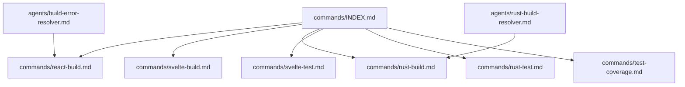
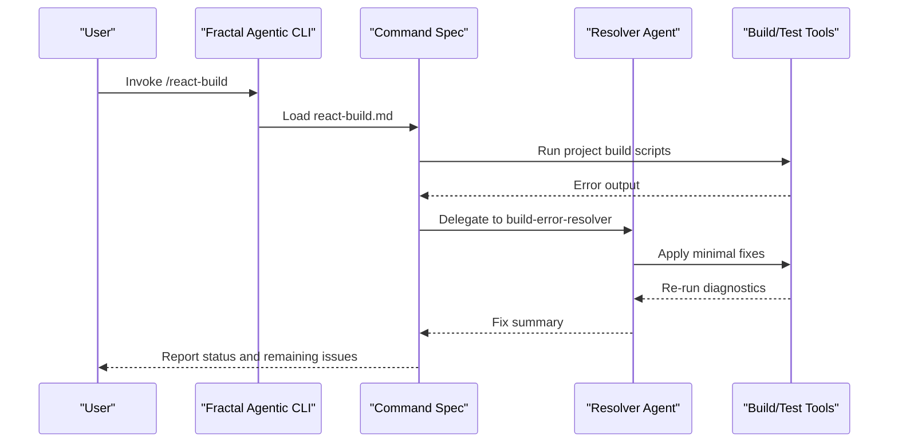
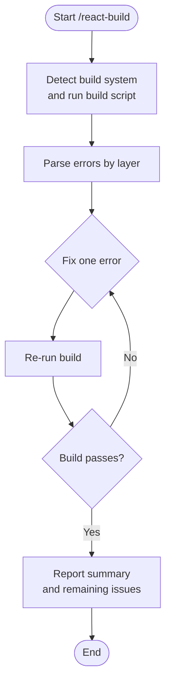
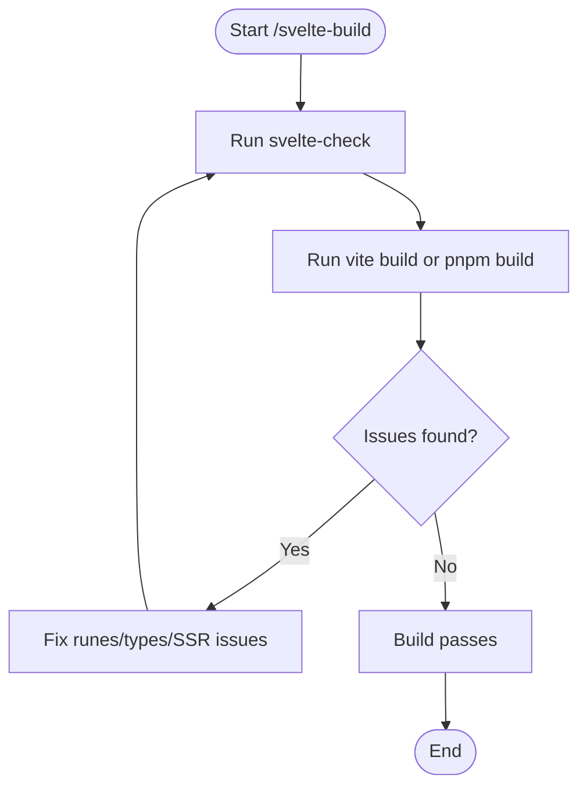
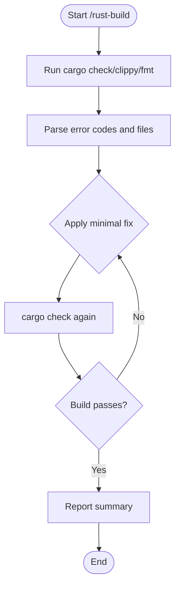
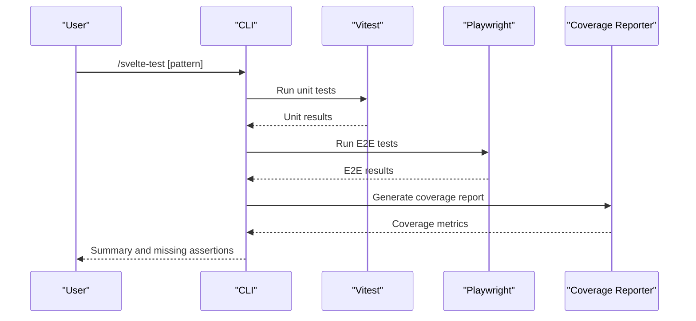
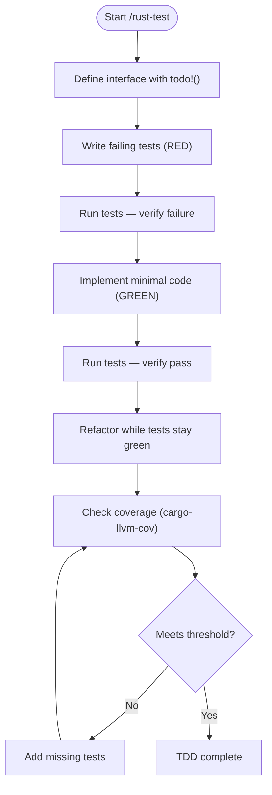
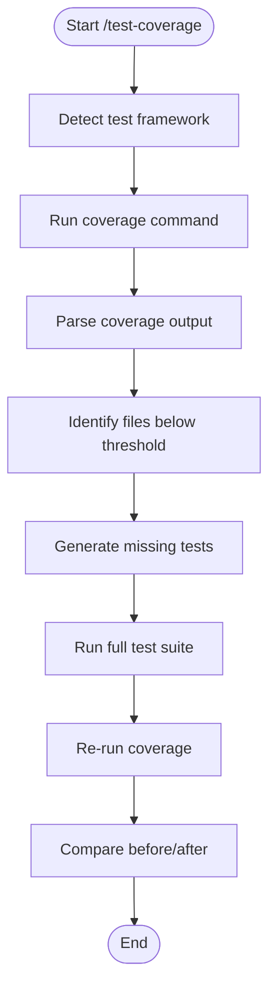
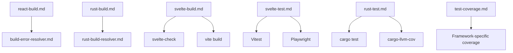

# Build & Test Commands

<cite>
**Referenced Files in This Document**
- [react-build.md](file://fractal-agentic/commands/react-build.md)
- [svelte-build.md](file://fractal-agentic/commands/svelte-build.md)
- [rust-build.md](file://fractal-agentic/commands/rust-build.md)
- [svelte-test.md](file://fractal-agentic/commands/svelte-test.md)
- [rust-test.md](file://fractal-agentic/commands/rust-test.md)
- [test-coverage.md](file://fractal-agentic/commands/test-coverage.md)
- [build-error-resolver.md](file://fractal-agentic/agents/build-error-resolver.md)
- [rust-build-resolver.md](file://fractal-agentic/agents/rust-build-resolver.md)
- [INDEX.md](file://fractal-agentic/commands/INDEX.md)
</cite>

## Table of Contents
1. Introduction
2. Project Structure
3. Core Components
4. Architecture Overview
5. Detailed Component Analysis
6. Dependency Analysis
7. Performance Considerations
8. Troubleshooting Guide
9. Conclusion

## Introduction
This document explains the build and testing commands available in Fractal Agentic for React, Svelte, and Rust projects. It covers how to diagnose and fix common build failures (Vite, webpack, Next.js compilation errors, hydration mismatches), run Svelte 5/SvelteKit diagnostics (runes type issues, SSR/hydration problems), resolve Rust build errors (borrow checker, dependency conflicts), and execute tests with TDD workflows. It also documents coverage analysis and generating missing tests to reach target thresholds.

## Project Structure
The build and test capabilities are defined as command specifications under the commands directory, with supporting agent playbooks that guide incremental fixes. The index provides a live inventory of all commands and their triggers.

**Diagram sources**
- [INDEX.md:1-68](file://fractal-agentic/commands/INDEX.md#L1-L68)
- [react-build.md:1-188](file://fractal-agentic/commands/react-build.md#L1-L188)
- [svelte-build.md:1-24](file://fractal-agentic/commands/svelte-build.md#L1-L24)
- [rust-build.md:1-190](file://fractal-agentic/commands/rust-build.md#L1-L190)
- [svelte-test.md:1-21](file://fractal-agentic/commands/svelte-test.md#L1-L21)
- [rust-test.md:1-312](file://fractal-agentic/commands/rust-test.md#L1-L312)
- [test-coverage.md:1-74](file://fractal-agentic/commands/test-coverage.md#L1-L74)
- [build-error-resolver.md:1-129](file://fractal-agentic/agents/build-error-resolver.md#L1-L129)
- [rust-build-resolver.md:1-159](file://fractal-agentic/agents/rust-build-resolver.md#L1-L159)

**Section sources**
- [INDEX.md:1-68](file://fractal-agentic/commands/INDEX.md#L1-L68)

## Core Components
- react-build: Detects the build system (Vite, webpack, Next.js, CRA, Parcel, esbuild, Bun), runs the project build, parses errors by layer, and applies minimal incremental fixes. It targets JSX/TSX compile errors, hydration mismatches, server/client component boundary failures, and missing types.
- svelte-build: Runs svelte-check and production builds (vite build or pnpm build), then incrementally fixes runes type mismatches, route parameter definitions, and SSR/hydration issues.
- rust-build: Executes cargo check/clippy/fmt checks, parses error codes and affected files, and applies minimal fixes one at a time while verifying each change.
- svelte-test: Executes unit tests (Vitest/@testing-library/svelte) and E2E tests (Playwright) for Svelte 5 components and SvelteKit routes, reporting coverage metrics and highlighting missing assertions.
- rust-test: Enforces TDD workflow using #[test], rstest, proptest, and mockall; verifies 80%+ coverage with cargo-llvm-cov and guides RED/GREEN/REFACTOR cycles.
- test-coverage: Detects the test framework, analyzes coverage reports, identifies gaps, generates missing tests following priority rules, and verifies improvement against thresholds.

**Section sources**
- [react-build.md:1-188](file://fractal-agentic/commands/react-build.md#L1-L188)
- [svelte-build.md:1-24](file://fractal-agentic/commands/svelte-build.md#L1-L24)
- [rust-build.md:1-190](file://fractal-agentic/commands/rust-build.md#L1-L190)
- [svelte-test.md:1-21](file://fractal-agentic/commands/svelte-test.md#L1-L21)
- [rust-test.md:1-312](file://fractal-agentic/commands/rust-test.md#L1-L312)
- [test-coverage.md:1-74](file://fractal-agentic/commands/test-coverage.md#L1-L74)

## Architecture Overview
Each command is a specification that orchestrates diagnostic commands and incremental fixes. For React and Rust, dedicated agents provide structured guidance for minimal changes. Svelte and test/coverage commands follow deterministic workflows tailored to their ecosystems.

**Diagram sources**
- [react-build.md:1-188](file://fractal-agentic/commands/react-build.md#L1-L188)
- [build-error-resolver.md:1-129](file://fractal-agentic/agents/build-error-resolver.md#L1-L129)

## Detailed Component Analysis

### React Build Command (/react-build)
Purpose: Incrementally fix React build failures across multiple bundlers and frameworks.

Key behaviors:
- Detects build system and runs appropriate build script.
- Parses errors by layer (TypeScript, bundler config, runtime, hydration).
- Applies minimal, surgical fixes and re-runs build after each change.
- Reports summary including fixed errors, modified files, dependencies added, and remaining issues.

Common scenarios:
- JSX/TSX compile errors after TypeScript or React upgrades.
- Next.js hydration mismatch errors at runtime.
- Server/Client Component boundary errors in App Router.
- Missing types or module resolution failures involving React.

Stop conditions:
- Same error persists after three attempts.
- Fix introduces more errors than it resolves.
- Requires architectural changes beyond build resolution.
- Bundler version no longer supports installed React major.

Related commands:
- /react-test — run tests after build is green.
- /react-review — review code quality after build succeeds.
- /build-fix — generic build fixer for non-React.

**Diagram sources**
- [react-build.md:1-188](file://fractal-agentic/commands/react-build.md#L1-L188)

**Section sources**
- [react-build.md:1-188](file://fractal-agentic/commands/react-build.md#L1-L188)
- [build-error-resolver.md:1-129](file://fractal-agentic/agents/build-error-resolver.md#L1-L129)

### Svelte Build Command (/svelte-build)
Purpose: Diagnose and fix Svelte 5/SvelteKit build and typecheck failures.

Key behaviors:
- Runs svelte-check and production build (vite build or pnpm build).
- Fixes runes type mismatches ($state, $derived, $props).
- Resolves SvelteKit route params and PageData type bindings.
- Addresses SSR browser globals dereferenced during server pre-rendering.

Workflow:
- Execute diagnostics.
- Fix identified issues incrementally.
- Re-run verification until build passes cleanly with zero errors.

**Diagram sources**
- [svelte-build.md:1-24](file://fractal-agentic/commands/svelte-build.md#L1-L24)

**Section sources**
- [svelte-build.md:1-24](file://fractal-agentic/commands/svelte-build.md#L1-L24)

### Rust Build Command (/rust-build)
Purpose: Resolve Rust build errors, borrow checker issues, and dependency problems incrementally.

Key behaviors:
- Executes cargo check, clippy, fmt --check, and dependency tree analysis.
- Parses error codes and affected files.
- Applies minimal fixes one at a time and verifies each change.
- Reports summary including fixed errors, clippy warnings, files modified, and remaining issues.

Common errors:
- Borrow checker violations (mutable vs immutable borrows).
- Lifetime issues (values not living long enough).
- Type mismatches and trait implementation gaps.
- Unresolved imports and Cargo.toml feature conflicts.

Stop conditions:
- Same error persists after three attempts.
- Fix introduces more errors.
- Requires architectural changes.
- Borrow checker error requires redesigning data ownership.

**Diagram sources**
- [rust-build.md:1-190](file://fractal-agentic/commands/rust-build.md#L1-L190)
- [rust-build-resolver.md:1-159](file://fractal-agentic/agents/rust-build-resolver.md#L1-L159)

**Section sources**
- [rust-build.md:1-190](file://fractal-agentic/commands/rust-build.md#L1-L190)
- [rust-build-resolver.md:1-159](file://fractal-agentic/agents/rust-build-resolver.md#L1-L159)

### Svelte Test Command (/svelte-test)
Purpose: Execute unit and E2E tests for Svelte 5 components and SvelteKit routes.

Key behaviors:
- Runs unit tests via Vitest or @testing-library/svelte targeting Svelte 5 components.
- Verifies reactive state transitions, event handler props, and snippet rendering.
- Runs E2E tests via Playwright targeting routes, SSR hydration, form actions, and navigation flows.
- Reports coverage metrics and highlights missing assertions.

Usage:
- Accepts optional test file or suite pattern argument.

**Diagram sources**
- [svelte-test.md:1-21](file://fractal-agentic/commands/svelte-test.md#L1-L21)

**Section sources**
- [svelte-test.md:1-21](file://fractal-agentic/commands/svelte-test.md#L1-L21)

### Rust Test Command (/rust-test)
Purpose: Enforce TDD workflow for Rust with comprehensive coverage.

Key behaviors:
- Defines interfaces with placeholders, writes failing tests first (RED).
- Implements minimal code to pass tests (GREEN).
- Refactors while keeping tests green.
- Verifies 80%+ coverage using cargo-llvm-cov.

Patterns supported:
- Unit tests with #[test].
- Parameterized tests with rstest.
- Async tests with tokio::test.
- Property-based tests with proptest.
- Mocking with mockall.

Coverage commands:
- Summary, HTML report, fail-under threshold, specific test execution, and no-fail-fast options.

**Diagram sources**
- [rust-test.md:1-312](file://fractal-agentic/commands/rust-test.md#L1-L312)

**Section sources**
- [rust-test.md:1-312](file://fractal-agentic/commands/rust-test.md#L1-L312)

### Test Coverage Command (/test-coverage)
Purpose: Analyze coverage, identify gaps, and generate missing tests toward target thresholds.

Key behaviors:
- Detects test framework based on configuration indicators.
- Runs coverage command and parses output (JSON summary or terminal).
- Lists files below 80% coverage sorted worst-first.
- Generates missing tests prioritizing happy path, error handling, edge cases, and branch coverage.
- Verifies full suite passes and re-runs coverage to confirm improvement.

Framework detection examples:
- Jest/Vitest, pytest, Cargo.toml (cargo llvm-cov), Maven JaCoCo, Go modules.

**Diagram sources**
- [test-coverage.md:1-74](file://fractal-agentic/commands/test-coverage.md#L1-L74)

**Section sources**
- [test-coverage.md:1-74](file://fractal-agentic/commands/test-coverage.md#L1-L74)

## Dependency Analysis
Commands rely on underlying tools and agents:
- React build depends on bundler-specific commands and the build-error-resolver agent.
- Svelte build depends on svelte-check and vite/pnpm build.
- Rust build depends on cargo ecosystem tools and the rust-build-resolver agent.
- Tests depend on Vitest/Playwright (Svelte) and cargo test/cargo-llvm-cov (Rust).
- Coverage depends on framework-specific reporters and JSON parsing.

**Diagram sources**
- [react-build.md:1-188](file://fractal-agentic/commands/react-build.md#L1-L188)
- [build-error-resolver.md:1-129](file://fractal-agentic/agents/build-error-resolver.md#L1-L129)
- [rust-build.md:1-190](file://fractal-agentic/commands/rust-build.md#L1-L190)
- [rust-build-resolver.md:1-159](file://fractal-agentic/agents/rust-build-resolver.md#L1-L159)
- [svelte-build.md:1-24](file://fractal-agentic/commands/svelte-build.md#L1-L24)
- [svelte-test.md:1-21](file://fractal-agentic/commands/svelte-test.md#L1-L21)
- [rust-test.md:1-312](file://fractal-agentic/commands/rust-test.md#L1-L312)
- [test-coverage.md:1-74](file://fractal-agentic/commands/test-coverage.md#L1-L74)

**Section sources**
- [INDEX.md:1-68](file://fractal-agentic/commands/INDEX.md#L1-L68)

## Performance Considerations
- Prefer incremental fixes and re-running diagnostics immediately to surface new errors early.
- Use targeted commands (e.g., single crate check in Rust, specific test patterns) to reduce feedback loops.
- Avoid broad dependency updates unless necessary; prefer updating specific packages to minimize churn.
- For large SvelteKit apps, run svelte-check first to catch type issues before full production builds.
- In CI, cache node_modules and Cargo registry to speed up repeated runs.

[No sources needed since this section provides general guidance]

## Troubleshooting Guide
- React build:
  - If hydration mismatches persist, move runtime-only logic into effects or client boundaries.
  - Deduplicate React copies via resolutions/overrides when encountering invalid hook calls.
  - Ensure tsconfig jsx setting matches React version expectations.
- Svelte build:
  - For runes type mismatches, ensure $state/$derived/$props usage aligns with Svelte 5 semantics.
  - Guard SSR browser globals with environment checks to avoid pre-render failures.
- Rust build:
  - Restructure borrows to end immutable borrows before mutable access.
  - Use owned types or explicit lifetimes where values do not live long enough.
  - Inspect duplicate dependencies and feature flags with cargo tree.
- Tests and coverage:
  - Validate RED state by running tests before implementing code.
  - Use assertion libraries effectively and isolate tests to avoid shared mutable state.
  - Set coverage thresholds and fail builds if below target.

**Section sources**
- [react-build.md:1-188](file://fractal-agentic/commands/react-build.md#L1-L188)
- [svelte-build.md:1-24](file://fractal-agentic/commands/svelte-build.md#L1-L24)
- [rust-build.md:1-190](file://fractal-agentic/commands/rust-build.md#L1-L190)
- [rust-test.md:1-312](file://fractal-agentic/commands/rust-test.md#L1-L312)
- [test-coverage.md:1-74](file://fractal-agentic/commands/test-coverage.md#L1-L74)

## Conclusion
Fractal Agentic’s build and test commands provide structured, incremental workflows for resolving React, Svelte, and Rust build issues and enforcing TDD practices. By leveraging framework-specific diagnostics, minimal-change strategies, and coverage-driven test generation, teams can maintain healthy builds and robust test suites across diverse stacks.

[No sources needed since this section summarizes without analyzing specific files]