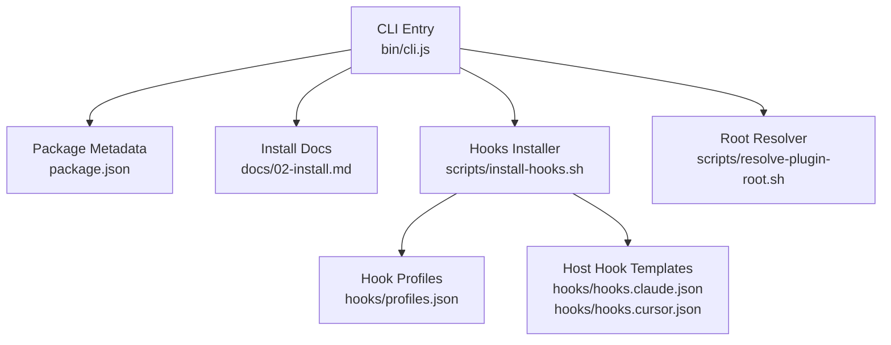
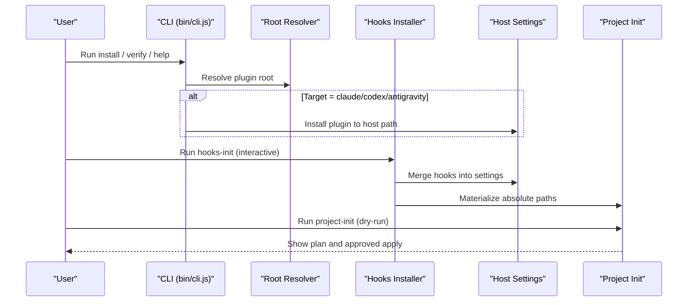
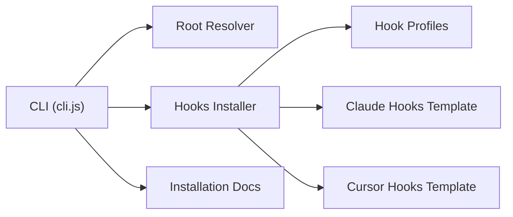

# Installation & Setup Commands

<cite>
**Referenced Files in This Document**
- [cli.js](file://fractal-agentic/bin/cli.js)
- [package.json](file://fractal-agentic/package.json)
- [02-install.md](file://fractal-agentic/docs/02-install.md)
- [auto-update.md](file://fractal-agentic/commands/auto-update.md)
- [hooks-init.md](file://fractal-agentic/commands/hooks-init.md)
- [project-init.md](file://fractal-agentic/commands/project-init.md)
- [install-hooks.sh](file://fractal-agentic/scripts/install-hooks.sh)
- [resolve-plugin-root.sh](file://fractal-agentic/scripts/resolve-plugin-root.sh)
- [profiles.json](file://fractal-agentic/hooks/profiles.json)
- [hooks.claude.json](file://fractal-agentic/hooks/hooks.claude.json)
- [hooks.cursor.json](file://fractal-agentic/hooks/hooks.cursor.json)
- [troubleshooting.md](file://fractal-agentic/docs/troubleshooting.md)
</cite>

## Table of Contents
1. [Introduction](#introduction)
2. [Project Structure](#project-structure)
3. [Core Components](#core-components)
4. [Architecture Overview](#architecture-overview)
5. [Detailed Component Analysis](#detailed-component-analysis)
6. [Dependency Analysis](#dependency-analysis)
7. [Performance Considerations](#performance-considerations)
8. [Troubleshooting Guide](#troubleshooting-guide)
9. [Conclusion](#conclusion)

## Introduction
This document explains the Fractal Agentic installation and setup commands with a focus on:
- Auto-update for pulling latest ECC repo changes and reinstalling managed targets
- Hooks-init for installing optional Fractal hooks with profiles and host adapters
- Project-init for detecting project stack and producing dry-run ECC onboarding plans
It also includes practical examples, error handling, troubleshooting tips, and integration notes across AI coding platforms (Claude Code, Codex, Antigravity/Gemini).

## Project Structure
Fractal Agentic ships as an npm package and multi-host plugin. The CLI entrypoint is exposed via the package bin mapping and supports install, verify, and help. Installation methods include npx one-liner, marketplace installs, manual clone, and per-host configuration.

**Diagram sources**
- [cli.js:1-148](file://fractal-agentic/bin/cli.js#L1-L148)
- [package.json:1-59](file://fractal-agentic/package.json#L1-L59)
- [02-install.md:1-198](file://fractal-agentic/docs/02-install.md#L1-L198)
- [install-hooks.sh:1-380](file://fractal-agentic/scripts/install-hooks.sh#L1-L380)
- [resolve-plugin-root.sh:1-140](file://fractal-agentic/scripts/resolve-plugin-root.sh#L1-L140)
- [profiles.json:1-38](file://fractal-agentic/hooks/profiles.json#L1-L38)
- [hooks.claude.json:1-87](file://fractal-agentic/hooks/hooks.claude.json#L1-L87)
- [hooks.cursor.json:1-48](file://fractal-agentic/hooks/hooks.cursor.json#L1-L48)

**Section sources**
- [cli.js:1-148](file://fractal-agentic/bin/cli.js#L1-L148)
- [package.json:1-59](file://fractal-agentic/package.json#L1-L59)
- [02-install.md:1-198](file://fractal-agentic/docs/02-install.md#L1-L198)

## Core Components
- CLI installer: Detects hosts and performs installation or verification. Supports --target and --project flags.
- Hooks installer: Non-blocking optional setup for safety and lifecycle hooks across hosts and projects.
- Root resolver: Resolves the plugin root from environment, cwd walk-up, or script location.
- Command docs: Provide usage, flags, and behavior for auto-update, hooks-init, and project-init.

Key responsibilities:
- CLI orchestrates install flows and delegates to scripts where needed.
- Hooks installer writes config, merges host settings, and materializes absolute-path hook files.
- Root resolver ensures all tools locate the correct plugin directory.

**Section sources**
- [cli.js:1-148](file://fractal-agentic/bin/cli.js#L1-L148)
- [install-hooks.sh:1-380](file://fractal-agentic/scripts/install-hooks.sh#L1-L380)
- [resolve-plugin-root.sh:1-140](file://fractal-agentic/scripts/resolve-plugin-root.sh#L1-L140)

## Architecture Overview
The installation and setup flow spans multiple layers:
- User invokes CLI or command docs
- CLI resolves plugin root and executes host-specific installers
- Hooks installer writes configs and merges host settings
- Project-init generates dry-run ECC plans based on detected stacks

**Diagram sources**
- [cli.js:1-148](file://fractal-agentic/bin/cli.js#L1-L148)
- [resolve-plugin-root.sh:1-140](file://fractal-agentic/scripts/resolve-plugin-root.sh#L1-L140)
- [install-hooks.sh:1-380](file://fractal-agentic/scripts/install-hooks.sh#L1-L380)

## Detailed Component Analysis

### Auto Update
Purpose:
- Pull latest ECC repo changes and reinstall current managed targets using recorded install-state.

Usage highlights:
- Dry-run preview without mutations
- Target specific host-managed files
- Override ECC repo root explicitly

Behavior:
- Uses recorded install-state request and reruns install-apply after pulling upstream changes
- Reinstall handles upstream renames/deletions safely

Common flags and options:
- --dry-run: Preview changes only
- --target: Restrict update to specific host-managed files
- --repo-root: Explicitly set ECC repository root

Practical examples:
- Preview update: run with --dry-run before applying
- Update Cursor-managed files: specify target cursor
- Override repo root: pass explicit repo-root path

Error handling:
- If repo root cannot be resolved, provide explicit --repo-root
- Use --dry-run to validate plan before mutation

Integration notes:
- Works with ECC-managed installations; ensure plugin root is resolvable

**Section sources**
- [auto-update.md:1-29](file://fractal-agentic/commands/auto-update.md#L1-L29)

### Hooks Init
Purpose:
- Interactive setup for optional session hooks (safety, config protection, SessionStart bootstrap)
- Same role as wiki-init for user-side setup; never required for delivery

Profiles:
- minimal: destructive bash guard, no-verify block, config-protection, SessionStart
- standard: adds stop quality/console warnings
- strict: adds first-edit GateGuard (can be disabled via env)

Targets:
- config: write preference file and env snippet
- claude: merge into host settings when possible
- cursor: write project-level hooks file
- project: materialize absolute-path hooks under project directory
- all: combine config + claude + cursor + project

Workflow:
1. Confirm plugin root (use resolve-plugin-root.sh or FRACTAL_AGENTIC_ROOT)
2. Ask profile and target questions interactively
3. Run install-hooks.sh with chosen flags
4. Source env file and restart agent host
5. Verify installation or use status command

Practical examples:
- Install minimal hooks for Claude: target claude, profile minimal
- Force merge if existing hooks conflict: add --force
- Check installation: use --check flag

Error handling:
- Missing node falls back to writing project materialization only
- Conservative merge preserves existing hooks unless --force is used
- Non-blocking: failures print warnings and continue other targets

Integration notes:
- For GUI apps that do not load shell rc, set env in app UI
- Use FRACTAL_DISABLED_HOOKS, FRACTAL_HOOK_PROFILE, FRACTAL_GATEGUARD=off for opt-outs

**Section sources**
- [hooks-init.md:1-63](file://fractal-agentic/commands/hooks-init.md#L1-L63)
- [install-hooks.sh:1-380](file://fractal-agentic/scripts/install-hooks.sh#L1-L380)
- [profiles.json:1-38](file://fractal-agentic/hooks/profiles.json#L1-L38)
- [hooks.claude.json:1-87](file://fractal-agentic/hooks/hooks.claude.json#L1-L87)
- [hooks.cursor.json:1-48](file://fractal-agentic/hooks/hooks.cursor.json#L1-L48)

### Project Init
Purpose:
- Detect project stack and produce a safe, reviewable ECC onboarding plan
- Default to dry-run; only write files after explicit approval

Detection inputs:
- Package manager files (package.json, lockfiles, etc.)
- Language manifests (pyproject.toml, go.mod, Cargo.toml, etc.)
- Framework files (next.config.*, vite.config.*, Dockerfile, etc.)
- ECC config and optional stack mappings

Planning flow:
1. Identify target harness (default claude; supports cursor, codex, gemini, opencode, codebuddy, joycode, qwen)
2. Detect stacks from project files and show evidence
3. Resolve smallest useful ECC plan using install-plan or legacy language dry-run
4. Run dry-run apply before writing
5. Summarize changes and ask for approval

Output contract:
- Detected stack evidence
- Proposed target harness
- Exact dry-run command used
- Exact apply command after approval
- Files/directories that would change
- Warnings about existing files, permissions, missing scripts, unsupported targets

CLAUDE.md guidance:
- Generate minimal starter with build/test/lint/dev commands if detected
- Never replace existing CLAUDE.md without diff and approval

Practical examples:
- Dry-run plan: /project-init --dry-run
- Target specific host: /project-init --target claude
- Select skills: /project-init --skills continuous-learning-v2,security-review
- Use custom config: /project-init --config ecc-install.json

Error handling:
- Preserve existing project guidance and propose merge/append instead of overwrite
- Report exact changes before applying anything
- Skip unsupported modules and warn about broad permissions

**Section sources**
- [project-init.md:1-87](file://fractal-agentic/commands/project-init.md#L1-L87)

### CLI Installer
Purpose:
- Provide a single entrypoint for installation across multiple AI coding agents
- Support target selection and project integration

Capabilities:
- Install to Antigravity, Claude Code, and Codex directories
- Inject AGENTS snippet into current project when requested
- Verify installation with built-in verification suite

Flags:
- --target=<host>: antigravity, claude, codex, or all
- --project: inject AGENTS snippet into current project

Behavior:
- Attempts official marketplace commands when available
- Falls back to direct copy when marketplace is unavailable
- Excludes non-essential files during copy

Error handling:
- Graceful fallbacks when marketplace commands fail
- Clear error messages for failed operations

**Section sources**
- [cli.js:1-148](file://fractal-agentic/bin/cli.js#L1-L148)
- [package.json:1-59](file://fractal-agentic/package.json#L1-L59)

## Dependency Analysis
The installation system has clear separation of concerns:
- CLI handles high-level orchestration and user interaction
- Scripts perform specific tasks (root resolution, hook installation)
- Configuration files define profiles and host-specific hook templates
- Documentation provides usage patterns and troubleshooting guidance

**Diagram sources**
- [cli.js:1-148](file://fractal-agentic/bin/cli.js#L1-L148)
- [resolve-plugin-root.sh:1-140](file://fractal-agentic/scripts/resolve-plugin-root.sh#L1-L140)
- [install-hooks.sh:1-380](file://fractal-agentic/scripts/install-hooks.sh#L1-L380)
- [profiles.json:1-38](file://fractal-agentic/hooks/profiles.json#L1-L38)
- [hooks.claude.json:1-87](file://fractal-agentic/hooks/hooks.claude.json#L1-L87)
- [hooks.cursor.json:1-48](file://fractal-agentic/hooks/hooks.cursor.json#L1-L48)

**Section sources**
- [cli.js:1-148](file://fractal-agentic/bin/cli.js#L1-L148)
- [install-hooks.sh:1-380](file://fractal-agentic/scripts/install-hooks.sh#L1-L380)
- [resolve-plugin-root.sh:1-140](file://fractal-agentic/scripts/resolve-plugin-root.sh#L1-L140)

## Performance Considerations
- Hooks are designed to be non-blocking and degrade gracefully
- Dry-run modes prevent unnecessary mutations and reduce overhead
- Profile selection allows balancing safety vs performance (minimal vs strict)
- Plugin root resolution uses efficient walking algorithms with early termination

## Troubleshooting Guide
Common issues and solutions:
- Plugin root not found: Set FRACTAL_AGENTIC_ROOT to plugin directory containing plugin.json, AGENTS.md, and boss playbooks
- Marketplace manifest missing: Include required directories in sparse checkout
- Commands not loading: Ensure plugin directory is properly configured in host settings
- Hooks not working: Verify host registration and environment variables
- Self-improvement plane issues: Check profile settings and data directories

Health checks:
- Use resolve-plugin-root.sh to verify plugin detection
- Run check-armory.sh and verify.sh for comprehensive validation
- Use hooks-status to check hook installation state

Environment variables:
- FRACTAL_AGENTIC_ROOT: Plugin root directory
- FRACTAL_HOOK_PROFILE: Hook profile selection
- FRACTAL_DISABLED_HOOKS: Disable specific hooks
- FRACTAL_GATEGUARD=off: Disable gateguard protection

**Section sources**
- [troubleshooting.md:1-143](file://fractal-agentic/docs/troubleshooting.md#L1-L143)
- [resolve-plugin-root.sh:1-140](file://fractal-agentic/scripts/resolve-plugin-root.sh#L1-L140)

## Conclusion
Fractal Agentic provides a robust installation and setup system that supports multiple AI coding platforms through a unified interface. The auto-update, hooks-init, and project-init commands offer comprehensive management capabilities while maintaining safety through dry-run modes and non-blocking design principles. The modular architecture allows for easy customization and troubleshooting, ensuring reliable operation across different environments and use cases.