# Deployment & CI/CD Integration

<cite>
**Referenced Files in This Document**
- [ci.yml](file://fractal-svelte/.github/workflows/ci.yml)
- [package.json (fractal-svelte)](file://fractal-svelte/package.json)
- [package.json (fractals-styler)](file://fractals-styler/package.json)
- [package.json (fractalsvelte)](file://fractalsvelte/package.json)
- [package.json (fractal-agentic)](file://fractal-agentic/package.json)
- [monorepo-release.workflow.md](file://fractal-agentic/workflows/monorepo-release.workflow.md)
- [review-fanout.workflow.md](file://fractal-agentic/workflows/review-fanout.workflow.md)
- [verify.sh](file://fractal-agentic/scripts/verify.sh)
- [check-armory.sh](file://fractal-agentic/scripts/check-armory.sh)
- [ship.md](file://fractal-agentic/commands/ship.md)
</cite>

## Table of Contents
1. Introduction
2. Project Structure
3. Core Components
4. Architecture Overview
5. Detailed Component Analysis
6. Dependency Analysis
7. Performance Considerations
8. Troubleshooting Guide
9. Conclusion

## Introduction
This document provides a comprehensive guide to deployment strategies and CI/CD integration across the monorepo’s packages. It covers automated testing pipelines, package publishing workflows, version management, distribution channels, environment configuration, secret management, rollback strategies, monitoring and logging, performance metrics, alerting, multi-platform considerations, security scanning, compliance requirements, and troubleshooting for deployment failures and environment-specific issues.

## Project Structure
The repository is a monorepo with multiple packages:
- fractal-svelte: Svelte component library with GitHub Actions CI pipeline and npm publish scripts.
- fractals-styler: CLI and library built with tsup, published as an npm package.
- fractalsvelte: SvelteKit-based package with build and prepack steps.
- fractal-agentic: Orchestration assets, skills, commands, and release workflow specifications.

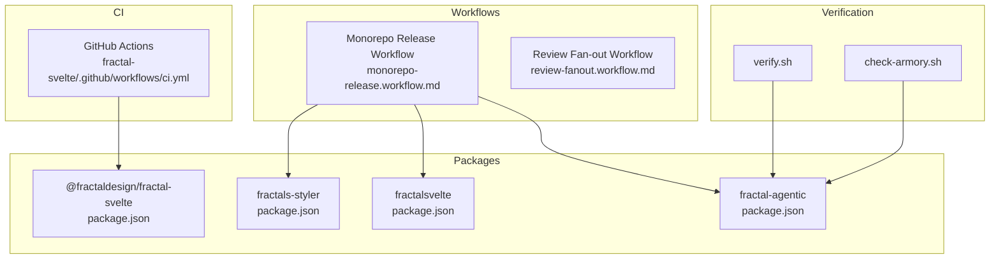

**Diagram sources**
- [ci.yml:1-37](file://fractal-svelte/.github/workflows/ci.yml#L1-L37)
- [package.json (fractal-svelte):1-245](file://fractal-svelte/package.json#L1-L245)
- [package.json (fractals-styler):1-45](file://fractals-styler/package.json#L1-L45)
- [package.json (fractalsvelte):1-486](file://fractalsvelte/package.json#L1-L486)
- [package.json (fractal-agentic):1-59](file://fractal-agentic/package.json#L1-L59)
- [monorepo-release.workflow.md:1-59](file://fractal-agentic/workflows/monorepo-release.workflow.md#L1-L59)
- [review-fanout.workflow.md:1-111](file://fractal-agentic/workflows/review-fanout.workflow.md#L1-L111)
- [verify.sh:1-274](file://fractal-agentic/scripts/verify.sh#L1-L274)
- [check-armory.sh:1-143](file://fractal-agentic/scripts/check-armory.sh#L1-L143)

**Section sources**
- [ci.yml:1-37](file://fractal-svelte/.github/workflows/ci.yml#L1-L37)
- [package.json (fractal-svelte):1-245](file://fractal-svelte/package.json#L1-L245)
- [package.json (fractals-styler):1-45](file://fractals-styler/package.json#L1-L45)
- [package.json (fractalsvelte):1-486](file://fractalsvelte/package.json#L1-L486)
- [package.json (fractal-agentic):1-59](file://fractal-agentic/package.json#L1-L59)

## Core Components
- GitHub Actions CI for fractal-svelte:
  - Triggers on push/PR to main.
  - Runs checks, lint, tests, registry validation, build, pack dry-run, and publint.
- Package scripts for building, checking, linting, testing, and prepack:
  - fractal-svelte uses svelte-kit sync, svelte-package, and publint during prepack.
  - fractals-styler builds via tsup and exposes a CLI binary.
  - fractalsvelte uses vite build and svelte-package during prepack.
- Monorepo release workflow specification:
  - Verifies build/tests, generates changelog, bumps version, publishes, and creates GitHub releases.
- Review fan-out workflow specification:
  - Parallel multi-dimension review with deduplication and adversarial verification for critical/high findings.
- Verification and armory health checks:
  - verify.sh validates orchestration assets, templates, contracts, installer behavior, and runtime inspector safety.
  - check-armory.sh ensures required files and schema validity.

**Section sources**
- [ci.yml:1-37](file://fractal-svelte/.github/workflows/ci.yml#L1-L37)
- [package.json (fractal-svelte):24-42](file://fractal-svelte/package.json#L24-L42)
- [package.json (fractals-styler):21-25](file://fractals-styler/package.json#L21-L25)
- [package.json (fractalsvelte):4-14](file://fractalsvelte/package.json#L4-L14)
- [monorepo-release.workflow.md:1-59](file://fractal-agentic/workflows/monorepo-release.workflow.md#L1-L59)
- [review-fanout.workflow.md:1-111](file://fractal-agentic/workflows/review-fanout.workflow.md#L1-L111)
- [verify.sh:1-274](file://fractal-agentic/scripts/verify.sh#L1-L274)
- [check-armory.sh:1-143](file://fractal-agentic/scripts/check-armory.sh#L1-L143)

## Architecture Overview
The CI/CD architecture integrates GitHub Actions with package build/test/publish processes and orchestrates releases through documented workflows. The flow ensures quality gates, consistent packaging, and safe publishing with user confirmation.

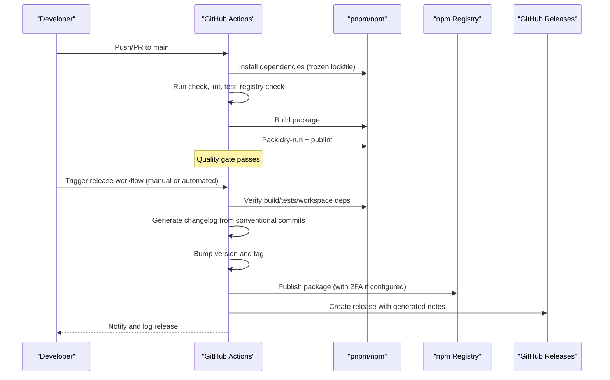

**Diagram sources**
- [ci.yml:1-37](file://fractal-svelte/.github/workflows/ci.yml#L1-L37)
- [monorepo-release.workflow.md:1-59](file://fractal-agentic/workflows/monorepo-release.workflow.md#L1-L59)

## Detailed Component Analysis

### GitHub Actions CI Pipeline (fractal-svelte)
- Triggers: push and pull_request on main branch.
- Jobs:
  - check: installs dependencies, runs check, lint, test, and registry validation.
  - build: installs dependencies, builds, packs dry-run, and runs publint.
- Environment: Node 22, pnpm caching.

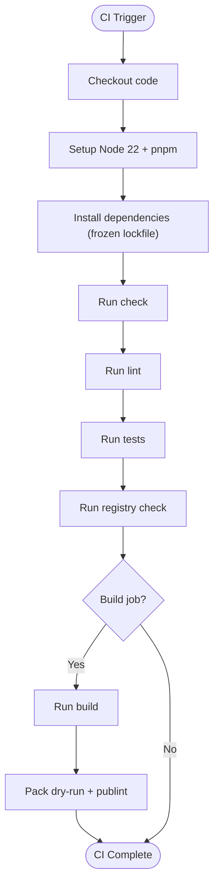

**Diagram sources**
- [ci.yml:1-37](file://fractal-svelte/.github/workflows/ci.yml#L1-L37)

**Section sources**
- [ci.yml:1-37](file://fractal-svelte/.github/workflows/ci.yml#L1-L37)

### Package Publishing Workflows
- fractal-svelte:
  - build script invokes vite build and prepack.
  - prepack runs svelte-kit sync, svelte-package, and publint.
  - exports define types and entry points for components/styles.
- fractals-styler:
  - build via tsup; bin exposed for CLI usage.
- fractalsvelte:
  - build invokes vite build and prepack; prepack uses svelte-package and publint.
- fractal-agentic:
  - scripts include test and check; files list defines published artifacts.

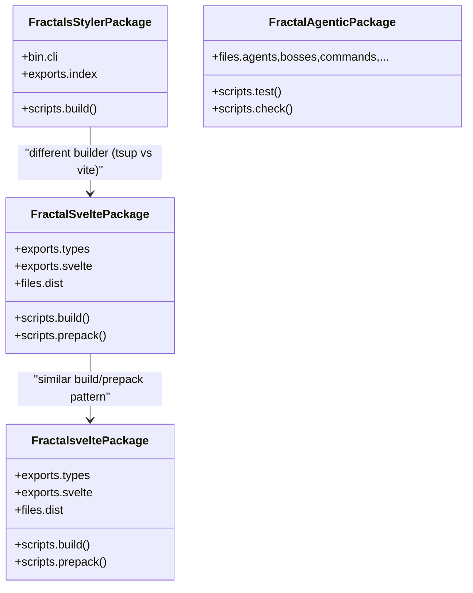

**Diagram sources**
- [package.json (fractal-svelte):24-42](file://fractal-svelte/package.json#L24-L42)
- [package.json (fractals-styler):21-25](file://fractals-styler/package.json#L21-L25)
- [package.json (fractalsvelte):4-14](file://fractalsvelte/package.json#L4-L14)
- [package.json (fractal-agentic):35-38](file://fractal-agentic/package.json#L35-L38)

**Section sources**
- [package.json (fractal-svelte):24-42](file://fractal-svelte/package.json#L24-L42)
- [package.json (fractals-styler):21-25](file://fractals-styler/package.json#L21-L25)
- [package.json (fractalsvelte):4-14](file://fractalsvelte/package.json#L4-L14)
- [package.json (fractal-agentic):35-38](file://fractal-agentic/package.json#L35-L38)

### Version Management and Distribution Channels
- Version bump strategy:
  - major for breaking changes, minor for features, patch for fixes.
  - Auto-detection from conventional commits when not specified.
- Changelog generation:
  - Scans git log since last tag; groups by commit type.
- Distribution channels:
  - npm publish for public packages.
  - GitHub release creation with generated notes.
- Safety:
  - Requires user confirmation before publishing/version bump.
  - Verifies 2FA availability; reverts version bump on publish failure.

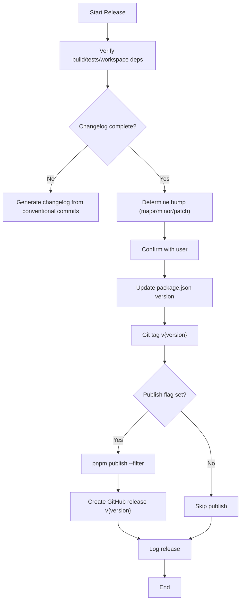

**Diagram sources**
- [monorepo-release.workflow.md:1-59](file://fractal-agentic/workflows/monorepo-release.workflow.md#L1-L59)
- [ship.md:1-60](file://fractal-agentic/commands/ship.md#L1-L60)

**Section sources**
- [monorepo-release.workflow.md:1-59](file://fractal-agentic/workflows/monorepo-release.workflow.md#L1-L59)
- [ship.md:1-60](file://fractal-agentic/commands/ship.md#L1-L60)

### Automated Testing Pipelines
- CI pipeline includes:
  - Type checking (svelte-check), linting (prettier/eslint), unit tests (vitest).
  - Registry validation (check:registry) and publint for package correctness.
- Local verification:
  - verify.sh validates orchestration assets, TOML templates, role contracts, installer behavior, and runtime inspector safety.
  - check-armory.sh ensures required files exist and openai.yaml schema is valid.

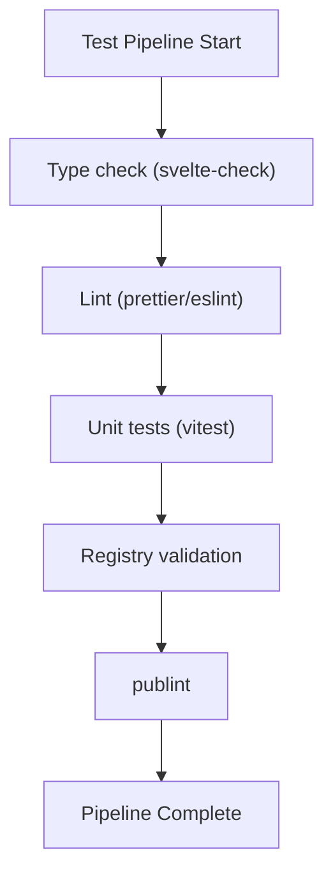

**Diagram sources**
- [ci.yml:1-37](file://fractal-svelte/.github/workflows/ci.yml#L1-L37)
- [package.json (fractal-svelte):24-42](file://fractal-svelte/package.json#L24-L42)
- [verify.sh:1-274](file://fractal-agentic/scripts/verify.sh#L1-L274)
- [check-armory.sh:1-143](file://fractal-agentic/scripts/check-armory.sh#L1-L143)

**Section sources**
- [ci.yml:1-37](file://fractal-svelte/.github/workflows/ci.yml#L1-L37)
- [package.json (fractal-svelte):24-42](file://fractal-svelte/package.json#L24-L42)
- [verify.sh:1-274](file://fractal-agentic/scripts/verify.sh#L1-L274)
- [check-armory.sh:1-143](file://fractal-agentic/scripts/check-armory.sh#L1-L143)

### Deployment Triggers and Rollback Strategies
- Triggers:
  - GitHub Actions CI triggered by push/PR to main.
  - Manual release workflow invocation with explicit flags (--publish, --dry-run).
- Rollback strategies:
  - Revert version bump on publish failure.
  - Use previous npm versions and tags; create new release only after successful publish.
  - Maintain clean working tree and confirm before merging.

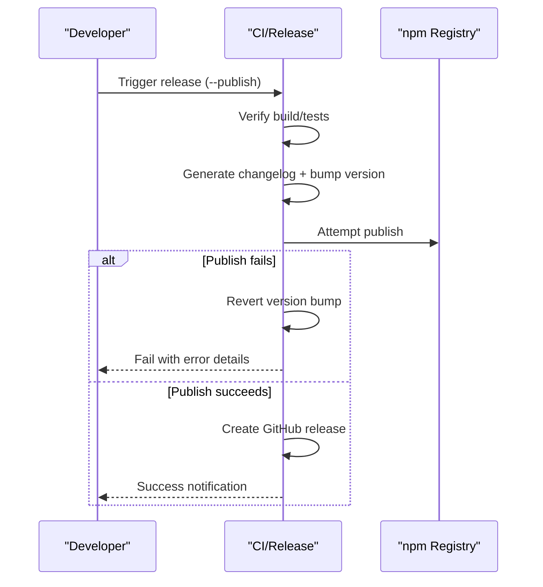

**Diagram sources**
- [monorepo-release.workflow.md:1-59](file://fractal-agentic/workflows/monorepo-release.workflow.md#L1-L59)
- [ship.md:1-60](file://fractal-agentic/commands/ship.md#L1-L60)

**Section sources**
- [monorepo-release.workflow.md:1-59](file://fractal-agentic/workflows/monorepo-release.workflow.md#L1-L59)
- [ship.md:1-60](file://fractal-agentic/commands/ship.md#L1-L60)

### Environment Configuration and Secret Management
- Secrets detection and stripping:
  - Agents scan for API keys, AWS credentials, database URLs, JWT tokens, private keys, GitHub tokens, OAuth secrets, Slack webhooks, SendGrid/Mailgun keys.
  - Heuristic patterns warn about high-entropy strings in config files.
- Internal reference replacement:
  - Replace custom domains, absolute paths, private IPs, internal service URLs, personal emails, and org names with placeholders.
- .env.example generation:
  - Required variables documented with examples; users copy and fill values.
- CI environment:
  - Node 22 setup; secrets should be provided via GitHub Actions secrets.

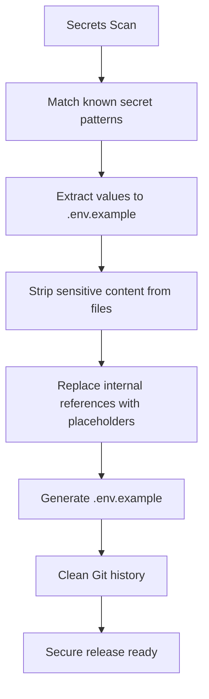

**Diagram sources**
- [opensource-forker.md:55-156](file://fractal-agentic/agents/opensource-forker.md#L55-L156)
- [opensource-sanitizer.md:29-89](file://fractal-agentic/agents/opensource-sanitizer.md#L29-L89)

**Section sources**
- [opensource-forker.md:55-156](file://fractal-agentic/agents/opensource-forker.md#L55-L156)
- [opensource-sanitizer.md:29-89](file://fractal-agentic/agents/opensource-sanitizer.md#L29-L89)

### Monitoring, Logging, and Alerting
- Runtime inspector:
  - Safely extracts session metadata without leaking prompts or secrets.
  - Validates thread IDs and refuses invalid inputs.
- Session ledger:
  - Logs release events and operational data for traceability.
- Metrics collection:
  - Evaluation scripts include latency checks and load test simulators for performance profiling.

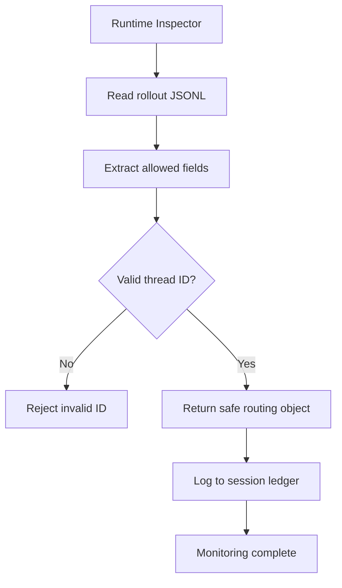

**Diagram sources**
- [verify.sh:234-274](file://fractal-agentic/scripts/verify.sh#L234-L274)

**Section sources**
- [verify.sh:234-274](file://fractal-agentic/scripts/verify.sh#L234-L274)

### Multi-Platform Deployment Considerations
- Node version pinning:
  - CI uses Node 22 for consistency across platforms.
- Package exports:
  - Explicit types and module entries ensure compatibility with different bundlers and runtimes.
- Side effects:
  - CSS/SASS side effects declared for proper tree-shaking and asset inclusion.

**Section sources**
- [ci.yml:15-18](file://fractal-svelte/.github/workflows/ci.yml#L15-L18)
- [package.json (fractal-svelte):48-51](file://fractal-svelte/package.json#L48-L51)
- [package.json (fractalsvelte):22-25](file://fractalsvelte/package.json#L22-L25)

### Security Scanning and Compliance Requirements
- Review fan-out workflow:
  - Parallel multi-dimension review including security reviewer when triggers match.
  - Deduplication by evidence snippet; adversarial verification for CRITICAL/HIGH findings.
- Open-source sanitization:
  - Strict scanning for secrets and PII; heuristic warnings for high-entropy strings.
- Compliance:
  - Never publish without user confirmation; verify 2FA; revert on failure.

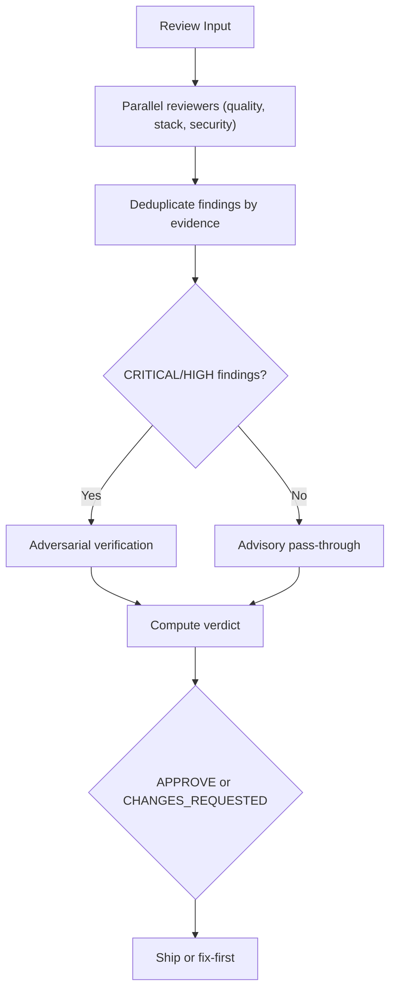

**Diagram sources**
- [review-fanout.workflow.md:1-111](file://fractal-agentic/workflows/review-fanout.workflow.md#L1-L111)

**Section sources**
- [review-fanout.workflow.md:1-111](file://fractal-agentic/workflows/review-fanout.workflow.md#L1-L111)

### Troubleshooting Guide
- Common CI failures:
  - Dependency install errors: ensure frozen lockfile matches installed versions.
  - Type check/lint/test failures: fix reported issues and re-run CI.
  - Registry validation failures: verify package exports and metadata.
- Local verification issues:
  - verify.sh failures indicate missing assets, invalid TOML, or installer conflicts.
  - check-armory.sh failures point to missing files or invalid schema.
- Release failures:
  - Revert version bump if publish fails; ensure 2FA is available.
  - Confirm working tree is clean before starting release.

**Section sources**
- [ci.yml:1-37](file://fractal-svelte/.github/workflows/ci.yml#L1-L37)
- [verify.sh:1-274](file://fractal-agentic/scripts/verify.sh#L1-L274)
- [check-armory.sh:1-143](file://fractal-agentic/scripts/check-armory.sh#L1-L143)
- [monorepo-release.workflow.md:1-59](file://fractal-agentic/workflows/monorepo-release.workflow.md#L1-L59)

## Dependency Analysis
The CI pipeline depends on Node 22 and pnpm. Packages depend on their respective build tools (vite, svelte-package, tsup). Release workflow depends on git tags, conventional commits, and npm registry access.

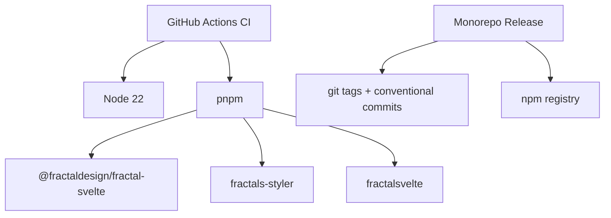

**Diagram sources**
- [ci.yml:1-37](file://fractal-svelte/.github/workflows/ci.yml#L1-L37)
- [monorepo-release.workflow.md:1-59](file://fractal-agentic/workflows/monorepo-release.workflow.md#L1-L59)

**Section sources**
- [ci.yml:1-37](file://fractal-svelte/.github/workflows/ci.yml#L1-L37)
- [monorepo-release.workflow.md:1-59](file://fractal-agentic/workflows/monorepo-release.workflow.md#L1-L59)

## Performance Considerations
- CI caching:
  - pnpm cache reduces dependency installation time.
- Build optimization:
  - Use frozen lockfile to avoid unnecessary rebuilds.
  - Leverage svelte-package and tsup for efficient bundling.
- Testing efficiency:
  - Vitest runs unit tests quickly; consider parallelization for large suites.

[No sources needed since this section provides general guidance]

## Troubleshooting Guide
- CI pipeline failures:
  - Inspect logs for dependency resolution, type errors, lint violations, and test failures.
  - Ensure Node version matches CI configuration.
- Local verification failures:
  - Run verify.sh and check-armory.sh to identify missing assets or invalid schemas.
  - Fix installer conflicts and ensure idempotent behavior.
- Release process issues:
  - Confirm 2FA setup; revert version bump on publish failure.
  - Validate changelog completeness and conventional commit structure.

**Section sources**
- [ci.yml:1-37](file://fractal-svelte/.github/workflows/ci.yml#L1-L37)
- [verify.sh:1-274](file://fractal-agentic/scripts/verify.sh#L1-L274)
- [check-armory.sh:1-143](file://fractal-agentic/scripts/check-armory.sh#L1-L143)
- [monorepo-release.workflow.md:1-59](file://fractal-agentic/workflows/monorepo-release.workflow.md#L1-L59)

## Conclusion
This monorepo implements a robust CI/CD pipeline with GitHub Actions, structured package publishing workflows, and comprehensive verification and security scanning. The release process emphasizes safety, user confirmation, and traceability. By following the documented strategies, teams can maintain high-quality deployments across multiple platforms while ensuring security and compliance.

[No sources needed since this section summarizes without analyzing specific files]