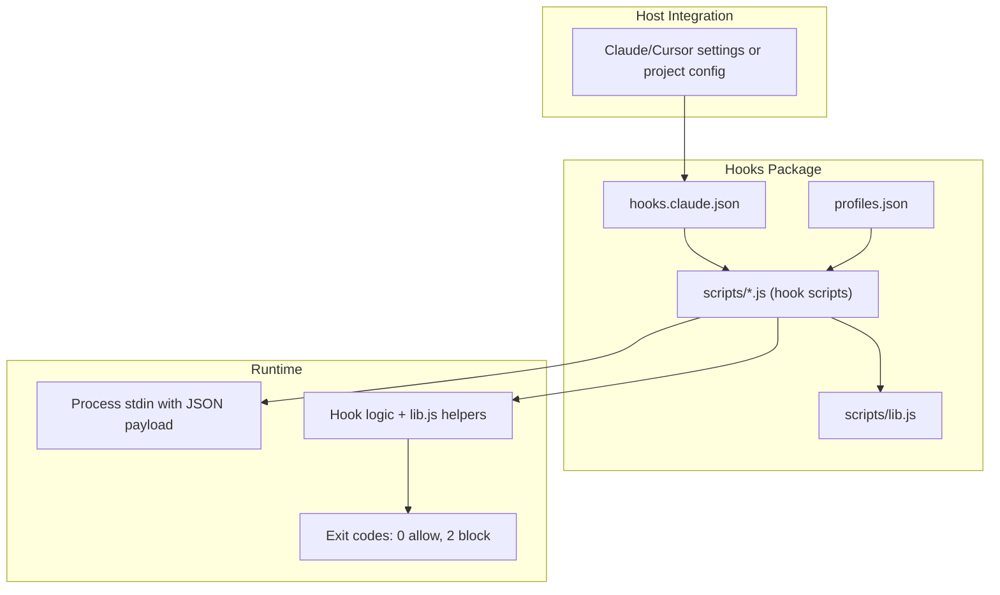
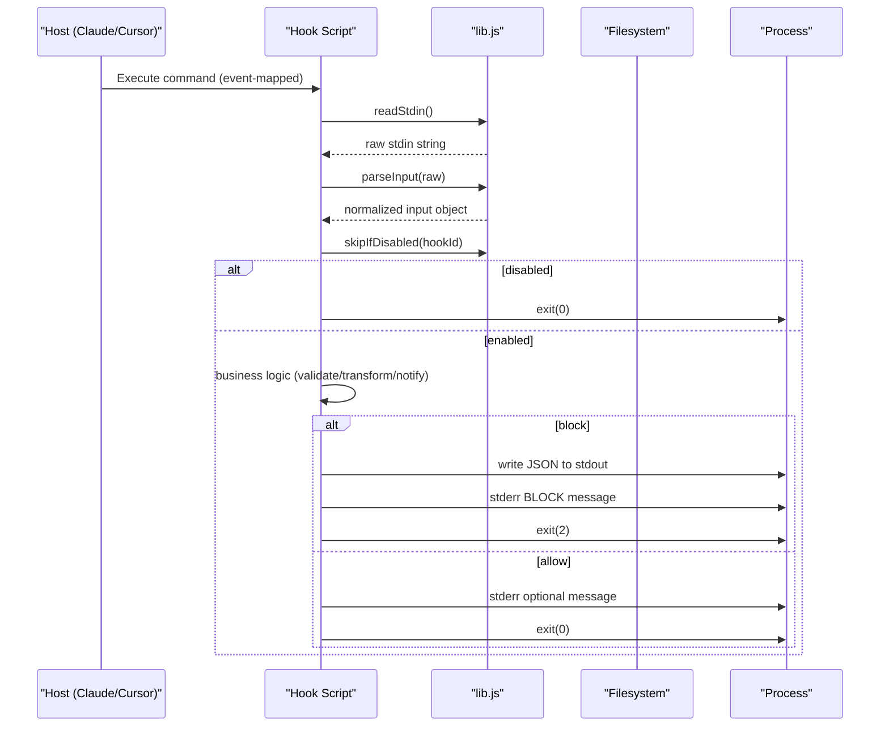
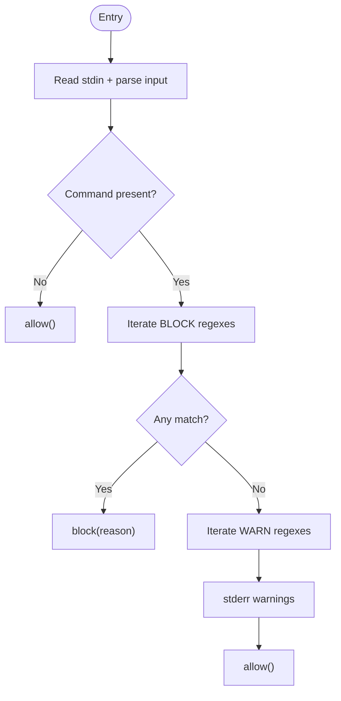
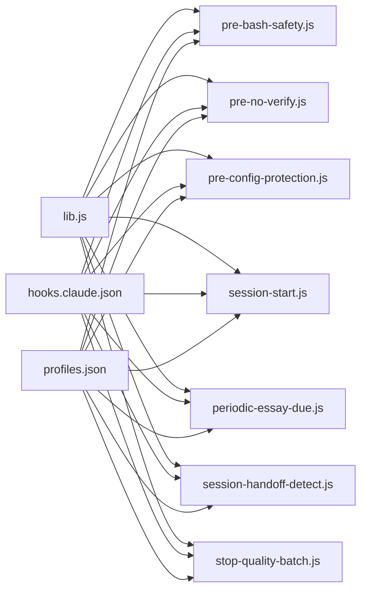

# Custom Hook Development

<cite>
**Referenced Files in This Document**
- [lib.js](file://fractal-agentic/hooks/scripts/lib.js)
- [pre-bash-safety.js](file://fractal-agentic/hooks/scripts/pre-bash-safety.js)
- [pre-no-verify.js](file://fractal-agentic/hooks/scripts/pre-no-verify.js)
- [pre-config-protection.js](file://fractal-agentic/hooks/scripts/pre-config-protection.js)
- [session-start.js](file://fractal-agentic/hooks/scripts/session-start.js)
- [periodic-essay-due.js](file://fractal-agentic/hooks/scripts/periodic-essay-due.js)
- [session-handoff-detect.js](file://fractal-agentic/hooks/scripts/session-handoff-detect.js)
- [stop-quality-batch.js](file://fractal-agentic/hooks/scripts/stop-quality-batch.js)
- [hooks.claude.json](file://fractal-agentic/hooks/hooks.claude.json)
- [profiles.json](file://fractal-agentic/hooks/profiles.json)
- [README.md](file://fractal-agentic/hooks/README.md)
- [install-hooks.sh](file://fractal-agentic/scripts/install-hooks.sh)
- [hooks.md](file://fractal-agentic/docs/hooks.md)
</cite>

## Table of Contents
1. Introduction
2. Project Structure
3. Core Components
4. Architecture Overview
5. Detailed Component Analysis
6. Dependency Analysis
7. Performance Considerations
8. Troubleshooting Guide
9. Conclusion
10. Appendices

## Introduction
This document explains how to create custom hook scripts for the Fractal Agentic hooks system. It covers the shared library functions, hook script structure, event payloads, return value conventions, error handling and logging patterns, common hook patterns (validation, transformation, notification), security considerations, performance optimization, testing methodologies, and compatibility guidance across AI coding platforms.

## Project Structure
The hooks package provides optional, host-portable Node.js scripts that run during lifecycle events such as PreToolUse, SessionStart, and Stop. The configuration maps host events to hook commands, while profiles control which hooks are enabled by default.

**Diagram sources**
- [hooks.claude.json:1-87](file://fractal-agentic/hooks/hooks.claude.json#L1-L87)
- [profiles.json:1-38](file://fractal-agentic/hooks/profiles.json#L1-L38)
- [lib.js:1-137](file://fractal-agentic/hooks/scripts/lib.js#L1-L137)

**Section sources**
- [README.md:1-124](file://fractal-agentic/hooks/README.md#L1-L124)
- [hooks.claude.json:1-87](file://fractal-agentic/hooks/hooks.claude.json#L1-L87)
- [profiles.json:1-38](file://fractal-agentic/hooks/profiles.json#L1-L38)

## Core Components
- Shared library (lib.js): Provides stdin reading, input parsing, root resolution, profile management, tool input/name extraction, and standardized I/O helpers (allow/block/warn).
- Hook scripts: Small, focused Node.js programs implementing specific behaviors (e.g., bash safety, config protection, session bootstrap, quality checks).
- Profiles: Define which hooks are active per environment via profiles.json and environment variables.
- Host mappings: hooks.claude.json maps host events to hook commands; install-hooks.sh materializes these into user/host configs.

Key responsibilities:
- Input normalization: Accept multiple field names for tool inputs and commands.
- Safety-first defaults: Block destructive actions unless explicitly allowed.
- Non-blocking doctrine: Hooks must not prevent product work when dependencies are missing.
- Portability: Resolve plugin root from environment or relative path.

**Section sources**
- [lib.js:1-137](file://fractal-agentic/hooks/scripts/lib.js#L1-L137)
- [profiles.json:1-38](file://fractal-agentic/hooks/profiles.json#L1-L38)
- [hooks.claude.json:1-87](file://fractal-agentic/hooks/hooks.claude.json#L1-L87)
- [README.md:1-124](file://fractal-agentic/hooks/README.md#L1-L124)

## Architecture Overview
The runtime flow is consistent across hooks:
1. Host invokes a command mapped from an event (PreToolUse, SessionStart, Stop).
2. Hook reads stdin, parses JSON payload, and uses lib.js helpers.
3. Hook decides to allow (exit 0), block (exit 2 with structured output), or warn-only.
4. Optional stdout payloads inform the host (e.g., systemMessage).

**Diagram sources**
- [hooks.claude.json:1-87](file://fractal-agentic/hooks/hooks.claude.json#L1-L87)
- [lib.js:1-137](file://fractal-agentic/hooks/scripts/lib.js#L1-L137)

## Detailed Component Analysis

### Shared Library (lib.js)
Provides core utilities used by all hooks:
- stdin processing: bounded reader and JSON parser with fallback.
- Root resolution: prefers FRACTAL_AGENTIC_ROOT; otherwise resolves from __dirname.
- Profile management: loads profiles.json, computes active profile, and evaluates hook enablement.
- Tool input/name extraction: flexible field name mapping for different hosts.
- I/O helpers: allow(), block(), warn(), skipIfDisabled().

Complexity and behavior:
- readStdin(): O(n) over input bytes with a hard cap to avoid memory issues.
- parseInput(): O(1) except JSON.parse cost; returns empty object on empty input.
- hookEnabled(): O(1) set lookup plus constant-time profile list check.

Error handling:
- Graceful fallbacks for missing files/env.
- Structured block output for host consumption.
- Consistent stderr logging prefix for visibility.

Performance:
- Minimal allocations, early exits, bounded stdin size.
- Avoid heavy operations in hot-path hooks.

Security:
- No network calls by default.
- Strict blocking rules enforced via exit code and structured output.

**Section sources**
- [lib.js:1-137](file://fractal-agentic/hooks/scripts/lib.js#L1-L137)

### Bash Safety Hook (pre-bash-safety.js)
Purpose: Prevent destructive shell commands (force-push, reset --hard, rm /, curl|sh, etc.) and warn on risky patterns like eval and chmod 777.

Flow:
- Read and parse stdin.
- Extract command using tool input helpers.
- If no command, allow immediately.
- Iterate BLOCK patterns; if matched, block with reason.
- Iterate WARN patterns; log warnings to stderr.
- Allow at the end.

**Diagram sources**
- [pre-bash-safety.js:1-42](file://fractal-agentic/hooks/scripts/pre-bash-safety.js#L1-L42)
- [lib.js:1-137](file://fractal-agentic/hooks/scripts/lib.js#L1-L137)

**Section sources**
- [pre-bash-safety.js:1-42](file://fractal-agentic/hooks/scripts/pre-bash-safety.js#L1-L42)

### No-Verify Guard (pre-no-verify.js)
Purpose: Block attempts to bypass git hooks (--no-verify, -n on commit, HUSKY=0).

Behavior:
- Parse input and extract command.
- Detect git commands with --no-verify or -n.
- Detect HUSKY=0 usage.
- Block with clear reasons; otherwise allow.

**Section sources**
- [pre-no-verify.js:1-30](file://fractal-agentic/hooks/scripts/pre-no-verify.js#L1-L30)

### Config Protection (pre-config-protection.js)
Purpose: Protect linter/formatter/tsconfig/editor config files from weakening edits.

Behavior:
- Extract file path from input.
- Match against protected basenames and regex patterns.
- Block writes to protected files with actionable messages.
- Otherwise allow.

**Section sources**
- [pre-config-protection.js:1-66](file://fractal-agentic/hooks/scripts/pre-config-protection.js#L1-L66)

### Session Bootstrap (session-start.js)
Purpose: Provide non-blocking session context and identity hints.

Behavior:
- Consume stdin.
- Optionally disabled via env flag.
- Build concise bootstrap text (bounded length).
- Write structured stdout (continue/systemMessage/hookSpecificOutput) and stderr warning.
- Always allow.

**Section sources**
- [session-start.js:1-65](file://fractal-agentic/hooks/scripts/session-start.js#L1-L65)

### Periodic Essay Due (periodic-essay-due.js)
Purpose: Mark scheduled essay work as due without starting agents or blocking sessions.

Behavior:
- Skip if runner script missing.
- Spawn a lightweight process to enqueue due items.
- On debug mode, log errors to stderr.
- Always allow.

**Section sources**
- [periodic-essay-due.js:1-32](file://fractal-agentic/hooks/scripts/periodic-essay-due.js#L1-L32)

### Handoff Detection (session-handoff-detect.js)
Purpose: Detect stale handoffs and provide smart continue context.

Behavior:
- Check existence and age of handoff file.
- Clean up stale entries.
- Parse frontmatter and plan state.
- Compose a summary and emit structured stdout + stderr.
- Always allow.

**Section sources**
- [session-handoff-detect.js:1-157](file://fractal-agentic/hooks/scripts/session-handoff-detect.js#L1-L157)

### Quality Batch on Stop (stop-quality-batch.js)
Purpose: Best-effort typecheck or check on session stop without blocking.

Behavior:
- Prefer package.json scripts (typecheck > check).
- Use pnpm if available; otherwise skip.
- Log warnings and truncated outputs.
- Always allow.

**Section sources**
- [stop-quality-batch.js:1-50](file://fractal-agentic/hooks/scripts/stop-quality-batch.js#L1-L50)

## Dependency Analysis
Hooks depend on lib.js for shared functionality and on environment variables for configuration. Host mappings define when hooks execute.

**Diagram sources**
- [lib.js:1-137](file://fractal-agentic/hooks/scripts/lib.js#L1-L137)
- [hooks.claude.json:1-87](file://fractal-agentic/hooks/hooks.claude.json#L1-L87)
- [profiles.json:1-38](file://fractal-agentic/hooks/profiles.json#L1-L38)

**Section sources**
- [hooks.claude.json:1-87](file://fractal-agentic/hooks/hooks.claude.json#L1-L87)
- [profiles.json:1-38](file://fractal-agentic/hooks/profiles.json#L1-L38)
- [lib.js:1-137](file://fractal-agentic/hooks/scripts/lib.js#L1-L137)

## Performance Considerations
- Keep hooks fast and deterministic; avoid heavy I/O or network calls.
- Use bounded stdin reading to prevent memory spikes.
- Prefer package scripts for quality checks; fall back gracefully when tools are missing.
- Minimize stdout writes; use stderr for diagnostics.
- Use timeouts where spawning child processes (as demonstrated by existing hooks).

[No sources needed since this section provides general guidance]

## Troubleshooting Guide
Common issues and resolutions:
- Hook does not run: Ensure host mapping exists and FRACTAL_AGENTIC_ROOT is set. Verify profiles include the hook ID.
- Hook blocks unexpectedly: Inspect stderr logs prefixed with [fractal-hooks]. Adjust patterns or temporarily disable via FRACTAL_DISABLED_HOOKS.
- Missing node or paths: install-hooks.sh falls back to project materialization; ensure absolute paths are resolved.
- Session bootstrap too verbose: Reduce max chars via environment variable or disable context injection.

Operational tips:
- Use install-hooks.sh --check to validate installation targets.
- Source env.sh to quickly apply environment changes.
- Restart the agent host after modifying settings.

**Section sources**
- [install-hooks.sh:1-380](file://fractal-agentic/scripts/install-hooks.sh#L1-L380)
- [hooks.md:1-128](file://fractal-agentic/docs/hooks.md#L1-L128)
- [README.md:1-124](file://fractal-agentic/hooks/README.md#L1-L124)

## Conclusion
Custom hooks extend the agent’s safety and productivity through small, composable scripts. By leveraging lib.js helpers, adhering to the allow/block conventions, and following the non-blocking doctrine, you can build robust validation, transformation, and notification hooks that remain portable across platforms.

[No sources needed since this section summarizes without analyzing specific files]

## Appendices

### Hook Script Structure and Event Payloads
- Entry: Node.js script under hooks/scripts/.
- Input: JSON via stdin; use parseInput() to normalize.
- Fields: tool_input/toolInput/params/args; tool_name/toolName/hook_event_name/event; command/cmd; file_path/filePath/path/file.
- Output:
  - Exit 0: allow (optionally stderr message).
  - Exit 2: block with structured JSON to stdout and stderr message.
  - Optional stdout: { continue, systemMessage, hookSpecificOutput } for informational payloads.

**Section sources**
- [lib.js:1-137](file://fractal-agentic/hooks/scripts/lib.js#L1-L137)
- [session-start.js:1-65](file://fractal-agentic/hooks/scripts/session-start.js#L1-L65)

### Return Value Conventions
- allow(message?): prints optional message to stderr and exits 0.
- block(reason): writes structured JSON to stdout, logs BLOCK to stderr, exits 2.
- warn(message): logs to stderr with [fractal-hooks] prefix.
- skipIfDisabled(hookId): exits 0 if disabled by profile or FRACTAL_DISABLED_HOOKS.

**Section sources**
- [lib.js:1-137](file://fractal-agentic/hooks/scripts/lib.js#L1-L137)

### Common Hook Patterns
- Validation: pre-bash-safety.js, pre-no-verify.js, pre-config-protection.js.
- Transformation: Not required; prefer minimal transformations to keep hooks fast.
- Notification: session-start.js, session-handoff-detect.js, periodic-essay-due.js.
- Best-effort quality: stop-quality-batch.js.

**Section sources**
- [pre-bash-safety.js:1-42](file://fractal-agentic/hooks/scripts/pre-bash-safety.js#L1-L42)
- [pre-no-verify.js:1-30](file://fractal-agentic/hooks/scripts/pre-no-verify.js#L1-L30)
- [pre-config-protection.js:1-66](file://fractal-agentic/hooks/scripts/pre-config-protection.js#L1-L66)
- [session-start.js:1-65](file://fractal-agentic/hooks/scripts/session-start.js#L1-L65)
- [session-handoff-detect.js:1-157](file://fractal-agentic/hooks/scripts/session-handoff-detect.js#L1-L157)
- [periodic-essay-due.js:1-32](file://fractal-agentic/hooks/scripts/periodic-essay-due.js#L1-L32)
- [stop-quality-batch.js:1-50](file://fractal-agentic/hooks/scripts/stop-quality-batch.js#L1-L50)

### Security Considerations
- Default posture: block irreversible harm (force-push, reset --hard, config sabotage, hook bypass).
- Validate and sanitize any external input; never trust stdin blindly.
- Avoid executing arbitrary code; rely on explicit patterns and safe invocations.
- Use least privilege and minimal filesystem access.

**Section sources**
- [README.md:1-124](file://fractal-agentic/hooks/README.md#L1-L124)
- [pre-bash-safety.js:1-42](file://fractal-agentic/hooks/scripts/pre-bash-safety.js#L1-L42)
- [pre-config-protection.js:1-66](file://fractal-agentic/hooks/scripts/pre-config-protection.js#L1-L66)

### Testing Methodologies
- Unit-style tests: Mock stdin and assert exit codes and stderr/stdout outputs.
- Integration tests: Run install-hooks.sh --check to verify target configurations.
- Scenario tests: Simulate host events by piping representative JSON payloads to hook scripts.
- Regression tests: Add new BLOCK/WARN patterns and verify they trigger expected outcomes.

[No sources needed since this section provides general guidance]

### Compatibility Across Platforms
- Host mappings: hooks.claude.json defines event-to-command mappings for Claude; similar mappings exist for Cursor.
- Environment: FRACTAL_AGENTIC_ROOT ensures portability; profiles.json controls activation.
- Installation: install-hooks.sh materializes absolute paths and merges settings safely.

**Section sources**
- [hooks.claude.json:1-87](file://fractal-agentic/hooks/hooks.claude.json#L1-L87)
- [profiles.json:1-38](file://fractal-agentic/hooks/profiles.json#L1-L38)
- [install-hooks.sh:1-380](file://fractal-agentic/scripts/install-hooks.sh#L1-L380)