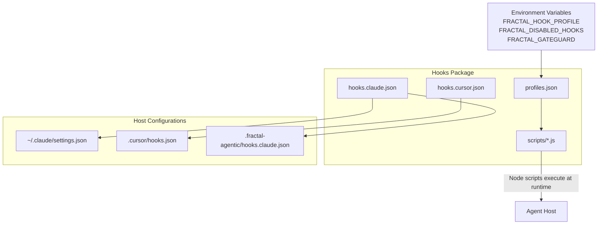
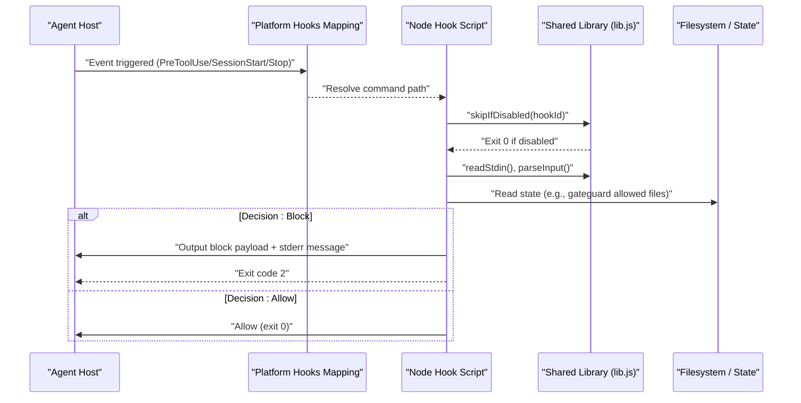
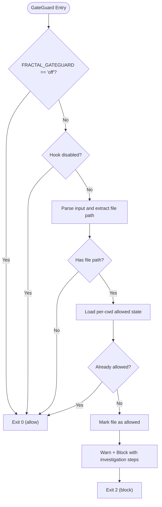
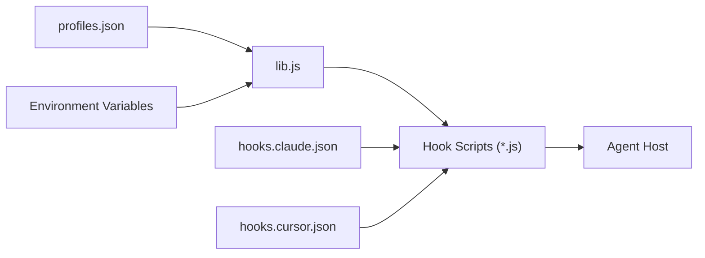

# Hook Configuration & Profiles

<cite>
**Referenced Files in This Document**
- [profiles.json](file://fractal-agentic/hooks/profiles.json)
- [hooks.claude.json](file://fractal-agentic/hooks/hooks.claude.json)
- [hooks.cursor.json](file://fractal-agentic/hooks/hooks.cursor.json)
- [lib.js](file://fractal-agentic/hooks/scripts/lib.js)
- [pre-gateguard.js](file://fractal-agentic/hooks/scripts/pre-gateguard.js)
- [pre-bash-safety.js](file://fractal-agentic/hooks/scripts/pre-bash-safety.js)
- [session-start.js](file://fractal-agentic/hooks/scripts/session-start.js)
- [install-hooks.sh](file://fractal-agentic/scripts/install-hooks.sh)
- [hooks.md](file://fractal-agentic/docs/hooks.md)
- [hooks README](file://fractal-agentic/hooks/README.md)
</cite>

## Table of Contents
1. [Introduction](#introduction)
2. [Project Structure](#project-structure)
3. [Core Components](#core-components)
4. [Architecture Overview](#architecture-overview)
5. [Detailed Component Analysis](#detailed-component-analysis)
6. [Dependency Analysis](#dependency-analysis)
7. [Performance Considerations](#performance-considerations)
8. [Troubleshooting Guide](#troubleshooting-guide)
9. [Conclusion](#conclusion)
10. [Appendices](#appendices)

## Introduction
This document explains how Fractal Agentic’s optional hooks are configured and managed through profiles, environment variables, and platform-specific configuration files for Claude Code and Cursor. It covers the three hook profiles (minimal, standard, strict), how to switch profiles, filter specific hooks by ID, and troubleshoot common issues. Security considerations and best practices are included to help you set up a safe, non-blocking hook system that protects against irreversible harm without blocking product work.

## Project Structure
The hooks feature is implemented as an optional plugin layer with:
- Profile definitions that select which hooks run per profile
- Platform-specific hook mappings for Claude Code and Cursor
- Shared Node scripts that implement hook logic and enforce decisions
- An installer script that materializes configuration into host settings or project directories

**Diagram sources**
- [profiles.json:1-38](file://fractal-agentic/hooks/profiles.json#L1-L38)
- [hooks.claude.json:1-87](file://fractal-agentic/hooks/hooks.claude.json#L1-L87)
- [hooks.cursor.json:1-48](file://fractal-agentic/hooks/hooks.cursor.json#L1-L48)
- [lib.js:1-137](file://fractal-agentic/hooks/scripts/lib.js#L1-L137)

**Section sources**
- [hooks README:1-124](file://fractal-agentic/hooks/README.md#L1-L124)
- [hooks.md:1-128](file://fractal-agentic/docs/hooks.md#L1-L128)

## Core Components
- Profile definitions: A JSON file defines the default profile and the list of hook IDs for each profile.
- Environment variables: Control active profile, disable specific hooks, and toggle strict behaviors like GateGuard.
- Platform mappings: Separate JSON files map host events to Node scripts for Claude Code and Cursor.
- Shared library: Provides utilities to read stdin, resolve plugin root, load profiles, determine active profile, check disabled hooks, and allow/block decisions.
- Installer: Writes configuration into user or project locations and materializes absolute paths for portability.

Key responsibilities:
- Minimal safety by default (block destructive commands, protect config, session bootstrap).
- Optional quality checks on stop (format/typecheck when tools exist, warn-only).
- Strict mode adds first-edit GateGuard to prompt fact-checking before editing critical files.

**Section sources**
- [profiles.json:1-38](file://fractal-agentic/hooks/profiles.json#L1-L38)
- [lib.js:1-137](file://fractal-agentic/hooks/scripts/lib.js#L1-L137)
- [hooks.claude.json:1-87](file://fractal-agentic/hooks/hooks.claude.json#L1-L87)
- [hooks.cursor.json:1-48](file://fractal-agentic/hooks/hooks.cursor.json#L1-L48)
- [install-hooks.sh:1-380](file://fractal-agentic/scripts/install-hooks.sh#L1-L380)

## Architecture Overview
At runtime, the agent host triggers lifecycle events (e.g., PreToolUse, SessionStart, Stop). The host reads its platform-specific hooks mapping and executes the corresponding Node scripts. Each script uses the shared library to:
- Determine if it should run based on the active profile and disabled hook list
- Parse input from stdin
- Decide whether to allow or block the action
- Optionally output structured messages back to the host

**Diagram sources**
- [hooks.claude.json:1-87](file://fractal-agentic/hooks/hooks.claude.json#L1-L87)
- [hooks.cursor.json:1-48](file://fractal-agentic/hooks/hooks.cursor.json#L1-L48)
- [lib.js:1-137](file://fractal-agentic/hooks/scripts/lib.js#L1-L137)
- [pre-gateguard.js:1-79](file://fractal-agentic/hooks/scripts/pre-gateguard.js#L1-L79)

## Detailed Component Analysis

### Profiles and Profile Switching
Profiles define which hook IDs are enabled. The default profile is minimal; users can switch via environment variable.

- Default profile: minimal
- Profiles:
  - minimal: pre:bash:safety, pre:bash:no-verify, pre:edit:config-protection, session:start, periodic:essay-due, session:handoff-detect, stop:session-ledger
  - standard: adds stop:quality-batch, stop:console-warn
  - strict: adds pre:edit:gateguard

Switching profiles:
- Set FRACTAL_HOOK_PROFILE=minimal|standard|strict
- The installer writes env.sh exporting FRACTAL_HOOK_PROFILE for convenience

Profile resolution logic:
- Active profile comes from environment variable, otherwise defaults to the value defined in profiles.json, then falls back to minimal.

**Section sources**
- [profiles.json:1-38](file://fractal-agentic/hooks/profiles.json#L1-L38)
- [lib.js:37-49](file://fractal-agentic/hooks/scripts/lib.js#L37-L49)
- [hooks.md:79-91](file://fractal-agentic/docs/hooks.md#L79-L91)
- [hooks README:14-28](file://fractal-agentic/hooks/README.md#L14-L28)

### Environment Variables
- FRACTAL_HOOK_PROFILE: Selects the active profile (minimal, standard, strict).
- FRACTAL_DISABLED_HOOKS: Comma-separated list of hook IDs to disable regardless of profile.
- FRACTAL_GATEGUARD: When set to off, disables the strict first-edit GateGuard behavior even in strict profile.
- FRACTAL_SESSION_START_MAX_CHARS: Limits the length of session start context text.
- FRACTAL_SESSION_START_CONTEXT: When off, skips session start context generation.

These variables are consumed by the shared library and individual scripts to control behavior at runtime.

**Section sources**
- [lib.js:46-66](file://fractal-agentic/hooks/scripts/lib.js#L46-L66)
- [pre-gateguard.js:47-49](file://fractal-agentic/hooks/scripts/pre-gateguard.js#L47-L49)
- [session-start.js:17-28](file://fractal-agentic/hooks/scripts/session-start.js#L17-L28)
- [hooks.md:87-91](file://fractal-agentic/docs/hooks.md#L87-L91)
- [hooks README:22-28](file://fractal-agentic/hooks/README.md#L22-L28)

### Platform-Specific Configuration Files

#### Claude Code Integration
- File: hooks.claude.json
- Maps host events (PreToolUse, SessionStart, Stop) to Node scripts with timeouts.
- Uses ${FRACTAL_AGENTIC_ROOT} placeholders expanded during installation to absolute paths.
- Can be merged into ~/.claude/settings.json or placed side-by-side as fractal-hooks.json.

Installation behavior:
- If existing hooks are present, the installer preserves them unless --force is used.
- Materializes absolute-path hooks under .fractal-agentic/hooks.claude.json for portability.

**Section sources**
- [hooks.claude.json:1-87](file://fractal-agentic/hooks/hooks.claude.json#L1-L87)
- [install-hooks.sh:162-277](file://fractal-agentic/scripts/install-hooks.sh#L162-L277)

#### Cursor Integration
- File: hooks.cursor.json
- Maps Cursor events (sessionStart, beforeShellExecution, afterFileEdit, stop) to Node scripts.
- Similar placeholder expansion and absolute path materialization as Claude.

**Section sources**
- [hooks.cursor.json:1-48](file://fractal-agentic/hooks/hooks.cursor.json#L1-L48)
- [install-hooks.sh:279-306](file://fractal-agentic/scripts/install-hooks.sh#L279-L306)

### Hook ID Filtering
Hook filtering allows disabling specific hooks regardless of profile.

- Use FRACTAL_DISABLED_HOOKS=hook-id-1,hook-id-2
- The shared library builds a set of disabled IDs and checks each hook before execution.
- Example IDs:
  - pre:bash:safety
  - stop:quality-batch
  - pre:edit:gateguard

Behavior:
- If a hook is disabled, the script exits immediately with success (no-op).

**Section sources**
- [lib.js:51-66](file://fractal-agentic/hooks/scripts/lib.js#L51-L66)
- [hooks.md:87-91](file://fractal-agentic/docs/hooks.md#L87-L91)
- [hooks README:22-28](file://fractal-agentic/hooks/README.md#L22-L28)

### Key Hook Scripts

#### Bash Safety (pre:bash:safety)
- Blocks high-risk shell patterns such as force-push, reset --hard, rm targeting root, and curl|sh/wget|sh.
- Warns on risky but allowed patterns like eval and chmod 777.
- Enforced in minimal+ profiles.

**Section sources**
- [pre-bash-safety.js:1-42](file://fractal-agentic/hooks/scripts/pre-bash-safety.js#L1-L42)

#### Session Start (session:start)
- Produces bounded context about plugin root, identity, startup router, boss playbook, and delivery guidance.
- Respects FRACTAL_SESSION_START_MAX_CHARS and FRACTAL_SESSION_START_CONTEXT.
- Outputs structured messages to hosts that support systemMessage-style payloads.

**Section sources**
- [session-start.js:1-65](file://fractal-agentic/hooks/scripts/session-start.js#L1-L65)

#### GateGuard (pre:edit:gateguard)
- First edit of a file triggers a deny with instructions to investigate importers, public APIs, data formats, and quote the user instruction.
- After acknowledging facts, subsequent edits are allowed within the session.
- Can be disabled globally via FRACTAL_GATEGUARD=off.

**Diagram sources**
- [pre-gateguard.js:1-79](file://fractal-agentic/hooks/scripts/pre-gateguard.js#L1-L79)

**Section sources**
- [pre-gateguard.js:1-79](file://fractal-agentic/hooks/scripts/pre-gateguard.js#L1-L79)

### Installation and Materialization
The installer script supports multiple targets:
- config: writes ~/.config/fractal-agentic/hooks.json and env.sh
- claude: merges hooks into ~/.claude/settings.json or writes side-by-side fractal-hooks.json
- cursor: writes <project>/.cursor/hooks.json
- project: materializes absolute-path hooks under <project>/.fractal-agentic/hooks.claude.json

It also validates presence (--check) and handles merge conflicts conservatively.

**Section sources**
- [install-hooks.sh:1-380](file://fractal-agentic/scripts/install-hooks.sh#L1-L380)

## Dependency Analysis
The hooks system has clear separation between configuration and runtime logic:
- profiles.json defines hook sets per profile
- lib.js centralizes profile resolution, disabled hook filtering, and I/O helpers
- Platform mappings (hooks.claude.json, hooks.cursor.json) connect host events to scripts
- Individual scripts implement domain-specific policies (bash safety, config protection, gateguard)

**Diagram sources**
- [profiles.json:1-38](file://fractal-agentic/hooks/profiles.json#L1-L38)
- [lib.js:1-137](file://fractal-agentic/hooks/scripts/lib.js#L1-L137)
- [hooks.claude.json:1-87](file://fractal-agentic/hooks/hooks.claude.json#L1-L87)
- [hooks.cursor.json:1-48](file://fractal-agentic/hooks/hooks.cursor.json#L1-L48)

**Section sources**
- [hooks README:1-124](file://fractal-agentic/hooks/README.md#L1-L124)

## Performance Considerations
- Hooks are lightweight Node scripts with bounded timeouts in host mappings.
- Session start context length is capped via FRACTAL_SESSION_START_MAX_CHARS to avoid large payloads.
- Disabled hooks exit early to minimize overhead.
- Quality checks on Stop are best-effort and only run when tools exist.

[No sources needed since this section provides general guidance]

## Troubleshooting Guide
Common issues and resolutions:
- Hooks not running:
  - Ensure FRACTAL_AGENTIC_ROOT points to the plugin directory.
  - Verify environment variables are exported or set in GUI app settings.
  - Restart the agent host after changes.
- Merge conflicts with existing hooks:
  - The installer preserves existing hooks; use --force to replace settings.hooks.
  - Side-by-side fractal-hooks.json is written when merging is unsafe.
- Profile not applied:
  - Confirm FRACTAL_HOOK_PROFILE is set correctly.
  - Check profiles.json default and ensure the profile name matches exactly.
- Specific hooks still running:
  - Add their IDs to FRACTAL_DISABLED_HOOKS.
- GateGuard blocking edits:
  - Follow the investigation steps and retry; subsequent edits will be allowed.
  - Disable with FRACTAL_GATEGUARD=off if necessary.

Verification:
- Use /hooks-status or install-hooks.sh --check to validate installation.

**Section sources**
- [install-hooks.sh:194-277](file://fractal-agentic/scripts/install-hooks.sh#L194-L277)
- [hooks.md:58-66](file://fractal-agentic/docs/hooks.md#L58-L66)
- [hooks README:72-91](file://fractal-agentic/hooks/README.md#L72-L91)

## Conclusion
Fractal Agentic’s hooks provide a flexible, optional safety layer that integrates with Claude Code and Cursor. Profiles let you choose the right balance of safety and productivity, while environment variables enable fine-grained control over behavior. By following best practices—keeping hooks non-blocking, using profile switching judiciously, and leveraging disabled hook filtering—you can maintain a secure development workflow without impeding product delivery.

[No sources needed since this section summarizes without analyzing specific files]

## Appendices

### Examples

- Profile switching:
  - Export FRACTAL_HOOK_PROFILE=standard to enable additional stop-time quality checks.
- Hook ID filtering:
  - Export FRACTAL_DISABLED_HOOKS=pre:bash:safety,stop:quality-batch to disable specific hooks.
- Disabling GateGuard:
  - Export FRACTAL_GATEGUARD=off to bypass first-edit fact-force in strict profile.

**Section sources**
- [hooks.md:87-91](file://fractal-agentic/docs/hooks.md#L87-L91)
- [hooks README:22-28](file://fractal-agentic/hooks/README.md#L22-L28)

### Security Considerations and Best Practices
- Keep hooks minimal by default; expand only as needed.
- Avoid adding hooks that require external tools to be present; they must not refuse product work.
- Prefer warn-only actions for quality checks; reserve blocking for irreversible harm.
- Use FRACTAL_DISABLED_HOOKS to temporarily disable problematic hooks during debugging.
- Regularly review installed hooks and profiles to ensure alignment with team policy.

[No sources needed since this section provides general guidance]