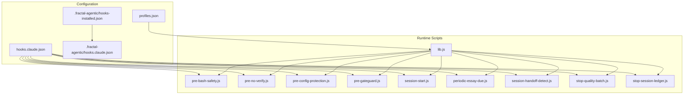
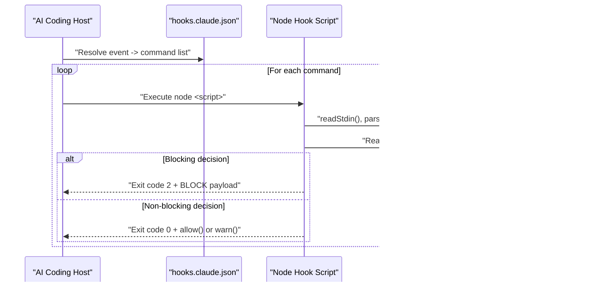
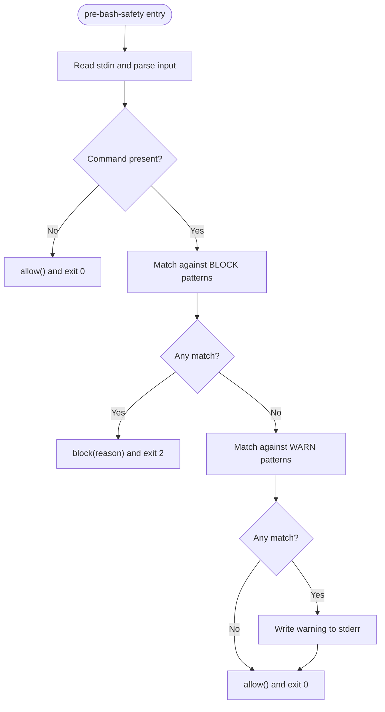
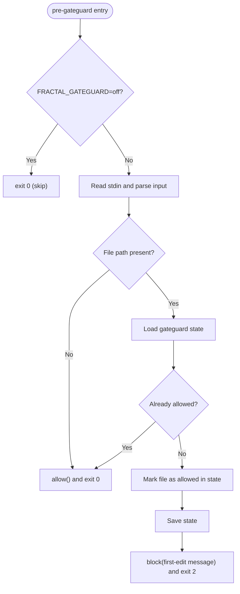
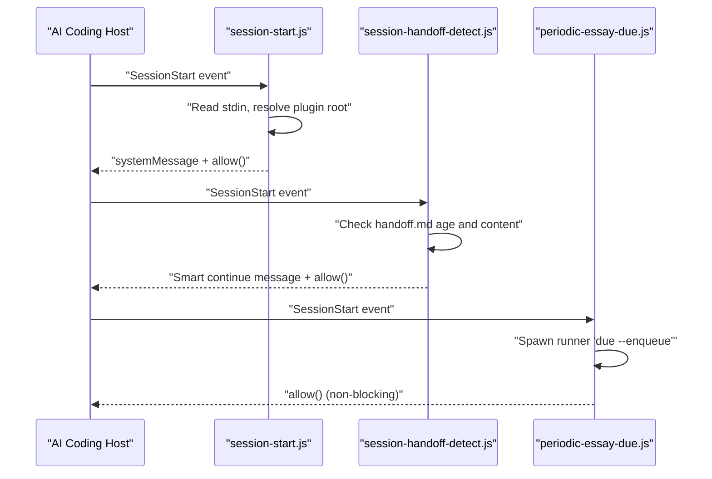
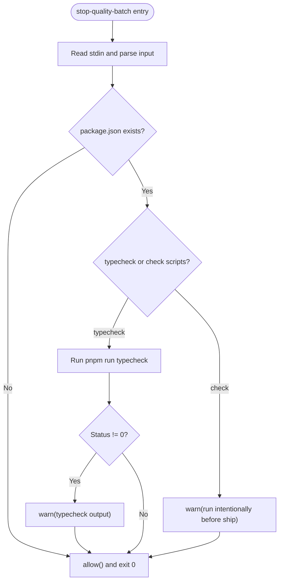
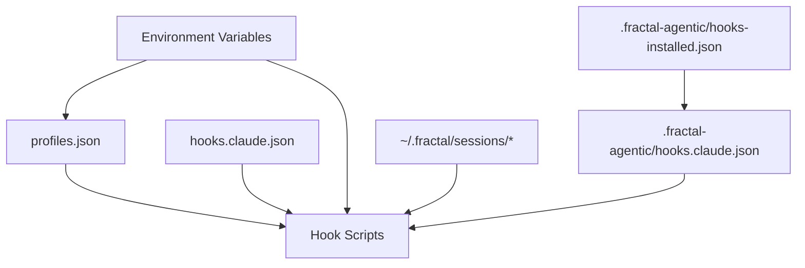

# Hook System & Lifecycle Management

<cite>
**Referenced Files in This Document**
- [hooks/README.md](file://fractal-agentic/hooks/README.md)
- [hooks/profiles.json](file://fractal-agentic/hooks/profiles.json)
- [hooks/hooks.claude.json](file://fractal-agentic/hooks/hooks.claude.json)
- [.fractal-agentic/hooks-installed.json](file://fractal-agentic/.fractal-agentic/hooks-installed.json)
- [.fractal-agentic/hooks.claude.json](file://fractal-agentic/.fractal-agentic/hooks.claude.json)
- [hooks/scripts/lib.js](file://fractal-agentic/hooks/scripts/lib.js)
- [hooks/scripts/pre-bash-safety.js](file://fractal-agentic/hooks/scripts/pre-bash-safety.js)
- [hooks/scripts/pre-no-verify.js](file://fractal-agentic/hooks/scripts/pre-no-verify.js)
- [hooks/scripts/pre-config-protection.js](file://fractal-agentic/hooks/scripts/pre-config-protection.js)
- [hooks/scripts/pre-gateguard.js](file://fractal-agentic/hooks/scripts/pre-gateguard.js)
- [hooks/scripts/session-start.js](file://fractal-agentic/hooks/scripts/session-start.js)
- [hooks/scripts/periodic-essay-due.js](file://fractal-agentic/hooks/scripts/periodic-essay-due.js)
- [hooks/scripts/session-handoff-detect.js](file://fractal-agentic/hooks/scripts/session-handoff-detect.js)
- [hooks/scripts/stop-quality-batch.js](file://fractal-agentic/hooks/scripts/stop-quality-batch.js)
- [hooks/scripts/stop-session-ledger.js](file://fractal-agentic/hooks/scripts/stop-session-ledger.js)
</cite>

## Table of Contents
1. [Introduction](#introduction)
2. [Project Structure](#project-structure)
3. [Core Components](#core-components)
4. [Architecture Overview](#architecture-overview)
5. [Detailed Component Analysis](#detailed-component-analysis)
6. [Dependency Analysis](#dependency-analysis)
7. [Performance Considerations](#performance-considerations)
8. [Troubleshooting Guide](#troubleshooting-guide)
9. [Conclusion](#conclusion)
10. [Appendices](#appendices)

## Introduction
This document explains the hook system that manages Git lifecycle events and session management for AI coding platforms. It covers pre-commit hooks, session start/end hooks, and quality gate hooks. You will learn how hooks are configured, how scripts are structured, what event data payloads look like, and how to develop custom hooks safely. The guide also includes integration notes for different hosts (Claude, Cursor), security considerations, performance optimization tips, testing strategies, and troubleshooting techniques.

The system is optional and designed to be non-blocking by default, only blocking irreversible harm or unsafe patterns. Profiles allow you to tune behavior from minimal safety to strict enforcement.

**Section sources**
- [hooks/README.md:1-124](file://fractal-agentic/hooks/README.md#L1-L124)

## Project Structure
The hook system lives under the fractal-agentic package with a clear separation between configuration files and executable scripts:

- Configuration:
  - profiles.json defines enabled hook IDs per profile (minimal, standard, strict).
  - hooks.claude.json maps host events (PreToolUse, SessionStart, Stop) to Node scripts with timeouts.
  - .fractal-agentic/hooks-installed.json records installation metadata (target, profile, plugin root, materialized config path).
  - .fractal-agentic/hooks.claude.json is the materialized version with absolute paths for the current environment.

- Scripts:
  - lib.js provides shared utilities for reading stdin, parsing inputs, resolving plugin root, profile resolution, and exit semantics (allow/block/warn).
  - Individual scripts implement specific hooks for Bash safety, no-verify protection, config protection, gateguard first-edit policy, session bootstrap, periodic essay due checks, handoff detection, stop-time quality batch, and session ledgering.

**Diagram sources**
- [hooks/profiles.json:1-38](file://fractal-agentic/hooks/profiles.json#L1-L38)
- [hooks/hooks.claude.json:1-87](file://fractal-agentic/hooks/hooks.claude.json#L1-L87)
- [.fractal-agentic/hooks-installed.json:1-9](file://fractal-agentic/.fractal-agentic/hooks-installed.json#L1-L9)
- [.fractal-agentic/hooks.claude.json:1-77](file://fractal-agentic/.fractal-agentic/hooks.claude.json#L1-L77)
- [hooks/scripts/lib.js:1-137](file://fractal-agentic/hooks/scripts/lib.js#L1-L137)

**Section sources**
- [hooks/README.md:30-96](file://fractal-agentic/hooks/README.md#L30-L96)
- [hooks/profiles.json:1-38](file://fractal-agentic/hooks/profiles.json#L1-L38)
- [hooks/hooks.claude.json:1-87](file://fractal-agentic/hooks/hooks.claude.json#L1-L87)
- [.fractal-agentic/hooks-installed.json:1-9](file://fractal-agentic/.fractal-agentic/hooks-installed.json#L1-L9)
- [.fractal-agentic/hooks.claude.json:1-77](file://fractal-agentic/.fractal-agentic/hooks.claude.json#L1-L77)

## Core Components
- Profile system:
  - profiles.json lists hook IDs per profile.
  - Active profile is resolved via FRACTAL_HOOK_PROFILE; disabled hooks via FRACTAL_DISABLED_HOOKS.
  - Default profile is minimal.

- Host event mapping:
  - hooks.claude.json maps PreToolUse, SessionStart, Stop events to Node commands with timeouts.
  - Materialized config (.fractal-agentic/hooks.claude.json) contains absolute paths for the current machine.

- Shared runtime library:
  - lib.js exposes helpers for input parsing, plugin root resolution, profile evaluation, and standardized exit codes (allow/block/warn).

- Hook scripts:
  - Each script implements a specific lifecycle check or action, using lib.js utilities and adhering to non-blocking principles unless explicitly blocking harmful actions.

**Section sources**
- [hooks/profiles.json:1-38](file://fractal-agentic/hooks/profiles.json#L1-L38)
- [hooks/hooks.claude.json:1-87](file://fractal-agentic/hooks/hooks.claude.json#L1-L87)
- [hooks/scripts/lib.js:1-137](file://fractal-agentic/hooks/scripts/lib.js#L1-L137)

## Architecture Overview
The hook system integrates with AI coding platforms through host-specific event mappings. When an event occurs (e.g., PreToolUse Bash, Write/Edit/MultiEdit, SessionStart, Stop), the host executes the corresponding Node script. Scripts read JSON input from stdin, evaluate policies, and return decisions via exit codes and stdout payloads.

**Diagram sources**
- [hooks/hooks.claude.json:1-87](file://fractal-agentic/hooks/hooks.claude.json#L1-L87)
- [hooks/scripts/lib.js:86-108](file://fractal-agentic/hooks/scripts/lib.js#L86-L108)

**Section sources**
- [hooks/README.md:1-28](file://fractal-agentic/hooks/README.md#L1-L28)
- [hooks/hooks.claude.json:1-87](file://fractal-agentic/hooks/hooks.claude.json#L1-L87)

## Detailed Component Analysis

### Pre-commit Hooks (Bash Safety and No-Verify Protection)
- pre-bash-safety.js:
  - Inspects Bash commands for destructive patterns (force-push, reset --hard, clean -fd, rm /, DROP DATABASE/SCHEMA, curl|sh, wget|sh).
  - Blocks high-risk commands; warns on eval and chmod 777.
  - Uses lib.js allow/block semantics and exits with appropriate codes.

- pre-no-verify.js:
  - Detects attempts to bypass git hooks (--no-verify, commit -n, HUSKY=0).
  - Blocks such attempts to ensure safety and quality checks run.

**Diagram sources**
- [hooks/scripts/pre-bash-safety.js:1-42](file://fractal-agentic/hooks/scripts/pre-bash-safety.js#L1-L42)
- [hooks/scripts/lib.js:86-112](file://fractal-agentic/hooks/scripts/lib.js#L86-L112)

**Section sources**
- [hooks/scripts/pre-bash-safety.js:1-42](file://fractal-agentic/hooks/scripts/pre-bash-safety.js#L1-L42)
- [hooks/scripts/pre-no-verify.js:1-30](file://fractal-agentic/hooks/scripts/pre-no-verify.js#L1-L30)
- [hooks/scripts/lib.js:1-137](file://fractal-agentic/hooks/scripts/lib.js#L1-L137)

### Edit/Write Hooks (Config Protection and GateGuard)
- pre-config-protection.js:
  - Protects common tooling configuration files (ESLint, Prettier, Biome, tsconfig, editorconfig, ruff, golangci).
  - Blocks edits to protected configs to prevent weakening lint/format/type settings.

- pre-gateguard.js:
  - Enforces a light “first edit” policy: denies the first edit of a file until the agent investigates impacts and retries.
  - Stores allowed state in a temp file keyed by cwd hash; can be disabled via FRACTAL_GATEGUARD=off.

**Diagram sources**
- [hooks/scripts/pre-gateguard.js:1-79](file://fractal-agentic/hooks/scripts/pre-gateguard.js#L1-L79)
- [hooks/scripts/lib.js:86-112](file://fractal-agentic/hooks/scripts/lib.js#L86-L112)

**Section sources**
- [hooks/scripts/pre-config-protection.js:1-66](file://fractal-agentic/hooks/scripts/pre-config-protection.js#L1-L66)
- [hooks/scripts/pre-gateguard.js:1-79](file://fractal-agentic/hooks/scripts/pre-gateguard.js#L1-L79)

### Session Start Hooks (Bootstrap, Handoff Detection, Periodic Essay Due)
- session-start.js:
  - Provides non-blocking bootstrap context (plugin root, identity, boss selection guidance).
  - Respects FRACTAL_SESSION_START_CONTEXT=off to skip context injection.
  - Outputs systemMessage-style JSON when supported and logs to stderr.

- session-handoff-detect.js:
  - Detects active handoff files under ~/.fractal/sessions/active/handoff.md.
  - Parses frontmatter and plan-state.json to summarize ongoing work.
  - Emits a smart continue message with sections (Working on, Decisions, Remaining, Notes).

- periodic-essay-due.js:
  - Checks scheduled essays via scripts/periodic-essay-runner.js with a short timeout.
  - Only marks due work; never starts an agent or blocks sessions.

**Diagram sources**
- [hooks/scripts/session-start.js:1-65](file://fractal-agentic/hooks/scripts/session-start.js#L1-L65)
- [hooks/scripts/session-handoff-detect.js:1-157](file://fractal-agentic/hooks/scripts/session-handoff-detect.js#L1-L157)
- [hooks/scripts/periodic-essay-due.js:1-32](file://fractal-agentic/hooks/scripts/periodic-essay-due.js#L1-L32)

**Section sources**
- [hooks/scripts/session-start.js:1-65](file://fractal-agentic/hooks/scripts/session-start.js#L1-L65)
- [hooks/scripts/session-handoff-detect.js:1-157](file://fractal-agentic/hooks/scripts/session-handoff-detect.js#L1-L157)
- [hooks/scripts/periodic-essay-due.js:1-32](file://fractal-agentic/hooks/scripts/periodic-essay-due.js#L1-L32)

### Stop Hooks (Quality Batch and Session Ledger)
- stop-quality-batch.js:
  - Best-effort typecheck or check execution via pnpm if available.
  - Warns on issues but never blocks Stop; avoids heavy CI-like runs.

- stop-session-ledger.js:
  - Appends a JSON line to ~/.fractal/sessions/ledger.jsonl summarizing session metadata (host, timestamp, boss, capability mode, summary).
  - Non-blocking and resilient to write failures.

**Diagram sources**
- [hooks/scripts/stop-quality-batch.js:1-50](file://fractal-agentic/hooks/scripts/stop-quality-batch.js#L1-L50)
- [hooks/scripts/stop-session-ledger.js:1-78](file://fractal-agentic/hooks/scripts/stop-session-ledger.js#L1-L78)

**Section sources**
- [hooks/scripts/stop-quality-batch.js:1-50](file://fractal-agentic/hooks/scripts/stop-quality-batch.js#L1-L50)
- [hooks/scripts/stop-session-ledger.js:1-78](file://fractal-agentic/hooks/scripts/stop-session-ledger.js#L1-L78)

## Dependency Analysis
Hooks rely on a small set of core dependencies and environment variables:

- Environment:
  - FRACTAL_AGENTIC_ROOT: resolves plugin root for script execution.
  - FRACTAL_HOOK_PROFILE: selects profile (minimal, standard, strict).
  - FRACTAL_DISABLED_HOOKS: comma-separated list of hook IDs to disable.
  - FRACTAL_SESSION_START_MAX_CHARS, FRACTAL_SESSION_START_CONTEXT: control session start behavior.
  - FRACTAL_GATEGUARD: toggles gateguard enforcement.
  - FRACTAL_ESSAY_HOOK_DEBUG: enables debug logging for essay checks.

- Filesystem:
  - profiles.json: profile definitions.
  - hooks.claude.json: host event-to-script mapping.
  - .fractal-agentic/hooks-installed.json: installation metadata.
  - .fractal-agentic/hooks.claude.json: materialized config with absolute paths.
  - ~/.fractal/sessions/*: handoff and ledger state.

**Diagram sources**
- [hooks/scripts/lib.js:29-66](file://fractal-agentic/hooks/scripts/lib.js#L29-L66)
- [hooks/profiles.json:1-38](file://fractal-agentic/hooks/profiles.json#L1-L38)
- [hooks/hooks.claude.json:1-87](file://fractal-agentic/hooks/hooks.claude.json#L1-L87)
- [.fractal-agentic/hooks-installed.json:1-9](file://fractal-agentic/.fractal-agentic/hooks-installed.json#L1-L9)
- [.fractal-agentic/hooks.claude.json:1-77](file://fractal-agentic/.fractal-agentic/hooks.claude.json#L1-L77)

**Section sources**
- [hooks/scripts/lib.js:1-137](file://fractal-agentic/hooks/scripts/lib.js#L1-L137)
- [hooks/profiles.json:1-38](file://fractal-agentic/hooks/profiles.json#L1-L38)
- [hooks/hooks.claude.json:1-87](file://fractal-agentic/hooks/hooks.claude.json#L1-L87)

## Performance Considerations
- Keep hooks fast and non-blocking:
  - Use short timeouts in host mappings (e.g., 5–10 seconds for most hooks; up to 120 seconds for quality batch).
  - Avoid heavy operations in Stop hooks; prefer warnings and best-effort checks.
  - Limit stdin size (lib.js enforces MAX_STDIN) to prevent memory pressure.

- Optimize file reads:
  - Cache frequently accessed files where safe (e.g., profiles.json).
  - Use existence checks before reading to avoid unnecessary IO.

- Reduce disk writes:
  - Batch writes (e.g., ledger.jsonl append) and handle errors gracefully.
  - Use temporary directories for transient state (gateguard state).

[No sources needed since this section provides general guidance]

## Troubleshooting Guide
Common issues and resolutions:

- Hooks not running:
  - Verify FRACTAL_AGENTIC_ROOT points to the correct plugin directory.
  - Ensure hooks.claude.json is merged into host settings or registered as plugin hooks.
  - Check .fractal-agentic/hooks-installed.json for target and profile consistency.

- Hook blocked unexpectedly:
  - Review block reasons printed to stderr and stdout payloads.
  - Temporarily disable specific hooks via FRACTAL_DISABLED_HOOKS for debugging.
  - For gateguard, set FRACTAL_GATEGUARD=off to bypass first-edit enforcement.

- Session start context missing:
  - Confirm FRACTAL_SESSION_START_CONTEXT is not set to off.
  - Validate SOUL.md, AGENTS.md, and docs/bosses/INDEX.md exist at plugin root.

- Quality batch not running:
  - Ensure pnpm is installed and typecheck/check scripts exist in package.json.
  - Inspect stderr warnings for output truncation limits.

- Handoff detection not working:
  - Check ~/.fractal/sessions/active/handoff.md and plan-state.json presence and freshness.
  - Validate frontmatter format and section headings.

- Debugging hooks:
  - Enable FRACTAL_ESSAY_HOOK_DEBUG=1 for essay-related diagnostics.
  - Use /hooks-status command or install-hooks.sh --check to verify installation.

**Section sources**
- [hooks/README.md:50-96](file://fractal-agentic/hooks/README.md#L50-L96)
- [hooks/scripts/lib.js:86-112](file://fractal-agentic/hooks/scripts/lib.js#L86-L112)
- [hooks/scripts/session-start.js:1-65](file://fractal-agentic/hooks/scripts/session-start.js#L1-L65)
- [hooks/scripts/stop-quality-batch.js:1-50](file://fractal-agentic/hooks/scripts/stop-quality-batch.js#L1-L50)
- [hooks/scripts/session-handoff-detect.js:1-157](file://fractal-agentic/hooks/scripts/session-handoff-detect.js#L1-L157)

## Conclusion
The hook system provides a robust, extensible framework for enforcing safety, quality, and continuity across AI coding workflows. By leveraging profiles, host event mappings, and lightweight Node scripts, teams can tailor hook behavior to their needs while maintaining non-blocking defaults. The design emphasizes security, performance, and portability across platforms, with clear debugging and troubleshooting pathways.

[No sources needed since this section summarizes without analyzing specific files]

## Appendices

### Hook Configuration Files
- profiles.json: Defines enabled hook IDs per profile.
- hooks.claude.json: Maps host events to Node commands with timeouts.
- .fractal-agentic/hooks-installed.json: Records installation metadata.
- .fractal-agentic/hooks.claude.json: Materialized config with absolute paths.

**Section sources**
- [hooks/profiles.json:1-38](file://fractal-agentic/hooks/profiles.json#L1-L38)
- [hooks/hooks.claude.json:1-87](file://fractal-agentic/hooks/hooks.claude.json#L1-L87)
- [.fractal-agentic/hooks-installed.json:1-9](file://fractal-agentic/.fractal-agentic/hooks-installed.json#L1-L9)
- [.fractal-agentic/hooks.claude.json:1-77](file://fractal-agentic/.fractal-agentic/hooks.claude.json#L1-L77)

### Script Structure and Event Data Payloads
- Input format: JSON parsed from stdin with fields like tool_input/toolInput/params/args, tool_name/toolName/hook_event_name/event, command/cmd, file_path/filePath/path/file.
- Output format: allow() exits with code 0; block() writes JSON payload with decision and reason, then exits with code 2.
- Warnings: Written to stderr with [fractal-hooks] prefix.

**Section sources**
- [hooks/scripts/lib.js:68-108](file://fractal-agentic/hooks/scripts/lib.js#L68-L108)

### Custom Hook Development Guidelines
- Follow non-blocking doctrine unless blocking irreversible harm.
- Use lib.js utilities for consistent behavior (readStdin, parseInput, pluginRoot, hookEnabled, allow, block, warn).
- Respect profiles and disabled hooks via environment variables.
- Implement timeouts and error handling to avoid hanging hosts.

**Section sources**
- [hooks/README.md:6-13](file://fractal-agentic/hooks/README.md#L6-L13)
- [hooks/scripts/lib.js:1-137](file://fractal-agentic/hooks/scripts/lib.js#L1-L137)

### Security Considerations
- Block destructive commands (force-push, reset --hard, clean -fd, rm /, DROP DATABASE/SCHEMA, curl|sh, wget|sh).
- Prevent hook bypass (--no-verify, HUSKY=0).
- Protect tooling configuration files from accidental weakening.
- Enforce first-edit investigation for sensitive files (gateguard).

**Section sources**
- [hooks/scripts/pre-bash-safety.js:1-42](file://fractal-agentic/hooks/scripts/pre-bash-safety.js#L1-L42)
- [hooks/scripts/pre-no-verify.js:1-30](file://fractal-agentic/hooks/scripts/pre-no-verify.js#L1-L30)
- [hooks/scripts/pre-config-protection.js:1-66](file://fractal-agentic/hooks/scripts/pre-config-protection.js#L1-L66)
- [hooks/scripts/pre-gateguard.js:1-79](file://fractal-agentic/hooks/scripts/pre-gateguard.js#L1-L79)

### Testing Strategies
- Unit test individual scripts with sample stdin payloads.
- Simulate host events by invoking scripts directly with controlled inputs.
- Validate profile resolution and disabled hooks via environment variables.
- Test filesystem interactions (handoff detection, ledger writing) with temporary directories.

**Section sources**
- [hooks/scripts/lib.js:1-137](file://fractal-agentic/hooks/scripts/lib.js#L1-L137)
- [hooks/scripts/session-handoff-detect.js:1-157](file://fractal-agentic/hooks/scripts/session-handoff-detect.js#L1-L157)
- [hooks/scripts/stop-session-ledger.js:1-78](file://fractal-agentic/hooks/scripts/stop-session-ledger.js#L1-L78)

### Integration with AI Coding Platforms
- Claude: Merge hooks.claude.json into settings or register as plugin hooks.
- Cursor: Use hooks.cursor.json mapping (if present) for project-level hooks.
- Environment setup: Source env.sh or configure GUI hosts with same environment variables.

**Section sources**
- [hooks/README.md:50-96](file://fractal-agentic/hooks/README.md#L50-L96)
- [hooks/hooks.claude.json:1-87](file://fractal-agentic/hooks/hooks.claude.json#L1-L87)