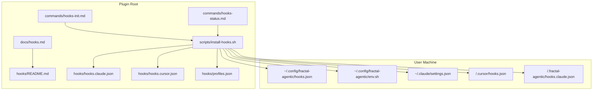
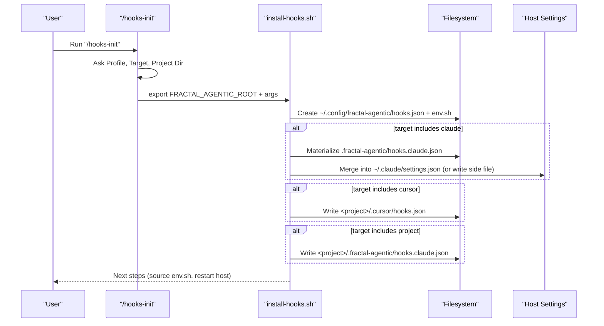
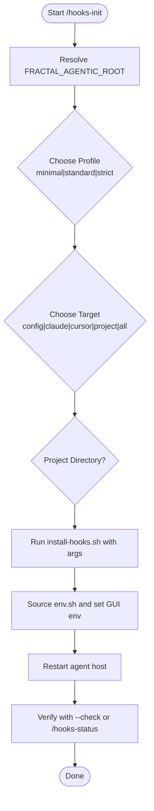
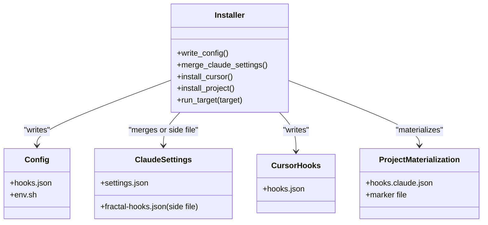
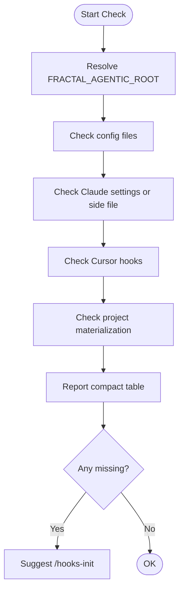
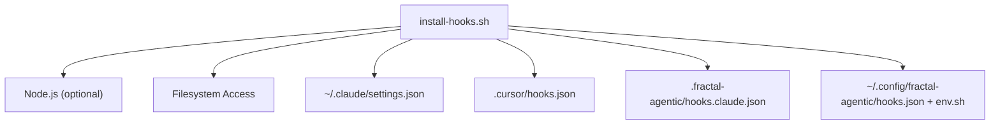

# Installation & Setup Guide

<cite>
**Referenced Files in This Document**
- [hooks-init.md](file://fractal-agentic/commands/hooks-init.md)
- [hooks-status.md](file://fractal-agentic/commands/hooks-status.md)
- [install-hooks.sh](file://fractal-agentic/scripts/install-hooks.sh)
- [hooks README](file://fractal-agentic/hooks/README.md)
- [hooks docs](file://fractal-agentic/docs/hooks.md)
- [hooks.claude.json](file://fractal-agentic/hooks/hooks.claude.json)
- [hooks.cursor.json](file://fractal-agentic/hooks/hooks.cursor.json)
- [profiles.json](file://fractal-agentic/hooks/profiles.json)
- [troubleshooting.md](file://fractal-agentic/docs/troubleshooting.md)
</cite>

## Table of Contents
1. [Introduction](#introduction)
2. [Project Structure](#project-structure)
3. [Core Components](#core-components)
4. [Architecture Overview](#architecture-overview)
5. [Detailed Component Analysis](#detailed-component-analysis)
6. [Dependency Analysis](#dependency-analysis)
7. [Performance Considerations](#performance-considerations)
8. [Troubleshooting Guide](#troubleshooting-guide)
9. [Conclusion](#conclusion)
10. [Appendices](#appendices)

## Introduction
This guide explains how to install and configure the optional Fractal Agentic hook system on your machine or project. Hooks are non-blocking safety and automation helpers that run around editor/host lifecycle events (e.g., before shell execution, on session start, on stop). They are optional: product work continues even if hooks are not installed.

You can use the recommended interactive command approach (/hooks-init) or perform a manual shell installation. You will also learn about target options (config, claude, cursor, project), environment variables (especially FRACTAL_AGENTIC_ROOT), verification steps (/hooks-status and --check), opt-out procedures, and cleanup.

## Project Structure
The hook system is implemented as an optional package under the plugin directory:
- Command definitions for user workflows: commands/hooks-init.md, commands/hooks-status.md
- Installer script: scripts/install-hooks.sh
- Hook definitions and profiles: hooks/README.md, hooks/*.json, hooks/profiles.json
- Documentation: docs/hooks.md, docs/troubleshooting.md

**Diagram sources**
- [install-hooks.sh:1-380](file://fractal-agentic/scripts/install-hooks.sh#L1-L380)
- [hooks README:1-124](file://fractal-agentic/hooks/README.md#L1-L124)
- [hooks.claude.json:1-87](file://fractal-agentic/hooks/hooks.claude.json#L1-L87)
- [hooks.cursor.json:1-48](file://fractal-agentic/hooks/hooks.cursor.json#L1-L48)
- [profiles.json:1-38](file://fractal-agentic/hooks/profiles.json#L1-L38)
- [hooks docs:1-128](file://fractal-agentic/docs/hooks.md#L1-L128)
- [hooks-init.md:1-63](file://fractal-agentic/commands/hooks-init.md#L1-L63)
- [hooks-status.md:1-40](file://fractal-agentic/commands/hooks-status.md#L1-L40)

**Section sources**
- [hooks-init.md:1-63](file://fractal-agentic/commands/hooks-init.md#L1-L63)
- [hooks-status.md:1-40](file://fractal-agentic/commands/hooks-status.md#L1-L40)
- [install-hooks.sh:1-380](file://fractal-agentic/scripts/install-hooks.sh#L1-L380)
- [hooks README:1-124](file://fractal-agentic/hooks/README.md#L1-L124)
- [hooks docs:1-128](file://fractal-agentic/docs/hooks.md#L1-L128)

## Core Components
- /hooks-init: Interactive setup flow guiding profile, target, and project directory selection, then invoking the installer.
- /hooks-status: Health check reporting which surfaces are installed and what profile is active.
- install-hooks.sh: The core installer/checker that writes configuration files and materializes host-specific hook mappings.
- Hook definitions:
  - hooks.claude.json: Claude-compatible event-to-script mapping.
  - hooks.cursor.json: Cursor-compatible event-to-script mapping.
  - profiles.json: Profiles (minimal, standard, strict) enumerating enabled hook IDs.
- Environment:
  - FRACTAL_AGENTIC_ROOT: Plugin root path used by hooks and installer.
  - FRACTAL_HOOK_PROFILE: Active profile controlling which hooks run.
  - FRACTAL_DISABLED_HOOKS: Comma-separated list of hook IDs to disable.
  - FRACTAL_GATEGUARD=off: Opt-out from strict first-edit fact-force behavior.

What each target installs:
- config: Writes ~/.config/fractal-agentic/hooks.json and env.sh snippet.
- claude: Merges into ~/.claude/settings.json when safe; otherwise writes a side file and project materialization.
- cursor: Writes <project>/.cursor/hooks.json with absolute paths.
- project: Materializes <project>/.fractal-agentic/hooks.claude.json with absolute paths and a marker.

**Section sources**
- [hooks-init.md:1-63](file://fractal-agentic/commands/hooks-init.md#L1-L63)
- [hooks-status.md:1-40](file://fractal-agentic/commands/hooks-status.md#L1-L40)
- [install-hooks.sh:1-380](file://fractal-agentic/scripts/install-hooks.sh#L1-L380)
- [hooks.claude.json:1-87](file://fractal-agentic/hooks/hooks.claude.json#L1-L87)
- [hooks.cursor.json:1-48](file://fractal-agentic/hooks/hooks.cursor.json#L1-L48)
- [profiles.json:1-38](file://fractal-agentic/hooks/profiles.json#L1-L38)
- [hooks README:1-124](file://fractal-agentic/hooks/README.md#L1-L124)
- [hooks docs:1-128](file://fractal-agentic/docs/hooks.md#L1-L128)

## Architecture Overview
The installer resolves the plugin root, validates inputs, and writes configuration and host-specific hook mappings. It supports both Node-based rewriting (for robust JSON manipulation) and shell fallbacks.

**Diagram sources**
- [hooks-init.md:1-63](file://fractal-agentic/commands/hooks-init.md#L1-L63)
- [install-hooks.sh:1-380](file://fractal-agentic/scripts/install-hooks.sh#L1-L380)
- [hooks.claude.json:1-87](file://fractal-agentic/hooks/hooks.claude.json#L1-L87)
- [hooks.cursor.json:1-48](file://fractal-agentic/hooks/hooks.cursor.json#L1-L48)

## Detailed Component Analysis

### Recommended Approach: /hooks-init
- Purpose: Interactive setup for optional session hooks (safety, config protection, SessionStart bootstrap).
- Steps:
  1. Confirm plugin root via resolve script or set FRACTAL_AGENTIC_ROOT.
  2. Choose profile (minimal | standard | strict) and target (config | claude | cursor | project | all).
  3. Provide project directory (default current workspace root).
  4. Execute installer with appropriate flags; offer --force for conservative merges.
  5. Source env.sh and restart agent host so hooks reload.
  6. Verify using --check or /hooks-status.
  7. Point users to docs and opt-out variables.

**Diagram sources**
- [hooks-init.md:1-63](file://fractal-agentic/commands/hooks-init.md#L1-L63)
- [install-hooks.sh:1-380](file://fractal-agentic/scripts/install-hooks.sh#L1-L380)

**Section sources**
- [hooks-init.md:1-63](file://fractal-agentic/commands/hooks-init.md#L1-L63)

### Manual Shell Installation
- Set FRACTAL_AGENTIC_ROOT to the plugin directory containing hooks and docs.
- Use install-hooks.sh with flags:
  - --target config: preferences only (~/.config/fractal-agentic/hooks.json + env.sh).
  - --target claude: merge into ~/.claude/settings.json when safe; else side file and project materialization.
  - --target cursor: write <project>/.cursor/hooks.json.
  - --target project: materialize <project>/.fractal-agentic/hooks.claude.json with absolute paths.
  - --target all: config + claude + cursor + project.
  - --profile minimal|standard|strict (default minimal).
  - --project-dir <path>: project root for targets requiring it.
  - --check: verify expected files/config without writing.
  - --force: overwrite managed Fractal hook block when merging settings.

After installation:
- Source ~/.config/fractal-agentic/env.sh (or add to shell rc).
- For GUI hosts, set FRACTAL_AGENTIC_ROOT and FRACTAL_HOOK_PROFILE in app environment.
- Restart the agent host so hooks reload.

**Section sources**
- [install-hooks.sh:1-380](file://fractal-agentic/scripts/install-hooks.sh#L1-L380)
- [hooks README:1-124](file://fractal-agentic/hooks/README.md#L1-L124)
- [hooks docs:1-128](file://fractal-agentic/docs/hooks.md#L1-L128)

### Target Options and File Locations
- config:
  - Writes ~/.config/fractal-agentic/hooks.json (version, profile, plugin_root, installed_at, targets).
  - Writes ~/.config/fractal-agentic/env.sh exporting FRACTAL_AGENTIC_ROOT and FRACTAL_HOOK_PROFILE.
- claude:
  - Attempts to merge into ~/.claude/settings.json; preserves existing non-Fractal hooks unless --force.
  - If merge is not possible, writes a side file fractal-hooks.json and materializes project hooks.
- cursor:
  - Writes <project>/.cursor/hooks.json with absolute node paths resolved from template.
- project:
  - Materializes <project>/.fractal-agentic/hooks.claude.json with absolute paths and a marker file.

**Diagram sources**
- [install-hooks.sh:130-335](file://fractal-agentic/scripts/install-hooks.sh#L130-L335)
- [hooks.claude.json:1-87](file://fractal-agentic/hooks/hooks.claude.json#L1-L87)
- [hooks.cursor.json:1-48](file://fractal-agentic/hooks/hooks.cursor.json#L1-L48)

**Section sources**
- [install-hooks.sh:130-335](file://fractal-agentic/scripts/install-hooks.sh#L130-L335)
- [hooks.claude.json:1-87](file://fractal-agentic/hooks/hooks.claude.json#L1-L87)
- [hooks.cursor.json:1-48](file://fractal-agentic/hooks/hooks.cursor.json#L1-L48)

### Environment Variables
- FRACTAL_AGENTIC_ROOT: Required plugin root path; auto-detected from script location if unset.
- FRACTAL_HOOK_PROFILE: Controls active profile (minimal | standard | strict).
- FRACTAL_DISABLED_HOOKS: Comma-separated hook IDs to disable at runtime.
- FRACTAL_GATEGUARD=off: Disables strict first-edit fact-force behavior.
- Additional controls:
  - FRACTAL_SESSION_START_MAX_CHARS: Limits session-start context size.
  - FRACTAL_SESSION_START_CONTEXT=off: Disables session-start context injection.

These variables are exported by env.sh and can be set in GUI apps’ environments.

**Section sources**
- [install-hooks.sh:152-157](file://fractal-agentic/scripts/install-hooks.sh#L152-L157)
- [hooks README:22-28](file://fractal-agentic/hooks/README.md#L22-L28)
- [hooks docs:87-91](file://fractal-agentic/docs/hooks.md#L87-L91)

### Verification Steps
- Using /hooks-status:
  - Reports status per surface (config, claude settings, cursor, project materialization), active profile, and FRACTAL_AGENTIC_ROOT value.
- Using install-hooks.sh --check:
  - Checks presence and validity of expected files/config without writing.
  - Returns non-zero exit code if expected installs are missing.

**Diagram sources**
- [hooks-status.md:1-40](file://fractal-agentic/commands/hooks-status.md#L1-L40)
- [install-hooks.sh:362-369](file://fractal-agentic/scripts/install-hooks.sh#L362-L369)

**Section sources**
- [hooks-status.md:1-40](file://fractal-agentic/commands/hooks-status.md#L1-L40)
- [install-hooks.sh:362-369](file://fractal-agentic/scripts/install-hooks.sh#L362-L369)

### Opt-Out Procedures and Cleanup
- Skip installation entirely: do not run /hooks-init or install-hooks.sh.
- Disable specific hooks: set FRACTAL_DISABLED_HOOKS with comma-separated hook IDs.
- Lower profile: switch to minimal or standard to reduce blocking behaviors.
- Disable strict gateguard: export FRACTAL_GATEGUARD=off.
- Reduce session-start noise: adjust FRACTAL_SESSION_START_MAX_CHARS or set FRACTAL_SESSION_START_CONTEXT=off.
- Cleanup:
  - Remove ~/.config/fractal-agentic/hooks.json and env.sh if you want to fully opt out.
  - Remove <project>/.cursor/hooks.json and <project>/.fractal-agentic/hooks.claude.json if you no longer need project-level hooks.
  - Revert changes to ~/.claude/settings.json manually if merged; or delete side file fractal-hooks.json.

**Section sources**
- [hooks README:93-96](file://fractal-agentic/hooks/README.md#L93-L96)
- [hooks docs:87-91](file://fractal-agentic/docs/hooks.md#L87-L91)
- [install-hooks.sh:252-263](file://fractal-agentic/scripts/install-hooks.sh#L252-L263)

## Dependency Analysis
The installer depends on:
- Node.js for robust JSON rewriting and merging (with shell fallback).
- Filesystem access to user config directories and project roots.
- Host settings files (Claude settings.json, Cursor hooks.json).

**Diagram sources**
- [install-hooks.sh:167-192](file://fractal-agentic/scripts/install-hooks.sh#L167-L192)
- [install-hooks.sh:217-264](file://fractal-agentic/scripts/install-hooks.sh#L217-L264)

**Section sources**
- [install-hooks.sh:167-192](file://fractal-agentic/scripts/install-hooks.sh#L167-L192)
- [install-hooks.sh:217-264](file://fractal-agentic/scripts/install-hooks.sh#L217-L264)

## Performance Considerations
- Hooks are designed to be lightweight and non-blocking.
- Minimal profile reduces overhead; standard adds quality checks; strict adds first-edit gating.
- Stop hooks like quality-batch and console-warn are best-effort and warn-only.
- Avoid enabling excessive hooks if performance is critical; prefer minimal profile in constrained environments.

[No sources needed since this section provides general guidance]

## Troubleshooting Guide
Common issues and resolutions:
- “Fractal Agentic not found”: Ensure FRACTAL_AGENTIC_ROOT points to the plugin directory containing plugin.json and required structure.
- Hooks do nothing: Host must register hooks; confirm FRACTAL_AGENTIC_ROOT is set and host supports lifecycle hooks.
- Every edit blocked (strict GateGuard): Export FRACTAL_GATEGUARD=off or lower profile to minimal/standard.
- Config edits blocked: Intentional for lint/tsconfig; disable pre:edit:config-protection via FRACTAL_DISABLED_HOOKS only if necessary.
- Force-push blocked: Intentional; get explicit user approval and disable safety hook only if required.
- SessionStart too noisy: Adjust FRACTAL_SESSION_START_MAX_CHARS or set FRACTAL_SESSION_START_CONTEXT=off.
- Hooks slow Stop: Use minimal profile; stop:quality-batch is standard+ only.

Verification:
- Use /hooks-status or install-hooks.sh --check to diagnose missing configurations.
- Review env.sh exports and ensure GUI apps have correct environment.

**Section sources**
- [troubleshooting.md:88-98](file://fractal-agentic/docs/troubleshooting.md#L88-L98)
- [hooks README:93-96](file://fractal-agentic/hooks/README.md#L93-L96)
- [hooks docs:87-91](file://fractal-agentic/docs/hooks.md#L87-L91)

## Conclusion
The Fractal Agentic hook system provides optional, non-blocking safety and automation across editor/host lifecycles. Use /hooks-init for guided setup or install-hooks.sh for manual control. Configure profiles and targets to match your needs, verify with /hooks-status or --check, and opt out or tune behavior via environment variables. Hooks are never required for delivery; they enhance safety and productivity when enabled.

[No sources needed since this section summarizes without analyzing specific files]

## Appendices

### Quick Reference: Commands and Flags
- /hooks-init: Interactive setup.
- /hooks-status: Health report.
- install-hooks.sh flags:
  - --target config|claude|cursor|project|all
  - --profile minimal|standard|strict
  - --project-dir <path>
  - --check
  - --force
  - --help

**Section sources**
- [hooks-init.md:1-63](file://fractal-agentic/commands/hooks-init.md#L1-L63)
- [hooks-status.md:1-40](file://fractal-agentic/commands/hooks-status.md#L1-L40)
- [install-hooks.sh:1-380](file://fractal-agentic/scripts/install-hooks.sh#L1-L380)