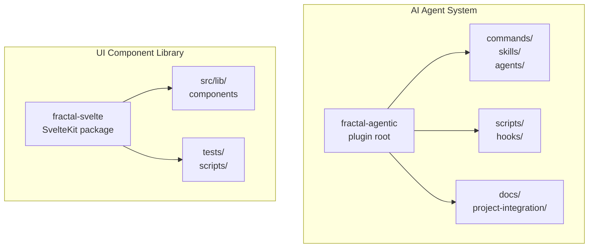
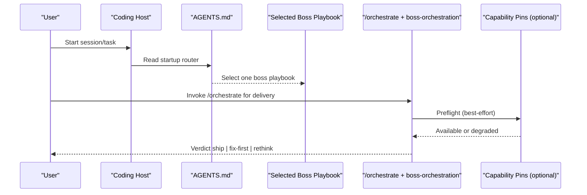
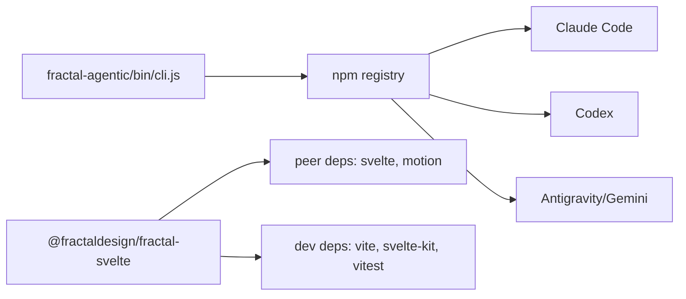

# Getting Started

<cite>
**Referenced Files in This Document**
- [README.md](file://fractal-agentic/README.md)
- [01-getting-started.md](file://fractal-agentic/docs/01-getting-started.md)
- [02-install.md](file://fractal-agentic/docs/02-install.md)
- [03-auto-use.md](file://fractal-agentic/docs/03-auto-use.md)
- [AGENTS.md](file://fractal-agentic/AGENTS.md)
- [TROUBLESHOOTING.md](file://fractal-agentic/TROUBLESHOOTING.md)
- [package.json](file://fractal-agentic/package.json)
- [install-agents.sh](file://fractal-agentic/scripts/install-agents.sh)
- [check-armory.sh](file://fractal-agentic/scripts/check-armory.sh)
- [AGENTS-SNIPPET.md](file://fractal-agentic/project-integration/AGENTS-SNIPPET.md)
- [package.json (Svelte)](file://fractal-svelte/package.json)
</cite>

## Table of Contents
1. Introduction
2. Project Structure
3. Core Components
4. Architecture Overview
5. Detailed Component Analysis
6. Dependency Analysis
7. Performance Considerations
8. Troubleshooting Guide
9. Conclusion

## Introduction
Fractal is a monorepo with two complementary parts:
- Fractal Agentic: an AI agent orchestration system that provides a one-boss discovery router, delivery runtime, and a vendored armory of skills, agents, and commands across multiple coding hosts.
- Fractal Svelte: a Svelte 5 component library offering animated UI primitives and agent-facing components for building modern interfaces.

This guide helps you install both sides, configure your environment, and run your first tasks or components quickly. It covers all supported platforms mentioned in the repository’s installation docs and quick start flows.

## Project Structure
At a high level:
- fractal-agentic: plugin root, CLI, host manifests, boss playbooks, skills, commands, hooks, scripts, and documentation.
- fractal-svelte: SvelteKit-based package with components, examples, tests, and build tooling.

**Section sources**
- [README.md](file://fractal-agentic/README.md)
- [package.json (Svelte)](file://fractal-svelte/package.json)

## Core Components
- Startup router and boss selection: AGENTS.md defines precedence, trivial exemption, and one-boss selection rules.
- Delivery runtime: boss-orchestration skill and /orchestrate command define contracts, lanes, and review verdicts.
- Capability pins: optional TOML templates for routine implementer, complex implementer, and fresh reviewer.
- Health and verification: check-armory.sh and verify.sh ensure assets are present and consistent.
- Project integration: AGENTS-SNIPPET.md enables auto-detection and non-blocking usage from any project.

**Section sources**
- [AGENTS.md](file://fractal-agentic/AGENTS.md)
- [01-getting-started.md](file://fractal-agentic/docs/01-getting-started.md)
- [02-install.md](file://fractal-agentic/docs/02-install.md)
- [03-auto-use.md](file://fractal-agentic/docs/03-auto-use.md)
- [install-agents.sh](file://fractal-agentic/scripts/install-agents.sh)
- [check-armory.sh](file://fractal-agentic/scripts/check-armory.sh)
- [AGENTS-SNIPPET.md](file://fractal-agentic/project-integration/AGENTS-SNIPPET.md)

## Architecture Overview
The agent system centers on a startup router that selects exactly one domain boss, then delegates to the orchestration runtime for delivery work. Optional capability pins improve quality but never block progress.

**Diagram sources**
- [AGENTS.md](file://fractal-agentic/AGENTS.md)
- [01-getting-started.md](file://fractal-agentic/docs/01-getting-started.md)
- [02-install.md](file://fractal-agentic/docs/02-install.md)

## Detailed Component Analysis

### AI Agent System Quick Start
- Install via NPX or host-specific marketplace commands.
- Point the host at the plugin root (FRACTAL_AGENTIC_ROOT).
- Paste the project mandate into your project’s AGENTS.md.
- Run a first delivery through /orchestrate after selecting a boss.

Key steps and references:
- Fast path: [Getting started](file://fractal-agentic/docs/01-getting-started.md)
- Full install matrix: [Install](file://fractal-agentic/docs/02-install.md)
- Auto-use mandate: [Auto-use](file://fractal-agentic/docs/03-auto-use.md)
- Startup router: [AGENTS.md](file://fractal-agentic/AGENTS.md)
- Project snippet: [AGENTS-SNIPPET.md](file://fractal-agentic/project-integration/AGENTS-SNIPPET.md)
- Health checks: [check-armory.sh](file://fractal-agentic/scripts/check-armory.sh), [verify.sh](file://fractal-agentic/scripts/verify.sh)

**Section sources**
- [01-getting-started.md](file://fractal-agentic/docs/01-getting-started.md)
- [02-install.md](file://fractal-agentic/docs/02-install.md)
- [03-auto-use.md](file://fractal-agentic/docs/03-auto-use.md)
- [AGENTS.md](file://fractal-agentic/AGENTS.md)
- [AGENTS-SNIPPET.md](file://fractal-agentic/project-integration/AGENTS-SNIPPET.md)
- [check-armory.sh](file://fractal-agentic/scripts/check-armory.sh)

### UI Component Library Quick Start
- The Svelte package exposes a set of motion and agent components with clear exports.
- Typical workflow: install dependencies, run dev server, import components, and build for distribution.

Key references:
- Package metadata and scripts: [package.json (Svelte)](file://fractal-svelte/package.json)

Typical flow:
- Install dependencies using your preferred package manager.
- Start development server and preview components.
- Import components from the published paths and integrate them into your app.
- Build and publish when ready.

[No sources needed since this section doesn't analyze specific files]

## Dependency Analysis
- Fractal Agentic exposes an npm bin entry for the CLI and includes host manifests for Claude Code, Codex, and Antigravity/Gemini.
- Fractal Svelte declares peer dependencies for Svelte 5 and motion libraries, plus dev tooling for build, lint, and test.

**Diagram sources**
- [package.json](file://fractal-agentic/package.json)
- [package.json (Svelte)](file://fractal-svelte/package.json)

**Section sources**
- [package.json](file://fractal-agentic/package.json)
- [package.json (Svelte)](file://fractal-svelte/package.json)

## Performance Considerations
- Prefer the shortest path to completion: use the startup router to select one boss and avoid loading extra playbooks.
- Capability pins are optional; degrade gracefully without blocking product work.
- For UI components, leverage the provided build pipeline and keep imports scoped to used components to minimize bundle size.

[No sources needed since this section provides general guidance]

## Troubleshooting Guide
Common issues and resolutions:
- Plugin not found: Set FRACTAL_AGENTIC_ROOT to the plugin directory containing plugin.json, AGENTS.md, docs/bosses/, and skills/boss-orchestration.
- Missing boss playbook: Refresh the plugin install; ensure progressive-discovery tree is complete.
- Wrong files or old armory: Confirm resolve prints the expected install path.
- Marketplace manifest missing (Codex): Include .agents/plugins in sparse checkout alongside plugin.
- Hooks do nothing: Ensure host registers hooks and FRACTAL_AGENTIC_ROOT is set.
- Skills not triggering: Ensure host skill discovery includes plugin/skills and frontmatter descriptions are present.

Quick health commands:
- Resolve plugin root and check armory health.
- Verify non-blocking policy and full suite.

References:
- [Troubleshooting](file://fractal-agentic/TROUBLESHOOTING.md)
- [Detailed troubleshooting](file://fractal-agentic/docs/troubleshooting.md)
- [Health scripts](file://fractal-agentic/scripts/check-armory.sh)

**Section sources**
- [TROUBLESHOOTING.md](file://fractal-agentic/TROUBLESHOOTING.md)
- [02-install.md](file://fractal-agentic/docs/02-install.md)
- [check-armory.sh](file://fractal-agentic/scripts/check-armory.sh)

## Conclusion
You now have the essentials to get started with both halves of Fractal:
- Use the AI agent system to orchestrate delivery with a single boss and a robust runtime, while keeping optional capabilities non-blocking.
- Adopt the Svelte component library to build expressive, animated UIs with a straightforward setup and clear exports.

For deeper customization, explore the boss playbooks, skills, and commands indexes, and consult the detailed guides for installation, auto-use, and troubleshooting.