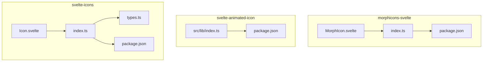
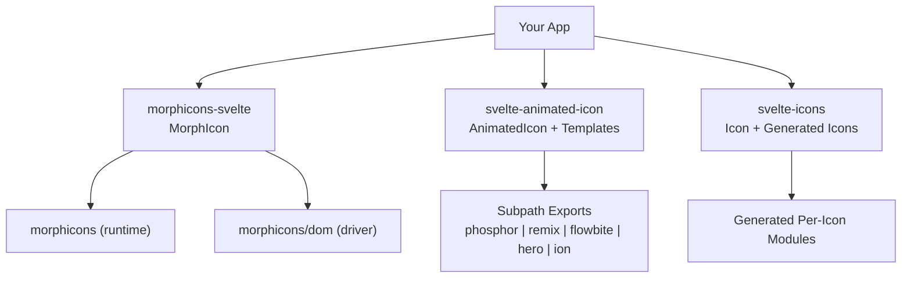
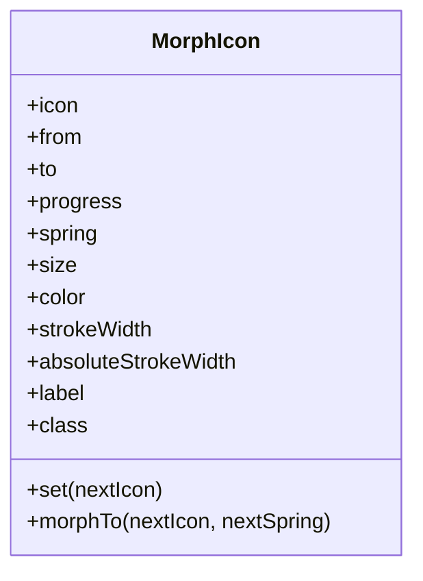
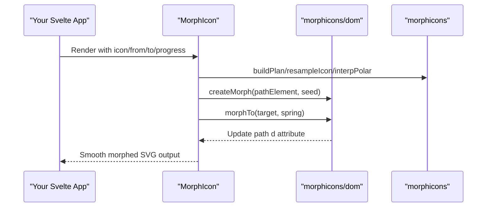
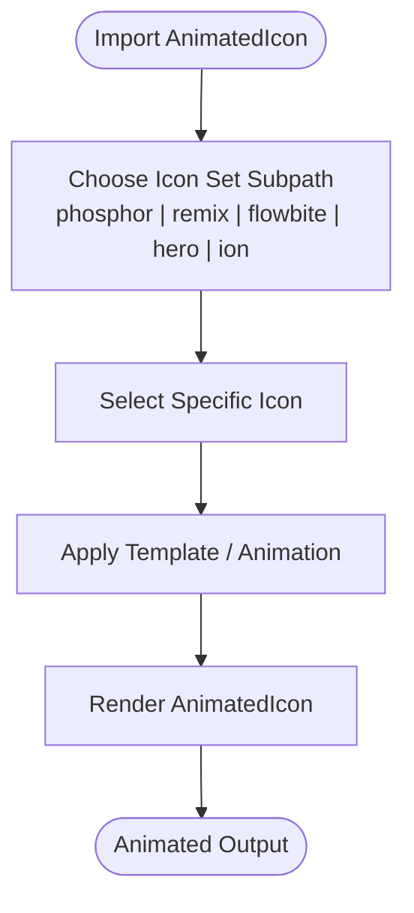
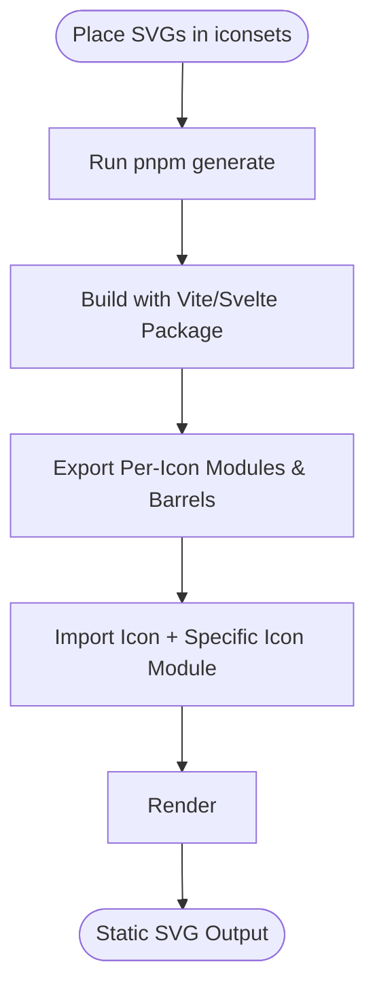
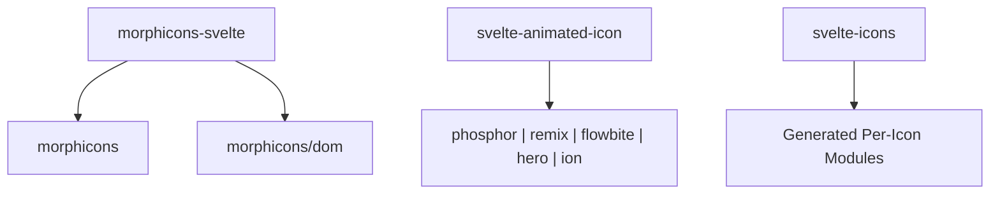

# Icon Systems

<cite>
**Referenced Files in This Document**
- [morphicons-svelte README](file://packages/morphicons-svelte/README.md)
- [MorphIcon.svelte](file://packages/morphicons-svelte/src/lib/MorphIcon.svelte)
- [morphicons-svelte index.ts](file://packages/morphicons-svelte/src/lib/index.ts)
- [morphicons-svelte package.json](file://packages/morphicons-svelte/package.json)
- [svelte-animated-icon README](file://packages/svelte-animated-icon/README.md)
- [svelte-animated-icon index.ts](file://packages/svelte-animated-icon/src/lib/index.ts)
- [svelte-animated-icon package.json](file://packages/svelte-animated-icon/package.json)
- [svelte-icons README](file://packages/svelte-icons/README.md)
- [Icon.svelte](file://packages/svelte-icons/src/lib/Icon.svelte)
- [svelte-icons index.ts](file://packages/svelte-icons/src/lib/index.ts)
- [svelte-icons types.ts](file://packages/svelte-icons/src/lib/types.ts)
- [svelte-icons package.json](file://packages/svelte-icons/package.json)
</cite>

## Table of Contents
1. [Introduction](#introduction)
2. [Project Structure](#project-structure)
3. [Core Components](#core-components)
4. [Architecture Overview](#architecture-overview)
5. [Detailed Component Analysis](#detailed-component-analysis)
6. [Dependency Analysis](#dependency-analysis)
7. [Performance Considerations](#performance-considerations)
8. [Troubleshooting Guide](#troubleshooting-guide)
9. [Conclusion](#conclusion)

## Introduction
This document explains the three icon systems in the monorepo:
- MorphIcons (animated icon components with morphing capabilities)
- Animated Icons (specialized animated icon library with multiple icon sets)
- Static Icons (performance-optimized static icon collection)

For each system, you will find installation instructions, usage patterns, customization options, animation triggers, size control, color theming, accessibility features, and performance considerations including tree-shaking and bundle optimization. Integration guidance with Svelte 5 and SvelteKit is included.

## Project Structure
The icon systems are organized as separate packages within the monorepo:
- morphicons-svelte: Svelte 5 bindings for morphicons with SSR-safe initial paths and a browser-owned morph driver after mount.
- svelte-animated-icon: A Svelte 5 animated icon library using the native Web Animations API with multiple icon sets exposed via subpath imports.
- svelte-icons: A Svelte 5 icon package generated from SVG folders producing tree-shakable modules per icon and per set barrel exports.

**Diagram sources**
- [morphicons-svelte index.ts:1-18](file://packages/morphicons-svelte/src/lib/index.ts#L1-L18)
- [morphicons-svelte package.json:1-59](file://packages/morphicons-svelte/package.json#L1-L59)
- [svelte-animated-icon index.ts:1-6](file://packages/svelte-animated-icon/src/lib/index.ts#L1-L6)
- [svelte-animated-icon package.json:1-90](file://packages/svelte-animated-icon/package.json#L1-L90)
- [svelte-icons index.ts:1-3](file://packages/svelte-icons/src/lib/index.ts#L1-L3)
- [svelte-icons types.ts:1-9](file://packages/svelte-icons/src/lib/types.ts#L1-L9)
- [svelte-icons package.json:1-85](file://packages/svelte-icons/package.json#L1-L85)

**Section sources**
- [morphicons-svelte README:1-69](file://packages/morphicons-svelte/README.md#L1-L69)
- [svelte-animated-icon README:1-26](file://packages/svelte-animated-icon/README.md#L1-L26)
- [svelte-icons README:1-118](file://packages/svelte-icons/README.md#L1-L118)

## Core Components
- MorphIcon: A Svelte component that renders an SVG path and drives morph animations between icons using morphicons. It supports both uncontrolled (reactive prop changes) and controlled (from/to/progress) modes, spring presets, stroke width control, and accessibility attributes.
- AnimatedIcon: The core animated icon component provided by svelte-animated-icon, exposing templates and utilities for animating icons across multiple icon sets via the Web Animations API.
- Icon: A lightweight static SVG renderer used by svelte-icons to render pre-generated icon data with sizing, title-based labeling, and currentColor theming.

Key props and behaviors:
- MorphIcon: icon, from, to, progress, spring, size, color, strokeWidth, absoluteStrokeWidth, label, class; methods set() and morphTo(); SSR-safe initial path; browser-owned morph driver post-mount.
- AnimatedIcon: exported via index with AnimatedIcon, TEMPLATES, TEMPLATE_IDS, getTemplate, clearProps; icon sets available through subpath imports.
- Icon: icon (data object), size, title, decorative; uses currentColor fill; accessible labeling via title and aria-labelledby.

**Section sources**
- [MorphIcon.svelte:1-232](file://packages/morphicons-svelte/src/lib/MorphIcon.svelte#L1-L232)
- [morphicons-svelte index.ts:1-18](file://packages/morphicons-svelte/src/lib/index.ts#L1-L18)
- [svelte-animated-icon index.ts:1-6](file://packages/svelte-animated-icon/src/lib/index.ts#L1-L6)
- [Icon.svelte:1-36](file://packages/svelte-icons/src/lib/Icon.svelte#L1-L36)
- [svelte-icons types.ts:1-9](file://packages/svelte-icons/src/lib/types.ts#L1-L9)

## Architecture Overview
Each package follows a consistent pattern: a small public entry re-exporting the main component(s) and types, with optional subpath exports for icon sets or specific components. Packaging is configured for Svelte 5 and modern bundlers, enabling tree-shaking and minimal runtime overhead.

**Diagram sources**
- [morphicons-svelte package.json:1-59](file://packages/morphicons-svelte/package.json#L1-L59)
- [svelte-animated-icon package.json:1-90](file://packages/svelte-animated-icon/package.json#L1-L90)
- [svelte-icons package.json:1-85](file://packages/svelte-icons/package.json#L1-L85)

## Detailed Component Analysis

### MorphIcons (morphicons-svelte)
MorphIcon provides animated morphing between SVG path definitions with robust SSR support and a browser-owned morph driver. It supports two primary usage modes:
- Uncontrolled mode: change the icon prop reactively; the component morphs automatically using spring presets or custom MorphOptions.
- Controlled mode: supply from, to, and progress to drive the morph precisely.

Accessibility and styling:
- Accepts label for semantic role and title; defaults to aria-hidden when decorative.
- Supports size, color, strokeWidth, and absoluteStrokeWidth for precise visual control.
- Integrates with Svelte 5 runes and effects for reactive updates.

Animation triggers:
- Declarative: update icon/from/to/progress props to trigger morphs.
- Imperative: call set() to immediately set an icon or morphTo() to animate to a new icon.

Installation and usage:
- Install via pnpm add morphicons-svelte.
- Import MorphIcon and pass either icon or from/to/progress pairs.
- Use built-in examples like MenuCloseIcon and PlayPauseIcon when applicable.

**Diagram sources**
- [MorphIcon.svelte:1-232](file://packages/morphicons-svelte/src/lib/MorphIcon.svelte#L1-L232)

**Diagram sources**
- [MorphIcon.svelte:1-232](file://packages/morphicons-svelte/src/lib/MorphIcon.svelte#L1-L232)

**Section sources**
- [morphicons-svelte README:1-69](file://packages/morphicons-svelte/README.md#L1-L69)
- [MorphIcon.svelte:1-232](file://packages/morphicons-svelte/src/lib/MorphIcon.svelte#L1-L232)
- [morphicons-svelte index.ts:1-18](file://packages/morphicons-svelte/src/lib/index.ts#L1-L18)
- [morphicons-svelte package.json:1-59](file://packages/morphicons-svelte/package.json#L1-L59)

### Animated Icons (svelte-animated-icon)
Svelte Animated Icon is a Svelte 5 library powered by the native Web Animations API. It exposes:
- AnimatedIcon component and template utilities (TEMPLATES, TEMPLATE_IDS, getTemplate, clearProps).
- Multiple icon sets via subpath imports: phosphor, remix, flowbite, hero, ion.

Installation and usage:
- Install via pnpm add svelte-animated-icon.
- Import AnimatedIcon and templates from the package root.
- Import icons from set-specific subpaths (e.g., svelte-animated-icon/phosphor).

Customization and animation:
- Leverage Web Animations API for performant, declarative animations without extra dependencies.
- Templates provide reusable animation patterns; use getTemplate to retrieve and apply animations.

Accessibility and theming:
- Icons can be themed via CSS color inheritance and styled through standard Svelte patterns.
- Ensure appropriate labels and roles where needed in your application context.

**Diagram sources**
- [svelte-animated-icon index.ts:1-6](file://packages/svelte-animated-icon/src/lib/index.ts#L1-L6)
- [svelte-animated-icon package.json:1-90](file://packages/svelte-animated-icon/package.json#L1-L90)

**Section sources**
- [svelte-animated-icon README:1-26](file://packages/svelte-animated-icon/README.md#L1-L26)
- [svelte-animated-icon index.ts:1-6](file://packages/svelte-animated-icon/src/lib/index.ts#L1-L6)
- [svelte-animated-icon package.json:1-90](file://packages/svelte-animated-icon/package.json#L1-L90)

### Static Icons (svelte-icons)
svelte-icons generates tree-shakable modules from SVG folders. You place SVG files under src/lib/iconsets/<set-name>/ and run the generator to produce per-icon modules and set barrels.

Installation and usage:
- Add SVGs to src/lib/iconsets/<set-name>/ and run pnpm generate.
- Import Icon from the package and import individual icons via set subpaths (e.g., svelte-icons/phosphor/house).
- Use the Icon component with icon data, size, and optional title for accessibility.

Customization and theming:
- Icons use currentColor fill, inheriting color from parent elements or CSS.
- Size accepts numbers or CSS units; hover and transitions can be applied directly to the Icon element.

Accessibility:
- Provide title for non-decorative icons; the component sets aria-labelledby accordingly.
- Decorative mode hides the icon from assistive technologies.

**Diagram sources**
- [svelte-icons README:1-118](file://packages/svelte-icons/README.md#L1-L118)
- [svelte-icons package.json:1-85](file://packages/svelte-icons/package.json#L1-L85)

**Section sources**
- [svelte-icons README:1-118](file://packages/svelte-icons/README.md#L1-L118)
- [Icon.svelte:1-36](file://packages/svelte-icons/src/lib/Icon.svelte#L1-L36)
- [svelte-icons index.ts:1-3](file://packages/svelte-icons/src/lib/index.ts#L1-L3)
- [svelte-icons types.ts:1-9](file://packages/svelte-icons/src/lib/types.ts#L1-L9)
- [svelte-icons package.json:1-85](file://packages/svelte-icons/package.json#L1-L85)

## Dependency Analysis
- morphicons-svelte depends on morphicons and morphicons/dom for path interpolation and DOM morphing. It declares sideEffects: false and exports only necessary modules to enable tree-shaking.
- svelte-animated-icon exposes subpath exports for multiple icon sets and relies on the Web Animations API, minimizing runtime dependencies.
- svelte-icons generates per-icon modules and uses wildcard exports to expose new sets automatically; it also declares sideEffects for CSS if present.

**Diagram sources**
- [morphicons-svelte package.json:1-59](file://packages/morphicons-svelte/package.json#L1-L59)
- [svelte-animated-icon package.json:1-90](file://packages/svelte-animated-icon/package.json#L1-L90)
- [svelte-icons package.json:1-85](file://packages/svelte-icons/package.json#L1-L85)

**Section sources**
- [morphicons-svelte package.json:1-59](file://packages/morphicons-svelte/package.json#L1-L59)
- [svelte-animated-icon package.json:1-90](file://packages/svelte-animated-icon/package.json#L1-L90)
- [svelte-icons package.json:1-85](file://packages/svelte-icons/package.json#L1-L85)

## Performance Considerations
- Tree-shaking:
  - morphicons-svelte: sideEffects: false and explicit exports ensure unused code is eliminated.
  - svelte-animated-icon: subpath imports allow importing only required icon sets and templates.
  - svelte-icons: per-icon subpath imports guarantee only selected icons are bundled.
- Bundle size optimization:
  - Prefer importing specific icons rather than entire sets.
  - Avoid importing unused templates or icon sets in svelte-animated-icon.
  - For morphicons-svelte, avoid passing large icon datasets unless needed; leverage built-in examples when possible.
- Rendering efficiency:
  - MorphIcon uses a browser-owned morph driver post-mount, reducing hydration-time DOM replacement and allowing interruption/retargeting of transitions.
  - Static icons render pure SVG with no animation overhead, ideal for high-frequency lists or performance-critical UIs.
- Accessibility and UX:
  - Use label/title appropriately to balance semantics and performance; decorative icons should be hidden from assistive tech.

[No sources needed since this section provides general guidance]

## Troubleshooting Guide
- SSR hydration mismatches:
  - Ensure MorphIcon receives valid initial icon data so the SSR path matches the client’s initial state. The component computes initialD based on icon/from/to/progress to avoid mismatches.
- Animation not triggering:
  - In uncontrolled mode, verify that the icon prop changes; in controlled mode, ensure from/to/progress are updated correctly.
  - Check that the morph driver is created after mount; calling morphTo before mount may require seeding via set().
- Color not applying:
  - For static icons, confirm that currentColor inheritance is active and parent elements define color.
  - For MorphIcon, verify color prop or CSS overrides are applied to the SVG stroke.
- Accessibility issues:
  - Provide title for non-decorative icons; set decorative mode for purely decorative visuals to hide from screen readers.

**Section sources**
- [MorphIcon.svelte:1-232](file://packages/morphicons-svelte/src/lib/MorphIcon.svelte#L1-L232)
- [Icon.svelte:1-36](file://packages/svelte-icons/src/lib/Icon.svelte#L1-L36)

## Conclusion
The monorepo offers three complementary icon systems tailored for different needs:
- MorphIcons for rich, animated morphing with SSR safety and flexible control.
- Animated Icons for multi-set, Web Animations API-driven animations with template-based patterns.
- Static Icons for maximum performance and simplicity with tree-shakable, per-icon modules.

Adopt the system that best fits your UX goals and performance requirements, leveraging their respective strengths in animation, theming, accessibility, and bundle optimization.