# Agent Components

<cite>
**Referenced Files in This Document**
- [package.json](file://packages/fractal-svelte/package.json)
- [index.ts](file://packages/fractal-svelte/src/lib/index.ts)
- [agents/index.ts](file://packages/fractal-svelte/src/lib/components/agents/index.ts)
- [message/index.ts](file://packages/fractal-svelte/src/lib/components/agents/message/index.ts)
- [message-bubble/index.ts](file://packages/fractal-svelte/src/lib/components/agents/message-bubble/index.ts)
- [message-scroller/index.ts](file://packages/fractal-svelte/src/lib/components/agents/message-scroller/index.ts)
- [ai-sidebar/index.ts](file://packages/fractal-svelte/src/lib/components/agents/ai-sidebar/index.ts)
- [prompt-input/index.ts](file://packages/fractal-svelte/src/lib/components/agents/prompt-input/index.ts)
- [streaming-response/index.ts](file://packages/fractal-svelte/src/lib/components/agents/streaming-response/index.ts)
- [approval-card/index.ts](file://packages/fractal-svelte/src/lib/components/agents/approval-card/index.ts)
- [file-diff/index.ts](file://packages/fractal-svelte/src/lib/components/agents/file-diff/index.ts)
- [todo-list/index.ts](file://packages/fractal-svelte/src/lib/components/agents/todo-list/index.ts)
</cite>

## Table of Contents
1. [Introduction](#introduction)
2. [Project Structure](#project-structure)
3. [Core Components](#core-components)
4. [Architecture Overview](#architecture-overview)
5. [Detailed Component Analysis](#detailed-component-analysis)
6. [Dependency Analysis](#dependency-analysis)
7. [Performance Considerations](#performance-considerations)
8. [Troubleshooting Guide](#troubleshooting-guide)
9. [Conclusion](#conclusion)
10. [Appendices](#appendices)

## Introduction
This document provides comprehensive documentation for AI agent interaction components designed for chat interfaces and real-time communication. It covers Message components (Message, MessageBubble, MessageScroller), AiSidebar for navigation and context management, StreamingResponse for live content updates, PromptInput for user input handling, ApprovalCard for decision workflows, FileDiff for code comparison, TodoList for task management, and FeedbackWidget for user feedback. The guide explains context management, state synchronization, real-time updates, accessibility considerations, and includes examples for chat interface implementation, streaming content rendering, and multi-agent conversation patterns.

## Project Structure
The agent components are part of the fractal-svelte package and are organized under src/lib/components/agents. The package exposes these components via a public API through index files and exports them from the main library entry point.

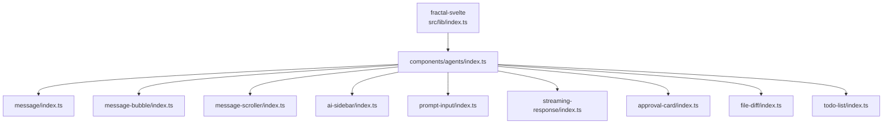

**Diagram sources**
- [index.ts:1-6](file://packages/fractal-svelte/src/lib/index.ts#L1-L6)
- [agents/index.ts:1-10](file://packages/fractal-svelte/src/lib/components/agents/index.ts#L1-L10)

**Section sources**
- [package.json:1-245](file://packages/fractal-svelte/package.json#L1-L245)
- [index.ts:1-6](file://packages/fractal-svelte/src/lib/index.ts#L1-L6)
- [agents/index.ts:1-10](file://packages/fractal-svelte/src/lib/components/agents/index.ts#L1-L10)

## Core Components
The agents module exports a cohesive set of components to build AI-driven chat experiences:

- Message family: Message, MessageGroup, MessageAvatar, MessageContent, MessageHeader, MessageFooter, MessageMarker, MessageTyping, plus re-exports of MessageBubble variants and MessageScroller.
- MessageBubble family: MessageBubble, MessageBubbleContent, MessageBubbleGroup, MessageBubbleCollapsible with variant and alignment types.
- MessageScroller: scrollable container optimized for message lists.
- AiSidebar: navigation and context panel for agent resources and actions.
- PromptInput: user input field with model and action typing support.
- StreamingResponse: live content renderer with status and feedback types.
- ApprovalCard: decision workflow UI with typed options and answers.
- FileDiff: code diff viewer with typed line and status models.
- TodoList: task list with typed items and statuses.

These components are exported from their respective index files and re-exported centrally for easy consumption.

**Section sources**
- [message/index.ts:1-17](file://packages/fractal-svelte/src/lib/components/agents/message/index.ts#L1-L17)
- [message-bubble/index.ts:1-6](file://packages/fractal-svelte/src/lib/components/agents/message-bubble/index.ts#L1-L6)
- [message-scroller/index.ts:1-2](file://packages/fractal-svelte/src/lib/components/agents/message-scroller/index.ts#L1-L2)
- [ai-sidebar/index.ts:1-8](file://packages/fractal-svelte/src/lib/components/agents/ai-sidebar/index.ts#L1-L8)
- [prompt-input/index.ts:1-3](file://packages/fractal-svelte/src/lib/components/agents/prompt-input/index.ts#L1-L3)
- [streaming-response/index.ts:1-7](file://packages/fractal-svelte/src/lib/components/agents/streaming-response/index.ts#L1-L7)
- [approval-card/index.ts:1-9](file://packages/fractal-svelte/src/lib/components/agents/approval-card/index.ts#L1-L9)
- [file-diff/index.ts:1-3](file://packages/fractal-svelte/src/lib/components/agents/file-diff/index.ts#L1-L3)
- [todo-list/index.ts:1-3](file://packages/fractal-svelte/src/lib/components/agents/todo-list/index.ts#L1-L3)

## Architecture Overview
The agent components follow a modular architecture where each feature is encapsulated in its own directory with an index file exporting the component and related types. The central agents index aggregates these exports, enabling consumers to import only what they need.

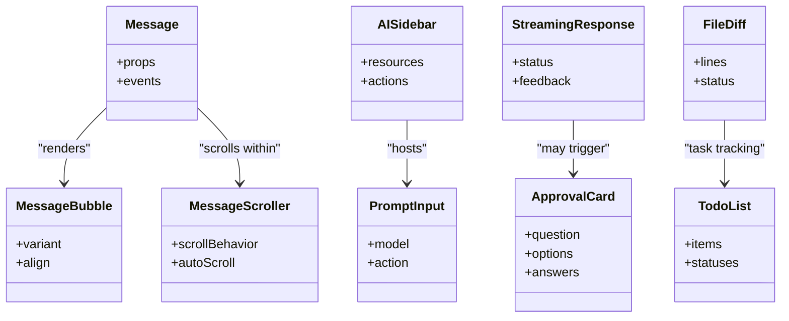

[No sources needed since this diagram shows conceptual relationships]

## Detailed Component Analysis

### Message Components
The Message family provides a rich composition model for chat messages. It includes avatar, header, content, footer, marker, and typing indicators, along with bubble variants and grouping utilities.

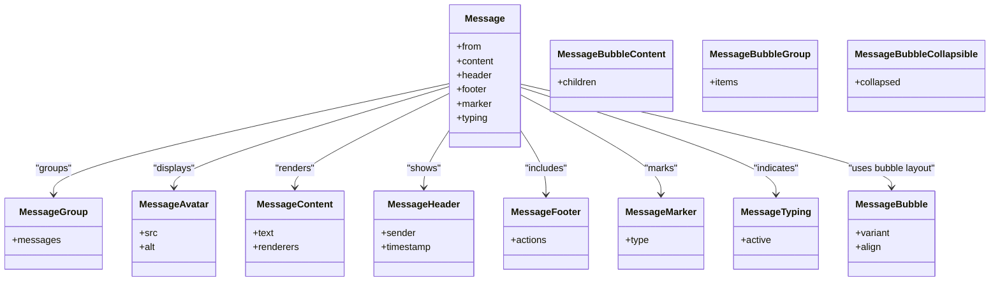

**Diagram sources**
- [message/index.ts:1-17](file://packages/fractal-svelte/src/lib/components/agents/message/index.ts#L1-L17)
- [message-bubble/index.ts:1-6](file://packages/fractal-svelte/src/lib/components/agents/message-bubble/index.ts#L1-L6)

**Section sources**
- [message/index.ts:1-17](file://packages/fractal-svelte/src/lib/components/agents/message/index.ts#L1-L17)
- [message-bubble/index.ts:1-6](file://packages/fractal-svelte/src/lib/components/agents/message-bubble/index.ts#L1-L6)

### MessageScroller
MessageScroller provides efficient scrolling behavior for long message lists, supporting auto-scroll and custom scroll behaviors.

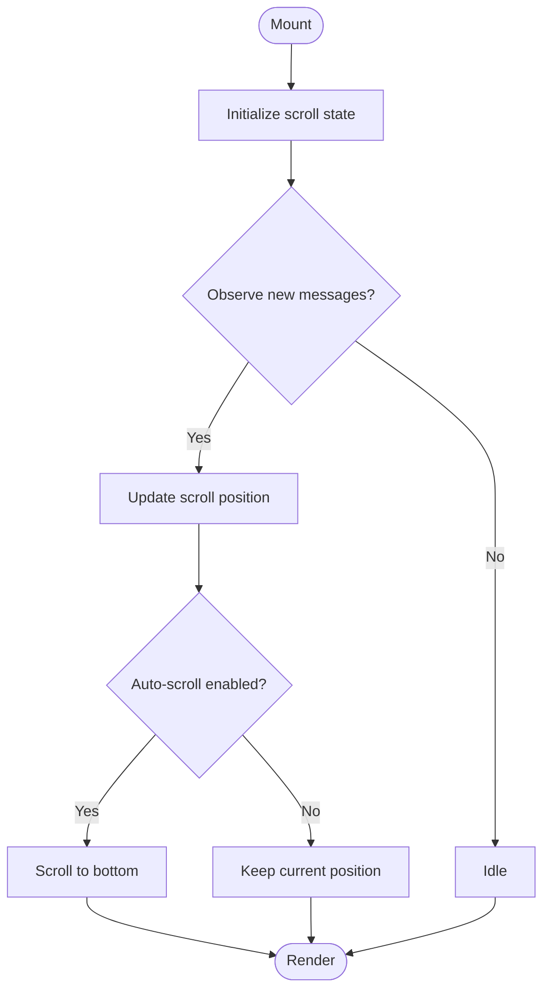

**Diagram sources**
- [message-scroller/index.ts:1-2](file://packages/fractal-svelte/src/lib/components/agents/message-scroller/index.ts#L1-L2)

**Section sources**
- [message-scroller/index.ts:1-2](file://packages/fractal-svelte/src/lib/components/agents/message-scroller/index.ts#L1-L2)

### AiSidebar
AiSidebar serves as a navigation and context management panel for agent resources and actions. It supports typed resource kinds and move operations.

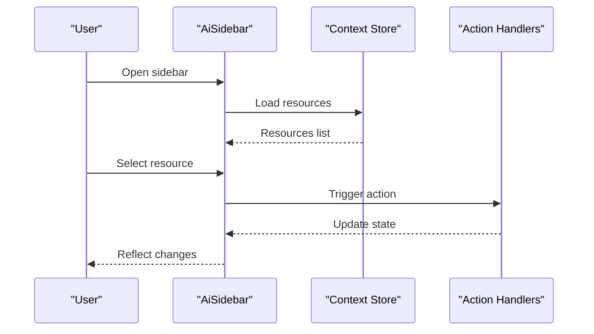

**Diagram sources**
- [ai-sidebar/index.ts:1-8](file://packages/fractal-svelte/src/lib/components/agents/ai-sidebar/index.ts#L1-L8)

**Section sources**
- [ai-sidebar/index.ts:1-8](file://packages/fractal-svelte/src/lib/components/agents/ai-sidebar/index.ts#L1-L8)

### PromptInput
PromptInput handles user input with support for model selection and action dispatching. It exposes typed models and actions for integration with agent systems.

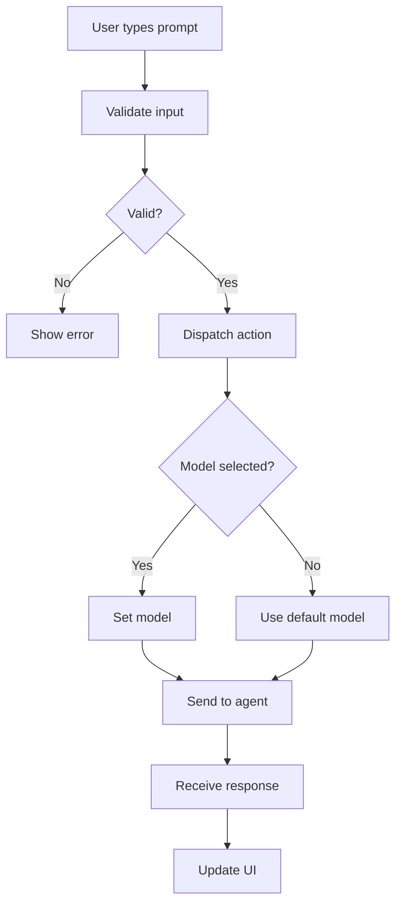

**Diagram sources**
- [prompt-input/index.ts:1-3](file://packages/fractal-svelte/src/lib/components/agents/prompt-input/index.ts#L1-L3)

**Section sources**
- [prompt-input/index.ts:1-3](file://packages/fractal-svelte/src/lib/components/agents/prompt-input/index.ts#L1-L3)

### StreamingResponse
StreamingResponse renders live content updates with status management and feedback collection. It supports citation items and various response states.

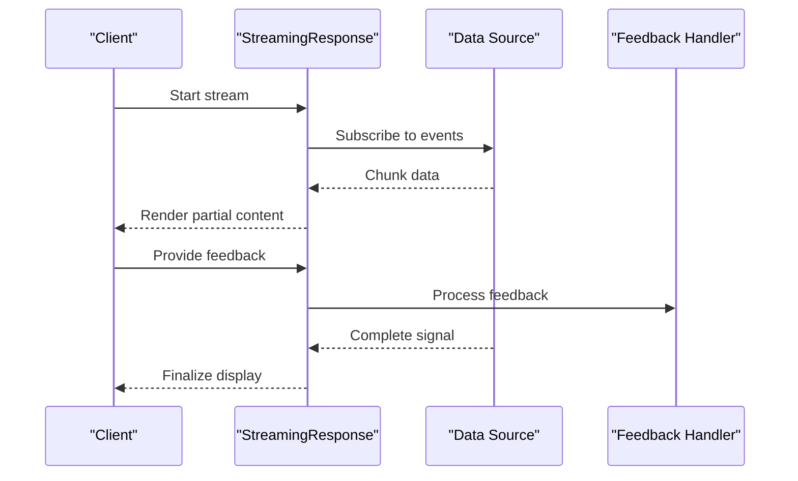

**Diagram sources**
- [streaming-response/index.ts:1-7](file://packages/fractal-svelte/src/lib/components/agents/streaming-response/index.ts#L1-L7)

**Section sources**
- [streaming-response/index.ts:1-7](file://packages/fractal-svelte/src/lib/components/agents/streaming-response/index.ts#L1-L7)

### ApprovalCard
ApprovalCard facilitates decision workflows by presenting questions with multiple options and collecting answers.

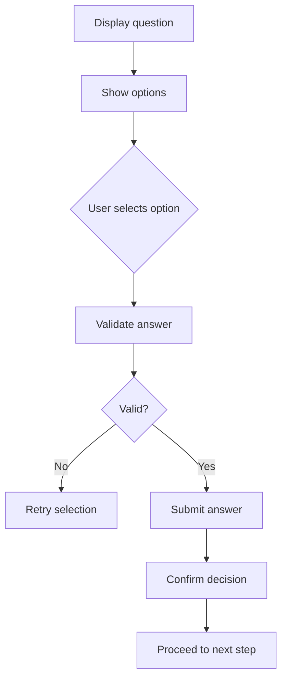

**Diagram sources**
- [approval-card/index.ts:1-9](file://packages/fractal-svelte/src/lib/components/agents/approval-card/index.ts#L1-L9)

**Section sources**
- [approval-card/index.ts:1-9](file://packages/fractal-svelte/src/lib/components/agents/approval-card/index.ts#L1-L9)

### FileDiff
FileDiff displays code differences with typed line structures and status indicators for added, removed, or modified content.

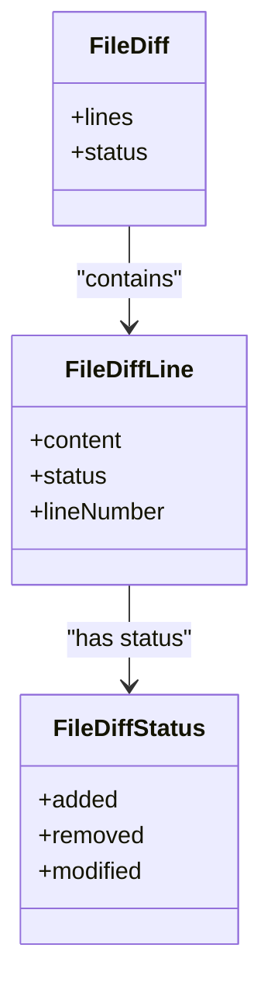

**Diagram sources**
- [file-diff/index.ts:1-3](file://packages/fractal-svelte/src/lib/components/agents/file-diff/index.ts#L1-L3)

**Section sources**
- [file-diff/index.ts:1-3](file://packages/fractal-svelte/src/lib/components/agents/file-diff/index.ts#L1-L3)

### TodoList
TodoList manages task items with different statuses, supporting completion, deletion, and reordering.

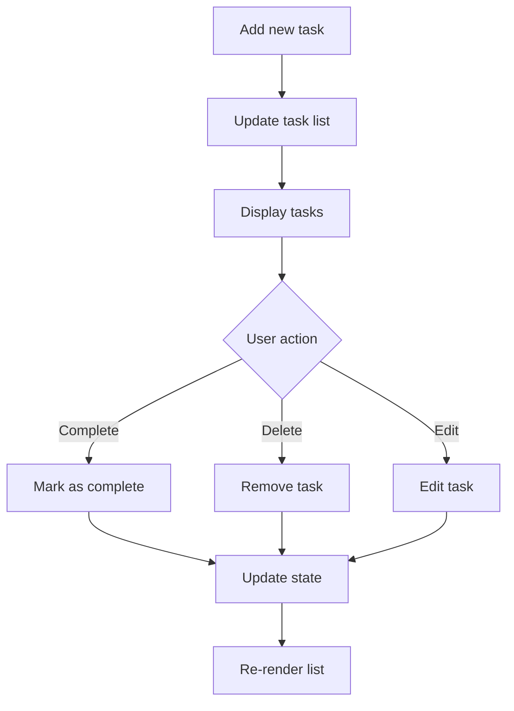

**Diagram sources**
- [todo-list/index.ts:1-3](file://packages/fractal-svelte/src/lib/components/agents/todo-list/index.ts#L1-L3)

**Section sources**
- [todo-list/index.ts:1-3](file://packages/fractal-svelte/src/lib/components/agents/todo-list/index.ts#L1-L3)

## Dependency Analysis
The agent components have minimal external dependencies, primarily relying on Svelte 5 and motion primitives. The package structure ensures loose coupling between components while maintaining clear export boundaries.

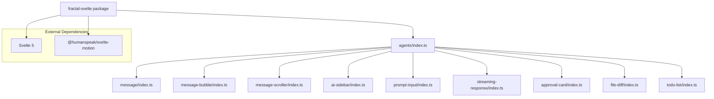

**Diagram sources**
- [package.json:215-218](file://packages/fractal-svelte/package.json#L215-L218)
- [agents/index.ts:1-10](file://packages/fractal-svelte/src/lib/components/agents/index.ts#L1-L10)

**Section sources**
- [package.json:215-218](file://packages/fractal-svelte/package.json#L215-L218)
- [agents/index.ts:1-10](file://packages/fractal-svelte/src/lib/components/agents/index.ts#L1-L10)

## Performance Considerations
- **Virtualization**: For large message lists, consider implementing virtual scrolling in MessageScroller to improve performance.
- **Memoization**: Use Svelte's reactive statements and stores to minimize unnecessary re-renders.
- **Streaming Optimization**: Implement chunked processing in StreamingResponse to handle large data streams efficiently.
- **Memory Management**: Clean up event listeners and subscriptions when components unmount.
- **Accessibility**: Ensure all interactive elements have proper ARIA labels and keyboard navigation support.

## Troubleshooting Guide
Common issues and solutions:

- **Message Rendering Issues**: Verify that message props are correctly structured and that content renderers are properly configured.
- **Streaming Delays**: Check network connectivity and ensure proper error handling in StreamingResponse.
- **Sidebar State Sync**: Confirm that context updates are properly propagated to dependent components.
- **Input Validation**: Ensure PromptInput validation rules match expected agent requirements.
- **Diff Rendering**: Verify that FileDiff line structures contain required properties for accurate rendering.

## Conclusion
The agent components provide a comprehensive toolkit for building AI-powered chat interfaces with real-time capabilities. The modular design allows for flexible composition while maintaining type safety and accessibility standards. By following the patterns outlined in this document, developers can create responsive, accessible, and performant AI agent interactions.

## Appendices

### Chat Interface Implementation Example
A typical chat interface combines Message, MessageScroller, and PromptInput components:

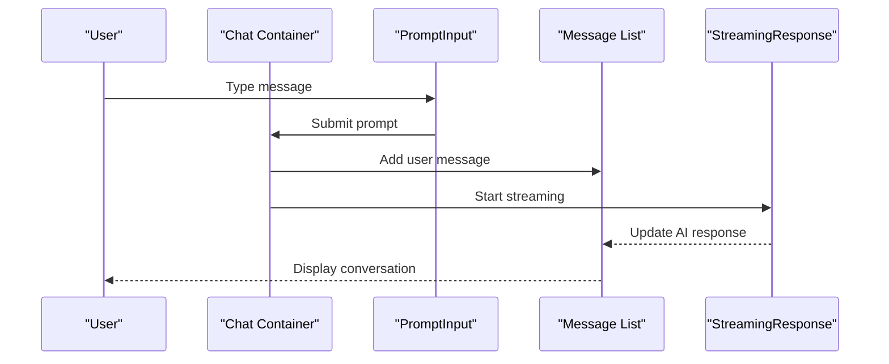

### Multi-Agent Conversation Pattern
For multi-agent scenarios, use AiSidebar to manage different agent contexts and Message components to distinguish between agents:

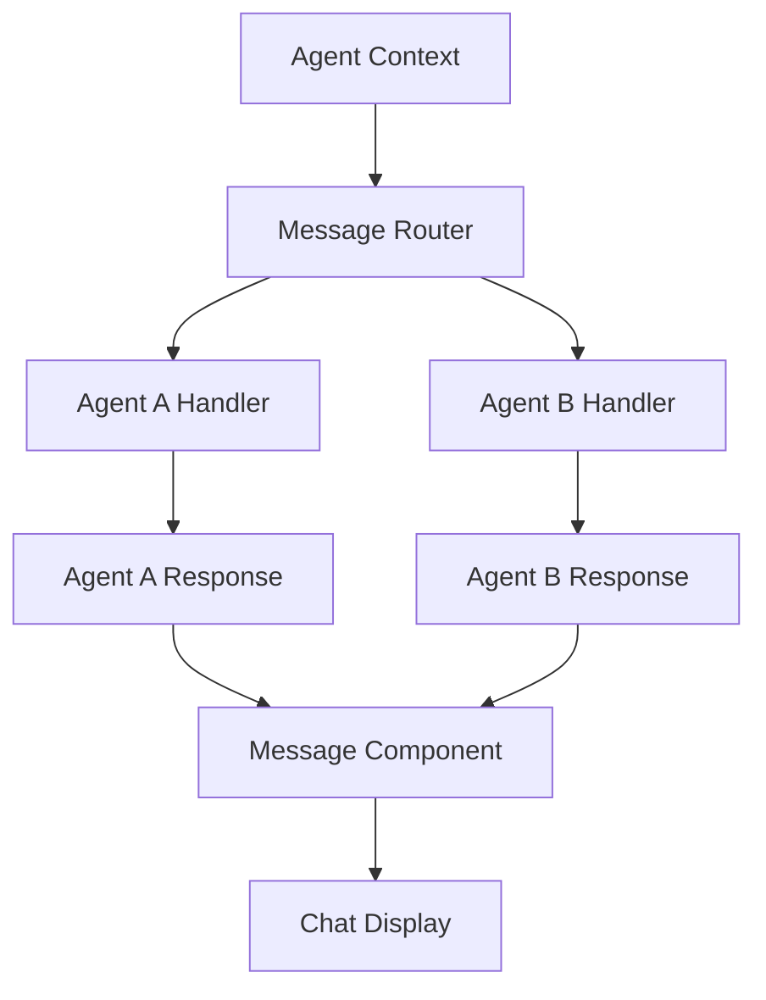

### Accessibility Best Practices
- Use semantic HTML elements within components
- Implement proper focus management
- Provide screen reader announcements for dynamic content
- Ensure sufficient color contrast
- Support keyboard navigation throughout the interface