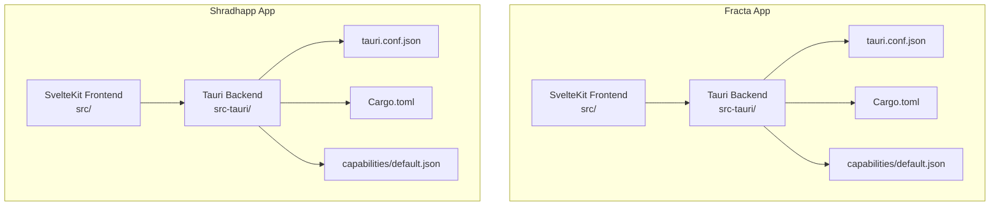
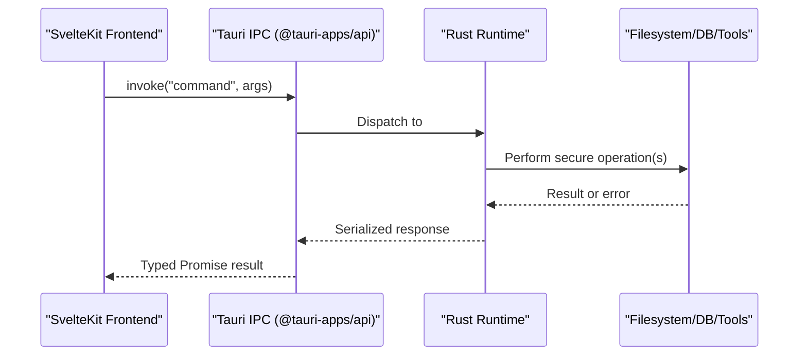
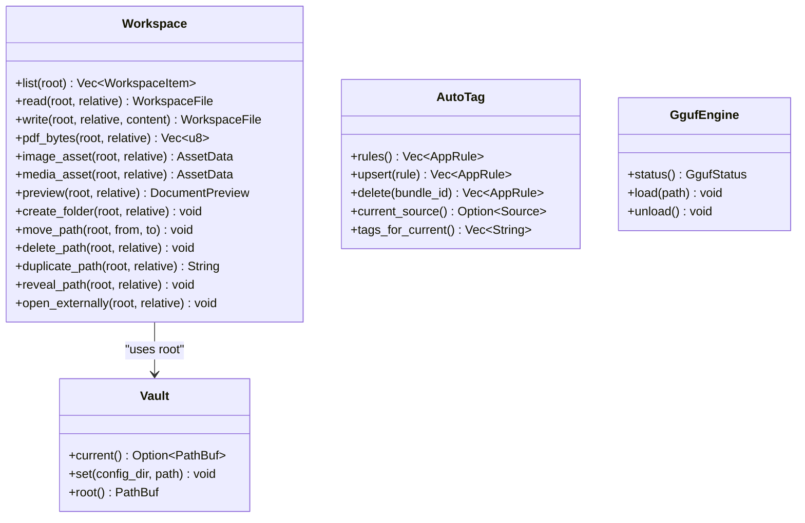
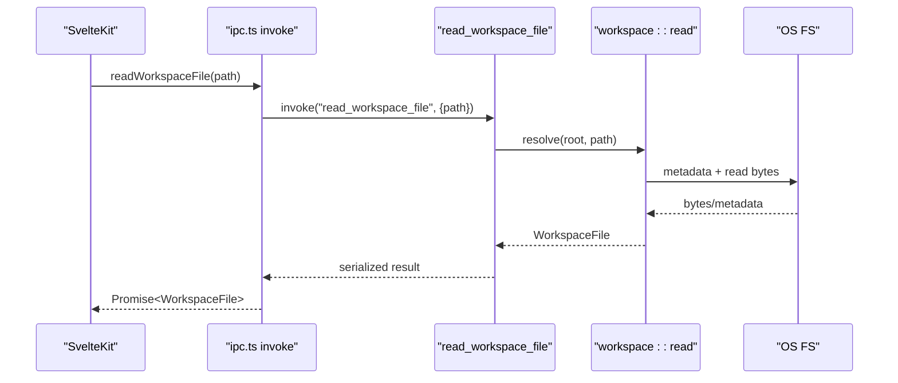
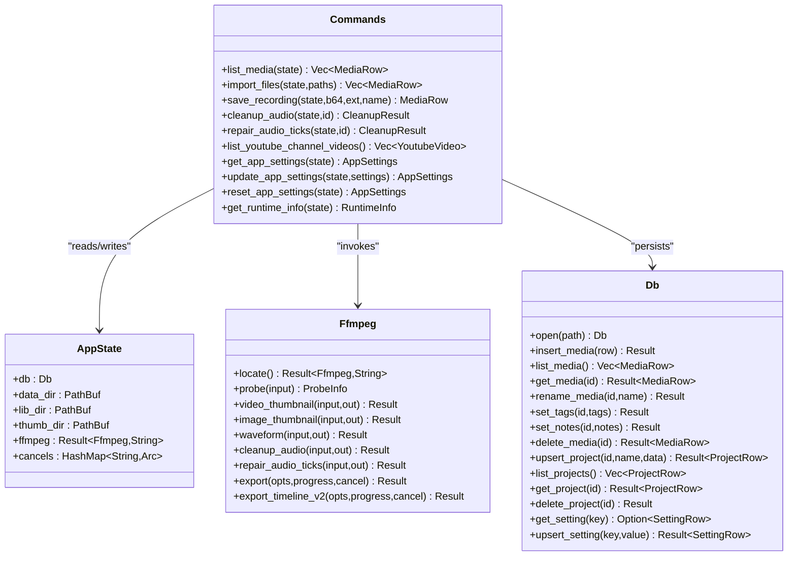
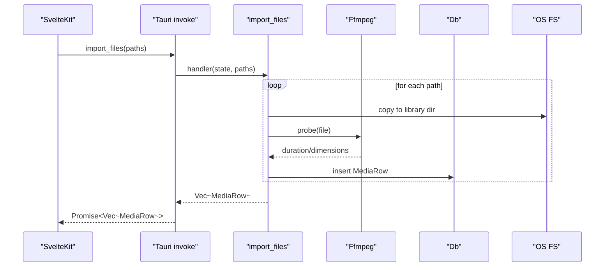
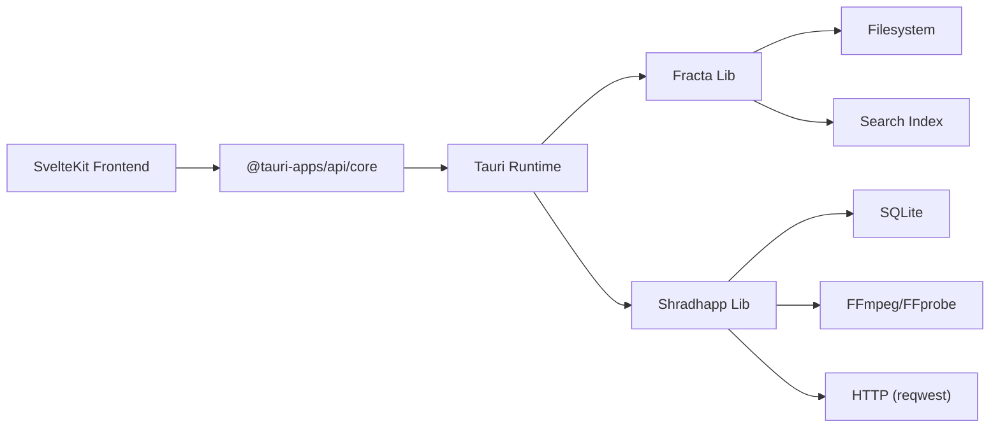

# Desktop Applications

<cite>
**Referenced Files in This Document**
- [fracta tauri.conf.json](file://apps/fracta/src-tauri/tauri.conf.json)
- [shradhapp tauri.conf.json](file://apps/shradhapp/src-tauri/tauri.conf.json)
- [fracta Cargo.toml](file://apps/fracta/src-tauri/Cargo.toml)
- [shradhapp Cargo.toml](file://apps/shradhapp/src-tauri/Cargo.toml)
- [fracta main.rs](file://apps/fracta/src-tauri/src/main.rs)
- [shradhapp main.rs](file://apps/shradhapp/src-tauri/src/main.rs)
- [fracta lib.rs](file://apps/fracta/src-tauri/src/lib.rs)
- [shradhapp lib.rs](file://apps/shradhapp/src-tauri/src/lib.rs)
- [fracta workspace.rs](file://apps/fracta/src-tauri/src/workspace.rs)
- [shradhapp commands.rs](file://apps/shradhapp/src-tauri/src/commands.rs)
- [shradhapp db.rs](file://apps/shradhapp/src-tauri/src/db.rs)
- [shradhapp media_engine.rs](file://apps/shradhapp/src-tauri/src/media_engine.rs)
- [fracta ipc.ts](file://apps/fracta/src/lib/ipc.ts)
- [fracta capabilities default.json](file://apps/fracta/src-tauri/capabilities/default.json)
- [shradhapp capabilities default.json](file://apps/shradhapp/src-tauri/capabilities/default.json)
</cite>

## Table of Contents
1. Introduction
2. Project Structure
3. Core Components
4. Architecture Overview
5. Detailed Component Analysis
6. Dependency Analysis
7. Performance Considerations
8. Troubleshooting Guide
9. Conclusion

## Introduction
This document explains the desktop applications built with Tauri in this monorepo, focusing on two apps: Fracta (a knowledge/workspace app) and Shradhapp (a personal video assembly app). It covers the shared architecture patterns between SvelteKit frontends and Rust/Tauri backends, common approaches for file system operations, database access, cross-platform compatibility, and security boundaries. The content is structured to be accessible to beginners while providing technical depth for experienced developers working with Tauri and Rust.

## Project Structure
Each Tauri app follows a consistent layout:
- Frontend: SvelteKit application under src/
- Backend: Rust crate under src-tauri/ with tauri.conf.json, Cargo.toml, and src/ modules
- Capabilities: Permission sets under src-tauri/capabilities/

**Diagram sources**
- [fracta tauri.conf.json](file://apps/fracta/src-tauri/tauri.conf.json)
- [shradhapp tauri.conf.json](file://apps/shradhapp/src-tauri/tauri.conf.json)
- [fracta Cargo.toml](file://apps/fracta/src-tauri/Cargo.toml)
- [shradhapp Cargo.toml](file://apps/shradhapp/src-tauri/Cargo.toml)
- [fracta capabilities default.json](file://apps/fracta/src-tauri/capabilities/default.json)
- [shradhapp capabilities default.json](file://apps/shradhapp/src-tauri/capabilities/default.json)

**Section sources**
- [fracta tauri.conf.json](file://apps/fracta/src-tauri/tauri.conf.json)
- [shradhapp tauri.conf.json](file://apps/shradhapp/src-tauri/tauri.conf.json)

## Core Components
Both apps share a common pattern:
- A minimal main.rs that delegates to a library entry point
- A lib.rs that initializes Tauri, registers state, plugins, and command handlers
- Feature-specific modules implementing business logic (workspace operations, media engine, database)
- Frontend IPC wrappers that call Tauri commands via @tauri-apps/api/core invoke

Key responsibilities:
- Fracta: Workspace filesystem operations, search indexing, auto-tagging rules, local GGUF model server integration, printing, terminal execution sandboxing
- Shradhapp: Media import, thumbnails/waveforms, audio cleanup/tick repair, project CRUD, settings persistence, YouTube channel listing, ffmpeg-based export pipeline

**Section sources**
- [fracta main.rs](file://apps/fracta/src-tauri/src/main.rs)
- [shradhapp main.rs](file://apps/shradhapp/src-tauri/src/main.rs)
- [fracta lib.rs](file://apps/fracta/src-tauri/src/lib.rs)
- [shradhapp lib.rs](file://apps/shradhapp/src-tauri/src/lib.rs)
- [fracta ipc.ts](file://apps/fracta/src/lib/ipc.ts)

## Architecture Overview
The desktop architecture separates UI from privileged operations:
- SvelteKit runs inside the Tauri webview
- All filesystem, DB, and external tool invocations go through typed Tauri commands
- Security is enforced by CSP and capability permissions
- Cross-platform behavior is abstracted behind platform-specific code paths

[No sources needed since this diagram shows conceptual workflow, not actual code structure]

## Detailed Component Analysis

### Fracta: Workspace File System and Commands
Fracta exposes a comprehensive set of workspace commands for safe, vault-contained file operations, including reading text with encoding preservation, previewing PDFs and DOCX, asset handling, and recursive traversal with ignore rules.

**Diagram sources**
- [fracta workspace.rs](file://apps/fracta/src-tauri/src/workspace.rs)
- [fracta lib.rs](file://apps/fracta/src-tauri/src/lib.rs)

Key behaviors:
- Path resolution enforces vault containment and prevents symlink escapes
- Text encoding detection preserves UTF-8 BOM and UTF-16 variants; writes re-detect existing encoding
- CSV validation ensures well-formed headers and quotes; delimiter inference supports TSV
- Preview extracts readable text from PDFs and simplified blocks from DOCX without exposing host paths
- Terminal execution is bounded by timeout and output size limits; shells are chosen per OS

Security and safety:
- Only allowed file kinds can be edited; binary assets use a separate write path
- Inline media has a maximum size limit; object URLs keep bytes within the WebView
- Print uses native print surface when available, with window.print fallback

**Section sources**
- [fracta workspace.rs](file://apps/fracta/src-tauri/src/workspace.rs)
- [fracta lib.rs](file://apps/fracta/src-tauri/src/lib.rs)

#### Fracta Command Flow (Example: Read Workspace File)

**Diagram sources**
- [fracta ipc.ts](file://apps/fracta/src/lib/ipc.ts)
- [fracta lib.rs](file://apps/fracta/src-tauri/src/lib.rs)
- [fracta workspace.rs](file://apps/fracta/src-tauri/src/workspace.rs)

### Shradhapp: Media Engine, Database, and Commands
Shradhapp centralizes all ffmpeg interactions in a single module, persists data in SQLite, and exposes typed commands for media management, projects, and settings.

**Diagram sources**
- [shradhapp commands.rs](file://apps/shradhapp/src-tauri/src/commands.rs)
- [shradhapp media_engine.rs](file://apps/shradhapp/src-tauri/src/media_engine.rs)
- [shradhapp db.rs](file://apps/shradhapp/src-tauri/src/db.rs)

Key behaviors:
- ffmpeg discovery searches PATH then platform-specific locations; errors guide installation
- Probing returns duration and dimensions; thumbnails/waveforms generated asynchronously
- Audio cleanup applies filters and loudness normalization; tick repair targets impulsive noise
- Export pipeline normalizes segments, concatenates, and mixes voiceover tracks with progress callbacks
- Settings are normalized and persisted with versioning; runtime info exposes directories and ffmpeg availability

Cross-platform considerations:
- Executable names and fallback directories differ by OS
- Shell invocation for terminal commands chooses cmd/sh based on target_os
- File reveal/open uses open, explorer, or xdg-open depending on platform

**Section sources**
- [shradhapp commands.rs](file://apps/shradhapp/src-tauri/src/commands.rs)
- [shradhapp media_engine.rs](file://apps/shradhapp/src-tauri/src/media_engine.rs)
- [shradhapp db.rs](file://apps/shradhapp/src-tauri/src/db.rs)

#### Shradhapp Command Flow (Example: Import Files)

**Diagram sources**
- [shradhapp commands.rs](file://apps/shradhapp/src-tauri/src/commands.rs)
- [shradhapp media_engine.rs](file://apps/shradhapp/src-tauri/src/media_engine.rs)
- [shradhapp db.rs](file://apps/shradhapp/src-tauri/src/db.rs)

### Shared Patterns Across Apps
- Entry points: main.rs delegates to lib::run(), enabling mobile entry points via cfg attributes
- State management: Tauri .manage() holds long-lived state (Vault, AppState)
- Command registration: generate_handler! maps frontend calls to Rust functions
- Capability-based permissions: explicit allow lists for core, window, dialog, event APIs
- Configuration: tauri.conf.json defines windows, dev/build URLs, CSP, and bundle icons

**Section sources**
- [fracta main.rs](file://apps/fracta/src-tauri/src/main.rs)
- [shradhapp main.rs](file://apps/shradhapp/src-tauri/src/main.rs)
- [fracta lib.rs](file://apps/fracta/src-tauri/src/lib.rs)
- [shradhapp lib.rs](file://apps/shradhapp/src-tauri/src/lib.rs)
- [fracta capabilities default.json](file://apps/fracta/src-tauri/capabilities/default.json)
- [shradhapp capabilities default.json](file://apps/shradhapp/src-tauri/capabilities/default.json)
- [fracta tauri.conf.json](file://apps/fracta/src-tauri/tauri.conf.json)
- [shradhapp tauri.conf.json](file://apps/shradhapp/src-tauri/tauri.conf.json)

## Dependency Analysis
- Fracta dependencies include serde, rusqlite, csv, quick-xml, lopdf, zip, notify, rfd, trash, and Tauri plugins for window state
- Shradhapp dependencies include serde, rusqlite, uuid, base64, reqwest (blocking), and Tauri plugin for dialog

**Diagram sources**
- [fracta Cargo.toml](file://apps/fracta/src-tauri/Cargo.toml)
- [shradhapp Cargo.toml](file://apps/shradhapp/src-tauri/Cargo.toml)

**Section sources**
- [fracta Cargo.toml](file://apps/fracta/src-tauri/Cargo.toml)
- [shradhapp Cargo.toml](file://apps/shradhapp/src-tauri/Cargo.toml)

## Performance Considerations
- Fracta:
  - Workspace watcher updates search index incrementally on events; polling fallback exists for browser previews and transient OS watcher issues
  - Terminal output is bounded in size and time to prevent memory pressure and hangs
  - PDF/DOCX extraction avoids heavy rendering; only text/blocks are returned
- Shradhapp:
  - ffmpeg processes run with progress callbacks and cancellation support
  - Thumbnails/waveforms are generated asynchronously and cached on disk
  - Export pipeline normalizes clips first, then concatenates efficiently; fallback re-encode path improves robustness

[No sources needed since this section provides general guidance]

## Troubleshooting Guide
Common issues and resolutions:
- Missing ffmpeg:
  - Ensure ffmpeg and ffprobe are installed and discoverable via PATH or standard locations
  - Use get_runtime_info to confirm availability and messages
- Database initialization failures:
  - Check app-data directory permissions; WAL mode is enabled for concurrency
- Workspace path errors:
  - Validate relative paths; ensure no traversal outside vault; check .fractaignore patterns
- Capability errors:
  - Verify capabilities/default.json includes required permissions for dialogs, events, and webview features
- CSP blocking resources:
  - Review tauri.conf.json security.csp directives; allow necessary connect-src origins if needed

**Section sources**
- [shradhapp commands.rs](file://apps/shradhapp/src-tauri/src/commands.rs)
- [shradhapp db.rs](file://apps/shradhapp/src-tauri/src/db.rs)
- [fracta workspace.rs](file://apps/fracta/src-tauri/src/workspace.rs)
- [fracta capabilities default.json](file://apps/fracta/src-tauri/capabilities/default.json)
- [shradhapp capabilities default.json](file://apps/shradhapp/src-tauri/capabilities/default.json)
- [fracta tauri.conf.json](file://apps/fracta/src-tauri/tauri.conf.json)
- [shradhapp tauri.conf.json](file://apps/shradhapp/src-tauri/tauri.conf.json)

## Conclusion
The desktop applications in this monorepo follow a clear, secure, and maintainable pattern: SvelteKit frontends communicate with Rust/Tauri backends through typed commands, keeping privileged operations centralized. Fracta emphasizes safe workspace operations and rich document handling, while Shradhapp focuses on media processing and export pipelines powered by ffmpeg. Both apps leverage capability-based permissions, platform-aware code paths, and persistent storage to deliver cross-platform desktop experiences.