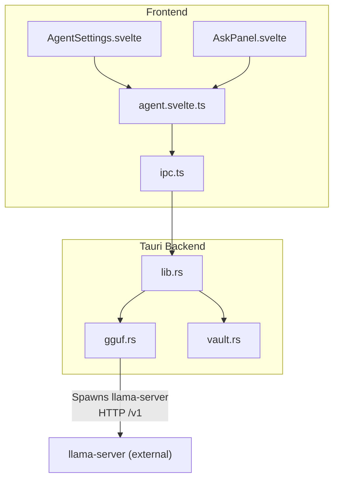
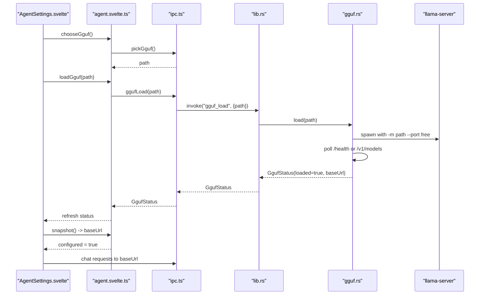
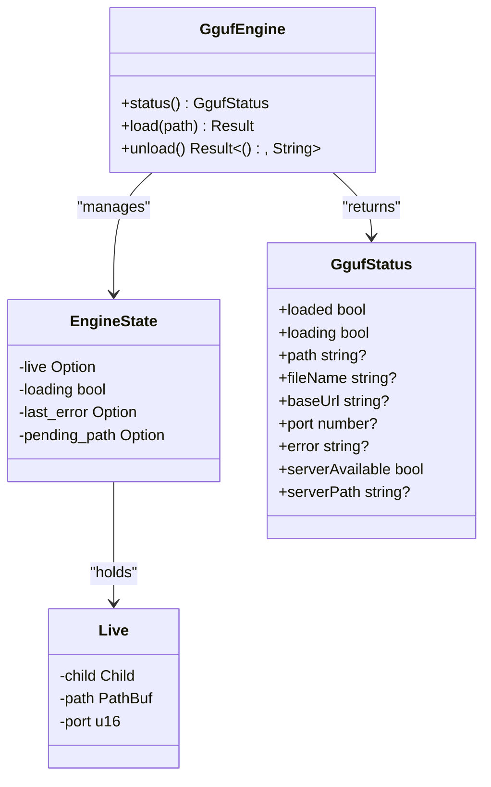
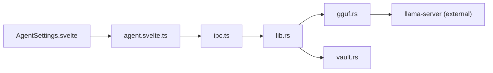

# AI Integration (GGUF)

<cite>
**Referenced Files in This Document**
- [gguf.rs](file://apps/fracta/src-tauri/src/gguf.rs)
- [lib.rs](file://apps/fracta/src-tauri/src/lib.rs)
- [vault.rs](file://apps/fracta/src-tauri/src/vault.rs)
- [ipc.ts](file://apps/fracta/src/lib/ipc.ts)
- [agent.svelte.ts](file://apps/fracta/src/lib/state/agent.svelte.ts)
- [AgentSettings.svelte](file://apps/fracta/src/lib/components/AgentSettings.svelte)
- [AskPanel.svelte](file://apps/fracta/src/lib/components/AskPanel.svelte)
- [Cargo.toml](file://apps/fracta/src-tauri/Cargo.toml)
</cite>

## Table of Contents
1. Introduction
2. Project Structure
3. Core Components
4. Architecture Overview
5. Detailed Component Analysis
6. Dependency Analysis
7. Performance Considerations
8. Troubleshooting Guide
9. Conclusion
10. Appendices

## Introduction
This document explains Fracta’s local AI integration using GGUF models. It covers how the application loads a GGUF model via a managed llama-server subprocess, exposes an OpenAI-compatible endpoint on localhost, and integrates with the note-taking workflow for smart title generation, content summarization, and intelligent tagging suggestions. It also documents configuration options, performance tuning, memory management, privacy considerations, and troubleshooting steps.

## Project Structure
The GGUF feature spans the Tauri Rust backend and the Svelte frontend:
- Backend:
  - gguf.rs: GGUF engine that discovers llama-server, spawns it with a selected .gguf file, polls readiness, and exposes status and lifecycle commands.
  - lib.rs: Tauri command registration exposing gguf_status, pick_gguf, gguf_load, and gguf_unload to the frontend; manages GgufEngine state.
  - vault.rs: Vault operations for reading/writing markdown entries with frontmatter; used by AI features to update titles/tags/body.
  - Cargo.toml: Dependencies including tauri, rfd, serde, etc.
- Frontend:
  - ipc.ts: Type-safe wrappers around Tauri invoke calls, including GGUF endpoints.
  - agent.svelte.ts: Agent settings state machine supporting “api” and “gguf” modes; persists configuration and coordinates loading/unloading.
  - AgentSettings.svelte: UI for selecting provider or local GGUF, picking files, and controlling load/unload.
  - AskPanel.svelte: Chat panel that streams responses from the configured provider (including local GGUF).

**Diagram sources**
- [AgentSettings.svelte:1-348](file://apps/fracta/src/lib/components/AgentSettings.svelte#L1-L348)
- [agent.svelte.ts:1-236](file://apps/fracta/src/lib/state/agent.svelte.ts#L1-L236)
- [ipc.ts:1-237](file://apps/fracta/src/lib/ipc.ts#L1-L237)
- [lib.rs:398-497](file://apps/fracta/src-tauri/src/lib.rs#L398-L497)
- [gguf.rs:1-321](file://apps/fracta/src-tauri/src/gguf.rs#L1-L321)
- [vault.rs:1-495](file://apps/fracta/src-tauri/src/vault.rs#L1-L495)

**Section sources**
- [gguf.rs:1-321](file://apps/fracta/src-tauri/src/gguf.rs#L1-L321)
- [lib.rs:398-497](file://apps/fracta/src-tauri/src/lib.rs#L398-L497)
- [vault.rs:1-495](file://apps/fracta/src-tauri/src/vault.rs#L1-L495)
- [ipc.ts:1-237](file://apps/fracta/src/lib/ipc.ts#L1-L237)
- [agent.svelte.ts:1-236](file://apps/fracta/src/lib/state/agent.svelte.ts#L1-L236)
- [AgentSettings.svelte:1-348](file://apps/fracta/src/lib/components/AgentSettings.svelte#L1-L348)
- [AskPanel.svelte:1-233](file://apps/fracta/src/lib/components/AskPanel.svelte#L1-L233)
- [Cargo.toml:1-44](file://apps/fracta/src-tauri/Cargo.toml#L1-L44)

## Core Components
- GgufEngine (Rust): Manages lifecycle of a llama-server process bound to a specific .gguf file. Provides status, load, unload, and server discovery.
- Tauri Commands (Rust): Expose gguf_status, pick_gguf, gguf_load, gguf_unload to the frontend.
- IPC Layer (TypeScript): Wraps Tauri invocations and defines GgufStatus type.
- Agent Settings (Svelte + TS): Persists mode (“api” or “gguf”), stores last chosen GGUF path, and orchestrates loading/unloading.
- UI Components: AgentSettings.svelte provides controls; AskPanel.svelte streams responses using the active provider (local GGUF or remote API).
- Vault Operations: Read/write markdown entries with frontmatter; AI features can update titles, tags, and body based on model output.

**Section sources**
- [gguf.rs:1-321](file://apps/fracta/src-tauri/src/gguf.rs#L1-L321)
- [lib.rs:398-497](file://apps/fracta/src-tauri/src/lib.rs#L398-L497)
- [ipc.ts:216-237](file://apps/fracta/src/lib/ipc.ts#L216-L237)
- [agent.svelte.ts:1-236](file://apps/fracta/src/lib/state/agent.svelte.ts#L1-L236)
- [AgentSettings.svelte:1-348](file://apps/fracta/src/lib/components/AgentSettings.svelte#L1-L348)
- [AskPanel.svelte:1-233](file://apps/fracta/src/lib/components/AskPanel.svelte#L1-L233)
- [vault.rs:1-495](file://apps/fracta/src-tauri/src/vault.rs#L1-L495)

## Architecture Overview
The GGUF integration follows a clear pipeline:
- User selects a .gguf file in AgentSettings.
- Frontend invokes gguf_load via Tauri IPC.
- Backend locates llama-server, spawns it with the model, waits until HTTP endpoints respond, and returns status with base URL.
- Frontend switches to “Local GGUF” mode and uses the returned base URL for chat requests.
- AskPanel streams responses from the local endpoint.

**Diagram sources**
- [AgentSettings.svelte:63-85](file://apps/fracta/src/lib/components/AgentSettings.svelte#L63-L85)
- [agent.svelte.ts:172-215](file://apps/fracta/src/lib/state/agent.svelte.ts#L172-L215)
- [ipc.ts:216-237](file://apps/fracta/src/lib/ipc.ts#L216-L237)
- [lib.rs:410-423](file://apps/fracta/src-tauri/src/lib.rs#L410-L423)
- [gguf.rs:131-184](file://apps/fracta/src-tauri/src/gguf.rs#L131-L184)

## Detailed Component Analysis

### GGUF Engine (Rust)
Responsibilities:
- Discover llama-server binary via environment variable, common paths, or PATH.
- Validate .gguf extension and file existence.
- Spawn llama-server with model path, host, port, context size, and GPU layers.
- Poll readiness via HTTP endpoints (/health or /v1/models).
- Provide status (loaded/loading/base_url/port/error/server_available/server_path).
- Manage lifecycle (load/unload), ensuring previous processes are killed before new ones.

Key implementation details:
- Uses a mutex-guarded EngineState to track live child process, pending path, and errors.
- Spawns stderr reader thread to avoid blocking.
- Implements free_port selection and TCP readiness checks with timeouts.

**Diagram sources**
- [gguf.rs:19-80](file://apps/fracta/src-tauri/src/gguf.rs#L19-L80)
- [gguf.rs:51-67](file://apps/fracta/src-tauri/src/gguf.rs#L51-L67)
- [gguf.rs:131-184](file://apps/fracta/src-tauri/src/gguf.rs#L131-L184)

**Section sources**
- [gguf.rs:1-321](file://apps/fracta/src-tauri/src/gguf.rs#L1-L321)

### Tauri Command Registration and Lifecycle
Responsibilities:
- Register gguf_status, pick_gguf, gguf_load, gguf_unload commands.
- Initialize GgufEngine in Tauri state.
- Run gguf_load asynchronously to avoid blocking the event loop while waiting for readiness.

Key implementation details:
- Uses tauri::async_runtime::spawn_blocking for load operation.
- Returns structured GgufStatus to the frontend.

**Section sources**
- [lib.rs:398-497](file://apps/fracta/src-tauri/src/lib.rs#L398-L497)

### IPC Layer (TypeScript)
Responsibilities:
- Define GgufStatus interface matching backend serialization.
- Provide ggufStatus, pickGguf, ggufLoad, ggufUnload functions.
- Detect Tauri runtime availability.

Key implementation details:
- All GGUF endpoints use invoke with appropriate payloads.
- isTauri guards prevent calling native APIs outside desktop app.

**Section sources**
- [ipc.ts:216-237](file://apps/fracta/src/lib/ipc.ts#L216-L237)

### Agent Settings State Machine
Responsibilities:
- Persist mode (“api” or “gguf”), provider config, and last chosen GGUF path.
- Refresh GGUF status from backend.
- Load/unload GGUF with error handling and UI feedback.
- Provide snapshot() returning OpenAI-compatible config for chat client.

Key implementation details:
- Local storage persistence with fallbacks.
- Error propagation to UI with user-friendly messages.
- Switches mode automatically when choosing a GGUF file.

**Section sources**
- [agent.svelte.ts:1-236](file://apps/fracta/src/lib/state/agent.svelte.ts#L1-L236)

### UI Components
- AgentSettings.svelte:
  - Mode tabs for “API provider” and “Local GGUF”.
  - File picker for .gguf, auto-load if llama-server available.
  - Status indicators for loading/ready/error.
  - Presets for remote providers.
- AskPanel.svelte:
  - Streams responses from configured provider (local GGUF or remote).
  - Displays thinking/connection states and suggestions.

**Section sources**
- [AgentSettings.svelte:1-348](file://apps/fracta/src/lib/components/AgentSettings.svelte#L1-L348)
- [AskPanel.svelte:1-233](file://apps/fracta/src/lib/components/AskPanel.svelte#L1-L233)

### Vault Integration for AI Features
Responsibilities:
- Read/write markdown entries with frontmatter.
- Support derived titles when blank titles are provided.
- Preserve timestamps and handle deletion safely.

AI integration points:
- Smart title generation: When write_entry receives a blank or auto-title marker, derive title from body.
- Content summarization: Use AskPanel to summarize note content and update body/title via write_entry.
- Intelligent tagging: Combine autotag rules (source-app tags) with AI-suggested tags to enrich metadata.

**Section sources**
- [vault.rs:210-267](file://apps/fracta/src-tauri/src/vault.rs#L210-L267)

## Dependency Analysis

**Diagram sources**
- [AgentSettings.svelte:1-348](file://apps/fracta/src/lib/components/AgentSettings.svelte#L1-L348)
- [agent.svelte.ts:1-236](file://apps/fracta/src/lib/state/agent.svelte.ts#L1-L236)
- [ipc.ts:1-237](file://apps/fracta/src/lib/ipc.ts#L1-L237)
- [lib.rs:398-497](file://apps/fracta/src-tauri/src/lib.rs#L398-L497)
- [gguf.rs:1-321](file://apps/fracta/src-tauri/src/gguf.rs#L1-L321)
- [vault.rs:1-495](file://apps/fracta/src-tauri/src/vault.rs#L1-L495)

**Section sources**
- [Cargo.toml:1-44](file://apps/fracta/src-tauri/Cargo.toml#L1-L44)

## Performance Considerations
- Model Loading Time: Large GGUF files may take significant time to load into memory. The backend polls readiness with a timeout and provides user feedback.
- Memory Usage: llama-server loads the entire model into RAM. Ensure sufficient system memory for the selected model size.
- Context Size: Default context length is set during spawn; adjust if needed for longer prompts/responses.
- GPU Offloading: GPU layers parameter enables hardware acceleration when supported by llama-server build.
- Concurrency: Only one GGUF instance is managed at a time; unload before loading a new model.
- I/O Boundaries: Vault operations are synchronous but fast for small markdown files; batch updates where possible.

[No sources needed since this section provides general guidance]

## Troubleshooting Guide
Common issues and resolutions:
- llama-server not found:
  - Install llama.cpp via package manager (e.g., Homebrew on macOS).
  - Set FRACTA_LLAMA_SERVER environment variable to point to the binary.
  - Verify PATH includes the directory containing llama-server.
- Model fails to load:
  - Ensure the file has a .gguf extension and is valid.
  - Check system memory availability; large models may exceed RAM.
  - Review error messages from backend status.
- Timed out waiting for server:
  - The backend waits up to a fixed timeout for readiness; ensure the model is compatible and system resources are sufficient.
- Port conflicts:
  - The backend selects a free port automatically; if issues persist, restart the application.
- Frontend cannot connect:
  - Confirm the base URL returned by gguf_status is accessible from the webview.
  - Check firewall settings if running in restricted environments.

**Section sources**
- [gguf.rs:145-148](file://apps/fracta/src-tauri/src/gguf.rs#L145-L148)
- [gguf.rs:211-240](file://apps/fracta/src-tauri/src/gguf.rs#L211-L240)
- [AgentSettings.svelte:186-202](file://apps/fracta/src/lib/components/AgentSettings.svelte#L186-L202)

## Conclusion
Fracta’s GGUF integration enables powerful local AI capabilities without sending data to external services. By managing llama-server lifecycle, exposing an OpenAI-compatible endpoint, and integrating with vault operations, users can enhance note-taking with smart titles, summaries, and tags—all while maintaining privacy and control over their data. Proper configuration and performance tuning ensure smooth operation across different hardware configurations.

[No sources needed since this section summarizes without analyzing specific files]

## Appendices

### Configuration Options
- Environment Variables:
  - FRACTA_LLAMA_SERVER: Path to llama-server binary.
- Runtime Parameters (via gguf.rs spawn):
  - Context size (-c): Controls token window for inference.
  - GPU layers (-ngl): Enables GPU offloading when supported.
- Frontend Settings:
  - Agent mode: “api” or “gguf”.
  - Provider configuration: Base URL, API key, model ID (for remote providers).
  - GGUF path: Last chosen .gguf file persisted in localStorage.

**Section sources**
- [gguf.rs:187-202](file://apps/fracta/src-tauri/src/gguf.rs#L187-L202)
- [agent.svelte.ts:30-38](file://apps/fracta/src/lib/state/agent.svelte.ts#L30-L38)

### Privacy Considerations
- All AI processing occurs locally via llama-server; no data leaves the machine.
- Credentials for remote providers are stored locally and never transmitted unless explicitly configured.
- Vault files remain under user-controlled directories; AI operations do not expose content externally.

[No sources needed since this section provides general guidance]

### Example Workflows
- Smart Title Generation:
  - User writes content with blank title.
  - AI generates a concise title from the first meaningful line.
  - Vault write_entry preserves derived title in frontmatter.
- Content Summarization:
  - User asks to summarize the current note via AskPanel.
  - Response updates body or creates a new summary entry.
- Intelligent Tagging:
  - Autotag rules suggest tags based on source application.
  - AI augments suggestions with contextual tags from content analysis.

**Section sources**
- [vault.rs:237-241](file://apps/fracta/src-tauri/src/vault.rs#L237-L241)
- [AskPanel.svelte:22-26](file://apps/fracta/src/lib/components/AskPanel.svelte#L22-L26)