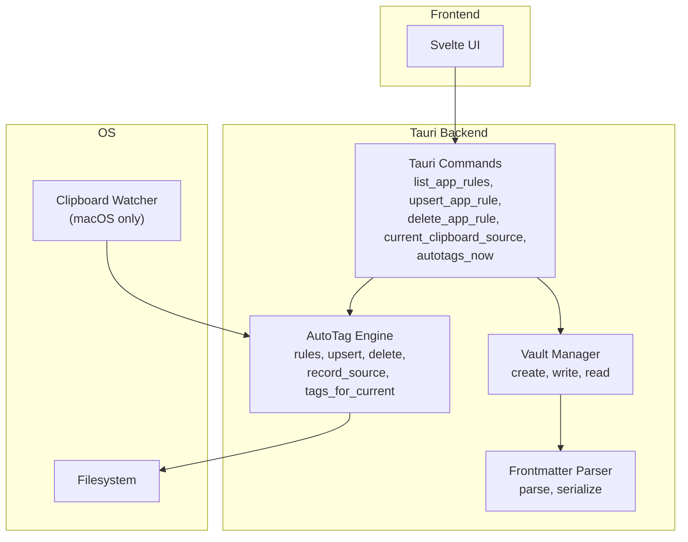
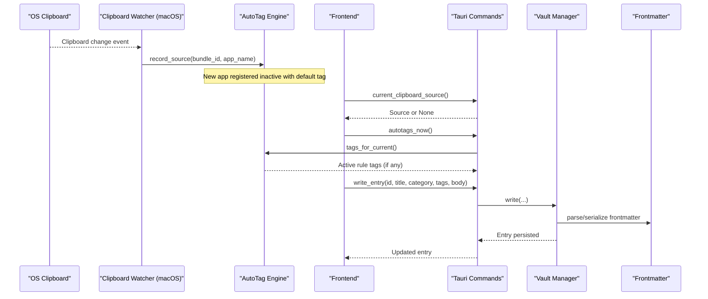
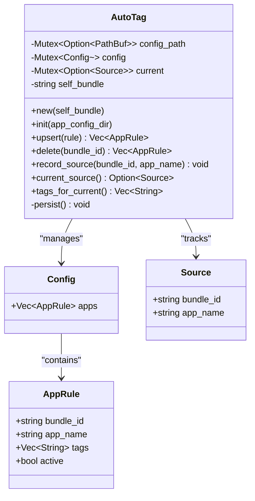
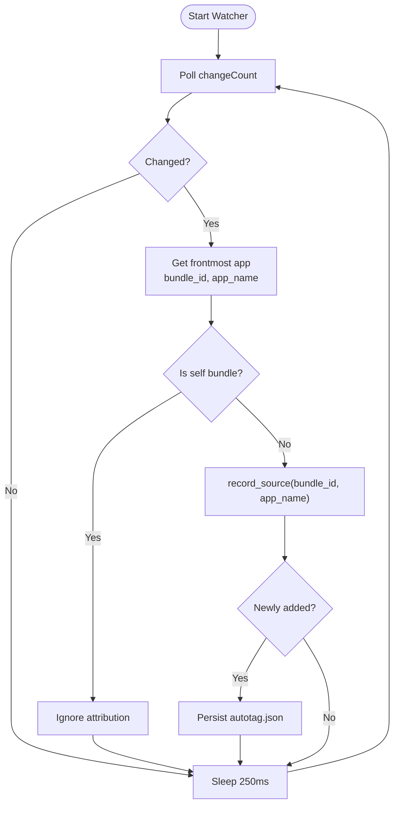
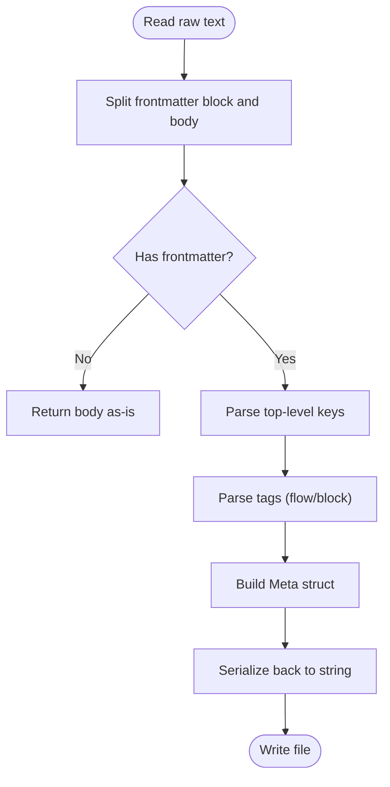
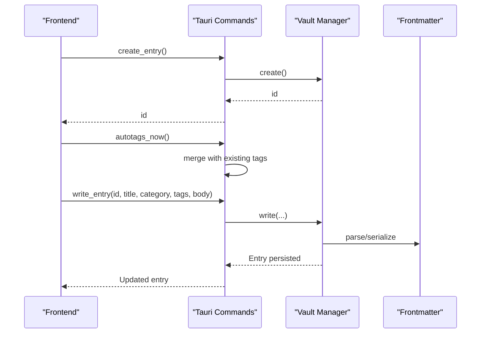
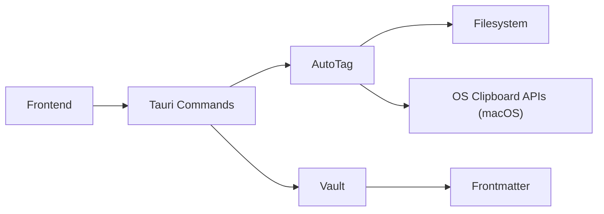

# Auto-tagging System

<cite>
**Referenced Files in This Document**
- [autotag.rs](file://apps/fracta/src-tauri/src/autotag.rs)
- [lib.rs](file://apps/fracta/src-tauri/src/lib.rs)
- [frontmatter.rs](file://apps/fracta/src-tauri/src/frontmatter.rs)
- [vault.rs](file://apps/fracta/src-tauri/src/vault.rs)
</cite>

## Table of Contents
1. [Introduction](#introduction)
2. [Project Structure](#project-structure)
3. [Core Components](#core-components)
4. [Architecture Overview](#architecture-overview)
5. [Detailed Component Analysis](#detailed-component-analysis)
6. [Dependency Analysis](#dependency-analysis)
7. [Performance Considerations](#performance-considerations)
8. [Troubleshooting Guide](#troubleshooting-guide)
9. [Conclusion](#conclusion)

## Introduction
This document explains Fracta’s intelligent auto-tagging system that automatically categorizes and tags entries based on content analysis, pattern matching, and configurable rules. It covers the tag rule engine, keyword detection algorithms, category assignment logic, integration with entry creation/update workflows, user-configurable rules, and how automatic suggestions can be overridden by manual management. It also includes examples of tag patterns, rule configurations, performance considerations for large vaults, and debugging techniques to evaluate rule effectiveness.

## Project Structure
Fracta is a SvelteKit + Tauri application. The auto-tagging feature lives in the Rust backend (Tauri), while the frontend integrates via Tauri commands. Key files:
- autotag.rs: Implements the auto-tag rule engine, clipboard source tracking, persistence, and platform-specific watcher.
- lib.rs: Exposes Tauri commands for listing/updating/deleting app rules and retrieving current clipboard source and auto-tags.
- frontmatter.rs: Parses and serializes YAML frontmatter for entries, including title, category, and tags.
- vault.rs: Entry CRUD operations and persistence; writes frontmatter fields to .md files.

**Diagram sources**
- [lib.rs:369-396](file://apps/fracta/src-tauri/src/lib.rs#L369-L396)
- [autotag.rs:1-205](file://apps/fracta/src-tauri/src/autotag.rs#L1-L205)
- [frontmatter.rs:1-238](file://apps/fracta/src-tauri/src/frontmatter.rs#L1-L238)
- [vault.rs:191-278](file://apps/fracta/src-tauri/src/vault.rs#L191-L278)

**Section sources**
- [lib.rs:1-498](file://apps/fracta/src-tauri/src/lib.rs#L1-L498)
- [autotag.rs:1-320](file://apps/fracta/src-tauri/src/autotag.rs#L1-L320)
- [frontmatter.rs:1-425](file://apps/fracta/src-tauri/src/frontmatter.rs#L1-L425)
- [vault.rs:1-495](file://apps/fracta/src-tauri/src/vault.rs#L1-L495)

## Core Components
- AppRule: A rule keyed by bundle id with an app name, list of tags, and active flag. Tags are normalized (trimmed, deduplicated).
- AutoTag: Thread-safe stateful manager holding config, current clipboard source, and self-bundle id. Provides methods to load/save rules, record source, and compute tags for current clipboard.
- Frontmatter: Lightweight parser/serializer for YAML frontmatter with keys title, category, tags, created_at, updated_at.
- Vault: Entry lifecycle (create/read/write/delete) and persistence to .md files with frontmatter.

Key behaviors:
- Clipboard source attribution on macOS updates the current source and may register new apps as inactive rules with default tags.
- Auto-tags are computed only when a rule is active for the current source.
- Entry write persists tags and category from the request payload; titles are derived if they look auto-generated.

**Section sources**
- [autotag.rs:17-205](file://apps/fracta/src-tauri/src/autotag.rs#L17-L205)
- [frontmatter.rs:10-30](file://apps/fracta/src-tauri/src/frontmatter.rs#L10-L30)
- [vault.rs:28-52](file://apps/fracta/src-tauri/src/vault.rs#L28-L52)

## Architecture Overview
The auto-tagging system combines OS-level clipboard observation with a rule engine and the entry workflow:

**Diagram sources**
- [autotag.rs:208-245](file://apps/fracta/src-tauri/src/autotag.rs#L208-L245)
- [lib.rs:369-396](file://apps/fracta/src-tauri/src/lib.rs#L369-L396)
- [vault.rs:212-267](file://apps/fracta/src-tauri/src/vault.rs#L212-L267)
- [frontmatter.rs:145-238](file://apps/fracta/src-tauri/src/frontmatter.rs#L145-L238)

## Detailed Component Analysis

### Tag Rule Engine (AppRule and AutoTag)
- Data model: AppRule stores bundle_id, app_name, tags, active. Config holds a list of rules.
- Persistence: Rules saved to autotag.json in the app config directory.
- Source tracking: On clipboard changes, record_source updates current source and registers unknown apps as inactive rules with a default tag derived from app_name or bundle id segment.
- Tag computation: tags_for_current returns tags only if a matching rule exists and is active.

**Diagram sources**
- [autotag.rs:17-51](file://apps/fracta/src-tauri/src/autotag.rs#L17-L51)
- [autotag.rs:35-46](file://apps/fracta/src-tauri/src/autotag.rs#L35-L46)
- [autotag.rs:126-178](file://apps/fracta/src-tauri/src/autotag.rs#L126-L178)

**Section sources**
- [autotag.rs:17-205](file://apps/fracta/src-tauri/src/autotag.rs#L17-L205)

### Clipboard Source Attribution (Platform Watcher)
- macOS-only polling thread checks NSPasteboard.changeCount and queries NSWorkspace.frontmostApplication to capture bundle id and app name.
- Skips first observation at startup and ignores own bundle id to avoid self-attribution.
- Non-macOS builds have a no-op watcher; rules never match outside macOS.

**Diagram sources**
- [autotag.rs:208-245](file://apps/fracta/src-tauri/src/autotag.rs#L208-L245)

**Section sources**
- [autotag.rs:208-245](file://apps/fracta/src-tauri/src/autotag.rs#L208-L245)

### Frontmatter Parsing and Serialization
- Minimal YAML parser handles title, category, tags (flow and block sequences), timestamps.
- Serialize omits empty optional fields and quotes values requiring quoting (e.g., commas, special characters).
- Title derivation utilities support compact auto-title generation and legacy migration.

**Diagram sources**
- [frontmatter.rs:32-178](file://apps/fracta/src-tauri/src/frontmatter.rs#L32-L178)
- [frontmatter.rs:210-238](file://apps/fracta/src-tauri/src/frontmatter.rs#L210-L238)

**Section sources**
- [frontmatter.rs:1-238](file://apps/fracta/src-tauri/src/frontmatter.rs#L1-L238)

### Entry Creation and Update Workflow
- create_entry: Creates a new .md file with initial timestamps and empty body.
- write_entry: Persists title, category, tags, and body; derives title if it looks auto-generated; normalizes tags.
- Frontend merges autotags_now into tags before calling write_entry, allowing users to override suggestions.

**Diagram sources**
- [lib.rs:76-91](file://apps/fracta/src-tauri/src/lib.rs#L76-L91)
- [lib.rs:392-396](file://apps/fracta/src-tauri/src/lib.rs#L392-L396)
- [vault.rs:191-267](file://apps/fracta/src-tauri/src/vault.rs#L191-L267)
- [frontmatter.rs:210-238](file://apps/fracta/src-tauri/src/frontmatter.rs#L210-L238)

**Section sources**
- [lib.rs:76-91](file://apps/fracta/src-tauri/src/lib.rs#L76-L91)
- [vault.rs:191-267](file://apps/fracta/src-tauri/src/vault.rs#L191-L267)

### Category Assignment Logic
- Category is stored in frontmatter and written directly from write_entry payload.
- No automatic category inference is implemented in the analyzed code; categories are set explicitly by the caller (frontend or API).

**Section sources**
- [frontmatter.rs:10-30](file://apps/fracta/src-tauri/src/frontmatter.rs#L10-L30)
- [vault.rs:212-267](file://apps/fracta/src-tauri/src/vault.rs#L212-L267)

### Keyword Detection Algorithms
- Current implementation does not include content-based keyword detection. Auto-tagging is driven by clipboard source attribution and configured rules rather than analyzing entry body text.
- Future enhancements could add keyword detection in the write path or a separate analyzer invoked by the frontend.

[No sources needed since this section summarizes behavior without analyzing specific files]

## Dependency Analysis
- Tauri commands expose AutoTag and Vault functionality to the frontend.
- AutoTag depends on filesystem for persistence and platform APIs for clipboard monitoring (macOS).
- Vault depends on frontmatter for parsing/serialization and filesystem for I/O.

**Diagram sources**
- [lib.rs:369-396](file://apps/fracta/src-tauri/src/lib.rs#L369-L396)
- [autotag.rs:208-245](file://apps/fracta/src-tauri/src/autotag.rs#L208-L245)
- [vault.rs:1-10](file://apps/fracta/src-tauri/src/vault.rs#L1-L10)
- [frontmatter.rs:1-10](file://apps/fracta/src-tauri/src/frontmatter.rs#L1-L10)

**Section sources**
- [lib.rs:369-396](file://apps/fracta/src-tauri/src/lib.rs#L369-L396)
- [autotag.rs:208-245](file://apps/fracta/src-tauri/src/autotag.rs#L208-L245)
- [vault.rs:1-10](file://apps/fracta/src-tauri/src/vault.rs#L1-L10)
- [frontmatter.rs:1-10](file://apps/fracta/src-tauri/src/frontmatter.rs#L1-L10)

## Performance Considerations
- Clipboard watcher polls every 250 ms on macOS; negligible overhead unless clipboard changes occur frequently.
- Rule evaluation is O(n) over configured rules per clipboard event; keep rule count reasonable.
- Entry listing scans all .md files; consider pagination or incremental indexing for very large vaults.
- Frontmatter serialization avoids heavy YAML libraries; minimal allocations and fast parsing.

[No sources needed since this section provides general guidance]

## Troubleshooting Guide
- Verify autotag.json presence and structure under the app config directory.
- Check that the macOS clipboard watcher is running and recording sources; ensure the app is not attributed to itself.
- Confirm rules are active for expected bundle ids; inactive rules produce no auto-tags.
- Validate frontmatter round-trip by reading and re-serializing entries; ensure tags and category persist correctly.
- Use tests in autotag.rs and vault.rs to validate behavior locally.

**Section sources**
- [autotag.rs:247-319](file://apps/fracta/src-tauri/src/autotag.rs#L247-L319)
- [vault.rs:369-495](file://apps/fracta/src-tauri/src/vault.rs#L369-L495)

## Conclusion
Fracta’s auto-tagging system leverages clipboard source attribution and configurable app rules to suggest tags during entry creation and updates. While content-based keyword detection is not present in the analyzed code, the rule engine provides a flexible foundation for future enhancements. Users can configure custom tagging rules, enable/disable them per app source, and override automatic suggestions manually. The design emphasizes simplicity, performance, and robust persistence through lightweight frontmatter handling.