# File Workspace Operations

<cite>
**Referenced Files in This Document**
- [workspace.rs](file://apps/fracta/src-tauri/src/workspace.rs)
- [vault.rs](file://apps/fracta/src-tauri/src/vault.rs)
- [lib.rs](file://apps/fracta/src-tauri/src/lib.rs)
- [search.rs](file://apps/fracta/src-tauri/src/search.rs)
- [frontmatter.rs](file://apps/fracta/src-tauri/src/frontmatter.rs)
</cite>

## Table of Contents
1. [Introduction](#introduction)
2. [Project Structure](#project-structure)
3. [Core Components](#core-components)
4. [Architecture Overview](#architecture-overview)
5. [Detailed Component Analysis](#detailed-component-analysis)
6. [Dependency Analysis](#dependency-analysis)
7. [Performance Considerations](#performance-considerations)
8. [Troubleshooting Guide](#troubleshooting-guide)
9. [Conclusion](#conclusion)

## Introduction
This document explains Fracta’s file workspace operations: how the workspace provides recursive, vault-scoped navigation beyond the main note collection; how workspace items are structured and typed; how metadata is extracted for search and preview; and how workspace browsing integrates with the vault system to import external files as entries. It also covers bidirectional synchronization between workspace browsing and vault organization, performance strategies for large directory trees, and error handling for permission issues.

## Project Structure
The workspace functionality lives in the Tauri backend (Rust). The key modules are:
- workspace.rs: Recursive file system traversal, file reading/writing, type detection, previews, link/graph analysis, CSV/JSON conversions, and asset handling.
- vault.rs: Vault configuration, entry CRUD, frontmatter parsing/serialization, and timestamp management.
- lib.rs: Tauri command handlers that expose workspace and vault operations to the frontend, plus a filesystem watcher and search integration.
- search.rs: SQLite FTS5 index over the workspace content, incremental updates, and query execution.
- frontmatter.rs: Lightweight YAML frontmatter parser/serializer used by the vault.

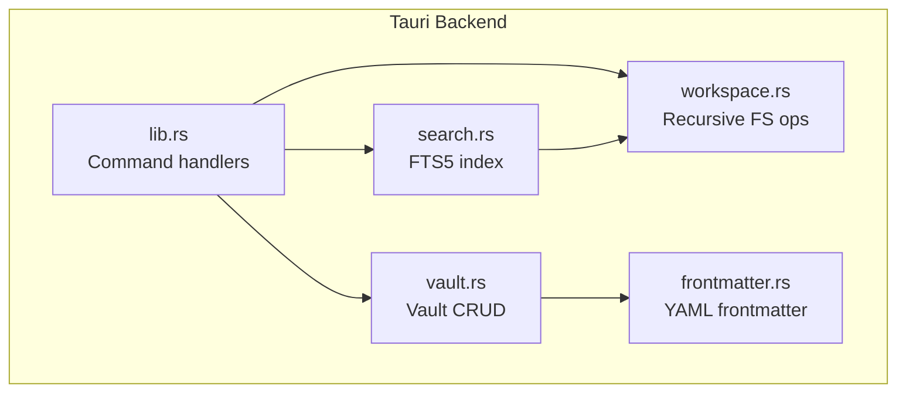

**Diagram sources**
- [lib.rs:98-342](file://apps/fracta/src-tauri/src/lib.rs#L98-L342)
- [workspace.rs:175-231](file://apps/fracta/src-tauri/src/workspace.rs#L175-L231)
- [vault.rs:128-157](file://apps/fracta/src-tauri/src/vault.rs#L128-L157)
- [search.rs:24-36](file://apps/fracta/src-tauri/src/search.rs#L24-L36)
- [frontmatter.rs:145-178](file://apps/fracta/src-tauri/src/frontmatter.rs#L145-L178)

**Section sources**
- [lib.rs:98-342](file://apps/fracta/src-tauri/src/lib.rs#L98-L342)
- [workspace.rs:175-231](file://apps/fracta/src-tauri/src/workspace.rs#L175-L231)
- [vault.rs:128-157](file://apps/fracta/src-tauri/src/vault.rs#L128-L157)
- [search.rs:24-36](file://apps/fracta/src-tauri/src/search.rs#L24-L36)
- [frontmatter.rs:145-178](file://apps/fracta/src-tauri/src/frontmatter.rs#L145-L178)

## Core Components
- WorkspaceItem: Represents a single item in the workspace tree with path, name, kind, size, and modified timestamp.
- WorkspaceFile: Represents an opened text-based file with content, encoding, newline convention, read-only status, and metadata.
- FileKind: Enumerates supported types (Folder, Markdown, Text, Csv, Json, Pdf, Docx, Asset).
- Vault Entry: A .md note with frontmatter fields (title, category, tags, timestamps) and body.
- Search Index: SQLite FTS5 table storing path, title, metadata, body, and kind for fast queries.

Key capabilities:
- Recursive listing with ignore rules (.fractaignore), symlink safety, and hidden/system folder filtering.
- Safe path resolution preventing traversal outside the selected workspace root.
- Type-aware read/write with encoding preservation (UTF-8, UTF-8 BOM, UTF-16LE/BE) and newline detection.
- Preview extraction for PDF and DOCX without exposing raw paths to the webview.
- Link graph analysis for markdown documents within the workspace.
- CSV/JSON conversion utilities with delimiter inference and validation.
- Workspace watch events updating search index incrementally.

**Section sources**
- [workspace.rs:21-41](file://apps/fracta/src-tauri/src/workspace.rs#L21-L41)
- [workspace.rs:124-141](file://apps/fracta/src-tauri/src/workspace.rs#L124-L141)
- [workspace.rs:257-285](file://apps/fracta/src-tauri/src/workspace.rs#L257-L285)
- [workspace.rs:470-512](file://apps/fracta/src-tauri/src/workspace.rs#L470-L512)
- [workspace.rs:687-694](file://apps/fracta/src-tauri/src/workspace.rs#L687-L694)
- [workspace.rs:971-1010](file://apps/fracta/src-tauri/src/workspace.rs#L971-L1010)
- [workspace.rs:1138-1173](file://apps/fracta/src-tauri/src/workspace.rs#L1138-L1173)
- [search.rs:24-36](file://apps/fracta/src-tauri/src/search.rs#L24-L36)
- [vault.rs:28-52](file://apps/fracta/src-tauri/src/vault.rs#L28-L52)

## Architecture Overview
The workspace is exposed via Tauri commands that operate on a vault-scoped root path. All operations validate containment within the chosen workspace root. The frontend triggers commands like list_workspace_file, write_workspace_file, and watch_workspace. The workspace module performs safe I/O and returns structured results. Search indexing runs concurrently with file watching to keep results fresh.

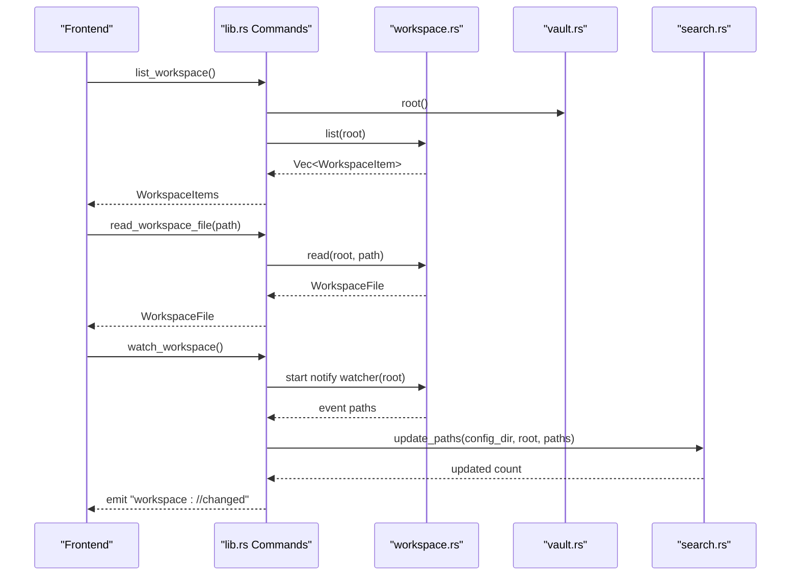

**Diagram sources**
- [lib.rs:100-165](file://apps/fracta/src-tauri/src/lib.rs#L100-L165)
- [workspace.rs:175-231](file://apps/fracta/src-tauri/src/workspace.rs#L175-L231)
- [search.rs:42-86](file://apps/fracta/src-tauri/src/search.rs#L42-L86)

## Detailed Component Analysis

### Workspace Item Structure and File Type Detection
- WorkspaceItem includes path, name, kind, size, and modified_at.
- FileKind is determined by extension and directory check.
- Sorting ensures deterministic listing order.

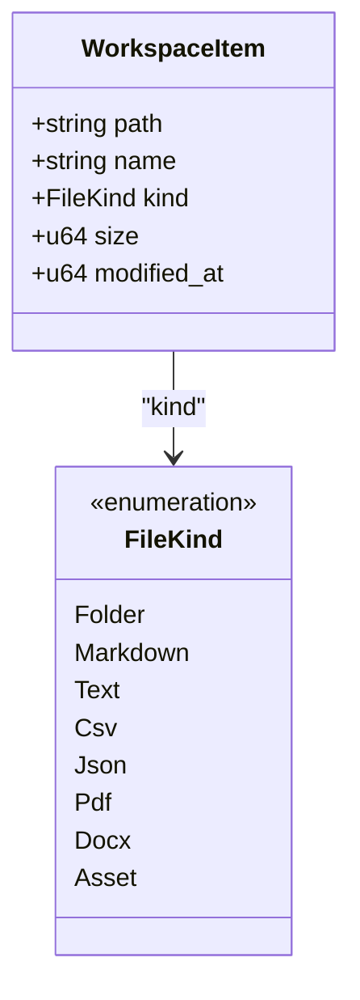

**Diagram sources**
- [workspace.rs:21-41](file://apps/fracta/src-tauri/src/workspace.rs#L21-L41)
- [workspace.rs:124-141](file://apps/fracta/src-tauri/src/workspace.rs#L124-L141)

**Section sources**
- [workspace.rs:21-41](file://apps/fracta/src-tauri/src/workspace.rs#L21-L41)
- [workspace.rs:124-141](file://apps/fracta/src-tauri/src/workspace.rs#L124-L141)

### Recursive Navigation and Safety
- list(root) walks the directory tree recursively.
- Ignores patterns from .fractaignore and filters hidden/system folders.
- Symlinks are skipped to prevent recursion and escape.
- resolve(root, relative) enforces non-empty, non-absolute, no-traversal, and symlink containment checks.

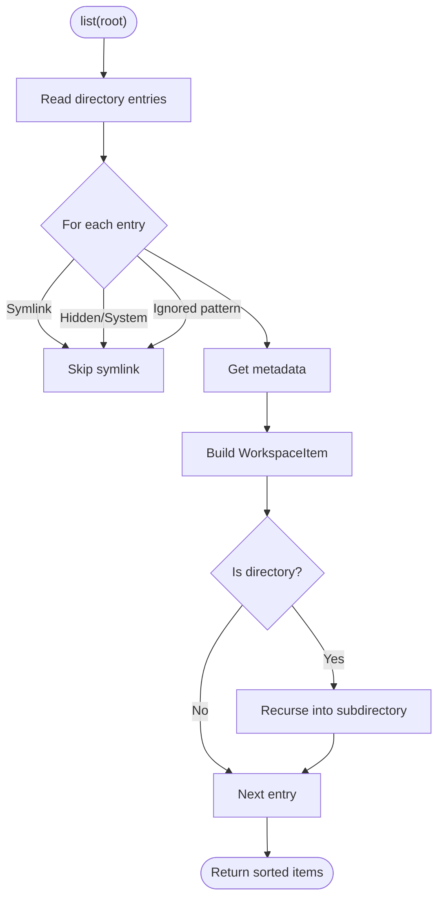

**Diagram sources**
- [workspace.rs:175-231](file://apps/fracta/src-tauri/src/workspace.rs#L175-L231)
- [workspace.rs:143-173](file://apps/fracta/src-tauri/src/workspace.rs#L143-L173)

**Section sources**
- [workspace.rs:175-231](file://apps/fracta/src-tauri/src/workspace.rs#L175-L231)
- [workspace.rs:143-173](file://apps/fracta/src-tauri/src/workspace.rs#L143-L173)

### Reading and Writing Text Files with Encoding Preservation
- read(root, relative) detects kind and decodes text safely.
- Supports UTF-8, UTF-8 BOM, UTF-16LE/BE; other encodings are read-only.
- Newline convention detected and preserved.
- write(root, relative, content) validates JSON and CSV, preserves existing encoding/newlines, and writes safely.

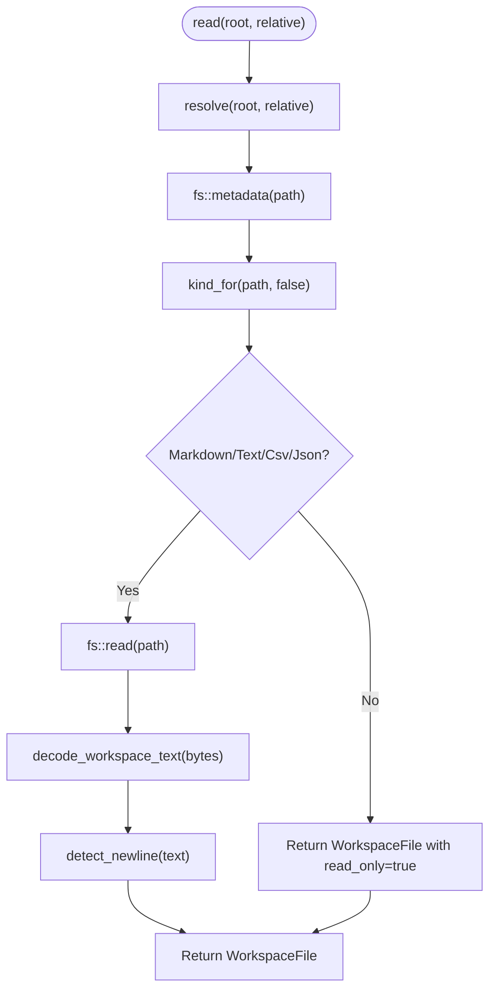

**Diagram sources**
- [workspace.rs:257-285](file://apps/fracta/src-tauri/src/workspace.rs#L257-L285)
- [workspace.rs:470-512](file://apps/fracta/src-tauri/src/workspace.rs#L470-L512)
- [workspace.rs:541-551](file://apps/fracta/src-tauri/src/workspace.rs#L541-L551)

**Section sources**
- [workspace.rs:257-285](file://apps/fracta/src-tauri/src/workspace.rs#L257-L285)
- [workspace.rs:470-512](file://apps/fracta/src-tauri/src/workspace.rs#L470-L512)
- [workspace.rs:541-551](file://apps/fracta/src-tauri/src/workspace.rs#L541-L551)

### Previewing PDF and DOCX Without Exposing Paths
- pdf_bytes(root, relative) returns bytes after kind and containment checks.
- preview(root, relative) extracts text from PDF pages and DOCX blocks, including headings, lists, tables, and embedded images.
- docx_image(root, relative, archive_path) reads embedded images from DOCX archives safely.

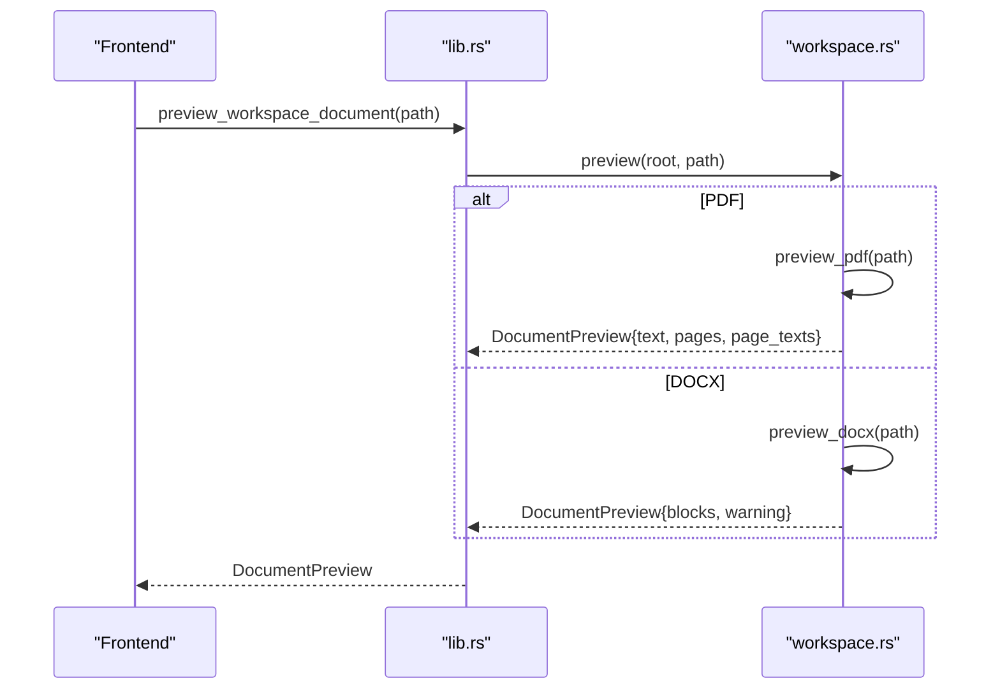

**Diagram sources**
- [lib.rs:269-275](file://apps/fracta/src-tauri/src/lib.rs#L269-L275)
- [workspace.rs:687-694](file://apps/fracta/src-tauri/src/workspace.rs#L687-L694)
- [workspace.rs:742-767](file://apps/fracta/src-tauri/src/workspace.rs#L742-L767)
- [workspace.rs:769-923](file://apps/fracta/src-tauri/src/workspace.rs#L769-L923)

**Section sources**
- [workspace.rs:687-694](file://apps/fracta/src-tauri/src/workspace.rs#L687-L694)
- [workspace.rs:742-767](file://apps/fracta/src-tauri/src/workspace.rs#L742-L767)
- [workspace.rs:769-923](file://apps/fracta/src-tauri/src/workspace.rs#L769-L923)

### Link Graph and Orphan Detection
- links(root, relative) computes forward/backlinks, dead links, suggestions, and orphan status for a markdown file.
- graph(root) builds nodes, edges, hubs, and orphans across all markdown files.

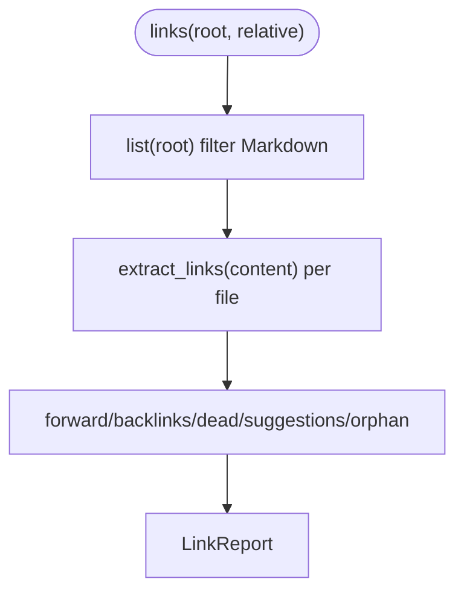

**Diagram sources**
- [workspace.rs:971-1010](file://apps/fracta/src-tauri/src/workspace.rs#L971-L1010)
- [workspace.rs:1060-1072](file://apps/fracta/src-tauri/src/workspace.rs#L1060-L1072)
- [workspace.rs:1074-1136](file://apps/fracta/src-tauri/src/workspace.rs#L1074-L1136)

**Section sources**
- [workspace.rs:971-1010](file://apps/fracta/src-tauri/src/workspace.rs#L971-L1010)
- [workspace.rs:1060-1072](file://apps/fracta/src-tauri/src/workspace.rs#L1060-L1072)
- [workspace.rs:1074-1136](file://apps/fracta/src-tauri/src/workspace.rs#L1074-L1136)

### CSV/JSON Conversion Utilities
- csv_to_json(content, delimiter, infer_types) parses CSV headers, validates uniqueness, converts rows to objects, and optionally infers boolean/number types.
- json_to_csv(content, delimiter) requires top-level array of objects, normalizes columns, and serializes values.

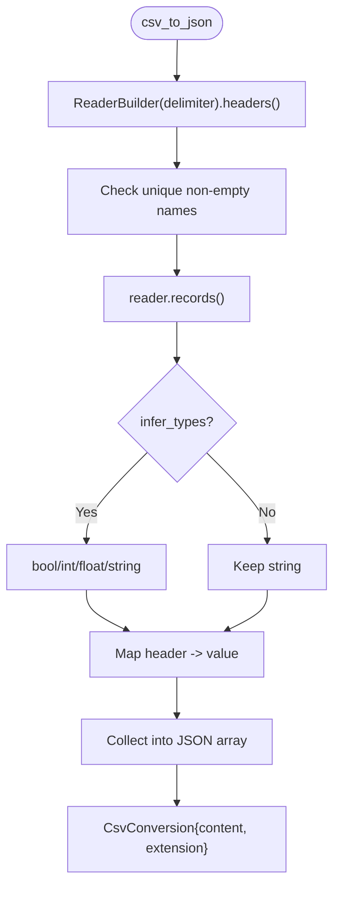

**Diagram sources**
- [workspace.rs:1138-1173](file://apps/fracta/src-tauri/src/workspace.rs#L1138-L1173)
- [workspace.rs:1175-1191](file://apps/fracta/src-tauri/src/workspace.rs#L1175-L1191)
- [workspace.rs:1193-1230](file://apps/fracta/src-tauri/src/workspace.rs#L1193-L1230)

**Section sources**
- [workspace.rs:1138-1173](file://apps/fracta/src-tauri/src/workspace.rs#L1138-L1173)
- [workspace.rs:1175-1191](file://apps/fracta/src-tauri/src/workspace.rs#L1175-L1191)
- [workspace.rs:1193-1230](file://apps/fracta/src-tauri/src/workspace.rs#L1193-L1230)

### Integration with Vault System
- Vault stores user-chosen folder of .md entries with frontmatter metadata.
- Workspace root is derived from vault.root(), ensuring all workspace operations are scoped to the same directory.
- Frontend can import workspace markdown files as vault entries by creating new entries and writing frontmatter/body.
- Bidirectional sync:
  - Workspace changes trigger search updates and can be mirrored to vault entries if needed.
  - Vault entries are standard .md files; workspace listing includes them when they reside under the workspace root.

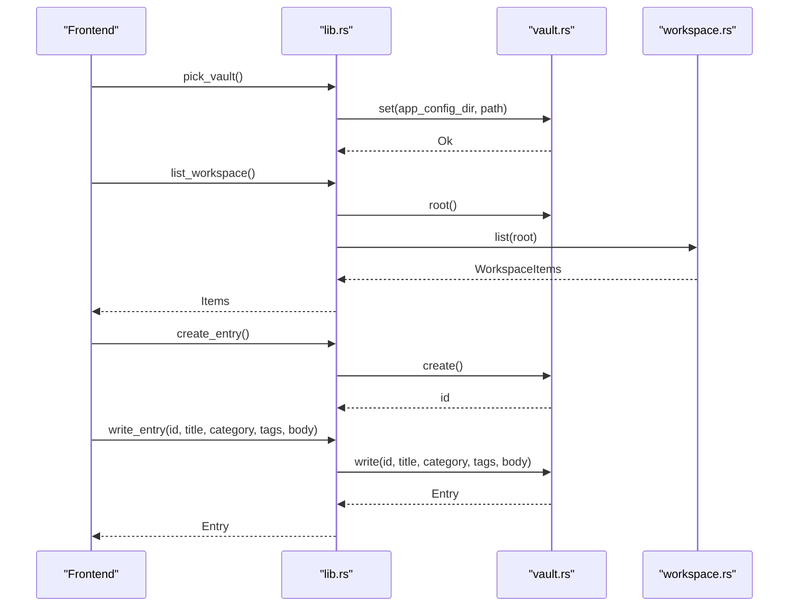

**Diagram sources**
- [lib.rs:54-96](file://apps/fracta/src-tauri/src/lib.rs#L54-L96)
- [vault.rs:95-106](file://apps/fracta/src-tauri/src/vault.rs#L95-L106)
- [vault.rs:193-208](file://apps/fracta/src-tauri/src/vault.rs#L193-L208)
- [vault.rs:212-267](file://apps/fracta/src-tauri/src/vault.rs#L212-L267)

**Section sources**
- [vault.rs:95-106](file://apps/fracta/src-tauri/src/vault.rs#L95-L106)
- [vault.rs:193-208](file://apps/fracta/src-tauri/src/vault.rs#L193-L208)
- [vault.rs:212-267](file://apps/fracta/src-tauri/src/vault.rs#L212-L267)

### Relationship Between Workspace Items and Vault Entries
- WorkspaceItem represents any file/folder under the workspace root, including vault .md files.
- Vault Entry is a structured representation of a .md file with frontmatter fields.
- Import workflow:
  - User selects a workspace markdown file.
  - Frontend creates a vault entry and writes frontmatter/body.
  - Subsequent workspace listings include the imported file if it remains under the workspace root.

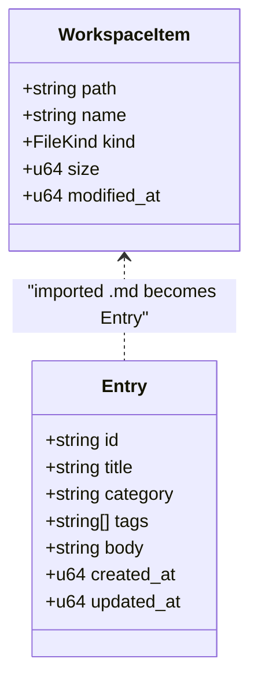

**Diagram sources**
- [workspace.rs:21-41](file://apps/fracta/src-tauri/src/workspace.rs#L21-L41)
- [vault.rs:28-52](file://apps/fracta/src-tauri/src/vault.rs#L28-L52)

**Section sources**
- [workspace.rs:21-41](file://apps/fracta/src-tauri/src/workspace.rs#L21-L41)
- [vault.rs:28-52](file://apps/fracta/src-tauri/src/vault.rs#L28-L52)

## Dependency Analysis
- lib.rs exposes Tauri commands that delegate to workspace.rs and vault.rs.
- search.rs depends on workspace.rs for listing and preview to build/update the index.
- vault.rs uses frontmatter.rs for parsing/serializing .md files.
- workspace.rs uses std fs, zip, quick_xml, lopdf, csv, serde_json for robust file handling.

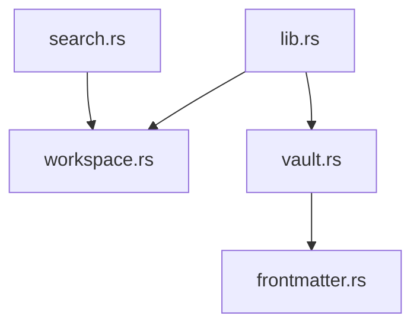

**Diagram sources**
- [lib.rs:1-6](file://apps/fracta/src-tauri/src/lib.rs#L1-L6)
- [search.rs:4-7](file://apps/fracta/src-tauri/src/search.rs#L4-L7)
- [vault.rs:7-12](file://apps/fracta/src-tauri/src/vault.rs#L7-L12)

**Section sources**
- [lib.rs:1-6](file://apps/fracta/src-tauri/src/lib.rs#L1-L6)
- [search.rs:4-7](file://apps/fracta/src-tauri/src/search.rs#L4-L7)
- [vault.rs:7-12](file://apps/fracta/src-tauri/src/vault.rs#L7-L12)

## Performance Considerations
- Recursive listing sorts items by path; consider lazy pagination in the UI for very large trees.
- Watcher emits events; search updates are incremental unless .fractaignore changes, which triggers full rebuild.
- Media assets enforce size limits (e.g., 256 MB) to avoid memory pressure.
- PDF/DOCX preview extracts text locally; complex layouts may not render perfectly but avoids heavy rendering overhead.
- CSV/JSON conversions run in-memory; ensure inputs fit within memory constraints.

[No sources needed since this section provides general guidance]

## Troubleshooting Guide
Common errors and resolutions:
- Path traversal rejected: Ensure relative paths do not contain “..” or absolute prefixes.
- Symlink outside workspace: Symlinks pointing outside the workspace root are blocked; use copies or adjust workspace root.
- Permission denied: OS-level permissions may block read/write; verify file ownership and access rights.
- Invalid JSON/CSV: Write operations validate structure; fix malformed data before saving.
- Unsupported encoding: Non-UTF-8/UTF-16 files are read-only; convert to supported encoding to edit.
- Large media files: Inline media limited to 256 MB; open externally for larger files.

**Section sources**
- [workspace.rs:143-173](file://apps/fracta/src-tauri/src/workspace.rs#L143-L173)
- [workspace.rs:328-364](file://apps/fracta/src-tauri/src/workspace.rs#L328-L364)
- [workspace.rs:384-430](file://apps/fracta/src-tauri/src/workspace.rs#L384-L430)
- [workspace.rs:470-512](file://apps/fracta/src-tauri/src/workspace.rs#L470-L512)

## Conclusion
Fracta’s workspace provides a secure, efficient, and feature-rich way to navigate and manage files beyond the vault. With robust type detection, encoding preservation, preview extraction, and integrated search, users can browse and organize external content seamlessly. Vault integration enables importing workspace markdown as structured entries, supporting bidirectional workflows. Performance safeguards and comprehensive error handling ensure reliability even with large directory trees and diverse file types.

[No sources needed since this section summarizes without analyzing specific files]