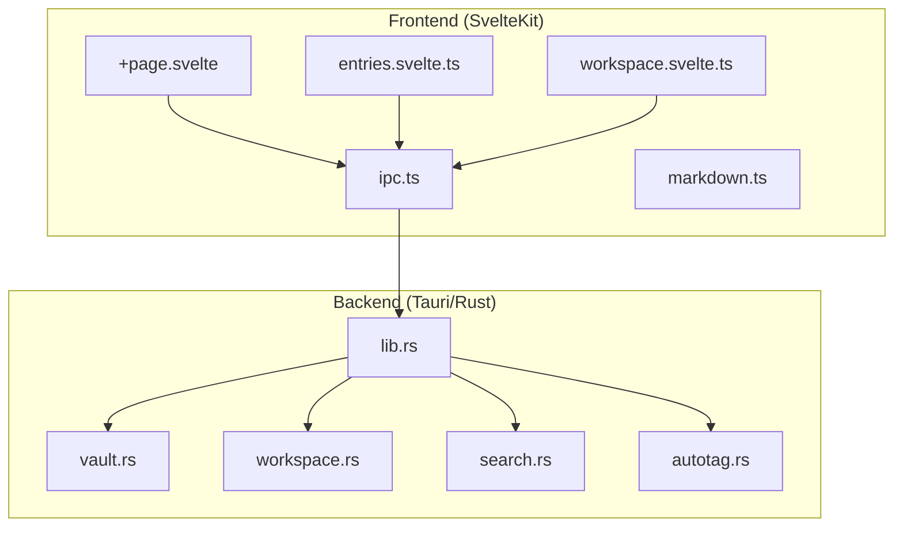
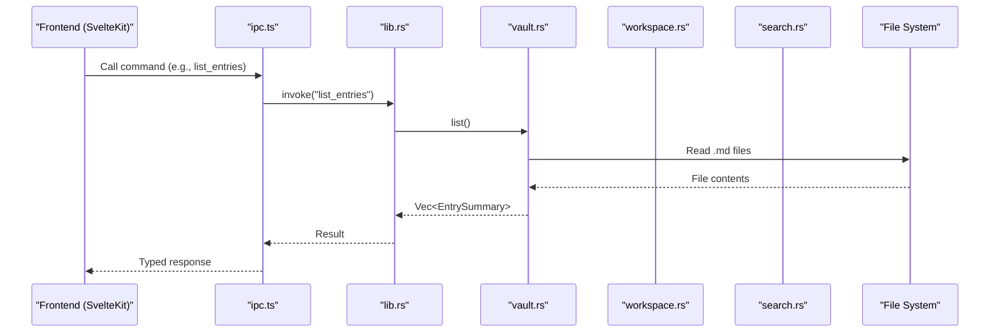
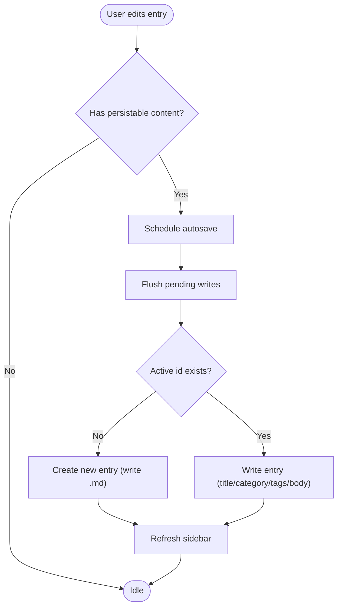
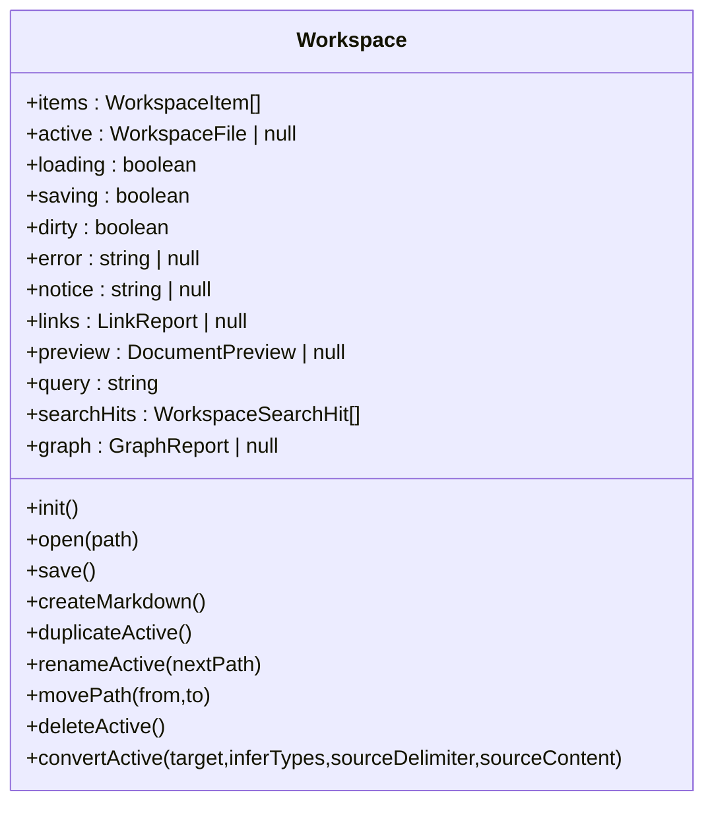
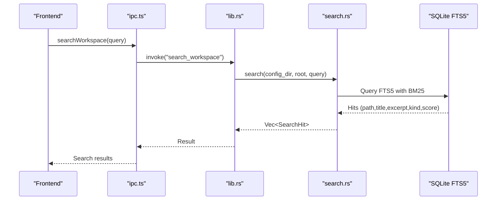
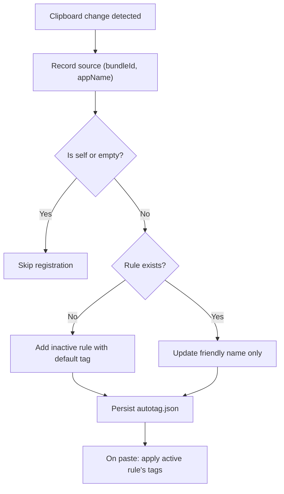
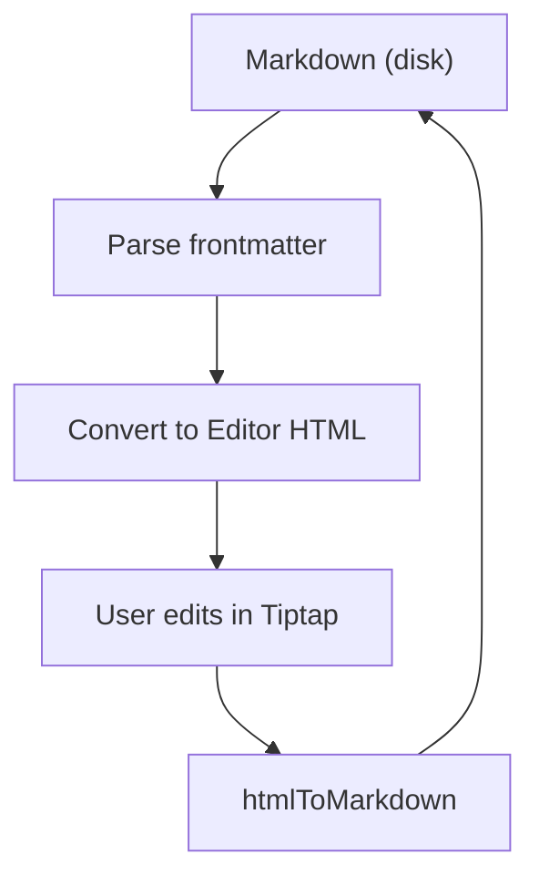
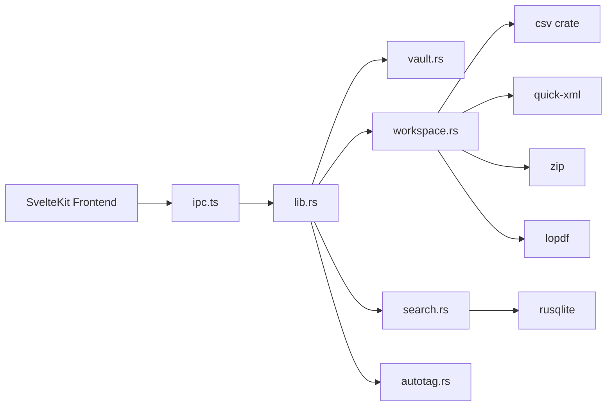

# Fracta Notes App

<cite>
**Referenced Files in This Document**
- [lib.rs](file://apps/fracta/src-tauri/src/lib.rs)
- [vault.rs](file://apps/fracta/src-tauri/src/vault.rs)
- [workspace.rs](file://apps/fracta/src-tauri/src/workspace.rs)
- [search.rs](file://apps/fracta/src-tauri/src/search.rs)
- [autotag.rs](file://apps/fracta/src-tauri/src/autotag.rs)
- [ipc.ts](file://apps/fracta/src/lib/ipc.ts)
- [entries.svelte.ts](file://apps/fracta/src/lib/state/entries.svelte.ts)
- [workspace.svelte.ts](file://apps/fracta/src/lib/state/workspace.svelte.ts)
- [markdown.ts](file://apps/fracta/src/lib/markdown.ts)
- [Cargo.toml](file://apps/fracta/src-tauri/Cargo.toml)
- [tauri.conf.json](file://apps/fracta/src-tauri/tauri.conf.json)
- [+page.svelte](file://apps/fracta/src/routes/+page.svelte)
</cite>

## Table of Contents
1. [Introduction](#introduction)
2. [Project Structure](#project-structure)
3. [Core Components](#core-components)
4. [Architecture Overview](#architecture-overview)
5. [Detailed Component Analysis](#detailed-component-analysis)
6. [Dependency Analysis](#dependency-analysis)
7. [Performance Considerations](#performance-considerations)
8. [Troubleshooting Guide](#troubleshooting-guide)
9. [Conclusion](#conclusion)
10. [Appendices](#appendices)

## Introduction
Fracta is a local-first desktop knowledge management application built with SvelteKit and Tauri. It keeps your notes, documents, data files, search index, and agent context inside a user-chosen project folder on disk. The Rust backend exposes secure commands for vault entry CRUD, recursive workspace operations, file system monitoring, search indexing, auto-tagging by source app, and safe execution of terminal commands within the selected workspace. The Svelte frontend provides a rich editing experience (Markdown to HTML conversion and editor round-trip), workspace browsing, search, and rule configuration for auto-tagging.

This document explains both conceptual workflows for beginners and technical details for experienced developers working with Tauri commands, SQLite FTS5 indexing, and file system monitoring.

## Project Structure
At a high level:
- Frontend (SvelteKit + TypeScript): UI, state stores, IPC bindings, Markdown rendering utilities.
- Backend (Rust + Tauri): Command handlers for vault, workspace, search, autotag, and GGUF engine; file system watcher; OS integration.

**Diagram sources**
- [+page.svelte:1-72](file://apps/fracta/src/routes/+page.svelte#L1-L72)
- [ipc.ts:1-237](file://apps/fracta/src/lib/ipc.ts#L1-L237)
- [entries.svelte.ts:1-288](file://apps/fracta/src/lib/state/entries.svelte.ts#L1-L288)
- [workspace.svelte.ts:1-321](file://apps/fracta/src/lib/state/workspace.svelte.ts#L1-L321)
- [markdown.ts:1-207](file://apps/fracta/src/lib/markdown.ts#L1-L207)
- [lib.rs:1-498](file://apps/fracta/src-tauri/src/lib.rs#L1-L498)
- [vault.rs:1-495](file://apps/fracta/src-tauri/src/vault.rs#L1-L495)
- [workspace.rs:1-800](file://apps/fracta/src-tauri/src/workspace.rs#L1-L800)
- [search.rs:1-346](file://apps/fracta/src-tauri/src/search.rs#L1-L346)
- [autotag.rs:1-320](file://apps/fracta/src-tauri/src/autotag.rs#L1-L320)

**Section sources**
- [tauri.conf.json:1-48](file://apps/fracta/src-tauri/tauri.conf.json#L1-L48)
- [Cargo.toml:1-44](file://apps/fracta/src-tauri/Cargo.toml#L1-L44)

## Core Components
- Vault: On-disk Markdown entries with frontmatter metadata, safe id resolution, and persistence under a user-selected directory.
- Workspace: Recursive file operations over the entire project folder, including read/write for text-based formats, asset handling, preview extraction for PDF/DOCX, and link/graph analysis.
- Search: SQLite FTS5 index stored under the app config directory, rebuilt or incrementally updated via filesystem events.
- Auto-tag: Clipboard-source attribution on macOS; rules map apps to tags applied when pasting into an entry.
- IPC layer: TypeScript functions that call Tauri commands, typed interfaces for all payloads.

Key responsibilities:
- lib.rs registers Tauri commands and manages global state (Vault, AutoTag, GgufEngine).
- vault.rs implements Entry CRUD and frontmatter serialization/deserialization.
- workspace.rs handles path-safe operations, encoding preservation, CSV/JSON validation, and previews.
- search.rs builds and queries the FTS5 index; update_paths reacts to filesystem changes.
- autotag.rs persists rules and tracks clipboard source.

**Section sources**
- [lib.rs:1-498](file://apps/fracta/src-tauri/src/lib.rs#L1-L498)
- [vault.rs:1-495](file://apps/fracta/src-tauri/src/vault.rs#L1-L495)
- [workspace.rs:1-800](file://apps/fracta/src-tauri/src/workspace.rs#L1-L800)
- [search.rs:1-346](file://apps/fracta/src-tauri/src/search.rs#L1-L346)
- [autotag.rs:1-320](file://apps/fracta/src-tauri/src/autotag.rs#L1-L320)
- [ipc.ts:1-237](file://apps/fracta/src/lib/ipc.ts#L1-L237)

## Architecture Overview
The app follows a clear separation between the webview (SvelteKit) and native backend (Tauri/Rust). Commands are invoked from the frontend through ipc.ts, which maps to Rust functions in lib.rs. Data flows back as strongly-typed structures.

**Diagram sources**
- [ipc.ts:1-237](file://apps/fracta/src/lib/ipc.ts#L1-L237)
- [lib.rs:1-498](file://apps/fracta/src-tauri/src/lib.rs#L1-L498)
- [vault.rs:1-495](file://apps/fracta/src-tauri/src/vault.rs#L1-L495)

## Detailed Component Analysis

### Vault Management (Entries CRUD)
- Entry model includes id, title, category, tags, body, created_at, updated_at.
- Ids are file stems; paths are resolved safely to prevent traversal.
- Frontmatter fields are persisted; titles can be derived from body if blank.
- Autosave flow serializes writes and refreshes the sidebar after save.

**Diagram sources**
- [entries.svelte.ts:1-288](file://apps/fracta/src/lib/state/entries.svelte.ts#L1-L288)
- [vault.rs:1-495](file://apps/fracta/src-tauri/src/vault.rs#L1-L495)

Practical examples:
- Create a new entry: call create_entry via ipc.ts; backend creates a unique id and writes a .md with frontmatter timestamps.
- Save an existing entry: write_entry sends id, title, category, tags, body; backend validates and persists.
- Delete an entry: delete_entry moves to OS trash or removes the file.

**Section sources**
- [entries.svelte.ts:1-288](file://apps/fracta/src/lib/state/entries.svelte.ts#L1-L288)
- [vault.rs:1-495](file://apps/fracta/src-tauri/src/vault.rs#L1-L495)
- [ipc.ts:1-237](file://apps/fracta/src/lib/ipc.ts#L1-L237)

### Workspace Operations
- Supports listing, reading, writing, moving, duplicating, deleting, revealing, and opening items.
- Text encodings preserved (UTF-8, UTF-8 BOM, UTF-16LE/BE); newline conventions detected.
- CSV/JSON validated before write; conversions supported.
- PDF/DOCX preview extracts text locally without exposing host paths.

**Diagram sources**
- [workspace.svelte.ts:1-321](file://apps/fracta/src/lib/state/workspace.svelte.ts#L1-L321)

Practical examples:
- Open a file: readWorkspaceFile returns content, encoding, newline; JSON invalid drafts are recovered from localStorage.
- Save a file: writeWorkspaceFile validates JSON/CSV, preserves encoding/newline, updates tree and links.
- Convert CSV to JSON or vice versa: convertCsvToJson / convertJsonToCsv produce a new file path to avoid overwriting.

**Section sources**
- [workspace.svelte.ts:1-321](file://apps/fracta/src/lib/state/workspace.svelte.ts#L1-L321)
- [workspace.rs:1-800](file://apps/fracta/src-tauri/src/workspace.rs#L1-L800)
- [ipc.ts:1-237](file://apps/fracta/src/lib/ipc.ts#L1-L237)

### Search and Indexing
- Uses SQLite FTS5 virtual table under the app config directory.
- Rebuild scans the workspace and indexes Markdown, TXT, CSV, JSON, PDF, DOCX.
- Incremental updates react to filesystem events; .fractaignore changes trigger full rebuild.

**Diagram sources**
- [ipc.ts:1-237](file://apps/fracta/src/lib/ipc.ts#L1-L237)
- [lib.rs:1-498](file://apps/fracta/src-tauri/src/lib.rs#L1-L498)
- [search.rs:1-346](file://apps/fracta/src-tauri/src/search.rs#L1-L346)

Practical examples:
- Rebuild index: rebuild_workspace_index scans workspace and populates FTS5.
- Incremental update: watch_workspace emits workspace://changed; update_paths deletes affected records and re-indexes changed files.

**Section sources**
- [search.rs:1-346](file://apps/fracta/src-tauri/src/search.rs#L1-L346)
- [lib.rs:1-498](file://apps/fracta/src-tauri/src/lib.rs#L1-L498)

### Auto-tagging System
- Tracks the current clipboard source app on macOS using NSPasteboard and NSWorkspace.
- Rules map bundle ids to tags; newly seen apps are added inactive with a default tag.
- When pasting into an entry, active rule’s tags are merged into the entry’s tags.

**Diagram sources**
- [autotag.rs:1-320](file://apps/fracta/src-tauri/src/autotag.rs#L1-L320)
- [entries.svelte.ts:1-288](file://apps/fracta/src/lib/state/entries.svelte.ts#L1-L288)

Practical examples:
- Configure a rule: upsert_app_rule sets tags and toggles active; list_app_rules shows current rules.
- Apply tags now: autotags_now returns tags for the current clipboard source if a rule is active.

**Section sources**
- [autotag.rs:1-320](file://apps/fracta/src-tauri/src/autotag.rs#L1-L320)
- [ipc.ts:1-237](file://apps/fracta/src/lib/ipc.ts#L1-L237)
- [entries.svelte.ts:1-288](file://apps/fracta/src/lib/state/entries.svelte.ts#L1-L288)

### Rich Text Editing and Markdown Round-trip
- Markdown is the source of truth; editor works in HTML. Conversion utilities ensure fidelity:
  - markdownToHtml for presentation.
  - markdownToEditorHtml for editor view, protecting Fracta extensions.
  - htmlToMarkdown for saving editor content back to Markdown.
- Task lists, tables, footnotes, and custom blocks are handled carefully to preserve portability.

**Diagram sources**
- [markdown.ts:1-207](file://apps/fracta/src/lib/markdown.ts#L1-L207)

**Section sources**
- [markdown.ts:1-207](file://apps/fracta/src/lib/markdown.ts#L1-L207)

## Dependency Analysis
- Frontend depends on ipc.ts for all Tauri calls.
- lib.rs wires Tauri commands to modules: vault, workspace, search, autotag.
- workspace.rs uses csv, quick-xml, zip, lopdf for parsing and previews.
- search.rs uses rusqlite for FTS5.
- autotag.rs uses platform-specific APIs on macOS.

**Diagram sources**
- [Cargo.toml:1-44](file://apps/fracta/src-tauri/Cargo.toml#L1-L44)
- [lib.rs:1-498](file://apps/fracta/src-tauri/src/lib.rs#L1-L498)

**Section sources**
- [Cargo.toml:1-44](file://apps/fracta/src-tauri/Cargo.toml#L1-L44)
- [lib.rs:1-498](file://apps/fracta/src-tauri/src/lib.rs#L1-L498)

## Performance Considerations
- Listing entries reads all .md files; summaries exclude bodies to keep it fast.
- Search uses FTS5 with BM25 ranking; incremental updates minimize rebuild cost.
- Workspace watcher triggers targeted updates; .fractaignore changes force full rebuild.
- Terminal command execution has bounded runtime and output size to prevent hangs and memory spikes.
- Media assets have size limits for inline rendering; large files should be opened externally.

[No sources needed since this section provides general guidance]

## Troubleshooting Guide
Common issues and resolutions:
- No vault configured: Use pick_vault to choose a folder; entries.init will refresh the list.
- Search returns no results: Trigger rebuild_workspace_index; check .fractaignore changes.
- Invalid JSON draft recovery: If JSON fails parse, a local draft is kept until corrected and saved.
- Encoding errors: Only UTF-8, UTF-8 BOM, and UTF-16LE/BE are editable; others are read-only.
- Path traversal blocked: Ensure ids and workspace paths do not contain ../ or absolute paths.
- Auto-tag not applying: Ensure the rule is active and the clipboard source matches the bundle id.

**Section sources**
- [entries.svelte.ts:1-288](file://apps/fracta/src/lib/state/entries.svelte.ts#L1-L288)
- [workspace.svelte.ts:1-321](file://apps/fracta/src/lib/state/workspace.svelte.ts#L1-L321)
- [search.rs:1-346](file://apps/fracta/src-tauri/src/search.rs#L1-L346)
- [workspace.rs:1-800](file://apps/fracta/src-tauri/src/workspace.rs#L1-L800)
- [autotag.rs:1-320](file://apps/fracta/src-tauri/src/autotag.rs#L1-L320)

## Conclusion
Fracta combines a robust Rust backend with a modern SvelteKit frontend to deliver a local-first knowledge workspace. Vault entries are simple Markdown files with frontmatter, while the workspace supports a broad range of file types with safe operations and previews. Search is powered by SQLite FTS5 and updated incrementally. Auto-tagging enriches entries based on clipboard source. Together, these components provide a powerful, extensible environment for note-taking and knowledge management.

[No sources needed since this section summarizes without analyzing specific files]

## Appendices

### Practical Examples

- Vault creation and entry management:
  - Choose a vault: pick_vault returns the chosen folder path; entries.init refreshes the sidebar.
  - Create entry: create_entry returns a stable id; subsequent write_entry persists frontmatter and body.
  - Delete entry: delete_entry removes the file via OS trash where available.

- Workspace operations:
  - List workspace: list_workspace returns sorted items with kinds and sizes.
  - Read/write files: read_workspace_file returns content and encoding; write_workspace_file validates and persists.
  - Preview PDF/DOCX: preview_workspace_document extracts text locally for viewing and search.

- Search queries:
  - Rebuild index: rebuild_workspace_index scans and indexes all supported files.
  - Search: search_workspace returns ranked hits with excerpts and scores.

- Auto-tagging rules:
  - List rules: list_app_rules returns current rules.
  - Upsert rule: upsert_app_rule adds or updates a rule and persists it.
  - Apply tags: autotags_now returns tags for the current clipboard source if a rule is active.

**Section sources**
- [ipc.ts:1-237](file://apps/fracta/src/lib/ipc.ts#L1-L237)
- [entries.svelte.ts:1-288](file://apps/fracta/src/lib/state/entries.svelte.ts#L1-L288)
- [workspace.svelte.ts:1-321](file://apps/fracta/src/lib/state/workspace.svelte.ts#L1-L321)
- [search.rs:1-346](file://apps/fracta/src-tauri/src/search.rs#L1-L346)
- [autotag.rs:1-320](file://apps/fracta/src-tauri/src/autotag.rs#L1-L320)