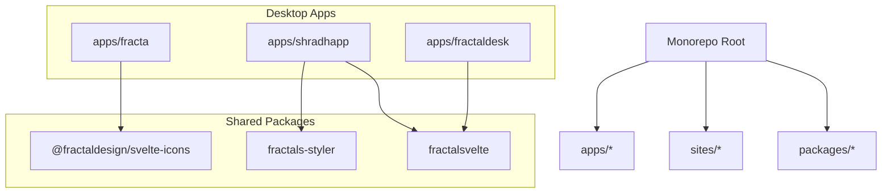
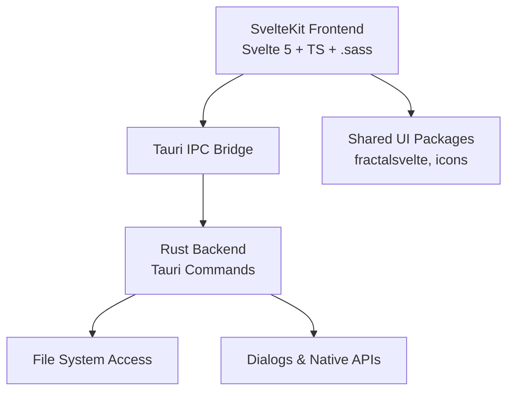
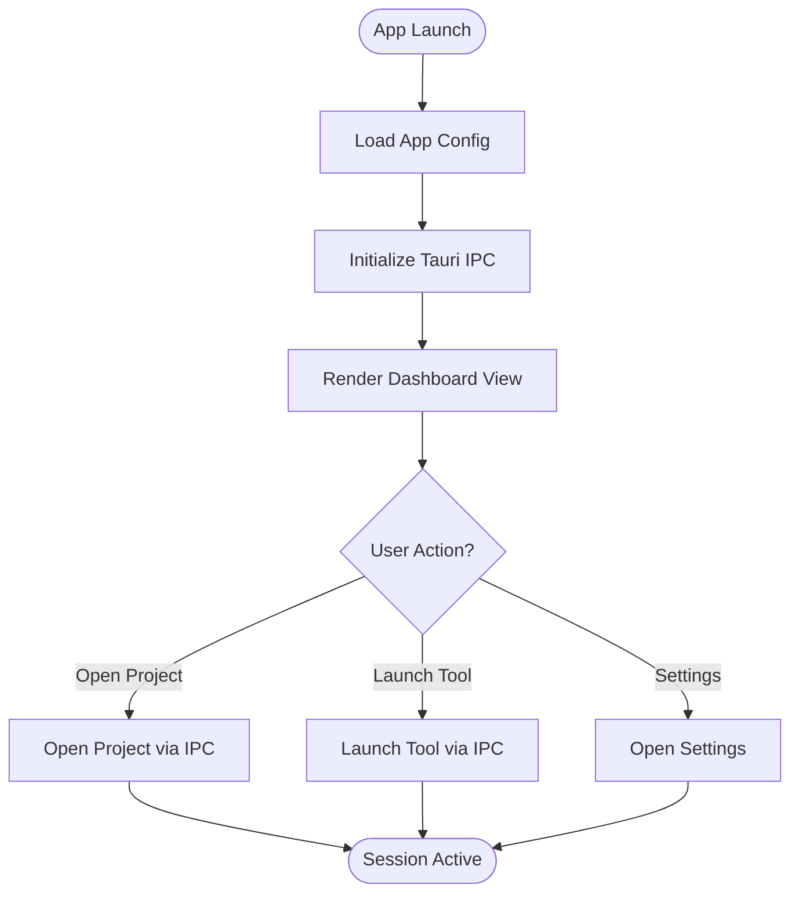
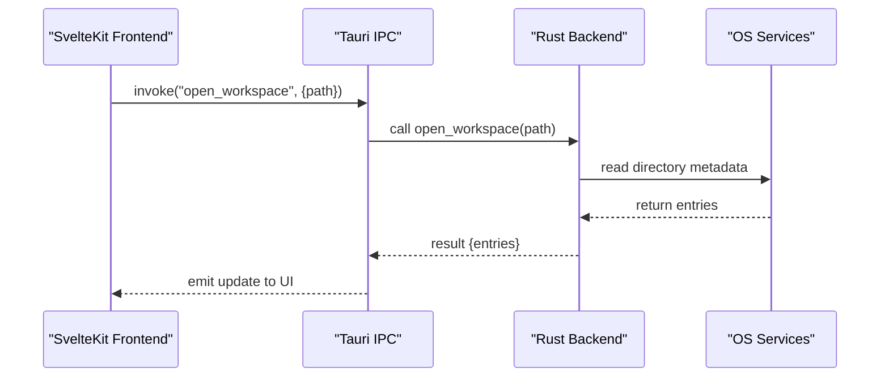
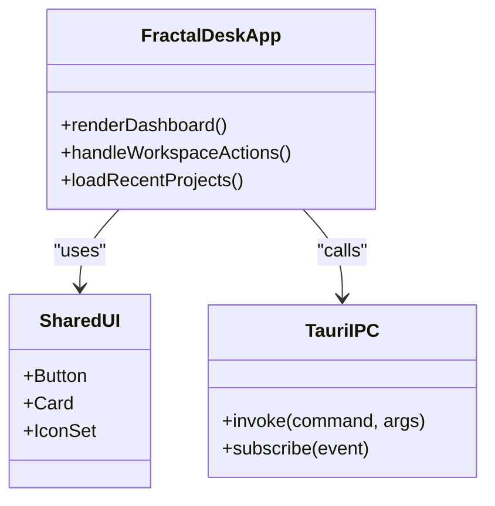
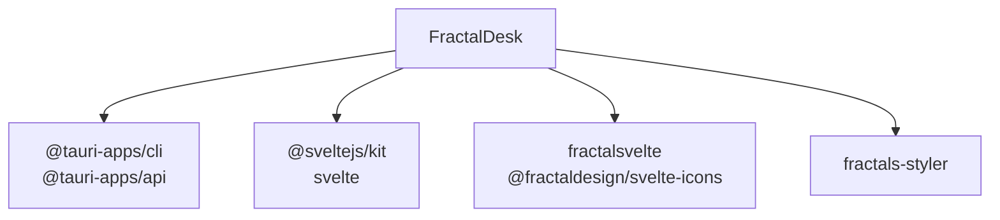

# FractalDesk

<cite>
**Referenced Files in This Document**
- [README.md](file://README.md)
- [package.json](file://package.json)
- [pnpm-workspace.yaml](file://pnpm-workspace.yaml)
- [apps/fractaldesk/AGENTS.md](file://apps/fractaldesk/AGENTS.md)
- [apps/fracta/package.json](file://apps/fracta/package.json)
- [apps/shradhapp/package.json](file://apps/shradhapp/package.json)
</cite>

## Table of Contents
1. [Introduction](#introduction)
2. [Project Structure](#project-structure)
3. [Core Components](#core-components)
4. [Architecture Overview](#architecture-overview)
5. [Detailed Component Analysis](#detailed-component-analysis)
6. [Dependency Analysis](#dependency-analysis)
7. [Performance Considerations](#performance-considerations)
8. [Troubleshooting Guide](#troubleshooting-guide)
9. [Conclusion](#conclusion)
10. [Appendices](#appendices)

## Introduction
FractalDesk is a desktop productivity application within the Fractals ecosystem, designed to serve as a desk/workspace management tool that helps users organize and navigate their work across the monorepo’s applications and knowledge assets. It fits into a SvelteKit + Svelte 5 + Tauri + TypeScript stack shared by other desktop apps in this repository. The workspace uses pnpm for dependency management and enforces consistent styling with single-tab indented SASS (.sass).

This document explains FractalDesk’s role in the monorepo architecture, its relationship to other Fractals applications (such as Fracta and ShradhApp), and how it integrates with shared packages and common architectural decisions used across the desktop applications. It also provides conceptual overviews for newcomers and technical details for experienced developers working with the FractalDesk implementation.

## Project Structure
The repository is a pnpm monorepo containing multiple apps, sites, and packages. Desktop applications are located under apps/, while shared libraries and UI components live under packages/. FractalDesk resides under apps/fractaldesk/ and currently contains agent-facing documentation files. Other desktop apps like Fracta and ShradhApp demonstrate the typical structure: a SvelteKit frontend and a Tauri backend (src-tauri/) exposing Rust commands via IPC.

**Diagram sources**
- [README.md:27-31](file://README.md#L27-L31)
- [package.json:29-33](file://package.json#L29-L33)
- [pnpm-workspace.yaml:1-6](file://pnpm-workspace.yaml#L1-L6)

**Section sources**
- [README.md:27-31](file://README.md#L27-L31)
- [package.json:29-33](file://package.json#L29-L33)
- [pnpm-workspace.yaml:1-6](file://pnpm-workspace.yaml#L1-L6)

## Core Components
FractalDesk’s core responsibilities include:
- Workspace orchestration: managing open projects, recent items, and quick access to tools across the monorepo.
- Integration with Tauri IPC: bridging the SvelteKit frontend to native capabilities (file system, dialogs, OS-level operations).
- Shared UI and styling: leveraging fractalsvelte and icon libraries for consistent design across desktop apps.
- Agent-friendly documentation: providing structured docs for AI agents to discover and interact with resources.

Key integration points:
- Tauri CLI and plugins for file system and dialog access.
- SvelteKit routing and layout patterns similar to Fracta and ShradhApp.
- Shared packages for icons and UI primitives.

**Section sources**
- [apps/fracta/package.json:21-34](file://apps/fracta/package.json#L21-L34)
- [apps/shradhapp/package.json:15-30](file://apps/shradhapp/package.json#L15-L30)
- [apps/fractaldesk/AGENTS.md:1-17](file://apps/fractaldesk/AGENTS.md#L1-L17)

## Architecture Overview
FractalDesk follows a layered architecture:
- Frontend layer: SvelteKit app with Svelte 5 components, TypeScript, and .sass styles.
- IPC bridge: Tauri commands exposed from Rust backend to handle native operations.
- Backend layer: Rust code packaged via Tauri for cross-platform distribution.

**Diagram sources**
- [apps/fracta/package.json:21-34](file://apps/fracta/package.json#L21-L34)
- [apps/shradhapp/package.json:15-30](file://apps/shradhapp/package.json#L15-L30)

## Detailed Component Analysis

### FractalDesk Application Shell
FractalDesk serves as the entry point for workspace management. It likely includes:
- A dashboard or launcher view for quick access to projects and tools.
- Recent items and favorites lists persisted via Tauri-backed storage.
- Navigation to other Fractals apps and sites through deep links or internal routes.

[No sources needed since this diagram shows conceptual workflow, not actual code structure]

### Tauri IPC Integration Pattern
Following the pattern seen in Fracta and ShradhApp, FractalDesk will expose Rust commands for:
- File system operations (read/write directories, manage project metadata).
- Dialog prompts (open/save file dialogs).
- OS integrations (launch external apps, copy paths, etc.).

**Diagram sources**
- [apps/fracta/package.json:21-34](file://apps/fracta/package.json#L21-L34)
- [apps/shradhapp/package.json:15-30](file://apps/shradhapp/package.json#L15-L30)

### Shared UI and Styling
FractalDesk leverages shared packages for consistent UI:
- fractalsvelte for component primitives.
- @fractaldesign/svelte-icons for animated icons.
- Single-tab indented .sass for styling consistency.

**Diagram sources**
- [apps/fracta/package.json:35-58](file://apps/fracta/package.json#L35-L58)
- [apps/shradhapp/package.json:15-30](file://apps/shradhapp/package.json#L15-L30)

**Section sources**
- [apps/fracta/package.json:21-34](file://apps/fracta/package.json#L21-L34)
- [apps/shradhapp/package.json:15-30](file://apps/shradhapp/package.json#L15-L30)
- [apps/fractaldesk/AGENTS.md:1-17](file://apps/fractaldesk/AGENTS.md#L1-L17)

## Dependency Analysis
FractalDesk shares dependencies with other desktop apps in the monorepo:
- Tauri CLI and API for IPC and native capabilities.
- SvelteKit and Svelte 5 for the frontend framework.
- Shared UI packages for consistent design.

**Diagram sources**
- [apps/fracta/package.json:21-34](file://apps/fracta/package.json#L21-L34)
- [apps/shradhapp/package.json:15-30](file://apps/shradhapp/package.json#L15-L30)

**Section sources**
- [package.json:29-33](file://package.json#L29-L33)
- [pnpm-workspace.yaml:1-6](file://pnpm-workspace.yaml#L1-L6)

## Performance Considerations
- Minimize IPC calls by batching operations where possible.
- Use lazy loading for heavy components and large datasets.
- Leverage Tauri’s efficient Rust backend for CPU-intensive tasks.
- Optimize .sass compilation by keeping styles modular and avoiding unnecessary re-renders.

[No sources needed since this section provides general guidance]

## Troubleshooting Guide
Common issues and resolutions:
- Tauri IPC errors: Ensure commands are properly registered in the Rust backend and invoked correctly from the frontend.
- SvelteKit build failures: Verify TypeScript configuration and Svelte 5 compatibility.
- Styling inconsistencies: Confirm single-tab indented .sass syntax is used consistently.
- Dependency conflicts: Use pnpm’s workspace features to resolve version mismatches.

**Section sources**
- [apps/fracta/package.json:21-34](file://apps/fracta/package.json#L21-L34)
- [apps/shradhapp/package.json:15-30](file://apps/shradhapp/package.json#L15-L30)

## Conclusion
FractalDesk serves as a central workspace management tool within the Fractals ecosystem, integrating seamlessly with other desktop applications through shared patterns and packages. Its architecture follows established conventions in the monorepo, ensuring consistency and maintainability across the suite of productivity tools. By leveraging Tauri for native capabilities and SvelteKit for the frontend, FractalDesk provides a robust foundation for organizing and accessing resources across the Fractals ecosystem.

[No sources needed since this section summarizes without analyzing specific files]

## Appendices

### Monorepo Scripts and Workspaces
The root package.json defines scripts for desktop development, including Tauri commands and build processes. The pnpm-workspace.yaml configures which packages are included in the workspace.

**Section sources**
- [package.json:5-27](file://package.json#L5-L27)
- [pnpm-workspace.yaml:1-6](file://pnpm-workspace.yaml#L1-L6)

### Agent Documentation
FractalDesk includes agent-readable documentation to facilitate AI-driven interactions and discovery of resources within the workspace.

**Section sources**
- [apps/fractaldesk/AGENTS.md:1-17](file://apps/fractaldesk/AGENTS.md#L1-L17)