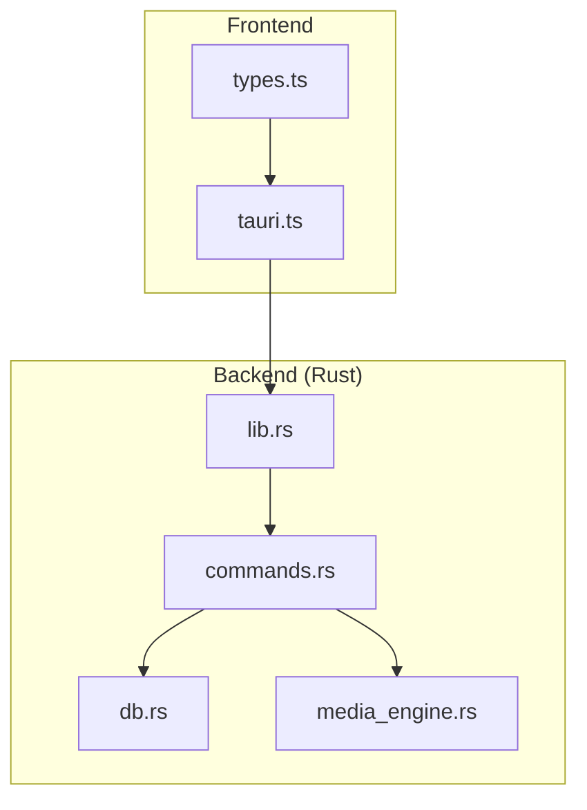
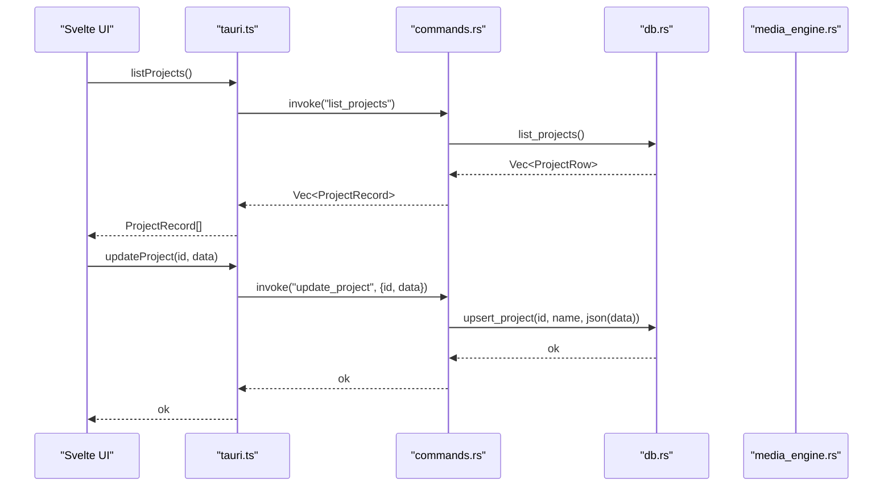
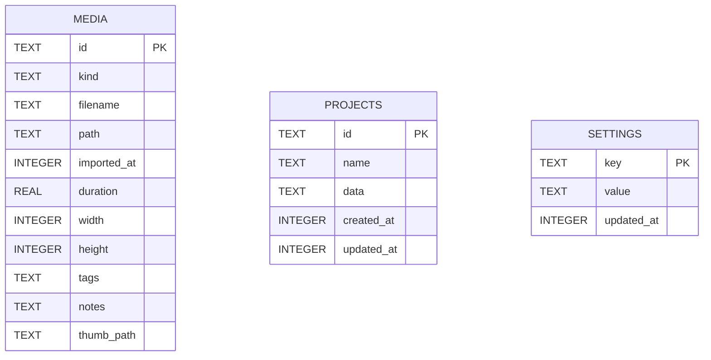
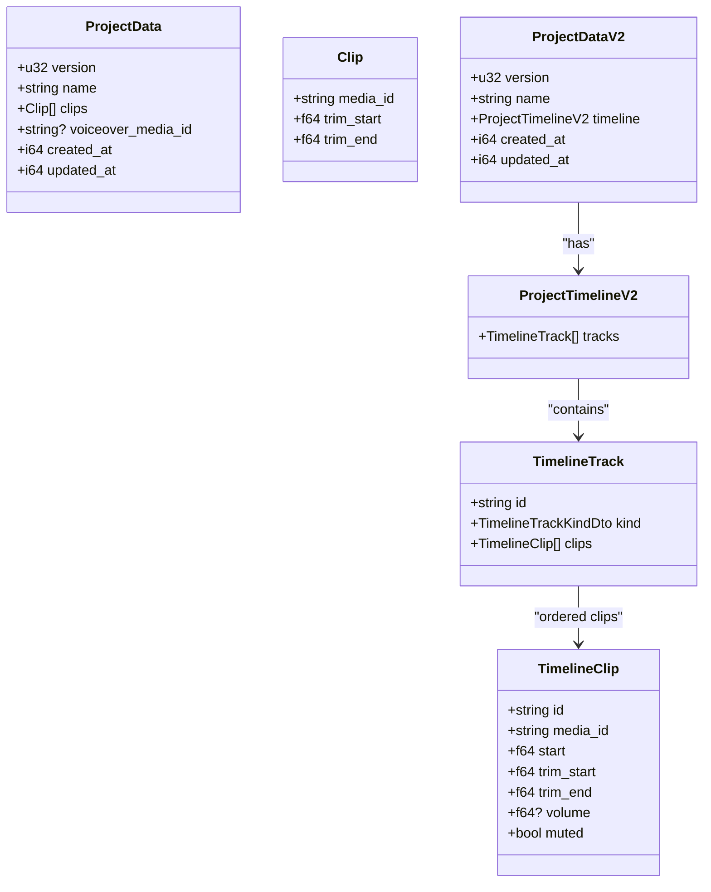
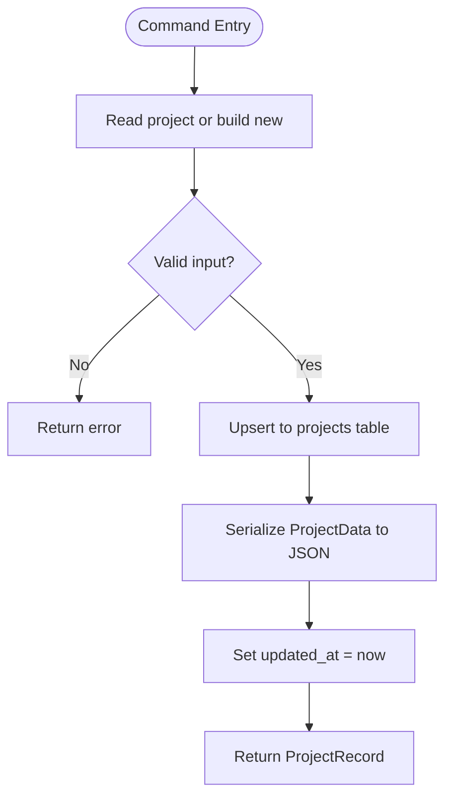
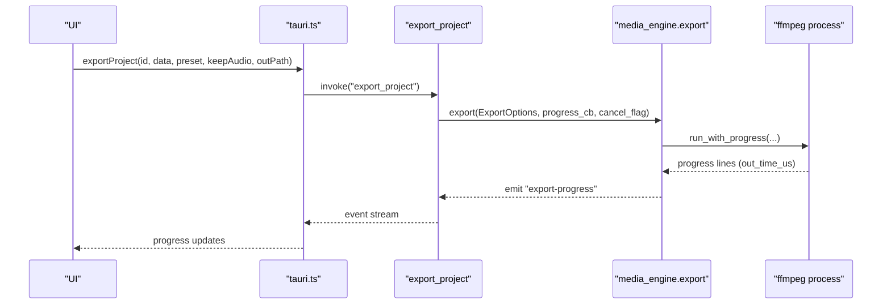
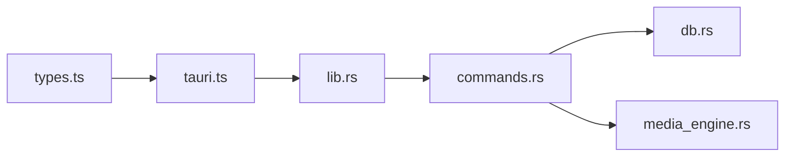

# Project Management

<cite>
**Referenced Files in This Document**
- [db.rs](file://apps/shradhapp/src-tauri/src/db.rs)
- [commands.rs](file://apps/shradhapp/src-tauri/src/commands.rs)
- [media_engine.rs](file://apps/shradhapp/src-tauri/src/media_engine.rs)
- [lib.rs](file://apps/shradhapp/src-tauri/src/lib.rs)
- [05-data-model-and-project-format.md](file://apps/shradhapp/docs/developer/05-data-model-and-project-format.md)
- [03-rust-backend.md](file://apps/shradhapp/docs/developer/03-rust-backend.md)
- [04-frontend.md](file://apps/shradhapp/docs/developer/04-frontend.md)
- [types.ts](file://apps/shradhapp/src/lib/backend/types.ts)
- [tauri.ts](file://apps/shradhapp/src/lib/backend/tauri.ts)
</cite>

## Table of Contents
1. [Introduction](#introduction)
2. [Project Structure](#project-structure)
3. [Core Components](#core-components)
4. [Architecture Overview](#architecture-overview)
5. [Detailed Component Analysis](#detailed-component-analysis)
6. [Dependency Analysis](#dependency-analysis)
7. [Performance Considerations](#performance-considerations)
8. [Troubleshooting Guide](#troubleshooting-guide)
9. [Conclusion](#conclusion)
10. [Appendices](#appendices)

## Introduction
This document explains the project management system in ShradhApp with a focus on:
- SQLite schema for project metadata, timeline configurations, and media references
- Tauri commands for project CRUD, backup/restore, and version migration
- Project template usage, autosave mechanisms, and conflict resolution strategies
- Programmatic manipulation, import/export workflows, and integration points

ShradhApp stores projects as versioned JSON blobs inside an SQLite database and uses ffmpeg/ffprobe for media operations. The frontend communicates via typed Tauri commands through a thin backend abstraction.

## Project Structure
At a high level:
- Rust backend (Tauri): commands, database layer, media engine
- Frontend (SvelteKit): backend interface types and Tauri bindings
- Documentation: data model and backend overview

**Diagram sources**
- [lib.rs:1-67](file://apps/shradhapp/src-tauri/src/lib.rs#L1-L67)
- [commands.rs:1-120](file://apps/shradhapp/src-tauri/src/commands.rs#L1-L120)
- [db.rs:1-82](file://apps/shradhapp/src-tauri/src/db.rs#L1-L82)
- [media_engine.rs:1-110](file://apps/shradhapp/src-tauri/src/media_engine.rs#L1-L110)
- [types.ts:1-173](file://apps/shradhapp/src/lib/backend/types.ts#L1-L173)
- [tauri.ts:1-105](file://apps/shradhapp/src/lib/backend/tauri.ts#L1-L105)

**Section sources**
- [03-rust-backend.md:1-60](file://apps/shradhapp/docs/developer/03-rust-backend.md#L1-L60)
- [04-frontend.md:1-60](file://apps/shradhapp/docs/developer/04-frontend.md#L1-L60)

## Core Components
- Database layer (SQLite):
  - Tables: media, projects, settings
  - Row models: MediaRow, ProjectRow, SettingRow
  - CRUD helpers for media and projects; upsert semantics preserve created timestamps
- Commands surface (Tauri):
  - Media bank operations (list, import, rename, tags, notes, delete)
  - Voiceover recording and cleanup
  - Projects CRUD, duplication, v1→v2 mapping
  - Export pipelines (v1 sequential and v2 timeline), progress events, cancellation
- Media engine (ffmpeg/ffprobe):
  - Probe, thumbnails/waveforms, audio cleanup/tick repair, export pipeline
- Frontend backend abstraction:
  - Typed interface and Tauri invocation wrapper

Key responsibilities:
- db.rs: persistence and schema initialization
- commands.rs: command handlers, project serialization, export orchestration
- media_engine.rs: all ffmpeg/ffprobe interactions
- lib.rs: app setup, AppState wiring, command registration
- types.ts + tauri.ts: frontend contract and IPC bridge

**Section sources**
- [db.rs:1-82](file://apps/shradhapp/src-tauri/src/db.rs#L1-L82)
- [commands.rs:777-998](file://apps/shradhapp/src-tauri/src/commands.rs#L777-L998)
- [media_engine.rs:252-412](file://apps/shradhapp/src-tauri/src/media_engine.rs#L252-L412)
- [lib.rs:10-66](file://apps/shradhapp/src-tauri/src/lib.rs#L10-L66)
- [types.ts:1-173](file://apps/shradhapp/src/lib/backend/types.ts#L1-L173)
- [tauri.ts:1-105](file://apps/shradhapp/src/lib/backend/tauri.ts#L1-L105)

## Architecture Overview
The runtime architecture connects the Svelte frontend to the Rust backend via Tauri commands. The backend manages a shared AppState containing the database handle, file directories, ffmpeg availability, and export cancellation flags.

**Diagram sources**
- [tauri.ts:73-77](file://apps/shradhapp/src/lib/backend/tauri.ts#L73-L77)
- [commands.rs:914-973](file://apps/shradhapp/src-tauri/src/commands.rs#L914-L973)
- [db.rs:196-267](file://apps/shradhapp/src-tauri/src/db.rs#L196-L267)

## Detailed Component Analysis

### SQLite Schema and Data Model
- media table: id, kind, filename, path, imported_at, duration, width, height, tags (JSON array), notes, thumb_path
- projects table: id, name, data (versioned JSON blob), created_at, updated_at
- settings table: key, value, updated_at

Notes:
- WAL mode enabled for concurrency
- Tags stored as JSON string; invalid values default to empty arrays
- Upserts preserve original created_at and always update updated_at

**Diagram sources**
- [db.rs:52-81](file://apps/shradhapp/src-tauri/src/db.rs#L52-L81)
- [05-data-model-and-project-format.md:26-63](file://apps/shradhapp/docs/developer/05-data-model-and-project-format.md#L26-L63)

**Section sources**
- [db.rs:1-82](file://apps/shradhapp/src-tauri/src/db.rs#L1-L82)
- [05-data-model-and-project-format.md:26-63](file://apps/shradhapp/docs/developer/05-data-model-and-project-format.md#L26-L63)

### Project Data Models and Versioning
- v1 ProjectData: version, name, clips[], voiceover_media_id?, created_at, updated_at
- v2 ProjectDataV2: version, name, timeline.tracks[], created_at, updated_at
- Timeline tracks: video/audio with ordered clips including start, trim_start, trim_end, volume, muted

Migration:
- map_project_v1_to_v2 converts v1 clips into a single video track and optional voiceover audio track

**Diagram sources**
- [commands.rs:777-836](file://apps/shradhapp/src-tauri/src/commands.rs#L777-L836)
- [commands.rs:804-836](file://apps/shradhapp/src-tauri/src/commands.rs#L804-L836)
- [commands.rs:838-890](file://apps/shradhapp/src-tauri/src/commands.rs#L838-L890)
- [types.ts:19-42](file://apps/shradhapp/src/lib/backend/types.ts#L19-L42)

**Section sources**
- [commands.rs:777-998](file://apps/shradhapp/src-tauri/src/commands.rs#L777-L998)
- [05-data-model-and-project-format.md:64-102](file://apps/shradhapp/docs/developer/05-data-model-and-project-format.md#L64-L102)
- [types.ts:19-42](file://apps/shradhapp/src/lib/backend/types.ts#L19-L42)

### Tauri Commands for Project CRUD and Migration
- list_projects: returns projects sorted by updated_at; data is parsed from JSON
- create_project: creates v1 ProjectData with empty clips and defaults
- update_project: enforces version field, updates name and timestamp, persists JSON
- delete_project: removes project row
- duplicate_project: deep copies project with new id and “copy” suffix
- map_project_v1_to_v2: transforms v1 to v2 timeline structure

**Diagram sources**
- [commands.rs:914-973](file://apps/shradhapp/src-tauri/src/commands.rs#L914-L973)
- [db.rs:217-242](file://apps/shradhapp/src-tauri/src/db.rs#L217-L242)

**Section sources**
- [commands.rs:914-998](file://apps/shradhapp/src-tauri/src/commands.rs#L914-L998)
- [db.rs:196-267](file://apps/shradhapp/src-tauri/src/db.rs#L196-L267)

### Backup and Restore
- Backup:
  - Copy the entire app data directory (includes media_bank.db, library/, thumbnails/)
  - Optionally snapshot the projects table SQL dump using sqlite utilities
- Restore:
  - Replace the app data directory with the backup contents
  - Ensure correct permissions and paths; verify DB integrity if needed

Implementation notes:
- All persistent state resides under the app data directory
- No built-in backup/restore command exists; use filesystem-level copy/restore

**Section sources**
- [05-data-model-and-project-format.md:10-24](file://apps/shradhapp/docs/developer/05-data-model-and-project-format.md#L10-L24)

### Project Template System
- Templates are not implemented in ShradhApp’s project system
- The repository contains template functionality in other apps (e.g., Fracta), but not in ShradhApp
- Recommendation: implement a simple template mechanism that clones a base ProjectData v1/v2 and applies user overrides before create_project

[No sources needed since this section provides general guidance]

### Autosave Mechanisms and Conflict Resolution
- Autosave:
  - Debounced save triggered after project mutations (add/remove/move clip, trims, voiceover changes)
  - Uses update_project to persist current snapshot
- Conflict resolution:
  - update_project uses upsert semantics preserving created_at and updating updated_at
  - Last-write-wins strategy; no merge conflicts are resolved automatically
  - For collaborative scenarios, consider optimistic locking based on updated_at or operational transforms

**Section sources**
- [04-frontend.md:98-106](file://apps/shradhapp/docs/developer/04-frontend.md#L98-L106)
- [commands.rs:949-973](file://apps/shradhapp/src-tauri/src/commands.rs#L949-L973)
- [db.rs:217-242](file://apps/shradhapp/src-tauri/src/db.rs#L217-L242)

### Export Pipeline and Timeline Rendering
- v1 export:
  - Resolves clips to segments (video/still/audio-only)
  - Normalizes each segment to uniform codec/resolution
  - Concatenates segments and finalizes audio mixing
- v2 timeline export:
  - Compiles a filter graph across multiple tracks
  - Renders a single output with overlays and mixed audio

**Diagram sources**
- [tauri.ts:82-94](file://apps/shradhapp/src/lib/backend/tauri.ts#L82-L94)
- [commands.rs:1016-1129](file://apps/shradhapp/src-tauri/src/commands.rs#L1016-L1129)
- [media_engine.rs:252-412](file://apps/shradhapp/src-tauri/src/media_engine.rs#L252-L412)

**Section sources**
- [03-rust-backend.md:85-127](file://apps/shradhapp/docs/developer/03-rust-backend.md#L85-L127)
- [media_engine.rs:252-412](file://apps/shradhapp/src-tauri/src/media_engine.rs#L252-L412)
- [commands.rs:1016-1129](file://apps/shradhapp/src-tauri/src/commands.rs#L1016-L1129)

### Import/Export of Project Files
- Import:
  - Use import_files to add media to the bank; files copied into library/ with sanitized names
  - Thumbnails/waveforms generated and stored in thumbnails/
- Export:
  - export_project and export_project_v2 produce final media files
  - Progress events allow UI feedback and cancellation

Programmatic manipulation examples:
- Create a project: call create_project(name)
- Update a project: call update_project(id, data)
- Duplicate a project: call duplicate_project(id)
- Migrate v1→v2: call map_project_v1_to_v2(data)

Integration points:
- Backend interface types define the contract for programmatic calls
- Tauri bindings expose these commands to the frontend

**Section sources**
- [commands.rs:599-612](file://apps/shradhapp/src-tauri/src/commands.rs#L599-L612)
- [commands.rs:925-998](file://apps/shradhapp/src-tauri/src/commands.rs#L925-L998)
- [types.ts:114-173](file://apps/shradhapp/src/lib/backend/types.ts#L114-L173)
- [tauri.ts:73-94](file://apps/shradhapp/src/lib/backend/tauri.ts#L73-L94)

## Dependency Analysis

Observations:
- Tight coupling between commands and db/media_engine modules
- Frontend depends only on the typed interface and Tauri bindings
- No circular dependencies observed

**Diagram sources**
- [types.ts:1-173](file://apps/shradhapp/src/lib/backend/types.ts#L1-L173)
- [tauri.ts:1-105](file://apps/shradhapp/src/lib/backend/tauri.ts#L1-L105)
- [lib.rs:1-67](file://apps/shradhapp/src-tauri/src/lib.rs#L1-L67)
- [commands.rs:1-120](file://apps/shradhapp/src-tauri/src/commands.rs#L1-L120)
- [db.rs:1-82](file://apps/shradhapp/src-tauri/src/db.rs#L1-L82)
- [media_engine.rs:1-110](file://apps/shradhapp/src-tauri/src/media_engine.rs#L1-L110)

**Section sources**
- [lib.rs:10-66](file://apps/shradhapp/src-tauri/src/lib.rs#L10-L66)
- [commands.rs:1-120](file://apps/shradhapp/src-tauri/src/commands.rs#L1-L120)

## Performance Considerations
- SQLite WAL mode improves concurrent reads/writes
- Debounced autosave reduces write frequency during editing
- ffmpeg processes run on blocking threads with progress streaming to avoid UI stalls
- Segment normalization ensures fast concatenation via stream copy when possible
- Thumbnail/waveform generation is cached per item id

[No sources needed since this section provides general guidance]

## Troubleshooting Guide
Common issues and resolutions:
- ffmpeg not found: install ffmpeg and ensure PATH includes it; app logs a friendly message
- Export fails mid-way: check ffmpeg stderr tail; cancel flag can stop long-running exports
- Missing media references: export validates media ids; remove missing clips before exporting
- Corrupted project data: update_project expects a JSON object; validate client-side before invoking

Operational tips:
- Use get_runtime_info to inspect app data directories and ffmpeg status
- Verify media rows exist before export; handle “removed from bank” markers in UI

**Section sources**
- [03-rust-backend.md:128-159](file://apps/shradhapp/docs/developer/03-rust-backend.md#L128-L159)
- [commands.rs:1016-1129](file://apps/shradhapp/src-tauri/src/commands.rs#L1016-L1129)
- [media_engine.rs:587-655](file://apps/shradhapp/src-tauri/src/media_engine.rs#L587-L655)

## Conclusion
ShradhApp’s project management system combines a robust SQLite-backed storage layer with a typed Tauri command surface and a powerful ffmpeg-driven media engine. Projects are versioned JSON blobs supporting both linear timelines (v1) and multi-track timelines (v2). Autosave and last-write-wins semantics provide simplicity, while export pipelines offer flexible rendering and real-time progress feedback. For advanced collaboration or template-based workflows, additional layers such as optimistic locking and template cloning can be introduced atop the existing primitives.

[No sources needed since this section summarizes without analyzing specific files]

## Appendices

### API Surface Summary (Selected)
- list_projects(): returns ProjectRecord[]
- create_project(name): returns ProjectRecord
- update_project(id, data): persists versioned ProjectData
- delete_project(id): removes project
- duplicate_project(id): returns duplicated ProjectRecord
- map_project_v1_to_v2(data): returns ProjectDataV2
- export_project(id, data, preset, keepAudio, outPath): async export with progress events
- export_project_v2(id, data, preset, keepAudio, outPath): timeline export with progress events

**Section sources**
- [commands.rs:914-998](file://apps/shradhapp/src-tauri/src/commands.rs#L914-L998)
- [commands.rs:1016-1194](file://apps/shradhapp/src-tauri/src/commands.rs#L1016-L1194)
- [types.ts:138-173](file://apps/shradhapp/src/lib/backend/types.ts#L138-L173)
- [tauri.ts:73-94](file://apps/shradhapp/src/lib/backend/tauri.ts#L73-L94)