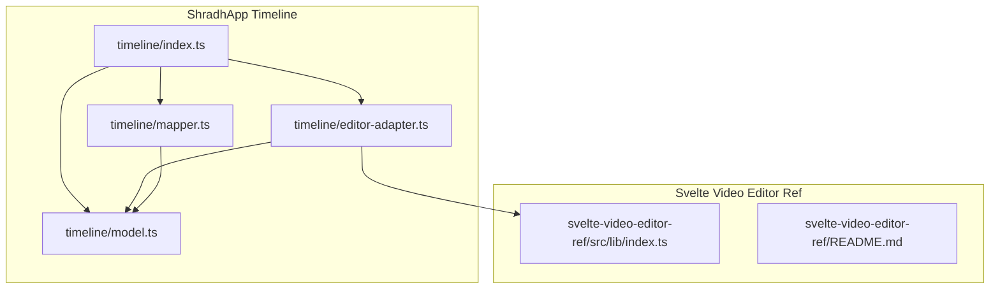
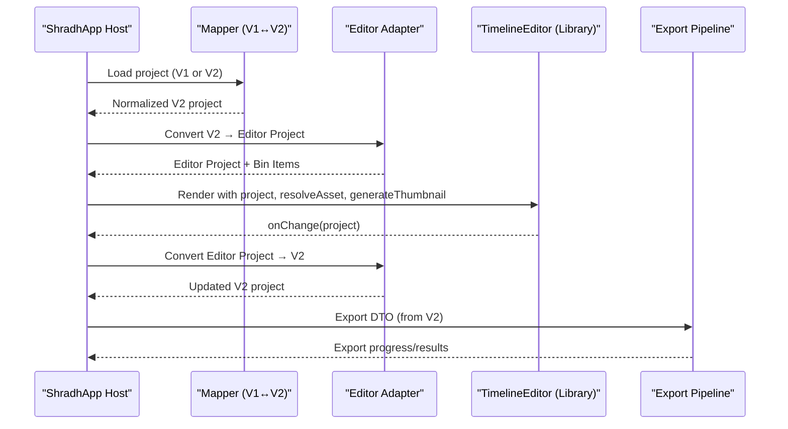
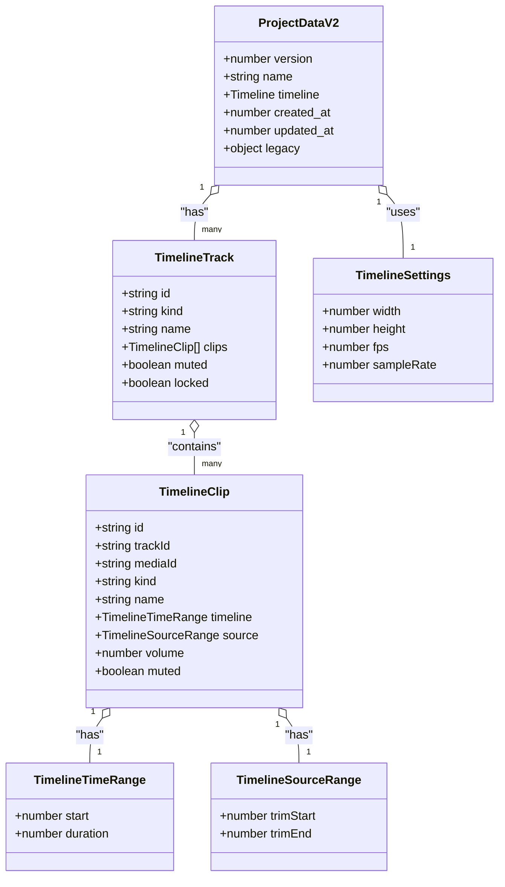
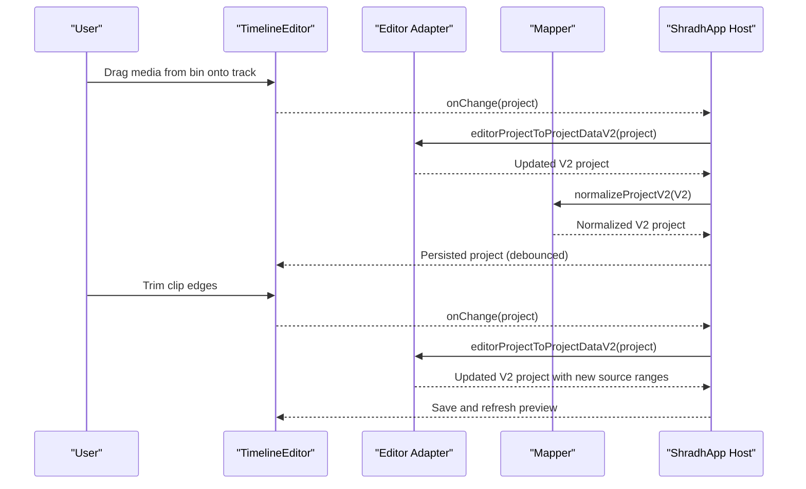
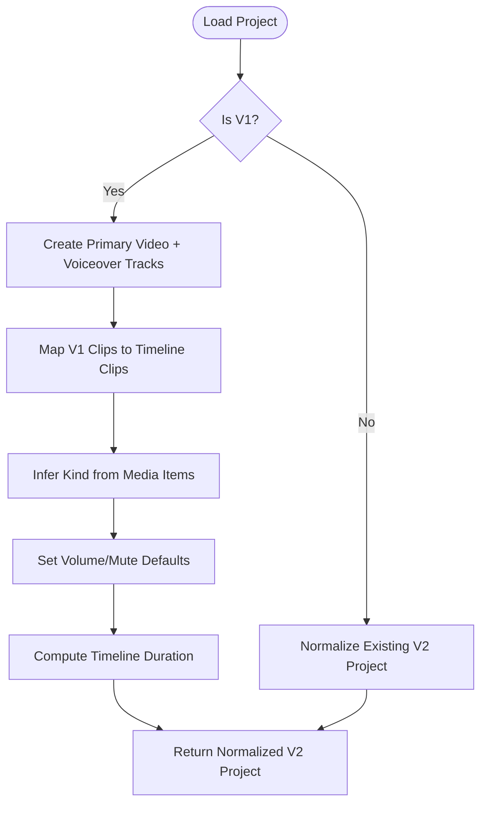
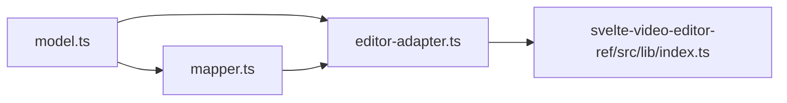

# Timeline Editor Interface

<cite>
**Referenced Files in This Document**
- [README.md](file://apps/shradhapp/README.md)
- [index.ts](file://apps/shradhapp/src/lib/timeline/index.ts)
- [model.ts](file://apps/shradhapp/src/lib/timeline/model.ts)
- [editor-adapter.ts](file://apps/shradhapp/src/lib/timeline/editor-adapter.ts)
- [mapper.ts](file://apps/shradhapp/src/lib/timeline/mapper.ts)
- [index.ts](file://apps/shradhapp/svelte-video-editor-ref/src/lib/index.ts)
- [README.md](file://apps/shradhapp/svelte-video-editor-ref/README.md)
</cite>

## Table of Contents
1. [Introduction](#introduction)
2. [Project Structure](#project-structure)
3. [Core Components](#core-components)
4. [Architecture Overview](#architecture-overview)
5. [Detailed Component Analysis](#detailed-component-analysis)
6. [Dependency Analysis](#dependency-analysis)
7. [Performance Considerations](#performance-considerations)
8. [Troubleshooting Guide](#troubleshooting-guide)
9. [Conclusion](#conclusion)
10. [Appendices](#appendices)

## Introduction
This document explains the ShradhApp timeline editor interface built with Svelte 5 and the @ariefsn/svelte-video-editor library. It covers track management, clip manipulation, real-time preview integration, state management patterns using Svelte 5 runes, drag-and-drop interactions, and multi-track editing capabilities. It also documents how ShradhApp adapts its internal project model to the editor’s project model and back, enabling seamless editing and export workflows. Practical examples include adding clips, adjusting timing, applying transitions, and managing multiple media tracks. Performance optimization strategies for large projects and responsive design considerations are included.

## Project Structure
ShradhApp’s timeline subsystem lives under apps/shradhapp/src/lib/timeline and integrates with a vendored reference implementation of the video editor library at apps/shradhapp/svelte-video-editor-ref. The key files:
- index.ts re-exports the timeline module utilities.
- model.ts defines ShradhApp’s internal timeline data model (tracks, clips, settings).
- mapper.ts converts between legacy V1 project format and the new V2 timeline model.
- editor-adapter.ts bridges ShradhApp’s V2 model to the editor’s project model and back.
- The svelte-video-editor-ref exposes the TimelineEditor component and related types/helpers used by the adapter.

**Diagram sources**
- [index.ts:1-3](file://apps/shradhapp/src/lib/timeline/index.ts#L1-L3)
- [model.ts:1-106](file://apps/shradhapp/src/lib/timeline/model.ts#L1-L106)
- [mapper.ts:1-247](file://apps/shradhapp/src/lib/timeline/mapper.ts#L1-L247)
- [editor-adapter.ts:1-198](file://apps/shradhapp/src/lib/timeline/editor-adapter.ts#L1-L198)
- [index.ts:1-110](file://apps/shradhapp/svelte-video-editor-ref/src/lib/index.ts#L1-L110)
- [README.md:1-578](file://apps/shradhapp/svelte-video-editor-ref/README.md#L1-L578)

**Section sources**
- [README.md:1-126](file://apps/shradhapp/README.md#L1-L126)
- [index.ts:1-3](file://apps/shradhapp/src/lib/timeline/index.ts#L1-L3)
- [model.ts:1-106](file://apps/shradhapp/src/lib/timeline/model.ts#L1-L106)
- [mapper.ts:1-247](file://apps/shradhapp/src/lib/timeline/mapper.ts#L1-L247)
- [editor-adapter.ts:1-198](file://apps/shradhapp/src/lib/timeline/editor-adapter.ts#L1-L198)
- [index.ts:1-110](file://apps/shradhapp/svelte-video-editor-ref/src/lib/index.ts#L1-L110)
- [README.md:1-578](file://apps/shradhapp/svelte-video-editor-ref/README.md#L1-L578)

## Core Components
- Timeline Model (V2): Defines tracks, clips, time ranges, source ranges, volume/mute flags, and project settings (width, height, fps, sample rate).
- Mapper: Converts between legacy V1 project format and V2 timeline model; normalizes clips/tracks; computes duration; provides roundtrip helpers.
- Editor Adapter: Translates ShradhApp V2 model into the editor’s project model and vice versa; maps media items to bin items; handles FPS normalization; builds export DTOs.
- Library Integration: Uses the exported TimelineEditor and helpers from the svelte-video-editor-ref package to render the timeline UI and handle interactions.

Key responsibilities:
- Track management: Create, sort, and persist tracks; infer kind based on clip content.
- Clip manipulation: Map trim/source ranges to frames; maintain start/duration; preserve volume/mute.
- Real-time preview: Bridge playhead, playback state, and asset resolution to the editor’s preview pipeline.
- Export preparation: Generate a clean export DTO that includes per-clip metadata needed by the backend.

**Section sources**
- [model.ts:1-106](file://apps/shradhapp/src/lib/timeline/model.ts#L1-L106)
- [mapper.ts:1-247](file://apps/shradhapp/src/lib/timeline/mapper.ts#L1-L247)
- [editor-adapter.ts:1-198](file://apps/shradhapp/src/lib/timeline/editor-adapter.ts#L1-L198)
- [index.ts:1-110](file://apps/shradhapp/svelte-video-editor-ref/src/lib/index.ts#L1-L110)

## Architecture Overview
The timeline editor architecture centers around a bidirectional adapter between ShradhApp’s V2 project model and the editor’s project model. The mapper ensures compatibility with legacy V1 projects and normalizes data. The editor renders the timeline, handles user interactions (drag-and-drop, trimming, transitions), and emits changes via callbacks. ShradhApp persists changes and prepares export payloads.

**Diagram sources**
- [mapper.ts:1-247](file://apps/shradhapp/src/lib/timeline/mapper.ts#L1-L247)
- [editor-adapter.ts:1-198](file://apps/shradhapp/src/lib/timeline/editor-adapter.ts#L1-L198)
- [index.ts:1-110](file://apps/shradhapp/svelte-video-editor-ref/src/lib/index.ts#L1-L110)
- [README.md:1-578](file://apps/shradhapp/svelte-video-editor-ref/README.md#L1-L578)

## Detailed Component Analysis

### Timeline Model (V2)
Defines the canonical shape for timeline data:
- Tracks: id, kind (video/audio), name, clips array, muted, locked.
- Clips: id, trackId, mediaId, kind, name, timeline (start, duration), source (trimStart, trimEnd), volume, muted.
- Settings: width, height, fps, sampleRate.
- ProjectDataV2: version, name, timeline (tracks, duration, settings), created_at, updated_at, legacy fields.

Complexity:
- Duration computation is O(T*C) where T is number of tracks and C is average clips per track.
- Sorting clips by start time ensures deterministic rendering and export order.

**Section sources**
- [model.ts:1-106](file://apps/shradhapp/src/lib/timeline/model.ts#L1-L106)

### Mapper (V1 ↔ V2)
Responsibilities:
- projectV1ToV2: Builds default tracks (primary video, voiceover), creates timeline clips from V1 clips, infers kind from media items, sets defaults for volume/mute, computes duration.
- projectV2ToV1: Extracts primary clips and optional voiceover media ID for backward compatibility.
- normalizeProjectV2: Ensures consistent clip ordering, clamps values, rounds seconds, merges settings.
- timelineDuration: Computes max end across all tracks.

Edge cases handled:
- Minimum clip durations enforced.
- Safe ID generation for stable identifiers.
- Rounding to milliseconds for precision consistency.

**Section sources**
- [mapper.ts:1-247](file://apps/shradhapp/src/lib/timeline/mapper.ts#L1-L247)

### Editor Adapter
Responsibilities:
- mediaItemToBinItem: Maps MediaItem to editor’s BinItem with URL, name, type, duration.
- projectDataV2ToEditorProject: Creates an empty editor project, maps tracks/clips, populates bin, sets background, preserves timestamps.
- editorProjectToProjectDataV2: Rebuilds V2 project from editor project, recomputes duration, preserves settings except fps which updates.
- projectDataV2ToExportDto: Produces a clean export payload including per-clip metadata.

Frame/time conversions:
- secToFrame/frameToSec ensure accurate mapping between seconds and frames using normalized FPS.

Track inference:
- If all clips in a track are audio, mark track kind as audio; otherwise video.

**Section sources**
- [editor-adapter.ts:1-198](file://apps/shradhapp/src/lib/timeline/editor-adapter.ts#L1-L198)

### Library Integration (TimelineEditor)
The svelte-video-editor-ref package exports:
- TimelineEditor component for rendering the timeline UI.
- Helpers like createEmptyProject, frameToSec/secToFrame, isMediaClip, etc.
- Section overrides and host contract for customization.

Integration points:
- Provide project, onChange, resolveAsset, generateThumbnail, onExport, can, messages, confirm, and pane sizing props.
- Use snippets to customize sections (bin import, inspector, shortcuts footer).
- Replace preview entirely if needed (e.g., custom renderer).

Real-time preview:
- Playhead and playback state are reactive; editor drives native <video>/<audio> elements in PreviewStage by default.
- Custom preview can be injected via snippet to use external engines (e.g., Remotion).

**Section sources**
- [index.ts:1-110](file://apps/shradhapp/svelte-video-editor-ref/src/lib/index.ts#L1-L110)
- [README.md:1-578](file://apps/shradhapp/svelte-video-editor-ref/README.md#L1-L578)

### Class Diagram: Data Models and Relationships

**Diagram sources**
- [model.ts:1-106](file://apps/shradhapp/src/lib/timeline/model.ts#L1-L106)

### Sequence Diagram: Adding a Clip and Adjusting Timing

**Diagram sources**
- [editor-adapter.ts:1-198](file://apps/shradhapp/src/lib/timeline/editor-adapter.ts#L1-L198)
- [mapper.ts:1-247](file://apps/shradhapp/src/lib/timeline/mapper.ts#L1-L247)
- [README.md:1-578](file://apps/shradhapp/svelte-video-editor-ref/README.md#L1-L578)

### Flowchart: V1 to V2 Migration

**Diagram sources**
- [mapper.ts:1-247](file://apps/shradhapp/src/lib/timeline/mapper.ts#L1-L247)

## Dependency Analysis
- ShradhApp timeline depends on:
  - model.ts for internal data shapes.
  - mapper.ts for V1/V2 conversion and normalization.
  - editor-adapter.ts for bridging to the editor’s project model.
  - svelte-video-editor-ref for UI components and helpers.
- The editor library is host-agnostic; ShradhApp owns persistence, asset resolution, and export.

**Diagram sources**
- [model.ts:1-106](file://apps/shradhapp/src/lib/timeline/model.ts#L1-L106)
- [mapper.ts:1-247](file://apps/shradhapp/src/lib/timeline/mapper.ts#L1-L247)
- [editor-adapter.ts:1-198](file://apps/shradhapp/src/lib/timeline/editor-adapter.ts#L1-L198)
- [index.ts:1-110](file://apps/shradhapp/svelte-video-editor-ref/src/lib/index.ts#L1-L110)

**Section sources**
- [model.ts:1-106](file://apps/shradhapp/src/lib/timeline/model.ts#L1-L106)
- [mapper.ts:1-247](file://apps/shradhapp/src/lib/timeline/mapper.ts#L1-L247)
- [editor-adapter.ts:1-198](file://apps/shradhapp/src/lib/timeline/editor-adapter.ts#L1-L198)
- [index.ts:1-110](file://apps/shradhapp/svelte-video-editor-ref/src/lib/index.ts#L1-L110)

## Performance Considerations
- Debounced persistence: The editor’s onChange is debounced by default; tune changeDebounceMs to balance responsiveness and I/O load.
- Large projects:
  - Limit initial bin population; lazy-load thumbnails and assets.
  - Use virtualization for long track lists if needed.
  - Avoid unnecessary re-renders by minimizing project object churn; prefer immutable updates.
- Frame conversions: Ensure FPS normalization to avoid costly recalculations; cache frame-to-second conversions when possible.
- Preview performance: Prefer native <video>/<audio> playback; custom previews should throttle updates during scrubbing.
- Responsive design: The library supports collapsing panes and touch-friendly controls; leverage CSS variables for theming and adapt layout for mobile.

[No sources needed since this section provides general guidance]

## Troubleshooting Guide
Common issues and resolutions:
- Missing ffmpeg: The app opens but actions requiring ffmpeg show friendly errors; install ffmpeg and ensure it is on PATH.
- SSR rendering: The editor requires DOM; wrap usage with browser guard or disable SSR for routes.
- Asset resolution: Ensure resolveAsset returns valid URLs and hasAudio metadata; incorrect types cause preview failures.
- Thumbnail generation: generateThumbnail must return a string URL; failing to provide thumbnails degrades UX.
- Export failures: Validate export DTO structure; ensure per-clip metadata matches backend expectations.

**Section sources**
- [README.md:1-126](file://apps/shradhapp/README.md#L1-L126)
- [README.md:1-578](file://apps/shradhapp/svelte-video-editor-ref/README.md#L1-L578)

## Conclusion
ShradhApp’s timeline editor leverages a robust adapter layer to bridge its internal V2 model with the @ariefsn/svelte-video-editor library. The mapper ensures backward compatibility and data normalization, while the editor provides a powerful, responsive timeline UI with real-time preview and extensible sections. By following the documented patterns for state management, drag-and-drop, and export preparation, developers can implement advanced editing features efficiently. Performance tuning and responsive design considerations ensure smooth operation even for large projects.

[No sources needed since this section summarizes without analyzing specific files]

## Appendices
- Practical examples:
  - Adding clips: Drag from bin to track; onChange persists normalized V2 project.
  - Adjusting timing: Trim edges; adapter updates source ranges and timeline duration.
  - Applying transitions: Use editor’s animation fields; clipAnimStyle helper for custom renderers.
  - Managing multiple tracks: Create audio/video tracks; adapter infers kind based on clip content.
- Best practices:
  - Keep project objects immutable; update via adapters to avoid unintended side effects.
  - Use debounce for persistence; batch updates where possible.
  - Validate asset URLs and thumbnails before rendering.
  - Leverage library’s section overrides for customization without breaking core functionality.

[No sources needed since this section provides general guidance]