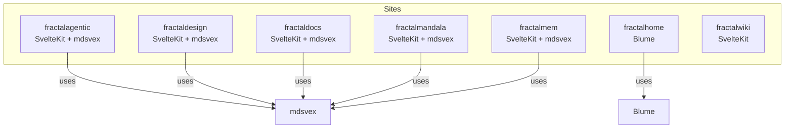
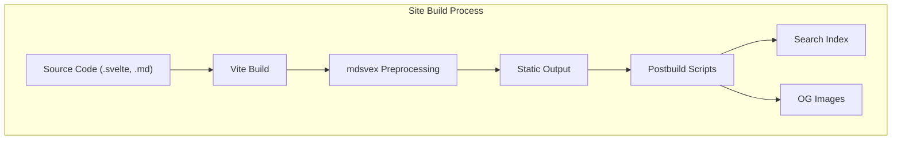
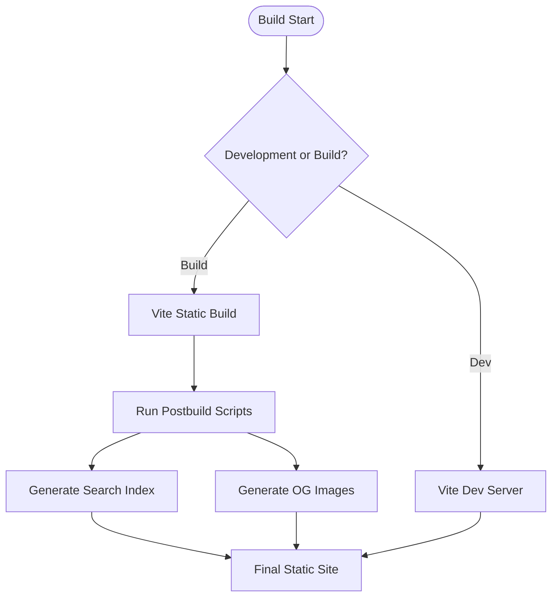
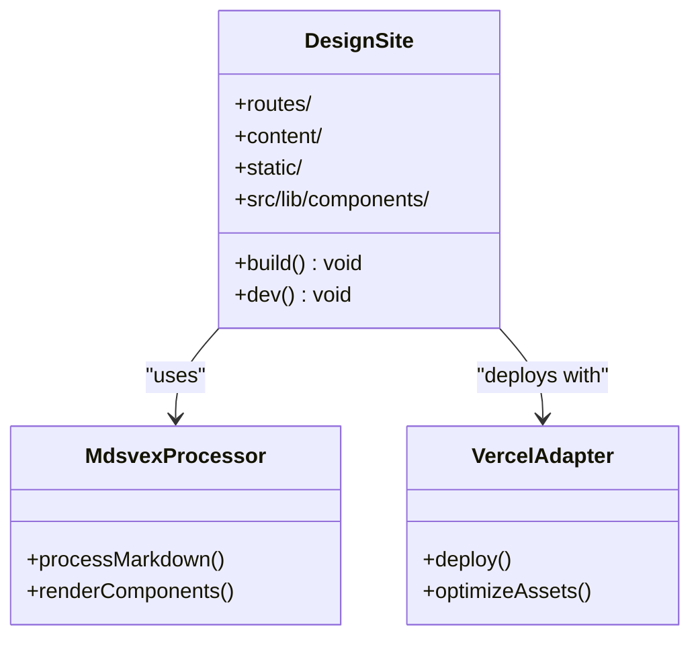
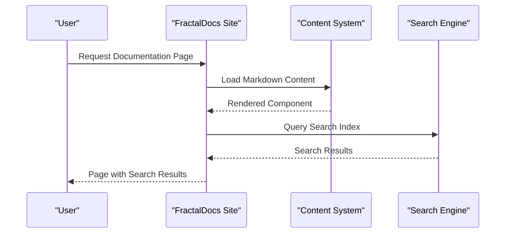
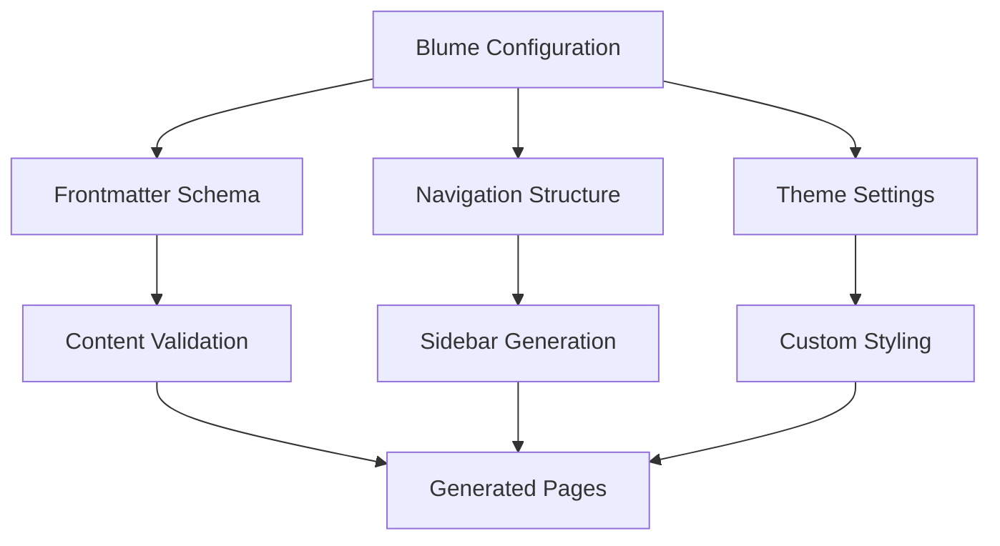
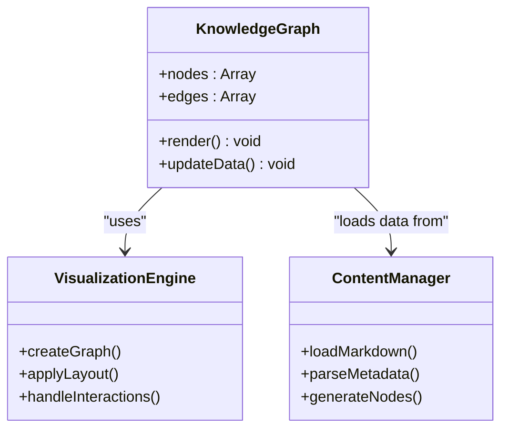
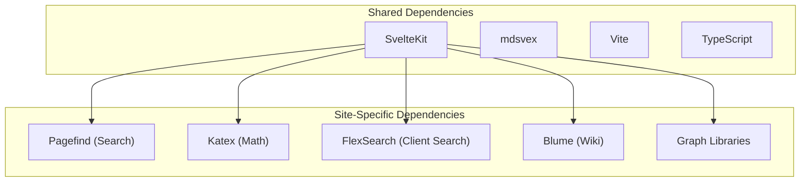

# Documentation Sites

<cite>
**Referenced Files in This Document**
- [package.json](file://sites/fractalagentic/package.json)
- [package.json](file://sites/fractaldesign/package.json)
- [package.json](file://sites/fractaldocs/package.json)
- [package.json](file://sites/fractalhome/package.json)
- [package.json](file://sites/fractalmandala/package.json)
- [package.json](file://sites/fractalmem/package.json)
- [package.json](file://sites/fractalwiki/package.json)
- [blume.config.ts](file://sites/fractalhome/blume.config.ts)
- [svelte.config.js](file://sites/fractalmandala/svelte.config.js)
- [svelte.config.js](file://sites/fractaldesign/svelte.config.js)
- [svelte.config.js](file://sites/fractalmem/svelte.config.js)
- [svelte.config.js](file://sites/fractalwiki/svelte.config.js)
- [_meta.json](file://sites/fractaldocs/content/_meta.json)
- [components.ts](file://sites/fractalhome/components.ts)
</cite>

## Table of Contents
1. [Introduction](#introduction)
2. [Project Structure](#project-structure)
3. [Core Components](#core-components)
4. [Architecture Overview](#architecture-overview)
5. [Detailed Component Analysis](#detailed-component-analysis)
6. [Dependency Analysis](#dependency-analysis)
7. [Performance Considerations](#performance-considerations)
8. [Troubleshooting Guide](#troubleshooting-guide)
9. [Conclusion](#conclusion)

## Introduction
This document explains the documentation sites within the monorepo, focusing on static site generators and documentation hubs. It covers common architecture patterns, content management approaches, shared components, and differences between specialized sites: FractalAgentic (AI agent docs), FractalDesign (design blog), FractalDocs (developer hub), and personal knowledge sites like FractalHome and FractalMandala. The guide includes conceptual overviews for beginners and technical details for experienced developers maintaining these sites.

## Project Structure
The sites are organized under the sites directory with each site as a standalone SvelteKit or Blume application. Most sites use SvelteKit with mdsvex for Markdown processing, while one uses Blume for wiki-style content. Each site has its own package configuration, build scripts, and optional postbuild steps for search indexing and metadata generation.

**Diagram sources**
- [package.json](file://sites/fractalagentic/package.json)
- [package.json](file://sites/fractaldesign/package.json)
- [package.json](file://sites/fractaldocs/package.json)
- [package.json](file://sites/fractalhome/package.json)
- [package.json](file://sites/fractalmandala/package.json)
- [package.json](file://sites/fractalmem/package.json)
- [package.json](file://sites/fractalwiki/package.json)

**Section sources**
- [package.json](file://sites/fractalagentic/package.json)
- [package.json](file://sites/fractaldesign/package.json)
- [package.json](file://sites/fractaldocs/package.json)
- [package.json](file://sites/fractalhome/package.json)
- [package.json](file://sites/fractalmandala/package.json)
- [package.json](file://sites/fractalmem/package.json)
- [package.json](file://sites/fractalwiki/package.json)

## Core Components
Common patterns across sites include:
- SvelteKit as the framework for routing, builds, and adapters.
- mdsvex for Markdown preprocessing into Svelte components.
- Postbuild scripts for search indexing (Pagefind) and Open Graph image generation.
- Shared styling via fractals-styler where applicable.
- Vercel adapter for deployment in most sites.

Key differences:
- FractalHome uses Blume for wiki-style navigation and frontmatter schema validation.
- Some sites integrate remark plugins (e.g., remark-gfm) for enhanced Markdown features.
- Search capabilities vary; some sites use Pagefind, others rely on client-side FlexSearch.

**Section sources**
- [package.json](file://sites/fractalagentic/package.json)
- [package.json](file://sites/fractaldocs/package.json)
- [package.json](file://sites/fractalhome/package.json)
- [package.json](file://sites/fractalmandala/package.json)
- [package.json](file://sites/fractalmem/package.json)
- [package.json](file://sites/fractalwiki/package.json)

## Architecture Overview
Each site follows a consistent SvelteKit structure with routes, layouts, and content directories. Content is typically stored in Markdown files with optional metadata. Build processes generate static assets, search indexes, and metadata files.

**Diagram sources**
- [package.json](file://sites/fractalagentic/package.json)
- [package.json](file://sites/fractaldocs/package.json)

**Section sources**
- [package.json](file://sites/fractalagentic/package.json)
- [package.json](file://sites/fractaldocs/package.json)

## Detailed Component Analysis

### FractalAgentic (AI Agent Docs)
A SvelteKit-based documentation site focused on AI agents. Uses mdsvex for content processing, Pagefind for search, and Katex for math rendering. Includes custom postbuild scripts for search indexing and Open Graph images.

**Diagram sources**
- [package.json](file://sites/fractalagentic/package.json)

**Section sources**
- [package.json](file://sites/fractalagentic/package.json)

### FractalDesign (Design Blog)
A design-focused site using SvelteKit and mdsvex. Optimized for component documentation and blog posts. Uses Vercel adapter for deployment and includes linting/formatting tools.

**Diagram sources**
- [package.json](file://sites/fractaldesign/package.json)
- [svelte.config.js](file://sites/fractaldesign/svelte.config.js)

**Section sources**
- [package.json](file://sites/fractaldesign/package.json)
- [svelte.config.js](file://sites/fractaldesign/svelte.config.js)

### FractalDocs (Developer Hub)
A developer documentation site similar to FractalAgentic but focused on general development resources. Uses mdsvex, Pagefind search, and includes structured content metadata.

**Diagram sources**
- [package.json](file://sites/fractaldocs/package.json)
- [_meta.json](file://sites/fractaldocs/content/_meta.json)

**Section sources**
- [package.json](file://sites/fractaldocs/package.json)
- [_meta.json](file://sites/fractaldocs/content/_meta.json)

### FractalHome (Personal Knowledge Base)
A wiki-style site built with Blume, featuring structured navigation, frontmatter validation, and custom theme configuration. Designed for personal knowledge management with rich metadata support.

**Diagram sources**
- [blume.config.ts](file://sites/fractalhome/blume.config.ts)
- [components.ts](file://sites/fractalhome/components.ts)

**Section sources**
- [blume.config.ts](file://sites/fractalhome/blume.config.ts)
- [components.ts](file://sites/fractalhome/components.ts)

### FractalMandala (Knowledge Visualization)
A SvelteKit site focused on knowledge graph visualization. Integrates graph libraries for interactive visualizations and uses mdsvex for content processing.

**Diagram sources**
- [package.json](file://sites/fractalmandala/package.json)
- [svelte.config.js](file://sites/fractalmandala/svelte.config.js)

**Section sources**
- [package.json](file://sites/fractalmandala/package.json)
- [svelte.config.js](file://sites/fractalmandala/svelte.config.js)

### FractalMem and FractalWiki (Utility Sites)
Lightweight documentation sites with minimal configurations. FractalMem includes GitHub Flavored Markdown support, while FractalWiki provides basic documentation without mdsvex preprocessing.

**Section sources**
- [package.json](file://sites/fractalmem/package.json)
- [svelte.config.js](file://sites/fractalmem/svelte.config.js)
- [package.json](file://sites/fractalwiki/package.json)
- [svelte.config.js](file://sites/fractalwiki/svelte.config.js)

## Dependency Analysis
The sites share common dependencies including SvelteKit, mdsvex, and various utility packages. Each site can be customized independently while maintaining consistency in development experience.

**Diagram sources**
- [package.json](file://sites/fractalagentic/package.json)
- [package.json](file://sites/fractaldocs/package.json)
- [package.json](file://sites/fractalhome/package.json)
- [package.json](file://sites/fractalmandala/package.json)

**Section sources**
- [package.json](file://sites/fractalagentic/package.json)
- [package.json](file://sites/fractaldocs/package.json)
- [package.json](file://sites/fractalhome/package.json)
- [package.json](file://sites/fractalmandala/package.json)

## Performance Considerations
- Use static site generation for optimal performance
- Implement client-side search for large content sets
- Optimize images and assets through build pipelines
- Consider lazy loading for heavy components
- Utilize caching strategies for frequently accessed content

## Troubleshooting Guide
Common issues and solutions:
- Build failures: Check TypeScript configuration and SvelteKit setup
- Search not working: Verify Pagefind index generation
- Markdown rendering issues: Ensure mdsvex configuration is correct
- Deployment problems: Validate adapter configuration for target platform

**Section sources**
- [package.json](file://sites/fractalagentic/package.json)
- [package.json](file://sites/fractaldocs/package.json)

## Conclusion
The documentation sites in this monorepo demonstrate consistent architectural patterns while allowing for specialized functionality. SvelteKit provides a solid foundation, with mdsvex enabling rich Markdown content processing. Each site can be tailored to specific needs while maintaining development consistency across the project.