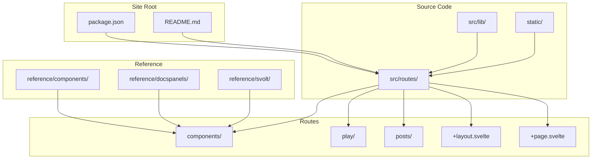
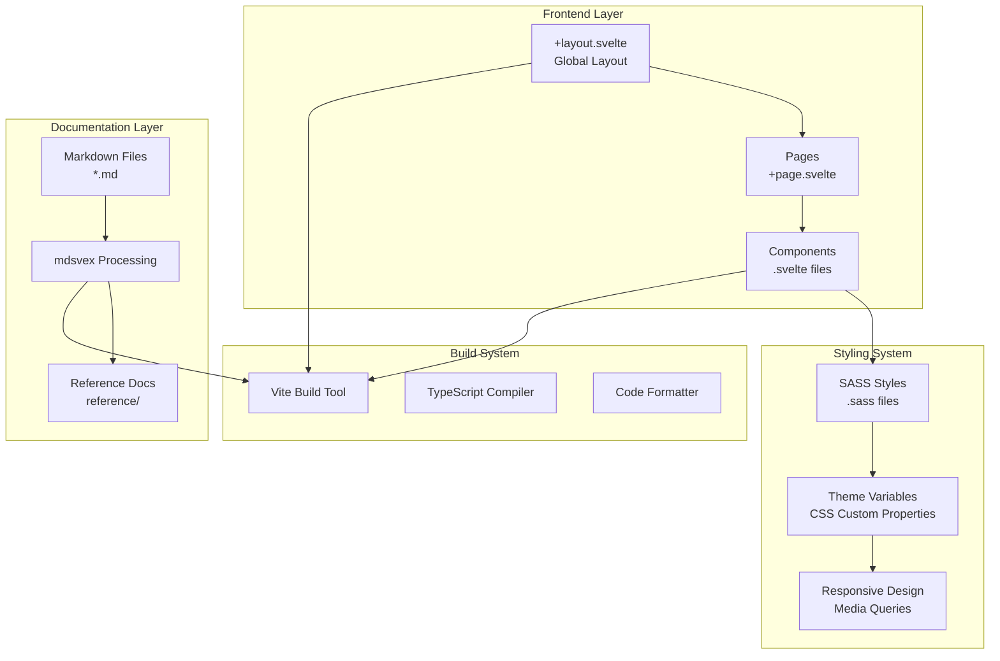
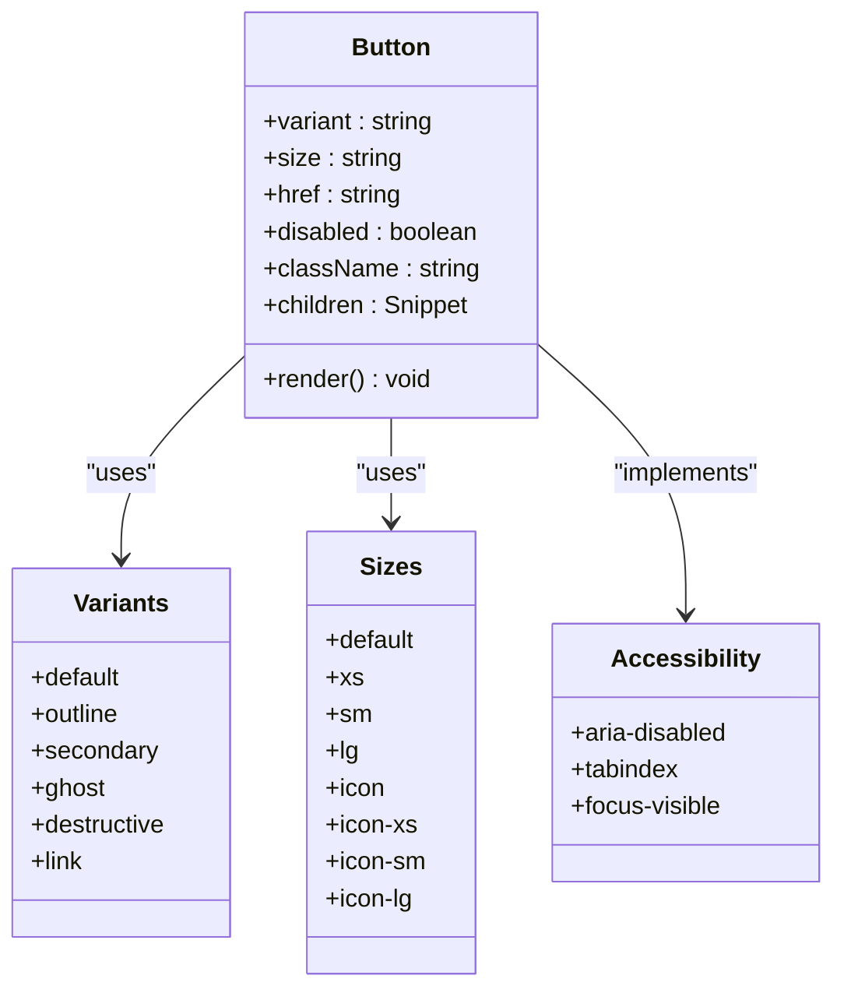
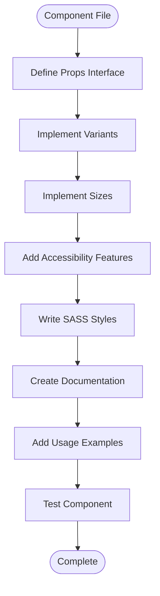
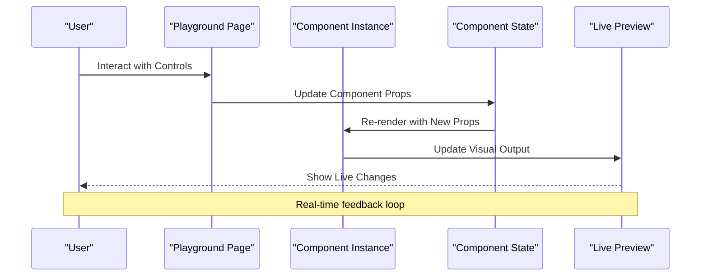
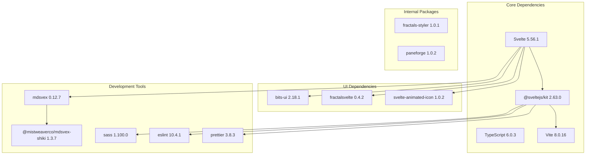

# FractalDesign Documentation & Blog

<cite>
**Referenced Files in This Document**
- [package.json](file://sites/fractaldesign/package.json)
- [README.md](file://sites/fractaldesign/README.md)
- [index.ts](file://sites/fractaldesign/src/routes/components/index.ts)
- [Button.svelte](file://sites/fractaldesign/src/routes/components/Button.svelte)
- [button.md](file://sites/fractaldesign/reference/components/button.md)
- [+layout.svelte](file://sites/fractaldesign/src/routes/+layout.svelte)
- [INDEX.md](file://sites/fractaldesign/src/routes/INDEX.md)
- [+page.svelte](file://sites/fractaldesign/src/routes/+page.svelte)
- [+page.ts](file://sites/fractaldesign/src/routes/+page.ts)
- [play +page.svelte](file://sites/fractaldesign/src/routes/play/+page.svelte)
- [play +page.ts](file://sites/fractaldesign/src/routes/play/+page.ts)
</cite>

## Table of Contents
1. [Introduction](#introduction)
2. [Project Structure](#project-structure)
3. [Core Components](#core-components)
4. [Architecture Overview](#architecture-overview)
5. [Detailed Component Analysis](#detailed-component-analysis)
6. [Dependency Analysis](#dependency-analysis)
7. [Performance Considerations](#performance-considerations)
8. [Troubleshooting Guide](#troubleshooting-guide)
9. [Conclusion](#conclusion)
10. [Appendices](#appendices)

## Introduction
FractalDesign is a SvelteKit-based design system reference and development blog that combines:
- A component catalog with live examples and interactive playgrounds
- A reference system for UI components including props, events, variants, sizes, and usage patterns
- A blog section for technical articles about Svelte development, design patterns, and framework insights
- Theme system integration and responsive design documentation patterns

The site is built with Svelte 5, TypeScript, and single-tab indented SASS (.sass). It uses mdsvex to render Markdown-based documentation alongside live code previews. The project follows a monorepo structure and leverages Vite for fast development and production builds.

## Project Structure
The FractalDesign site is organized as a SvelteKit application with clear separation between:
- Reference documentation (Markdown files under `reference/`)
- Live component implementations (Svelte components under `src/routes/components/`)
- Interactive playgrounds (under `src/routes/play/`)
- Blog posts (under `src/routes/posts/`)
- Global layout and styling (under `src/routes/+layout.svelte` and `src/lib/styles/`)

**Diagram sources**
- [package.json:1-45](file://sites/fractaldesign/package.json#L1-L45)
- [README.md:1-43](file://sites/fractaldesign/README.md#L1-L43)
- [+layout.svelte:1-62](file://sites/fractaldesign/src/routes/+layout.svelte#L1-L62)

**Section sources**
- [package.json:1-45](file://sites/fractaldesign/package.json#L1-L45)
- [README.md:1-43](file://sites/fractaldesign/README.md#L1-L43)

## Core Components
The component catalog includes over 100 UI components organized by functionality:
- **Interactive Elements**: Button, Input, Switch, Select, Tooltip, Popover
- **Layout Components**: Card, Dialog, Sheet, Sidebar, Tabs
- **Data Display**: Badge, Skeleton, Progress, Loader
- **Complex Components**: Message, Conversation, Artifact, Workflow
- **Utility Components**: Code, CodePreview, Image, Separator

Each component follows consistent patterns:
- Props interface defined with TypeScript
- Variant and size systems using CSS classes
- Accessibility attributes (aria-* properties)
- Responsive design with mobile-first approach
- Dark mode support through CSS media queries

The component index exports all available components for easy importing throughout the application.

**Section sources**
- [index.ts:1-137](file://sites/fractaldesign/src/routes/components/index.ts#L1-L137)

## Architecture Overview
The FractalDesign architecture follows modern SvelteKit patterns with clear separation of concerns:

**Diagram sources**
- [+layout.svelte:1-62](file://sites/fractaldesign/src/routes/+layout.svelte#L1-L62)
- [package.json:16-34](file://sites/fractaldesign/package.json#L16-L34)

## Detailed Component Analysis

### Button Component Deep Dive
The Button component serves as a foundational example of the design system's architecture:

**Diagram sources**
- [Button.svelte:1-224](file://sites/fractaldesign/src/routes/components/Button.svelte#L1-L224)
- [button.md:1-292](file://sites/fractaldesign/reference/components/button.md#L1-L292)

The Button component demonstrates key patterns:
- **Props Interface**: TypeScript-defined props with default values
- **Conditional Rendering**: Renders as `<button>` or `<a>` based on href prop
- **CSS Class Composition**: Combines base styles with variant and size modifiers
- **Accessibility**: Proper ARIA attributes and keyboard navigation
- **Dark Mode Support**: Media query overrides for dark theme

**Section sources**
- [Button.svelte:1-224](file://sites/fractaldesign/src/routes/components/Button.svelte#L1-L224)
- [button.md:1-292](file://sites/fractaldesign/reference/components/button.md#L1-L292)

### Component Documentation Pattern
Each component follows a standardized documentation pattern:

**Diagram sources**
- [button.md:1-292](file://sites/fractaldesign/reference/components/button.md#L1-L292)

**Section sources**
- [button.md:1-292](file://sites/fractaldesign/reference/components/button.md#L1-L292)

### Interactive Playground System
The playground provides an interactive environment for testing components:

**Diagram sources**
- [play +page.svelte](file://sites/fractaldesign/src/routes/play/+page.svelte)
- [play +page.ts](file://sites/fractaldesign/src/routes/play/+page.ts)

**Section sources**
- [play +page.svelte](file://sites/fractaldesign/src/routes/play/+page.svelte)
- [play +page.ts](file://sites/fractaldesign/src/routes/play/+page.ts)

## Dependency Analysis
The FractalDesign site has a well-structured dependency hierarchy:

**Diagram sources**
- [package.json:16-43](file://sites/fractaldesign/package.json#L16-L43)

**Section sources**
- [package.json:16-43](file://sites/fractaldesign/package.json#L16-L43)

## Performance Considerations
The FractalDesign site implements several performance optimizations:

- **Lazy Loading**: Components are loaded on-demand using SvelteKit's routing system
- **Code Splitting**: Vite automatically splits code by route and component
- **Asset Optimization**: Images and fonts are optimized through static file handling
- **CSS Minification**: SASS compilation produces optimized CSS output
- **Tree Shaking**: Unused code is eliminated during build process
- **Caching Strategy**: Static assets benefit from browser caching headers

## Troubleshooting Guide
Common issues and their solutions:

### Development Server Issues
- **Port Conflicts**: Change port in vite.config.ts if default port is occupied
- **Module Resolution**: Ensure all dependencies are installed with `pnpm install`
- **TypeScript Errors**: Run `pnpm check` to identify type-related issues

### Component Styling Problems
- **SASS Compilation**: Verify .sass syntax uses proper indentation without braces
- **CSS Variables**: Check theme variables are properly defined in global styles
- **Dark Mode**: Ensure media queries are correctly implemented

### Build Process Issues
- **Memory Limit**: Increase Node.js memory limit for large builds
- **Cache Issues**: Clear `.svelte-kit` directory and rebuild
- **Dependency Conflicts**: Use `pnpm dedupe` to resolve version conflicts

**Section sources**
- [package.json:6-14](file://sites/fractaldesign/package.json#L6-L14)

## Conclusion
FractalDesign represents a comprehensive approach to building design systems with modern web technologies. The combination of Svelte 5's reactive primitives, TypeScript's type safety, and SASS's styling capabilities creates a robust foundation for scalable component development.

Key strengths include:
- **Consistent API Design**: Standardized props and events across all components
- **Comprehensive Documentation**: Each component includes detailed usage examples
- **Interactive Testing**: Playground environment for real-time component testing
- **Theme System**: Flexible theming with CSS custom properties
- **Accessibility Focus**: Built-in accessibility features following WCAG guidelines

The architecture supports both immediate development needs and long-term scalability, making it suitable for enterprise-level applications requiring consistent UI patterns and maintainable codebases.

## Appendices

### Getting Started Guide
To set up the FractalDesign development environment:

1. **Install Dependencies**: `pnpm install`
2. **Start Development Server**: `pnpm dev`
3. **Run Type Checking**: `pnpm check`
4. **Format Code**: `pnpm format`
5. **Build Production**: `pnpm build`

### Component Development Checklist
When creating new components:
- Define TypeScript props interface
- Implement variant and size systems
- Add accessibility attributes
- Write comprehensive SASS styles
- Create documentation with examples
- Test responsive behavior
- Verify dark mode compatibility
- Include keyboard navigation support

### Theme Customization
The theme system uses CSS custom properties for easy customization:
- Primary colors defined in CSS variables
- Spacing scale based on consistent units
- Typography scale with predefined font sizes
- Animation timings for consistent motion design