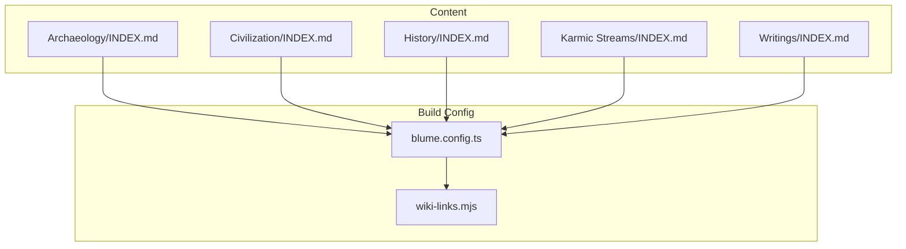
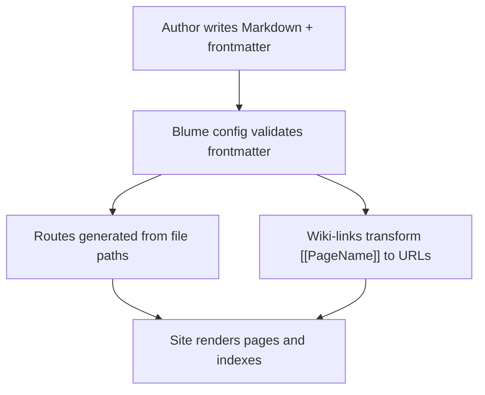
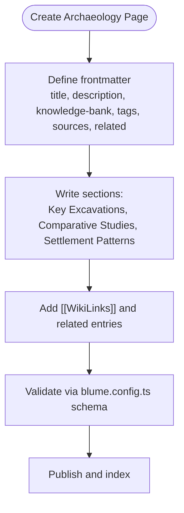
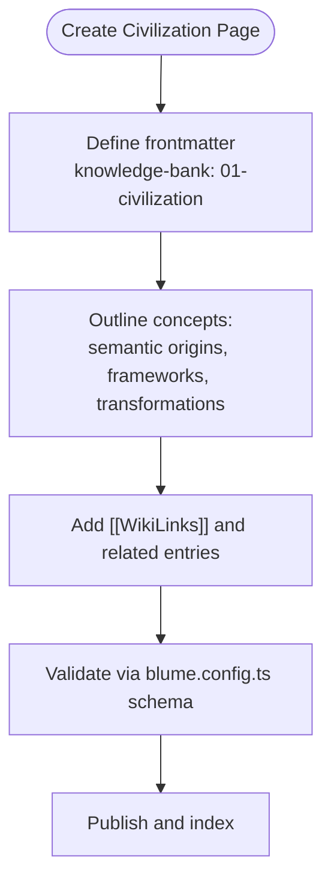
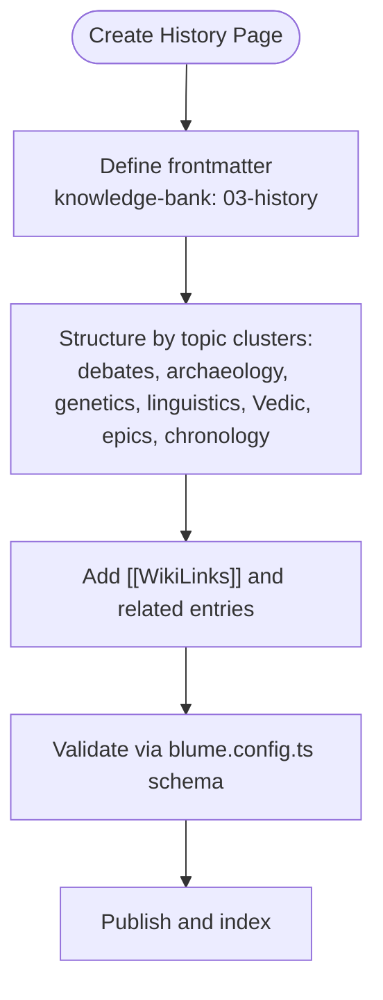
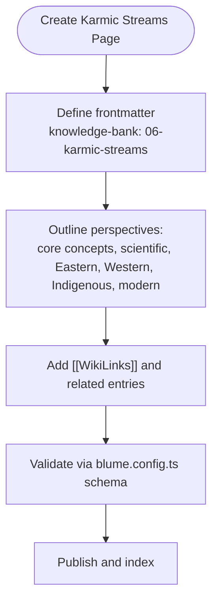
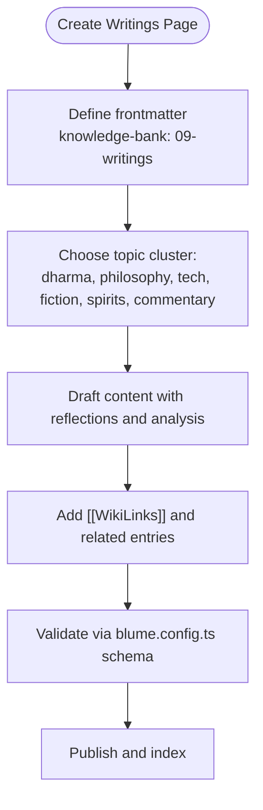
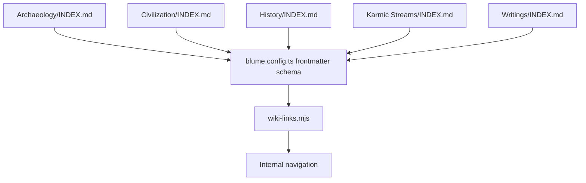

# Category Structures & Knowledge Domains

<cite>
**Referenced Files in This Document**
- [Archaeology INDEX.md](file://sites/fractalhome/content/Archaeology/INDEX.md)
- [Civilization INDEX.md](file://sites/fractalhome/content/Civilization/INDEX.md)
- [History INDEX.md](file://sites/fractalhome/content/History/INDEX.md)
- [Karmic Streams INDEX.md](file://sites/fractalhome/content/Karmic Streams/INDEX.md)
- [Writings INDEX.md](file://sites/fractalhome/content/Writings/INDEX.md)
- [harappan-indus.md](file://sites/fractalhome/content/Archaeology/harappan-indus.md)
- [dharma.md](file://sites/fractalhome/content/Civilization/dharma.md)
- [karma-overview.md](file://sites/fractalhome/content/Karmic Streams/karma-overview.md)
- [blume.config.ts](file://sites/fractalhome/blume.config.ts)
- [wiki-links.mjs](file://sites/fractalhome/wiki-links.mjs)
</cite>

## Table of Contents
1. Introduction
2. Project Structure
3. Core Components
4. Architecture Overview
5. Detailed Component Analysis
6. Dependency Analysis
7. Performance Considerations
8. Troubleshooting Guide
9. Conclusion

## Introduction
This document defines FractalHome’s category structures and knowledge domains, focusing on Archaeology, Civilization, History, Karmic Streams, and Writings. It explains organizational principles, naming conventions, and content guidelines for each domain to ensure consistent authoring, discoverability, and cross-linking across the knowledge base.

## Project Structure
FractalHome organizes knowledge as Markdown pages under a content directory, with one top-level folder per major category. Each category includes an INDEX.md that serves as the entry point and topic map. Pages use frontmatter metadata to classify content and enable navigation and search. A Blume configuration centralizes schema validation and theme settings, while a wiki-links integration converts internal [[WikiLinks]] into navigable links at build time.

**Diagram sources**
- [Archaeology INDEX.md](file://sites/fractalhome/content/Archaeology/INDEX.md)
- [Civilization INDEX.md](file://sites/fractalhome/content/Civilization/INDEX.md)
- [History INDEX.md](file://sites/fractalhome/content/History/INDEX.md)
- [Karmic Streams INDEX.md](file://sites/fractalhome/content/Karmic Streams/INDEX.md)
- [Writings INDEX.md](file://sites/fractalhome/content/Writings/INDEX.md)
- [blume.config.ts](file://sites/fractalhome/blume.config.ts)
- [wiki-links.mjs](file://sites/fractalhome/wiki-links.mjs)

**Section sources**
- [blume.config.ts:1-67](file://sites/fractalhome/blume.config.ts#L1-L67)
- [wiki-links.mjs:1-125](file://sites/fractalhome/wiki-links.mjs#L1-L125)

## Core Components
- Category Index Pages: Each domain has an INDEX.md that provides a description, tags, knowledge-bank identifier, related entries, and a Topic Map linking to key pages.
- Content Pages: Domain-specific pages follow consistent frontmatter and structure, enabling classification, search, and interlinking.
- Build-Time Configuration: Frontmatter schema is defined centrally; wiki-links convert internal references into navigable links.

Key organizational principles:
- One INDEX.md per category acts as the canonical entry point and topic map.
- Use knowledge-bank identifiers to group pages by domain (e.g., 07-archaeology, 01-civilization).
- Apply descriptive tags for filtering and discovery.
- Maintain related fields to connect adjacent topics across categories.
- Include timestamp and source metadata for traceability.

Naming conventions:
- File names are lowercase with hyphens (kebab-case), e.g., harappan-indus.md, dharma.md.
- Title field in frontmatter should be concise and human-readable.
- Internal links use [[PageName]] syntax, which the build pipeline resolves to routes.

Content guidelines:
- Begin with a clear description summarizing scope and focus.
- Organize content under logical headings and bullet points where appropriate.
- Cross-reference related pages using both [[WikiLinks]] and the related frontmatter field.
- Keep tags specific and consistent with existing taxonomy.
- Record sources and timestamps to maintain provenance.

**Section sources**
- [Archaeology INDEX.md:1-88](file://sites/fractalhome/content/Archaeology/INDEX.md#L1-L88)
- [Civilization INDEX.md:1-19](file://sites/fractalhome/content/Civilization/INDEX.md#L1-L19)
- [History INDEX.md:1-89](file://sites/fractalhome/content/History/INDEX.md#L1-L89)
- [Karmic Streams INDEX.md:1-61](file://sites/fractalhome/content/Karmic Streams/INDEX.md#L1-L61)
- [Writings INDEX.md:1-41](file://sites/fractalhome/content/Writings/INDEX.md#L1-L41)
- [blume.config.ts:9-25](file://sites/fractalhome/blume.config.ts#L9-L25)
- [wiki-links.mjs:50-77](file://sites/fractalhome/wiki-links.mjs#L50-L77)

## Architecture Overview
The knowledge base uses a content-first architecture with Markdown pages and structured frontmatter. The build system validates metadata, generates routes, and transforms internal links. Categories are organized as sibling directories under content, each anchored by an INDEX.md.

**Diagram sources**
- [blume.config.ts:9-25](file://sites/fractalhome/blume.config.ts#L9-L25)
- [wiki-links.mjs:50-77](file://sites/fractalhome/wiki-links.mjs#L50-L77)

## Detailed Component Analysis

### Archaeology
Scope: Ancient civilizations, excavations, material culture, scientific archaeology, regional studies, and heritage conservation.

Organizational principles:
- Group by themes (e.g., excavations, numismatics, epigraphy, temple architecture) and regions (e.g., Odisha, Kashmir).
- Use knowledge-bank identifier 07-archaeology consistently.
- Tag pages with domain-specific terms (e.g., harappan, excavation, numismatics).

Naming conventions:
- Descriptive kebab-case filenames reflecting the topic (e.g., harappan-indus.md, excavations-gangetic-plain.md).
- Titles should clearly identify the site or subject.

Content guidelines:
- Summarize findings, sites, and methodologies.
- Include sources and volumes when referencing journal issues.
- Provide cross-references to related archaeological domains.

Example page pattern:
- Frontmatter includes title, description, knowledge-bank, tags, sources, related, timestamp, source.
- Body contains sections like Key Excavations and Studies, Comparative Studies, Settlement Patterns.

**Diagram sources**
- [harappan-indus.md:1-71](file://sites/fractalhome/content/Archaeology/harappan-indus.md#L1-L71)
- [blume.config.ts:9-25](file://sites/fractalhome/blume.config.ts#L9-L25)

**Section sources**
- [Archaeology INDEX.md:1-88](file://sites/fractalhome/content/Archaeology/INDEX.md#L1-L88)
- [harappan-indus.md:1-71](file://sites/fractalhome/content/Archaeology/harappan-indus.md#L1-L71)

### Civilization
Scope: Philosophical and cultural studies of Indian civilization, including dharma, vedic tradition, myth, ritual, symbolism, sacred geography, yoga, and phenomenology.

Organizational principles:
- Use knowledge-bank identifier 01-civilization.
- Emphasize conceptual clarity and historical layering.
- Connect to comparative civilization and karmic streams where relevant.

Naming conventions:
- Concept-focused filenames (e.g., dharma.md, vedic-tradition.md).
- Titles should reflect philosophical or cultural concepts.

Content guidelines:
- Trace semantic origins and evolution of concepts.
- Use tripartite frameworks (e.g., ritual, law, narrative) to structure analysis.
- Include cross-references to related traditions and thinkers.

Example page pattern:
- Frontmatter includes title, description, knowledge-bank, tags, sources, related, timestamp, source.
- Body covers semantic origins, frameworks, transformations, and narrative contexts.

**Diagram sources**
- [dharma.md:1-47](file://sites/fractalhome/content/Civilization/dharma.md#L1-L47)
- [blume.config.ts:9-25](file://sites/fractalhome/blume.config.ts#L9-L25)

**Section sources**
- [Civilization INDEX.md:1-19](file://sites/fractalhome/content/Civilization/INDEX.md#L1-L19)
- [dharma.md:1-47](file://sites/fractalhome/content/Civilization/dharma.md#L1-L47)

### History
Scope: Chronological and thematic historical content, including ancient Indian history, archaeology, genetics, linguistics, Vedic studies, epics, chronology, historiography, and scholarly debates.

Organizational principles:
- Use knowledge-bank identifier 03-history.
- Organize by core debates, archaeology/civilizations, genetics/population history, linguistics/philology, Vedic studies, epics, chronology, geography/society, philosophy/religion, historiography/indology, contributors, reference works, and comparative topics.

Naming conventions:
- Descriptive filenames aligned with topics (e.g., harappan-indus-sarasvati-civilization.md, rig-veda-historical-analysis.md).
- Titles should specify period, region, or methodology.

Content guidelines:
- Present evidence-based analyses and cite sources.
- Clarify debates and alternative viewpoints.
- Cross-reference archaeology, civilization, and comparative civilization where applicable.

**Diagram sources**
- [History INDEX.md:1-89](file://sites/fractalhome/content/History/INDEX.md#L1-L89)
- [blume.config.ts:9-25](file://sites/fractalhome/blume.config.ts#L9-L25)

**Section sources**
- [History INDEX.md:1-89](file://sites/fractalhome/content/History/INDEX.md#L1-L89)

### Karmic Streams
Scope: Spiritual and philosophical traditions exploring reincarnation, karma, rebirth, and liberation across cultures, religions, science, and philosophy.

Organizational principles:
- Use knowledge-bank identifier 06-karmic-streams.
- Organize by core concepts, scientific research, religious/philosophical traditions (Eastern, Western/Abrahamic, Indigenous/archaic), and modern/comparative perspectives.

Naming conventions:
- Concept-focused filenames (e.g., karma-overview.md, reincarnation-in-hinduism.md).
- Titles should clearly indicate tradition or perspective.

Content guidelines:
- Define terminology and distinctions (e.g., sanchita, prarabdha, kriyamana).
- Explain mechanisms and moral implications.
- Compare traditions and include empirical research where relevant.

**Diagram sources**
- [karma-overview.md:1-63](file://sites/fractalhome/content/Karmic Streams/karma-overview.md#L1-L63)
- [blume.config.ts:9-25](file://sites/fractalhome/blume.config.ts#L9-L25)

**Section sources**
- [Karmic Streams INDEX.md:1-61](file://sites/fractalhome/content/Karmic Streams/INDEX.md#L1-L61)
- [karma-overview.md:1-63](file://sites/fractalhome/content/Karmic Streams/karma-overview.md#L1-L63)

### Writings
Scope: Personal essays and creative works spanning dharma, Indian history, philosophy, web development, psychedelics, fiction, whiskey reviews, AI commentary, design, Sanskrit studies, and social commentary.

Organizational principles:
- Use knowledge-bank identifier 09-writings.
- Organize by thematic clusters (e.g., dharma/civilizational consciousness, philosophy/reality, SvelteKit tutorials, creative fiction, AI/technology, whiskey/spirits, personal essays/poetry/commentary, design/art/Sanskrit, social/dharma commentary).

Naming conventions:
- Descriptive filenames reflecting essay or topic (e.g., dharma-civilizational-consciousness.md, web-development-sveltekit.md).
- Titles should be concise and informative.

Content guidelines:
- Blend personal reflection with rigorous analysis.
- Include cross-references to foundational essays and related domains.
- Maintain consistency in tone and depth across topics.

**Diagram sources**
- [Writings INDEX.md:1-41](file://sites/fractalhome/content/Writings/INDEX.md#L1-L41)
- [blume.config.ts:9-25](file://sites/fractalhome/blume.config.ts#L9-L25)

**Section sources**
- [Writings INDEX.md:1-41](file://sites/fractalhome/content/Writings/INDEX.md#L1-L41)

## Dependency Analysis
Categories depend on shared build-time infrastructure:
- Frontmatter schema validation ensures consistent metadata across all pages.
- Wiki-links transformation enables robust internal navigation.
- INDEX.md files serve as anchors for navigation and indexing.

**Diagram sources**
- [Archaeology INDEX.md:1-88](file://sites/fractalhome/content/Archaeology/INDEX.md#L1-L88)
- [Civilization INDEX.md:1-19](file://sites/fractalhome/content/Civilization/INDEX.md#L1-L19)
- [History INDEX.md:1-89](file://sites/fractalhome/content/History/INDEX.md#L1-L89)
- [Karmic Streams INDEX.md:1-61](file://sites/fractalhome/content/Karmic Streams/INDEX.md#L1-L61)
- [Writings INDEX.md:1-41](file://sites/fractalhome/content/Writings/INDEX.md#L1-L41)
- [blume.config.ts:9-25](file://sites/fractalhome/blume.config.ts#L9-L25)
- [wiki-links.mjs:50-77](file://sites/fractalhome/wiki-links.mjs#L50-L77)

**Section sources**
- [blume.config.ts:9-25](file://sites/fractalhome/blume.config.ts#L9-L25)
- [wiki-links.mjs:50-77](file://sites/fractalhome/wiki-links.mjs#L50-L77)

## Performance Considerations
- Keep frontmatter minimal and accurate to reduce parsing overhead.
- Use targeted tags to improve search performance and relevance.
- Avoid excessive nested [[WikiLinks]] to prevent heavy link resolution at build time.
- Prefer concise titles and descriptions for faster indexing.

[No sources needed since this section provides general guidance]

## Troubleshooting Guide
Common issues and resolutions:
- Invalid frontmatter: Ensure fields match the schema defined in blume.config.ts (knowledge-bank, tags, sources, related, timestamp, source).
- Broken internal links: Verify [[WikiLinks]] correspond to existing page titles or slugs; the build pipeline maps them to routes.
- Missing INDEX.md: Each category must have an INDEX.md to anchor navigation and topic mapping.
- Naming inconsistencies: Follow kebab-case filenames and consistent title formatting to avoid routing errors.

**Section sources**
- [blume.config.ts:9-25](file://sites/fractalhome/blume.config.ts#L9-L25)
- [wiki-links.mjs:50-77](file://sites/fractalhome/wiki-links.mjs#L50-L77)

## Conclusion
FractalHome’s category structures provide a coherent framework for organizing knowledge across Archaeology, Civilization, History, Karmic Streams, and Writings. By adhering to consistent organizational principles, naming conventions, and content guidelines, authors can create high-quality, interconnected content that enhances discoverability and usability. The shared build-time infrastructure ensures reliability and scalability as the knowledge base grows.

[No sources needed since this section summarizes without analyzing specific files]