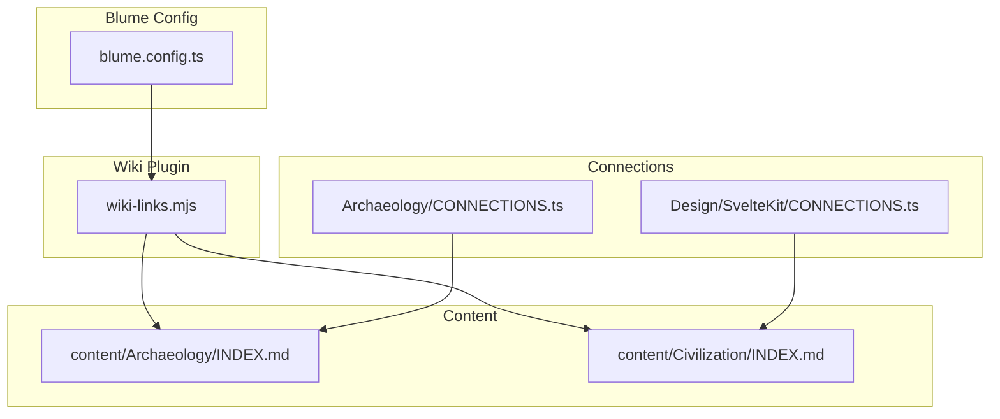
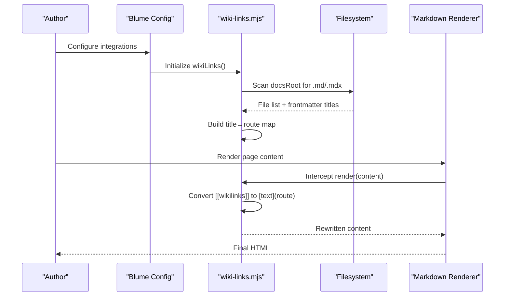
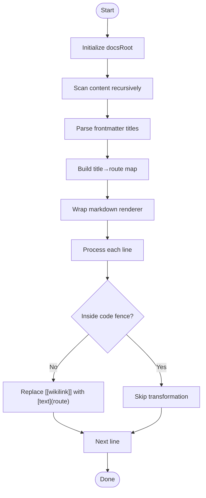
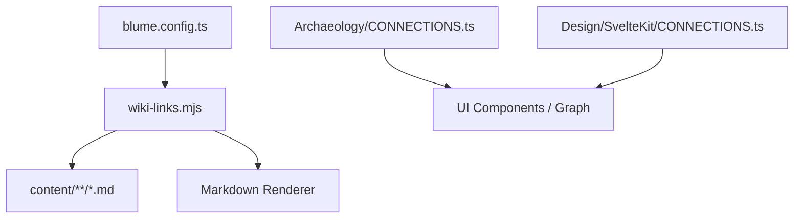

# Wiki Link System & Cross-Referencing

<cite>
**Referenced Files in This Document**
- [wiki-links.mjs](file://sites/fractalhome/wiki-links.mjs)
- [blume.config.ts](file://sites/fractalhome/blume.config.ts)
- [CONNECTIONS.ts (Archaeology)](file://sites/fractalmandala/src/content/Archaeology/CONNECTIONS.ts)
- [CONNECTIONS.ts (Design/SvelteKit)](file://sites/fractaldesign/src/routes/CONNECTIONS.ts)
- [INDEX.md (Archaeology)](file://sites/fractalhome/content/Archaeology/INDEX.md)
- [INDEX.md (Civilization)](file://sites/fractalhome/content/Civilization/INDEX.md)
</cite>

## Table of Contents
1. [Introduction](#introduction)
2. [Project Structure](#project-structure)
3. [Core Components](#core-components)
4. [Architecture Overview](#architecture-overview)
5. [Detailed Component Analysis](#detailed-component-analysis)
6. [Dependency Analysis](#dependency-analysis)
7. [Performance Considerations](#performance-considerations)
8. [Troubleshooting Guide](#troubleshooting-guide)
9. [Conclusion](#conclusion)

## Introduction
This document explains FractalHome’s wiki-link system and cross-referencing capabilities. It covers how to create internal links between wiki pages, manage connections using CONNECTIONS.ts files, implement bidirectional linking patterns, configure the Blume integration that processes wiki links, and follow best practices for maintaining a robust knowledge graph. It also provides examples of effective cross-referencing patterns and troubleshooting guidance for common issues.

## Project Structure
FractalHome uses a Blume-based documentation site with a custom plugin to convert wiki-style links into standard markdown links at build time. The key elements are:
- A Blume configuration file that registers the wiki-link plugin and defines frontmatter schema.
- A custom plugin that scans content directories, builds a title-to-route map, and rewrites wiki links during rendering.
- Per-topic CONNECTIONS.ts files that define topic maps, cross-bank references, and tags to support navigation and graph features.
- Content organized under content/<Topic>/ with INDEX.md files serving as hubs and individual pages as nodes.

**Diagram sources**
- [blume.config.ts:1-67](file://sites/fractalhome/blume.config.ts#L1-L67)
- [wiki-links.mjs:1-125](file://sites/fractalhome/wiki-links.mjs#L1-L125)
- [INDEX.md (Archaeology):1-88](file://sites/fractalhome/content/Archaeology/INDEX.md#L1-L88)
- [INDEX.md (Civilization):1-19](file://sites/fractalhome/content/Civilization/INDEX.md#L1-L19)
- [CONNECTIONS.ts (Archaeology):1-432](file://sites/fractalmandala/src/content/Archaeology/CONNECTIONS.ts#L1-L432)
- [CONNECTIONS.ts (Design/SvelteKit):1-498](file://sites/fractaldesign/src/routes/CONNECTIONS.ts#L1-L498)

**Section sources**
- [blume.config.ts:1-67](file://sites/fractalhome/blume.config.ts#L1-L67)
- [wiki-links.mjs:1-125](file://sites/fractalhome/wiki-links.mjs#L1-L125)
- [INDEX.md (Archaeology):1-88](file://sites/fractalhome/content/Archaeology/INDEX.md#L1-L88)
- [INDEX.md (Civilization):1-19](file://sites/fractalhome/content/Civilization/INDEX.md#L1-L19)

## Core Components
- Blume configuration: Registers the wiki-link plugin and extends frontmatter fields used by the wiki (e.g., knowledge-bank, tags, related).
- Wiki-link plugin: Scans content, builds a title-to-route map, and converts wiki syntax into standard markdown links during rendering.
- CONNECTIONS.ts: Centralized metadata per topic including topicMap, crossBanks, and allTags to power navigation and graph views.
- Content pages: Markdown files with frontmatter and optional wiki links; INDEX.md files act as hubs.

Key responsibilities:
- Build-time link resolution and rewriting.
- Title-based routing with fallbacks.
- Cross-bank linking via explicit connection files.
- Tag and relationship metadata for discovery and graphing.

**Section sources**
- [blume.config.ts:1-67](file://sites/fractalhome/blume.config.ts#L1-L67)
- [wiki-links.mjs:1-125](file://sites/fractalhome/wiki-links.mjs#L1-L125)
- [CONNECTIONS.ts (Archaeology):1-432](file://sites/fractalmandala/src/content/Archaeology/CONNECTIONS.ts#L1-L432)
- [CONNECTIONS.ts (Design/SvelteKit):1-498](file://sites/fractaldesign/src/routes/CONNECTIONS.ts#L1-L498)

## Architecture Overview
The wiki-link system integrates at build time through Blume’s configuration and processor pipeline. The plugin intercepts markdown rendering, transforms wiki links into standard links, and ensures consistent routing.

**Diagram sources**
- [blume.config.ts:1-67](file://sites/fractalhome/blume.config.ts#L1-L67)
- [wiki-links.mjs:1-125](file://sites/fractalhome/wiki-links.mjs#L1-L125)

## Detailed Component Analysis

### Wiki-Link Plugin (wiki-links.mjs)
Responsibilities:
- Parse frontmatter to extract titles for mapping.
- Generate slugs for fallback routes.
- Recursively scan content directory to build a title-to-route map.
- Wrap markdown renderer to convert wiki links before rendering.
- Patch both regular and MDX renderers to ensure coverage.

Behavior highlights:
- Skips code fences to avoid transforming inline code.
- Supports optional labels inside wiki links.
- Falls back to a canonical route pattern when a title is not found.

**Diagram sources**
- [wiki-links.mjs:1-125](file://sites/fractalhome/wiki-links.mjs#L1-L125)

**Section sources**
- [wiki-links.mjs:1-125](file://sites/fractalhome/wiki-links.mjs#L1-L125)

### Blume Configuration (blume.config.ts)
Responsibilities:
- Register the wiki-link plugin as an integration.
- Extend frontmatter schema to include fields like knowledge-bank, tags, related, sources, timestamps, and more.
- Define navigation and theme settings.

Best practices:
- Keep frontmatter keys consistent across pages for reliable indexing and graph generation.
- Use knowledge-bank arrays to group pages into logical banks.
- Maintain tags for discoverability and filtering.

**Section sources**
- [blume.config.ts:1-67](file://sites/fractalhome/blume.config.ts#L1-L67)

### CONNECTIONS.ts Files
Purpose:
- Provide structured metadata for topics, cross-bank references, and tags.
- Support navigation, search, and graph visualization.

Structure:
- topicMap: Array of objects with title, slug, and description.
- crossBanks: Links to other knowledge banks or index pages.
- allTags: Canonical tag list for the topic.

Usage:
- Import these files where needed to render topic lists, cross-bank navigation, and tag clouds.
- Keep entries sorted alphabetically for consistency.

Examples:
- Archaeology CONNECTIONS.ts includes detailed topic entries and cross-bank references to Civilization, History, etc.
- Design/SvelteKit CONNECTIONS.ts includes Svelte-related topics and cross-bank references.

**Section sources**
- [CONNECTIONS.ts (Archaeology):1-432](file://sites/fractalmandala/src/content/Archaeology/CONNECTIONS.ts#L1-L432)
- [CONNECTIONS.ts (Design/SvelteKit):1-498](file://sites/fractaldesign/src/routes/CONNECTIONS.ts#L1-L498)

### Content Pages and Index Hubs
- INDEX.md files serve as hubs listing major topics within a knowledge bank.
- Individual pages contain focused content and may reference other pages via wiki links or standard markdown links.
- Frontmatter should include title, description, knowledge-bank, tags, sources, related, timestamp, and source fields.

Example hubs:
- Archaeology INDEX.md outlines the scope and lists major topics with links.
- Civilization INDEX.md introduces the civilization knowledge bank and its dimensions.

**Section sources**
- [INDEX.md (Archaeology):1-88](file://sites/fractalhome/content/Archaeology/INDEX.md#L1-L88)
- [INDEX.md (Civilization):1-19](file://sites/fractalhome/content/Civilization/INDEX.md#L1-L19)

## Dependency Analysis
The wiki-link system depends on Blume’s configuration and processor pipeline. The plugin interacts with the filesystem to build mappings and wraps the markdown renderer to transform links. CONNECTIONS.ts files are independent metadata modules consumed by UI components or build scripts.

**Diagram sources**
- [blume.config.ts:1-67](file://sites/fractalhome/blume.config.ts#L1-L67)
- [wiki-links.mjs:1-125](file://sites/fractalhome/wiki-links.mjs#L1-L125)
- [CONNECTIONS.ts (Archaeology):1-432](file://sites/fractalmandala/src/content/Archaeology/CONNECTIONS.ts#L1-L432)
- [CONNECTIONS.ts (Design/SvelteKit):1-498](file://sites/fractaldesign/src/routes/CONNECTIONS.ts#L1-L498)

**Section sources**
- [blume.config.ts:1-67](file://sites/fractalhome/blume.config.ts#L1-L67)
- [wiki-links.mjs:1-125](file://sites/fractalhome/wiki-links.mjs#L1-L125)

## Performance Considerations
- Content scanning occurs at build time; keep content directories organized to minimize traversal overhead.
- Title-to-route mapping is O(n) over scanned files; ensure unique titles to avoid collisions.
- Code fences are skipped to avoid unnecessary regex processing inside blocks.
- Fallback route generation avoids expensive lookups by providing a deterministic path pattern.

[No sources needed since this section provides general guidance]

## Troubleshooting Guide
Common issues and resolutions:
- Broken wiki links: Ensure the target page has a frontmatter title matching the wiki link text exactly (case-insensitive lookup is supported). If no match, the plugin falls back to a slugified route pattern; verify the expected route.
- Links inside code fences: These are intentionally ignored. Place wiki links outside fenced blocks if you need them transformed.
- Missing CONNECTIONS entries: Update topicMap, crossBanks, and allTags in the relevant CONNECTIONS.ts file to reflect new pages or renamed topics.
- Inconsistent frontmatter: Standardize fields like title, description, knowledge-bank, tags, related, sources, timestamp, and source across pages to maintain reliable indexing and graph features.

Verification steps:
- Confirm the content directory structure matches the plugin’s expectations.
- Check that titles in frontmatter align with wiki link usage.
- Validate CONNECTIONS.ts exports for completeness and alphabetical sorting.

**Section sources**
- [wiki-links.mjs:1-125](file://sites/fractalhome/wiki-links.mjs#L1-L125)
- [blume.config.ts:1-67](file://sites/fractalhome/blume.config.ts#L1-L67)
- [CONNECTIONS.ts (Archaeology):1-432](file://sites/fractalmandala/src/content/Archaeology/CONNECTIONS.ts#L1-L432)
- [CONNECTIONS.ts (Design/SvelteKit):1-498](file://sites/fractaldesign/src/routes/CONNECTIONS.ts#L1-L498)

## Conclusion
FractalHome’s wiki-link system leverages Blume’s configuration and a custom plugin to transform wiki-style links into standard markdown links at build time. By combining frontmatter-driven metadata, CONNECTIONS.ts files for structured relationships, and consistent content organization, teams can maintain a robust knowledge graph with bidirectional linking and strong discoverability. Adhering to best practices—unique titles, standardized frontmatter, and up-to-date CONNECTIONS entries—ensures reliable cross-references and a cohesive user experience.