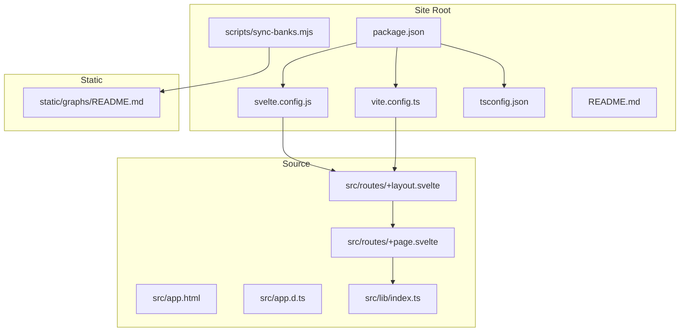
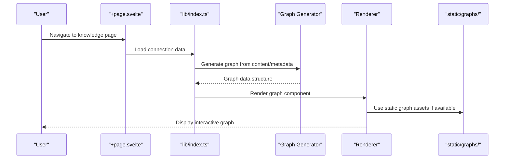
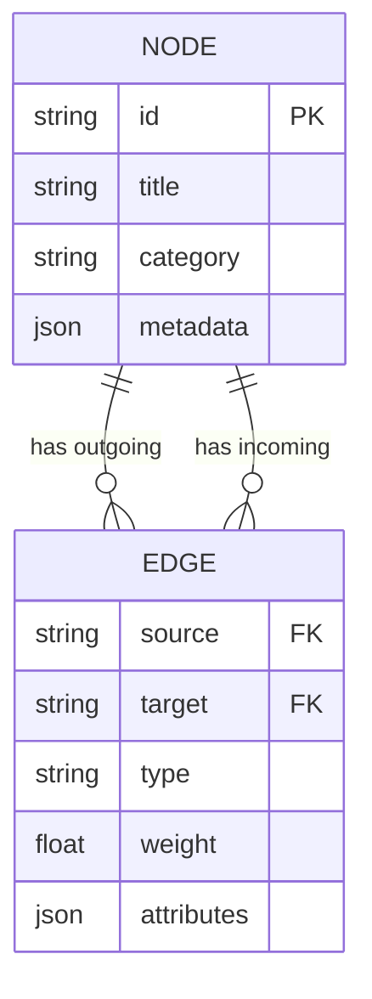
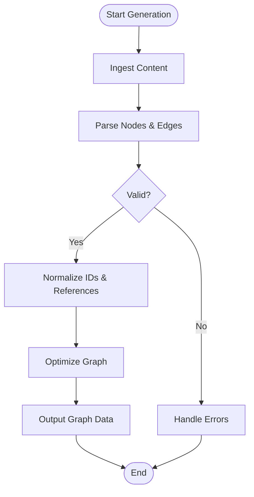
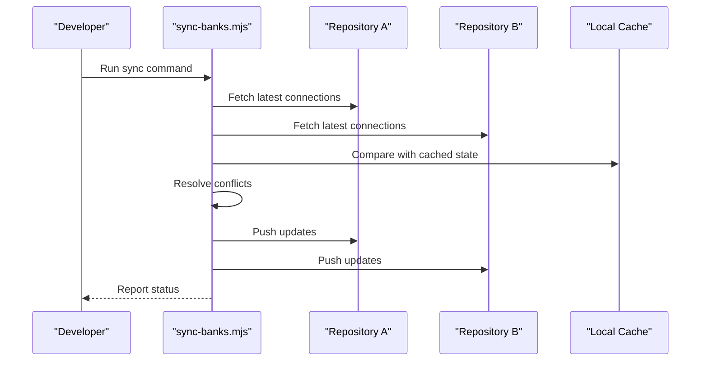
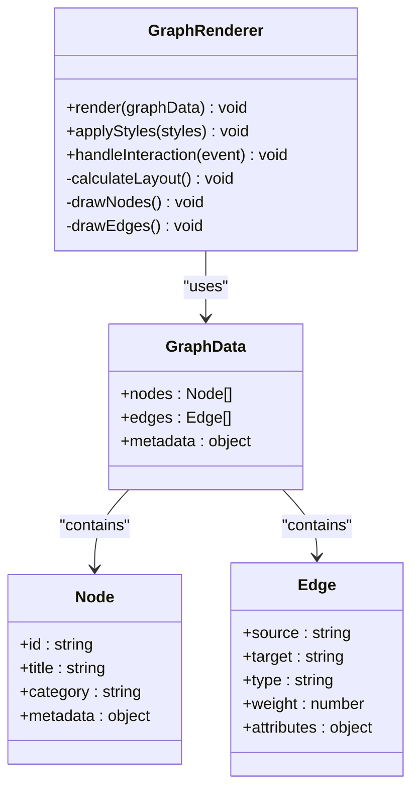
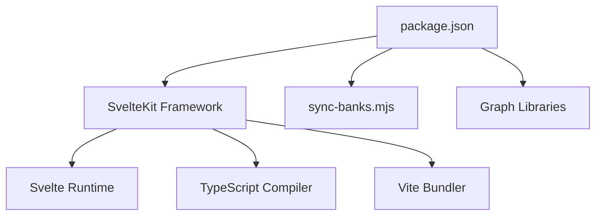

# FractalMandala - Knowledge Base

<cite>
**Referenced Files in This Document**
- [README.md](file://sites/fractalmandala/README.md)
- [package.json](file://sites/fractalmandala/package.json)
- [svelte.config.js](file://sites/fractalmandala/svelte.config.js)
- [vite.config.ts](file://sites/fractalmandala/vite.config.ts)
- [tsconfig.json](file://sites/fractalmandala/tsconfig.json)
- [sync-banks.mjs](file://sites/fractalmandala/scripts/sync-banks.mjs)
- [src/app.html](file://sites/fractalmandala/src/app.html)
- [src/app.d.ts](file://sites/fractalmandala/src/app.d.ts)
- [src/routes/+layout.svelte](file://sites/fractalmandala/src/routes/+layout.svelte)
- [src/routes/+page.svelte](file://sites/fractalmandala/src/routes/+page.svelte)
- [src/lib/index.ts](file://sites/fractalmandala/src/lib/index.ts)
- [static/graphs/README.md](file://sites/fractalmandala/static/graphs/README.md)
</cite>

## Table of Contents
1. [Introduction](#introduction)
2. [Project Structure](#project-structure)
3. [Core Components](#core-components)
4. [Architecture Overview](#architecture-overview)
5. [Detailed Component Analysis](#detailed-component-analysis)
6. [Dependency Analysis](#dependency-analysis)
7. [Performance Considerations](#performance-considerations)
8. [Troubleshooting Guide](#troubleshooting-guide)
9. [Conclusion](#conclusion)
10. [Appendices](#appendices)

## Introduction
FractalMandala is an advanced knowledge base and wiki site built with SvelteKit, designed to visualize relationships across knowledge domains through a graph system and maintain consistency across multiple repositories via sync-banks. The project emphasizes:
- A connection system that links different knowledge domains (topics, entities, concepts).
- A graph generation pipeline that renders these connections visually.
- A synchronization mechanism (sync-banks) to keep content consistent across multiple knowledge repositories.

This document explains the data model for connections, the graph rendering pipeline, how to extend relationship types, and provides practical examples for setting up knowledge connections and customizing visualizations.

## Project Structure
FractalMandala follows a standard SvelteKit layout with clear separation between routes, libraries, static assets, and scripts. Key directories:
- src/routes: SvelteKit pages and layouts
- src/lib: Shared modules and utilities
- static: Static assets including graphs and images
- scripts: Build-time and maintenance scripts such as sync-banks

**Diagram sources**
- [package.json](file://sites/fractalmandala/package.json)
- [svelte.config.js](file://sites/fractalmandala/svelte.config.js)
- [vite.config.ts](file://sites/fractalmandala/vite.config.ts)
- [tsconfig.json](file://sites/fractalmandala/tsconfig.json)
- [src/app.html](file://sites/fractalmandala/src/app.html)
- [src/app.d.ts](file://sites/fractalmandala/src/app.d.ts)
- [src/routes/+layout.svelte](file://sites/fractalmandala/src/routes/+layout.svelte)
- [src/routes/+page.svelte](file://sites/fractalmandala/src/routes/+page.svelte)
- [src/lib/index.ts](file://sites/fractalmandala/src/lib/index.ts)
- [static/graphs/README.md](file://sites/fractalmandala/static/graphs/README.md)
- [sync-banks.mjs](file://sites/fractalmandala/scripts/sync-banks.mjs)

**Section sources**
- [README.md](file://sites/fractalmandala/README.md)
- [package.json](file://sites/fractalmandala/package.json)
- [svelte.config.js](file://sites/fractalmandala/svelte.config.js)
- [vite.config.ts](file://sites/fractalmandala/vite.config.ts)
- [tsconfig.json](file://sites/fractalmandala/tsconfig.json)

## Core Components
The core components of FractalMandala’s knowledge graph system include:
- Connection Model: Defines how nodes (knowledge items) are linked by edges (relationships).
- Graph Generator: Builds graph data structures from content and metadata.
- Sync-Banks Script: Ensures consistency across multiple repositories by synchronizing connections and assets.
- Rendering Pipeline: Converts graph data into visual representations using Svelte components and static assets.

Key responsibilities:
- Parsing content and metadata to extract nodes and edges.
- Validating and normalizing connection definitions.
- Generating graph files or runtime data structures.
- Rendering interactive graphs in the UI.

**Section sources**
- [src/lib/index.ts](file://sites/fractalmandala/src/lib/index.ts)
- [src/routes/+page.svelte](file://sites/fractalmandala/src/routes/+page.svelte)
- [static/graphs/README.md](file://sites/fractalmandala/static/graphs/README.md)
- [sync-banks.mjs](file://sites/fractalmandala/scripts/sync-banks.mjs)

## Architecture Overview
The architecture integrates content ingestion, graph generation, and visualization within a SvelteKit application. The flow begins with content and metadata, which are processed into a graph model. This model is then rendered either statically or dynamically in the browser.

**Diagram sources**
- [src/routes/+page.svelte](file://sites/fractalmandala/src/routes/+page.svelte)
- [src/lib/index.ts](file://sites/fractalmandala/src/lib/index.ts)
- [static/graphs/README.md](file://sites/fractalmandala/static/graphs/README.md)

## Detailed Component Analysis

### Connection Data Model
The connection system relies on a structured data model to represent knowledge items and their relationships. Nodes represent entities such as topics, concepts, or documents, while edges define the type and direction of relationships.

Key aspects:
- Node properties: ID, title, category, metadata.
- Edge properties: source, target, type, weight, attributes.
- Validation rules: Ensure referential integrity and consistent naming.

**Diagram sources**
- [src/lib/index.ts](file://sites/fractalmandala/src/lib/index.ts)

**Section sources**
- [src/lib/index.ts](file://sites/fractalmandala/src/lib/index.ts)

### Graph Generation System
The graph generator transforms raw content and metadata into a normalized graph structure suitable for visualization. It handles parsing, validation, and optimization steps.

Process flow:
1. Ingest content from markdown, JSON, or other formats.
2. Extract nodes and edges based on defined schemas.
3. Normalize identifiers and resolve references.
4. Optimize graph for performance (e.g., deduplication, pruning).
5. Output graph data for rendering or caching.

**Diagram sources**
- [src/lib/index.ts](file://sites/fractalmandala/src/lib/index.ts)

**Section sources**
- [src/lib/index.ts](file://sites/fractalmandala/src/lib/index.ts)

### Sync-Banks Functionality
The sync-banks script maintains consistency across multiple knowledge repositories by synchronizing connections, assets, and metadata. It ensures that changes in one repository propagate correctly to others.

Key features:
- Conflict resolution strategies.
- Incremental updates to minimize processing time.
- Backup and rollback capabilities.
- Logging and audit trails.

**Diagram sources**
- [sync-banks.mjs](file://sites/fractalmandala/scripts/sync-banks.mjs)

**Section sources**
- [sync-banks.mjs](file://sites/fractalmandala/scripts/sync-banks.mjs)

### Graph Rendering Pipeline
The rendering pipeline converts graph data into interactive visualizations using Svelte components. It supports both static and dynamic rendering modes.

Steps:
1. Receive graph data from lib/index.ts.
2. Apply styling and layout algorithms.
3. Render nodes and edges with interactivity.
4. Handle user interactions (zoom, pan, click).
5. Optionally cache results for performance.

**Diagram sources**
- [src/routes/+page.svelte](file://sites/fractalmandala/src/routes/+page.svelte)
- [src/lib/index.ts](file://sites/fractalmandala/src/lib/index.ts)

**Section sources**
- [src/routes/+page.svelte](file://sites/fractalmandala/src/routes/+page.svelte)
- [src/lib/index.ts](file://sites/fractalmandala/src/lib/index.ts)

### Extending Relationship Types
To add new relationship types:
1. Define the new edge type in the schema.
2. Update validation rules to accept the new type.
3. Implement rendering logic for the new edge style.
4. Test with sample data to ensure correctness.

Example workflow:
- Add “references” type to edges.
- Update parser to recognize “references” in content.
- Customize edge appearance in renderer.
- Verify sync-banks handles the new type.

**Section sources**
- [src/lib/index.ts](file://sites/fractalmandala/src/lib/index.ts)
- [static/graphs/README.md](file://sites/fractalmandala/static/graphs/README.md)

### Practical Examples

#### Setting Up Knowledge Connections
1. Create node definitions in content files with unique IDs.
2. Define edges using source and target IDs.
3. Validate connections using provided tools.
4. Generate graph data and render in UI.

#### Customizing Graph Visualizations
1. Modify styles in SASS files for nodes and edges.
2. Adjust layout algorithms for better readability.
3. Add interactivity features like tooltips and filters.
4. Optimize performance for large graphs.

**Section sources**
- [src/routes/+page.svelte](file://sites/fractalmandala/src/routes/+page.svelte)
- [src/lib/index.ts](file://sites/fractalmandala/src/lib/index.ts)

## Dependency Analysis
FractalMandala’s dependencies are primarily within the SvelteKit ecosystem, with additional tools for graph generation and synchronization.

**Diagram sources**
- [package.json](file://sites/fractalmandala/package.json)
- [vite.config.ts](file://sites/fractalmandala/vite.config.ts)
- [tsconfig.json](file://sites/fractalmandala/tsconfig.json)
- [sync-banks.mjs](file://sites/fractalmandala/scripts/sync-banks.mjs)

**Section sources**
- [package.json](file://sites/fractalmandala/package.json)
- [vite.config.ts](file://sites/fractalmandala/vite.config.ts)
- [tsconfig.json](file://sites/fractalmandala/tsconfig.json)

## Performance Considerations
- Use lazy loading for large graphs to improve initial load times.
- Implement caching for generated graph data to reduce recomputation.
- Optimize node and edge rendering with virtualization techniques.
- Minimize bundle size by tree-shaking unused dependencies.
- Profile memory usage during graph generation and rendering.

[No sources needed since this section provides general guidance]

## Troubleshooting Guide
Common issues and solutions:
- Invalid node references: Ensure all IDs are unique and properly referenced.
- Graph rendering errors: Check console logs for JavaScript errors and validate data structure.
- Sync conflicts: Review conflict resolution logs and manually resolve discrepancies.
- Performance bottlenecks: Use browser dev tools to identify slow operations and optimize accordingly.

**Section sources**
- [src/lib/index.ts](file://sites/fractalmandala/src/lib/index.ts)
- [sync-banks.mjs](file://sites/fractalmandala/scripts/sync-banks.mjs)

## Conclusion
FractalMandala provides a robust framework for building knowledge bases with powerful graph visualization capabilities. By understanding the connection system, graph generation pipeline, and sync-banks functionality, developers can effectively manage and visualize complex relationships across knowledge domains. The modular architecture allows for easy extension and customization, making it adaptable to various use cases.

[No sources needed since this section summarizes without analyzing specific files]

## Appendices

### Setup Instructions
1. Install dependencies using pnpm.
2. Configure environment variables if needed.
3. Run development server to preview changes.
4. Build production assets for deployment.

### Best Practices
- Maintain consistent naming conventions for nodes and edges.
- Regularly update sync-banks to keep repositories in sync.
- Document new relationship types and their usage.
- Test graph rendering with diverse datasets.

[No sources needed since this section provides general guidance]