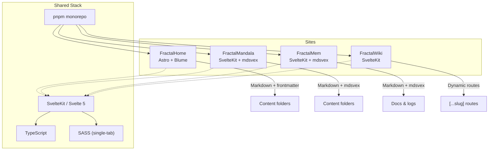
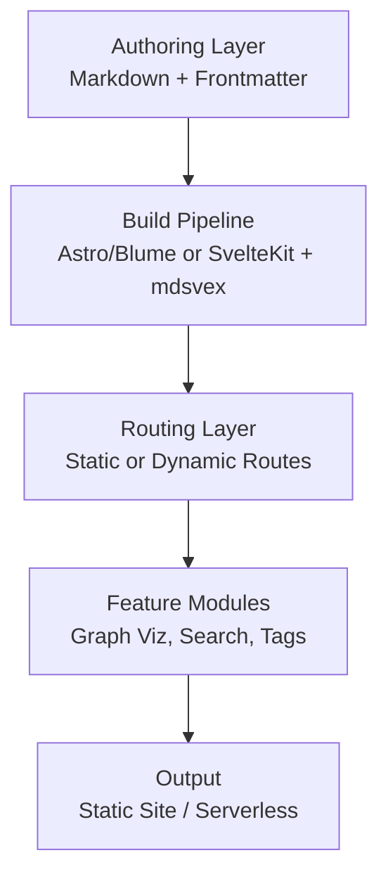
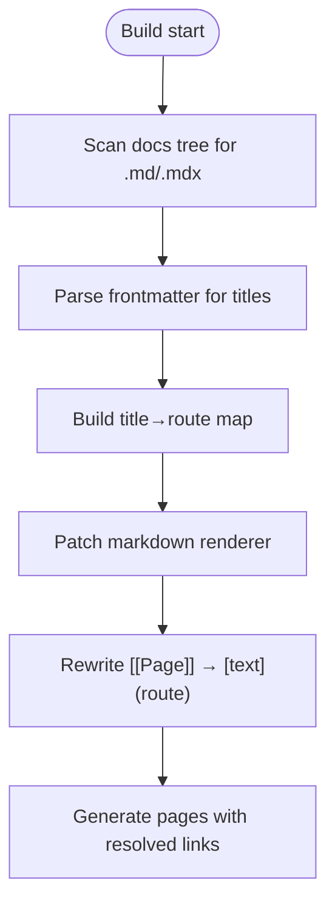
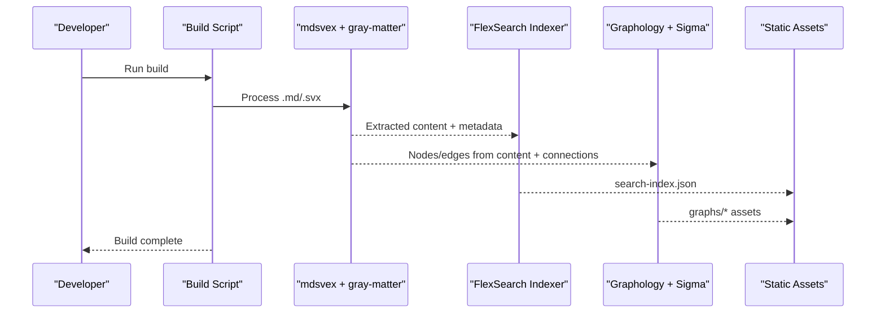
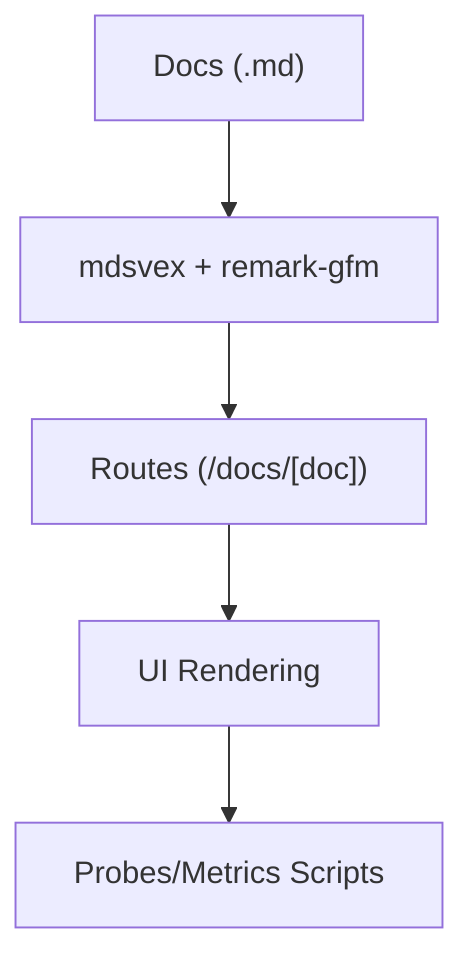
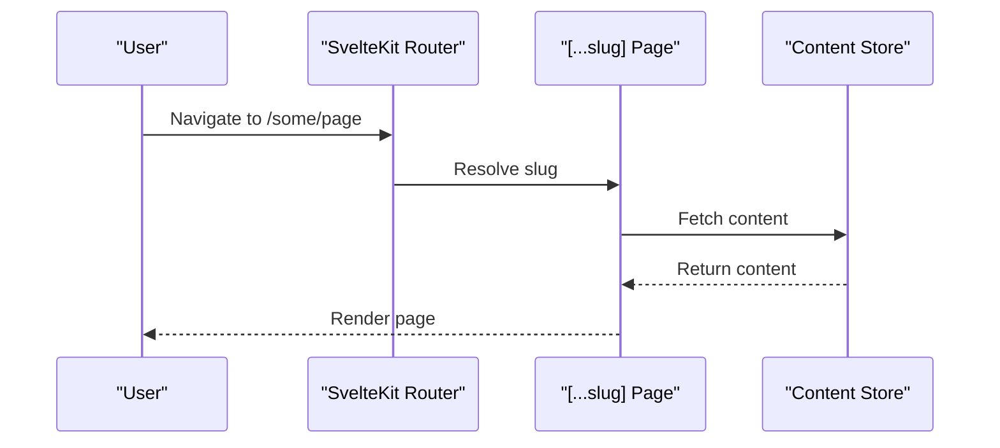
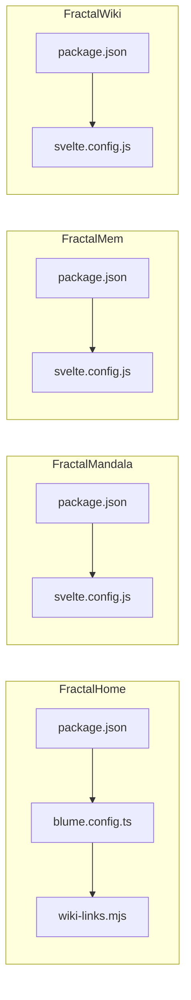

# Personal Knowledge Management Sites

<cite>
**Referenced Files in This Document**
- [README.md](file://README.md)
- [package.json](file://sites/fractalhome/package.json)
- [blume.config.ts](file://sites/fractalhome/blume.config.ts)
- [wiki-links.mjs](file://sites/fractalhome/wiki-links.mjs)
- [package.json](file://sites/fractalmandala/package.json)
- [svelte.config.js](file://sites/fractalmandala/svelte.config.js)
- [README.md](file://sites/fractalmandala/README.md)
- [package.json](file://sites/fractalmem/package.json)
- [svelte.config.js](file://sites/fractalmem/svelte.config.js)
- [package.json](file://sites/fractalwiki/package.json)
- [svelte.config.js](file://sites/fractalwiki/svelte.config.js)
</cite>

## Table of Contents
1. Introduction
2. Project Structure
3. Core Components
4. Architecture Overview
5. Detailed Component Analysis
6. Dependency Analysis
7. Performance Considerations
8. Troubleshooting Guide
9. Conclusion
10. Appendices

## Introduction
This document explains the personal knowledge management sites built within the monorepo: FractalHome (personal wiki), FractalMandala (knowledge base), FractalMem (memory system), and FractalWiki (collaborative platform). It outlines shared architectural patterns, content organization strategies for large knowledge bases, specialized features such as graph visualization, tagging systems, and cross-referencing, and clarifies each site’s purpose and target audience. It also provides guidance on migrating content between systems, backup strategies, and scaling considerations for growing repositories.

The monorepo uses SvelteKit + Svelte 5 + Tauri + TypeScript with single-tab indented SASS styling. The root pnpm-lock.yaml is canonical and should not be treated as a build artifact. External knowledge corpus paths outside the project root are part of the same knowledge base and should be considered when planning migrations and backups.

**Section sources**
- [README.md:1-50](file://README.md#L1-L50)

## Project Structure
At a high level, the four sites live under sites/:
- sites/fractalhome: Astro-based wiki powered by Blume, with custom wiki-link resolution and tag pages.
- sites/fractalmandala: SvelteKit knowledge base with mdsvex, FlexSearch indexing, and Graphology/Sigma-based graph visualization.
- sites/fractalmem: SvelteKit memory system with mdsvex and GitHub Flavored Markdown support.
- sites/fractalwiki: SvelteKit collaborative wiki with dynamic routes and minimal preprocessing.

**Diagram sources**
- [package.json](file://sites/fractalhome/package.json)
- [blume.config.ts](file://sites/fractalhome/blume.config.ts)
- [package.json](file://sites/fractalmandala/package.json)
- [svelte.config.js](file://sites/fractalmandala/svelte.config.js)
- [svelte.config.js](file://sites/fractalmem/svelte.config.js)
- [svelte.config.js](file://sites/fractalwiki/svelte.config.js)

**Section sources**
- [package.json](file://sites/fractalhome/package.json)
- [blume.config.ts](file://sites/fractalhome/blume.config.ts)
- [package.json](file://sites/fractalmandala/package.json)
- [svelte.config.js](file://sites/fractalmandala/svelte.config.js)
- [svelte.config.js](file://sites/fractalmem/svelte.config.js)
- [svelte.config.js](file://sites/fractalwiki/svelte.config.js)

## Core Components
- FractalHome (Blume/Astro):
  - Custom wiki-link integration that maps [[Page]] syntax to generated routes.
  - Frontmatter schema for tags, sources, related items, timestamps, projects, bosses, groups, supergroups, and links.
  - Tag pages and navigation configuration.
- FractalMandala (SvelteKit/mdsvex):
  - Content organized per domain with INDEX.md and per-topic markdown files.
  - Graph visualization using Graphology and Sigma; search via FlexSearch.
  - Sync script to synchronize banks across content directories.
- FractalMem (SvelteKit/mdsvex):
  - Documentation-focused structure with mdsvex and GFM.
  - Scripts for behavioral probes and metrics.
- FractalWiki (SvelteKit):
  - Dynamic routing for collaborative editing and publishing.
  - Minimal preprocessing to keep authoring simple.

**Section sources**
- [blume.config.ts](file://sites/fractalhome/blume.config.ts)
- [wiki-links.mjs](file://sites/fractalhome/wiki-links.mjs)
- [package.json](file://sites/fractalmandala/package.json)
- [svelte.config.js](file://sites/fractalmandala/svelte.config.js)
- [svelte.config.js](file://sites/fractalmem/svelte.config.js)
- [svelte.config.js](file://sites/fractalwiki/svelte.config.js)

## Architecture Overview
All sites share a common modern web stack and content-first approach. Differences lie in rendering engines and feature sets:
- FractalHome uses Blume/Astro for fast static generation and a custom wiki-link pipeline.
- FractalMandala emphasizes graph exploration and search over a rich knowledge base.
- FractalMem focuses on memory-related documentation and experiments.
- FractalWiki provides a collaborative-friendly route model for team-authored content.

[No sources needed since this diagram shows conceptual workflow, not actual code structure]

## Detailed Component Analysis

### FractalHome (Personal Wiki)
- Purpose: Personal wiki with strong cross-referencing and tagging.
- Key features:
  - Wiki-link resolver converts [[Page]] to internal links based on docs tree traversal and frontmatter titles.
  - Frontmatter schema supports tags, sources, related entries, timestamps, and organizational fields (project, boss, group, supergroup).
  - Tag pages and navigation tabs.
- Content organization:
  - Hierarchical folders per topic with INDEX.md and page-level markdown files.
- Cross-referencing:
  - Custom integration scans docs directory, builds a title-to-route map, and rewrites wiki links at render time.

**Diagram sources**
- [wiki-links.mjs](file://sites/fractalhome/wiki-links.mjs)
- [blume.config.ts](file://sites/fractalhome/blume.config.ts)

**Section sources**
- [blume.config.ts](file://sites/fractalhome/blume.config.ts)
- [wiki-links.mjs](file://sites/fractalhome/wiki-links.mjs)

### FractalMandala (Knowledge Base)
- Purpose: A comprehensive knowledge base with graph visualization and search.
- Key features:
  - mdsvex for Markdown processing.
  - FlexSearch for client-side search.
  - Graphology + Sigma for interactive graph visualization.
  - Gray-matter for frontmatter parsing.
  - Sync script to synchronize banks across content directories.
- Content organization:
  - Domain-based folders (e.g., Archaeology, Civilization, History) with INDEX.md and per-topic files.
  - CONNECTION.ts files per domain to define relationships.
- Graph and search:
  - Graph data derived from content and connections; rendered via Sigma.
  - Search index generated during build.

**Diagram sources**
- [package.json](file://sites/fractalmandala/package.json)
- [svelte.config.js](file://sites/fractalmandala/svelte.config.js)

**Section sources**
- [package.json](file://sites/fractalmandala/package.json)
- [svelte.config.js](file://sites/fractalmandala/svelte.config.js)
- [README.md](file://sites/fractalmandala/README.md)

### FractalMem (Memory System)
- Purpose: Experimental site and package for Sanskrit-based agent memory and related documentation.
- Key features:
  - SvelteKit with mdsvex and GitHub Flavored Markdown.
  - Scripts for behavioral probes and metrics collection.
- Content organization:
  - Docs under routes/docs with structured markdown files.
- Use cases:
  - Memory modeling, agent behavior probing, and metric tracking.

**Diagram sources**
- [svelte.config.js](file://sites/fractalmem/svelte.config.js)

**Section sources**
- [svelte.config.js](file://sites/fractalmem/svelte.config.js)

### FractalWiki (Collaborative Platform)
- Purpose: Collaborative wiki with dynamic routes for team-authored content.
- Key features:
  - SvelteKit without mdsvex preprocessing for simplicity.
  - Dynamic [...slug] routes to serve arbitrary pages.
- Content organization:
  - Route-driven content serving suitable for CMS-like workflows.

**Diagram sources**
- [svelte.config.js](file://sites/fractalwiki/svelte.config.js)

**Section sources**
- [svelte.config.js](file://sites/fractalwiki/svelte.config.js)

## Dependency Analysis
Each site declares its dependencies and scripts in package.json, while svelte.config.js or blume.config.ts defines preprocessing and adapters.

**Diagram sources**
- [package.json](file://sites/fractalhome/package.json)
- [blume.config.ts](file://sites/fractalhome/blume.config.ts)
- [wiki-links.mjs](file://sites/fractalhome/wiki-links.mjs)
- [package.json](file://sites/fractalmandala/package.json)
- [svelte.config.js](file://sites/fractalmandala/svelte.config.js)
- [package.json](file://sites/fractalmem/package.json)
- [svelte.config.js](file://sites/fractalmem/svelte.config.js)
- [package.json](file://sites/fractalwiki/package.json)
- [svelte.config.js](file://sites/fractalwiki/svelte.config.js)

**Section sources**
- [package.json](file://sites/fractalhome/package.json)
- [blume.config.ts](file://sites/fractalhome/blume.config.ts)
- [wiki-links.mjs](file://sites/fractalhome/wiki-links.mjs)
- [package.json](file://sites/fractalmandala/package.json)
- [svelte.config.js](file://sites/fractalmandala/svelte.config.js)
- [package.json](file://sites/fractalmem/package.json)
- [svelte.config.js](file://sites/fractalmem/svelte.config.js)
- [package.json](file://sites/fractalwiki/package.json)
- [svelte.config.js](file://sites/fractalwiki/svelte.config.js)

## Performance Considerations
- Static generation vs serverless:
  - FractalHome (Astro/Blume) produces static assets quickly; ensure link resolution runs efficiently during build.
  - FractalMandala generates search indexes and graph assets; consider caching and incremental builds for large content sets.
- Client-side search:
  - FlexSearch index size impacts load time; split indexes by domain or paginate results.
- Graph visualization:
  - Limit node counts per view; use force-layout only when necessary; precompute layouts where possible.
- Styling:
  - Single-tab SASS reduces complexity; avoid deep nesting to minimize CSS bloat.
- Monorepo tooling:
  - Use pnpm workspaces to manage dependencies and reduce duplication across sites.

[No sources needed since this section provides general guidance]

## Troubleshooting Guide
- Wiki links not resolving:
  - Ensure the docs root path matches the integration configuration and that frontmatter titles exist for linked pages.
- mdsvex preprocessing issues:
  - Verify extensions list includes .md and .svx; confirm remark plugins are correctly configured.
- Search index missing or outdated:
  - Re-run build to regenerate search index; check for content changes not reflected in index.
- Graph visualization errors:
  - Validate graph data structures; ensure nodes and edges conform to expected schemas.
- Deployment adapter configuration:
  - Confirm adapter runtime versions match environment constraints.

**Section sources**
- [wiki-links.mjs](file://sites/fractalhome/wiki-links.mjs)
- [svelte.config.js](file://sites/fractalmandala/svelte.config.js)
- [svelte.config.js](file://sites/fractalmem/svelte.config.js)
- [svelte.config.js](file://sites/fractalwiki/svelte.config.js)

## Conclusion
These four sites form a cohesive ecosystem for personal and collaborative knowledge management. FractalHome excels at cross-referencing and tagging; FractalMandala adds graph exploration and search; FractalMem focuses on memory-related documentation and experiments; FractalWiki offers a collaborative route model. Shared patterns include content-first architecture, Markdown-based authoring, and modular feature integrations. For growth, adopt consistent frontmatter schemas, maintain robust indexing, and plan for scalable storage and deployment.

[No sources needed since this section summarizes without analyzing specific files]

## Appendices

### Content Organization Strategies for Large Knowledge Bases
- Domain-based folders with INDEX.md per domain.
- Per-topic markdown files with clear naming conventions.
- CONNECTION.ts files to define relationships between topics.
- Consistent frontmatter fields for tags, sources, related entries, and timestamps.

[No sources needed since this section provides general guidance]

### Specialized Features
- Graph visualization:
  - Use Graphology for data modeling and Sigma for rendering.
- Tagging system:
  - Centralize tag pages and frontmatter validation.
- Cross-referencing:
  - Implement wiki-link resolvers that scan content trees and rewrite links at build time.

[No sources needed since this section provides general guidance]

### Migration Guidance Between Systems
- From FractalHome to FractalMandala:
  - Export content and frontmatter; map tags and related fields.
  - Generate CONNECTION.ts files to preserve relationships.
  - Rebuild search index and graph assets.
- To FractalWiki:
  - Convert folder structure to route-based content if needed.
  - Ensure dynamic routes resolve to correct content sources.

[No sources needed since this section provides general guidance]

### Backup Strategies
- Version control:
  - Commit all content and configuration to Git; treat pnpm-lock.yaml as canonical.
- External corpus:
  - Include external knowledge paths in backups to maintain completeness.
- Automated snapshots:
  - Schedule periodic backups of content directories and generated outputs.

[No sources needed since this section provides general guidance]

### Scaling Considerations
- Incremental builds:
  - Leverage framework capabilities to rebuild only changed parts.
- Indexed search partitioning:
  - Split indexes by domain or user roles.
- Graph scaling:
  - Precompute layouts and limit visible nodes per interaction.
- Deployment:
  - Use serverless adapters with appropriate runtime versions; cache static assets effectively.

[No sources needed since this section provides general guidance]