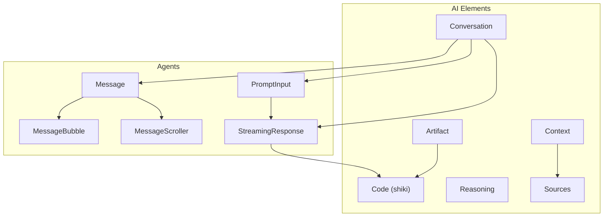
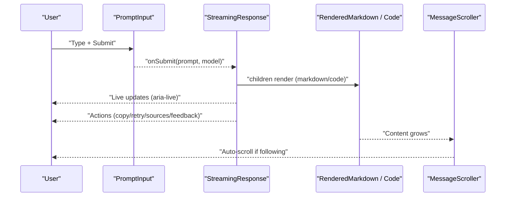
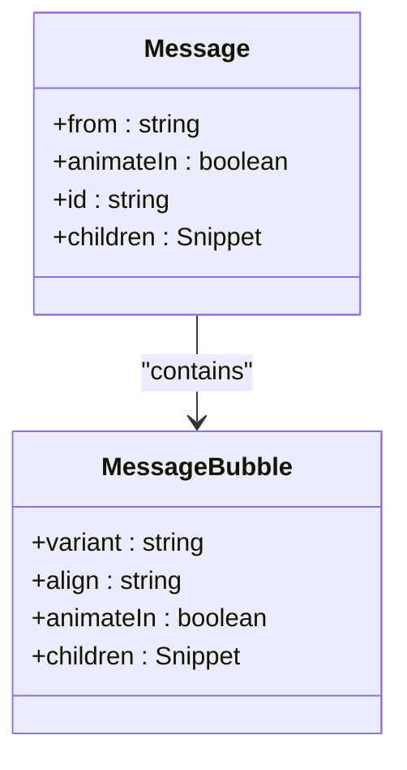
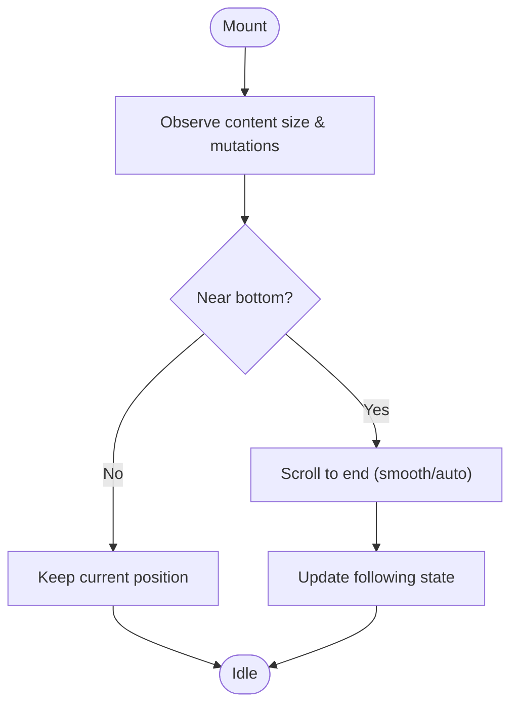
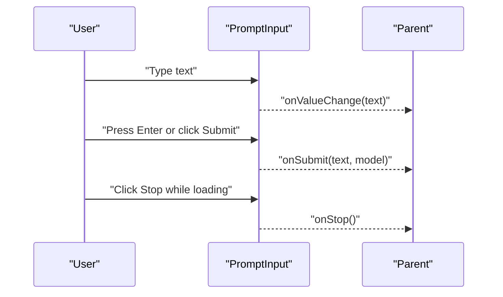
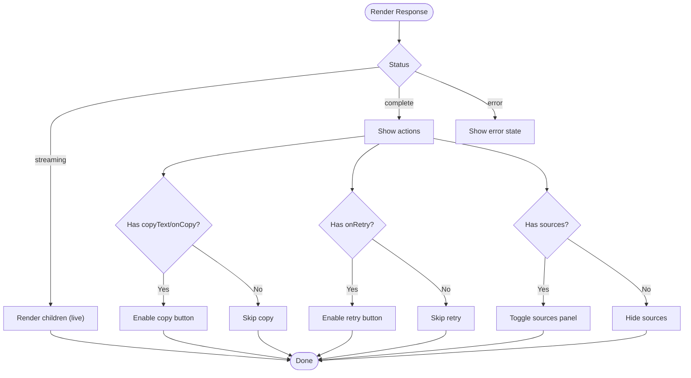
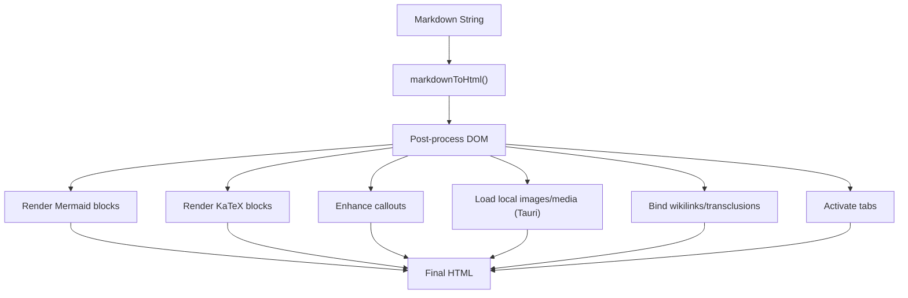
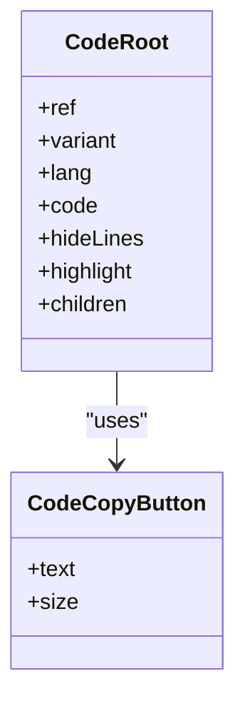
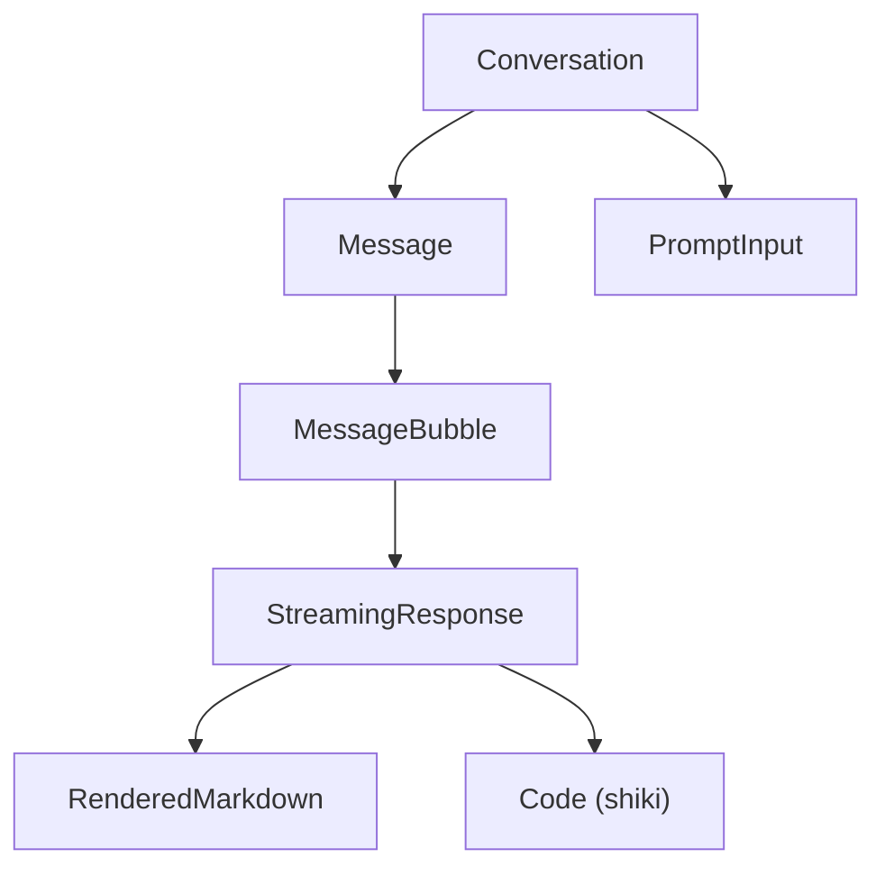
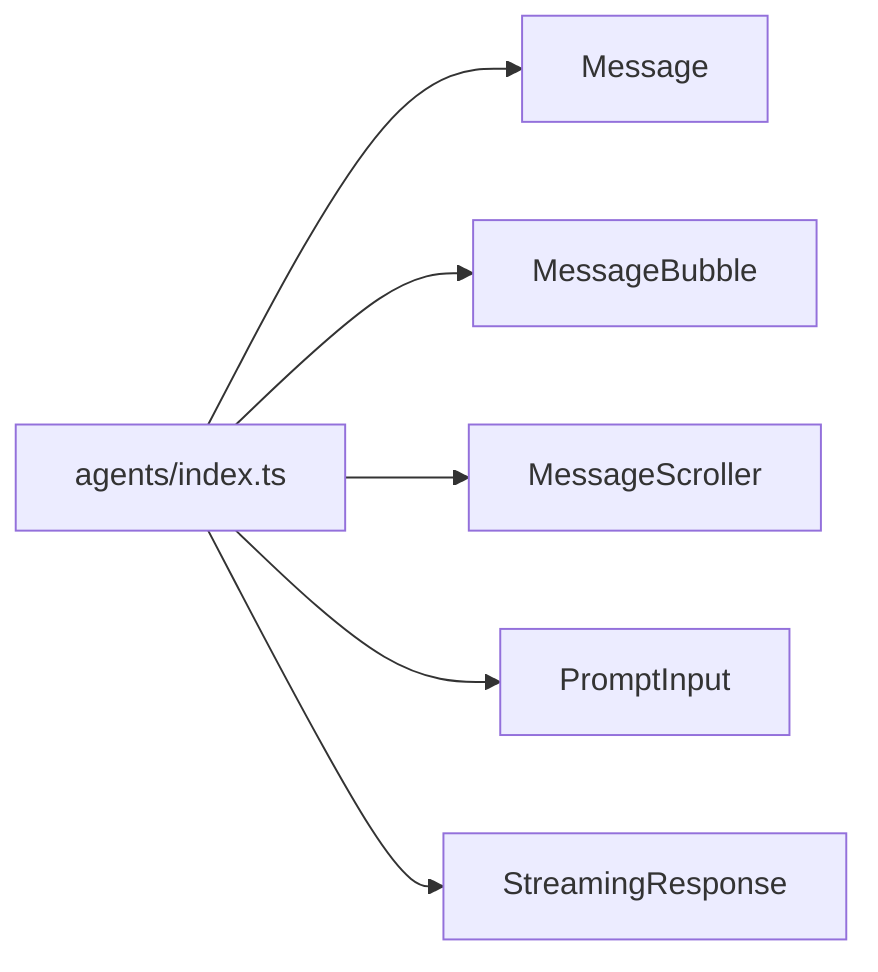

# AI-Specific Components

<cite>
**Referenced Files in This Document**
- [index.ts](file://packages/fractal-svelte/src/lib/components/agents/index.ts)
- [message.svelte](file://packages/fractal-svelte/src/lib/components/agents/message/message.svelte)
- [streaming-response.svelte](file://packages/fractal-svelte/src/lib/components/agents/streaming-response/streaming-response.svelte)
- [prompt-input.svelte](file://packages/fractal-svelte/src/lib/components/agents/prompt-input/prompt-input.svelte)
- [message-bubble.svelte](file://packages/fractal-svelte/src/lib/components/agents/message-bubble/message-bubble.svelte)
- [message-scroller.svelte](file://packages/fractal-svelte/src/lib/components/agents/message-scroller/message-scroller.svelte)
- [RenderedMarkdown.svelte](file://apps/fracta/src/lib/components/RenderedMarkdown.svelte)
- [markdown.ts](file://apps/fracta/src/lib/markdown.ts)
- [code.svelte](file://packages/fractalsvelte/src/lib/components/ai-elements/code/code.svelte)
</cite>

## Table of Contents
1. Introduction
2. Project Structure
3. Core Components
4. Architecture Overview
5. Detailed Component Analysis
6. Dependency Analysis
7. Performance Considerations
8. Troubleshooting Guide
9. Conclusion

## Introduction
This document explains the AI-focused UI components in Fractalsvelte, including Conversation, Message, Code, Artifact, and related elements. It covers real-time streaming updates, markdown rendering, syntax highlighting with shiki, and rich text editing capabilities. Practical examples show how to compose chat interfaces, code editors, document viewers, and AI agent interactions. Guidance is also provided for performance optimization with large datasets, memory management, and smooth user experiences during AI processing.

## Project Structure
The AI components are organized into two primary areas:
- Agents components (chat primitives): message composition, streaming responses, prompt input, and scrollers.
- AI Elements (richer UI blocks): code highlighting, artifacts, inline citations, reasoning, context panels, and more.

[No sources needed since this diagram shows conceptual structure]

## Core Components
- Message: a semantic container for assistant/user messages with accessible attributes and optional animation.
- MessageBubble: a styled bubble wrapper that resolves alignment and variant based on context.
- MessageScroller: an accessible scroll region with auto-follow behavior, live regions, and reduced-motion support.
- PromptInput: a resizable textarea with model selection, actions menu, and submit/stop controls.
- StreamingResponse: a response shell with copy/retry, feedback toggles, and collapsible sources list.
- RenderedMarkdown: a markdown renderer with Mermaid diagrams, KaTeX math, callouts, local assets, transclusions, and tabs.
- Code (shiki): a syntax-highlighted code block using shiki, with copy button integration.

Key props and behaviors are exposed via Svelte 5 runes ($props, $state, $derived, $effect) for reactive, fine-grained updates.

**Section sources**
- [message.svelte:1-24](file://packages/fractal-svelte/src/lib/components/agents/message/message.svelte#L1-L24)
- [message-bubble.svelte:1-41](file://packages/fractal-svelte/src/lib/components/agents/message-bubble/message-bubble.svelte#L1-L41)
- [message-scroller.svelte:1-96](file://packages/fractal-svelte/src/lib/components/agents/message-scroller/message-scroller.svelte#L1-L96)
- [prompt-input.svelte:1-141](file://packages/fractal-svelte/src/lib/components/agents/prompt-input/prompt-input.svelte#L1-L141)
- [streaming-response.svelte:1-129](file://packages/fractal-svelte/src/lib/components/agents/streaming-response/streaming-response.svelte#L1-L129)
- [RenderedMarkdown.svelte:1-185](file://apps/fracta/src/lib/components/RenderedMarkdown.svelte#L1-L185)
- [markdown.ts:1-207](file://apps/fracta/src/lib/markdown.ts#L1-L207)
- [code.svelte:1-36](file://packages/fractalsvelte/src/lib/components/ai-elements/code/code.svelte#L1-L36)

## Architecture Overview
The AI UI architecture composes small, focused components into higher-level surfaces like Chat and Agent Panels. Data flows from prompts through streaming responses to rendered content (markdown, code, artifacts). Accessibility and performance are built-in via aria-live regions, reduced motion checks, and lazy loading of heavy features.

**Diagram sources**
- [prompt-input.svelte:1-141](file://packages/fractal-svelte/src/lib/components/agents/prompt-input/prompt-input.svelte#L1-L141)
- [streaming-response.svelte:1-129](file://packages/fractal-svelte/src/lib/components/agents/streaming-response/streaming-response.svelte#L1-L129)
- [RenderedMarkdown.svelte:1-185](file://apps/fracta/src/lib/components/RenderedMarkdown.svelte#L1-L185)
- [message-scroller.svelte:1-96](file://packages/fractal-svelte/src/lib/components/agents/message-scroller/message-scroller.svelte#L1-L96)

## Detailed Component Analysis

### Message and MessageBubble
Message provides a semantic article element with data attributes and accessibility labels. MessageBubble wraps content with alignment and variant resolution, reading context from the parent message.

**Diagram sources**
- [message.svelte:1-24](file://packages/fractal-svelte/src/lib/components/agents/message/message.svelte#L1-L24)
- [message-bubble.svelte:1-41](file://packages/fractal-svelte/src/lib/components/agents/message-bubble/message-bubble.svelte#L1-L41)

**Section sources**
- [message.svelte:1-24](file://packages/fractal-svelte/src/lib/components/agents/message/message.svelte#L1-L24)
- [message-bubble.svelte:1-41](file://packages/fractal-svelte/src/lib/components/agents/message-bubble/message-bubble.svelte#L1-L41)

### MessageScroller
An accessible scrolling viewport with:
- Auto-follow behavior when near the bottom
- Smooth scrolling respecting prefers-reduced-motion
- Live region for screen readers
- Observers for content changes and resizing

**Diagram sources**
- [message-scroller.svelte:1-96](file://packages/fractal-svelte/src/lib/components/agents/message-scroller/message-scroller.svelte#L1-L96)

**Section sources**
- [message-scroller.svelte:1-96](file://packages/fractal-svelte/src/lib/components/agents/message-scroller/message-scroller.svelte#L1-L96)

### PromptInput
A robust input component supporting:
- Resizable textarea with min/max rows
- Model selector dropdown
- Actions menu for tool insertion
- Submit/Stop toggle with keyboard handling

**Diagram sources**
- [prompt-input.svelte:1-141](file://packages/fractal-svelte/src/lib/components/agents/prompt-input/prompt-input.svelte#L1-L141)

**Section sources**
- [prompt-input.svelte:1-141](file://packages/fractal-svelte/src/lib/components/agents/prompt-input/prompt-input.svelte#L1-L141)

### StreamingResponse
Wraps streamed content with:
- Copy-to-clipboard with visual feedback
- Retry action
- Feedback buttons (up/down)
- Collapsible sources list with links and domains
- aria-live announcements controlled by announce prop

**Diagram sources**
- [streaming-response.svelte:1-129](file://packages/fractal-svelte/src/lib/components/agents/streaming-response/streaming-response.svelte#L1-L129)

**Section sources**
- [streaming-response.svelte:1-129](file://packages/fractal-svelte/src/lib/components/agents/streaming-response/streaming-response.svelte#L1-L129)

### RenderedMarkdown
A comprehensive markdown renderer that:
- Converts markdown to HTML via marked
- Renders Mermaid diagrams lazily
- Renders KaTeX math expressions
- Enhances callouts and footnotes
- Loads local assets in Tauri via IPC
- Supports transclusions and attachments
- Activates interactive tabs

**Diagram sources**
- [RenderedMarkdown.svelte:1-185](file://apps/fracta/src/lib/components/RenderedMarkdown.svelte#L1-L185)
- [markdown.ts:1-207](file://apps/fracta/src/lib/markdown.ts#L1-L207)

**Section sources**
- [RenderedMarkdown.svelte:1-185](file://apps/fracta/src/lib/components/RenderedMarkdown.svelte#L1-L185)
- [markdown.ts:1-207](file://apps/fracta/src/lib/markdown.ts#L1-L207)

### Code (Syntax Highlighting with Shiki)
The Code component integrates shiki-based syntax highlighting:
- Accepts language, code, highlight ranges, and line hiding options
- Uses a shared hook to compute highlighted HTML safely
- Provides a copy button integration

**Diagram sources**
- [code.svelte:1-36](file://packages/fractalsvelte/src/lib/components/ai-elements/code/code.svelte#L1-L36)

**Section sources**
- [code.svelte:1-36](file://packages/fractalsvelte/src/lib/components/ai-elements/code/code.svelte#L1-L36)

### Conceptual Overview
Typical chat interface composition:
- Conversation surface holds a list of Messages
- Each Message contains a MessageBubble with content (StreamingResponse)
- StreamingResponse renders Markdown or Code blocks
- PromptInput triggers new messages and manages stop/cancel

[No sources needed since this diagram shows conceptual workflow]

## Dependency Analysis
Agent components export a cohesive set of primitives used across the AI UI layer. The index file centralizes exports for easy consumption.

**Diagram sources**
- [index.ts:1-10](file://packages/fractal-svelte/src/lib/components/agents/index.ts#L1-L10)

**Section sources**
- [index.ts:1-10](file://packages/fractal-svelte/src/lib/components/agents/index.ts#L1-L10)

## Performance Considerations
- Lazy loading: Defer heavy libraries (Mermaid, KaTeX) until needed; RenderedMarkdown already uses dynamic imports.
- Efficient scrolling: MessageScroller uses ResizeObserver and MutationObserver to minimize reflows and only scrolls when necessary.
- Reduced motion: Respect prefers-reduced-motion for smoother UX on low-power devices.
- Memory management: Revoke object URLs after use (as seen in asset handling) to prevent leaks.
- Incremental updates: Use Svelte 5 runes for granular reactivity; avoid unnecessary full re-renders.
- Large datasets: Virtualize long lists outside these components; keep each message lightweight and defer non-critical rendering.

[No sources needed since this section provides general guidance]

## Troubleshooting Guide
- Markdown not rendering: Ensure markdownToHtml is called and post-processing effects run after DOM update.
- Mermaid/KaTeX errors: Inspect fenced code blocks and ensure language classes are present; errors are caught gracefully.
- Local assets unavailable: In Tauri, verify readWorkspaceImageAsset/readWorkspaceMediaAsset permissions and paths.
- Scrolling not following: Check followOutput and followThreshold; wheel or arrow keys will disable auto-follow.
- Copy/Feedback not working: Verify onCopy/onRetry handlers and ensure status is not streaming when actions are shown.

**Section sources**
- [RenderedMarkdown.svelte:1-185](file://apps/fracta/src/lib/components/RenderedMarkdown.svelte#L1-L185)
- [message-scroller.svelte:1-96](file://packages/fractal-svelte/src/lib/components/agents/message-scroller/message-scroller.svelte#L1-L96)
- [streaming-response.svelte:1-129](file://packages/fractal-svelte/src/lib/components/agents/streaming-response/streaming-response.svelte#L1-L129)

## Conclusion
Fractalsvelte’s AI components provide a modular, accessible, and performant foundation for building modern chat interfaces. With streaming responses, rich markdown rendering, and shiki-powered code highlighting, developers can assemble polished AI-driven experiences. Following the performance and troubleshooting guidance ensures smooth interactions even under heavy workloads.