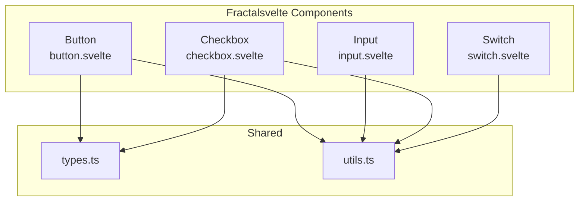
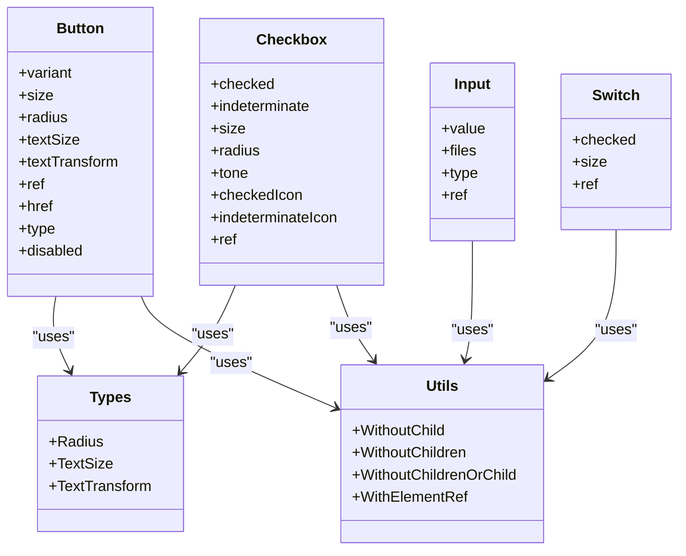
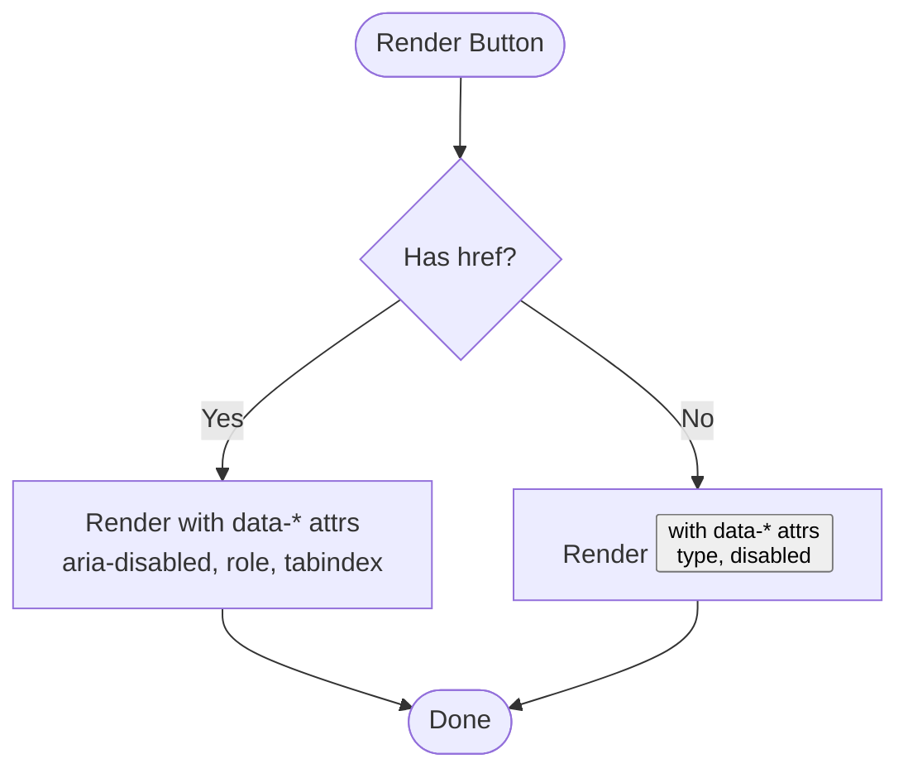
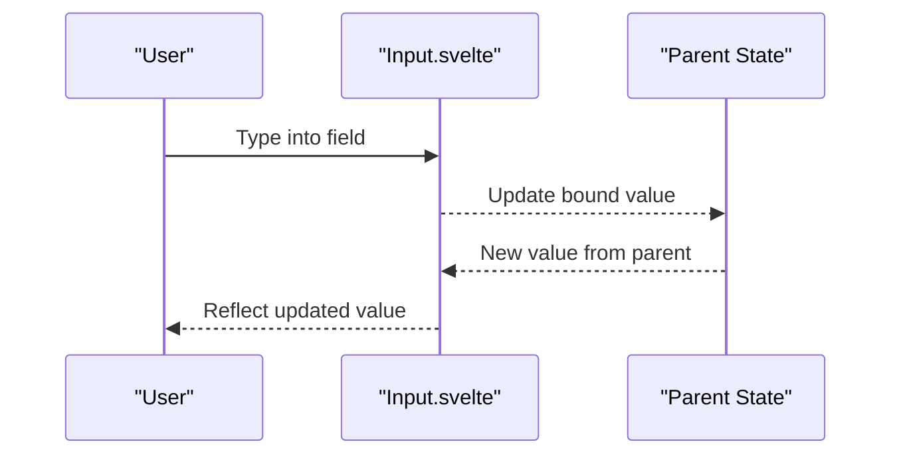
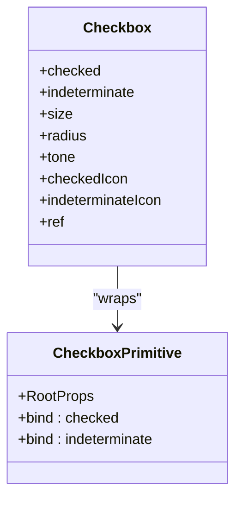
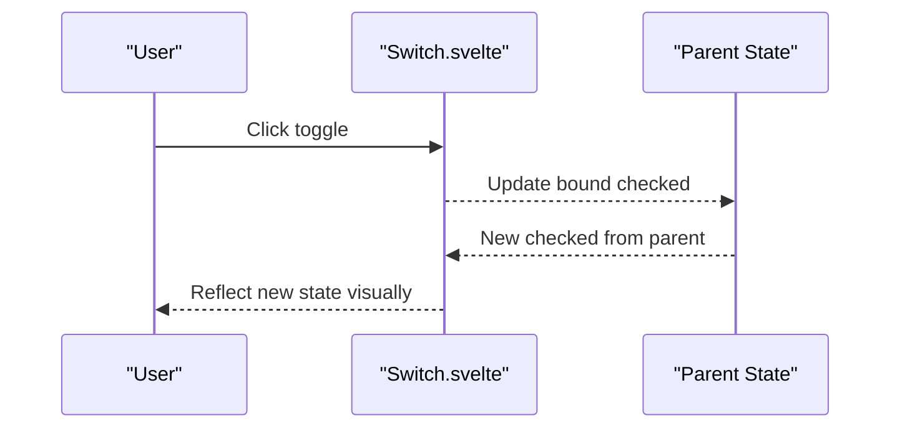
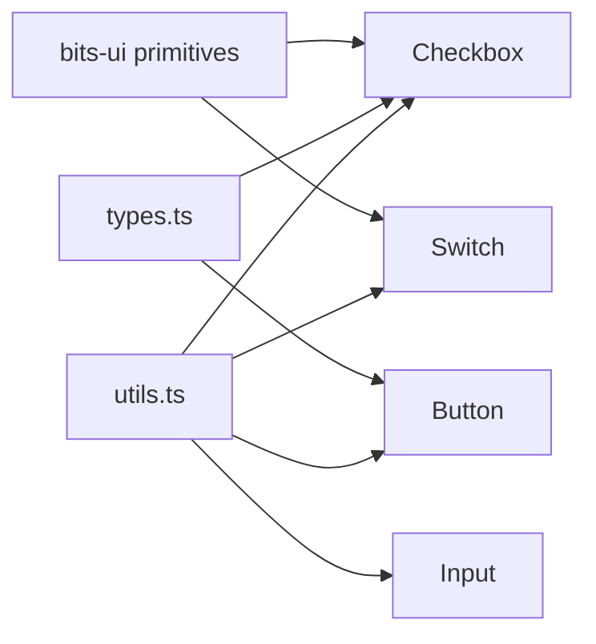

# Basic UI Components

<cite>
**Referenced Files in This Document**
- [button.svelte](file://packages/fractalsvelte/src/lib/components/button/button.svelte)
- [button.sass](file://packages/fractalsvelte/src/lib/components/button/button.sass)
- [input.svelte](file://packages/fractalsvelte/src/lib/components/input/input.svelte)
- [checkbox.svelte](file://packages/fractalsvelte/src/lib/components/checkbox/checkbox.svelte)
- [checkbox.sass](file://packages/fractalsvelte/src/lib/components/checkbox/checkbox.sass)
- [switch.svelte](file://packages/fractalsvelte/src/lib/components/switch/switch.svelte)
- [switch.sass](file://packages/fractalsvelte/src/lib/components/switch/switch.sass)
- [types.ts](file://packages/fractalsvelte/src/lib/types.ts)
- [utils.ts](file://packages/fractalsvelte/src/lib/utils.ts)
</cite>

## Table of Contents
1. [Introduction](#introduction)
2. [Project Structure](#project-structure)
3. [Core Components](#core-components)
4. [Architecture Overview](#architecture-overview)
5. [Detailed Component Analysis](#detailed-component-analysis)
6. [Dependency Analysis](#dependency-analysis)
7. [Performance Considerations](#performance-considerations)
8. [Troubleshooting Guide](#troubleshooting-guide)
9. [Conclusion](#conclusion)
10. [Appendices](#appendices)

## Introduction
This document explains the basic UI components in Fractalsvelte: Button, Input, Checkbox, and Switch. It covers props, events, styling options, accessibility features, Svelte 5 runes integration, TypeScript support, and customization patterns. You will also find common use cases for form inputs, toggle controls, and action buttons with guidance on validation and error handling.

## Project Structure
The basic UI primitives live under packages/fractalsvelte/src/lib/components. Each component is implemented as a Svelte 5 component with an accompanying .sass stylesheet. Shared types and utilities are centralized to keep prop surfaces consistent across components.

**Diagram sources**
- [button.svelte](file://packages/fractalsvelte/src/lib/components/button/button.svelte)
- [input.svelte](file://packages/fractalsvelte/src/lib/components/input/input.svelte)
- [checkbox.svelte](file://packages/fractalsvelte/src/lib/components/checkbox/checkbox.svelte)
- [switch.svelte](file://packages/fractalsvelte/src/lib/components/switch/switch.svelte)
- [types.ts](file://packages/fractalsvelte/src/lib/types.ts)
- [utils.ts](file://packages/fractalsvelte/src/lib/utils.ts)

**Section sources**
- [button.svelte](file://packages/fractalsvelte/src/lib/components/button/button.svelte)
- [input.svelte](file://packages/fractalsvelte/src/lib/components/input/input.svelte)
- [checkbox.svelte](file://packages/fractalsvelte/src/lib/components/checkbox/checkbox.svelte)
- [switch.svelte](file://packages/fractalsvelte/src/lib/components/switch/switch.svelte)
- [types.ts](file://packages/fractalsvelte/src/lib/types.ts)
- [utils.ts](file://packages/fractalsvelte/src/lib/utils.ts)

## Core Components
This section summarizes the fundamental interactive elements and their key characteristics.

- Button
  - Purpose: Triggers actions or navigates when used as a link.
  - Props: variant, size, radius, textSize, textTransform, ref, href, type, disabled, plus standard HTML attributes via restProps.
  - Behavior: Renders <button> by default; switches to <a> when href is provided.
  - Styling: Controlled via data attributes (data-variant, data-size, data-radius, data-text-size, data-transform) and button.sass.
  - Accessibility: aria-disabled and role applied when disabled; tabindex managed for disabled state.

- Input
  - Purpose: Collects user input; supports all native input types except file unless explicitly typed.
  - Props: ref, value, files, type, data-slot, plus standard HTML attributes via restProps.
  - Behavior: Two modes — generic text-like inputs bind value; file inputs bind files.
  - Styling: Uses data-slot="input" for styling hooks.

- Checkbox
  - Purpose: Binary selection with optional indeterminate state.
  - Props: ref, checked, indeterminate, size, radius, tone, checkedIcon, indeterminateIcon, plus primitive root props.
  - Behavior: Built on bits-ui primitive; exposes checked and indeterminate bindings.
  - Styling: data-slot="checkbox", data-size, data-radius, data-tone; checkbox.sass handles states and variants.
  - Accessibility: Managed by bits-ui primitive; indicator slot renders check or dash icons.

- Switch
  - Purpose: Toggle control for boolean settings.
  - Props: ref, checked, size, plus primitive root props.
  - Behavior: Built on bits-ui primitive; exposes checked binding.
  - Styling: data-slot="switch", data-size; switch.sass manages thumb animation and states.
  - Accessibility: Managed by bits-ui primitive.

**Section sources**
- [button.svelte](file://packages/fractalsvelte/src/lib/components/button/button.svelte)
- [button.sass](file://packages/fractalsvelte/src/lib/components/button/button.sass)
- [input.svelte](file://packages/fractalsvelte/src/lib/components/input/input.svelte)
- [checkbox.svelte](file://packages/fractalsvelte/src/lib/components/checkbox/checkbox.svelte)
- [checkbox.sass](file://packages/fractalsvelte/src/lib/components/checkbox/checkbox.sass)
- [switch.svelte](file://packages/fractalsvelte/src/lib/components/switch/switch.svelte)
- [switch.sass](file://packages/fractalsvelte/src/lib/components/switch/switch.sass)

## Architecture Overview
All components follow a consistent pattern:
- Explicit props surface for customization (no class merging).
- Data attributes drive styling via SASS selectors.
- Svelte 5 runes ($props, $bindable) manage reactivity and two-way binding.
- Shared types ensure consistent vocabulary (radius, textSize, textTransform).
- Utilities provide reusable type helpers (WithElementRef, WithoutChildrenOrChild).

**Diagram sources**
- [types.ts](file://packages/fractalsvelte/src/lib/types.ts)
- [utils.ts](file://packages/fractalsvelte/src/lib/utils.ts)
- [button.svelte](file://packages/fractalsvelte/src/lib/components/button/button.svelte)
- [input.svelte](file://packages/fractalsvelte/src/lib/components/input/input.svelte)
- [checkbox.svelte](file://packages/fractalsvelte/src/lib/components/checkbox/checkbox.svelte)
- [switch.svelte](file://packages/fractalsvelte/src/lib/components/switch/switch.svelte)

## Detailed Component Analysis

### Button
- Props and behavior
  - variant: default, outline, secondary, ghost, destructive, link.
  - size: default, xs, sm, lg, icon, icon-xs, icon-sm, icon-lg.
  - radius: overrides skin’s pill radius using shared Radius type.
  - textSize: overrides font-size set by size using shared TextSize type.
  - textTransform: uppercase, lowercase, capitalize, none.
  - ref: element reference binding.
  - href: when present, renders <a>; otherwise <button>.
  - type: defaults to "button".
  - disabled: disables interaction and updates ARIA attributes.
  - children: rendered content.
  - restProps: forwarded to the underlying element.

- Styling
  - Driven by data attributes and button.sass.
  - Focus ring, hover effects, and sizes are defined via mixins and variables.

- Accessibility
  - aria-disabled and role applied when disabled.
  - tabindex adjusted for disabled links.

- Svelte 5 runes
  - Uses $props() and $bindable(ref).

- TypeScript
  - Strongly typed props via ButtonProps and shared types.

- Common usage patterns
  - Action buttons: variant="default", size="sm"/"default"/"lg".
  - Destructive actions: variant="destructive".
  - Link-style navigation: href with variant="link".

**Diagram sources**
- [button.svelte](file://packages/fractalsvelte/src/lib/components/button/button.svelte)
- [button.sass](file://packages/fractalsvelte/src/lib/components/button/button.sass)

**Section sources**
- [button.svelte](file://packages/fractalsvelte/src/lib/components/button/button.svelte)
- [button.sass](file://packages/fractalsvelte/src/lib/components/button/button.sass)

### Input
- Props and behavior
  - value: two-way bound for non-file inputs.
  - files: two-way bound for type="file".
  - type: restricts to valid input types; file mode handled separately.
  - ref: element reference binding.
  - data-slot: allows wrapper components to override slot name intentionally.
  - restProps: forwarded to the underlying <input>.

- Styling
  - data-slot="input" is the primary styling hook.

- Accessibility
  - Inherits native input semantics; pair with Label/Form components for full accessibility.

- Svelte 5 runes
  - Uses $props() and $bindable(value/files/ref).

- TypeScript
  - InputProps enforces correct typing for type and files.

- Common usage patterns
  - Text fields: bind:value to a reactive variable.
  - File upload: type="file" and bind:files to a FileList.

**Diagram sources**
- [input.svelte](file://packages/fractalsvelte/src/lib/components/input/input.svelte)

**Section sources**
- [input.svelte](file://packages/fractalsvelte/src/lib/components/input/input.svelte)

### Checkbox
- Props and behavior
  - checked: two-way boolean binding.
  - indeterminate: two-way boolean binding for tri-state scenarios.
  - size: sm, default, lg.
  - radius: shared Radius type.
  - tone: default or accent.
  - checkedIcon, indeterminateIcon: custom Snippet slots for indicators.
  - ref: element reference binding.
  - Primitive props: forwarded from bits-ui Checkbox.Root.

- Styling
  - data-slot="checkbox", data-size, data-radius, data-tone.
  - checkbox.sass defines checked/indeterminate states, focus rings, and invalid styles.

- Accessibility
  - bits-ui primitive manages ARIA roles and keyboard interactions.

- Svelte 5 runes
  - Uses $props() and $bindable(checked/indeterminate/ref).

- TypeScript
  - CheckboxProps extends primitive root props with additional UI-specific props.

- Common usage patterns
  - Single choice: bind:checked to a boolean.
  - Tri-state: bind:indeterminate for partial selection.
  - Custom icons: pass Snippets for checkedIcon/indeterminateIcon.

**Diagram sources**
- [checkbox.svelte](file://packages/fractalsvelte/src/lib/components/checkbox/checkbox.svelte)
- [checkbox.sass](file://packages/fractalsvelte/src/lib/components/checkbox/checkbox.sass)

**Section sources**
- [checkbox.svelte](file://packages/fractalsvelte/src/lib/components/checkbox/checkbox.svelte)
- [checkbox.sass](file://packages/fractalsvelte/src/lib/components/checkbox/checkbox.sass)

### Switch
- Props and behavior
  - checked: two-way boolean binding.
  - size: sm, default.
  - ref: element reference binding.
  - Primitive props: forwarded from bits-ui Switch.Root.

- Styling
  - data-slot="switch", data-size.
  - switch.sass animates thumb position and applies theme-aware colors.

- Accessibility
  - bits-ui primitive manages ARIA roles and keyboard interactions.

- Svelte 5 runes
  - Uses $props() and $bindable(checked/ref).

- TypeScript
  - SwitchProps extends primitive root props with size and ref.

- Common usage patterns
  - Toggle settings: bind:checked to a boolean flag.

**Diagram sources**
- [switch.svelte](file://packages/fractalsvelte/src/lib/components/switch/switch.svelte)
- [switch.sass](file://packages/fractalsvelte/src/lib/components/switch/switch.sass)

**Section sources**
- [switch.svelte](file://packages/fractalsvelte/src/lib/components/switch/switch.svelte)
- [switch.sass](file://packages/fractalsvelte/src/lib/components/switch/switch.sass)

## Dependency Analysis
- External dependencies
  - bits-ui provides accessible primitives for Checkbox and Switch.
- Internal dependencies
  - All components import shared types (Radius, TextSize, TextTransform) and utility types (WithElementRef, WithoutChildrenOrChild).
- Styling dependency
  - SASS modules apply styles based on data attributes; no Tailwind classes are used in these components.

**Diagram sources**
- [checkbox.svelte](file://packages/fractalsvelte/src/lib/components/checkbox/checkbox.svelte)
- [switch.svelte](file://packages/fractalsvelte/src/lib/components/switch/switch.svelte)
- [button.svelte](file://packages/fractalsvelte/src/lib/components/button/button.svelte)
- [input.svelte](file://packages/fractalsvelte/src/lib/components/input/input.svelte)
- [types.ts](file://packages/fractalsvelte/src/lib/types.ts)
- [utils.ts](file://packages/fractalsvelte/src/lib/utils.ts)

**Section sources**
- [checkbox.svelte](file://packages/fractalsvelte/src/lib/components/checkbox/checkbox.svelte)
- [switch.svelte](file://packages/fractalsvelte/src/lib/components/switch/switch.svelte)
- [button.svelte](file://packages/fractalsvelte/src/lib/components/button/button.svelte)
- [input.svelte](file://packages/fractalsvelte/src/lib/components/input/input.svelte)
- [types.ts](file://packages/fractalsvelte/src/lib/types.ts)
- [utils.ts](file://packages/fractalsvelte/src/lib/utils.ts)

## Performance Considerations
- Minimal runtime overhead: components rely on Svelte 5 runes and lightweight data attributes rather than heavy class merging.
- Efficient re-renders: two-way bindings update only the necessary parts.
- Styling performance: CSS selectors target data attributes directly; avoid excessive DOM mutations.
- Icon rendering: Checkbox uses inline SVGs by default; consider providing lightweight snippets if customizing.

[No sources needed since this section provides general guidance]

## Troubleshooting Guide
- Button not clickable
  - Ensure disabled is not set unintentionally; verify href is provided when expecting link behavior.
  - Check that aria-disabled and tabindex are correctly applied by the component.

- Input value not updating
  - Confirm you are binding value for non-file inputs or files for type="file".
  - Verify that the parent state is reactive and assigned back to the component.

- Checkbox visual state mismatch
  - Ensure both checked and indeterminate are set appropriately; bits-ui expects consistent state.
  - If using custom icons, make sure Snippets render correctly.

- Switch toggle not reflecting
  - Bind checked to a reactive variable and ensure it is updated on change.
  - Verify size prop matches expected dimensions in your layout.

- Styling not applying
  - Confirm data attributes match expected values (e.g., data-variant, data-size).
  - Ensure SASS styles are included in the build pipeline.

**Section sources**
- [button.svelte](file://packages/fractalsvelte/src/lib/components/button/button.svelte)
- [input.svelte](file://packages/fractalsvelte/src/lib/components/input/input.svelte)
- [checkbox.svelte](file://packages/fractalsvelte/src/lib/components/checkbox/checkbox.svelte)
- [switch.svelte](file://packages/fractalsvelte/src/lib/components/switch/switch.svelte)

## Conclusion
Fractalsvelte’s basic UI components provide a consistent, accessible, and customizable foundation for building forms and interactive interfaces. By leveraging explicit props, data-driven styling, and Svelte 5 runes, they offer a clean API with strong TypeScript support. Use the patterns outlined here to implement robust forms, toggles, and action buttons with predictable behavior and maintainable styling.

[No sources needed since this section summarizes without analyzing specific files]

## Appendices

### Prop Reference Summary
- Button
  - variant, size, radius, textSize, textTransform, ref, href, type, disabled, children, restProps
- Input
  - value, files, type, ref, data-slot, restProps
- Checkbox
  - checked, indeterminate, size, radius, tone, checkedIcon, indeterminateIcon, ref, primitive props
- Switch
  - checked, size, ref, primitive props

**Section sources**
- [button.svelte](file://packages/fractalsvelte/src/lib/components/button/button.svelte)
- [input.svelte](file://packages/fractalsvelte/src/lib/components/input/input.svelte)
- [checkbox.svelte](file://packages/fractalsvelte/src/lib/components/checkbox/checkbox.svelte)
- [switch.svelte](file://packages/fractalsvelte/src/lib/components/switch/switch.svelte)

### Accessibility Notes
- Buttons: aria-disabled and role applied when disabled; tabindex managed for disabled links.
- Inputs: Pair with labels and form components for full accessibility.
- Checkbox/Switch: bits-ui primitives handle ARIA roles and keyboard navigation.

**Section sources**
- [button.svelte](file://packages/fractalsvelte/src/lib/components/button/button.svelte)
- [checkbox.svelte](file://packages/fractalsvelte/src/lib/components/checkbox/checkbox.svelte)
- [switch.svelte](file://packages/fractalsvelte/src/lib/components/switch/switch.svelte)

### Customization Patterns
- Use props for sizing, color variants, and typography instead of overriding classes.
- For Checkbox/Switch, customize indicators via Snippets or adjust tone/radius where supported.
- For Button, combine variant and size to achieve desired look; override radius/textSize when needed.

**Section sources**
- [types.ts](file://packages/fractalsvelte/src/lib/types.ts)
- [button.svelte](file://packages/fractalsvelte/src/lib/components/button/button.svelte)
- [checkbox.svelte](file://packages/fractalsvelte/src/lib/components/checkbox/checkbox.svelte)
- [switch.svelte](file://packages/fractalsvelte/src/lib/components/switch/switch.svelte)