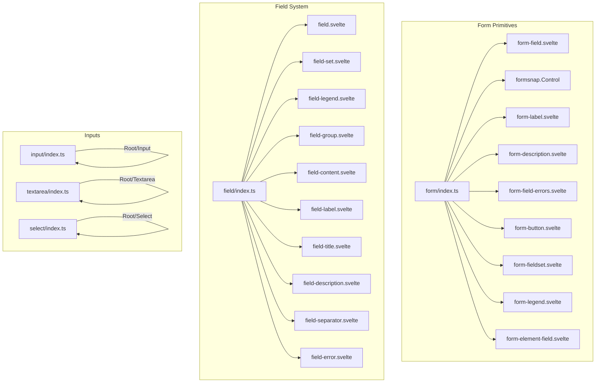
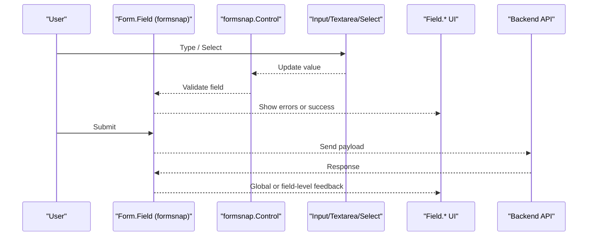
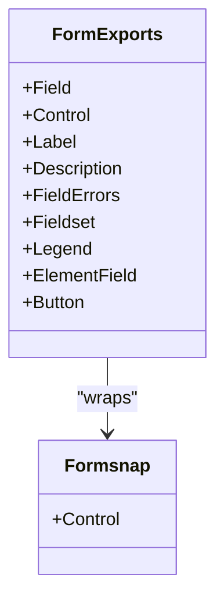
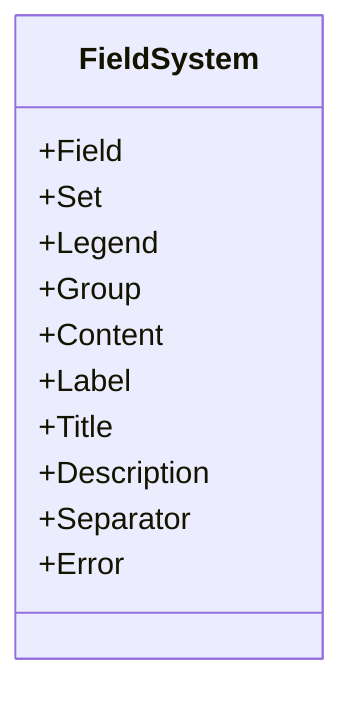
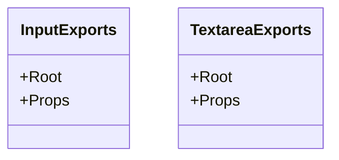
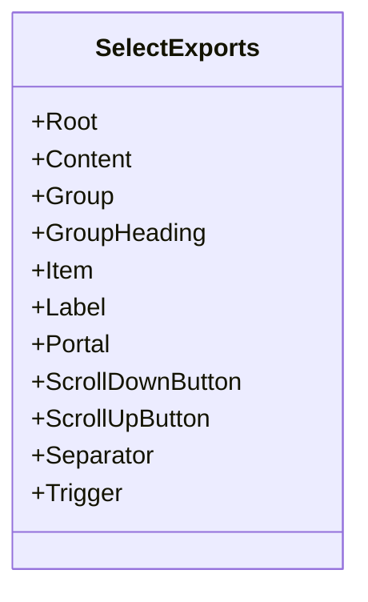
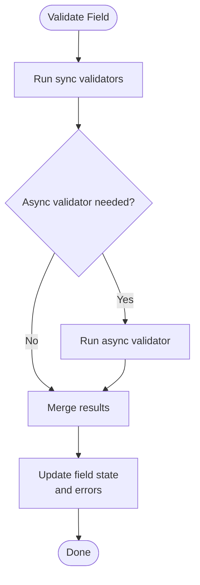
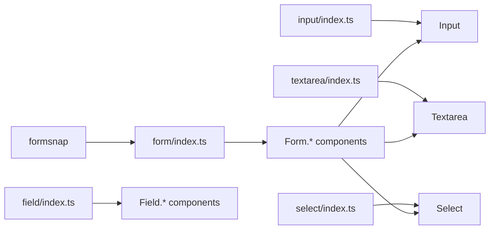

# Form Components

<cite>
**Referenced Files in This Document**
- [form/index.ts](file://packages/fractalsvelte/src/lib/components/form/index.ts)
- [field/index.ts](file://packages/fractalsvelte/src/lib/components/field/index.ts)
- [input/index.ts](file://packages/fractalsvelte/src/lib/components/input/index.ts)
- [select/index.ts](file://packages/fractalsvelte/src/lib/components/select/index.ts)
- [textarea/index.ts](file://packages/fractalsvelte/src/lib/components/textarea/index.ts)
</cite>

## Table of Contents
1. [Introduction](#introduction)
2. [Project Structure](#project-structure)
3. [Core Components](#core-components)
4. [Architecture Overview](#architecture-overview)
5. [Detailed Component Analysis](#detailed-component-analysis)
6. [Dependency Analysis](#dependency-analysis)
7. [Performance Considerations](#performance-considerations)
8. [Troubleshooting Guide](#troubleshooting-guide)
9. [Conclusion](#conclusion)
10. [Appendices](#appendices)

## Introduction
This document provides comprehensive documentation for form-related components in Fractalsvelte, focusing on the Form primitives built with formsnap and the Field system used to structure and present form controls. It covers:
- Form primitives (Form, Field, Label, Description, Errors, Button) powered by formsnap
- Field composition primitives (Field, Set, Legend, Group, Content, Label, Title, Description, Separator, Error)
- Input and Textarea components for text entry
- Select component for selection workflows
- Validation patterns using formsnap integration
- Field state management with Svelte 5 runes
- Accessibility considerations
- Complex form layouts, custom validators, error handling strategies, and backend API integration
- Responsive design and mobile-friendly input patterns

## Project Structure
The form-related components are organized under packages/fractalsvelte/src/lib/components with clear per-component directories and index files that re-export public APIs. The key modules relevant to forms are:
- form: Wraps formsnap primitives and exposes a consistent API surface
- field: Composition-oriented primitives for structuring fields and their metadata
- input: Text input primitive
- textarea: Multi-line text input primitive
- select: Selection primitive with content, groups, labels, triggers, and portal support

**Diagram sources**
- [form/index.ts:1-41](file://packages/fractalsvelte/src/lib/components/form/index.ts#L1-L41)
- [field/index.ts:1-51](file://packages/fractalsvelte/src/lib/components/field/index.ts#L1-L51)
- [input/index.ts:1-10](file://packages/fractalsvelte/src/lib/components/input/index.ts#L1-L10)
- [textarea/index.ts:1-10](file://packages/fractalsvelte/src/lib/components/textarea/index.ts#L1-L10)
- [select/index.ts:1-52](file://packages/fractalsvelte/src/lib/components/select/index.ts#L1-L52)

**Section sources**
- [form/index.ts:1-41](file://packages/fractalsvelte/src/lib/components/form/index.ts#L1-L41)
- [field/index.ts:1-51](file://packages/fractalsvelte/src/lib/components/field/index/index.ts#L1-L51)
- [input/index.ts:1-10](file://packages/fractalsvelte/src/lib/components/input/index.ts#L1-L10)
- [textarea/index.ts:1-10](file://packages/fractalsvelte/src/lib/components/textarea/index.ts#L1-L10)
- [select/index.ts:1-52](file://packages/fractalsvelte/src/lib/components/select/index.ts#L1-L52)

## Core Components
- Form primitives (from formsnap):
  - Control: Binds values and validation state to inputs
  - Field: Groups control and its label/description/errors
  - Label, Description, FieldErrors: Accessible labeling and messaging
  - Fieldset, Legend: Semantic grouping for complex forms
  - ElementField: Bridges native elements into formsnap’s field model
  - Button: Submit helper integrated with form submission lifecycle
- Field system:
  - Field, Set, Legend, Group, Content, Label, Title, Description, Separator, Error: Composable building blocks to structure and style form sections
- Inputs:
  - Input: Single-line text input
  - Textarea: Multi-line text input
  - Select: Full-featured selection with trigger, content, groups, labels, separators, scroll buttons, and portal

These modules expose both default names and explicit aliases (e.g., Field as FormField, Control as FormControl) for clarity and consistency across usage.

**Section sources**
- [form/index.ts:1-41](file://packages/fractalsvelte/src/lib/components/form/index.ts#L1-L41)
- [field/index.ts:1-51](file://packages/fractalsvelte/src/lib/components/field/index.ts#L1-L51)
- [input/index.ts:1-10](file://packages/fractalsvelte/src/lib/components/input/index.ts#L1-L10)
- [textarea/index.ts:1-10](file://packages/fractalsvelte/src/lib/components/textarea/index.ts#L1-L10)
- [select/index.ts:1-52](file://packages/fractalsvelte/src/lib/components/select/index.ts#L1-L52)

## Architecture Overview
The form architecture combines two complementary layers:
- Data and validation layer via formsnap: Provides controlled fields, validation, submission, and error tracking through primitives like Control and Field
- Presentation and layout layer via Field system: Offers composable primitives to structure, label, describe, and visually separate form sections

**Diagram sources**
- [form/index.ts:1-41](file://packages/fractalsvelte/src/lib/components/form/index.ts#L1-L41)
- [input/index.ts:1-10](file://packages/fractalsvelte/src/lib/components/input/index.ts#L1-L10)
- [textarea/index.ts:1-10](file://packages/fractalsvelte/src/lib/components/textarea/index.ts#L1-L10)
- [select/index.ts:1-52](file://packages/fractalsvelte/src/lib/components/select/index.ts#L1-L52)

## Detailed Component Analysis

### Form Primitives (formsnap-based)
- Purpose: Provide controlled fields, validation, and submission semantics
- Key exports include Field, Control, Label, Description, FieldErrors, Fieldset, Legend, ElementField, and Button
- Integration: Uses formsnap primitives under the hood; exposes friendly aliases for clarity

**Diagram sources**
- [form/index.ts:1-41](file://packages/fractalsvelte/src/lib/components/form/index.ts#L1-L41)

**Section sources**
- [form/index.ts:1-41](file://packages/fractalsvelte/src/lib/components/form/index.ts#L1-L41)

### Field System
- Purpose: Compose rich, accessible form layouts with semantic grouping and styling
- Exposes Root/Set/Legend/Group/Content/Label/Title/Description/Separator/Error with typed props
- Use cases: Organize multi-section forms, add titles and descriptions, separate sections, display field-specific errors

**Diagram sources**
- [field/index.ts:1-51](file://packages/fractalsvelte/src/lib/components/field/index.ts#L1-L51)

**Section sources**
- [field/index.ts:1-51](file://packages/fractalsvelte/src/lib/components/field/index.ts#L1-L51)

### Input and Textarea
- Input: Single-line text entry with standard HTML attributes exposed via props
- Textarea: Multi-line text entry with similar prop surface
- Both export Root and typed Props for type-safe usage

**Diagram sources**
- [input/index.ts:1-10](file://packages/fractalsvelte/src/lib/components/input/index.ts#L1-L10)
- [textarea/index.ts:1-10](file://packages/fractalsvelte/src/lib/components/textarea/index.ts#L1-L10)

**Section sources**
- [input/index.ts:1-10](file://packages/fractalsvelte/src/lib/components/input/index.ts#L1-L10)
- [textarea/index.ts:1-10](file://packages/fractalsvelte/src/lib/components/textarea/index.ts#L1-L10)

### Select
- Purpose: Accessible selection interface with robust composition
- Exposes Root, Content, Group, GroupHeading, Item, Label, Portal, ScrollDownButton, ScrollUpButton, Separator, Trigger
- Supports keyboard navigation, scrolling, and portal rendering for overlay behavior

**Diagram sources**
- [select/index.ts:1-52](file://packages/fractalsvelte/src/lib/components/select/index.ts#L1-L52)

**Section sources**
- [select/index.ts:1-52](file://packages/fractalsvelte/src/lib/components/select/index.ts#L1-L52)

### Validation Patterns with formsnap
- Controlled fields: Bind values and validation state via Control
- Field-level validation: Define rules per field; errors surface through FieldErrors
- Submission flow: Collect validated data on submit; handle server responses and map errors back to fields
- Custom validators: Implement async/sync validators and integrate them with formsnap’s validation pipeline

[No sources needed since this diagram shows conceptual workflow, not actual code structure]

### Field State Management with Svelte 5 Runes
- Recommended pattern: Use Svelte 5 runes ($state, $derived, $effect) to manage local field state when not using formsnap-controlled fields
- For formsnap-driven forms: Prefer formsnap’s Control and Field for unified validation and submission semantics
- Combine runes for derived states (e.g., isValid, isDirty) and effects for side effects like debounced validation or analytics

[No sources needed since this section doesn't analyze specific files]

### Accessibility Compliance
- Labels: Always associate labels with inputs; use Label from both form and field systems appropriately
- Descriptions and Errors: Use Description and FieldErrors to provide context and feedback
- Semantics: Use Fieldset and Legend to group related controls
- Keyboard navigation: Ensure focus management and ARIA attributes are handled by primitives (Select, Dialogs, etc.)
- Screen readers: Provide meaningful aria-labels and roles where necessary

[No sources needed since this section doesn't analyze specific files]

### Complex Form Layouts
- Use Field.Set and Field.Group to create multi-column or nested sections
- Apply Field.Separator to visually divide sections
- Combine Field.Title and Field.Description for contextual guidance
- Integrate multiple inputs (Input, Textarea, Select) within Field.Content for consistent spacing and alignment

[No sources needed since this section doesn't analyze specific files]

### Custom Validators and Error Handling Strategies
- Sync validators: Return boolean or error messages directly
- Async validators: Handle network checks (e.g., uniqueness) and resolve/reject accordingly
- Server-side errors: Map response errors to field keys and update field-level errors
- Global errors: Display non-field-specific messages at the form level

[No sources needed since this section doesn't analyze specific files]

### Backend API Integration
- On submit, serialize form data and send via fetch or HTTP client
- Handle loading states during submission
- Map server errors to field-level errors or global messages
- Reset or patch form state based on successful responses

[No sources needed since this section doesn't analyze specific files]

### Responsive Design and Mobile-Friendly Inputs
- Use Field.Group with responsive gaps and orientations
- Prefer larger touch targets for Select triggers and Buttons
- Use Textarea for longer inputs; consider auto-resize if supported
- Ensure overlays (Select content, dialogs) are accessible on small screens

[No sources needed since this section doesn't analyze specific files]

## Dependency Analysis
The form module depends on formsnap for core form primitives and exposes a curated set of components. The field module is self-contained and focuses on presentation and layout. Input, Textarea, and Select are independent primitives that can be composed within forms.

**Diagram sources**
- [form/index.ts:1-41](file://packages/fractalsvelte/src/lib/components/form/index.ts#L1-L41)
- [field/index.ts:1-51](file://packages/fractalsvelte/src/lib/components/field/index.ts#L1-L51)
- [input/index.ts:1-10](file://packages/fractalsvelte/src/lib/components/input/index.ts#L1-L10)
- [textarea/index.ts:1-10](file://packages/fractalsvelte/src/lib/components/textarea/index.ts#L1-L10)
- [select/index.ts:1-52](file://packages/fractalsvelte/src/lib/components/select/index.ts#L1-L52)

**Section sources**
- [form/index.ts:1-41](file://packages/fractalsvelte/src/lib/components/form/index.ts#L1-L41)
- [field/index.ts:1-51](file://packages/fractalsvelte/src/lib/components/field/index.ts#L1-L51)
- [input/index.ts:1-10](file://packages/fractalsvelte/src/lib/components/input/index.ts#L1-L10)
- [textarea/index.ts:1-10](file://packages/fractalsvelte/src/lib/components/textarea/index.ts#L1-L10)
- [select/index.ts:1-52](file://packages/fractalsvelte/src/lib/components/select/index.ts#L1-L52)

## Performance Considerations
- Prefer formsnap’s Control for controlled fields to avoid unnecessary re-renders
- Debounce async validators to reduce network calls
- Avoid heavy computations inside render paths; use $derived for computed values
- Keep Select lists virtualized if large datasets are expected
- Minimize reflows by batching updates and avoiding frequent DOM mutations

[No sources needed since this section provides general guidance]

## Troubleshooting Guide
Common issues and resolutions:
- Uncontrolled vs controlled fields: Ensure inputs are bound via formsnap.Control when using Form.Field
- Missing labels: Associate labels explicitly to improve accessibility and prevent warnings
- Validation not triggering: Verify validators are attached to the correct field and that submission logic invokes validation
- Overlay positioning: Ensure Select Portal is mounted in a suitable container and z-index is configured correctly
- Focus management: Confirm focus moves logically after validation errors or successful submissions

[No sources needed since this section provides general guidance]

## Conclusion
Fractalsvelte’s form ecosystem combines formsnap-powered primitives for robust validation and submission with a flexible Field system for composing accessible, responsive layouts. By leveraging these components alongside Svelte 5 runes and best practices for validation and accessibility, you can build complex, user-friendly forms efficiently.

[No sources needed since this section summarizes without analyzing specific files]

## Appendices

### Quick Reference: Component Exports
- Form: Field, Control, Label, Description, FieldErrors, Fieldset, Legend, ElementField, Button
- Field: Field, Set, Legend, Group, Content, Label, Title, Description, Separator, Error
- Input: Root, Props
- Textarea: Root, Props
- Select: Root, Content, Group, GroupHeading, Item, Label, Portal, ScrollDownButton, ScrollUpButton, Separator, Trigger

**Section sources**
- [form/index.ts:1-41](file://packages/fractalsvelte/src/lib/components/form/index.ts#L1-L41)
- [field/index.ts:1-51](file://packages/fractalsvelte/src/lib/components/field/index.ts#L1-L51)
- [input/index.ts:1-10](file://packages/fractalsvelte/src/lib/components/input/index.ts#L1-L10)
- [textarea/index.ts:1-10](file://packages/fractalsvelte/src/lib/components/textarea/index.ts#L1-L10)
- [select/index.ts:1-52](file://packages/fractalsvelte/src/lib/components/select/index.ts#L1-L52)