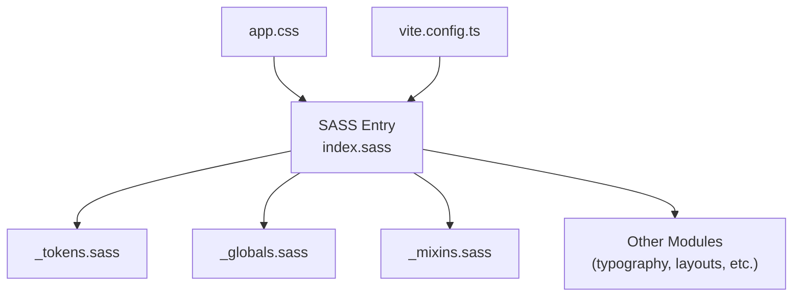
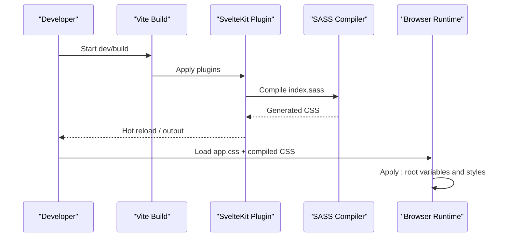
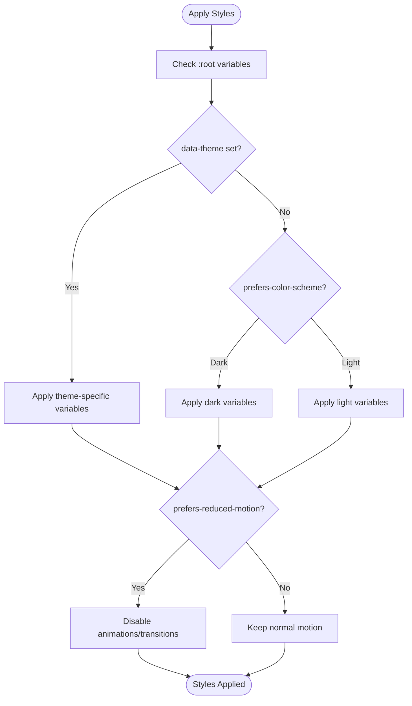
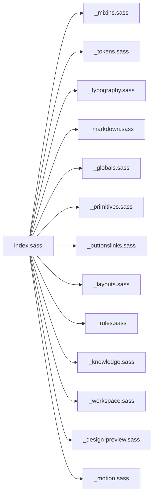

# Styling and Theming System

<cite>
**Referenced Files in This Document**
- [index.sass](file://apps/fracta/src/lib/styles/index.sass)
- [_tokens.sass](file://apps/fracta/src/lib/styles/_tokens.sass)
- [_globals.sass](file://apps/fracta/src/lib/styles/_globals.sass)
- [_mixins.sass](file://apps/fracta/src/lib/styles/_mixins.sass)
- [app.css](file://apps/fracta/src/app.css)
- [vite.config.ts](file://apps/fracta/vite.config.ts)
- [theme-template.css](file://packages/fractalsvelte/scripts/oracle/theme-template.css)
- [themes.json](file://packages/fractalsvelte/src/lib/themes.json)
- [themes.ts](file://packages/fractalsvelte/src/lib/themes.ts)
</cite>

## Table of Contents
1. [Introduction](#introduction)
2. [Project Structure](#project-structure)
3. [Core Components](#core-components)
4. [Architecture Overview](#architecture-overview)
5. [Detailed Component Analysis](#detailed-component-analysis)
6. [Dependency Analysis](#dependency-analysis)
7. [Performance Considerations](#performance-considerations)
8. [Troubleshooting Guide](#troubleshooting-guide)
9. [Conclusion](#conclusion)
10. [Appendices](#appendices)

## Introduction
This document explains the styling and theming system used by Fractalsvelte, focusing on the SASS-based approach, CSS custom properties (variables), and theme customization patterns. It covers how to override default styles, create custom themes, maintain design consistency across components, implement dark/light modes, apply responsive design patterns, and optimize performance. It also documents the build system configuration with Vite and dependency management relevant to styling.

## Project Structure
The styling system is organized around a token-driven SASS architecture:
- A central SASS entry file composes all style modules.
- Tokens define colors, typography, spacing, motion, radii, and semantic surfaces.
- Global resets and base styles establish consistent defaults.
- Responsive breakpoints are provided via mixins for consistent media queries.
- The application’s root CSS file declares that styling is driven by tokens and indented SASS.
- Vite config integrates SvelteKit and sets development watch behavior.

**Diagram sources**
- [index.sass:1-14](file://apps/fracta/src/lib/styles/index.sass#L1-L14)
- [_tokens.sass:1-161](file://apps/fracta/src/lib/styles/_tokens.sass#L1-L161)
- [_globals.sass:1-67](file://apps/fracta/src/lib/styles/_globals.sass#L1-L67)
- [_mixins.sass:1-25](file://apps/fracta/src/lib/styles/_mixins.sass#L1-L25)
- [app.css:1-2](file://apps/fracta/src/app.css#L1-L2)
- [vite.config.ts:1-14](file://apps/fracta/vite.config.ts#L1-L14)

**Section sources**
- [index.sass:1-14](file://apps/fracta/src/lib/styles/index.sass#L1-L14)
- [_tokens.sass:1-161](file://apps/fracta/src/lib/styles/_tokens.sass#L1-L161)
- [_globals.sass:1-67](file://apps/fracta/src/lib/styles/_globals.sass#L1-L67)
- [_mixins.sass:1-25](file://apps/fracta/src/lib/styles/_mixins.sass#L1-L25)
- [app.css:1-2](file://apps/fracta/src/app.css#L1-L2)
- [vite.config.ts:1-14](file://apps/fracta/vite.config.ts#L1-L14)

## Core Components
- Token layer: Centralizes color scales, semantic aliases, fonts, spacing, motion, radii, z-index, and window geometry. Includes light/dark mode definitions and reduced-motion preferences.
- Global layer: Establishes base typography, box-sizing, scrollbars, focus states, and utility classes.
- Mixins layer: Provides breakpoint mixins for responsive design.
- Entry composition: Orchestrates imports to produce the final stylesheet.

Key responsibilities:
- Tokens provide a single source of truth for visual values.
- Globals ensure consistent baseline behavior across browsers.
- Mixins encapsulate responsive breakpoints to avoid duplication.
- Entry file ensures predictable build order and modularity.

**Section sources**
- [_tokens.sass:1-161](file://apps/fracta/src/lib/styles/_tokens.sass#L1-L161)
- [_globals.sass:1-67](file://apps/fracta/src/lib/styles/_globals.sass#L1-L67)
- [_mixins.sass:1-25](file://apps/fracta/src/lib/styles/_mixins.sass#L1-L25)
- [index.sass:1-14](file://apps/fracta/src/lib/styles/index.sass#L1-L14)

## Architecture Overview
The styling architecture follows a layered approach:
- Application CSS references the token-driven SASS pipeline.
- SASS entry composes modules in a defined order.
- Tokens define CSS custom properties at :root, enabling runtime overrides and theme switching.
- Globals set base styles and accessibility-friendly defaults.
- Mixins standardize responsive breakpoints.
- Vite builds the SASS into CSS as part of the SvelteKit pipeline.

**Diagram sources**
- [vite.config.ts:1-14](file://apps/fracta/vite.config.ts#L1-L14)
- [index.sass:1-14](file://apps/fracta/src/lib/styles/index.sass#L1-L14)
- [_tokens.sass:1-161](file://apps/fracta/src/lib/styles/_tokens.sass#L1-L161)
- [_globals.sass:1-67](file://apps/fracta/src/lib/styles/_globals.sass#L1-L67)

## Detailed Component Analysis

### Token Layer and Theme Switching
Tokens define the entire visual language through CSS custom properties. They include:
- Color scales and semantic aliases for text, borders, actions, and surfaces.
- Typography families and font stacks.
- Spacing scale and control sizes.
- Motion timing and easing functions.
- Radii ladder and depth/shadow tokens.
- Window geometry constants.
- Dark/light mode variants using data-theme attributes and prefers-color-scheme.
- Reduced motion handling.

Theme switching mechanism:
- Default light theme variables are declared at :root.
- Dark theme variables are applied when :root[data-theme='dark'] is present.
- An explicit data-theme attribute takes precedence over OS preference.
- prefers-reduced-motion reduces animations globally.

To customize or extend themes:
- Override specific CSS custom properties in a higher-priority stylesheet or inline style.
- Use data-theme on the root element to switch between predefined themes.
- Introduce new tokens and alias them semantically to keep components decoupled from raw values.

**Diagram sources**
- [_tokens.sass:96-161](file://apps/fracta/src/lib/styles/_tokens.sass#L96-L161)

**Section sources**
- [_tokens.sass:1-161](file://apps/fracta/src/lib/styles/_tokens.sass#L1-L161)

### Global Base Styles and Accessibility
Globals establish:
- Consistent box-sizing and reset margins/padding.
- Default color and font family via CSS custom properties.
- Scrollbar hiding for a cleaner UI.
- Focus-visible outlines for keyboard navigation.
- Text wrapping utilities and heading normalization.
- Reduced motion fallbacks for accessibility.

Best practices:
- Rely on CSS custom properties for colors and fonts to ensure theme consistency.
- Use focus-visible to improve keyboard accessibility without mouse-only outlines.
- Keep global resets minimal to avoid unintended side effects.

**Section sources**
- [_globals.sass:1-67](file://apps/fracta/src/lib/styles/_globals.sass#L1-L67)

### Responsive Design with Breakpoint Mixins
Mixins provide standardized breakpoints:
- Small screens up to 720px.
- Medium screens up to 1024px.
- Large screens from 721px onward.
- Extra large screens from 1025px onward.
- Very large screens from 1201px onward.

Usage pattern:
- Wrap component rules inside breakpoint mixins to achieve consistent responsiveness.
- Prefer semantic tokens for spacing and sizing to maintain harmony across breakpoints.

**Section sources**
- [_mixins.sass:1-25](file://apps/fracta/src/lib/styles/_mixins.sass#L1-L25)

### SASS Composition and Build Integration
The SASS entry file composes modules in a deterministic order:
- Mixins first for availability.
- Tokens next to define variables.
- Typography, markdown, globals, primitives, buttons/links, layouts, rules, knowledge, workspace, design-preview, and motion modules follow.

Build integration:
- Vite uses the SvelteKit plugin to compile SASS during development and production.
- Watch settings ignore Rust build artifacts to prevent reload storms.

Customization workflow:
- Add or modify modules under the styles directory.
- Import new modules in the entry file to include them in the build.
- Ensure token changes propagate through semantic aliases to minimize component-level updates.

**Section sources**
- [index.sass:1-14](file://apps/fracta/src/lib/styles/index.sass#L1-L14)
- [vite.config.ts:1-14](file://apps/fracta/vite.config.ts#L1-L14)

### Package-Level Themes and Utilities
Fractalsvelte package includes theme-related assets and scripts:
- A theme template CSS file provides a starting point for generating or overriding themes.
- A themes JSON file defines available theme configurations.
- A themes TypeScript module exposes theme APIs for programmatic usage.

Recommendations:
- Use the theme template to scaffold new themes consistently.
- Extend or override tokens via CSS custom properties rather than duplicating component styles.
- Leverage the themes module to switch themes programmatically in components.

**Section sources**
- [theme-template.css](file://packages/fractalsvelte/scripts/oracle/theme-template.css)
- [themes.json](file://packages/fractalsvelte/src/lib/themes.json)
- [themes.ts](file://packages/fractalsvelte/src/lib/themes.ts)

## Dependency Analysis
Styling dependencies flow from the entry file down to individual modules:
- index.sass depends on mixins, tokens, typography, markdown, globals, primitives, buttons/links, layouts, rules, knowledge, workspace, design-preview, and motion.
- _tokens.sass defines CSS custom properties consumed by other modules.
- _globals.sass sets base styles that affect all components.
- _mixins.sass provides reusable responsive logic.

**Diagram sources**
- [index.sass:1-14](file://apps/fracta/src/lib/styles/index.sass#L1-L14)

**Section sources**
- [index.sass:1-14](file://apps/fracta/src/lib/styles/index.sass#L1-L14)

## Performance Considerations
- Minimize animation and transition usage; rely on prefers-reduced-motion to disable motion for users who prefer it.
- Use CSS custom properties to avoid heavy recalculations; they are resolved efficiently by the browser.
- Keep global resets minimal to reduce cascade overhead.
- Avoid deep selector nesting; use flat class names where possible.
- Compose styles through tokens to prevent duplication and reduce CSS size.
- In development, ignore non-source directories (e.g., Rust build outputs) to prevent unnecessary rebuilds.

[No sources needed since this section provides general guidance]

## Troubleshooting Guide
Common issues and resolutions:
- Theme not applying:
  - Ensure data-theme is set on the root element.
  - Verify that your overrides load after the token definitions.
- Colors not updating:
  - Confirm you are overriding the correct CSS custom property.
  - Check specificity and loading order of stylesheets.
- Animations still running despite reduced motion:
  - Verify prefers-reduced-motion media query is active.
  - Ensure no !important overrides are preventing disabling.
- Build reload storms:
  - Confirm Vite watch ignores non-source directories like Rust targets.

**Section sources**
- [_tokens.sass:96-161](file://apps/fracta/src/lib/styles/_tokens.sass#L96-L161)
- [_globals.sass:26-31](file://apps/fracta/src/lib/styles/_globals.sass#L26-L31)
- [vite.config.ts:6-12](file://apps/fracta/vite.config.ts#L6-L12)

## Conclusion
The Fractalsvelte styling system centers on a robust token-driven SASS architecture with CSS custom properties for flexible theming. By composing modular SASS files, defining semantic tokens, and leveraging responsive mixins, the system maintains consistency and scalability. Theme switching is straightforward via data-theme attributes and OS preferences, while performance and accessibility are addressed through reduced motion and focus-visible behaviors. The Vite integration ensures efficient development and builds.

[No sources needed since this section summarizes without analyzing specific files]

## Appendices

### How to Override Default Styles
- Create a stylesheet loaded after the main styles.
- Override CSS custom properties defined in tokens to change colors, fonts, spacing, and more.
- Use higher specificity if necessary, but prefer token overrides for maintainability.

**Section sources**
- [_tokens.sass:1-95](file://apps/fracta/src/lib/styles/_tokens.sass#L1-L95)

### Creating Custom Themes
- Duplicate or extend the theme template CSS.
- Define new token values and alias them semantically.
- Apply the theme by setting data-theme on the root element or via the themes module.

**Section sources**
- [theme-template.css](file://packages/fractalsvelte/scripts/oracle/theme-template.css)
- [themes.json](file://packages/fractalsvelte/src/lib/themes.json)
- [themes.ts](file://packages/fractalsvelte/src/lib/themes.ts)

### Implementing Dark/Light Mode
- Use data-theme attributes to toggle between light and dark variable sets.
- Respect prefers-color-scheme for automatic OS-based switching.
- Provide a user-facing toggle that updates the root element’s data-theme.

**Section sources**
- [_tokens.sass:96-161](file://apps/fracta/src/lib/styles/_tokens.sass#L96-L161)

### Responsive Design Patterns
- Use breakpoint mixins to encapsulate media queries.
- Compose spacing and sizing with tokens to maintain harmony across devices.
- Test components at each breakpoint to ensure layout integrity.

**Section sources**
- [_mixins.sass:1-25](file://apps/fracta/src/lib/styles/_mixins.sass#L1-L25)

### Build System Configuration with Vite
- The Vite config integrates SvelteKit and compiles SASS automatically.
- Configure watch options to ignore irrelevant directories and avoid reload storms.
- Ensure the SASS entry file is imported by your application so styles are included in the build.

**Section sources**
- [vite.config.ts:1-14](file://apps/fracta/vite.config.ts#L1-L14)
- [index.sass:1-14](file://apps/fracta/src/lib/styles/index.sass#L1-L14)