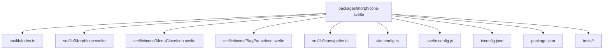
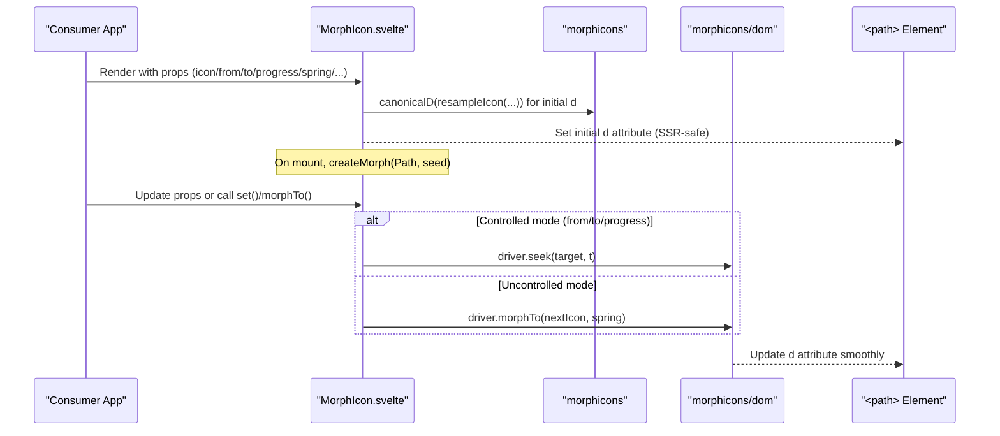
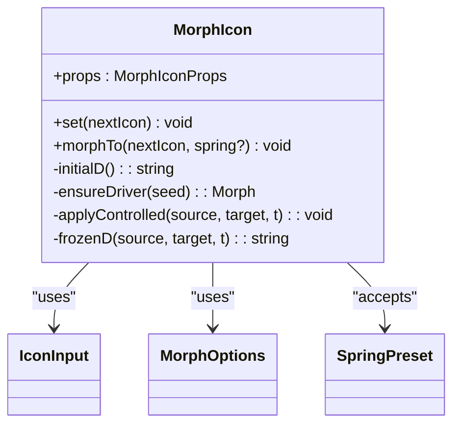
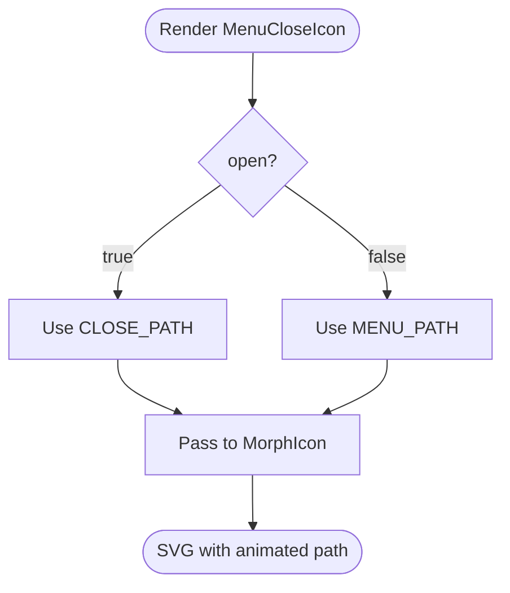
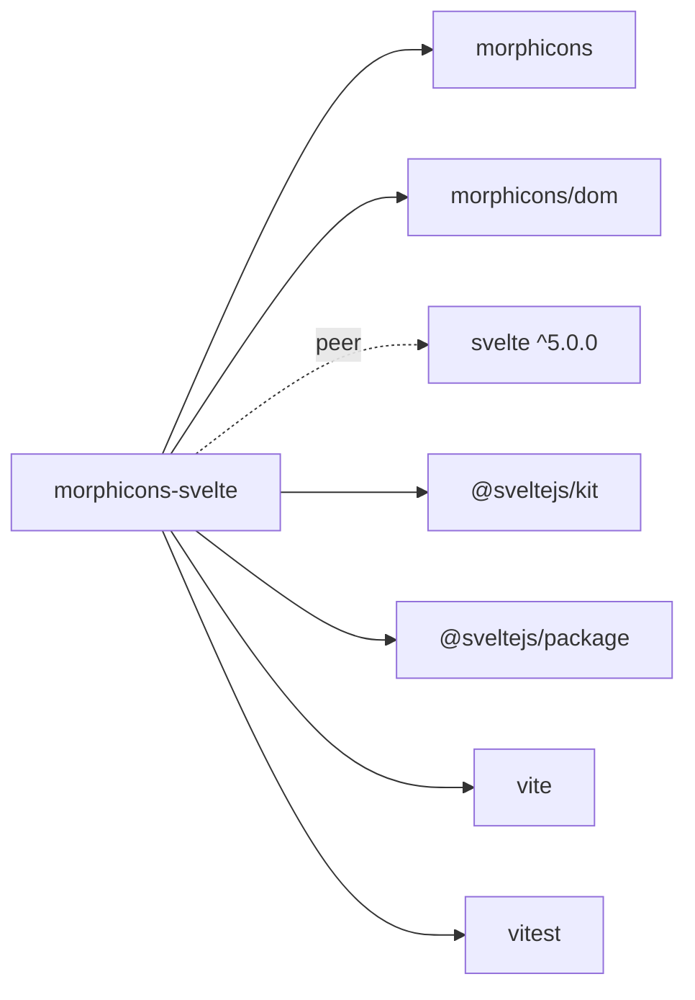

# Morphicons Svelte

<cite>
**Referenced Files in This Document**
- [package.json](file://packages/morphicons-svelte/package.json)
- [README.md](file://packages/morphicons-svelte/README.md)
- [index.ts](file://packages/morphicons-svelte/src/lib/index.ts)
- [MorphIcon.svelte](file://packages/morphicons-svelte/src/lib/MorphIcon.svelte)
- [MenuCloseIcon.svelte](file://packages/morphicons-svelte/src/lib/icons/MenuCloseIcon.svelte)
- [PlayPauseIcon.svelte](file://packages/morphicons-svelte/src/lib/icons/PlayPauseIcon.svelte)
- [paths.ts](file://packages/morphicons-svelte/src/lib/icons/paths.ts)
- [vite.config.ts](file://packages/morphicons-svelte/vite.config.ts)
- [svelte.config.js](file://packages/morphicons-svelte/svelte.config.js)
- [tsconfig.json](file://packages/morphicons-svelte/tsconfig.json)
- [MorphIcon.browser.test.ts](file://packages/morphicons-svelte/tests/MorphIcon.browser.test.ts)
- [MorphIcon.ssr.test.ts](file://packages/morphicons-svelte/tests/MorphIcon.ssr.test.ts)
</cite>

## Table of Contents
1. Introduction
2. Project Structure
3. Core Components
4. Architecture Overview
5. Detailed Component Analysis
6. Dependency Analysis
7. Performance Considerations
8. Troubleshooting Guide
9. Conclusion
10. Appendices

## Introduction
Morphicons Svelte provides Svelte 5 bindings for morphing SVG icons with SSR-safe initial paths and a browser-owned morph driver after mount. It exposes a single, flexible icon component that can render any compatible icon input (string path or structured node), supports controlled morphs via from/to/progress props, and includes two ready-to-use pair components: MenuCloseIcon and PlayPauseIcon. The package is designed to integrate seamlessly into SvelteKit applications and other Svelte projects, with strong TypeScript support and predictable accessibility behavior.

## Project Structure
The package follows a minimal, focused structure centered around the core MorphIcon component and a small set of prebuilt icon pairs. The build targets both development and distribution through Vite and Svelte Package.

**Diagram sources**
- [package.json:1-59](file://packages/morphicons-svelte/package.json#L1-L59)
- [index.ts:1-18](file://packages/morphicons-svelte/src/lib/index.ts#L1-L18)
- [MorphIcon.svelte:1-232](file://packages/morphicons-svelte/src/lib/MorphIcon.svelte#L1-L232)
- [MenuCloseIcon.svelte:1-22](file://packages/morphicons-svelte/src/lib/icons/MenuCloseIcon.svelte#L1-L22)
- [PlayPauseIcon.svelte:1-22](file://packages/morphicons-svelte/src/lib/icons/PlayPauseIcon.svelte#L1-L22)
- [paths.ts:1-5](file://packages/morphicons-svelte/src/lib/icons/paths.ts#L1-L5)
- [vite.config.ts:1-12](file://packages/morphicons-svelte/vite.config.ts#L1-L12)
- [svelte.config.js:1-13](file://packages/morphicons-svelte/svelte.config.js#L1-L13)
- [tsconfig.json:1-15](file://packages/morphicons-svelte/tsconfig.json#L1-L15)

**Section sources**
- [package.json:1-59](file://packages/morphicons-svelte/package.json#L1-L59)
- [index.ts:1-18](file://packages/morphicons-svelte/src/lib/index.ts#L1-L18)

## Core Components
- MorphIcon: The central component that renders an SVG icon and drives morph animations using morphicons and morphicons/dom. It supports uncontrolled mode (icon prop), controlled morphs (from, to, progress), and imperative APIs (set, morphTo).
- MenuCloseIcon: A convenience wrapper that toggles between menu and close paths based on an open boolean.
- PlayPauseIcon: A convenience wrapper that toggles between play and pause paths based on a playing boolean.
- Paths: Minimal path constants used by the built-in icon pairs.

Key behaviors:
- SSR-safe initial d attribute computed without DOM access.
- Browser-owned morph driver created after mount; transitions are interruptible and retargetable.
- Accessibility: role="img" and title when label is provided; otherwise aria-hidden="true".

**Section sources**
- [MorphIcon.svelte:1-232](file://packages/morphicons-svelte/src/lib/MorphIcon.svelte#L1-L232)
- [MenuCloseIcon.svelte:1-22](file://packages/morphicons-svelte/src/lib/icons/MenuCloseIcon.svelte#L1-L22)
- [PlayPauseIcon.svelte:1-22](file://packages/morphicons-svelte/src/lib/icons/PlayPauseIcon.svelte#L1-L22)
- [paths.ts:1-5](file://packages/morphicons-svelte/src/lib/icons/paths.ts#L1-L5)

## Architecture Overview
At runtime, MorphIcon computes an initial path string during SSR and then hands control over to a morph driver instance bound to the <path> element. Uncontrolled changes trigger smooth morphs; controlled mode uses seek-based interpolation for precise scrubbing.

**Diagram sources**
- [MorphIcon.svelte:40-205](file://packages/morphicons-svelte/src/lib/MorphIcon.svelte#L40-L205)

## Detailed Component Analysis

### MorphIcon Component
Responsibilities:
- Compute initial d attribute deterministically for SSR.
- Manage lifecycle of the morph driver instance.
- Support three modes: empty, uncontrolled, controlled.
- Expose imperative methods set and morphTo.
- Apply size, color, stroke-width, and absoluteStrokeWidth scaling.
- Provide accessible markup with optional title and role.

Props and types:
- icon, from, to, progress: define current or target icons and animation state.
- spring: accepts preset strings or MorphOptions for animation timing.
- size, color, strokeWidth, absoluteStrokeWidth: visual styling.
- label: accessibility label; when present, sets role="img" and title.
- class and additional SVG attributes forwarded to the root <svg>.

Implementation highlights:
- Uses morphicons functions for plan building, resampling, interpolation, and serialization.
- Uses morphicons/dom for creating and controlling the morph driver bound to the path element.
- Derives rendered stroke width when absoluteStrokeWidth is enabled.

Accessibility:
- When label is provided, the SVG receives role="img" and a <title> child.
- Without label, aria-hidden="true" keeps decorative icons out of the accessibility tree.

Imperative API:
- set(nextIcon): immediately sets the icon without declarative ownership until next prop change.
- morphTo(nextIcon, spring?): starts a morph animation; seeds immediately if no prior source exists.

**Diagram sources**
- [MorphIcon.svelte:1-232](file://packages/morphicons-svelte/src/lib/MorphIcon.svelte#L1-L232)

**Section sources**
- [MorphIcon.svelte:1-232](file://packages/morphicons-svelte/src/lib/MorphIcon.svelte#L1-L232)

### MenuCloseIcon and PlayPauseIcon
These are thin wrappers around MorphIcon that expose simple boolean props:
- MenuCloseIcon: open boolean selects between MENU_PATH and CLOSE_PATH.
- PlayPauseIcon: playing boolean selects between PLAY_PATH and PAUSE_PATH.

They re-export their underlying path constants for advanced usage.

**Diagram sources**
- [MenuCloseIcon.svelte:1-22](file://packages/morphicons-svelte/src/lib/icons/MenuCloseIcon.svelte#L1-L22)
- [PlayPauseIcon.svelte:1-22](file://packages/morphicons-svelte/src/lib/icons/PlayPauseIcon.svelte#L1-L22)
- [paths.ts:1-5](file://packages/morphicons-svelte/src/lib/icons/paths.ts#L1-L5)

**Section sources**
- [MenuCloseIcon.svelte:1-22](file://packages/morphicons-svelte/src/lib/icons/MenuCloseIcon.svelte#L1-L22)
- [PlayPauseIcon.svelte:1-22](file://packages/morphicons-svelte/src/lib/icons/PlayPauseIcon.svelte#L1-L22)
- [paths.ts:1-5](file://packages/morphicons-svelte/src/lib/icons/paths.ts#L1-L5)

### Export Surface and Types
The package’s public surface is defined in index.ts:
- Default export: MorphIcon component and its props type.
- Named exports: MenuCloseIcon and PlayPauseIcon with their props types.
- Path constants: CLOSE_PATH, MENU_PATH, PAUSE_PATH, PLAY_PATH.
- Re-exported types from morphicons and morphicons/dom for advanced consumers.

This enables importing either the generic MorphIcon or the convenience components, and composing them with any compatible icon data.

**Section sources**
- [index.ts:1-18](file://packages/morphicons-svelte/src/lib/index.ts#L1-L18)

## Dependency Analysis
External dependencies and peer requirements:
- Runtime dependency: morphicons (core logic for icon normalization, plan building, interpolation, serialization).
- DOM integration: morphicons/dom (creates and controls the morph driver bound to the <path>).
- Peer dependency: svelte ^5.0.0.
- Build tooling: @sveltejs/kit, @sveltejs/package, vite, vitest, jsdom.

Export configuration ensures consumers receive correct types and Svelte-aware entry points.

**Diagram sources**
- [package.json:1-59](file://packages/morphicons-svelte/package.json#L1-L59)

**Section sources**
- [package.json:1-59](file://packages/morphicons-svelte/package.json#L1-L59)

## Performance Considerations
- SSR-safe initial rendering: The component computes the initial d attribute using pure functions from morphicons, avoiding DOM access during server rendering.
- Driver ownership: After mount, morphicons/dom owns the path attribute, enabling interruption and retargeting without hydration-time DOM replacement.
- Controlled vs uncontrolled:
  - Controlled mode uses seek-based interpolation for precise scrubbing with from/to/progress.
  - Uncontrolled mode triggers morphTo for smooth transitions driven by spring presets or MorphOptions.
- Absolute stroke width: When enabled, stroke width scales proportionally with size to maintain visual consistency across sizes.
- Tree-shaking and side effects: The package declares sideEffects: false and uses modular exports to aid bundlers.

[No sources needed since this section provides general guidance]

## Troubleshooting Guide
Common issues and resolutions:
- Hydration mismatch: Ensure icon inputs are consistent between server and client. The component computes canonical d values deterministically; avoid non-deterministic path generation.
- Imperative vs declarative conflicts: If you call set or morphTo imperatively, subsequent changes to declarative props will take over. Tests demonstrate expected rebasing behavior.
- Missing accessibility label: Decorative icons should not be labeled; omit label to keep aria-hidden="true". For meaningful icons, provide label to enable role="img" and title.
- Animation not starting: In uncontrolled mode, ensure there is a prior source icon before calling morphTo; otherwise, the first call seeds immediately.
- Stroke width looks inconsistent: Use absoluteStrokeWidth to scale stroke width relative to size.

Relevant tests:
- Browser tests validate imperative APIs, controlled morphs, and prop precedence.
- SSR tests verify exact d output, accessibility attributes, and controlled rendering on the server.

**Section sources**
- [MorphIcon.browser.test.ts:1-114](file://packages/morphicons-svelte/tests/MorphIcon.browser.test.ts#L1-L114)
- [MorphIcon.ssr.test.ts:1-98](file://packages/morphicons-svelte/tests/MorphIcon.ssr.test.ts#L1-L98)

## Conclusion
Morphicons Svelte offers a robust, accessible, and performant way to render and animate SVG icons in Svelte applications. Its design separates SSR-safe rendering from browser-driven morphing, supports both declarative and imperative control patterns, and integrates cleanly with the broader ecosystem through shared icon formats. Consumers can use the generic MorphIcon for maximum flexibility or the convenience components for common toggle scenarios.

[No sources needed since this section summarizes without analyzing specific files]

## Appendices

### Build and Distribution
- Development:
  - Run dev server with Vite and SvelteKit.
  - Type checking via svelte-check.
  - Unit tests run with Vitest in jsdom environment.
- Packaging:
  - Build artifacts produced by vite build and svelte-package.
  - Exports configured for types, Svelte, and default module resolution.
  - Only src/lib is packaged for consumers.

Configuration references:
- Vite config sets SvelteKit plugin and test environment conditions.
- Svelte config enables preprocessing and adapter selection.
- TypeScript config extends generated SvelteKit tsconfig and enforces strict checks.

**Section sources**
- [package.json:27-33](file://packages/morphicons-svelte/package.json#L27-L33)
- [vite.config.ts:1-12](file://packages/morphicons-svelte/vite.config.ts#L1-L12)
- [svelte.config.js:1-13](file://packages/morphicons-svelte/svelte.config.js#L1-L13)
- [tsconfig.json:1-15](file://packages/morphicons-svelte/tsconfig.json#L1-L15)

### Usage Examples
- Basic usage with dynamic icon switching:
  - Import MorphIcon and any compatible icon input (e.g., from lucide).
  - Toggle icon based on application state; pass label for accessibility.
- Controlled morph:
  - Provide from, to, and progress props to scrub between two icons.
  - Optionally configure spring presets or MorphOptions for animation behavior.
- Convenience components:
  - Use MenuCloseIcon with open boolean.
  - Use PlayPauseIcon with playing boolean.

For concrete examples, see the package README and demo registry which showcase cross-library compatibility and interactive controls.

**Section sources**
- [README.md:15-55](file://packages/morphicons-svelte/README.md#L15-L55)