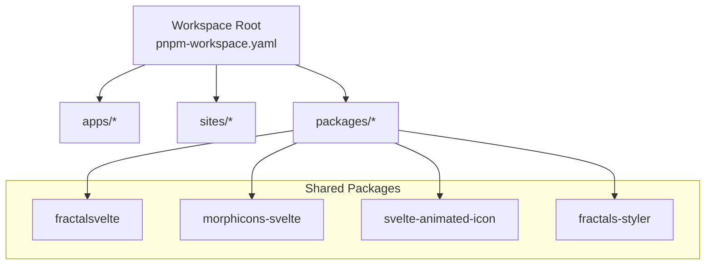
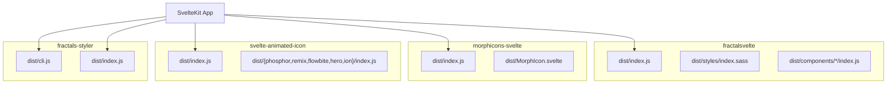
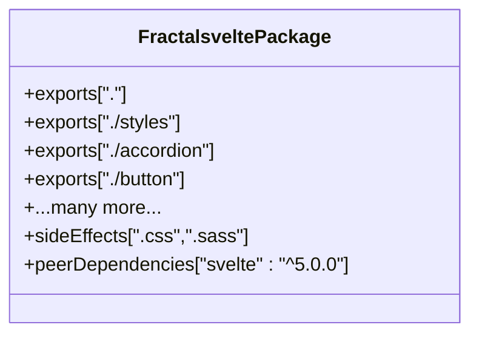
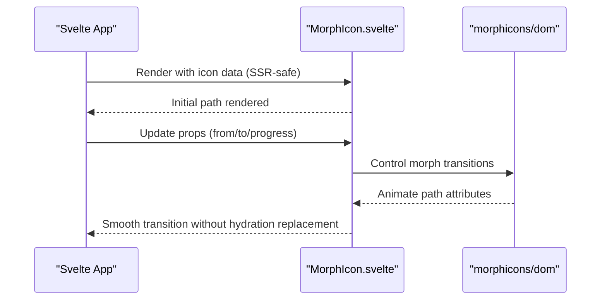
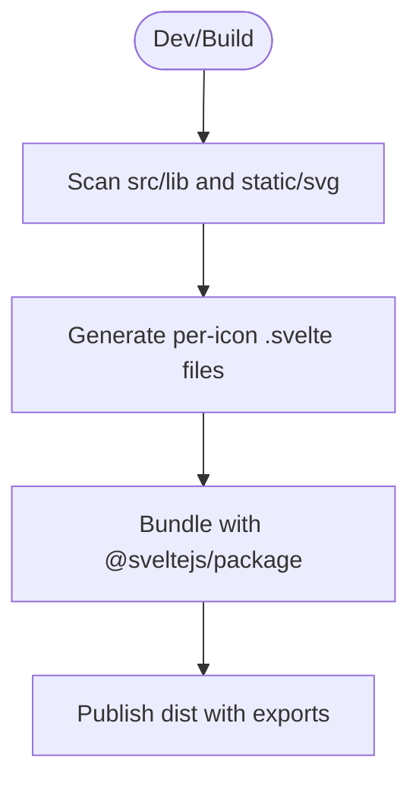
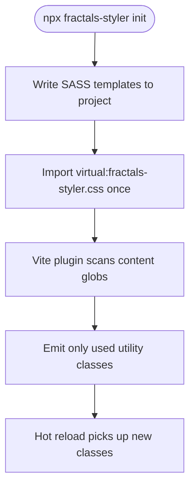
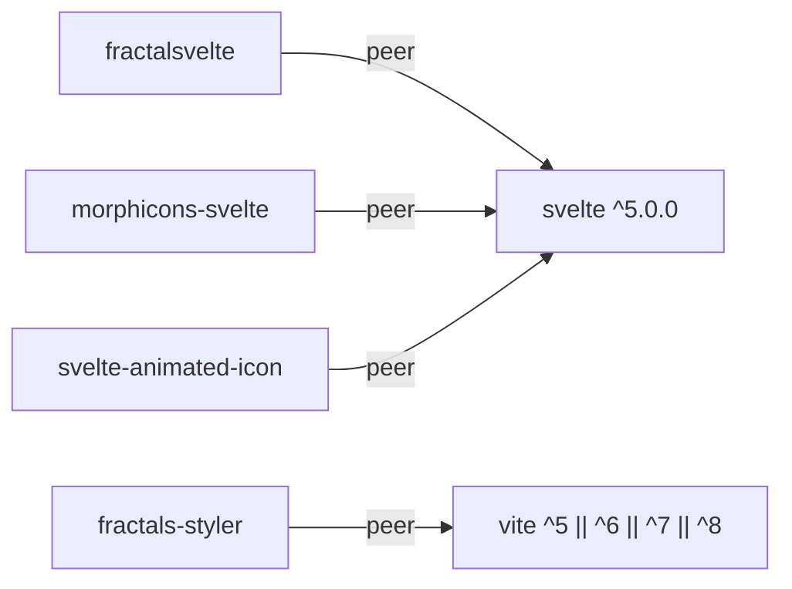

# Shared Packages

<cite>
**Referenced Files in This Document**
- [package.json](file://package.json)
- [pnpm-workspace.yaml](file://pnpm-workspace.yaml)
- [packages/fractalsvelte/package.json](file://packages/fractalsvelte/package.json)
- [packages/fractalsvelte/README.md](file://packages/fractalsvelte/README.md)
- [packages/morphicons-svelte/package.json](file://packages/morphicons-svelte/package.json)
- [packages/morphicons-svelte/README.md](file://packages/morphicons-svelte/README.md)
- [packages/svelte-animated-icon/package.json](file://packages/svelte-animated-icon/package.json)
- [packages/svelte-animated-icon/README.md](file://packages/svelte-animated-icon/README.md)
- [packages/fractals-styler/package.json](file://packages/fractals-styler/package.json)
- [packages/fractals-styler/README.md](file://packages/fractals-styler/README.md)
</cite>

## Table of Contents
1. [Introduction](#introduction)
2. [Project Structure](#project-structure)
3. [Core Components](#core-components)
4. [Architecture Overview](#architecture-overview)
5. [Detailed Component Analysis](#detailed-component-analysis)
6. [Dependency Analysis](#dependency-analysis)
7. [Performance Considerations](#performance-considerations)
8. [Troubleshooting Guide](#troubleshooting-guide)
9. [Conclusion](#conclusion)

## Introduction
This document explains the shared packages that power the monorepo’s UI layer and styling system. It covers:
- fractalsvelte: a Svelte component library with explicit exports and dual distribution (npm + copy-paste).
- morphicons-svelte: Svelte 5 bindings for morphing icons with SSR-safe initial rendering and browser-owned animation after mount.
- svelte-animated-icon: a tree-shakeable, multi-library animated icon set powered by the Web Animations API.
- fractals-styler: a JIT numeric utility class generator and themeable SASS token system for SvelteKit/Vite projects.

The goal is to help beginners adopt these packages quickly while giving experienced developers the technical details needed to extend or contribute.

## Project Structure
At the workspace root, pnpm manages apps, sites, and packages. The shared packages live under packages/. Each package is independently buildable and publishable, with clear entry points and exports defined in their package.json files.

**Diagram sources**
- [pnpm-workspace.yaml:1-30](file://pnpm-workspace.yaml#L1-L30)

**Section sources**
- [pnpm-workspace.yaml:1-30](file://pnpm-workspace.yaml#L1-L30)
- [package.json:1-36](file://package.json#L1-L36)

## Core Components
- fractalsvelte: A comprehensive Svelte component library exposing many components via named exports. It supports both npm installation and copy-paste usage, with sideEffects declared for styles and a robust export map for each component.
- morphicons-svelte: Provides MorphIcon and prebuilt pairs, designed for Svelte 5 with SSR-safe initial paths and smooth transitions controlled by morphicons/dom.
- svelte-animated-icon: Offers AnimatedIcon and per-library presets (phosphor, remix, flowbite, hero, ion), built with mdsvex docs and a codegen pipeline from SVG sources.
- fractals-styler: Generates JIT CSS utilities based on source scanning, exposes a CLI to scaffold SASS tokens, and integrates via a Vite plugin.

**Section sources**
- [packages/fractalsvelte/package.json:1-486](file://packages/fractalsvelte/package.json#L1-L486)
- [packages/fractalsvelte/README.md:1-36](file://packages/fractalsvelte/README.md#L1-L36)
- [packages/morphicons-svelte/package.json:1-59](file://packages/morphicons-svelte/package.json#L1-L59)
- [packages/morphicons-svelte/README.md:1-69](file://packages/morphicons-svelte/README.md#L1-L69)
- [packages/svelte-animated-icon/package.json:1-90](file://packages/svelte-animated-icon/package.json#L1-L90)
- [packages/svelte-animated-icon/README.md:1-26](file://packages/svelte-animated-icon/README.md#L1-L26)
- [packages/fractals-styler/package.json:1-45](file://packages/fractals-styler/package.json#L1-L45)
- [packages/fractals-styler/README.md:1-124](file://packages/fractals-styler/README.md#L1-L124)

## Architecture Overview
Each package follows a consistent pattern:
- Entry point via package.json “exports” mapping types, svelte, and default modules.
- Peer dependency on Svelte ^5.x for runtime compatibility.
- Build tooling using Vite/SvelteKit and @sveltejs/package for bundling and publishing.
- Optional CLI or Vite plugin integration (fractals-styler).

**Diagram sources**
- [packages/fractalsvelte/package.json:26-429](file://packages/fractalsvelte/package.json#L26-L429)
- [packages/morphicons-svelte/package.json:6-26](file://packages/morphicons-svelte/package.json#L6-L26)
- [packages/svelte-animated-icon/package.json:31-59](file://packages/svelte-animated-icon/package.json#L31-L59)
- [packages/fractals-styler/package.json:6-16](file://packages/fractals-styler/package.json#L6-L16)

## Detailed Component Analysis

### fractalsvelte: UI Component Library
- Purpose: Provide a rich set of Svelte components with props-driven customization and no Tailwind/class-string merging.
- Distribution: Dual strategy—publish to npm and generate a flattened copy-paste variant; sideEffects include .css and .sass.
- Exports: Explicit per-component entries with types, svelte, and default mappings.
- Dependencies: Uses bits-ui, formsnap, embla-carousel-svelte, svelte-sonner, and others as listed.

**Diagram sources**
- [packages/fractalsvelte/package.json:26-429](file://packages/fractalsvelte/package.json#L26-L429)

Usage notes:
- Install via npm/pnpm/yarn or copy-paste into your project.
- Import components from their named paths (e.g., ./button).
- Styles are included via sideEffects; ensure your bundler respects them.

**Section sources**
- [packages/fractalsvelte/package.json:1-486](file://packages/fractalsvelte/package.json#L1-L486)
- [packages/fractalsvelte/README.md:1-36](file://packages/fractalsvelte/README.md#L1-L36)

### morphicons-svelte: Icon Library
- Purpose: Svelte 5 bindings for morphicons with SSR-safe initial paths and browser-owned morph driver post-mount.
- Exports: Main index and direct access to MorphIcon.svelte.
- Usage: Accepts icon data (Lucide-compatible), supports controlled morph via from/to/progress, and spring presets.

**Diagram sources**
- [packages/morphicons-svelte/package.json:6-26](file://packages/morphicons-svelte/package.json#L6-L26)
- [packages/morphicons-svelte/README.md:16-43](file://packages/morphicons-svelte/README.md#L16-L43)

Best practices:
- Use Lucide icon nodes directly.
- Prefer controlled progress for precise animations.
- Keep sideEffects false for optimal tree-shaking.

**Section sources**
- [packages/morphicons-svelte/package.json:1-59](file://packages/morphicons-svelte/package.json#L1-L59)
- [packages/morphicons-svelte/README.md:1-69](file://packages/morphicons-svelte/README.md#L1-L69)

### svelte-animated-icon: Animation Utilities
- Purpose: Tree-shakeable animated icons across multiple libraries (phosphor, remix, flowbite, hero, ion) using Web Animations API.
- Structure: Single SvelteKit project hosting both package source (src/lib) and docs site (src/routes). Codegen pipeline generates per-icon components from SVG sources.
- Exports: Main index plus per-library entry points.

**Diagram sources**
- [packages/svelte-animated-icon/README.md:15-22](file://packages/svelte-animated-icon/README.md#L15-L22)
- [packages/svelte-animated-icon/package.json:31-59](file://packages/svelte-animated-icon/package.json#L31-L59)

Integration tips:
- Import AnimatedIcon and library-specific sets via the provided exports.
- Leverage mdsvex docs for examples and guides.

**Section sources**
- [packages/svelte-animated-icon/package.json:1-90](file://packages/svelte-animated-icon/package.json#L1-L90)
- [packages/svelte-animated-icon/README.md:1-26](file://packages/svelte-animated-icon/README.md#L1-L26)

### fractals-styler: Styling System
- Purpose: JIT numeric utility classes and breakpoint-suffixed variants, plus a themeable SASS token system for SvelteKit/Vite projects.
- CLI: Scaffold _tokens.sass, _typography.sass, _globals.sass, _primitives.sass, _mixins.sass, and index.sass.
- Vite Plugin: Scans source files for used utility classes and emits only those as CSS; also detects dynamic --pxN variables.

**Diagram sources**
- [packages/fractals-styler/README.md:11-52](file://packages/fractals-styler/README.md#L11-L52)
- [packages/fractals-styler/package.json:6-16](file://packages/fractals-styler/package.json#L6-L16)

Theming guidance:
- Override CSS custom properties under :root or scoped classes.
- Use breakpoint suffixes (-xs/-sm/-bs/-lg/-xl) for responsive utilities.

**Section sources**
- [packages/fractals-styler/package.json:1-45](file://packages/fractals-styler/package.json#L1-L45)
- [packages/fractals-styler/README.md:1-124](file://packages/fractals-styler/README.md#L1-L124)

## Dependency Analysis
All packages declare Svelte ^5.x as a peer dependency, ensuring runtime compatibility across the monorepo. The workspace configuration centralizes dependency resolution and allows selective overrides for security and stability.

**Diagram sources**
- [packages/fractalsvelte/package.json:430-432](file://packages/fractalsvelte/package.json#L430-L432)
- [packages/morphicons-svelte/package.json:41-43](file://packages/morphicons-svelte/package.json#L41-L43)
- [packages/svelte-animated-icon/package.json:60-62](file://packages/svelte-animated-icon/package.json#L60-L62)
- [packages/fractals-styler/package.json:26-28](file://packages/fractals-styler/package.json#L26-L28)

Workspace-level policies:
- Canonical lockfile at root ensures consistent installs.
- Overrides pin vulnerable transitive dependencies (e.g., dompurify, esbuild).
- StrictDepBuilds policy blocks untrusted scripts by default.

**Section sources**
- [pnpm-workspace.yaml:1-30](file://pnpm-workspace.yaml#L1-L30)
- [package.json:1-36](file://package.json#L1-L36)

## Performance Considerations
- Tree-shaking: All packages minimize side effects where possible (morphicons-svelte explicitly sets sideEffects: false).
- JIT generation: fractals-styler emits only used utilities, reducing CSS payload.
- Animation engine: svelte-animated-icon uses native Web Animations API, avoiding heavy animation libraries.
- SSR safety: morphicons-svelte renders initial paths during SSR to avoid hydration mismatches.

[No sources needed since this section provides general guidance]

## Troubleshooting Guide
Common issues and resolutions:
- Style not applied in copy-paste mode: Ensure sideEffects are respected by your bundler or inline required mixins/classes when copying components manually.
- Missing utility classes: Verify the Vite plugin is configured and import virtual:fractals-styler.css once globally.
- Hydration warnings with icons: Use controlled progress or ensure the morph driver owns the DOM after mount.
- Version conflicts: Align Svelte versions across packages to ^5.x as declared in peerDependencies.

**Section sources**
- [packages/fractalsvelte/README.md:31-36](file://packages/fractalsvelte/README.md#L31-L36)
- [packages/morphicons-svelte/README.md:39-43](file://packages/morphicons-svelte/README.md#L39-L43)
- [packages/fractals-styler/README.md:33-52](file://packages/fractals-styler/README.md#L33-L52)

## Conclusion
These shared packages form a cohesive, extensible foundation for building modern Svelte applications:
- fractalsvelte offers a broad, customizable component set with flexible distribution.
- morphicons-svelte delivers efficient, SSR-friendly icon morphing.
- svelte-animated-icon provides lightweight, native-powered animations across popular icon sets.
- fractals-styler enables a scalable, JIT-driven styling workflow with strong theming support.

Adopting these packages consistently across the monorepo improves developer experience, reduces duplication, and maintains high performance.