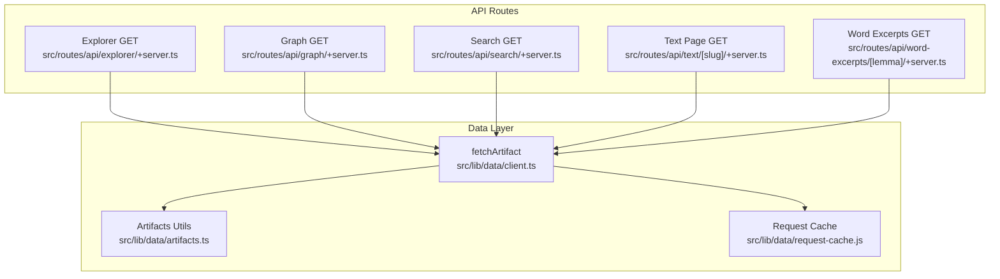
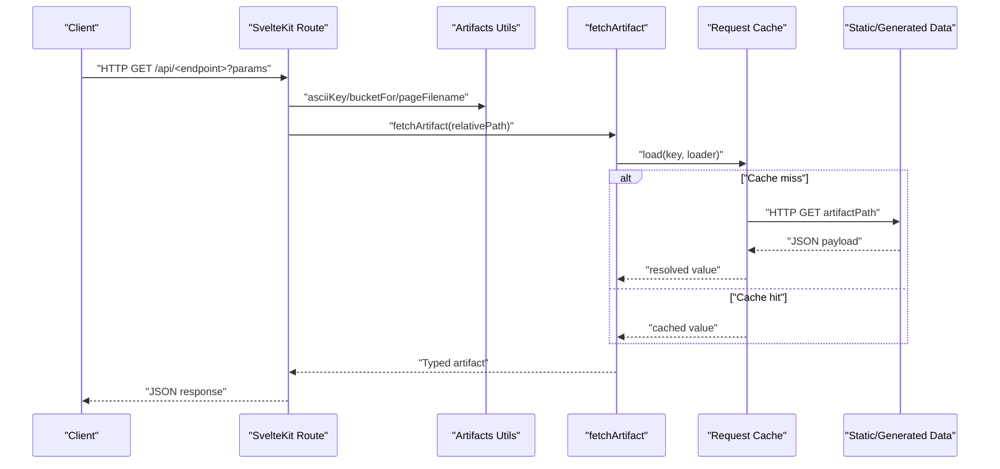
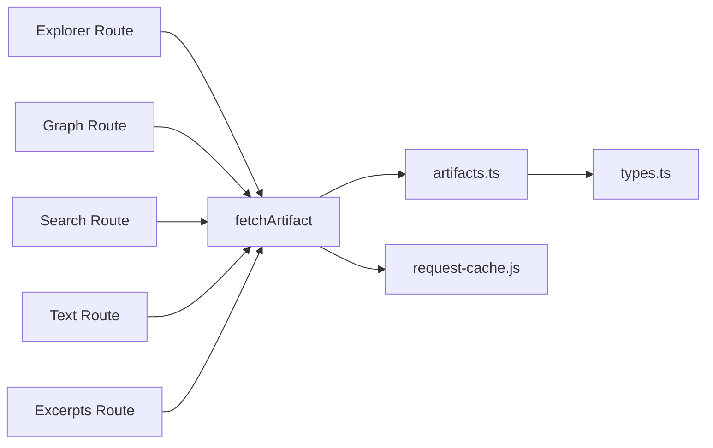

# API Reference

<cite>
**Referenced Files in This Document**
- [src/routes/api/explorer/+server.ts](file://src/routes/api/explorer/+server.ts)
- [src/routes/api/graph/+server.ts](file://src/routes/api/graph/+server.ts)
- [src/routes/api/search/+server.ts](file://src/routes/api/search/+server.ts)
- [src/routes/api/text/[slug]/+server.ts](file://src/routes/api/text/[slug]/+server.ts)
- [src/routes/api/word-excerpts/[lemma]/+server.ts](file://src/routes/api/word-excerpts/[lemma]/+server.ts)
- [src/lib/data/types.ts](file://src/lib/data/types.ts)
- [src/lib/data/artifacts.ts](file://src/lib/data/artifacts.ts)
- [src/lib/data/client.ts](file://src/lib/data/client.ts)
- [src/lib/data/request-cache.js](file://src/lib/data/request-cache.js)
- [src/hooks.server.ts](file://src/hooks.server.ts)
- [package.json](file://package.json)
</cite>

## Table of Contents
1. Introduction
2. Project Structure
3. Core Components
4. Architecture Overview
5. Detailed Component Analysis
6. Dependency Analysis
7. Performance Considerations
8. Troubleshooting Guide
9. Conclusion
10. Appendices

## Introduction
This document provides comprehensive API documentation for FractalDharma’s REST endpoints exposed via SvelteKit server routes. It covers:
- Explorer API for querying concept and dhātu (root) data
- Graph API for network visualization data including nodes and edges
- Search API with fuzzy matching across texts, roots, and concepts
- Text-specific endpoints for retrieving structured text pages
- Word excerpt endpoints for concordance information

It also includes authentication methods, rate limiting, error handling, response formats, concrete examples, client implementation guidelines, versioning strategies, migration paths, debugging tips, and monitoring approaches.

## Project Structure
The API is implemented as SvelteKit server routes under src/routes/api. Each endpoint is a GET handler that reads prebuilt artifacts from static or generated data directories using a shared artifact fetcher and utility functions.

**Diagram sources**
- [src/routes/api/explorer/+server.ts](file://src/routes/api/explorer/+server.ts)
- [src/routes/api/graph/+server.ts](file://src/routes/api/graph/+server.ts)
- [src/routes/api/search/+server.ts](file://src/routes/api/search/+server.ts)
- [src/routes/api/text/[slug]/+server.ts](file://src/routes/api/text/[slug]/+server.ts)
- [src/routes/api/word-excerpts/[lemma]/+server.ts](file://src/routes/api/word-excerpts/[lemma]/+server.ts)
- [src/lib/data/client.ts](file://src/lib/data/client.ts)
- [src/lib/data/artifacts.ts](file://src/lib/data/artifacts.ts)
- [src/lib/data/request-cache.js](file://src/lib/data/request-cache.js)

**Section sources**
- [src/routes/api/explorer/+server.ts](file://src/routes/api/explorer/+server.ts)
- [src/routes/api/graph/+server.ts](file://src/routes/api/graph/+server.ts)
- [src/routes/api/search/+server.ts](file://src/routes/api/search/+server.ts)
- [src/routes/api/text/[slug]/+server.ts](file://src/routes/api/text/[slug]/+server.ts)
- [src/routes/api/word-excerpts/[lemma]/+server.ts](file://src/routes/api/word-excerpts/[lemma]/+server.ts)
- [src/lib/data/client.ts](file://src/lib/data/client.ts)
- [src/lib/data/artifacts.ts](file://src/lib/data/artifacts.ts)
- [src/lib/data/request-cache.js](file://src/lib/data/request-cache.js)

## Core Components
- Explorer API: Returns nodes for a root or word, including related concepts and sibling words.
- Graph API: Returns graph data (nodes and edges) for lemmas, roots, or texts; supports expansion and popular queries.
- Search API: Fuzzy search across headwords, slugs, normalized forms, and plain text with ranking.
- Text API: Paginated retrieval of text pages by slug and page number.
- Word Excerpts API: Concordance excerpts for a lemma with snippet and reference metadata.

Key utilities:
- asciiKey and bucketFor normalize keys and partition artifacts into buckets for efficient lookup.
- artifactPath constructs the base path for artifacts with versioning.
- fetchArtifact wraps HTTP requests with an in-process request cache to deduplicate concurrent calls.

**Section sources**
- [src/lib/data/artifacts.ts](file://src/lib/data/artifacts.ts)
- [src/lib/data/client.ts](file://src/lib/data/client.ts)
- [src/lib/data/request-cache.js](file://src/lib/data/request-cache.js)

## Architecture Overview
All endpoints follow a consistent pattern: parse query parameters, compute normalized keys, load artifacts via fetchArtifact, transform into typed responses, and return JSON. Errors are caught and converted to safe JSON payloads.

**Diagram sources**
- [src/lib/data/client.ts](file://src/lib/data/client.ts)
- [src/lib/data/artifacts.ts](file://src/lib/data/artifacts.ts)
- [src/lib/data/request-cache.js](file://src/lib/data/request-cache.js)

## Detailed Component Analysis

### Explorer API
Purpose:
- Query concept and dhātu data for exploration UIs.
- Return nodes representing words or texts, plus concepts and sibling words.

Endpoints:
- GET /api/explorer?root=<rootSlug>
  - Response fields:
    - root: string
    - nodes: array of { id, label, type: 'word', weight, count }
- GET /api/explorer?word=<wordSlug>
  - Response fields:
    - word: string
    - label: string
    - preview: string
    - definitions: array of strings
    - root: object | null with slug, label, meaning, dev, ganaName, pada
    - concepts: array of { id, label }
    - siblings: array of { id, label, definition?, count, group }
    - nodes: array of { id, label, type: 'text', weight, count }

Filtering and behavior:
- If root is provided, aggregates words per textCount and returns top entries.
- If word is provided, loads lemma detail, extracts text distribution or occurrences, maps concepts, and computes sibling words from the same root.

Error handling:
- Missing artifacts or invalid slugs result in empty arrays or minimal payloads.

Example call:
- GET /api/explorer?word=ācāra
- Expected response shape:
  - { word: "ācāra", label: "...", preview: "...", definitions: ["..."], root: {...}, concepts: [{id:"...",label:"..."}], siblings: [...], nodes: [...] }

**Section sources**
- [src/routes/api/explorer/+server.ts](file://src/routes/api/explorer/+server.ts)
- [src/lib/data/types.ts](file://src/lib/data/types.ts)

### Graph API
Purpose:
- Provide network visualization data for lemmas, roots, and texts.

Endpoints:
- GET /api/graph?q=<query>
  - Resolves query against a query index to determine type (root, lemma, text).
  - Returns { nodes, edges }.
- GET /api/graph?expand=<slug>&type=<root|lemma|text>
  - Returns a subset of nodes and edges starting after a given offset.
- GET /api/graph (no params)
  - Returns popular roots’ first nodes.

Response schema:
- nodes: array of { id, label, type: 'word'|'root'|'text'|'sutra', size, count?, verseCount? }
- edges: array of { source, target, label? }

Behavior:
- Uses asciiKey normalization and a query index mapping.
- For expand, slices nodes and edges based on type-specific offsets.

Example call:
- GET /api/graph?q=√kṛ
- Expected response shape:
  - { nodes: [...], edges: [...] }

**Section sources**
- [src/routes/api/graph/+server.ts](file://src/routes/api/graph/+server.ts)

### Search API
Purpose:
- Fuzzy search across headwords, slugs, normalized forms, and plain text.

Endpoint:
- GET /api/search?q=<query>

Behavior:
- Normalizes input to lowercase and ASCII key variants.
- Converts between Devanagari and IAST when applicable.
- Loads search buckets and matches substrings across multiple fields.
- Ranks results by exact match, prefix, and ASCII equivalence.

Response schema:
- results: array of { slug, headword, preview }

Example call:
- GET /api/search?q=ācāra
- Expected response shape:
  - { results: [{ slug: "acaara", headword: "ācāra", preview: "..." }] }

**Section sources**
- [src/routes/api/search/+server.ts](file://src/routes/api/search/+server.ts)

### Text API
Purpose:
- Retrieve paginated text pages by slug.

Endpoint:
- GET /api/text/[slug]?page=<number>

Parameters:
- slug: text identifier
- page: integer >= 1 (default 1)

Response schema:
- title: string
- slug: string
- page: number
- limit: number
- total: number
- totalPages: number
- hasMore: boolean
- verses: array of Verse objects

Error handling:
- Returns 404 JSON with message if text or page not found.

Example call:
- GET /api/text/mahabharata?page=1
- Expected response shape:
  - { title: "...", slug: "...", page: 1, limit: ..., total: ..., totalPages: ..., hasMore: false, verses: [...] }

**Section sources**
- [src/routes/api/text/[slug]/+server.ts](file://src/routes/api/text/[slug]/+server.ts)
- [src/lib/data/types.ts](file://src/lib/data/types.ts)

### Word Excerpts API
Purpose:
- Retrieve concordance excerpts for a lemma.

Endpoint:
- GET /api/word-excerpts/[lemma]

Parameters:
- lemma: root or word identifier (prefix √ is optional)

Response schema:
- lemma: string
- excerpts: array of { textSlug, title, reference, snippet, verseIndex, surface }
- totalTexts: number

Behavior:
- Normalizes lemma to ASCII key and looks up in bucketed excerpts.
- Limits excerpts to 30 items.

Example call:
- GET /api/word-excerpts/√kṛ
- Expected response shape:
  - { lemma: "kṛ", excerpts: [...], totalTexts: ... }

**Section sources**
- [src/routes/api/word-excerpts/[lemma]/+server.ts](file://src/routes/api/word-excerpts/[lemma]/+server.ts)

## Dependency Analysis
The APIs depend on shared utilities for artifact resolution and caching. The following diagram shows dependency relationships among modules.

**Diagram sources**
- [src/routes/api/explorer/+server.ts](file://src/routes/api/explorer/+server.ts)
- [src/routes/api/graph/+server.ts](file://src/routes/api/graph/+server.ts)
- [src/routes/api/search/+server.ts](file://src/routes/api/search/+server.ts)
- [src/routes/api/text/[slug]/+server.ts](file://src/routes/api/text/[slug]/+server.ts)
- [src/routes/api/word-excerpts/[lemma]/+server.ts](file://src/routes/api/word-excerpts/[lemma]/+server.ts)
- [src/lib/data/client.ts](file://src/lib/data/client.ts)
- [src/lib/data/artifacts.ts](file://src/lib/data/artifacts.ts)
- [src/lib/data/request-cache.js](file://src/lib/data/request-cache.js)
- [src/lib/data/types.ts](file://src/lib/data/types.ts)

**Section sources**
- [src/lib/data/client.ts](file://src/lib/data/client.ts)
- [src/lib/data/artifacts.ts](file://src/lib/data/artifacts.ts)
- [src/lib/data/request-cache.js](file://src/lib/data/request-cache.js)

## Performance Considerations
- In-process request caching: Concurrent identical artifact requests are deduplicated and cached until completion.
- Bucketing: asciiKey and bucketFor reduce lookup overhead by partitioning artifacts into small files.
- Pagination: Text API uses pageFilename to split large datasets into manageable chunks.
- Minimal payloads: Endpoints return only necessary fields and slice results where appropriate.

[No sources needed since this section provides general guidance]

## Troubleshooting Guide
Common issues and resolutions:
- Empty results:
  - Ensure query parameters are correctly normalized (ASCII key, lowercase).
  - Verify artifact availability at the expected paths.
- 404 errors for text pages:
  - Confirm slug and page exist; default page is 1.
- Internal server errors:
  - Global error handler logs pathname and error details; check server logs.

Authentication and authorization:
- No built-in authentication middleware; endpoints are public by default.
- To secure endpoints, implement a handle middleware in hooks.server.ts to validate tokens or cookies before resolving requests.

Rate limiting:
- Not implemented in code; consider adding middleware or deploying behind a reverse proxy (e.g., Nginx, Vercel edge) to enforce limits.

Monitoring and debugging:
- Use browser developer tools to inspect network requests and responses.
- Log request URLs and parameters in server-side hooks for diagnostics.
- Validate artifact integrity during build steps; ensure generated data matches expected schemas.

**Section sources**
- [src/hooks.server.ts](file://src/hooks.server.ts)
- [src/routes/api/text/[slug]/+server.ts](file://src/routes/api/text/[slug]/+server.ts)

## Conclusion
FractalDharma’s API provides a cohesive set of endpoints for exploring dhātu and concept data, visualizing networks, searching texts, and retrieving structured content. The design emphasizes performance through caching and bucketing, while maintaining simplicity and clarity in response schemas. Future enhancements can include authentication, rate limiting, and expanded filtering options.

[No sources needed since this section summarizes without analyzing specific files]

## Appendices

### Authentication Methods
- Current state: Public endpoints without authentication.
- Recommended approach: Add a handle middleware in hooks.server.ts to validate JWT or session cookies and attach user context to event.locals.

**Section sources**
- [src/hooks.server.ts](file://src/hooks.server.ts)

### Rate Limiting
- Current state: Not implemented.
- Recommended approach: Implement middleware or use platform-level rate limiting (e.g., adapter-specific features or CDN/proxy settings).

[No sources needed since this section provides general guidance]

### Error Handling
- Global error handler returns a generic message; route handlers catch errors and return safe JSON payloads.
- Text API returns explicit 404 JSON for missing resources.

**Section sources**
- [src/hooks.server.ts](file://src/hooks.server.ts)
- [src/routes/api/text/[slug]/+server.ts](file://src/routes/api/text/[slug]/+server.ts)

### Response Formats
- All endpoints return JSON.
- Standard fields include identifiers, labels, counts, and optional metadata.
- Arrays are limited or sliced to prevent oversized responses.

**Section sources**
- [src/routes/api/explorer/+server.ts](file://src/routes/api/explorer/+server.ts)
- [src/routes/api/graph/+server.ts](file://src/routes/api/graph/+server.ts)
- [src/routes/api/search/+server.ts](file://src/routes/api/search/+server.ts)
- [src/routes/api/text/[slug]/+server.ts](file://src/routes/api/text/[slug]/+server.ts)
- [src/routes/api/word-excerpts/[lemma]/+server.ts](file://src/routes/api/word-excerpts/[lemma]/+server.ts)

### Versioning Strategies
- Artifact versioning: ARTIFACT_VERSION and ARTIFACT_BASE define the base path for generated data.
- Migration path: Update ARTIFACT_VERSION when changing artifact schemas; maintain backward compatibility by supporting old versions during transition.

**Section sources**
- [src/lib/data/artifacts.ts](file://src/lib/data/artifacts.ts)

### Backward Compatibility and Migration
- Keep query parameter names stable.
- Introduce new fields without removing existing ones.
- Deprecate endpoints gradually with headers or versioned routes if needed.

[No sources needed since this section provides general guidance]

### Client Implementation Guidelines
- Normalize inputs using asciiKey and bucketFor patterns when constructing artifact paths.
- Handle empty arrays gracefully; treat missing fields as optional.
- Implement retries for transient network failures; respect pagination for text endpoints.
- Cache responses client-side for frequently accessed artifacts.

[No sources needed since this section provides general guidance]

### Monitoring Approaches
- Log all incoming requests with method, URL, and parameters.
- Track response times and error rates per endpoint.
- Monitor artifact fetch success/failure rates and cache hit ratios.

[No sources needed since this section provides general guidance]

### Concrete Examples and Integration Patterns
- Explorer:
  - GET /api/explorer?word=ācāra
  - Use returned nodes to populate concept graphs and sibling lists.
- Graph:
  - GET /api/graph?q=√kṛ
  - Render nodes and edges using D3 or X/Y Flow libraries.
- Search:
  - GET /api/search?q=ācāra
  - Display ranked results with previews and navigate to detail pages.
- Text:
  - GET /api/text/mahabharata?page=1
  - Paginate through pages and render verses sequentially.
- Excerpts:
  - GET /api/word-excerpts/√kṛ
  - Show snippets with references and navigation to source texts.

[No sources needed since this section provides general guidance]