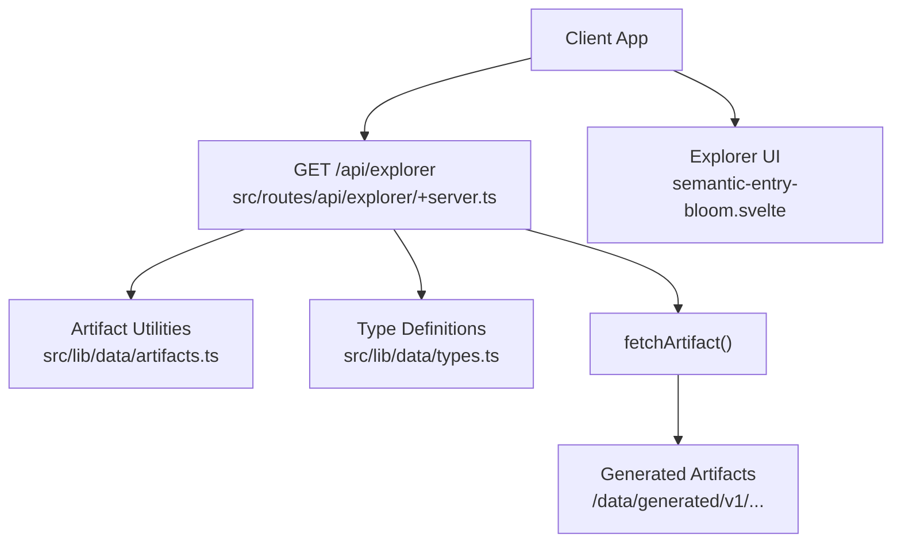
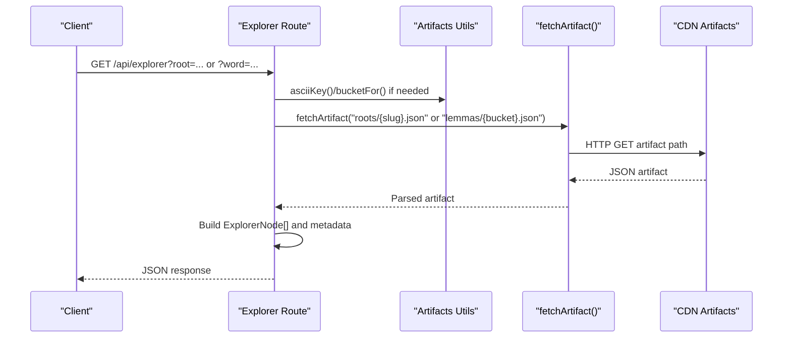
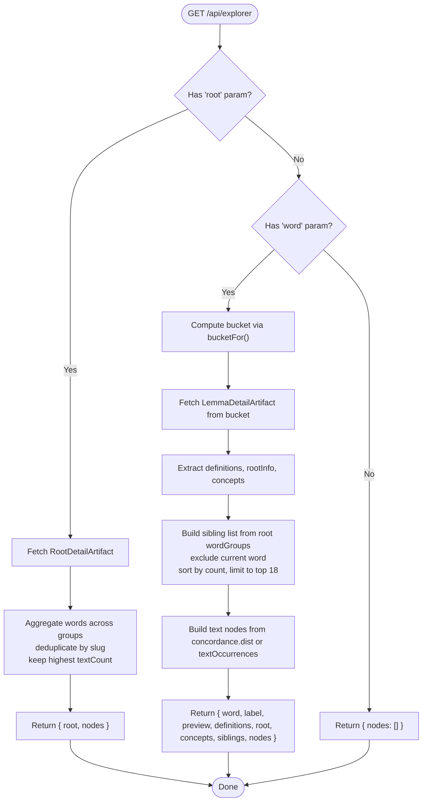
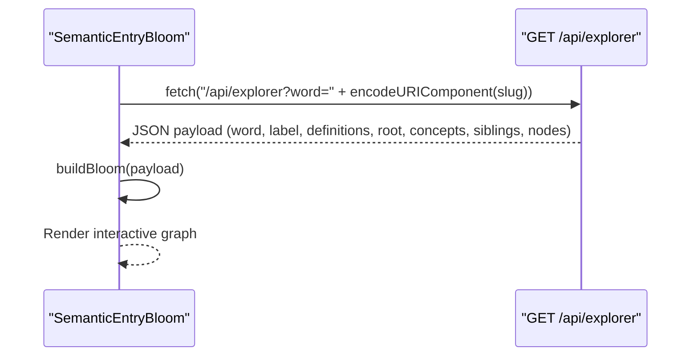
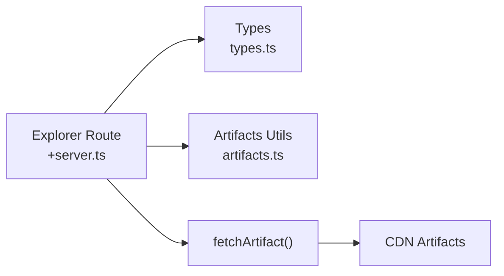

# Explorer API

<cite>
**Referenced Files in This Document**
- [src/routes/api/explorer/+server.ts](file://src/routes/api/explorer/+server.ts)
- [src/lib/data/types.ts](file://src/lib/data/types.ts)
- [src/lib/data/artifacts.ts](file://src/lib/data/artifacts.ts)
- [src/lib/components/semantic-entry-bloom.svelte](file://src/lib/components/semantic-entry-bloom.svelte)
</cite>

## Table of Contents
1. [Introduction](#introduction)
2. [Project Structure](#project-structure)
3. [Core Components](#core-components)
4. [Architecture Overview](#architecture-overview)
5. [Detailed Component Analysis](#detailed-component-analysis)
6. [Dependency Analysis](#dependency-analysis)
7. [Performance Considerations](#performance-considerations)
8. [Troubleshooting Guide](#troubleshooting-guide)
9. [Conclusion](#conclusion)

## Introduction
This document provides comprehensive API documentation for the Explorer endpoint, which supports two query modes:
- Root-based exploration via the root parameter
- Word-based exploration via the word parameter

The endpoint returns structured JSON payloads that enable building interactive exploration interfaces such as radial graphs and semantic fields around roots and words. It is implemented as a thin server route that reads precomputed artifacts and transforms them into a consistent response schema.

## Project Structure
The Explorer endpoint is a SvelteKit server route under src/routes/api/explorer. It consumes typed artifact data structures and uses utility functions to normalize keys and compute bucket names for artifact resolution. The frontend component that consumes this endpoint builds an interactive graph visualization.

**Diagram sources**
- [src/routes/api/explorer/+server.ts:1-121](file://src/routes/api/explorer/+server.ts#L1-L121)
- [src/lib/data/artifacts.ts:1-27](file://src/lib/data/artifacts.ts#L1-L27)
- [src/lib/data/types.ts:1-92](file://src/lib/data/types.ts#L1-L92)
- [src/lib/components/semantic-entry-bloom.svelte:216-226](file://src/lib/components/semantic-entry-bloom.svelte#L216-L226)

**Section sources**
- [src/routes/api/explorer/+server.ts:1-121](file://src/routes/api/explorer/+server.ts#L1-L121)
- [src/lib/data/artifacts.ts:1-27](file://src/lib/data/artifacts.ts#L1-L27)
- [src/lib/data/types.ts:1-92](file://src/lib/data/types.ts#L1-L92)
- [src/lib/components/semantic-entry-bloom.svelte:216-226](file://src/lib/components/semantic-entry-bloom.svelte#L216-L226)

## Core Components
- Server route: GET /api/explorer handles both root and word queries, returning nodes arrays and additional metadata depending on the mode.
- Data types: Strongly-typed interfaces define the shape of lemma details, root details, and derived node/concept/sibling structures used by the endpoint.
- Artifact utilities: Functions normalize keys and compute buckets for locating generated artifacts.
- Frontend consumer: A Svelte component fetches word-based explorer data and renders an interactive graph.

Key responsibilities:
- Normalize inputs and resolve artifact paths
- Read precomputed artifacts (roots, lemmas)
- Transform artifacts into a unified ExplorerNode structure
- Aggregate sibling words and concept mappings
- Provide text distribution data when available

**Section sources**
- [src/routes/api/explorer/+server.ts:28-120](file://src/routes/api/explorer/+server.ts#L28-L120)
- [src/lib/data/types.ts:40-91](file://src/lib/data/types.ts#L40-L91)
- [src/lib/data/artifacts.ts:4-18](file://src/lib/data/artifacts.ts#L4-L18)
- [src/lib/components/semantic-entry-bloom.svelte:216-226](file://src/lib/components/semantic-entry-bloom.svelte#L216-L226)

## Architecture Overview
The Explorer endpoint follows a simple request-response flow:
- Parse query parameters (root or word)
- Resolve and fetch the appropriate artifact
- Map artifact content into a standardized response payload
- Return JSON with nodes and contextual metadata

**Diagram sources**
- [src/routes/api/explorer/+server.ts:28-120](file://src/routes/api/explorer/+server.ts#L28-L120)
- [src/lib/data/artifacts.ts:4-18](file://src/lib/data/artifacts.ts#L4-L18)

## Detailed Component Analysis

### Endpoint Specification: GET /api/explorer
Two mutually exclusive query modes are supported:

- Root-based exploration
  - Query parameter: root (string)
  - Behavior: Loads root detail artifact, aggregates unique words across groups, and returns nodes representing words linked to the root.
  - Response fields:
    - root: string — the requested root slug
    - nodes: array of ExplorerNode objects
      - id: string — word slug
      - label: string — headword
      - type: 'word'
      - weight: number — textCount
      - count: number — textCount

- Word-based exploration
  - Query parameter: word (string)
  - Behavior: Loads lemma detail artifact from the correct bucket, extracts English definitions, root info, concepts, siblings, and text distribution data.
  - Response fields:
    - word: string — the requested lemma slug
    - label: string — headword
    - preview: string — lemma preview
    - definitions: string[] — up to three English definitions
    - root: object | null — root information including:
      - slug: string
      - label: string — formatted root label
      - meaning: string
      - dev: string
      - ganaName: string
      - pada: string
    - concepts: array of ExplorerConcept
      - id: string
      - label: string
    - siblings: array of ExplorerSibling
      - id: string
      - label: string
      - definition?: string
      - count: number
      - group: string
    - nodes: array of ExplorerNode
      - For text distribution:
        - id: string — text slug
        - label: string — text title or slug
        - type: 'text'
        - weight: number — occurrence weight
        - count: number — occurrence count

Request examples:
- Root-based: GET /api/explorer?root=dhṛ
- Word-based: GET /api/explorer?word=dharma

Response examples:
- Root-based: { root: "dhṛ", nodes: [{ id, label, type: "word", weight, count }, ...] }
- Word-based: { word, label, preview, definitions, root, concepts, siblings, nodes: [{ id, label, type: "text", weight, count }, ...] }

Error handling patterns:
- If the root artifact is missing or invalid, the endpoint returns { root, nodes: [] }.
- If the lemma artifact is missing or invalid, the endpoint returns { word, nodes: [] }.
- If neither root nor word is provided, the endpoint returns { nodes: [] }.

Integration guidelines:
- Always handle empty nodes arrays gracefully.
- Use the type field to differentiate between 'root', 'word', and 'text' nodes.
- For word queries, use definitions[0..2] for quick previews; load full details elsewhere if needed.
- For word queries, render siblings sorted by count and limit to top entries for performance.
- For text distribution, prefer concordance.dist when present; otherwise fall back to textOccurrences.

**Section sources**
- [src/routes/api/explorer/+server.ts:28-120](file://src/routes/api/explorer/+server.ts#L28-L120)
- [src/lib/data/types.ts:63-91](file://src/lib/data/types.ts#L63-L91)

### Data Models and Structures
The endpoint relies on strongly-typed artifact structures:

- LemmaDetailArtifact
  - lemma: LemmaRecord
  - englishDefs: string[]
  - rootInfo: DhatuRecord | null
  - textOccurrences: string[]
  - concordance: Record<string, unknown> | null
  - concepts: Array<{ conceptId: string; name: string }>

- RootDetailArtifact
  - dhatu: DhatuRecord
  - neighbors: { prev, next }
  - wordGroups: Array<{ title, words: Array<{ slug, headword, definitions, dictionaries, basis, textCount }> }>
  - sutras: DhatuRecord['sutras']
  - wordCount: number

- Derived Explorer types
  - ExplorerNode: id, label, type ('root' | 'word' | 'text'), weight, count
  - ExplorerConcept: id, label
  - ExplorerSibling: id, label, definition?, count, group

These models ensure consistent transformation from artifacts to the Explorer response schema.

**Section sources**
- [src/lib/data/types.ts:40-91](file://src/lib/data/types.ts#L40-L91)
- [src/routes/api/explorer/+server.ts:7-26](file://src/routes/api/explorer/+server.ts#L7-L26)

### Request Processing Flow
The endpoint processes requests through a clear sequence:

**Diagram sources**
- [src/routes/api/explorer/+server.ts:28-120](file://src/routes/api/explorer/+server.ts#L28-L120)
- [src/lib/data/artifacts.ts:14-18](file://src/lib/data/artifacts.ts#L14-L18)

**Section sources**
- [src/routes/api/explorer/+server.ts:28-120](file://src/routes/api/explorer/+server.ts#L28-L120)

### Frontend Integration Example
The SemanticEntryBloom component demonstrates how to consume the word-based explorer endpoint:

- It calls GET /api/explorer?word=<slug>
- Parses the response into a WordPayload shape
- Builds a visual graph with nodes for the word, root, siblings, and concepts
- Handles loading states and errors

**Diagram sources**
- [src/lib/components/semantic-entry-bloom.svelte:216-226](file://src/lib/components/semantic-entry-bloom.svelte#L216-L226)

**Section sources**
- [src/lib/components/semantic-entry-bloom.svelte:216-226](file://src/lib/components/semantic-entry-bloom.svelte#L216-L226)

## Dependency Analysis
The Explorer endpoint depends on:
- Type definitions for artifact schemas
- Artifact utilities for key normalization and bucket computation
- fetchArtifact helper for reading versioned artifacts from CDN

**Diagram sources**
- [src/routes/api/explorer/+server.ts:1-5](file://src/routes/api/explorer/+server.ts#L1-L5)
- [src/lib/data/types.ts:1-92](file://src/lib/data/types.ts#L1-L92)
- [src/lib/data/artifacts.ts:1-27](file://src/lib/data/artifacts.ts#L1-L27)

**Section sources**
- [src/routes/api/explorer/+server.ts:1-5](file://src/routes/api/explorer/+server.ts#L1-L5)
- [src/lib/data/types.ts:1-92](file://src/lib/data/types.ts#L1-L92)
- [src/lib/data/artifacts.ts:1-27](file://src/lib/data/artifacts.ts#L1-L27)

## Performance Considerations
- Precomputed artifacts: All data is served from static, versioned artifacts, minimizing runtime joins and database queries.
- Bounded responses: Node aggregation deduplicates words and limits sibling lists to improve rendering performance.
- Text distribution fallback: Uses concordance.dist when available; otherwise falls back to textOccurrences to avoid heavy processing.
- Error resilience: Returns empty nodes arrays instead of throwing errors, allowing clients to degrade gracefully.

## Troubleshooting Guide
Common issues and resolutions:
- Empty nodes arrays: Indicates missing or invalid artifacts; verify artifact availability and slugs.
- Missing root info in word responses: Some lemmas may not have associated root data; handle null cases.
- Inconsistent labels: Ensure client-side normalization matches server-side asciiKey behavior.
- Slow rendering: Limit sibling display and use weighted nodes for efficient layout.

Validation tips:
- Confirm query parameters are correctly URL-encoded.
- Handle both concordance.dist and textOccurrences formats.
- Validate type fields before rendering different node visuals.

**Section sources**
- [src/routes/api/explorer/+server.ts:45-47](file://src/routes/api/explorer/+server.ts#L45-L47)
- [src/routes/api/explorer/+server.ts:114-116](file://src/routes/api/explorer/+server.ts#L114-L116)

## Conclusion
The Explorer endpoint provides a robust foundation for building Sanskrit exploration interfaces. By leveraging precomputed artifacts and consistent data structures, it enables efficient root-based and word-based exploration with rich metadata for interactive visualizations. Clients should handle edge cases gracefully and optimize rendering based on the provided weights and counts.