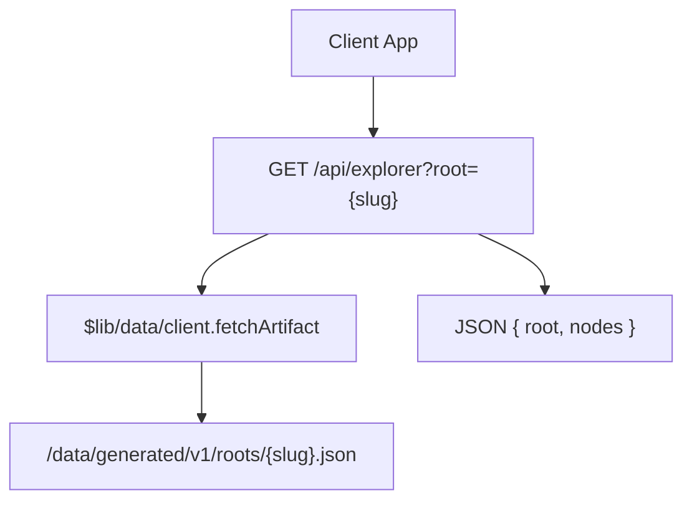
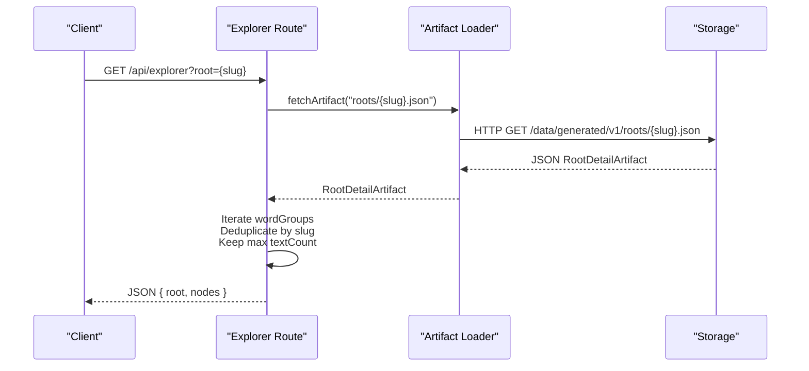
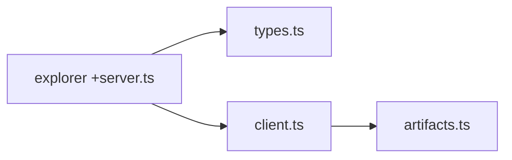

# Root Explorer

<cite>
**Referenced Files in This Document**
- [src/routes/api/explorer/+server.ts](file://src/routes/api/explorer/+server.ts)
- [src/lib/data/types.ts](file://src/lib/data/types.ts)
- [src/lib/data/client.ts](file://src/lib/data/client.ts)
- [src/lib/data/artifacts.ts](file://src/lib/data/artifacts.ts)
- [src/routes/root/[slug]/+page.ts](file://src/routes/root/[slug]/+page.ts)
- [src/lib/components/corpus-explorer-graph.svelte](file://src/lib/components/corpus-explorer-graph.svelte)
</cite>

## Table of Contents
1. [Introduction](#introduction)
2. [Project Structure](#project-structure)
3. [Core Components](#core-components)
4. [Architecture Overview](#architecture-overview)
5. [Detailed Component Analysis](#detailed-component-analysis)
6. [Dependency Analysis](#dependency-analysis)
7. [Performance Considerations](#performance-considerations)
8. [Troubleshooting Guide](#troubleshooting-guide)
9. [Conclusion](#conclusion)

## Introduction
This document provides detailed API documentation for the root-based explorer endpoint that powers word-family exploration around Sanskrit roots (dhātus). The endpoint returns a normalized nodes array suitable for building interactive explorers, including frequency-weighted words derived from a given root. It explains how the server retrieves RootDetailArtifact data, processes wordGroups to extract unique words with their textCount values, and constructs the response structure used by client components.

## Project Structure
The root explorer endpoint is implemented as a SvelteKit route handler under the API routes. It consumes versioned artifacts generated by the corpus pipeline and returns a compact graph-friendly payload.

**Diagram sources**
- [src/routes/api/explorer/+server.ts:28-47](file://src/routes/api/explorer/+server.ts#L28-L47)
- [src/lib/data/client.ts:6-16](file://src/lib/data/client.ts#L6-L16)
- [src/lib/data/artifacts.ts:1-2](file://src/lib/data/artifacts.ts#L1-L2)

**Section sources**
- [src/routes/api/explorer/+server.ts:1-121](file://src/routes/api/explorer/+server.ts#L1-L121)
- [src/lib/data/client.ts:1-16](file://src/lib/data/client.ts#L1-L16)
- [src/lib/data/artifacts.ts:1-26](file://src/lib/data/artifacts.ts#L1-L26)

## Core Components
- Endpoint handler: GET /api/explorer with query parameters root or word.
- Data model: RootDetailArtifact defines the shape of root detail artifacts, including wordGroups and per-word textCount.
- Artifact loader: fetchArtifact resolves versioned artifact paths and caches requests.
- Node model: ExplorerNode defines id, label, type, weight, count fields returned in the nodes array.

Key responsibilities:
- Parse query parameters.
- Load root artifact by slug.
- Aggregate unique words across groups, keeping highest textCount per word.
- Return nodes array with standardized fields.

**Section sources**
- [src/routes/api/explorer/+server.ts:7-13](file://src/routes/api/explorer/+server.ts#L7-L13)
- [src/lib/data/types.ts:72-91](file://src/lib/data/types.ts#L72-L91)
- [src/lib/data/client.ts:6-16](file://src/lib/data/client.ts#L6-L16)

## Architecture Overview
The endpoint follows a simple request-response flow:
- Extract root slug from query string.
- Fetch RootDetailArtifact from versioned storage.
- Iterate over all wordGroups and their words to build a deduplicated map keyed by word slug.
- For each word, keep the entry with the maximum textCount.
- Serialize nodes into a flat array and return.

**Diagram sources**
- [src/routes/api/explorer/+server.ts:28-47](file://src/routes/api/explorer/+server.ts#L28-L47)
- [src/lib/data/client.ts:6-16](file://src/lib/data/client.ts#L6-L16)
- [src/lib/data/artifacts.ts:1-2](file://src/lib/data/artifacts.ts#L1-L2)

## Detailed Component Analysis

### Endpoint: GET /api/explorer?root={root-slug}
- Query parameter:
  - root: string — the dhātu slug (e.g., dhr, bhū, gam).
- Behavior:
  - Loads RootDetailArtifact for the given root slug.
  - Iterates through all wordGroups and their words.
  - Builds a Map keyed by word.slug to ensure uniqueness.
  - Keeps the entry with the highest textCount when duplicates exist.
  - Returns a JSON object with:
    - root: the requested slug
    - nodes: array of ExplorerNode objects

Response schema:
- root: string
- nodes: array of ExplorerNode where:
  - id: string — word slug
  - label: string — headword
  - type: 'word'
  - weight: number — textCount
  - count: number — textCount

Error handling:
- If the root artifact cannot be fetched or parsed, the endpoint returns an empty nodes array while preserving the root field.

Request examples:
- GET /api/explorer?root=dhr
- GET /api/explorer?root=bhu
- GET /api/explorer?root=gam

Response example (conceptual):
- { root: "dhr", nodes: [{ id: "dharma", label: "dharma", type: "word", weight: 112, count: 112 }, ...] }

Integration patterns:
- Expand a root node in a graph UI by calling this endpoint and appending nodes to the visualization.
- Use nodes to render frequency-weighted word clouds or radial layouts.
- Sort nodes by count descending to highlight most frequent lemmas.

**Section sources**
- [src/routes/api/explorer/+server.ts:28-47](file://src/routes/api/explorer/+server.ts#L28-L47)
- [src/lib/data/types.ts:72-91](file://src/lib/data/types.ts#L72-L91)

### Data Model: RootDetailArtifact
RootDetailArtifact contains:
- dhatu: root metadata
- neighbors: previous and next roots
- wordGroups: array of groups, each with title and words
- sutras: root sutras
- wordCount: total derived words

Each word in wordGroups.words includes:
- slug: string
- headword: string
- definitions: string[]
- dictionaries: string[]
- basis: string
- textCount: number

Processing logic:
- The endpoint flattens all words across groups.
- Deduplicates by slug.
- Retains the maximum textCount per slug.

Complexity:
- Time: O(W) where W is total number of words across all groups.
- Space: O(U) where U is number of unique word slugs.

**Section sources**
- [src/lib/data/types.ts:72-91](file://src/lib/data/types.ts#L72-L91)
- [src/routes/api/explorer/+server.ts:35-43](file://src/routes/api/explorer/+server.ts#L35-L43)

### Artifact Loading: fetchArtifact
- Resolves versioned artifact path using ARTIFACT_BASE and relativePath.
- Caches in-flight and completed requests to avoid duplicate network calls.
- Throws on non-ok responses; the endpoint catches errors and returns empty nodes.

Versioning:
- Version is v1 and base path is /data/generated/v1.

**Section sources**
- [src/lib/data/client.ts:6-16](file://src/lib/data/client.ts#L6-L16)
- [src/lib/data/artifacts.ts:1-2](file://src/lib/data/artifacts.ts#L1-L2)

### Client Usage Example: Corpus Explorer Graph
A component expands a root node by calling the endpoint and adding new nodes to the graph.

Flow:
- On expandRoot(root), call GET /api/explorer?root=root.id.
- Parse nodes and merge with existing nodes.
- Add edges from root to each new word node.
- Render updated graph.

Error handling:
- On failure, remove the expanded root from the set of expanded roots.

**Section sources**
- [src/lib/components/corpus-explorer-graph.svelte:83-103](file://src/lib/components/corpus-explorer-graph.svelte#L83-L103)

### Error Handling and Not Found Cases
- When a root does not exist or fetching fails, the endpoint returns { root: slug, nodes: [] }.
- For page-level loading, a 404 error is thrown if the root artifact is missing.

Examples:
- GET /api/explorer?root=nonexistent → { root: "nonexistent", nodes: [] }
- Page load for /root/nonexistent → 404 error with message indicating dhātu not found.

**Section sources**
- [src/routes/api/explorer/+server.ts:45-47](file://src/routes/api/explorer/+server.ts#L45-L47)
- [src/routes/root/[slug]/+page.ts:6-12](file://src/routes/root/[slug]/+page.ts#L6-L12)

## Dependency Analysis
The endpoint depends on:
- types.ts for RootDetailArtifact definition.
- client.ts for artifact fetching and caching.
- artifacts.ts for versioned path resolution.

**Diagram sources**
- [src/routes/api/explorer/+server.ts:1-5](file://src/routes/api/explorer/+server.ts#L1-L5)
- [src/lib/data/types.ts:72-91](file://src/lib/data/types.ts#L72-L91)
- [src/lib/data/client.ts:1-16](file://src/lib/data/client.ts#L1-L16)
- [src/lib/data/artifacts.ts:1-26](file://src/lib/data/artifacts.ts#L1-L26)

**Section sources**
- [src/routes/api/explorer/+server.ts:1-5](file://src/routes/api/explorer/+server.ts#L1-L5)
- [src/lib/data/types.ts:72-91](file://src/lib/data/types.ts#L72-L91)
- [src/lib/data/client.ts:1-16](file://src/lib/data/client.ts#L1-L16)
- [src/lib/data/artifacts.ts:1-26](file://src/lib/data/artifacts.ts#L1-L26)

## Performance Considerations
- Deduplication uses a Map keyed by word slug, ensuring O(1) lookups during aggregation.
- Sorting is not performed at the endpoint level; clients can sort nodes by count as needed.
- Request caching via fetchArtifact reduces redundant network calls for identical artifacts.
- Avoid large payloads by limiting client-side rendering to top N nodes if necessary.

[No sources needed since this section provides general guidance]

## Troubleshooting Guide
Common issues:
- Empty nodes array:
  - Check if the root slug exists in artifacts.
  - Verify network connectivity and artifact availability.
- Unexpected counts:
  - Ensure wordGroups contain textCount values.
  - Confirm deduplication logic keeps the maximum textCount per slug.
- Integration failures:
  - Validate response shape matches expected ExplorerNode fields.
  - Handle error cases gracefully by checking nodes length.

Debugging steps:
- Inspect the artifact URL resolved by fetchArtifact.
- Log the raw RootDetailArtifact to verify wordGroups structure.
- Confirm client-side sorting and filtering logic.

**Section sources**
- [src/routes/api/explorer/+server.ts:35-47](file://src/routes/api/explorer/+server.ts#L35-L47)
- [src/lib/data/client.ts:6-16](file://src/lib/data/client.ts#L6-L16)

## Conclusion
The root-based explorer endpoint provides a clean, efficient interface for retrieving word families associated with a dhātu. By aggregating and deduplicating words across groups and returning a standardized nodes array, it enables flexible client implementations for visualizing lexical relationships and frequency distributions. Proper error handling ensures robust integration even when artifacts are missing or unavailable.

[No sources needed since this section summarizes without analyzing specific files]