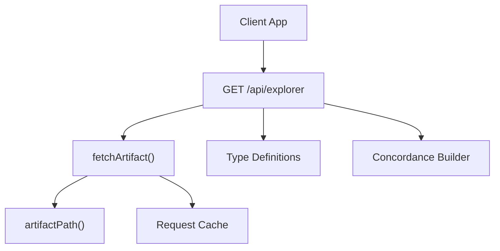
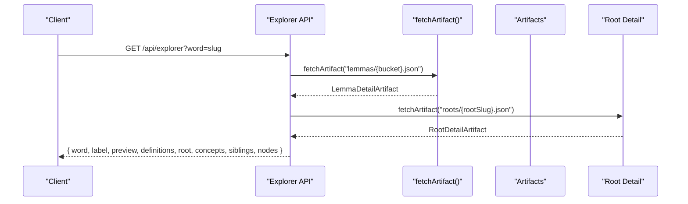
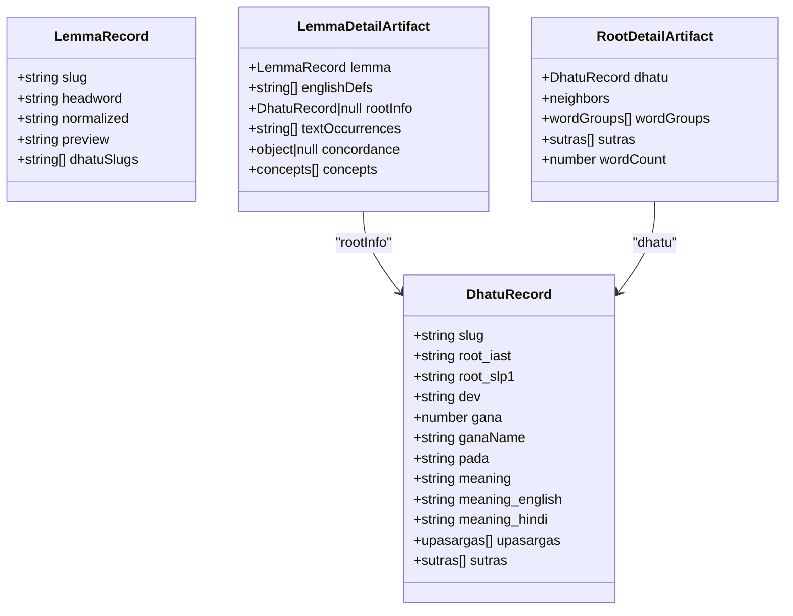
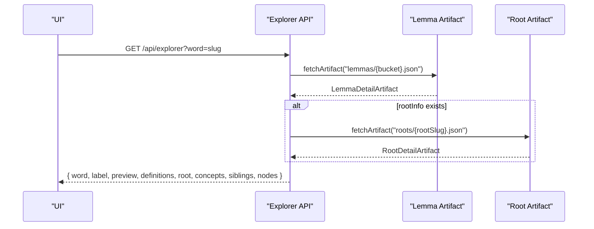
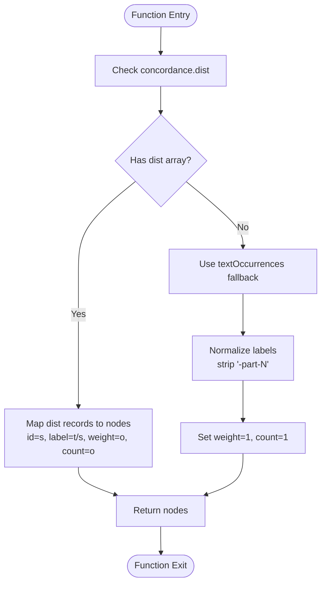
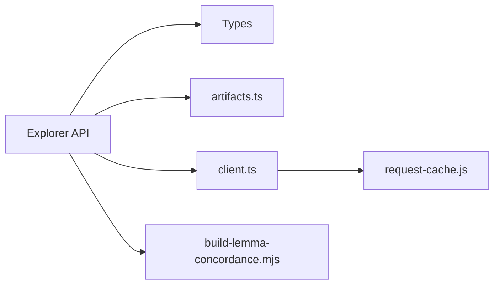

# Word Explorer

<cite>
**Referenced Files in This Document**
- [src/routes/api/explorer/+server.ts](file://src/routes/api/explorer/+server.ts)
- [src/lib/data/types.ts](file://src/lib/data/types.ts)
- [src/lib/data/artifacts.ts](file://src/lib/data/artifacts.ts)
- [src/lib/data/client.ts](file://src/lib/data/client.ts)
- [scripts/build-lemma-concordance.mjs](file://scripts/build-lemma-concordance.mjs)
</cite>

## Table of Contents
1. [Introduction](#introduction)
2. [Project Structure](#project-structure)
3. [Core Components](#core-components)
4. [Architecture Overview](#architecture-overview)
5. [Detailed Component Analysis](#detailed-component-analysis)
6. [Dependency Analysis](#dependency-analysis)
7. [Performance Considerations](#performance-considerations)
8. [Troubleshooting Guide](#troubleshooting-guide)
9. [Conclusion](#conclusion)
10. [Appendices](#appendices)

## Introduction
This document provides comprehensive API documentation for the word-based explorer endpoint that powers the FractalDharma word analysis interface. It focuses on the GET /api/explorer?word={word-slug} query parameter and explains the complex response structure, including lemma details (headword, preview), English definitions (first 3), root information (slug, meaning, grammatical classification with ganaName and pada), concept mappings (conceptId and name), sibling words (related words from the same root with definitions, counts, and groups), and text distribution nodes (text occurrences with weights). It also clarifies concordance distribution logic, sibling word sorting by count, and text occurrence processing, and includes integration guidelines for building cross-referencing word analysis interfaces.

## Project Structure
The explorer endpoint is implemented as a SvelteKit server route under src/routes/api/explorer. It reads static artifacts generated during build time and returns normalized JSON responses tailored for UI consumption.

**Diagram sources**
- [src/routes/api/explorer/+server.ts:28-121](file://src/routes/api/explorer/+server.ts#L28-L121)
- [src/lib/data/client.ts:6-16](file://src/lib/data/client.ts#L6-L16)
- [src/lib/data/artifacts.ts:24-26](file://src/lib/data/artifacts.ts#L24-L26)
- [scripts/build-lemma-concordance.mjs:160-190](file://scripts/build-lemma-concordance.mjs#L160-L190)

**Section sources**
- [src/routes/api/explorer/+server.ts:28-121](file://src/routes/api/explorer/+server.ts#L28-L121)
- [src/lib/data/client.ts:6-16](file://src/lib/data/client.ts#L6-L16)
- [src/lib/data/artifacts.ts:24-26](file://src/lib/data/artifacts.ts#L24-L26)

## Core Components
- Explorer Server Route: Handles GET requests, supports both root and word modes, and constructs the explorer response payload.
- Artifact Utilities: Normalizes keys and computes bucketing for lemmas to locate artifact files efficiently.
- Data Types: Defines TypeScript interfaces for LemmaDetailArtifact and RootDetailArtifact used by the endpoint.
- Request Cache: Deduplicates concurrent requests and caches successful results.

Key responsibilities:
- Resolve lemma detail from lemmas artifacts using bucketed filenames.
- Build text distribution nodes from either concordance.dist or textOccurrences fallback.
- Aggregate concepts mapped to the lemma.
- Compute sibling words from the root’s wordGroups, excluding the current word, and sort by descending count.
- Return a consistent JSON shape for UI rendering.

**Section sources**
- [src/routes/api/explorer/+server.ts:28-121](file://src/routes/api/explorer/+server.ts#L28-L121)
- [src/lib/data/artifacts.ts:14-18](file://src/lib/data/artifacts.ts#L14-L18)
- [src/lib/data/types.ts:63-91](file://src/lib/data/types.ts#L63-L91)
- [src/lib/data/client.ts:6-16](file://src/lib/data/client.ts#L6-L16)

## Architecture Overview
The endpoint follows a simple request-response flow over static artifacts. The client calls the API with a word slug; the server fetches the corresponding lemma artifact, derives text nodes and sibling words, and returns a structured response.

**Diagram sources**
- [src/routes/api/explorer/+server.ts:50-116](file://src/routes/api/explorer/+server.ts#L50-L116)
- [src/lib/data/client.ts:6-16](file://src/lib/data/client.ts#L6-L16)

## Detailed Component Analysis

### Endpoint Specification
- Method: GET
- Path: /api/explorer
- Query Parameters:
  - word: string (required for word mode) — ASCII-normalized lemma slug
- Response Shape (word mode):
  - word: string — the requested slug
  - label: string — headword from lemma
  - preview: string — short preview from lemma
  - definitions: string[] — first 3 English definitions
  - root: object | null — contains slug, label (√root_iast), meaning, dev, ganaName, pada
  - concepts: array — each item has id (conceptId) and label (name)
  - siblings: array — items include id (slug), label (headword), definition (first definition), count (textCount), group (group title); sorted by count descending, limited to top 18
  - nodes: array — text distribution nodes with id (text slug), label (title or slug), type "text", weight (occurrence weight), count (occurrence count)

Error behavior:
- If the lemma artifact is missing or an error occurs, the endpoint returns { word: slug, nodes: [] }.

**Section sources**
- [src/routes/api/explorer/+server.ts:50-116](file://src/routes/api/explorer/+server.ts#L50-L116)

### Concordance Distribution Logic
- Primary source: detail.concordance.dist if present and shaped as an array of objects with fields s (slug), t (title), o (occurrence weight/count).
- Fallback source: detail.textOccurrences (array of slugs), where each node gets default weight and count of 1, and label derived by stripping part suffixes like “-part-N”.

Processing steps:
- If concordance.dist exists, map each record to a node with id=s, label=t or s, weight=o, count=o.
- Otherwise, map each text occurrence slug to a node with id=text, label=text without “-part-N” suffix, weight=1, count=1.

Complexity:
- Linear in the number of distribution records or text occurrences.

**Section sources**
- [src/routes/api/explorer/+server.ts:55-65](file://src/routes/api/explorer/+server.ts#L55-L65)
- [scripts/build-lemma-concordance.mjs:160-190](file://scripts/build-lemma-concordance.mjs#L160-L190)

### Sibling Words Computation
- Source: RootDetailArtifact.wordGroups containing arrays of words with slug, headword, definitions, textCount, etc.
- Excludes the current word slug.
- Keeps only the highest textCount per slug across groups.
- Sorts by descending count and slices to top 18.
- Each sibling includes:
  - id: word.slug
  - label: word.headword
  - definition: word.definitions[0]
  - count: word.textCount
  - group: group.title

Sorting rationale:
- Prioritizes more frequently occurring lemmas within the root field to highlight prominent siblings.

**Section sources**
- [src/routes/api/explorer/+server.ts:71-96](file://src/routes/api/explorer/+server.ts#L71-L96)
- [src/lib/data/types.ts:72-91](file://src/lib/data/types.ts#L72-L91)

### Text Occurrence Processing
- When concordance.dist is absent, textOccurrences are processed into nodes.
- Label normalization removes “-part-N” suffixes to unify surface forms.
- Default weight and count set to 1 when not provided by concordance.dist.

Edge cases:
- Empty textOccurrences yields empty nodes array.
- Malformed data handled gracefully by returning minimal nodes.

**Section sources**
- [src/routes/api/explorer/+server.ts:58-65](file://src/routes/api/explorer/+server.ts#L58-L65)

### Concept Mappings
- Concepts are extracted directly from detail.concepts.
- Each concept maps to id (conceptId) and label (name).
- Used to link lemmas to semantic core pages.

**Section sources**
- [src/routes/api/explorer/+server.ts:66-69](file://src/routes/api/explorer/+server.ts#L66-L69)
- [src/lib/data/types.ts:63-70](file://src/lib/data/types.ts#L63-L70)

### Root Information
- If detail.rootInfo exists, it is included with:
  - slug: root identifier
  - label: formatted as √root_iast
  - meaning: root meaning
  - dev: Devanagari representation
  - ganaName: grammatical class name
  - pada: verb conjugation class indicator

**Section sources**
- [src/routes/api/explorer/+server.ts:102-109](file://src/routes/api/explorer/+server.ts#L102-L109)
- [src/lib/data/types.ts:48-61](file://src/lib/data/types.ts#L48-L61)

### Data Models Diagram

**Diagram sources**
- [src/lib/data/types.ts:40-91](file://src/lib/data/types.ts#L40-L91)

### Sequence Diagram: Word Mode Flow

**Diagram sources**
- [src/routes/api/explorer/+server.ts:50-116](file://src/routes/api/explorer/+server.ts#L50-L116)

### Flowchart: Concordance Distribution Processing

**Diagram sources**
- [src/routes/api/explorer/+server.ts:55-65](file://src/routes/api/explorer/+server.ts#L55-L65)

## Dependency Analysis
The explorer endpoint depends on:
- Artifact path utilities for constructing URLs.
- Fetch artifact client with caching.
- Type definitions ensuring correct shapes for lemma and root artifacts.
- Concordance builder script that produces the concordance.dist structure consumed at runtime.

**Diagram sources**
- [src/routes/api/explorer/+server.ts:1-5](file://src/routes/api/explorer/+server.ts#L1-L5)
- [src/lib/data/artifacts.ts:1-27](file://src/lib/data/artifacts.ts#L1-L27)
- [src/lib/data/client.ts:1-17](file://src/lib/data/client.ts#L1-L17)
- [scripts/build-lemma-concordance.mjs:1-31](file://scripts/build-lemma-concordance.mjs#L1-L31)

**Section sources**
- [src/routes/api/explorer/+server.ts:1-5](file://src/routes/api/explorer/+server.ts#L1-L5)
- [src/lib/data/artifacts.ts:1-27](file://src/lib/data/artifacts.ts#L1-L27)
- [src/lib/data/client.ts:1-17](file://src/lib/data/client.ts#L1-L17)
- [scripts/build-lemma-concordance.mjs:1-31](file://scripts/build-lemma-concordance.mjs#L1-L31)

## Performance Considerations
- Artifact fetching uses a request cache to deduplicate concurrent requests and avoid repeated network calls.
- Bucketing algorithm reduces lookup overhead by grouping lemmas into two-character buckets based on ASCII-normalized slugs.
- Sorting siblings by count and limiting to top 18 prevents excessive payload sizes.
- Concordance.dist mapping is linear and avoids heavy transformations.

Recommendations:
- Ensure concordance.dist is populated during build to minimize fallback processing.
- Monitor artifact sizes; consider pagination or lazy loading for large text distributions if needed.

**Section sources**
- [src/lib/data/client.ts:6-16](file://src/lib/data/client.ts#L6-L16)
- [src/lib/data/artifacts.ts:14-18](file://src/lib/data/artifacts.ts#L14-L18)
- [src/routes/api/explorer/+server.ts:90-92](file://src/routes/api/explorer/+server.ts#L90-L92)

## Troubleshooting Guide
Common issues:
- Missing lemma artifact: Returns { word: slug, nodes: [] }. Verify artifact generation and bucket naming.
- Empty nodes: Check concordance.dist presence and textOccurrences content.
- No siblings: Ensure rootInfo.slug exists and root artifact is accessible.
- Incorrect labels: Confirm text occurrence normalization strips “-part-N” suffixes.

Debugging tips:
- Inspect fetched lemma artifact via artifactPath utility.
- Validate RootDetailArtifact.wordGroups structure.
- Log concordance.dist shape to ensure expected fields (s, t, o).

**Section sources**
- [src/routes/api/explorer/+server.ts:54-54](file://src/routes/api/explorer/+server.ts#L54-L54)
- [src/routes/api/explorer/+server.ts:114-116](file://src/routes/api/explorer/+server.ts#L114-L116)
- [src/lib/data/artifacts.ts:24-26](file://src/lib/data/artifacts.ts#L24-L26)

## Conclusion
The word-based explorer endpoint provides a robust, efficient mechanism to retrieve lemma-centric exploration data, including definitions, root metadata, concept mappings, sibling lemmas, and text distribution nodes. By leveraging static artifacts and a caching layer, it delivers fast responses suitable for interactive word analysis interfaces. Integrators should rely on the documented response schema and handle edge cases such as missing artifacts and fallback distributions.

## Appendices

### Request/Response Examples
- Request:
  - GET /api/explorer?word=dharma
- Expected Response (word mode):
  - {
      word: "dharma",
      label: "dharma",
      preview: "...",
      definitions: ["...", "...", "..."],
      root: {
        slug: "dhr",
        label: "√dhṛ",
        meaning: "to hold, support, bear",
        dev: "धृ",
        ganaName: "bhvādi",
        pada: "U"
      },
      concepts: [
        { id: "law", label: "Law" },
        { id: "conduct", label: "Conduct" }
      ],
      siblings: [
        { id: "dhara", label: "dhara", definition: "bearing, holding", count: 38, group: "Group A" },
        { id: "dhriti", label: "dhṛti", definition: "steadfastness, firmness", count: 29, group: "Group B" }
      ],
      nodes: [
        { id: "bhagavadgita", label: "Bhagavadgītā", type: "text", weight: 47, count: 47 },
        { id: "mahabharata", label: "Mahābhārata", type: "text", weight: 138, count: 138 }
      ]
    }

- Error Response (missing lemma):
  - { word: "unknown", nodes: [] }

Integration guidelines:
- Use label and preview for display; use id for navigation to lemma pages.
- Render concepts as clickable chips linking to concept pages.
- Display siblings sorted by count; allow filtering by group.
- Visualize nodes as text occurrences with weights proportional to counts.

**Section sources**
- [src/routes/api/explorer/+server.ts:97-113](file://src/routes/api/explorer/+server.ts#L97-L113)
- [src/lib/data/types.ts:63-70](file://src/lib/data/types.ts#L63-L70)