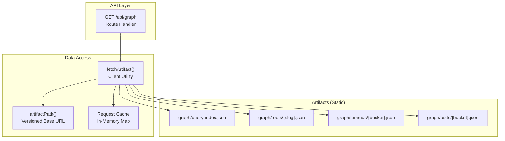
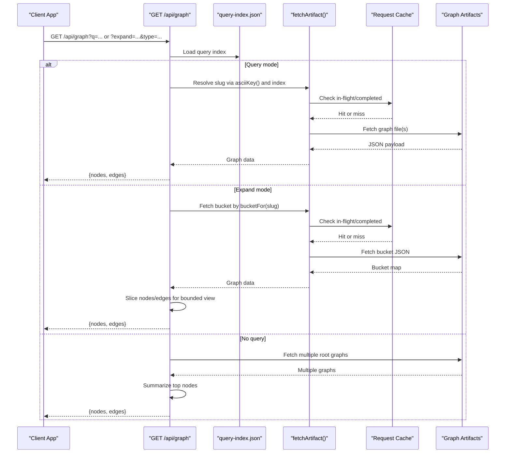
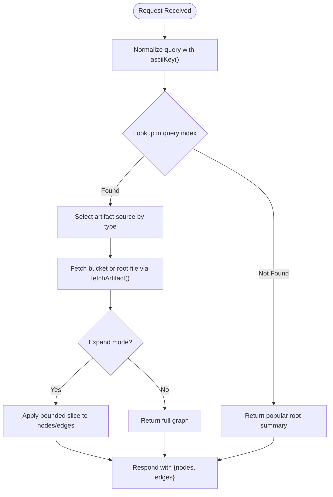
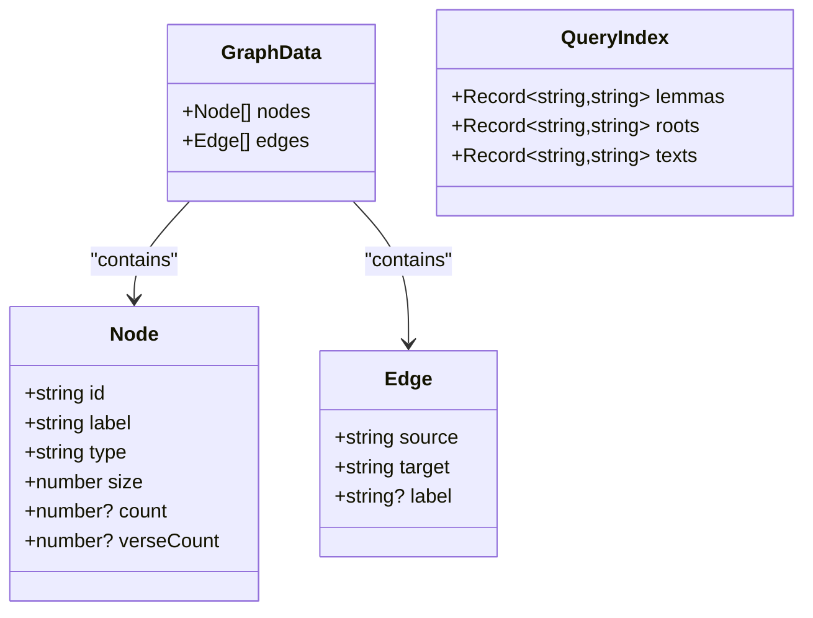
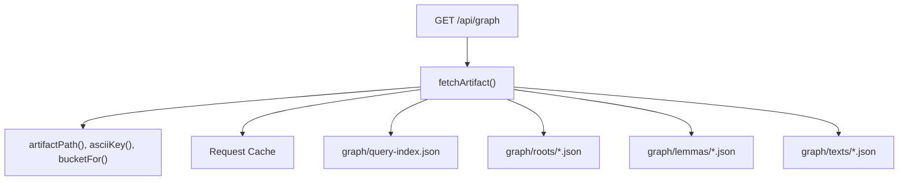

# Graph API

<cite>
**Referenced Files in This Document**
- [src/routes/api/graph/+server.ts](file://src/routes/api/graph/+server.ts)
- [src/lib/data/artifacts.ts](file://src/lib/data/artifacts.ts)
- [src/lib/data/client.ts](file://src/lib/data/client.ts)
- [src/lib/data/request-cache.js](file://src/lib/data/request-cache.js)
- [scripts/lib/build-query-artifacts.mjs](file://scripts/lib/build-query-artifacts.mjs)
- [scripts/build-query-artifacts.mjs](file://scripts/build-query-artifacts.mjs)
- [src/lib/components/word-graph.svelte](file://src/lib/components/word-graph.svelte)
- [docs/DEVELOPERS.md](file://docs/DEVELOPERS.md)
</cite>

## Table of Contents
1. Introduction
2. Project Structure
3. Core Components
4. Architecture Overview
5. Detailed Component Analysis
6. Dependency Analysis
7. Performance Considerations
8. Troubleshooting Guide
9. Conclusion

## Introduction
This document provides detailed API documentation for the Graph endpoint that serves network visualization data. The GET /api/graph endpoint returns precomputed graph artifacts containing nodes, edges, and configuration hints to render interactive visualizations of relationships between lemmas (words), roots (dhatus), and texts. It supports:
- Query-based retrieval via a compact query index
- Bounded expansion slices for large graphs
- Popular root summaries when no query is provided

The endpoint is designed for performance by reading static artifacts generated at build time and caching requests in-memory on the server.

## Project Structure
The Graph API is implemented as a SvelteKit route handler that reads from versioned artifact files. The artifacts are produced by build scripts and served through a client utility with an in-memory request cache.

**Diagram sources**
- [src/routes/api/graph/+server.ts](file://src/routes/api/graph/+server.ts)
- [src/lib/data/client.ts](file://src/lib/data/client.ts)
- [src/lib/data/artifacts.ts](file://src/lib/data/artifacts.ts)
- [src/lib/data/request-cache.js](file://src/lib/data/request-cache.js)

**Section sources**
- [src/routes/api/graph/+server.ts](file://src/routes/api/graph/+server.ts)
- [src/lib/data/client.ts](file://src/lib/data/client.ts)
- [src/lib/data/artifacts.ts](file://src/lib/data/artifacts.ts)
- [src/lib/data/request-cache.js](file://src/lib/data/request-cache.js)
- [scripts/build-query-artifacts.mjs](file://scripts/build-query-artifacts.mjs)

## Core Components
- Route handler: Implements GET /api/graph with two primary modes:
  - Query mode: Accepts q parameter; resolves lemma/root/text via query index and returns full graph
  - Expand mode: Accepts expand and type parameters; returns a bounded slice of a graph for large datasets
  - Default mode: When no q or expand is present, returns a small summary of popular roots
- Artifact utilities: Provide ASCII normalization, bucketing, and versioned paths for artifact URLs
- Client fetcher: Loads JSON artifacts with error handling and deduplication via an in-memory cache
- Request cache: Deduplicates concurrent requests and caches completed results per key

Key responsibilities:
- Normalize and resolve queries to slugs using a compact index
- Fetch precomputed graph artifacts for roots, lemmas, and texts
- Slice large graphs into bounded segments for efficient rendering
- Return consistent response shapes for nodes and edges

**Section sources**
- [src/routes/api/graph/+server.ts](file://src/routes/api/graph/+server.ts)
- [src/lib/data/artifacts.ts](file://src/lib/data/artifacts.ts)
- [src/lib/data/client.ts](file://src/lib/data/client.ts)
- [src/lib/data/request-cache.js](file://src/lib/data/request-cache.js)

## Architecture Overview
The Graph API follows a thin-route pattern: it does not compute graphs at runtime but reads prebuilt artifacts. Build-time scripts generate:
- A query index mapping normalized keys to slugs
- Root graphs as single files
- Lemma and text graphs organized into buckets by slug prefix

**Diagram sources**
- [src/routes/api/graph/+server.ts](file://src/routes/api/graph/+server.ts)
- [src/lib/data/client.ts](file://src/lib/data/client.ts)
- [src/lib/data/request-cache.js](file://src/lib/data/request-cache.js)
- [scripts/lib/build-query-artifacts.mjs](file://scripts/lib/build-query-artifacts.mjs)

## Detailed Component Analysis

### Endpoint Specification: GET /api/graph
- Purpose: Retrieve graph data for visualization based on query or expand parameters
- Query parameters:
  - q: Search string; normalized via asciiKey and resolved against query index
  - expand: Target slug to expand into a bounded graph slice
  - type: One of "root", "text", or default "lemma"; used with expand to select artifact source
- Behavior:
  - If expand is provided:
    - Determine artifact source by type
    - Fetch graph and return a bounded slice starting at a fixed offset
  - Else if q is provided:
    - Normalize q and look up lemma/root/text slug in query index
    - Return corresponding full graph
  - Else:
    - Return a small summary composed of one node from each of several popular roots

Response schema:
- nodes: Array of objects with fields id, label, type, size, and optional count and verseCount
- edges: Array of objects with fields source, target, and optional label

Notes:
- Node types include "word", "root", "text", and "sutra"
- Edge labels describe relationships such as "appears in"
- For expand mode, only a subset of nodes and edges is returned to keep payloads small

**Section sources**
- [src/routes/api/graph/+server.ts](file://src/routes/api/graph/+server.ts)
- [docs/DEVELOPERS.md](file://docs/DEVELOPERS.md)

### Data Structures and Schema
Node object:
- id: Unique identifier for the node
- label: Human-readable name
- type: Category ("word" | "root" | "text" | "sutra")
- size: Numeric weight influencing visualization radius
- count: Optional numeric frequency or occurrence count
- verseCount: Optional number of verses for text nodes

Edge object:
- source: ID of the source node
- target: ID of the target node
- label: Optional relationship description

Graph configuration:
- The endpoint returns nodes and edges arrays; additional configuration can be inferred from node sizes and edge labels
- Visualization components interpret these fields to determine layout and styling

Example usage patterns:
- Query mode: GET /api/graph?q=dharma
- Expand mode: GET /api/graph?expand=dhr&type=root
- Default summary: GET /api/graph

**Section sources**
- [src/routes/api/graph/+server.ts](file://src/routes/api/graph/+server.ts)
- [scripts/lib/build-query-artifacts.mjs](file://scripts/lib/build-query-artifacts.mjs)

### Query Resolution and Artifact Loading
- asciiKey normalizes input strings to ASCII-safe keys for indexing
- bucketFor computes stable bucket names from slugs for organizing lemma/text graphs
- artifactPath builds versioned URLs under /data/generated/v1
- fetchArtifact loads JSON artifacts with error handling and deduplication via the request cache

**Diagram sources**
- [src/lib/data/artifacts.ts](file://src/lib/data/artifacts.ts)
- [src/lib/data/client.ts](file://src/lib/data/client.ts)
- [src/routes/api/graph/+server.ts](file://src/routes/api/graph/+server.ts)

**Section sources**
- [src/lib/data/artifacts.ts](file://src/lib/data/artifacts.ts)
- [src/lib/data/client.ts](file://src/lib/data/client.ts)
- [src/routes/api/graph/+server.ts](file://src/routes/api/graph/+server.ts)

### Build-Time Artifact Generation
Build scripts construct graph artifacts:
- Roots: Single JSON files per root slug
- Lemmas and Texts: Bucketed JSON maps keyed by slug
- Query index: Maps normalized keys to slugs for fast resolution

Key generation steps:
- Construct lemma graphs linking words to roots and texts
- Construct text graphs linking texts to appearing lemmas
- Write query index entries for lemmas, roots, and texts
- Persist artifacts under versioned base path

**Diagram sources**
- [src/routes/api/graph/+server.ts](file://src/routes/api/graph/+server.ts)
- [scripts/lib/build-query-artifacts.mjs](file://scripts/lib/build-query-artifacts.mjs)

**Section sources**
- [scripts/lib/build-query-artifacts.mjs](file://scripts/lib/build-query-artifacts.mjs)
- [scripts/build-query-artifacts.mjs](file://scripts/build-query-artifacts.mjs)

### Visualization Integration Patterns
Frontend components consume the Graph API to render interactive networks:
- word-graph.svelte fetches graphs via GET /api/graph?q=... and initializes a force-directed layout
- concept-graph.svelte demonstrates alternative layouts and interactions for different graph types

Integration tips:
- Use node.size to scale node radii
- Use edge.label to display relationship annotations
- Apply type-based color schemes for clarity
- Debounce search inputs to avoid redundant requests

**Section sources**
- [src/lib/components/word-graph.svelte](file://src/lib/components/word-graph.svelte)
- [src/lib/components/concept-graph.svelte](file://src/lib/components/concept-graph.svelte)

## Dependency Analysis
The Graph API depends on:
- SvelteKit RequestHandler for route processing
- Artifact utilities for path construction and normalization
- Client fetcher for artifact loading and error handling
- In-memory request cache for deduplication and performance

**Diagram sources**
- [src/routes/api/graph/+server.ts](file://src/routes/api/graph/+server.ts)
- [src/lib/data/client.ts](file://src/lib/data/client.ts)
- [src/lib/data/artifacts.ts](file://src/lib/data/artifacts.ts)
- [src/lib/data/request-cache.js](file://src/lib/data/request-cache.js)

**Section sources**
- [src/routes/api/graph/+server.ts](file://src/routes/api/graph/+server.ts)
- [src/lib/data/client.ts](file://src/lib/data/client.ts)
- [src/lib/data/artifacts.ts](file://src/lib/data/artifacts.ts)
- [src/lib/data/request-cache.js](file://src/lib/data/request-cache.js)

## Performance Considerations
- Precomputed artifacts: All graphs are built at compile time, eliminating runtime computation overhead
- Bounded slices: Expand mode returns limited subsets of nodes and edges to reduce payload size
- In-memory caching: Concurrent identical requests are deduplicated and cached until process restart
- CDN-friendly paths: Versioned artifact URLs enable browser and CDN caching strategies
- Minimal route logic: The handler performs lightweight resolution and slicing, keeping CPU usage low

Recommendations:
- Use expand mode for large graphs to control initial load size
- Implement client-side pagination or progressive loading for deeper exploration
- Leverage browser cache headers for artifact files
- Avoid frequent re-fetching of the same query; debounce user input

[No sources needed since this section provides general guidance]

## Troubleshooting Guide
Common issues and resolutions:
- HTTP errors during artifact loading:
  - Ensure artifact files exist under the versioned base path
  - Verify correct slug and bucket naming conventions
- Empty responses:
  - Confirm query normalization matches index keys
  - Validate expand and type parameters align with available artifacts
- Stale or inconsistent data:
  - Rebuild artifacts to refresh query index and graph files
  - Clear in-memory cache if necessary (process restart clears cache)

Error handling behavior:
- Non-OK responses throw descriptive errors
- Missing graphs return empty nodes and edges arrays
- Exceptions during graph fetching are caught and result in empty responses

**Section sources**
- [src/lib/data/client.ts](file://src/lib/data/client.ts)
- [src/routes/api/graph/+server.ts](file://src/routes/api/graph/+server.ts)

## Conclusion
The Graph API provides a high-performance, artifact-driven interface for retrieving network visualization data. By leveraging precomputed graphs, a compact query index, and in-memory caching, it delivers responsive experiences for exploring relationships among lemmas, roots, and texts. Clients should use query mode for targeted searches and expand mode for controlled exploration of large graphs, integrating with visualization components to render interactive networks efficiently.

[No sources needed since this section summarizes without analyzing specific files]